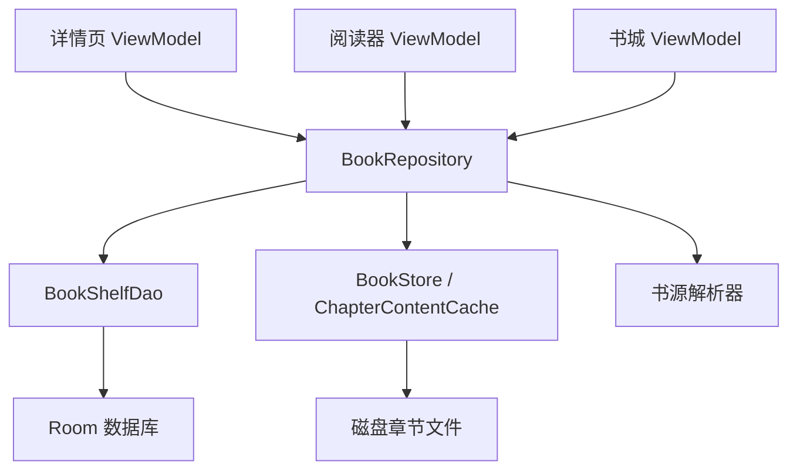
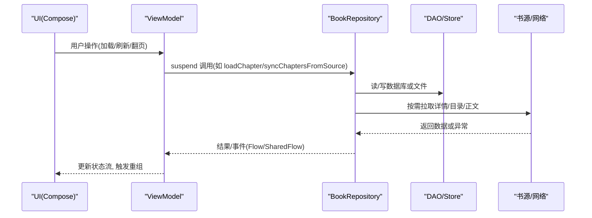
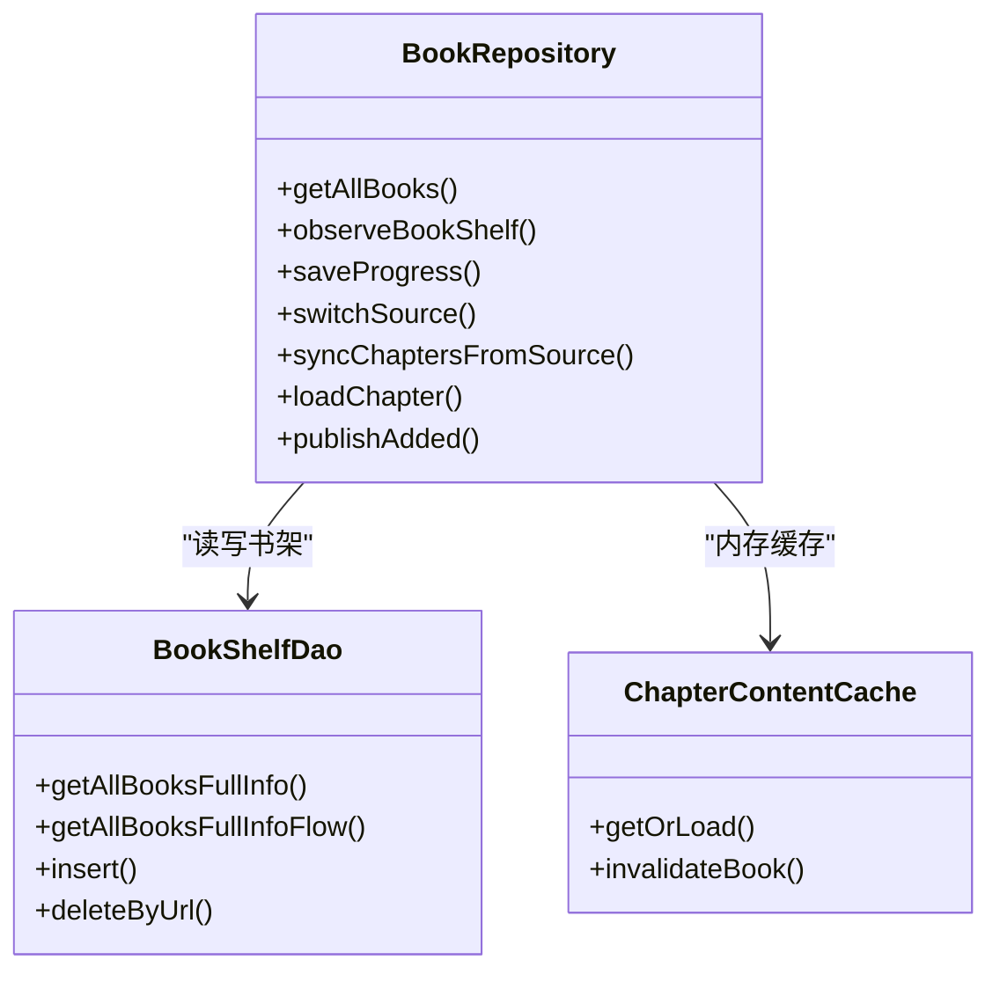
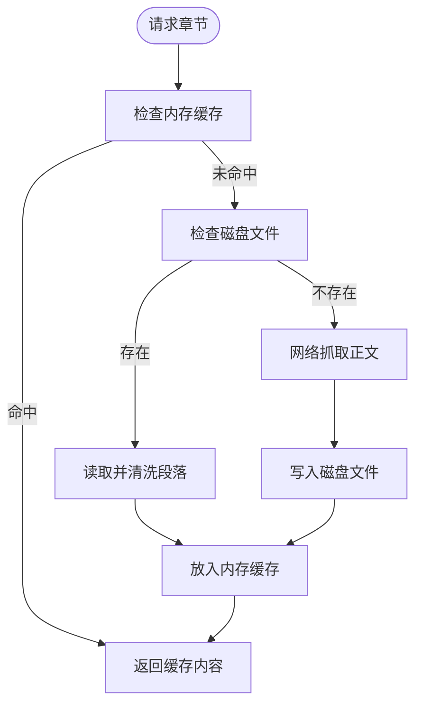
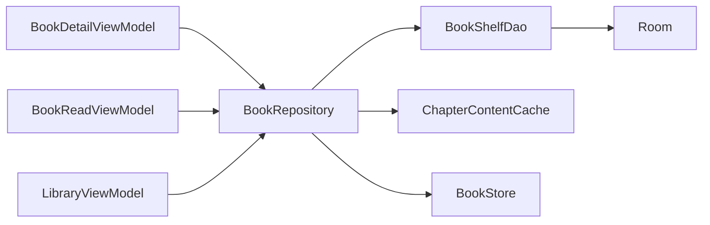

# 数据流模式

<cite>
**本文引用的文件**
- [BookRepository.kt](file://lib_book_common/src/main/java/com/ebook/common/repository/BookRepository.kt)
- [BookShelfDao.kt](file://lib_ebook_db/src/main/java/com/ebook/db/dao/BookShelfDao.kt)
- [ChapterContentCache.kt](file://lib_book_common/src/main/java/com/ebook/common/store/ChapterContentCache.kt)
- [BookDetailViewModel.kt](file://module_book/src/main/java/com/ebook/book/mvvm/viewmodel/BookDetailViewModel.kt)
- [LibraryViewModel.kt](file://module_find/src/main/java/com/ebook/find/mvvm/viewmodel/LibraryViewModel.kt)
- [BookReadViewModel.kt](file://module_book/src/main/java/com/ebook/book/mvvm/viewmodel/BookReadViewModel.kt)
</cite>

## 目录
1. [简介](#简介)
2. [项目结构](#项目结构)
3. [核心组件](#核心组件)
4. [架构总览](#架构总览)
5. [详细组件分析](#详细组件分析)
6. [依赖关系分析](#依赖关系分析)
7. [性能考量](#性能考量)
8. [故障排查指南](#故障排查指南)
9. [结论](#结论)

## 简介
本文件聚焦 MVVM 架构下的数据流向与处理模式，围绕 Repository 模式、协程与 Flow、缓存策略、错误处理、数据一致性与性能优化展开。通过仓库级 BookRepository 的单一事实源，结合 ViewModel 的状态流与响应式组合，实现从 UI 到存储/网络的一致、可观测、可恢复的数据流。

## 项目结构
- 模块分层：UI（Activity/Compose）→ ViewModel → Repository → DAO/Store/Source → 数据库/网络/文件系统
- 关键路径：
  - 书架与详情：BookDetailViewModel → BookRepository → BookShelfDao + BookStore + ChapterContentCache
  - 书城书库：LibraryViewModel → BookSourceRepository（不在本文重点）→ BookSourceManager
  - 阅读器：BookReadViewModel → BookRepository → ChapterReader/BookStore/ChapterContentCache

图示来源
- [BookDetailViewModel.kt:52-101](file://module_book/src/main/java/com/ebook/book/mvvm/viewmodel/BookDetailViewModel.kt#L52-L101)
- [BookReadViewModel.kt:15-112](file://module_book/src/main/java/com/ebook/book/mvvm/viewmodel/BookReadViewModel.kt#L15-L112)
- [BookRepository.kt:52-868](file://lib_book_common/src/main/java/com/ebook/common/repository/BookRepository.kt#L52-L868)
- [BookShelfDao.kt:19-109](file://lib_ebook_db/src/main/java/com/ebook/db/dao/BookShelfDao.kt#L19-L109)

章节来源
- [BookDetailViewModel.kt:52-101](file://module_book/src/main/java/com/ebook/book/mvvm/viewmodel/BookDetailViewModel.kt#L52-L101)
- [BookReadViewModel.kt:15-112](file://module_book/src/main/java/com/ebook/book/mvvm/viewmodel/BookReadViewModel.kt#L15-L112)
- [BookRepository.kt:52-868](file://lib_book_common/src/main/java/com/ebook/common/repository/BookRepository.kt#L52-L868)
- [BookShelfDao.kt:19-109](file://lib_ebook_db/src/main/java/com/ebook/db/dao/BookShelfDao.kt#L19-L109)

## 核心组件
- BookRepository：统一数据访问与事件发布；封装书架 CRUD、阅读进度、换源、目录重抓、正文读取与缓存失效、评论键聚合等
- ViewModel 层：以 StateFlow/SharedFlow 暴露 UI 状态，协调仓库调用与错误上报
- DAO/Store：Room DAO 提供持久化与 Flow 观察；BookStore/ChapterContentCache 负责章文件与内存缓存
- 书源解析：按 tag 路由到对应解析器，保证“书随源走”

章节来源
- [BookRepository.kt:52-868](file://lib_book_common/src/main/java/com/ebook/common/repository/BookRepository.kt#L52-L868)
- [BookDetailViewModel.kt:52-298](file://module_book/src/main/java/com/ebook/book/mvvm/viewmodel/BookDetailViewModel.kt#L52-L298)
- [BookReadViewModel.kt:15-140](file://module_book/src/main/java/com/ebook/book/mvvm/viewmodel/BookReadViewModel.kt#L15-L140)
- [ChapterContentCache.kt:25-63](file://lib_book_common/src/main/java/com/ebook/common/store/ChapterContentCache.kt#L25-L63)

## 架构总览
MVVM 数据流遵循“单向数据流 + 响应式状态”：
- UI 订阅 ViewModel 的 StateFlow/SharedFlow
- ViewModel 发起 suspend 函数调用仓库
- 仓库协调 DAO/Store/网络，必要时发射领域事件
- 事件与 Flow 回流驱动 UI 重组

图示来源
- [BookDetailViewModel.kt:103-209](file://module_book/src/main/java/com/ebook/book/mvvm/viewmodel/BookDetailViewModel.kt#L103-L209)
- [BookRepository.kt:455-600](file://lib_book_common/src/main/java/com/ebook/common/repository/BookRepository.kt#L455-L600)
- [BookShelfDao.kt:21-59](file://lib_ebook_db/src/main/java/com/ebook/db/dao/BookShelfDao.kt#L21-L59)

## 详细组件分析

### 数据流模式与 MVVM 协作
- 详情页：先本地渲染，再静默检查目录更新；失败不阻断本地可用内容
- 书城：基于默认源的 StateFlow 驱动分类与书库，SWR 策略秒开+后台刷新
- 阅读器：末章时增量追加新章，就地扩展目录而不替换实体

章节来源
- [BookDetailViewModel.kt:103-154](file://module_book/src/main/java/com/ebook/book/mvvm/viewmodel/BookDetailViewModel.kt#L103-L154)
- [LibraryViewModel.kt:123-289](file://module_find/src/main/java/com/ebook/find/mvvm/viewmodel/LibraryViewModel.kt#L123-L289)
- [BookReadViewModel.kt:85-112](file://module_book/src/main/java/com/ebook/book/mvvm/viewmodel/BookReadViewModel.kt#L85-L112)

### Repository 模式设计与实现
- 单一入口：所有书架相关读写、事件发布集中在 BookRepository
- 写事务边界：换源、目录追加等复杂写操作在事务内执行，保证原子性
- 事件总线：使用 SharedFlow 广播书架事件（添加、移除、进度更新、目录更新）

图示来源
- [BookRepository.kt:81-140](file://lib_book_common/src/main/java/com/ebook/common/repository/BookRepository.kt#L81-L140)
- [BookShelfDao.kt:21-90](file://lib_ebook_db/src/main/java/com/ebook/db/dao/BookShelfDao.kt#L21-L90)
- [ChapterContentCache.kt:25-63](file://lib_book_common/src/main/java/com/ebook/common/store/ChapterContentCache.kt#L25-L63)

章节来源
- [BookRepository.kt:81-140](file://lib_book_common/src/main/java/com/ebook/common/repository/BookRepository.kt#L81-L140)
- [BookShelfDao.kt:21-90](file://lib_ebook_db/src/main/java/com/ebook/db/dao/BookShelfDao.kt#L21-L90)

### 协程与 Flow 的应用
- 背压与冷/热流：
  - observeBookShelf 返回 Flow<List>，Room 失效自动推送
  - bookShelfEvents 为 SharedFlow，用于跨页面事件
- suspend 函数：
  - getAllBooksWithDetails、saveProgress、syncChaptersFromSource 等在 IO 调度器上执行
- 组合与转换：
  - LibraryViewModel 使用 combine/map/stateIn 组合多路事实，输出稳定 UI 状态

章节来源
- [BookRepository.kt:93-100](file://lib_book_common/src/main/java/com/ebook/common/repository/BookRepository.kt#L93-L100)
- [BookRepository.kt:76-77](file://lib_book_common/src/main/java/com/ebook/common/repository/BookRepository.kt#L76-L77)
- [LibraryViewModel.kt:159-167](file://module_find/src/main/java/com/ebook/find/mvvm/viewmodel/LibraryViewModel.kt#L159-L167)

### 数据缓存策略
- 内存缓存：ChapterContentCache 维护 LRU，容量覆盖当前章及前后各一章
- 磁盘缓存：BookStore 管理章文件存在性、写入与删除
- 网络请求：仅在缓存未命中或显式刷新时发起

图示来源
- [ChapterContentCache.kt:25-63](file://lib_book_common/src/main/java/com/ebook/common/store/ChapterContentCache.kt#L25-L63)
- [BookRepository.kt:455-475](file://lib_book_common/src/main/java/com/ebook/common/repository/BookRepository.kt#L455-L475)

章节来源
- [ChapterContentCache.kt:25-63](file://lib_book_common/src/main/java/com/ebook/common/store/ChapterContentCache.kt#L25-L63)
- [BookRepository.kt:455-475](file://lib_book_common/src/main/java/com/ebook/common/repository/BookRepository.kt#L455-L475)

### 错误处理模式
- 统一上报：ViewModel 使用 reportFailure 上报会话过期等通用错误
- 细粒度分支：
  - 书源缺失：抛出并提示“书源已失效”，不吞掉取消异常
  - 目录重抓失败：返回结构化结果（Throttled/Diverged/Appended/Failed），静默路径仅记日志
  - 网络/解析异常：捕获后置位 loading=false、loadError=true，避免永远转圈

章节来源
- [BookDetailViewModel.kt:248-297](file://module_book/src/main/java/com/ebook/book/mvvm/viewmodel/BookDetailViewModel.kt#L248-L297)
- [BookRepository.kt:512-600](file://lib_book_common/src/main/java/com/ebook/common/repository/BookRepository.kt#L512-L600)

### 数据一致性保证
- 事务：换源 commitSwitch 与目录追加使用 WriteTransactionRunner 包裹，确保“先插新、后删旧、吸收键”的原子性
- 并发控制：SharedFlow 事件有序发射；内存缓存用 Mutex 保护；阅读器追加目录单飞标志防并发
- 同步机制：启动时 reconcileContentStore 回收无主目录与残留文件

章节来源
- [BookRepository.kt:411-416](file://lib_book_common/src/main/java/com/ebook/common/repository/BookRepository.kt#L411-L416)
- [BookRepository.kt:584-597](file://lib_book_common/src/main/java/com/ebook/common/repository/BookRepository.kt#L584-L597)
- [BookRepository.kt:852-855](file://lib_book_common/src/main/java/com/ebook/common/repository/BookRepository.kt#L852-L855)

### 性能优化策略
- 预加载：内存缓存覆盖当前章前后各一章
- 增量更新：目录重抓只追加尾部新章，不改既有序号
- 批量操作：章节插入使用 insertAll；批量判定缓存章节索引
- SWR 策略：书城首次显示缓存，随后后台刷新

章节来源
- [ChapterContentCache.kt:59-63](file://lib_book_common/src/main/java/com/ebook/common/store/ChapterContentCache.kt#L59-L63)
- [BookRepository.kt:568-597](file://lib_book_common/src/main/java/com/ebook/common/repository/BookRepository.kt#L568-L597)
- [BookRepository.kt:619-628](file://lib_book_common/src/main/java/com/ebook/common/repository/BookRepository.kt#L619-L628)
- [LibraryViewModel.kt:239-269](file://module_find/src/main/java/com/ebook/find/mvvm/viewmodel/LibraryViewModel.kt#L239-L269)

## 依赖关系分析
- 视图模型依赖仓库：BookDetailViewModel、BookReadViewModel、LibraryViewModel 均注入 BookRepository 或相关管理器
- 仓库依赖 DAO/Store：BookRepository 通过 BookShelfDao 与 BookStore/ChapterContentCache 完成持久化与缓存
- DAO 依赖 Room：BookShelfDao 定义查询与 Flow 观察

图示来源
- [BookDetailViewModel.kt:52-101](file://module_book/src/main/java/com/ebook/book/mvvm/viewmodel/BookDetailViewModel.kt#L52-L101)
- [BookReadViewModel.kt:15-112](file://module_book/src/main/java/com/ebook/book/mvvm/viewmodel/BookReadViewModel.kt#L15-L112)
- [BookRepository.kt:52-868](file://lib_book_common/src/main/java/com/ebook/common/repository/BookRepository.kt#L52-L868)
- [BookShelfDao.kt:19-109](file://lib_ebook_db/src/main/java/com/ebook/db/dao/BookShelfDao.kt#L19-L109)

章节来源
- [BookDetailViewModel.kt:52-101](file://module_book/src/main/java/com/ebook/book/mvvm/viewmodel/BookDetailViewModel.kt#L52-L101)
- [BookReadViewModel.kt:15-112](file://module_book/src/main/java/com/ebook/book/mvvm/viewmodel/BookReadViewModel.kt#L15-L112)
- [BookRepository.kt:52-868](file://lib_book_common/src/main/java/com/ebook/common/repository/BookRepository.kt#L52-L868)
- [BookShelfDao.kt:19-109](file://lib_ebook_db/src/main/java/com/ebook/db/dao/BookShelfDao.kt#L19-L109)

## 性能考量
- 减少无效网络：限频窗口（isTocCheckDue）避免重复重抓目录
- 最小化 UI 抖动：SWR 先显示缓存，再替换为新数据
- 避免阻塞：loader 在锁外运行，读盘/网络不阻塞其他章节
- 合理缓存容量：内存缓存大小覆盖常见翻页场景

[本节为通用指导，无需特定文件引用]

## 故障排查指南
- 书城首帧空白：检查 defaultSource 是否为 null，确认 stateIn 初值与 Unknown 态渲染逻辑
- 详情页加载失败：确认 fetchBookInfo/fetchChapterList 的错误分支是否置 loadError
- 阅读器无法翻页：检查 ChapterContentCache 是否命中、BookStore 是否存在章文件
- 目录重抓无变化：确认 isTocCheckDue 窗口、ChapterTocDiff 判定与时间戳写入

章节来源
- [LibraryViewModel.kt:123-167](file://module_find/src/main/java/com/ebook/find/mvvm/viewmodel/LibraryViewModel.kt#L123-L167)
- [BookDetailViewModel.kt:168-209](file://module_book/src/main/java/com/ebook/book/mvvm/viewmodel/BookDetailViewModel.kt#L168-L209)
- [ChapterContentCache.kt:25-63](file://lib_book_common/src/main/java/com/ebook/common/store/ChapterContentCache.kt#L25-L63)
- [BookRepository.kt:512-600](file://lib_book_common/src/main/java/com/ebook/common/repository/BookRepository.kt#L512-L600)

## 结论
本项目通过 Repository 模式统一数据访问，结合协程与 Flow 构建响应式 MVVM 数据流。缓存策略兼顾速度与一致性，错误处理覆盖网络、解析与业务场景，事务与单飞标志保障并发安全。整体设计在保证用户体验的同时，提供了良好的可测试性与可维护性。