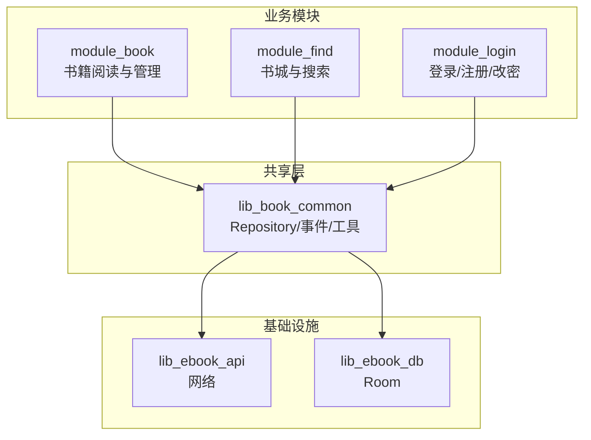
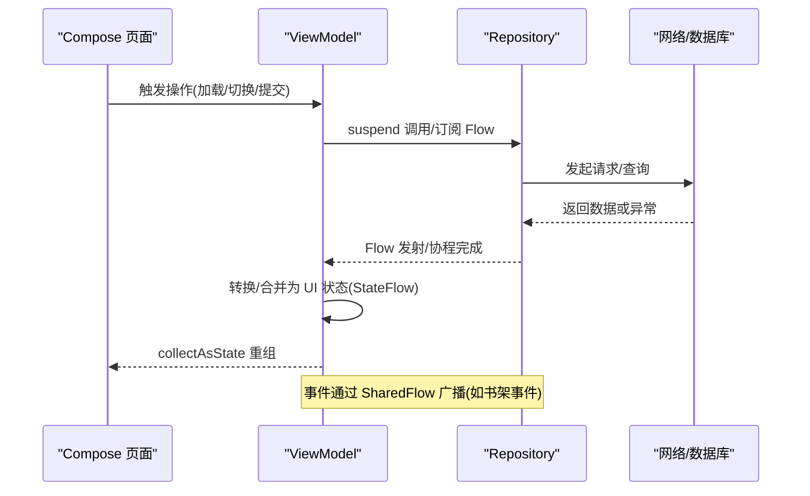
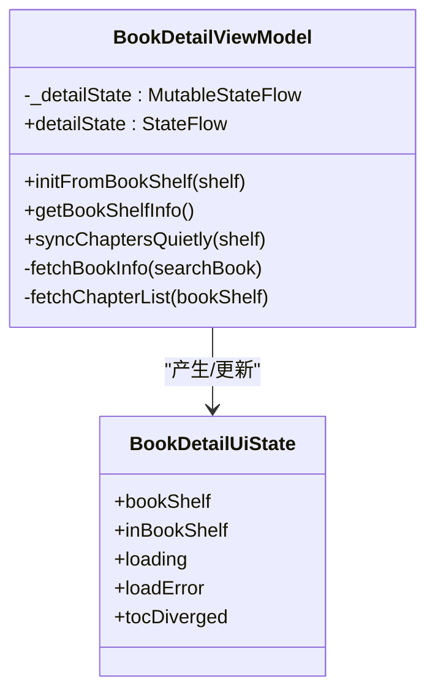
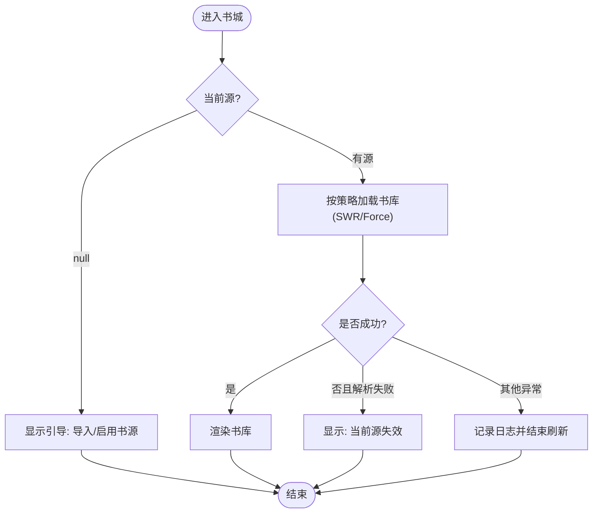
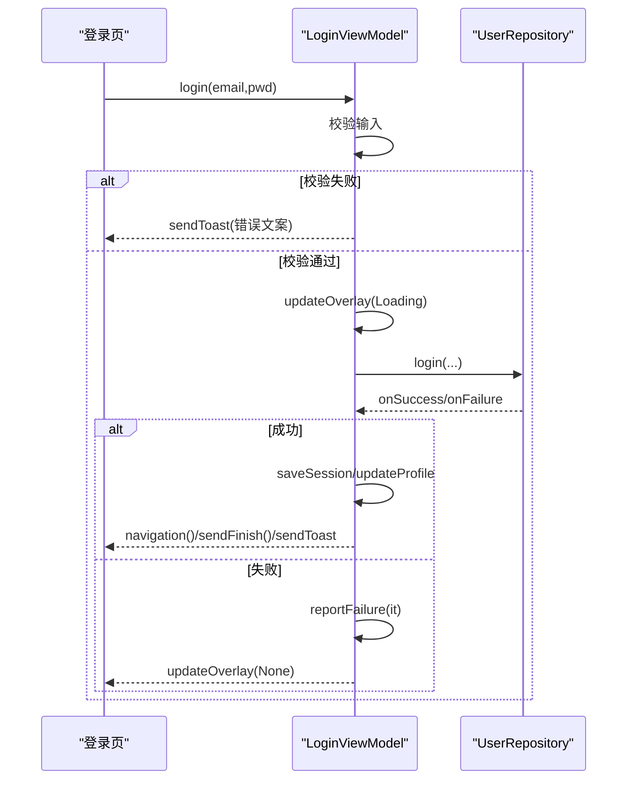
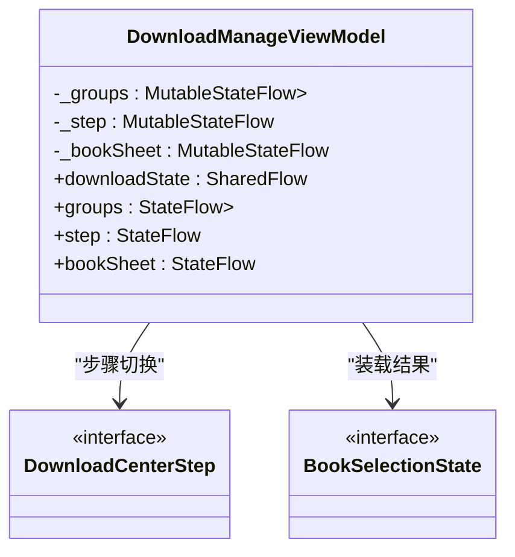
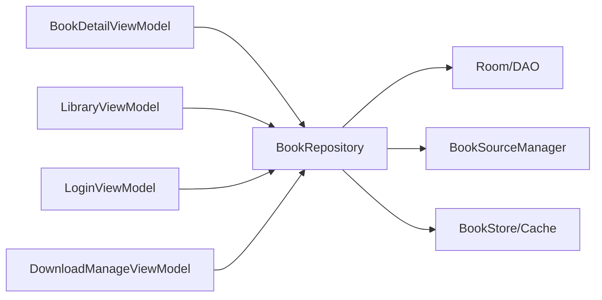

# 状态管理

<cite>
**本文引用的文件**   
- [BookDetailViewModel.kt](file://module_book/src/main/java/com/ebook/book/mvvm/viewmodel/BookDetailViewModel.kt)
- [LibraryViewModel.kt](file://module_find/src/main/java/com/ebook/find/mvvm/viewmodel/LibraryViewModel.kt)
- [LoginViewModel.kt](file://module_login/src/main/java/com/ebook/login/mvvm/viewmodel/LoginViewModel.kt)
- [DownloadManageViewModel.kt](file://module_book/src/main/java/com/ebook/book/mvvm/viewmodel/DownloadManageViewModel.kt)
- [BookRepository.kt](file://lib_book_common/src/main/java/com/ebook/common/repository/BookRepository.kt)
</cite>

## 目录
1. [简介](#简介)
2. [项目结构](#项目结构)
3. [核心组件](#核心组件)
4. [架构总览](#架构总览)
5. [详细组件分析](#详细组件分析)
6. [依赖关系分析](#依赖关系分析)
7. [性能考量](#性能考量)
8. [故障排查指南](#故障排查指南)
9. [结论](#结论)
10. [附录：常见状态模式示例与最佳实践](#附录常见状态模式示例与最佳实践)

## 简介
本文件聚焦 MVVM 架构下的状态管理模式，围绕 StateFlow、SharedFlow、冷流与热流选择原则、UI 状态封装（sealed class 状态机）、失败报告机制、Compose 中的状态提升与单向数据流、以及状态持久化策略展开。文档结合仓库中 BookDetailViewModel、LibraryViewModel、LoginViewModel、DownloadManageViewModel 等实现，给出可追溯的源码依据与实践建议。

## 项目结构
- 业务模块（module_book、module_find、module_login、module_me）通过 Hilt 注入 ViewModel，使用 BaseViewModel/BaseRefreshViewModel 基类承载页面状态。
- 共享层 lib_book_common 提供 Repository、事件总线（SharedFlow）与通用工具；网络与数据库分别在 lib_ebook_api 与 lib_ebook_db。
- 视图层采用 Compose，配合 Activity 基类消费一次性命令通道（Toast/Finish/Navigate），并通过 collectAsState 订阅 StateFlow 驱动重组。

**图表来源**
- [BookDetailViewModel.kt:1-30](file://module_book/src/main/java/com/ebook/book/mvvm/viewmodel/BookDetailViewModel.kt#L1-L30)
- [LibraryViewModel.kt:1-30](file://module_find/src/main/java/com/ebook/find/mvvm/viewmodel/LibraryViewModel.kt#L1-L30)
- [BookRepository.kt:1-35](file://lib_book_common/src/main/java/com/ebook/common/repository/BookRepository.kt#L1-L35)

**章节来源**
- [BookDetailViewModel.kt:1-30](file://module_book/src/main/java/com/ebook/book/mvvm/viewmodel/BookDetailViewModel.kt#L1-L30)
- [LibraryViewModel.kt:1-30](file://module_find/src/main/java/com/ebook/find/mvvm/viewmodel/LibraryViewModel.kt#L1-L30)
- [BookRepository.kt:1-35](file://lib_book_common/src/main/java/com/ebook/common/repository/BookRepository.kt#L1-L35)

## 核心组件
- 详情页状态封装：以 data class 作为 UI 状态，集中 loading、错误、分叉提示等，统一由 MutableStateFlow + asStateFlow 暴露，供 Compose 收集。
- 书城源状态机：使用 sealed interface/enum 表达“未知/无源/坏源/就绪”，将多路事实合并为单一 StateFlow，避免 UI 猜测。
- 下载中心：用 sealed interface 描述步骤与装载结果，配合 SharedFlow 接收服务进度，StateFlow 聚合分组数据。
- 事件总线：Repository 暴露 SharedFlow 事件（如书架变化），ViewModel 在 init 中订阅并更新本地快照，避免重复累积。

**章节来源**
- [BookDetailViewModel.kt:25-50](file://module_book/src/main/java/com/ebook/book/mvvm/viewmodel/BookDetailViewModel.kt#L25-L50)
- [LibraryViewModel.kt:27-76](file://module_find/src/main/java/com/ebook/find/mvvm/viewmodel/LibraryViewModel.kt#L27-L76)
- [DownloadManageViewModel.kt:29-106](file://module_book/src/main/java/com/ebook/book/mvvm/viewmodel/DownloadManageViewModel.kt#L29-L106)
- [BookRepository.kt:75-77](file://lib_book_common/src/main/java/com/ebook/common/repository/BookRepository.kt#L75-L77)

## 架构总览
MVVM 分层清晰：View（Compose）→ ViewModel（StateFlow/SharedFlow）→ Repository（Flow/协程）→ 网络/数据库。事件通过 SharedFlow 广播，UI 通过 StateFlow 响应式组合。

**图表来源**
- [BookDetailViewModel.kt:156-209](file://module_book/src/main/java/com/ebook/book/mvvm/viewmodel/BookDetailViewModel.kt#L156-L209)
- [LibraryViewModel.kt:195-289](file://module_find/src/main/java/com/ebook/find/mvvm/viewmodel/LibraryViewModel.kt#L195-L289)
- [BookRepository.kt:75-77](file://lib_book_common/src/main/java/com/ebook/common/repository/BookRepository.kt#L75-L77)

## 详细组件分析

### 详情页状态（BookDetailViewModel）
- UI 状态：data class 封装 bookShelf、inBookShelf、loading、loadError、tocDiverged；通过 MutableStateFlow + asStateFlow 暴露 detailState。
- 冷/热流选择：detailState 为热流（StateFlow），用于 UI 持续订阅；书架事件为热流（SharedFlow），仅传递一次性事件。
- 状态提升：Activity 持有 ViewModel，UI 通过 collectAsState(detailState) 组合；ViewModel 负责所有副作用（网络、解析、重抓）。
- 失败处理：解析器不可用抛特定异常时，统一上报 failure（reportFailure）并记录日志，置 loadError，确保不卡死 loading。
- 目录重抓：静默追加成功只提示条数，分叉设置 tocDiverged，失败仅记日志不打扰用户。

**图表来源**
- [BookDetailViewModel.kt:25-67](file://module_book/src/main/java/com/ebook/book/mvvm/viewmodel/BookDetailViewModel.kt#L25-L67)
- [BookDetailViewModel.kt:103-154](file://module_book/src/main/java/com/ebook/book/mvvm/viewmodel/BookDetailViewModel.kt#L103-L154)
- [BookDetailViewModel.kt:156-209](file://module_book/src/main/java/com/ebook/book/mvvm/viewmodel/BookDetailViewModel.kt#L156-L209)
- [BookDetailViewModel.kt:240-297](file://module_book/src/main/java/com/ebook/book/mvvm/viewmodel/BookDetailViewModel.kt#L240-L297)

**章节来源**
- [BookDetailViewModel.kt:25-67](file://module_book/src/main/java/com/ebook/book/mvvm/viewmodel/BookDetailViewModel.kt#L25-L67)
- [BookDetailViewModel.kt:103-154](file://module_book/src/main/java/com/ebook/book/mvvm/viewmodel/BookDetailViewModel.kt#L103-L154)
- [BookDetailViewModel.kt:156-209](file://module_book/src/main/java/com/ebook/book/mvvm/viewmodel/BookDetailViewModel.kt#L156-L209)
- [BookDetailViewModel.kt:240-297](file://module_book/src/main/java/com/ebook/book/mvvm/viewmodel/BookDetailViewModel.kt#L240-L297)

### 书城源状态机（LibraryViewModel）
- 状态机：LibrarySourceState 四档（Ready/NoSource/BrokenSource/Unknown），首帧 Unknown 整片留空，避免误导文案。
- 热流组合：currentSource、sources、_sourceUnusable 经 combine/map/stateIn 合成 sourceState，唯一判据驱动 UI。
- 刷新策略：下拉刷新强制走网络；换源先清空列表再拉；同源重拉增量更新。
- 失败分支：BookSourceNotFoundException 置 BrokenSource，不清列表也不进覆盖层；等待下一次 currentSource 变化自愈。

**图表来源**
- [LibraryViewModel.kt:27-76](file://module_find/src/main/java/com/ebook/find/mvvm/viewmodel/LibraryViewModel.kt#L27-L76)
- [LibraryViewModel.kt:159-167](file://module_find/src/main/java/com/ebook/find/mvvm/viewmodel/LibraryViewModel.kt#L159-L167)
- [LibraryViewModel.kt:239-289](file://module_find/src/main/java/com/ebook/find/mvvm/viewmodel/LibraryViewModel.kt#L239-L289)

**章节来源**
- [LibraryViewModel.kt:27-76](file://module_find/src/main/java/com/ebook/find/mvvm/viewmodel/LibraryViewModel.kt#L27-L76)
- [LibraryViewModel.kt:159-167](file://module_find/src/main/java/com/ebook/find/mvvm/viewmodel/LibraryViewModel.kt#L159-L167)
- [LibraryViewModel.kt:239-289](file://module_find/src/main/java/com/ebook/find/mvvm/viewmodel/LibraryViewModel.kt#L239-L289)

### 登录流程（LoginViewModel）
- 表单验证：邮箱/密码非空校验，失败直接 sendToast 并返回，避免无效请求。
- 加载态：updateOverlay(Loading) 包裹请求，finally 恢复 None，保证覆盖层回收。
- 成功后处置：保存会话、回跳原页或主界面、更新头像昵称、发送 Finish/Toast。
- 失败上报：统一 reportFailure，交由上层覆盖层/日志处理，不重复提示。

**图表来源**
- [LoginViewModel.kt:45-73](file://module_login/src/main/java/com/ebook/login/mvvm/viewmodel/LoginViewModel.kt#L45-L73)
- [LoginViewModel.kt:75-106](file://module_login/src/main/java/com/ebook/login/mvvm/viewmodel/LoginViewModel.kt#L75-L106)

**章节来源**
- [LoginViewModel.kt:45-73](file://module_login/src/main/java/com/ebook/login/mvvm/viewmodel/LoginViewModel.kt#L45-L73)
- [LoginViewModel.kt:75-106](file://module_login/src/main/java/com/ebook/login/mvvm/viewmodel/LoginViewModel.kt#L75-L106)

### 下载中心（DownloadManageViewModel）
- 步骤状态：DownloadCenterStep 一级/二级切换，stateIn 保持热流。
- 装载结果：BookSelectionState 三态（Loading/Absent/Failed）+ Ready，避免把“不在架”说成“加载中”。
- 服务进度：SharedFlow 接收 DownloadService 的进度，仅 replay=1 兜底当前进度，避免历史堆积。
- 分组聚合：groups 展示剩余章数与覆盖率，activeChapter 高亮当前下载章。

**图表来源**
- [DownloadManageViewModel.kt:29-106](file://module_book/src/main/java/com/ebook/book/mvvm/viewmodel/DownloadManageViewModel.kt#L29-L106)
- [DownloadManageViewModel.kt:121-147](file://module_book/src/main/java/com/ebook/book/mvvm/viewmodel/DownloadManageViewModel.kt#L121-L147)

**章节来源**
- [DownloadManageViewModel.kt:29-106](file://module_book/src/main/java/com/ebook/book/mvvm/viewmodel/DownloadManageViewModel.kt#L29-L106)
- [DownloadManageViewModel.kt:121-147](file://module_book/src/main/java/com/ebook/book/mvvm/viewmodel/DownloadManageViewModel.kt#L121-L147)

### 事件总线（BookRepository）
- 书架事件：MutableSharedFlow 暴露为 SharedFlow，extraBufferCapacity 控制缓冲；ViewModel 在 init 中订阅并更新本地快照，旋转重建天然幂等。
- 职责：CRUD、阅读进度、统一读取、换源事务、内容对账、事件发布。

**章节来源**
- [BookRepository.kt:38-77](file://lib_book_common/src/main/java/com/ebook/common/repository/BookRepository.kt#L38-L77)

## 依赖关系分析
- ViewModel 依赖 Repository 获取数据与事件；Repository 依赖 DAO/Reader/Store/Manager。
- SharedFlow 用于跨层事件传播（如书架事件），StateFlow 用于 UI 状态推送。
- 书城源状态机依赖 BookSourceManager 观察默认源与可用源，仓库负责缓存策略（SWR/ForceNetwork）。

**图表来源**
- [BookDetailViewModel.kt:52-67](file://module_book/src/main/java/com/ebook/book/mvvm/viewmodel/BookDetailViewModel.kt#L52-L67)
- [LibraryViewModel.kt:103-140](file://module_find/src/main/java/com/ebook/find/mvvm/viewmodel/LibraryViewModel.kt#L103-L140)
- [LoginViewModel.kt:30-34](file://module_login/src/main/java/com/ebook/login/mvvm/viewmodel/LoginViewModel.kt#L30-L34)
- [DownloadManageViewModel.kt:121-136](file://module_book/src/main/java/com/ebook/book/mvvm/viewmodel/DownloadManageViewModel.kt#L121-L136)
- [BookRepository.kt:52-77](file://lib_book_common/src/main/java/com/ebook/common/repository/BookRepository.kt#L52-L77)

**章节来源**
- [BookDetailViewModel.kt:52-67](file://module_book/src/main/java/com/ebook/book/mvvm/viewmodel/BookDetailViewModel.kt#L52-L67)
- [LibraryViewModel.kt:103-140](file://module_find/src/main/java/com/ebook/find/mvvm/viewmodel/LibraryViewModel.kt#L103-L140)
- [LoginViewModel.kt:30-34](file://module_login/src/main/java/com/ebook/login/mvvm/viewmodel/LoginViewModel.kt#L30-L34)
- [DownloadManageViewModel.kt:121-136](file://module_book/src/main/java/com/ebook/book/mvvm/viewmodel/DownloadManageViewModel.kt#L121-L136)
- [BookRepository.kt:52-77](file://lib_book_common/src/main/java/com/ebook/common/repository/BookRepository.kt#L52-L77)

## 性能考量
- 冷流 vs 热流：
  - StateFlow（热流）：适合 UI 状态、需要初始值与背压控制的场景（如 detailState、groups、sourceState）。
  - SharedFlow（热流）：适合一次性事件（如书架事件、服务进度），通过 extraBufferCapacity/replay 控制历史。
  - Flow（冷流）：适合按需构建的数据源（如仓库查询流），结合 stateIn 转为热流后供 UI 订阅。
- 首帧占位：Unknown 状态避免误导文案；SWR 双发射带来“先旧后新”的流畅体验。
- 取消与幂等：换源时 cancel 旧 Job，防止慢请求覆盖；订阅在 init 中执行，旋转重建不重复累积。

[本节为通用指导，无需具体文件引用]

## 故障排查指南
- 解析器不可用：抛出 BookSourceNotFoundException，ViewModel 捕获后上报 failure 并置相应错误态（如 loadError/BrokenSource），避免页面卡死。
- 会话过期：网络层统一处理静默刷新或全局会话过期事件，调用方统一 reportFailure，不再手写分支。
- 下载阻塞：队头失败任务耗尽重试后才出队，避免常驻通知不消失与后续章节被阻塞。
- 事件丢失：SharedFlow 缓冲不足可能丢事件，调整 extraBufferCapacity；UI 侧注意 collect 作用域与生命周期。

**章节来源**
- [BookDetailViewModel.kt:240-297](file://module_book/src/main/java/com/ebook/book/mvvm/viewmodel/BookDetailViewModel.kt#L240-L297)
- [LibraryViewModel.kt:274-289](file://module_find/src/main/java/com/ebook/find/mvvm/viewmodel/LibraryViewModel.kt#L274-L289)
- [BookRepository.kt:75-77](file://lib_book_common/src/main/java/com/ebook/common/repository/BookRepository.kt#L75-L77)

## 结论
本项目在 MVVM 下采用严格的状态管理与响应式流：
- 使用 StateFlow 管理 UI 状态，SharedFlow 广播事件，Flow 组织冷/热数据源。
- 通过 sealed class/interface 精确建模状态机，避免歧义与误导。
- 失败上报统一收敛至 reportFailure，配合覆盖层与日志，保证用户体验一致。
- 状态提升与单向数据流确保 UI 只读状态、ViewModel 承担副作用，易于测试与维护。

[本节为总结性内容，无需具体文件引用]

## 附录：常见状态模式示例与最佳实践
- 表单验证状态：
  - 输入校验失败立即 sendToast，避免无效请求；成功则进入 Loading 覆盖层，完成后恢复。
  - 参考：登录流程的输入校验与覆盖层控制。
- 网络请求状态：
  - 使用 StateFlow.loading/loadError 表达请求阶段；失败统一 reportFailure；分场景决定是否清空已有数据。
  - 参考：详情页搜索入口的网络拉取与失败态处理。
- 分页加载状态：
  - 使用 SWR 策略先旧后新；换源/刷新区分行为；到底判断基于去重而非空页。
  - 参考：书城库加载与分类入口的 Flow 组合。
- 状态持久化策略：
  - 内存缓存：StateFlow/SharedFlow 用于短生命周期状态与服务进度。
  - 磁盘存储：Room 实体与 BookStore 持久化书籍与内容；会话信息经 UserSessionManager 统一管理，token 不落盘。
  - 选择原则：UI 瞬时态用内存；跨进程/重启需保留的数据落盘；缓存策略（TTL/SWR）集中在仓库层。

**章节来源**
- [LoginViewModel.kt:45-73](file://module_login/src/main/java/com/ebook/login/mvvm/viewmodel/LoginViewModel.kt#L45-L73)
- [BookDetailViewModel.kt:156-209](file://module_book/src/main/java/com/ebook/book/mvvm/viewmodel/BookDetailViewModel.kt#L156-L209)
- [LibraryViewModel.kt:239-289](file://module_find/src/main/java/com/ebook/find/mvvm/viewmodel/LibraryViewModel.kt#L239-L289)