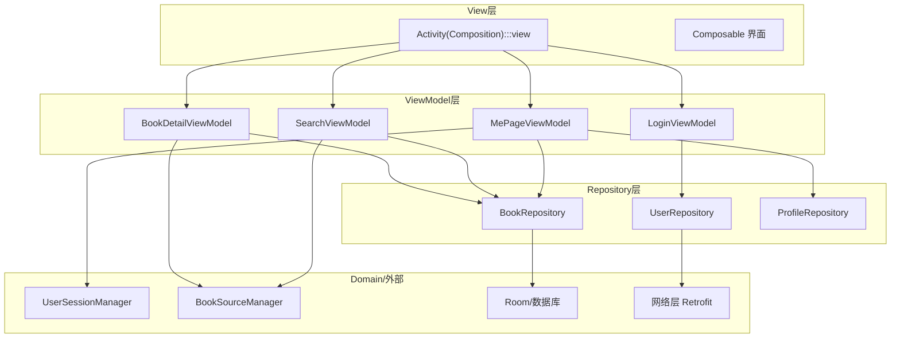
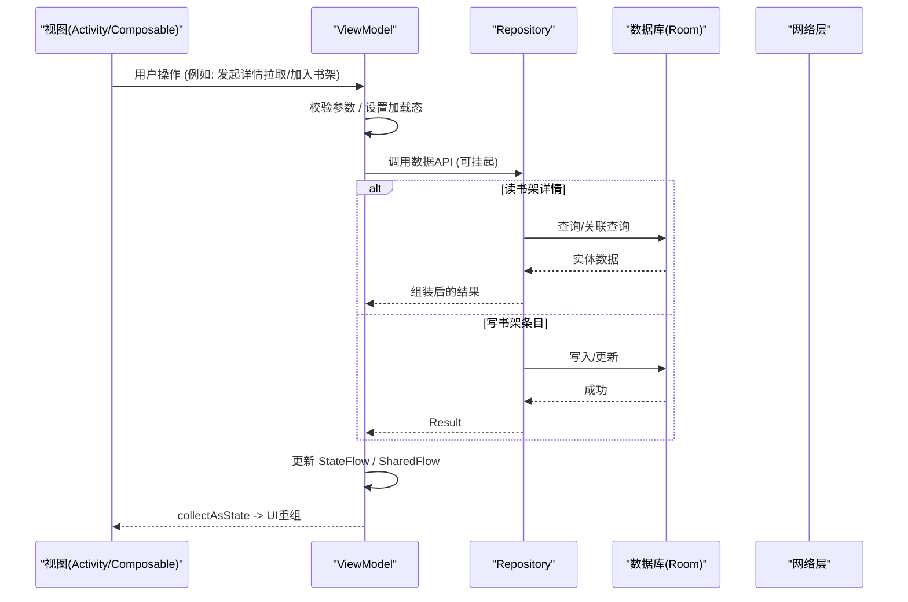
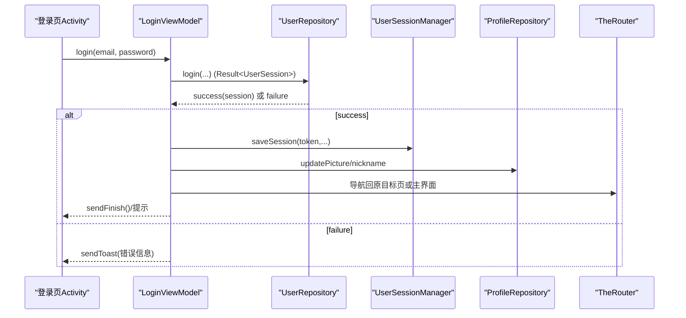
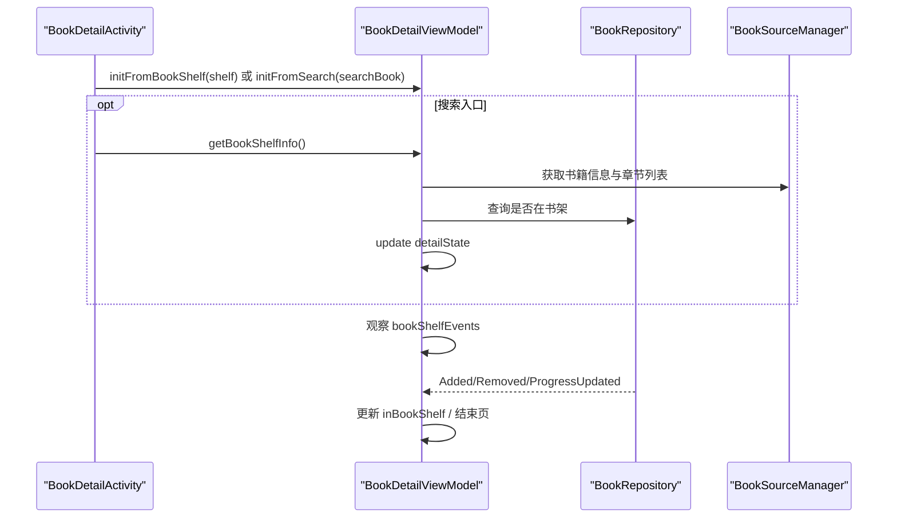
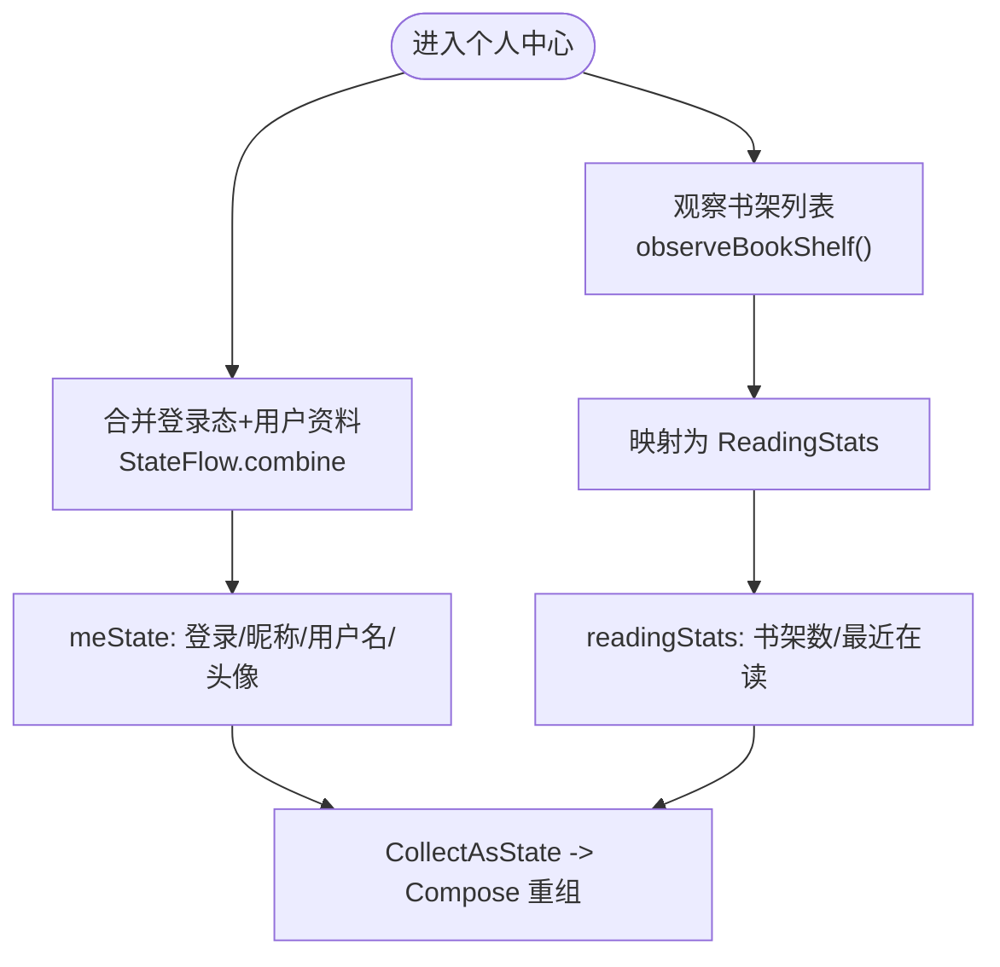
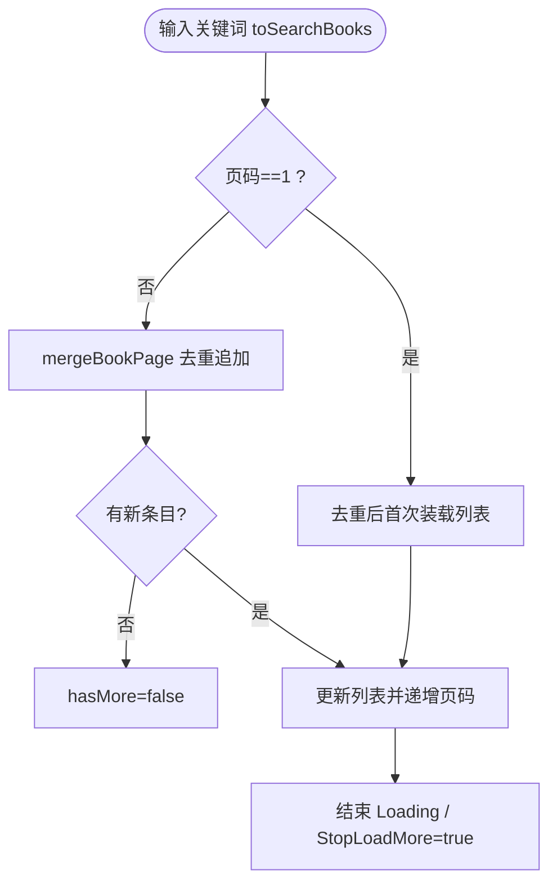
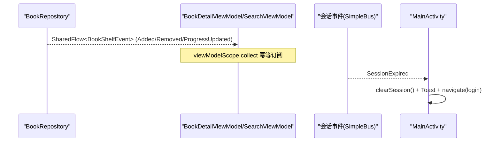
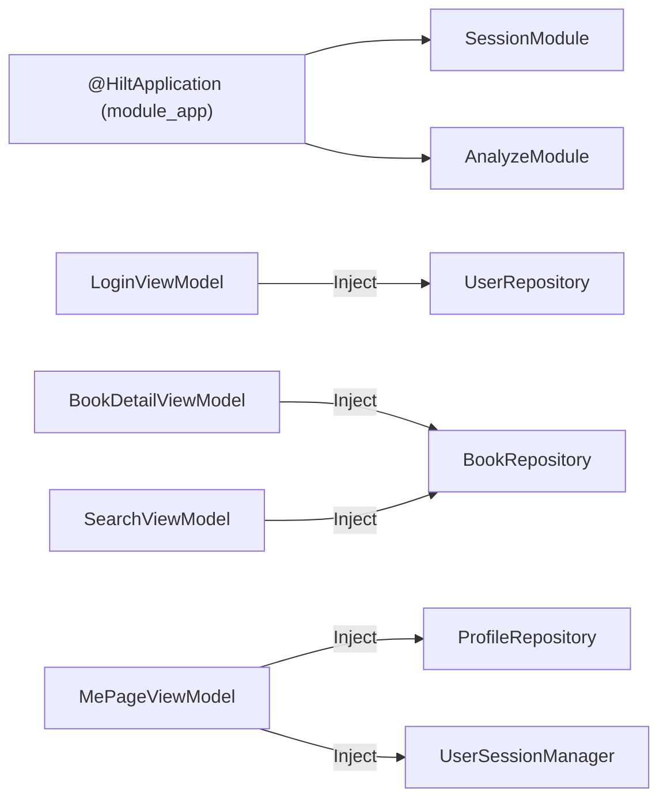

# MVVM架构模式

<cite>
**本文引用的文件**
- [LoginViewModel.kt](file://module_login/src/main/java/com/ebook/login/mvvm/viewmodel/LoginViewModel.kt)
- [BookRepository.kt](file://lib_book_common/src/main/java/com/ebook/common/repository/BookRepository.kt)
- [SessionModule.kt](file://lib_book_common/src/main/java/com/ebook/common/di/SessionModule.kt)
- [BookDetailViewModel.kt](file://module_book/src/main/java/com/ebook/book/mvvm/viewmodel/BookDetailViewModel.kt)
- [MePageViewModel.kt](file://module_me/src/main/java/com/ebook/me/mvvm/viewmodel/MePageViewModel.kt)
- [SearchViewModel.kt](file://module_find/src/main/java/com/ebook/find/mvvm/viewmodel/SearchViewModel.kt)
- [UserRepository.kt](file://module_login/src/main/java/com/ebook/login/repository/UserRepository.kt)
- [AnalyzeModule.kt](file://lib_book_common/src/main/java/com/ebook/common/di/AnalyzeModule.kt)
- [BookDetailActivity.kt](file://module_book/src/main/java/com/ebook/book/BookDetailActivity.kt)
- [MainActivity.kt](file://module_main/src/main/java/com/ebook/main/MainActivity.kt)
</cite>

## 目录
1. [简介](#简介)
2. [项目结构](#项目结构)
3. [核心组件](#核心组件)
4. [架构总览](#架构总览)
5. [关键组件详解](#关键组件详解)
6. [依赖关系分析](#依赖关系分析)
7. [性能与响应式注意事项](#性能与响应式注意事项)
8. [故障排查指南](#故障排查指南)
9. [结论](#结论)

## 简介
本文件面向Android小说阅读器的MVVM架构说明，围绕Model-ViewModel-View三层职责分离、Hilt依赖注入、Compose与ViewModel集成、Flow响应式数据流、事件总线（SharedFlow）以及Repository统一数据访问等进行系统化阐述。内容基于仓库现有实现进行总结与图示，帮助读者快速理解从用户操作到数据更新、再到UI重组的完整链路。

## 项目结构
项目采用多模块Gradle工程，按功能划分模块并通过lib_book_common进行能力聚合：
- 业务模块：module_app（应用入口）、module_main（主页骨架）、module_book（书架/阅读器/评论）、module_find（书城/搜索）、module_login（登录注册等）
- 共享库：lib_book_common（仓库、会话管理、书源解析抽象、公共领域对象）、lib_ebook_api（网络层）、lib_ebook_db（Room数据库DAO/实体）
- 构建逻辑：build-logic（约定插件，统一AGP/Compose/Hilt配置）

在本MVMM文档中重点关注：
- View层：继承BaseActivity/BaseMvvmActivity的Activity + Compose UI页面
- ViewModel层：使用@HiltViewModel，继承lib_common提供的BaseViewModel/刷新类
- Model/Repository层：以Repository为中心的持久化与网络数据封装，统一返回Result或StateFlow

图表来源
- [BookDetailActivity.kt:53-122](file://module_book/src/main/java/com/ebook/book/BookDetailActivity.kt#L53-L122)
- [MainActivity.kt:57-104](file://module_main/src/main/java/com/ebook/main/MainActivity.kt#L57-L104)
- [BookDetailViewModel.kt:42-148](file://module_book/src/main/java/com/ebook/book/mvvm/viewmodel/BookDetailViewModel.kt#L42-L148)
- [MePageViewModel.kt:65-103](file://module_me/src/main/java/com/ebook/me/mvvm/viewmodel/MePageViewModel.kt#L65-L103)
- [SearchViewModel.kt:31-167](file://module_find/src/main/java/com/ebook/find/mvvm/viewmodel/SearchViewModel.kt#L31-L167)
- [UserRepository.kt:26-84](file://module_login/src/main/java/com/ebook/login/repository/UserRepository.kt#L26-L84)
- [BookRepository.kt:40-192](file://lib_book_common/src/main/java/com/ebook/common/repository/BookRepository.kt#L40-L192)

章节来源
- [BookDetailActivity.kt:53-122](file://module_book/src/main/java/com/ebook/book/BookDetailActivity.kt#L53-L122)
- [MainActivity.kt:57-104](file://module_main/src/main/java/com/ebook/main/MainActivity.kt#L57-L104)

## 核心组件
- 基类体系（由lib_common提供）：
  - Activity基类：支持Toolbar、沉浸式、覆盖层（loading/error等）
  - ViewModel基类：统一错误处理、命令通道（sendToast/sendFinish）、UI状态管理约定
- Hilt注入：通过@HiltApplication（在app入口）、@InstallIn/@Module/@Provides/@Binds、@HiltViewModel/@AndroidEntryPoint完成依赖装配
- Repository层：对数据源（本地DB、网络、存储）进行统一封装，暴露suspend函数或Flow；跨组件事件通过SharedFlow发布
- Compose集成：Activity通过hiltViewModel()/by viewModels()获取VM，在Composable中collectAsState收集StateFlow驱动重组

章节来源
- [SessionModule.kt:22-37](file://lib_book_common/src/main/java/com/ebook/common/di/SessionModule.kt#L22-L37)
- [AnalyzeModule.kt:11-18](file://lib_book_common/src/main/java/com/ebook/common/di/AnalyzeModule.kt#L11-L18)
- [BookDetailActivity.kt:53-122](file://module_book/src/main/java/com/ebook/book/BookDetailActivity.kt#L53-L122)
- [BookDetailViewModel.kt:42-148](file://module_book/src/main/java/com/ebook/book/mvvm/viewmodel/BookDetailViewModel.kt#L42-L148)

## 架构总览
下图展示一个典型请求链路：用户操作触发ViewModel方法 → Repository调用本地/远端数据 → ViewModel更新内部StateFlow → Composable订阅并重组 → UI呈现最新状态。同时，跨模块事件通过SharedFlow（如书架变化）通知相关ViewModel。

图表来源
- [BookDetailViewModel.kt:107-148](file://module_book/src/main/java/com/ebook/book/mvvm/viewmodel/BookDetailViewModel.kt#L107-L148)
- [BookRepository.kt:68-115](file://lib_book_common/src/main/java/com/ebook/common/repository/BookRepository.kt#L68-L115)
- [BookDetailActivity.kt:71-121](file://module_book/src/main/java/com/ebook/book/BookDetailActivity.kt#L71-L121)

## 关键组件详解

### 登录流程与事件总线
- LoginViewModel负责登录前校验、启动协程调用用户仓库、保存会话并路由跳转；通过Hilt注入UserRepository、ProfileRepository与UserSessionManager。
- UserRepository将网络层异常与业务码异常统一为Result，并在失败时支持“会话过期”的全局静默处理（网络层已做一次性刷新/跳转）。
- SessionModule通过Hilt将UserSessionManager绑定到具体实现，使各层无需感知具体实现细节。

图表来源
- [LoginViewModel.kt:46-116](file://module_login/src/main/java/com/ebook/login/mvvm/viewmodel/LoginViewModel.kt#L46-L116)
- [UserRepository.kt:50-55](file://module_login/src/main/java/com/ebook/login/repository/UserRepository.kt#L50-L55)
- [SessionModule.kt:26-37](file://lib_book_common/src/main/java/com/ebook/common/di/SessionModule.kt#L26-L37)

章节来源
- [LoginViewModel.kt:46-116](file://module_login/src/main/java/com/ebook/login/mvvm/viewmodel/LoginViewModel.kt#L46-L116)
- [UserRepository.kt:50-55](file://module_login/src/main/java/com/ebook/login/repository/UserRepository.kt#L50-L55)

### 书籍详情页与书架事件同步
- BookDetailViewModel维护detailState（StateFlow），初始化时观察仓库的书架事件流；当书架有变化（新增/移除）立即更新当前书是否已在书架、必要时关闭详情页以保持行为一致。
- Activity注入ViewModel，根据来源决定是否直接展示本地数据或发起网络拉取；Compose中通过collectAsState消费detailState触发重组。

图表来源
- [BookDetailActivity.kt:71-121](file://module_book/src/main/java/com/ebook/book/BookDetailActivity.kt#L71-L121)
- [BookDetailViewModel.kt:65-148](file://module_book/src/main/java/com/ebook/book/mvvm/viewmodel/BookDetailViewModel.kt#L65-L148)
- [BookRepository.kt:68-115](file://lib_book_common/src/main/java/com/ebook/common/repository/BookRepository.kt#L68-L115)

章节来源
- [BookDetailViewModel.kt:65-148](file://module_book/src/main/java/com/ebook/book/mvvm/viewmodel/BookDetailViewModel.kt#L65-L148)
- [BookDetailActivity.kt:71-121](file://module_book/src/main/java/com/ebook/book/BookDetailActivity.kt#L71-L121)

### 个人中心与合并状态流
- MePageViewModel将登录态、用户资料、书架统计等多路数据合并成单一StateFlow（meState）与独立StateFlow（readingStats），使用stateIn结合WhileSubscribed减少不必要计算，提升性能与电量表现。
- ProfileRepository与UserSessionManager作为数据源直接注入ViewModel，避免额外Model门面层。

图表来源
- [MePageViewModel.kt:72-103](file://module_me/src/main/java/com/ebook/me/mvvm/viewmodel/MePageViewModel.kt#L72-L103)

章节来源
- [MePageViewModel.kt:72-103](file://module_me/src/main/java/com/ebook/me/mvvm/viewmodel/MePageViewModel.kt#L72-L103)

### 搜索分页与去重策略
- SearchViewModel继承刷新基类，维护当前列表、页码与书架快照；首屏去重，后续追加采用mergeBookPage去重（避免空页越翻越深、遇到软404重复首页的问题）。
- 同时收集仓库发布的书架事件，动态刷新列表中某本书的“是否已加书架”标志位，保证视图与真实书架一致。

图表来源
- [SearchViewModel.kt:125-167](file://module_find/src/main/java/com/ebook/find/mvvm/viewmodel/SearchViewModel.kt#L125-L167)

章节来源
- [SearchViewModel.kt:125-167](file://module_find/src/main/java/com/ebook/find/mvvm/viewmodel/SearchViewModel.kt#L125-L167)

### 事件总线与响应式数据流
- Repository层通过MutableSharedFlow对外暴露事件流（如bookShelfEvents），供多个ViewModel订阅；使用asSharedFlow暴露只读接口，确保事件单向流动。
- ViewModel在init中用viewModelScope.collect事件，避免重复累积与生命周期不当导致的内存泄漏。
- 主界面对会话过期事件统一收口（清会话+提示+跳转登录页），体现全局事件处置的一致性。

图表来源
- [BookRepository.kt:51-52](file://lib_book_common/src/main/java/com/ebook/common/repository/BookRepository.kt#L51-L52)
- [BookDetailViewModel.kt:65-88](file://module_book/src/main/java/com/ebook/book/mvvm/viewmodel/BookDetailViewModel.kt#L65-L88)
- [SearchViewModel.kt:59-74](file://module_find/src/main/java/com/ebook/find/mvvm/viewmodel/SearchViewModel.kt#L59-L74)
- [MainActivity.kt:71-79](file://module_main/src/main/java/com/ebook/main/MainActivity.kt#L71-L79)

章节来源
- [BookRepository.kt:51-52](file://lib_book_common/src/main/java/com/ebook/common/repository/BookRepository.kt#L51-L52)
- [BookDetailViewModel.kt:65-88](file://module_book/src/main/java/com/ebook/book/mvvm/viewmodel/BookDetailViewModel.kt#L65-L88)
- [SearchViewModel.kt:59-74](file://module_find/src/main/java/com/ebook/find/mvvm/viewmodel/SearchViewModel.kt#L59-L74)
- [MainActivity.kt:71-79](file://module_main/src/main/java/com/ebook/main/MainActivity.kt#L71-L79)

## 依赖关系分析
- Hilt模块与注入点：
  - SessionModule：绑定UserSessionManager和TokenRefresher
  - AnalyzeModule：绑定BookSourceManager实现
  - @HiltViewModel与@AndroidEntryPoint用于创建与注入生命周期相关的实例
- 解耦与职责：
  - Repository屏蔽数据源差异（数据库/网络/缓存）
  - ViewModel专注状态管理和业务编排，不持有复杂UI逻辑
  - Activity/Composable仅渲染与交互，通过StateFlow/SharedFlow驱动UI

图表来源
- [SessionModule.kt:22-37](file://lib_book_common/src/main/java/com/ebook/common/di/SessionModule.kt#L22-L37)
- [AnalyzeModule.kt:11-18](file://lib_book_common/src/main/java/com/ebook/common/di/AnalyzeModule.kt#L11-L18)
- [BookDetailViewModel.kt:42-46](file://module_book/src/main/java/com/ebook/book/mvvm/viewmodel/BookDetailViewModel.kt#L42-L46)
- [MePageViewModel.kt:65-70](file://module_me/src/main/java/com/ebook/me/mvvm/viewmodel/MePageViewModel.kt#L65-L70)

章节来源
- [SessionModule.kt:22-37](file://lib_book_common/src/main/java/com/ebook/common/di/SessionModule.kt#L22-L37)
- [AnalyzeModule.kt:11-18](file://lib_book_common/src/main/java/com/ebook/common/di/AnalyzeModule.kt#L11-L18)

## 性能与响应式注意事项
- StateFlow/Flow使用：
  - 使用stateIn+WhileSubscribed控制收集时机，减少后台计算与功耗
  - 列表型数据使用distinctBy避免重复项导致UI崩溃（搜索页）
- 事件收敛：
  - SharedFlow承载一次性/跨模块事件，避免UI重复订阅引发状态累积
- 线程与IO：
  - Repository中的数据库操作使用withContext(Dispatchers.IO)隔离IO线程
- 资源清理：
  - 移除书籍时同时清理关联内容与缓存，避免残留影响后续读取与排序

章节来源
- [BookRepository.kt:68-161](file://lib_book_common/src/main/java/com/ebook/common/repository/BookRepository.kt#L68-L161)
- [SearchViewModel.kt:142-167](file://module_find/src/main/java/com/ebook/find/mvvm/viewmodel/SearchViewModel.kt#L142-L167)
- [MePageViewModel.kt:84-103](file://module_me/src/main/java/com/ebook/me/mvvm/viewmodel/MePageViewModel.kt#L84-L103)

## 故障排查指南
- 页面不刷新：
  - 检查是否为普通字段而非StateFlow；若为旧字段需改为状态流并触发重组（参考详情页状态设计）
- 列表重复导致崩溃：
  - 搜索页首屏应distinctBy，后续mergeBookPage去重，避免item key重复
- 登录成功后未回跳：
  - 检查路由参数与拦截路径判断条件；主动跳转时需CLEAR_TOP+ SINGLE_TOP
- 会话过期未处理：
  - 确认主界面订阅了会话过期事件并执行统一处置（清会话+提示+跳转）

章节来源
- [BookDetailViewModel.kt:22-40](file://module_book/src/main/java/com/ebook/book/mvvm/viewmodel/BookDetailViewModel.kt#L22-L40)
- [SearchViewModel.kt:142-167](file://module_find/src/main/java/com/ebook/find/mvvm/viewmodel/SearchViewModel.kt#L142-L167)
- [LoginViewModel.kt:98-116](file://module_login/src/main/java/com/ebook/login/mvvm/viewmodel/LoginViewModel.kt#L98-L116)
- [MainActivity.kt:71-79](file://module_main/src/main/java/com/ebook/main/MainActivity.kt#L71-L79)

## 结论
本项目在MVVM的基础上，结合Hilt、Compose、Coroutines与Flow，形成了清晰的分层与解耦：
- Activity/Composable仅负责交互与渲染
- ViewModel集中管理状态、协调业务流程与异步任务
- Repository统一数据访问，对外暴露稳定API与事件流
- Hilt在各层间注入依赖，降低耦合、提高可测试性

上述模式保障了代码的可维护性、扩展性与性能，也为未来继续演进（如更多模块、更复杂的业务）提供了坚实的基础。