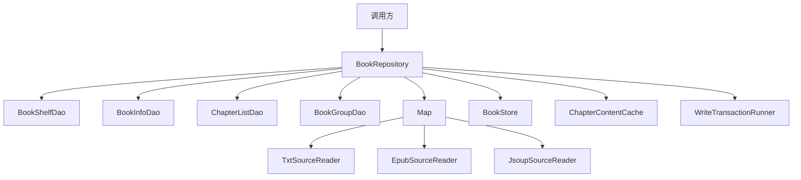
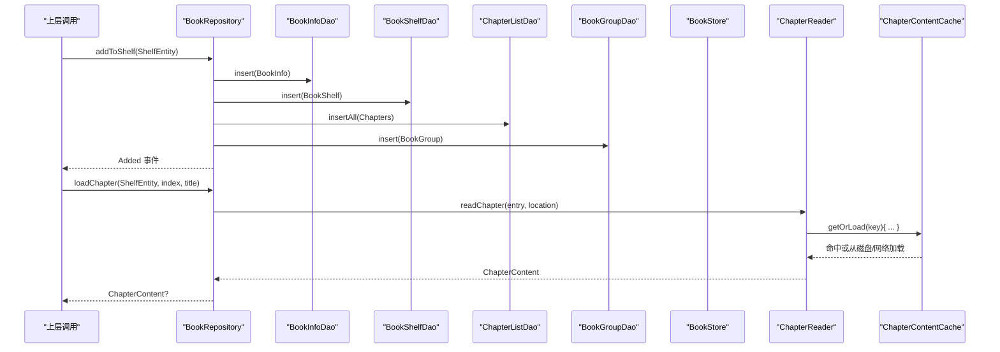
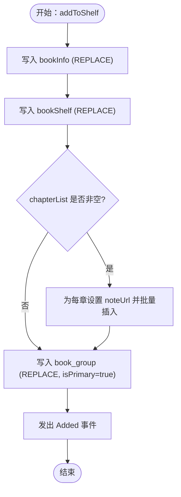
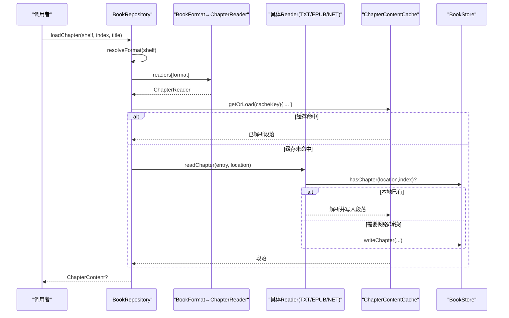
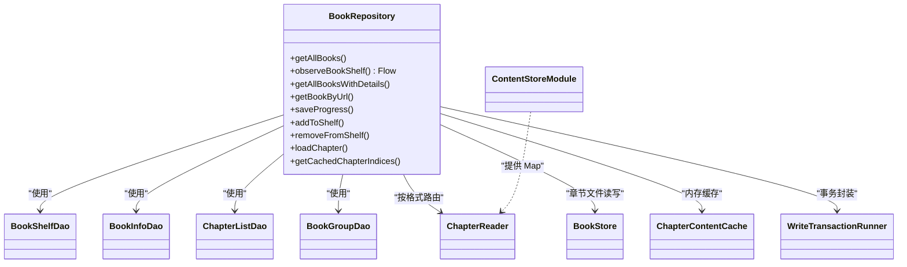

# BookRepository核心实现

<cite>
**本文引用的文件**
- [BookRepository.kt](file://lib_book_common/src/main/java/com/ebook/common/repository/BookRepository.kt)
- [BookShelfDao.kt](file://lib_ebook_db/src/main/java/com/ebook/db/dao/BookShelfDao.kt)
- [BookInfoDao.kt](file://lib_ebook_db/src/main/java/com/ebook/db/dao/BookInfoDao.kt)
- [ChapterListDao.kt](file://lib_ebook_db/src/main/java/com/ebook/db/dao/ChapterListDao.kt)
- [BookGroupDao.kt](file://lib_ebook_db/src/main/java/com/ebook/db/dao/BookGroupDao.kt)
- [ChapterReader.kt](file://lib_book_common/src/main/java/com/ebook/common/analyze/local/ChapterReader.kt)
- [ContentStoreModule.kt](file://lib_book_common/src/main/java/com/ebook/common/di/ContentStoreModule.kt)
- [WriteTransactionRunner.kt](file://lib_book_common/src/main/java/com/ebook/common/store/WriteTransactionRunner.kt)
- [BookStore.kt](file://lib_book_common/src/main/java/com/ebook/common/store/BookStore.kt)
</cite>

## 目录
1. [简介](#简介)
2. [项目结构定位](#项目结构定位)
3. [核心组件职责](#核心组件职责)
4. [架构总览](#架构总览)
5. [详细方法解析](#详细方法解析)
6. [依赖关系分析](#依赖关系分析)
7. [性能与事务特性](#性能与事务特性)
8. [排错指南](#排错指南)
9. [结论](#结论)
10. [附录：接口与数据流速查](#附录接口与数据流速查)

## 简介
本章节面向仓库层的核心类 BookRepository，系统说明其作为书架数据访问层的职责边界与协作方式。覆盖书架 CRUD、阅读进度保存、章节正文统一读取入口；详解构造时注入的多个 DAO、ChapterReader 路由、WriteTransactionRunner 事务管理；对比 getAllBooks 与 observeBookShelf 的行为差异与取舍；解释 addToShelf 的“三重写入”与幂等设计；并提供方法与错误处理策略的使用参考。

## 项目结构定位
- 模块位置：lib_book_common（业务共享库），对外暴露 repository 能力给各功能模块使用。
- 数据库交互：通过 lib_ebook_db 中的 DAO 完成 Room 读写。
- 内容存储：本地/网络书籍的正文落地与缓存通过 BookStore 与 ChapterContentCache，并由 ChapterReader 按格式分发。
- DI 装配：Hilt 在 ContentStoreModule 中提供 Map<BookFormat, ChapterReader> 注入到 Repository 中以支持格式路由。

**图示来源**
- [BookRepository.kt:30-49](file://lib_book_common/src/main/java/com/ebook/common/repository/BookRepository.kt#L30-L49)
- [ContentStoreModule.kt:51-71](file://lib_book_common/src/main/java/com/ebook/common/di/ContentStoreModule.kt#L51-L71)
- [BookStore.kt:6-20](file://lib_book_common/src/main/java/com/ebook/common/store/BookStore.kt#L6-L20)

**节内引用**
- [BookRepository.kt:30-49](file://lib_book_common/src/main/java/com/ebook/common/repository/BookRepository.kt#L30-L49)

## 核心组件职责
- BookRepository：书架数据访问门面，聚合多DAO读写、统一章节读取管线、发布书架事件。
- DAO 协作：
  - BookShelfDao：书架行 with 进度、全量快照/Flow、upsert/delete。
  - BookInfoDao：书籍元数据 upsert/delete。
  - ChapterListDao：章节目录 upsert/delete/count。
  - BookGroupDao：作品分组关联（评论聚合/主键/合并拆分）upsert、删除等。
- ChapterReader：读一章的最小接缝，按 BookFormat 路由至 TXT/EPUB/NETWORK 三类 reader。
- WriteTransactionRunner：把写操作打包成单次事务提交，保障原子性，便于测试。
- BookStore：章节文件落盘与存在性检查；封面暂存目录与原子提交。
- ChapterContentCache：内存级章节内容缓存。

**节内引用**
- [BookShelfDao.kt:8-108](file://lib_ebook_db/src/main/java/com/ebook/db/dao/BookShelfDao.kt#L8-L108)
- [BookInfoDao.kt:6-33](file://lib_ebook_db/src/main/java/com/ebook/db/dao/BookInfoDao.kt#L6-L33)
- [ChapterListDao.kt:6-48](file://lib_ebook_db/src/main/java/com/ebook/db/dao/ChapterListDao.kt#L6-L48)
- [BookGroupDao.kt:9-63](file://lib_ebook_db/src/main/java/com/ebook/db/dao/BookGroupDao.kt#L9-L63)
- [ChapterReader.kt:3-19](file://lib_book_common/src/main/java/com/ebook/common/analyze/local/ChapterReader.kt#L3-L19)
- [WriteTransactionRunner.kt:3-13](file://lib_book_common/src/main/java/com/ebook/common/store/WriteTransactionRunner.kt#L3-L13)
- [BookStore.kt:6-20](file://lib_book_common/src/main/java/com/ebook/common/store/BookStore.kt#L6-L20)

## 架构总览
BookRepository 是跨源的统一入口：添加书、移除书、观察书架、保存进度、获取章节正文均在此收口。读路径由 ChapterReader 根据 BookFormat 分发；写路径通过各自 DAO 完成，关键批量写入通过 WriteTransactionRunner 包裹。

**图示来源**
- [BookRepository.kt:117-147](file://lib_book_common/src/main/java/com/ebook/common/repository/BookRepository.kt#L117-L147)
- [BookRepository.kt:174-192](file://lib_book_common/src/main/java/com/ebook/common/repository/BookRepository.kt#L174-L192)
- [ContentStoreModule.kt:62-71](file://lib_book_common/src/main/java/com/ebook/common/di/ContentStoreModule.kt#L62-L71)

## 详细方法解析

### 构造器与注入要点
- 注入列表：
  - 四张 DAO：BookShelfDao、BookInfoDao、ChapterListDao、BookGroupDao，分别负责书架、元数据、章节、分组关联的持久化。
  - chapterReaders：Map<BookFormat, ChapterReader>，由 ContentStoreModule 提供，将网络与本地格式统一为同一读取接口。
  - bookStore：章节文件与封面的实体存储基座，提供章节文件 existence 判断。
  - contentCache：内存章节内容缓存。
  - transactions：WriteTransactionRunner，集中事务封装。

- 设计收益：
  - 以接口 Map<BookFormat, ChapterReader> 替代分支逻辑，新增格式仅需改装配，符合开闭原则。
  - DAO 解耦、单表语义清晰，Repository 仅编排流程，不污染 DAO SQL。

**节内引用**
- [BookRepository.kt:40-49](file://lib_book_common/src/main/java/com/ebook/common/repository/BookRepository.kt#L40-L49)
- [ContentStoreModule.kt:51-71](file://lib_book_common/src/main/java/com/ebook/common/di/ContentStoreModule.kt#L51-L71)

### getAllBooks vs observeBookShelf
- getAllBooks()：一次性返回书架快照，无关联数据，适合对数量敏感、只关心书架行的场景。
- observeBookShelf()：基于 Flow 的响应式书架数据流，按最后阅读时间倒序填充 bookInfo 并过滤掉孤立条目（info 为 null），不执行任何写副作用。
  - 为何 Flow 不清理孤立记录？清理涉及删除（写副作用），每次失效都会重发，不适合放在观察流里反复执行；隔离出写副作用至一次性查询中（getAllBooksWithDetails）。
- 建议：
  - UI 列表若需实时刷新且不需要章节详情，优先 observeBookShalf + map 投影字段。
  - 需要章节/元数据详情的一次性加载走 getAllBooksWithDetails。

**节内引用**
- [BookRepository.kt:56-75](file://lib_book_common/src/main/java/com/ebook/common/repository/BookRepository.kt#L56-L75)
- [BookShelfDao.kt:54-59](file://lib_ebook_db/src/main/java/com/ebook/db/dao/BookShelfDao.kt#L54-L59)
- [BookShelfDao.kt:21-46](file://lib_ebook_db/src/main/java/com/ebook/db/dao/BookShelfDao.kt#L21-L46)

### getAllBooksWithDetails 与孤立记录清理
- 行为：
  - 获取全量并附带 book_info 和 chapters 的完整信息。
  - 遇到 info 为空的书架记录（孤立行）则收集 URL 并批量删除。
  - 对章节进行显式排序（durChapterIndex）以修正 rowid 变化带来的乱序。
- 设计权衡：
  - 一次性查询承担写副作用（清理孤立行），避免 Flow 重复触发写。
  - 稳定顺序由显式排序兜底，应对历史 REPLACE 造成的物理顺序波动。

**节内引用**
- [BookRepository.kt:77-103](file://lib_book_common/src/main/java/com/ebook/common/repository/BookRepository.kt#L77-L103)
- [ChapterListDao.kt:15-22](file://lib_ebook_db/src/main/java/com/ebook/db/dao/ChapterListDao.kt#L15-L22)

### saveProgress
- 行为：设置最后阅读时间并插入书架行（REPLACE upsert），随后发布 ProgressUpdated 事件。
- 特点：
  - BookShelfDao.insert 为 REPLACE 语义，可直接更新进度而无需先查后写。
  - 事件通知下游如统计页、最近阅读列表等即时刷新。

**节内引用**
- [BookRepository.kt:110-115](file://lib_book_common/src/main/java/com/ebook/common/repository/BookRepository.kt#L110-L115)
- [BookShelfDao.kt:70-79](file://lib_ebook_db/src/main/java/com/ebook/db/dao/BookShelfDao.kt#L70-L79)

### addToShelf 三重写入与幂等
- 写入顺序：
  1) 写入 bookInfo（若存在）——以 noteUrl 为自然键 REPLACE，具备幂等。
  2) 写入 bookShelf ——同上，幂等 upsert。
  3) 写入 chapterList ——按章节集合批量插入，去重依靠内容定位符。
  4) 写入 book_group ——根据 matchName/matchAuthor 或 bookInfo 计算评论键，置 isPrimary=true；由于 INSERT REPLACE，同 URL 重复加入不会导致重复主键。
- 幂等设计关键点：
  - 多张表均采用 REPLACE/唯一约束，避免重复数据。
  - book_group 主键在 M2 中要求“恰好一行 is_primary”，由调用方在事务内保证；Repository 侧通过 REPLACE 确保幂等追加。
- 事件：完成后发出 Added 事件。

**图示来源**
- [BookRepository.kt:117-147](file://lib_book_common/src/main/java/com/ebook/common/repository/BookRepository.kt#L117-L147)

**节内引用**
- [BookRepository.kt:117-147](file://lib_book_common/src/main/java/com/ebook/common/repository/BookRepository.kt#L117-L147)
- [BookInfoDao.kt:15-25](file://lib_ebook_db/src/main/java/com/ebook/db/dao/BookInfoDao.kt#L15-L25)
- [ChapterListDao.kt:13-34](file://lib_ebook_db/src/main/java/com/ebook/db/dao/ChapterListDao.kt#L13-L34)
- [BookGroupDao.kt:15-24](file://lib_ebook_db/src/main/java/com/ebook/db/dao/BookGroupDao.kt#L15-L24)

### removeFromShelf 联动清理
- 行为：删除章节、元数据、分组关联、书架行；删除书籍本体目录并清空对应缓存；发出 Removed 事件。
- 注意：
  - Room 未声明外键级联，必须逐表清理（本仓库已集中实现）。
  - 旧 book_content 表已废弃，不再出现残留。
  - 内容缓存清除确保一致性。

**节内引用**
- [BookRepository.kt:149-161](file://lib_book_common/src/main/java/com/ebook/common/repository/BookRepository.kt#L149-L161)
- [ChapterListDao.kt:40-47](file://lib_ebook_db/src/main/java/com/ebook/db/dao/ChapterListDao.kt#L40-L47)
- [BookGroupDao.kt:22-24](file://lib_ebook_db/src/main/java/com/ebook/db/dao/BookGroupDao.kt#L22-L24)
- [BookInfoDao.kt:27-32](file://lib_ebook_db/src/main/java/com/ebook/db/dao/BookInfoDao.kt#L27-L32)

### 章节正文统一读取：loadChapter
- 入口职责：统一读取入口（本地/网络都经此），按 bookFormat 路由到对应 ChapterReader，再经 ChapterContentCache 缓存，最终返回规范化段落列表。
- 路由机制：
  - Hilt 注入 Map<BookFormat, ChapterReader>，包含 TXT、EPUB、NETWORK 三种 reader。
  - ChapterReader.readChapter 返回规范化段落（空表示缺失），调用方据此决定是否继续下载或重试。
- 缓存策略：
  - 内存级缓存 key 由 BookStore.chapterRef 决定，命中直接返回，未命中则由 reader 内部判定文件是否存在或抓取并落盘。
- 返回值语义：
  - 返回 null 代表无效内容（段落为空），上游可进行降级展示。

**图示来源**
- [BookRepository.kt:163-192](file://lib_book_common/src/main/java/com/ebook/common/repository/BookRepository.kt#L163-L192)
- [ContentStoreModule.kt:62-71](file://lib_book_common/src/main/java/com/ebook/common/di/ContentStoreModule.kt#L62-L71)
- [BookStore.kt:17-26](file://lib_book_common/src/main/java/com/ebook/common/store/BookStore.kt#L17-L26)

**节内引用**
- [ChapterReader.kt:3-19](file://lib_book_common/src/main/java/com/ebook/common/analyze/local/ChapterReader.kt#L3-L19)
- [BookRepository.kt:163-192](file://lib_book_common/src/main/java/com/ebook/common/repository/BookRepository.kt#L163-L192)

### getCachedChapterIndices
- 行为：批量判定哪些章节已在本地缓存（章文件存在），供下载页面绘制徽章。
- 事实源：BookStore.hasChapter，基于文件系统存在性判断。

**节内引用**
- [BookRepository.kt:199-211](file://lib_book_common/src/main/java/com/ebook/common/repository/BookRepository.kt#L199-L211)
- [BookStore.kt:21-26](file://lib_book_common/src/main/java/com/ebook/common/store/BookStore.kt#L21-L26)

## 依赖关系分析
- 松耦合：
  - DAO 按表职责切分，单一关注点。
  - ChapterReader 以接口解耦不同介质来源（TXT/EPUB/网络）。
  - WriteTransactionRunner 抽象事务边界，利于纯 JVM 测试。
- 关键装配：
  - ContentStoreModule 提供 Map<BookFormat, ChapterReader>，新增格式只需修改一处映射，不影响仓库代码。
- 事件通信：
  - BookRepository 维护 SharedFlow<BookShelfEvent>，用于书架增删改事件广播。

**图示来源**
- [BookRepository.kt:30-49](file://lib_book_common/src/main/java/com/ebook/common/repository/BookRepository.kt#L30-L49)
- [ContentStoreModule.kt:51-71](file://lib_book_common/src/main/java/com/ebook/common/di/ContentStoreModule.kt#L51-L71)
- [BookStore.kt:6-20](file://lib_book_common/src/main/java/com/ebook/common/store/BookStore.kt#L6-L20)

**节内引用**
- [ContentStoreModule.kt:51-71](file://lib_book_common/src/main/java/com/ebook/common/di/ContentStoreModule.kt#L51-L71)

## 性能与事务特性
- 读优化：
  - observeBookShelf 仅做关联填充并过滤孤立条目，避免写开销与多余数据。
  - getAllBooksFullInfo/@Relation 返回数据需在调用端显式排序，避免物理 rowid 波动导致无序。
- 写原子性：
  - WriteTransactionRunner 将多写串起来作为一次事务提交，避免中间态被其他消费者读到。
  - 导入器等复杂写入建议使用 TransactionModule 提供的封装以保证一致性与可测性。
- 索引与查询：
  - ChapterListDao 在 note_url 建索引，按书取目录高效。
  - DAO 尽量用单次批量 upsert（insertAll）减少往返。
- I/O 与缓存：
  - ChapterContentCache 内存缓存章节段落，降低重复解析开销。
  - BookStore.hasChapter 基于文件系统快速判断，避免冗余解析。

**节内引用**
- [BookRepository.kt:61-103](file://lib_book_common/src/main/java/com/ebook/common/repository/BookRepository.kt#L61-L103)
- [WriteTransactionRunner.kt:3-13](file://lib_book_common/src/main/java/com/ebook/common/store/WriteTransactionRunner.kt#L3-L13)
- [ChapterListDao.kt:21-34](file://lib_ebook_db/src/main/java/com/ebook/db/dao/ChapterListDao.kt#L21-L34)

## 排错指南
- 现象：书架页面偶尔出现书名/作者为空
  - 原因：book_info 已被删除但书架仍有记录（孤立行）。
  - 解决：调 getAllBooksWithDetails 会自行清理孤立行；不要仅在 Flow 中处理，因为该流不承载写副作用。
- 现象：添加书后评论聚合不生效
  - 原因：未写入 book_group 主键或不是第一条主键。
  - 解决：确认 addToShelf 成功写出 BookGroupEntity(isPrimary=true)，并在导入/合并时使用事务保证主键唯一。
- 现象：读某一章内容为空
  - 原因：章节文件不存在且 reader 未能抓取/落盘。
  - 解决：使用 getCachedChapterIndices 判断缓存情况，必要时触发批量下载；检查 reader 是否正确落地到 BookStore。
- 现象：大量写入后发现目录顺序异常
  - 原因：REPLACE 导致的 rowid 跳尾。
  - 解决：一律通过 ChapterListDao.getChaptersForBook 取回后再按 durChapterIndex 排序；或在 Repository 层显式排序。
- 通用排查要点：
  - 使用 BookStore.reconcile 清理孤立项与 .tmp 目录，保证文件系统与 DB 同步。
  - 对于需要跨多写操作的链路（导入、合并/拆分），务必使用 WriteTransactionRunner 保证原子性。

**节内引用**
- [BookRepository.kt:77-103](file://lib_book_common/src/main/java/com/ebook/common/repository/BookRepository.kt#L77-L103)
- [BookStore.kt:84-98](file://lib_book_common/src/main/java/com/ebook/common/store/BookStore.kt#L84-L98)
- [ChapterListDao.kt:15-22](file://lib_ebook_db/src/main/java/com/ebook/db/dao/ChapterListDao.kt#L15-L22)
- [WriteTransactionRunner.kt:3-13](file://lib_book_common/src/main/java/com/ebook/common/store/WriteTransactionRunner.kt#L3-L13)

## 结论
BookRepository 作为书架数据访问层，实现了“读多写少、职责清晰”的设计：读路径通过 Flow 与快照分离，写路径以多 DAO 协作与事务封装确保一致性；章节读取通过 ChapterReader 接口与 Hilt 注入表完成格式无关的统一管线。整体具备良好的可扩展性（新增格式/数据表）、可观测性（事件流）与健壮性（孤立行清理、缓存与文件一致性）。

## 附录：接口与数据流速查

### 常用方法清单
- getAllBooks(): 仅书架行快照
- observeBookShelf(): 响应式书架（含 bookInfo，过滤孤立）
- getAllBooksWithDetails(): 一次性带详情并清理孤立行
- getBookByUrl(noteUrl): 单条书架记录
- saveProgress(bookShelf): 更新进度并发布事件
- addToShelf(bookShelf): 三写一事件（bookInfo → bookShelf → chapterList → book_group）
- removeFromShelf(bookShelf): 联动删除并清内容缓存
- loadChapter(shelf, index, title, ref): 统一章节读取入口
- getCachedChapterIndices(shelf): 批量章节文件存在性判断

### 典型调用示例（步骤描述）
- 添加书籍到书架：
  1) 准备 BookShelfEntity（含可选 bookInfo 与章节列表）。
  2) 调用 addToShelf，内部自动依次写入四张表并发出 Added 事件。
  3) 如需幂等添加，重复调用安全。
- 读取章节正文：
  1) 调用 loadChapter 传入书架与章节信息。
  2) 内部根据 BookFormat 选择对应 ChapterReader，经 ChapterContentCache 返回段落。
  3) 若返回空，表示内容缺失，应触发按需下载。
- 观察书架变化：
  1) 订阅 observeBookShelf Flow。
  2) 书架增删/进度变更会自动刷新，UI 仅做映射展示。

**节内引用**
- [BookRepository.kt:56-211](file://lib_book_common/src/main/java/com/ebook/common/repository/BookRepository.kt#L56-L211)
- [ContentStoreModule.kt:62-71](file://lib_book_common/src/main/java/com/ebook/common/di/ContentStoreModule.kt#L62-L71)