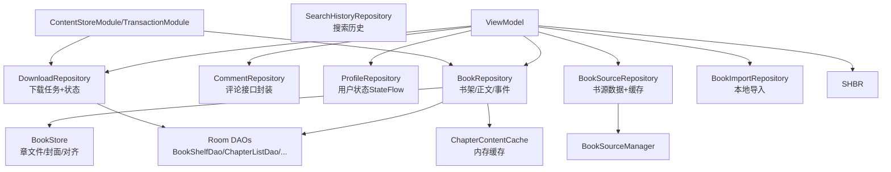
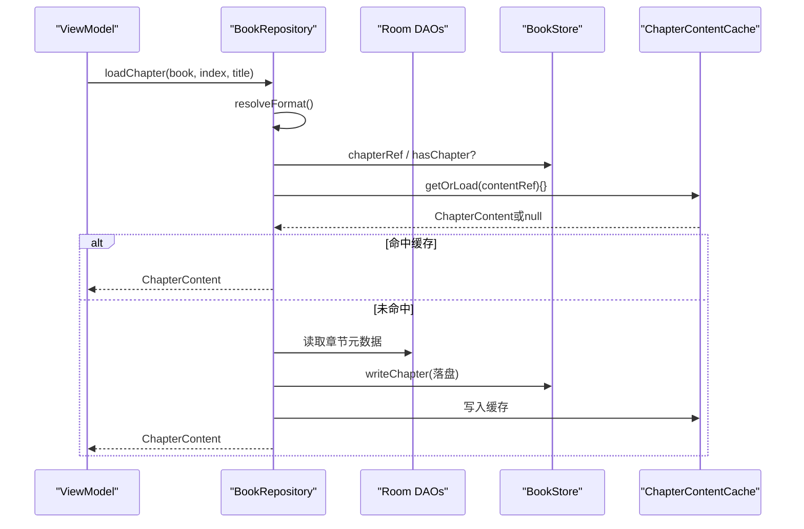
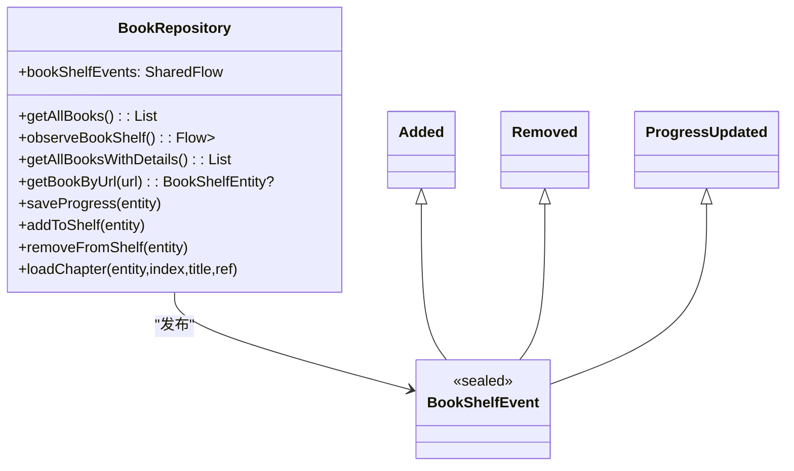
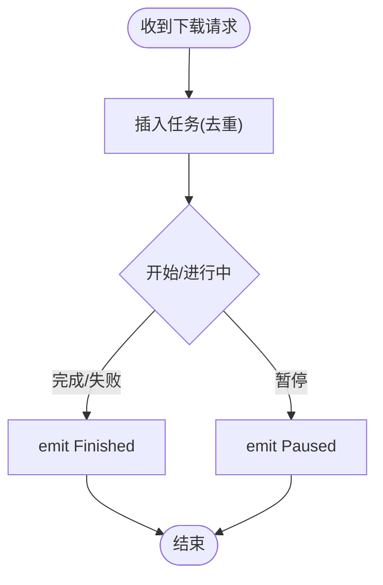
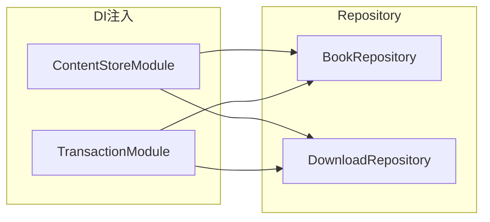

# Repository数据访问层

<cite>
**本文引用的文件**
- [BookRepository.kt](file://lib_book_common/src/main/java/com/ebook/common/repository/BookRepository.kt)
- [CommentRepository.kt](file://lib_book_common/src/main/java/com/ebook/common/repository/CommentRepository.kt)
- [ProfileRepository.kt](file://lib_book_common/src/main/java/com/ebook/common/repository/ProfileRepository.kt)
- [BookSourceRepository.kt](file://module_find/src/main/java/com/ebook/find/repository/BookSourceRepository.kt)
- [DownloadRepository.kt](file://module_book/src/main/java/com/ebook/book/repository/DownloadRepository.kt)
- [BookImportRepository.kt](file://module_book/src/main/java/com/ebook/book/repository/BookImportRepository.kt)
- [SearchHistoryRepository.kt](file://module_find/src/main/java/com/ebook/find/repository/SearchHistoryRepository.kt)
- [ContentStoreModule.kt](file://lib_book_common/src/main/java/com/ebook/common/di/ContentStoreModule.kt)
- [TransactionModule.kt](file://lib_book_common/src/main/java/com/ebook/common/di/TransactionModule.kt)
- [BookStore.kt](file://lib_book_common/src/main/java/com/ebook/common/store/BookStore.kt)
- [ChapterContentCache.kt](file://lib_book_common/src/main/java/com/ebook/common/store/ChapterContentCache.kt)
- [KeyCode.kt](file://lib_book_common/src/main/java/com/ebook/common/event/KeyCode.kt)
- [AGENTS.md](file://AGENTS.md)
</cite>

## 目录
1. [简介](#简介)
2. [项目结构](#项目结构)
3. [核心组件](#核心组件)
4. [架构总览](#架构总览)
5. [详细组件分析](#详细组件分析)
6. [依赖关系分析](#依赖关系分析)
7. [性能考量](#性能考量)
8. [故障排查指南](#故障排查指南)
9. [结论](#结论)

## 简介
本文为Android小说阅读器的Repository数据访问层文档，聚焦于统一的Repository模式实现：以单一入口抽象多数据源（Room、本地文件系统、网络），通过SharedFlow实现事件总线与响应式通知，贯穿从ViewModel到Repository再到数据源的完整调用链。重点阐述BookRepository的书架CRUD、阅读进度保存、章节正文统一读取、以及书架变化事件的发布；同时说明下载、搜索历史等配套仓库的职责与协作方式。

## 项目结构
本项目采用MVVM与分层架构：业务模块 → lib_book_common（领域共享）→ lib_ebook_api（网络）→ lib_ebook_db（数据库）。Repository集中位于各模块的repository包中，关键装配点在DI模块，数据存储集中在store目录。

图表来源
- [BookRepository.kt:30-162](file://lib_book_common/src/main/java/com/ebook/common/repository/BookRepository.kt#L30-L162)
- [ContentStoreModule.kt:51-86](file://lib_book_common/src/main/java/com/ebook/common/di/ContentStoreModule.kt#L51-L86)
- [TransactionModule.kt:12-24](file://lib_book_common/src/main/java/com/ebook/common/di/TransactionModule.kt#L12-L24)

章节来源
- [AGENTS.md](file://AGENTS.md)

## 核心组件
- BookRepository：书架CRUD、阅读进度持久化、章节统一读取、书架事件发射。
- DownloadRepository：下载任务的增删/统计与状态通道（重放最新一条，保障延迟订阅不丢态）。
- CommentRepository：对后端评论接口的封装与安全调用适配。
- BookSourceRepository：分类/书库的数据获取与磁盘缓存管理。
- ProfileRepository：头像、昵称等用户态使用StateFlow对外暴露。
- BookImportRepository：Uri/File导入的统一入口，内部走LocalBookImporter并清理临时文件。
- SearchHistoryRepository：搜索历史的去重上送与查询。

章节来源
- [BookRepository.kt:30-162](file://lib_book_common/src/main/java/com/ebook/common/repository/BookRepository.kt#L30-L162)
- [DownloadRepository.kt:21-172](file://module_book/src/main/java/com/ebook/book/repository/DownloadRepository.kt#L21-L172)
- [CommentRepository.kt:16-79](file://lib_book_common/src/main/java/com/ebook/common/repository/CommentRepository.kt#L16-L79)
- [BookSourceRepository.kt:21-51](file://module_find/src/main/java/com/ebook/find/repository/BookSourceRepository.kt#L21-L51)
- [ProfileRepository.kt:12-54](file://lib_book_common/src/main/java/com/ebook/common/repository/ProfileRepository.kt#L12-L54)
- [BookImportRepository.kt:12-40](file://module_book/src/main/java/com/ebook/book/repository/BookImportRepository.kt#L12-L40)
- [SearchHistoryRepository.kt:11-42](file://module_find/src/main/java/com/ebook/find/repository/SearchHistoryRepository.kt#L11-L42)

## 架构总览
Repository层作为“数据编排器”，屏蔽底层实现细节：
- 数据源抽象：DAO（Room）、BookStore（本地文件）、API DataSource（网络）。
- 缓存策略：章节内容内存缓存（容量有限、按content_ref键管理），书库磁盘缓存。
- 事件总线：使用MutableSharedFlow暴露为只读SharedFlow，提供可配置的replay与缓冲区大小；用于书架事件和下载状态流。
- 事务保证：写操作通过WriteTransactionRunner使用Room的事务机制，确保原子性。
- 调度：所有IO绑定至Dispatchers.IO，避免阻塞主线程。

图表来源
- [BookRepository.kt:165-192](file://lib_book_common/src/main/java/com/ebook/common/repository/BookRepository.kt#L165-L192)
- [ChapterContentCache.kt:31-42](file://lib_book_common/src/main/java/com/ebook/common/store/ChapterContentCache.kt#L31-L42)
- [BookStore.kt:17-37](file://lib_book_common/src/main/java/com/ebook/common/store/BookStore.kt#L17-L37)

章节来源
- [BookRepository.kt:165-192](file://lib_book_common/src/main/java/com/ebook/common/repository/BookRepository.kt#L165-L192)
- [ChapterContentCache.kt:7-20](file://lib_book_common/src/main/java/com/ebook/common/store/ChapterContentCache.kt#L7-L20)
- [ContentStoreModule.kt:51-86](file://lib_book_common/src/main/java/com/ebook/common/di/ContentStoreModule.kt#L51-L86)

## 详细组件分析

### BookRepository：书架与章节的统一编排
职责
- 书架CRUD：添加、删除、获取全部（含详情/观察流）、按URL查找。
- 阅读进度保存：更新最终阅读时间并提交，触发进度更新事件。
- 章节正文统一读取：根据BookFormat路由到ChapterReader，经内存缓存与文件存储，屏蔽本地/网络差异。
- 书架事件发布：通过SharedFlow向外推送Added/Removed/ProgressUpdated事件。

关键点
- observeBookShelf返回Flow<List>，仅做关联数据过滤与排序，不含副作用清理，适合热更新。
- addToShelf会一并插入bookInfo、chapterList及group键，并通过事件通知UI刷新。
- removeFromShelf会级联删除章列表、信息、组键、文件与缓存。
- loadChapter是正文读取唯一入口，复用ChapterContentCache提升翻页性能。

图表来源
- [BookRepository.kt:30-162](file://lib_book_common/src/main/java/com/ebook/common/repository/BookRepository.kt#L30-L162)
- [BookRepository.kt:409-421](file://lib_book_common/src/main/java/com/ebook/common/repository/BookRepository.kt#L409-L421)

章节来源
- [BookRepository.kt:57-103](file://lib_book_common/src/main/java/com/ebook/common/repository/BookRepository.kt#L57-L103)
- [BookRepository.kt:111-161](file://lib_book_common/src/main/java/com/ebook/common/repository/BookRepository.kt#L111-L161)
- [BookRepository.kt:174-192](file://lib_book_common/src/main/java/com/ebook/common/repository/BookRepository.kt#L174-L192)
- [BookRepository.kt:409-421](file://lib_book_common/src/main/java/com/ebook/common/repository/BookRepository.kt#L409-L421)

### DownloadRepository：下载任务与状态通道
职责
- 下载队列：新增任务（去重）、删除任务、清空队列、查询总数、获取下一任务、最近任务等。
- 覆盖率计算：基于BookStore检测已缓存章节数。
- 下载状态通道：以replay=1的SharedFlow对外暴露，支持晚开订阅者立即同步最新状态。

要点
- tryEmit用于服务收尾场景，避免在进程即将销毁时因挂起丢失状态。
- 队列剩余数的响应式观察直接来自DAO的Flow。

图表来源
- [DownloadRepository.kt:81-172](file://module_book/src/main/java/com/ebook/book/repository/DownloadRepository.kt#L81-L172)

章节来源
- [DownloadRepository.kt:21-172](file://module_book/src/main/java/com/ebook/book/repository/DownloadRepository.kt#L21-L172)

### CommentRepository：网络接口封装
职责
- 安全调用适配器：封装safeApiCall并映射Result。
- 分页聚合：合并后端分片，统一空值处理。
- 变更类操作：统一错误信息与返回断言。

章节来源
- [CommentRepository.kt:16-79](file://lib_book_common/src/main/java/com/ebook/common/repository/CommentRepository.kt#L16-L79)

### BookSourceRepository：书源数据与缓存
职责
- 类型列表解析：过滤无效条目，转换为前端枚举。
- 分类书籍与书库：从解析器获取数据，内置AACE磁盘缓存。

章节来源
- [BookSourceRepository.kt:21-51](file://module_find/src/main/java/com/ebook/find/repository/BookSourceRepository.kt#L21-L51)

### ProfileRepository：用户状态
职责
- StateFlow管理头像/昵称，读写SharedPreferences以保持持久。
- 会话清理时由统一接口覆写内存态。

章节来源
- [ProfileRepository.kt:12-54](file://lib_book_common/src/main/java/com/ebook/common/repository/ProfileRepository.kt#L12-L54)

### BookImportRepository：本地导入入口
职责
- Uri→临时File→Importer.import→清理临时文件。

章节来源
- [BookImportRepository.kt:12-40](file://module_book/src/main/java/com/ebook/book/repository/BookImportRepository.kt#L12-L40)

### SearchHistoryRepository：搜索历史
职责
- upsert语义保持记录唯一，查询按时间倒序，清理按类型。

章节来源
- [SearchHistoryRepository.kt:11-42](file://module_find/src/main/java/com/ebook/find/repository/SearchHistoryRepository.kt#L11-L42)

## 依赖关系分析
- Hilt注入点
  - ContentStoreModule：提供BookStore、ChapterContentCache、ChapterSplitter、按格式分发的ChapterReaders。
  - TransactionModule：提供基于Room的WriteTransactionRunner，统一写事务。
- 耦合度
  - BookRepository对DAO、Store、Reader解耦良好，格式扩展仅需注入新的Reader并注册到Map。
  - DownloadRepository与Service交互通过SharedFlow状态通道松耦合。

图表来源
- [ContentStoreModule.kt:51-86](file://lib_book_common/src/main/java/com/ebook/common/di/ContentStoreModule.kt#L51-L86)
- [TransactionModule.kt:12-24](file://lib_book_common/src/main/java/com/ebook/common/di/TransactionModule.kt#L12-L24)

章节来源
- [ContentStoreModule.kt:21-86](file://lib_book_common/src/main/java/com/ebook/common/di/ContentStoreModule.kt#L21-L86)
- [TransactionModule.kt:12-24](file://lib_book_common/src/main/java/com/ebook/common/di/TransactionModule.kt#L12-L24)

## 性能考量
- IO调度：所有数据库/文件操作在Dispatchers.IO执行，避免阻塞主线程。
- 内存缓存：ChapterContentCache容量固定（默认3），按content_ref索引；翻页读取优先命中，缺失再读盘/拉网。
- 批量与排序：书架详情加载显式按章节序号排序修复历史乱序，避免UI抖动与错序。
- 下载状态：replay=1确保晚开订阅者能迅速对齐最新进度，减少重渲染。
- 事务聚合：WriteTransactionRunner将多次写入置于同一事务内，降低锁争用与一致性风险。

章节来源
- [BookRepository.kt:77-103](file://lib_book_common/src/main/java/com/ebook/common/repository/BookRepository.kt#L77-L103)
- [ChapterContentCache.kt:21-58](file://lib_book_common/src/main/java/com/ebook/common/store/ChapterContentCache.kt#L21-L58)
- [DownloadRepository.kt:42-51](file://module_book/src/main/java/com/ebook/book/repository/DownloadRepository.kt#L42-L51)

## 故障排查指南
- 正文无法显示
  - 检查是否命中ChapterContentCache但key不正确；确认loadChapter传参一致。
  - 确认ChapterReader已注册对应BookFormat，且读盘路径正确。
- 书架事件未触发
  - 确认观察者订阅了SharedFlow；关注extraBufferCapacity与是否发生背压丢弃。
  - 确保方法中调用了相应emit（添加、移除、进度更新）。
- 下载状态不同步
  - 下载管理服务侧需在终态发送Finished，防止旧进度回放。
  - 若服务快速销毁，使用tryEmit确保安全落地。
- 注释/日志定位问题
  - 遵循统一日志库，定位异常堆栈；对于“永远加载不出数据”的情形，核对契约形态（如分页包裹、data为空）。

章节来源
- [BookRepository.kt:111-161](file://lib_book_common/src/main/java/com/ebook/common/repository/BookRepository.kt#L111-L161)
- [DownloadRepository.kt:158-172](file://module_book/src/main/java/com/ebook/book/repository/DownloadRepository.kt#L158-L172)
- [AGENTS.md](file://AGENTS.md)

## 结论
本项目的Repository层以简洁清晰的职责拆分实现了统一数据访问：通过Hilt装配的多数据源能力、内存/磁盘双级缓存、以及基于SharedFlow的事件通道，支撑了书架、下载、评论、搜索历史等功能的高效、可靠运行。BookRepository作为核心枢纽，提供了跨本地/网络的正文统一读取与书架事件发布，是MVVM链路中连接UI与数据的稳定桥梁。后续如需扩展更多书源或本地格式，只需增加Reader并在DI中注册，即可在仓库侧零侵入接入，符合开闭原则。