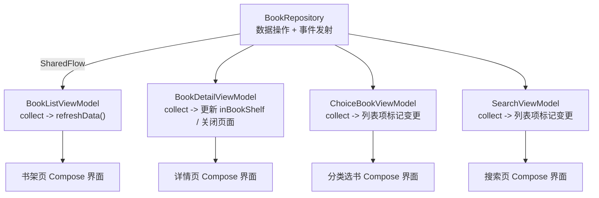
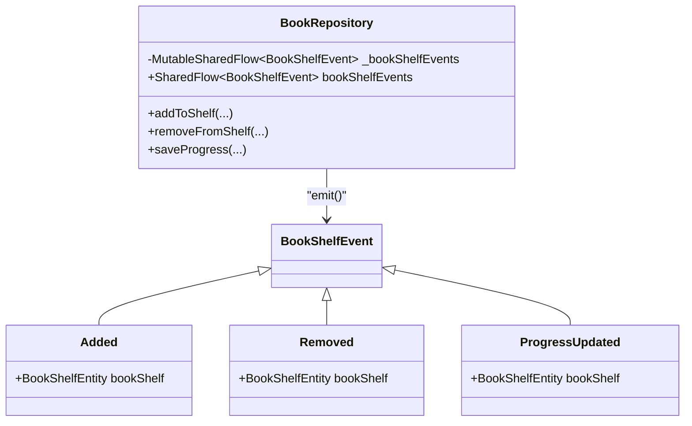
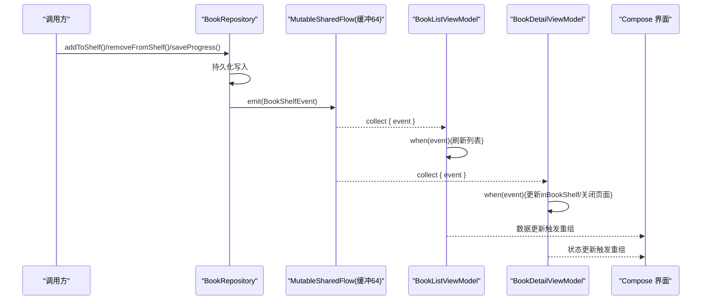
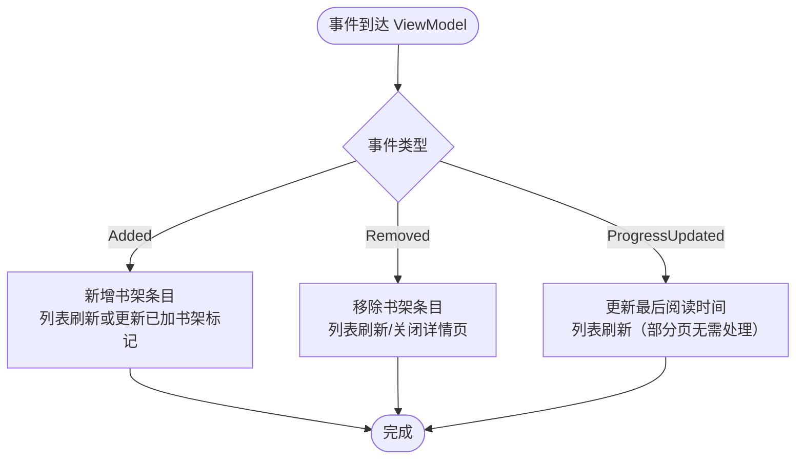
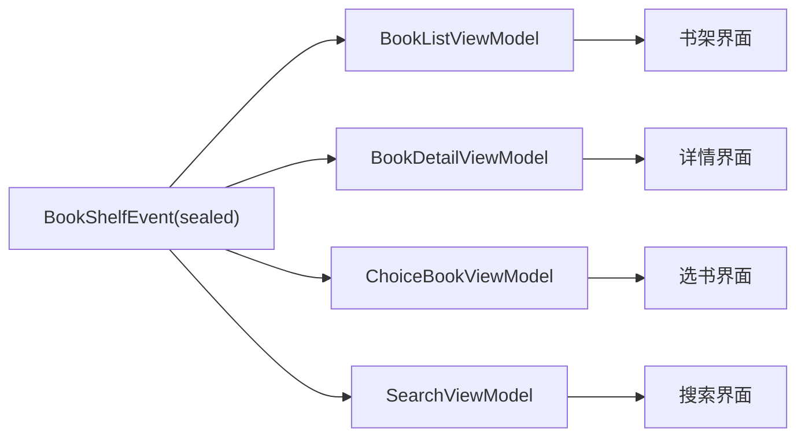

# 事件分发机制

<cite>
**本文引用的文件**
- [BookRepository.kt](file://lib_book_common/src/main/java/com/ebook/common/repository/BookRepository.kt)
- [BookListViewModel.kt](file://module_book/src/main/java/com/ebook/book/mvvm/viewmodel/BookListViewModel.kt)
- [BookDetailViewModel.kt](file://module_book/src/main/java/com/ebook/book/mvvm/viewmodel/BookDetailViewModel.kt)
- [ChoiceBookViewModel.kt](file://module_find/src/main/java/com/ebook/find/mvvm/viewmodel/ChoiceBookViewModel.kt)
- [SearchViewModel.kt](file://module_find/src/main/java/com/ebook/find/mvvm/viewmodel/SearchViewModel.kt)
- [0004-rxbus-to-sharedflow.md](file://docs/adr/0004-rxbus-to-sharedflow.md)
- [BookRepositoryTest.kt](file://lib_book_common/src/test/java/com/ebook/common/repository/BookRepositoryTest.kt)
</cite>

## 目录
1. [简介](#简介)
2. [项目结构](#项目结构)
3. [核心组件](#核心组件)
4. [架构总览](#架构总览)
5. [详细组件分析](#详细组件分析)
6. [依赖关系分析](#依赖关系分析)
7. [性能考虑](#性能考虑)
8. [故障排查指南](#故障排查指南)
9. [结论](#结论)

## 简介
本文档系统性说明书架事件分发机制：以 BookShelfEvent sealed class 为中心，通过 Kotlin Coroutines SharedFlow 将数据变更从 Repository 广播到各 ViewModel，再响应式驱动 UI 更新。重点包括三类事件的语义、SharedFlow 的缓冲策略与只读暴露模式、事件订阅的完整链路，以及与历史 RxBus 方案在类型安全、生命周期感知、内存泄漏防护等方面的对比优势。

## 项目结构
事件机制围绕“仓库—视图模型—界面”分层展开：
- 数据层：BookRepository 封装书架 CRUD，并在数据变更后发射 BookShelfEvent。
- 视图层：多个 ViewModel（书架页、详情页、选书/搜索页）在 viewModelScope 内收集 SharedFlow 并根据事件分支刷新或调整状态。
- 展示层：Compose UI 根据 VM 状态自动重组，实现响应式 UI 更新。

**图示来源**
- [BookRepository.kt:30-52](file://lib_book_common/src/main/java/com/ebook/common/repository/BookRepository.kt#L30-L52)
- [BookListViewModel.kt:28-41](file://module_book/src/main/java/com/ebook/book/mvvm/viewmodel/BookListViewModel.kt#L28-L41)
- [BookDetailViewModel.kt:65-88](file://module_book/src/main/java/com/ebook/book/mvvm/viewmodel/BookDetailViewModel.kt#L65-L88)
- [ChoiceBookViewModel.kt:45-78](file://module_find/src/main/java/com/ebook/find/mvvm/viewmodel/ChoiceBookViewModel.kt#L45-L78)
- [SearchViewModel.kt:51-75](file://module_find/src/main/java/com/ebook/find/mvvm/viewmodel/SearchViewModel.kt#L51-L75)

**章节来源**
- [BookRepository.kt:30-52](file://lib_book_common/src/main/java/com/ebook/common/repository/BookRepository.kt#L30-L52)
- [BookListViewModel.kt:13-41](file://module_book/src/main/java/com/ebook/book/mvvm/viewmodel/BookListViewModel.kt#L13-L41)
- [BookDetailViewModel.kt:22-88](file://module_book/src/main/java/com/ebook/book/mvvm/viewmodel/BookDetailViewModel.kt#L22-L88)
- [ChoiceBookViewModel.kt:20-78](file://module_find/src/main/java/com/ebook/find/mvvm/viewmodel/ChoiceBookViewModel.kt#L20-L78)
- [SearchViewModel.kt:24-75](file://module_find/src/main/java/com/ebook/find/mvvm/viewmodel/SearchViewModel.kt#L24-L75)

## 核心组件
- BookShelfEvent：sealed class，定义三类书架事件 Added、Removed、ProgressUpdated，携带 BookShelfEntity 语义载荷。
- MutableSharedFlow/SharedFlow：Repository 内部使用可变流发射事件，对外暴露只读 SharedFlow，消费方在 viewModelScope 收集，天然遵循生命周期取消。
- ViewModel 订阅者：各页面 VM 集中处理事件，统一触发列表刷新或局部状态同步。

**图示来源**
- [BookRepository.kt:41-52](file://lib_book_common/src/main/java/com/ebook/common/repository/BookRepository.kt#L41-L52)
- [BookRepository.kt:412-421](file://lib_book_common/src/main/java/com/ebook/common/repository/BookRepository.kt#L412-L421)

**章节来源**
- [BookRepository.kt:41-52](file://lib_book_common/src/main/java/com/ebook/common/repository/BookRepository.kt#L41-L52)
- [BookRepository.kt:412-421](file://lib_book_common/src/main/java/com/ebook/common/repository/BookRepository.kt#L412-L421)

## 架构总览
- 数据变更到 UI 更新的完整链路
  - 数据侧：Repository 的 addToShelf/removeFromShelf/saveProgress 在完成持久化后，分别 emit Added/Removed/ProgressUpdated。
  - 事件总线：_bookShelfEvents 为 MutableSharedFlow(extraBufferCapacity = 64)，asSharedFlow() 暴露只读接口给所有订阅者。
  - ViewModel 订阅：在 viewModelScope.launch{} 中 collect {} 并穷尽 when 分支处理；新增事件会强制编译期覆盖（sealed class），避免漏处理。
  - UI 更新：VM 根据事件类型执行刷新或状态变更；Compose 观察 VM 状态自然重组。

**图示来源**
- [BookRepository.kt:110-161](file://lib_book_common/src/main/java/com/ebook/common/repository/BookRepository.kt#L110-L161)
- [BookRepository.kt:51-52](file://lib_book_common/src/main/java/com/ebook/common/repository/BookRepository.kt#L51-L52)
- [BookListViewModel.kt:28-41](file://module_book/src/main/java/com/ebook/book/mvvm/viewmodel/BookListViewModel.kt#L28-L41)
- [BookDetailViewModel.kt:65-88](file://module_book/src/main/java/com/ebook/book/mvvm/viewmodel/BookDetailViewModel.kt#L65-L88)

## 详细组件分析

### BookShelfEvent 事件模型与设计要点
- 语义
  - Added：书籍新增入书架。
  - Removed：书籍从书架移除（含关联清理）。
  - ProgressUpdated：阅读进度保存导致最后阅读时间等字段更新。
- 数据结构
  - 均携带 BookShelfEntity 实例作为上下文，确保消费方可精准定位目标书籍。
- 设计优势
  - sealed class 提供编译期穷尽检查，新增子类型会在消费端产生编译错误，避免运行时误判/遗漏。
  - 与之前 String tag + Any payload 的方式相比，类型更安全、易维护。

**章节来源**
- [BookRepository.kt:412-421](file://lib_book_common/src/main/java/com/ebook/common/repository/BookRepository.kt#L412-L421)

### SharedFlow 广播机制与背压策略
- 发射端
  - 私有的 MutableSharedFlow 使用 extraBufferCapacity = 64，用于容纳瞬时并发的事件峰值，减少被压回的风险。
  - 对外仅暴露 val bookShelfEvents: SharedFlow<T> = _bookShelfEvents.asSharedFlow()，禁止外部发射事件，保证单向数据流。
- 订阅端
  - 各 ViewModel 在 viewModelScope.launch{ collect{} } 中进行阻塞收集，随着 ViewModel 销毁自动取消，防止资源泄漏。
- 无 replay 的权衡
  - SharedFlow 默认不重放先于订阅发射的事件；当前场景无粘性事件依赖（见 ADR-0004），适合以“实时+短暂缓冲”的模式工作。

**章节来源**
- [BookRepository.kt:51-52](file://lib_book_common/src/main/java/com/ebook/common/repository/BookRepository.kt#L51-L52)
- [0004-rxbus-to-sharedflow.md:1-14](file://docs/adr/0004-rxbus-to-sharedflow.md#L1-L14)

### 事件链路与 ViewModel 订阅实践
- BookListViewModel
  - 在 init 中以 viewModelScope.launch 收集事件；Added/Removed/ProgressUpdated 全部统一走 refreshData()，幂等刷新列表。
  - refreshData 拉取详情并更新列表，异常时记录日志并确保停止刷新指示器。
- BookDetailViewModel
  - 收集事件：Added 时若匹配当前书则置 inBookShelf=true；Removed 时发送关闭命令；ProgressUpdated 直接忽略。
  - 注意：该收集放入 VM init，可避免 Activity 旋转时重复订阅造成的重复累积问题。
- ChoiceBookViewModel / SearchViewModel
  - 维护本地书架快照（list<BookShelfEntity>），收到 Added/Removed 时同步快照并在列表中就地更新对应项的“已加书架”标识。
  - ProgressUpdated 与搜索/分类页无关，直接忽略。

以下为关键订阅片段的路径引用（不包含代码内容）：
- 书架列表事件订阅与刷新入口：[BookListViewModel.kt:28-41](file://module_book/src/main/java/com/ebook/book/mvvm/viewmodel/BookListViewModel.kt#L28-L41)、[BookListViewModel.kt:43-56](file://module_book/src/main/java/com/ebook/book/mvvm/viewmodel/BookListViewModel.kt#L43-L56)
- 详情页事件订阅与状态联动：[BookDetailViewModel.kt:65-88](file://module_book/src/main/java/com/ebook/book/mvvm/viewmodel/BookDetailViewModel.kt#L65-L88)
- 分类选书页事件订阅与列表项状态更新：[ChoiceBookViewModel.kt:45-78](file://module_find/src/main/java/com/ebook/find/mvvm/viewmodel/ChoiceBookViewModel.kt#L45-L78)、[ChoiceBookViewModel.kt:124-132](file://module_find/src/main/java/com/ebook/find/mvvm/viewmodel/ChoiceBookViewModel.kt#L124-L132)
- 搜索页事件订阅与列表项状态更新：[SearchViewModel.kt:51-75](file://module_find/src/main/java/com/ebook/find/mvvm/viewmodel/SearchViewModel.kt#L51-L75)、[SearchViewModel.kt:182-190](file://module_find/src/main/java/com/ebook/find/mvvm/viewmodel/SearchViewModel.kt#L182-L190)

**图示来源**
- [BookListViewModel.kt:32-39](file://module_book/src/main/java/com/ebook/book/mvvm/viewmodel/BookListViewModel.kt#L32-L39)
- [BookDetailViewModel.kt:69-87](file://module_book/src/main/java/com/ebook/book/mvvm/viewmodel/BookDetailViewModel.kt#L69-L87)
- [ChoiceBookViewModel.kt:47-60](file://module_find/src/main/java/com/ebook/find/mvvm/viewmodel/ChoiceBookViewModel.kt#L47-L60)
- [SearchViewModel.kt:59-73](file://module_find/src/main/java/com/ebook/find/mvvm/viewmodel/SearchViewModel.kt#L59-L73)

**章节来源**
- [BookListViewModel.kt:13-56](file://module_book/src/main/java/com/ebook/book/mvvm/viewmodel/BookListViewModel.kt#L13-L56)
- [BookDetailViewModel.kt:22-88](file://module_book/src/main/java/com/ebook/book/mvvm/viewmodel/BookDetailViewModel.kt#L22-L88)
- [ChoiceBookViewModel.kt:20-78](file://module_find/src/main/java/com/ebook/find/mvvm/viewmodel/ChoiceBookViewModel.kt#L20-L78)
- [SearchViewModel.kt:24-75](file://module_find/src/main/java/com/ebook/find/mvvm/viewmodel/SearchViewModel.kt#L24-L75)

### 与 RxBus 的优势对比（基于 ADR-0004 与实现）
- 类型安全
  - 使用 sealed class 替代 String tag + Any payload，编译期穷尽检查，新增事件分支强制处理。
- 生命周期感知
  - ViewModel 内用 viewModelScope.launch{ collect{} }，随 VM 销毁自动取消，避免 Activity 旋转导致的重复订阅与内存泄漏。
- 背压策略
  - SharedFlow 提供缓冲（extraBufferCapacity=64）保护瞬时并发；RxBus 的粘性事件语义未保留，且当前无消费方依赖粘性。
- 可测试性
  - 单元测试通过监听共享流来验证事件发射是否正确（见 BookRepositoryTest）。

**章节来源**
- [0004-rxbus-to-sharedflow.md:1-14](file://docs/adr/0004-rxbus-to-sharedflow.md#L1-L14)
- [BookRepositoryTest.kt:140-184](file://lib_book_common/src/test/java/com/ebook/common/repository/BookRepositoryTest.kt#L140-L184)

## 依赖关系分析
- 强耦合点
  - 各 ViewModel 都依赖 BookRepository.bookShelfEvents 进行事件消费。
  - ViewModel 对 BookShelfEvent 的分支处理必须穷尽，保证新事件的强制覆盖。
- 间接依赖
  - UI 不直接关心事件细节，只消费 VM 的状态流；事件 → VM 状态 → UI 的链路清晰，利于解耦与维护。

**图示来源**
- [BookListViewModel.kt:28-41](file://module_book/src/main/java/com/ebook/book/mvvm/viewmodel/BookListViewModel.kt#L28-L41)
- [BookDetailViewModel.kt:65-88](file://module_book/src/main/java/com/ebook/book/mvvm/viewmodel/BookDetailViewModel.kt#L65-L88)
- [ChoiceBookViewModel.kt:45-78](file://module_find/src/main/java/com/ebook/find/mvvm/viewmodel/ChoiceBookViewModel.kt#L45-L78)
- [SearchViewModel.kt:51-75](file://module_find/src/main/java/com/ebook/find/mvvm/viewmodel/SearchViewModel.kt#L51-L75)

**章节来源**
- [BookListViewModel.kt:13-41](file://module_book/src/main/java/com/ebook/book/mvvm/viewmodel/BookListViewModel.kt#L13-L41)
- [BookDetailViewModel.kt:22-88](file://module_book/src/main/java/com/ebook/book/mvvm/viewmodel/BookDetailViewModel.kt#L22-L88)
- [ChoiceBookViewModel.kt:20-78](file://module_find/src/main/java/com/ebook/find/mvvm/viewmodel/ChoiceBookViewModel.kt#L20-L78)
- [SearchViewModel.kt:24-75](file://module_find/src/main/java/com/ebook/find/mvvm/viewmodel/SearchViewModel.kt#L24-L75)

## 性能考虑
- 缓冲容量
  - extraBufferCapacity=64 适用于短时突发事件场景，避免背压导致丢事件或阻塞写端。
- 收集范围
  - 事件在 ViewModel 内收集，而非 Activity 层，避免重复订阅与资源浪费；同时受益于 lifecycle 自动取消。
- UI 刷新策略
  - 列表页采用统一刷新入口（refreshData），保证幂等性与一致刷新逻辑；详情页按事件精细修改最小必要状态，避免全量重绘。
- 线程切换
  - Repository 数据操作放在 IO 调度器（withContext(Dispatchers.IO)），事件发射不在主线程，降低 UI 卡顿风险。

**章节来源**
- [BookRepository.kt:51-52](file://lib_book_common/src/main/java/com/ebook/common/repository/BookRepository.kt#L51-L52)
- [BookListViewModel.kt:28-56](file://module_book/src/main/java/com/ebook/book/mvvm/viewmodel/BookListViewModel.kt#L28-L56)

## 故障排查指南
- 现象：添加书籍后界面未刷新
  - 检查 ViewModel 是否在 init 中启动事件收集；确认分支是否穷尽处理 Added/Removed/ProgressUpdated。
  - 核查 refreshData 是否正确拉取数据并更新列表。
- 现象：详情页添加后未更新 inBookShelf
  - 核对 BookDetailViewModel 中对 Added 的处理是否与当前书匹配（noteUrl 比对）。
- 现象：大量添加/删除时偶发丢失事件
  - 确认消费端订阅早于生产侧发射（测试用例展示了先订阅再运行任务的顺序）；必要时提高缓冲容量或减少批量写入粒度。
- 现象：旋转重建后出现重复元素或事件堆积
  - 确保订阅位于 ViewModel init（而非 Activity），避免多次重复收集。

相关验证参考：
- 单元测试对事件流的覆盖：[BookRepositoryTest.kt:140-184](file://lib_book_common/src/test/java/com/ebook/common/repository/BookRepositoryTest.kt#L140-L184)

**章节来源**
- [BookRepositoryTest.kt:140-184](file://lib_book_common/src/test/java/com/ebook/common/repository/BookRepositoryTest.kt#L140-L184)

## 结论
本项目将原本基于 RxBus 的书页事件机制迁移至 Kotlin Coroutines SharedFlow，并通过 sealed class 严格约束事件类型。Repository 负责数据变更与事件发射，ViewModel 在生命周期安全的范围内消费事件并完成 UI 同步，构成“数据→事件→状态→界面”的清晰链路。该方案具备类型安全、生命周期感知、内存泄漏防护、可测试性强等优势，支撑了书架、详情、搜索等多页面的稳定响应式体验。