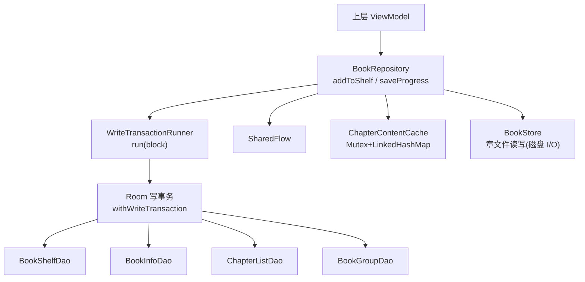
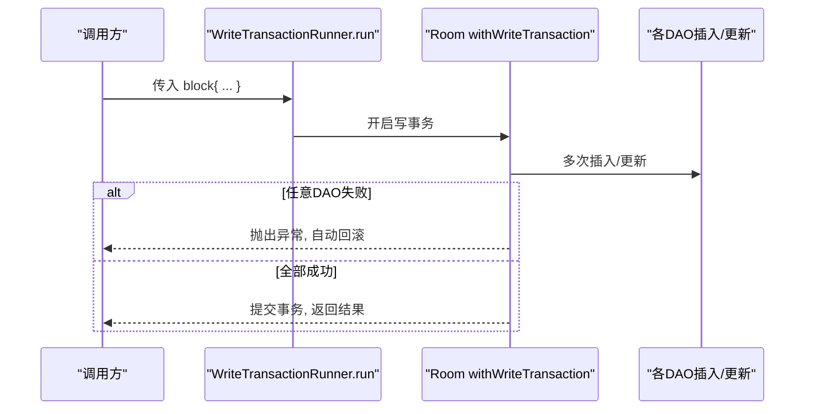
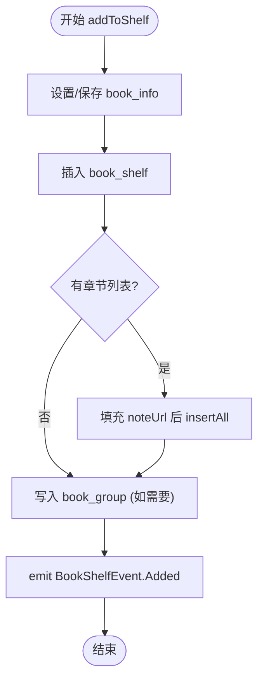
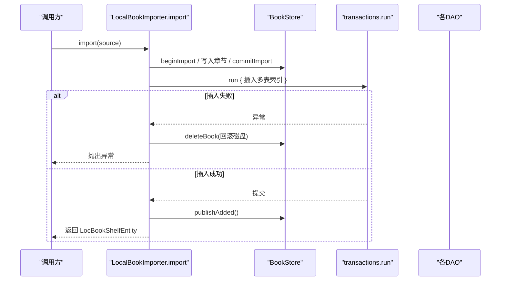
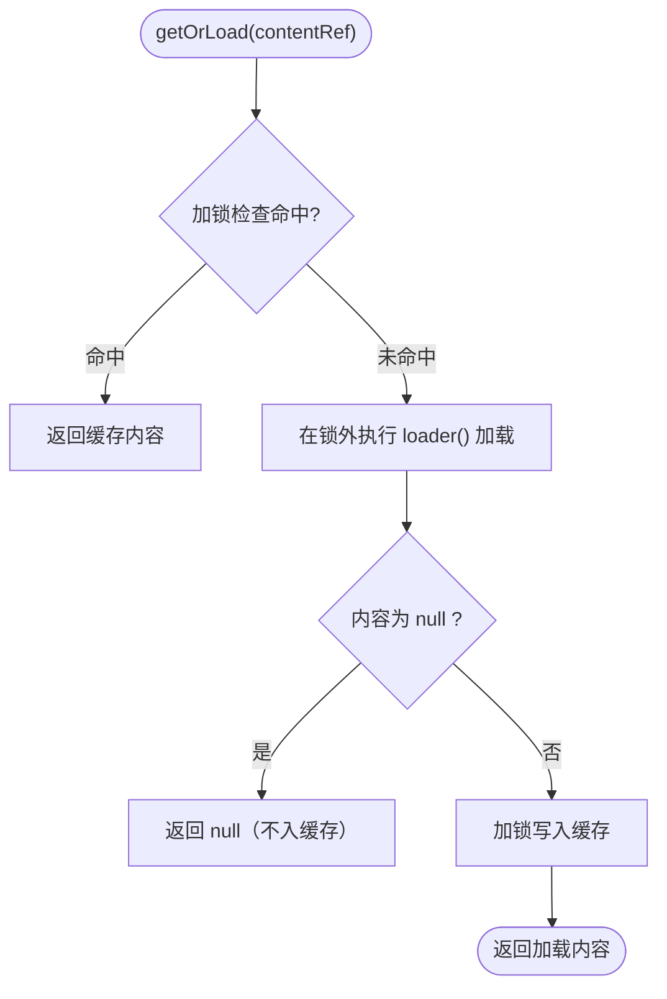
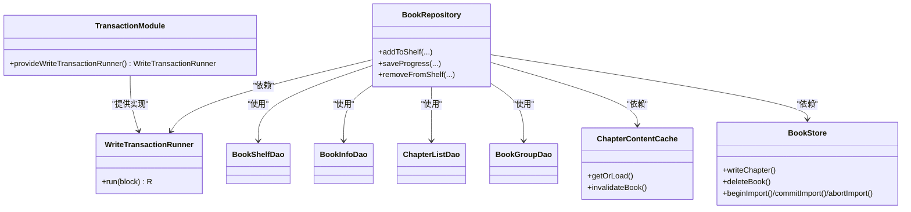

# 事务管理与并发控制

<cite>
**本文引用的文件**
- [WriteTransactionRunner.kt](file://lib_book_common/src/main/java/com/ebook/common/store/WriteTransactionRunner.kt)
- [TransactionModule.kt](file://lib_book_common/src/main/java/com/ebook/common/di/TransactionModule.kt)
- [BookRepository.kt](file://lib_book_common/src/main/java/com/ebook/common/repository/BookRepository.kt)
- [BookShelfManager.kt](file://lib_book_common/src/main/java/com/ebook/common/manager/BookShelfManager.kt)
- [LocalBookImporter.kt](file://lib_book_common/src/main/java/com/ebook/common/importer/LocalBookImporter.kt)
- [ChapterContentCache.kt](file://lib_book_common/src/main/java/com/ebook/common/store/ChapterContentCache.kt)
- [BookStore.kt](file://lib_book_common/src/main/java/com/ebook/common/store/BookStore.kt)
- [BookShelfDao.kt](file://lib_ebook_db/src/main/java/com/ebook/db/dao/BookShelfDao.kt)
- [BookShelfEntity.kt](file://lib_ebook_db/src/main/java/com/ebook/db/entity/BookShelfEntity.kt)
- [BookInfoEntity.kt](file://lib_ebook_db/src/main/java/com/ebook/db/entity/BookInfoEntity.kt)
- [ChapterListEntity.kt](file://lib_ebook_db/src/main/java/com/ebook/db/entity/ChapterListEntity.kt)
</cite>

## 目录
1. [简介](#简介)
2. [项目结构与相关模块](#项目结构与相关模块)
3. [核心组件概览](#核心组件概览)
4. [架构总览](#架构总览)
5. [详细组件分析](#详细组件分析)
6. [依赖关系分析](#依赖关系分析)
7. [性能与并发特性](#性能与并发特性)
8. [故障排查指南](#故障排查指南)
9. [结论](#结论)

## 简介
本文聚焦本项目在“写路径”上的事务管理与并发控制：以可注入的事务包装器统一落库，确保多表写入的原子性；以 SharedFlow 和互斥锁实现事件流与内存缓存的线程安全；遵循协程调度约定，将所有阻塞 I/O 放在 IO 调度器执行，避免阻塞主线程。并重点给出“书籍添加到书架”的完整事务流程及异常回滚行为说明。

## 项目结构与相关模块
本项目围绕“事务封装 + Repository 组合调用 + Room DAO + 内存缓存”的分层组织事务与并发控制：
- 事务抽象与提供：通过接口 WriteTransactionRunner 暴露统一的写事务执行点，由 Hilt 模块将其绑定到 Room 的 withWriteTransaction。
- 仓库聚合：BookRepository 将 BookShelfDao、BookInfoDao、ChapterListDao、BookGroupDao 等多 DAO 操作组合在一个业务方法中（例如 addToShelf），并通过事务包装器确保整体原子性。
- 导入流水线：LocalBookImporter 将章节文件落盘与索引写入用单个事务批量提交，失败时清理已写的章文件，保证磁盘与数据库的一致性。
- 内存缓存与事件流：ChapterContentCache 使用 Mutex 保护共享 map；BookRepository 的 _bookShelfEvents 基于 MutableSharedFlow 对外广播书架变化事件，具备背压缓冲。

本节为高层结构描述，未直接分析具体代码片段。

## 架构总览
以下图展示了“添加书籍到书架”涉及的核心类型与交互：仓库发起多表写入，事务包裹确保原子性，事件流通知 UI，章节正文读取经缓存加速。

图表来源
- [BookRepository.kt:118-147](file://lib_book_common/src/main/java/com/ebook/common/repository/BookRepository.kt#L118-L147)
- [WriteTransactionRunner.kt:11-13](file://lib_book_common/src/main/java/com/ebook/common/store/WriteTransactionRunner.kt#L11-L13)
- [TransactionModule.kt:17-24](file://lib_book_common/src/main/java/com/ebook/common/di/TransactionModule.kt#L17-L24)
- [BookShelfDao.kt:70-104](file://lib_ebook_db/src/main/java/com/ebook/db/dao/BookShelfDao.kt#L70-L104)
- [ChapterContentCache.kt:21-42](file://lib_book_common/src/main/java/com/ebook/common/store/ChapterContentCache.kt#L21-L42)
- [BookStore.kt:15-117](file://lib_book_common/src/main/java/com/ebook/common/store/BookStore.kt#L15-L117)

节内来源
- [BookRepository.kt:118-147](file://lib_book_common/src/main/java/com/ebook/common/repository/BookRepository.kt#L118-L147)
- [TransactionModule.kt:17-24](file://lib_book_common/src/main/java/com/ebook/common/di/TransactionModule.kt#L17-L24)

## 核心组件概览
- WriteTransactionRunner：声明式事务边界，接收一个可挂起块，在实现中交由 Room 的单写事务执行。其存在是为业务代码统一收口、也便于纯 JVM 测试运行完整的批量写路径。
- TransactionModule：Hilt 模块，将 WriteTransactionRunner 实现为 Room 的 withWriteTransaction 调用。
- BookRepository：聚合多个 DAO 的业务入口，完成“添加到书架”“保存进度”“移除书架”等跨表一致性操作，并广播事件。
- LocalBookImporter：本地书导入管道，先切分并写入章节文件，再用单个事务批量写索引；失败时删除对应目录，保证文件系统与数据库一致。
- ChapterContentCache：线程安全的 LRU 式内存缓存，用于章节正文页面快速加载。
- BookStore：本地章文件与封面的目录化存储，提供 beginImport/commitImport/abortImport/deleteBook 等原子切换能力。

节内来源
- [WriteTransactionRunner.kt:3-13](file://lib_book_common/src/main/java/com/ebook/common/store/WriteTransactionRunner.kt#L3-L13)
- [TransactionModule.kt:12-24](file://lib_book_common/src/main/java/com/ebook/common/di/TransactionModule.kt#L12-L24)
- [BookRepository.kt:30-52](file://lib_book_common/src/main/java/com/ebook/common/repository/BookRepository.kt#L30-L52)
- [LocalBookImporter.kt:34-56](file://lib_book_common/src/main/java/com/ebook/common/importer/LocalBookImporter.kt#L34-L56)
- [ChapterContentCache.kt:7-23](file://lib_book_common/src/main/java/com/ebook/common/store/ChapterContentCache.kt#L7-L23)
- [BookStore.kt:40-77](file://lib_book_common/src/main/java/com/ebook/common/store/BookStore.kt#L40-L77)

## 架构总览
见上节架构图。该图将“上层调用 → 仓库 → 事务 → DAO/数据库 → 事件/缓存/存储”的整体链路可视化，并在下方“详细组件分析”映射到具体源码位置。

图表来源
- [BookRepository.kt:118-147](file://lib_book_common/src/main/java/com/ebook/common/repository/BookRepository.kt#L118-L147)
- [TransactionModule.kt:17-24](file://lib_book_common/src/main/java/com/ebook/common/di/TransactionModule.kt#L17-L24)
- [ChapterContentCache.kt:21-42](file://lib_book_common/src/main/java/com/ebook/common/store/ChapterContentCache.kt#L21-L42)
- [BookStore.kt:40-77](file://lib_book_common/src/main/java/com/ebook/common/store/BookStore.kt#L40-L77)

## 详细组件分析

### WriteTransactionRunner：事务包装器
- 作用：为所有“写”路径提供单一事务边界；任何失败的落库都会触发整个 block 回滚，从而保证多表操作的 ACID 语义。
- 实现方式：由 TransactionModule 在运行时注入为 Room 的 withWriteTransaction 调用。调用方只需把一组 DAO 写操作放在 run { } 内即可。
- 优势：
  - 统一收口：业务代码无需分散处理 withWriteTransaction，降低遗漏风险。
  - 可测试：可在 JVM 测试环境复用同一接口驱动完整批量写链路，不强制依赖 Android 运行时。

图表来源
- [WriteTransactionRunner.kt:11-13](file://lib_book_common/src/main/java/com/ebook/common/store/WriteTransactionRunner.kt#L11-L13)
- [TransactionModule.kt:17-24](file://lib_book_common/src/main/java/com/ebook/common/di/TransactionModule.kt#L17-L24)

节内来源
- [WriteTransactionRunner.kt:3-13](file://lib_book_common/src/main/java/com/ebook/common/store/WriteTransactionRunner.kt#L3-L13)
- [TransactionModule.kt:12-24](file://lib_book_common/src/main/java/com/ebook/common/di/TransactionModule.kt#L12-L24)

### BookRepository.addToShelf：多表插入事务与事件通知
- 功能：将一本书加入书架，可能涉及 book_info、book_shelf、chapter_list、book_group 四张表。
- 事务模式：在真实使用中应将这些写操作放入 transactions.run { } 或 transactions.execute { } 块中；任一 DAO 失败即整体回滚。
- 额外逻辑：若包含 chapterList，会填充 noteUrl 后批量插入；最后尝试补齐 book_group 行以保证评论/聚合键可用。成功后向 SharedFlow 发送 Added 事件。

图表来源
- [BookRepository.kt:118-147](file://lib_book_common/src/main/java/com/ebook/common/repository/BookRepository.kt#L118-L147)
- [BookShelfDao.kt:70-104](file://lib_ebook_db/src/main/java/com/ebook/db/dao/BookShelfDao.kt#L70-L104)

注意
- 为了获得 ACID，上述多表写入应当处于同一个 write 事务内；当前文件中该方法自身并未显式包装事务，最佳实践是将调用处改为事务包裹或将此方法重构为内部使用事务包装。推荐做法参见 LocalBookImporter 中的用法。

节内来源
- [BookRepository.kt:118-147](file://lib_book_common/src/main/java/com/ebook/common/repository/BookRepository.kt#L118-L147)
- [BookShelfDao.kt:70-104](file://lib_ebook_db/src/main/java/com/ebook/db/dao/BookShelfDao.kt#L70-L104)
- [BookShelfEntity.kt:15-68](file://lib_ebook_db/src/main/java/com/ebook/db/entity/BookShelfEntity.kt#L15-L68)
- [BookInfoEntity.kt:14-69](file://lib_ebook_db/src/main/java/com/ebook/db/entity/BookInfoEntity.kt#L14-L69)
- [ChapterListEntity.kt:14-48](file://lib_ebook_db/src/main/java/com/ebook/db/entity/ChapterListEntity.kt#L14-L48)

### LocalBookImporter：导入流水线与事务、回滚清理
- 三阶段：拷贝+哈希 → 切分落章文件 → 单一事务批量写索引（book_shelf、book_info、chapter_list、book_group）。
- 错误恢复：若事务抛错，捕获异常后删除对应书籍目录，防止出现“库中无记录但磁盘已有数据”的不一致状态。
- 成功路径：提交导入目录、构造实体、写入事务、补全内存对象并发送事件。

图表来源
- [LocalBookImporter.kt:62-143](file://lib_book_common/src/main/java/com/ebook/common/importer/LocalBookImporter.kt#L62-L143)
- [BookStore.kt:40-82](file://lib_book_common/src/main/java/com/ebook/common/store/BookStore.kt#L40-L82)

节内来源
- [LocalBookImporter.kt:34-56](file://lib_book_common/src/main/java/com/ebook/common/importer/LocalBookImporter.kt#L34-L56)
- [LocalBookImporter.kt:62-143](file://lib_book_common/src/main/java/com/ebook/common/importer/LocalBookImporter.kt#L62-L143)
- [BookStore.kt:40-82](file://lib_book_common/src/main/java/com/ebook/common/store/BookStore.kt#L40-L82)

### ChapterContentCache：并发安全的内存缓存
- 结构：基于 LinkedHashMap 的访问序 LRU 缓存，默认容量 3（当前章与前后预读）。
- 并发安全：使用 Mutex 保护 getOrLoad/invalidateBook/clear，避免多线程读写导致的数据竞争。
- 失效策略：按 bookId 片段剔除；当 reader 注册表补齐后可自然重新加载（空结果不入缓存）。

图表来源
- [ChapterContentCache.kt:21-42](file://lib_book_common/src/main/java/com/ebook/common/store/ChapterContentCache.kt#L21-L42)

节内来源
- [ChapterContentCache.kt:7-23](file://lib_book_common/src/main/java/com/ebook/common/store/ChapterContentCache.kt#L7-L23)
- [ChapterContentCache.kt:21-42](file://lib_book_common/src/main/java/com/ebook/common/store/ChapterContentCache.kt#L21-L42)

### BookShelfManager：加入书架的统一编排（非事务）
- 职责：封装书架查询、搜索结果标记、从搜索页加入书架流程；内部调用 BookRepository.addToShelf 做持久化。
- 取消语义：捕获 CancellationException 后原样上抛，不被视为业务失败，避免 UI 误判。

节内来源
- [BookShelfManager.kt:17-23](file://lib_book_common/src/main/java/com/ebook/common/manager/BookShelfManager.kt#L17-L23)
- [BookShelfManager.kt:38-61](file://lib_book_common/src/main/java/com/ebook/common/manager/BookShelfManager.kt#L38-L61)

## 依赖关系分析
- BookRepository 依赖：
  - 四个 DAO：BookShelfDao、BookInfoDao、ChapterListDao、BookGroupDao（用于多表写入/查询）。
  - 章节读取管线：Map<BookFormat, ChapterReader> 用于统一读取本地/网络书籍。
  - 存储与缓存：BookStore 管理磁盘章文件；ChapterContentCache 进行内存缓存。
  - 事务包装器：WriteTransactionRunner。
- 事务提供：
  - TransactionModule 注入 AppDatabase 的 withWriteTransaction 作为事务实现。
- 事件机制：
  - BookRepository.bookShelfEvents 使用 MutableSharedFlow 暴露只读 SharedFlow 给 UI 订阅。

图表来源
- [TransactionModule.kt:17-24](file://lib_book_common/src/main/java/com/ebook/common/di/TransactionModule.kt#L17-L24)
- [BookRepository.kt:40-52](file://lib_book_common/src/main/java/com/ebook/common/repository/BookRepository.kt#L40-L52)
- [BookStore.kt:15-117](file://lib_book_common/src/main/java/com/ebook/common/store/BookStore.kt#L15-L117)
- [ChapterContentCache.kt:21-42](file://lib_book_common/src/main/java/com/ebook/common/store/ChapterContentCache.kt#L21-L42)

节内来源
- [TransactionModule.kt:12-24](file://lib_book_common/src/main/java/com/ebook/common/di/TransactionModule.kt#L12-L24)
- [BookRepository.kt:40-52](file://lib_book_common/src/main/java/com/ebook/common/repository/BookRepository.kt#L40-L52)

## 性能与并发特性
- Room 并发写入保护：Room 会在底层维护连接与并发安全，单实例 DAO 通常安全；对复杂写集合建议包裹事务以减少多次往返与一致性问题。
- SharedFlow 背压：_bookShelfEvents 使用带 extraBufferCapacity=64 的 MutableSharedFlow 暴露为 SharedFlow。背压策略决定在消费端落后时会如何处置（如丢弃旧事件或缓冲），UI 应及时收集以避免积压。
- 内存缓存 Mutex：ChapterContentCache 以 Mutex 临界区保护 Map 的读-改-写，避免多线程同时修改导致数据不一致；大任务不在临界区中执行，仅保护状态变更。
- withContext(Dispatchers.IO) 原则：将所有阻塞 I/O（文件读写、网络、数据库长时间操作）切换到 IO 调度器，防止阻塞主线程。仓库方法如 getAllBooks/getBookByUrl/saveProgress/addToShelf/removeFromShelf/loadChapter 等方法均以 withContext(IO) 包装，保证 UI 响应性。

节内来源
- [BookRepository.kt:57-161](file://lib_book_common/src/main/java/com/ebook/common/repository/BookRepository.kt#L57-L161)
- [ChapterContentCache.kt:21-42](file://lib_book_common/src/main/java/com/ebook/common/store/ChapterContentCache.kt#L21-L42)

## 故障排查指南
- 问题：书籍已成功写入部分表，但后续插入失败导致不一致
  - 现象：书架可见但缺少章节/元数据。
  - 定位：确认写入是否在同一写事务块内，失败是否会触底回滚。参考 TransactionsModule 的实现确保 withWriteTransaction 生效。
  - 修复：将 BookRepository.addToShelf 内的多表写入统一放入 transactions.run { }，或使用等价事务包装。
- 问题：导入过程中断留下孤儿目录
  - 现象：书架为空但磁盘 books/ 下存在残留目录。
  - 定位：检查导入路径是否在异常分支调用了 abortImport/deleteBook；或运行 BookStore.reconcile 清理。
  - 修复：LocalBookImporter.import 已将异常回落到 deleteBook，确保不再遗留。必要时补充 reconcile 步骤。
- 问题：UI 无法感知书架变动
  - 现象：添加书后界面不刷新。
  - 定位：检查 BookRepository.bookShelfEvents 是否被订阅；确认 emit 调用是否执行（如 Added）。
  - 修复：确保 ViewModel 或页面在生命周期内收集 Flow 并使用 collectLatest/collect 等。
- 问题：内存缓存未生效或过期不正确
  - 现象：重复读取相同章节造成 I/O 开销。
  - 定位：确认 content_ref 一致性与 invalidation 逻辑（按 bookId 片段清除）。
  - 修复：按规范清理相关条目；核对缓存容量与 key 生成规则。

节内来源
- [LocalBookImporter.kt:124-139](file://lib_book_common/src/main/java/com/ebook/common/importer/LocalBookImporter.kt#L124-L139)
- [BookStore.kt:94-108](file://lib_book_common/src/main/java/com/ebook/common/store/BookStore.kt#L94-L108)
- [ChapterContentCache.kt:44-53](file://lib_book_common/src/main/java/com/ebook/common/store/ChapterContentCache.kt#L44-L53)

## 结论
本项目采用“明确的事务边界 + 仓库聚合 + Room 连接保护 + 内存并发安全”的组合拳来保障写入的一致性与可靠性。核心要点如下：
- 所有相关的数据库写入应封装在 WriteTransactionRunner 提供的 run/block 中，确保多表操作的原子性。
- 共享资源（内存缓存）通过 Mutex 保护，事件流使用 SharedFlow 的缓冲机制进行背压控制。
- 所有阻塞 I/O 通过 withContext(Dispatchers.IO) 转移到工作线程，避免阻塞主线程。
- “添加到书架”的完整事务包含四类表的写入与事件发射，任一失败应回滚并透传异常；导入流水线在失败时也会回滚文件系统层面，避免脏数据滞留。