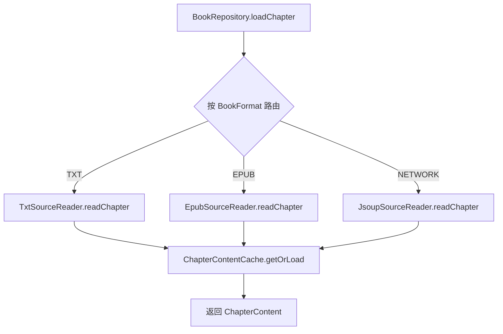
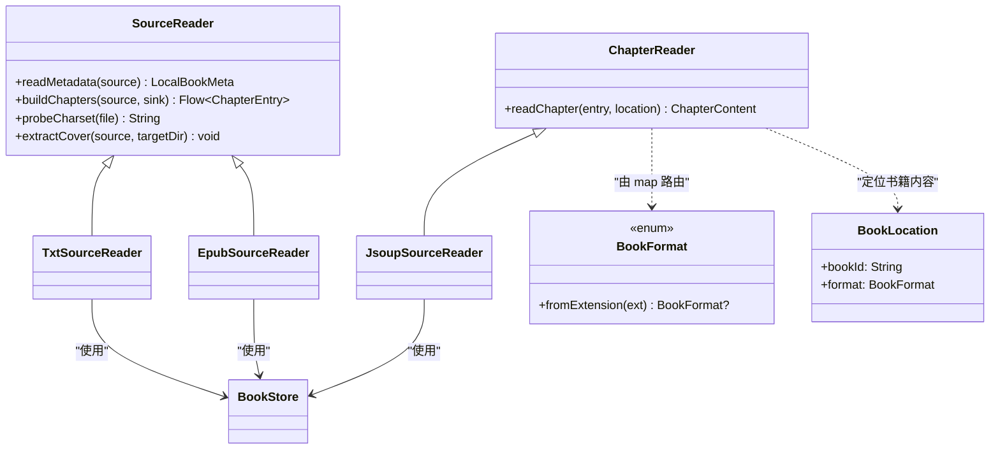
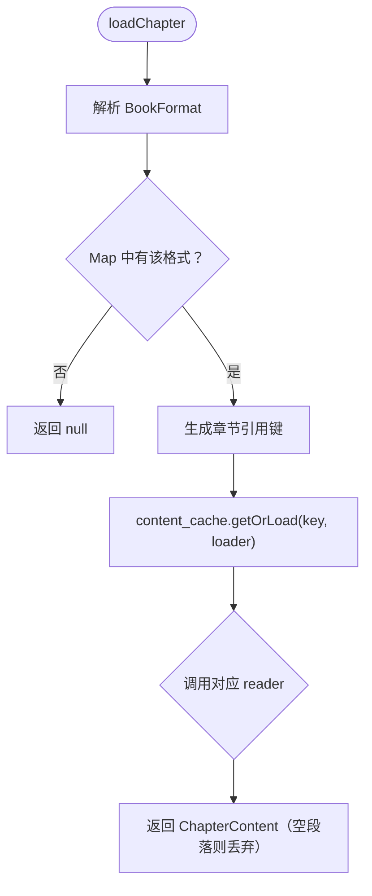
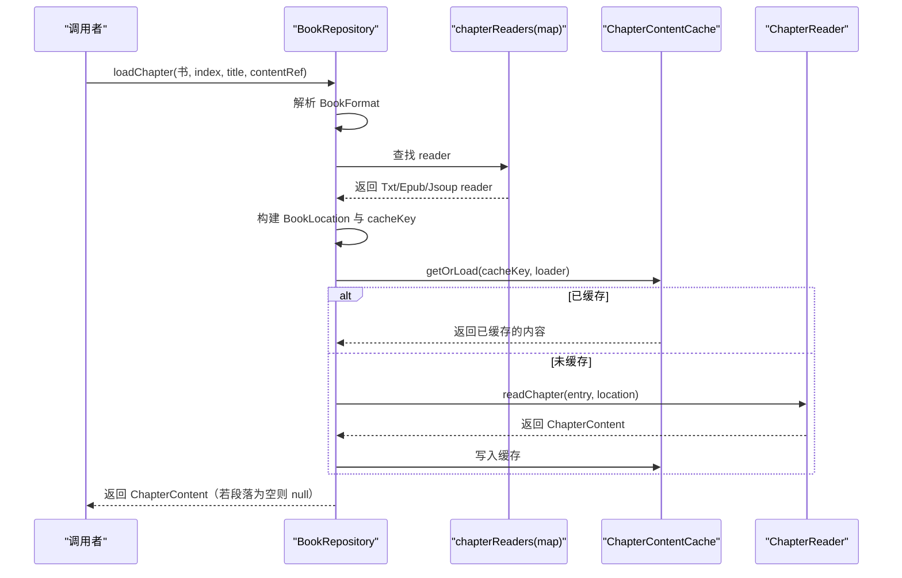
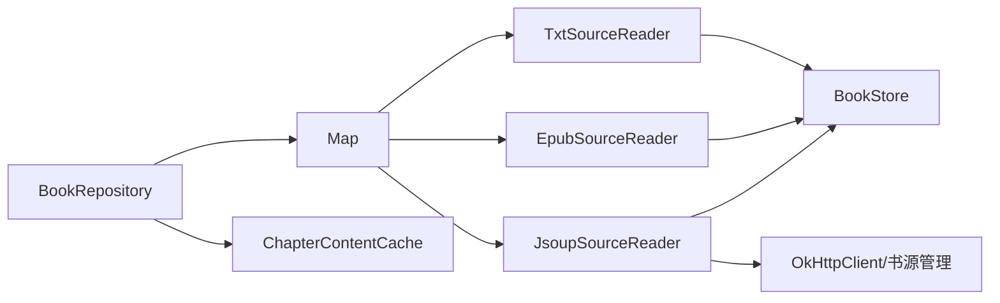

# 多数据源抽象与路由

<cite>
**本文档引用的文件**
- [ChapterReader.kt](file://lib_book_common/src/main/java/com/ebook/common/analyze/local/ChapterReader.kt)
- [Contracts.kt](file://lib_book_common/src/main/java/com/ebook/common/analyze/local/Contracts.kt)
- [TxtSourceReader.kt](file://lib_book_common/src/main/java/com/ebook/common/analyze/local/TxtSourceReader.kt)
- [EpubSourceReader.kt](file://lib_book_common/src/main/java/com/ebook/common/analyze/local/EpubSourceReader.kt)
- [JsoupSourceReader.kt](file://lib_book_common/src/main/java/com/ebook/common/analyze/source/JsoupSourceReader.kt)
- [ContentStoreModule.kt](file://lib_book_common/src/main/java/com/ebook/common/di/ContentStoreModule.kt)
- [BookRepository.kt](file://lib_book_common/src/main/java/com/ebook/common/repository/BookRepository.kt)
</cite>

## 目录
1. [引言](#引言)
2. [项目结构](#项目结构)
3. [核心组件](#核心组件)
4. [架构总览](#架构总览)
5. [详细组件分析](#详细组件分析)
6. [依赖关系分析](#依赖关系分析)
7. [性能考量](#性能考量)
8. [故障排查指南](#故障排查指南)
9. [结论](#结论)

## 引言
本文聚焦“多数据源抽象与路由”：以统一的章节读取接口屏蔽 TXT、EPUB、网络书源的差异，并通过格式枚举和双 Map 注册机制，将读取请求准确路由到对应读者；统一经内容缓存后返回标准化段落结果。该设计使得本地导入、在线解析、以及未来的新来源可在同一管线内无侵入扩展。

## 项目结构
围绕章节读取的职责分层如下：
- 抽象与契约：定义章节读取的通用入口、数据模型与存储落点。
- 读者实现：针对 TXT、EPUB、网络书的三种读取策略。
- 注入与路由：用 Hilt 提供两种映射表，分别服务正文读取与导入链路。
- 仓库协调：统一入口完成格式路由、内存缓存、调用读者、返回统一结果。

图示来源
- [BookRepository.kt:165-192](file://lib_book_common/src/main/java/com/ebook/common/repository/BookRepository.kt#L165-L192)
- [ContentStoreModule.kt:51-87](file://lib_book_common/src/main/java/com/ebook/common/di/ContentStoreModule.kt#L51-L87)

节来源
- [ChapterReader.kt:1-19](file://lib_book_common/src/main/java/com/ebook/common/analyze/local/ChapterReader.kt#L1-L19)
- [Contracts.kt:1-132](file://lib_book_common/src/main/java/com/ebook/common/analyze/local/Contracts.kt#L1-L132)
- [ContentStoreModule.kt:51-87](file://lib_book_common/src/main/java/com/ebook/common/di/ContentStoreModule.kt#L51-L87)
- [BookRepository.kt:165-192](file://lib_book_common/src/main/java/com/ebook/common/repository/BookRepository.kt#L165-L192)

## 核心组件
- 章节读取最小接口：
  - 负责“根据章节索引读取正文”，不关心来源是本地文件还是网络站点。
- 契约模型：
  - 书籍格式枚举：区分本地文件格式和网络虚拟标记。
  - 书籍位置抽象：仅暴露 bookId 与 format，屏蔽底层物理路径（File/Uri）细节。
  - 章节条目：index/title/contentRef，用于定位具体章节。
  - 章节内容：paragraphs 为规范化纯文本段，并提供 displayText 与段评锚点计算。
- 读者集合：
  - 导入链路专用的 SourceReader（能读元数据、扫描目录并写章节），包含本地格式。
  - 通用 ChapterReader（仅读一章），同时包含本地与网络来源。
- 注入与路由：
  - 两个 map：一个用于导入（含本地 reader），另一个用于正文读取（含网络 reader）。
- 仓库协调：
  - loadChapter 完成格式解析 → 选择 reader → 统一通过内容缓存 → 返回标准结构。

节来源
- [ChapterReader.kt:1-19](file://lib_book_common/src/main/java/com/ebook/common/analyze/local/ChapterReader.kt#L1-L19)
- [Contracts.kt:17-82](file://lib_book_common/src/main/java/com/ebook/common/analyze/local/Contracts.kt#L17-L82)
- [Contracts.kt:98-132](file://lib_book_common/src/main/java/com/ebook/common/analyze/local/Contracts.kt#L98-L132)
- [ContentStoreModule.kt:51-87](file://lib_book_common/src/main/java/com/ebook/common/di/ContentStoreModule.kt#L51-L87)
- [BookRepository.kt:165-192](file://lib_book_common/src/main/java/com/ebook/common/repository/BookRepository.kt#L165-L192)

## 架构总览

图示来源
- [ChapterReader.kt:1-19](file://lib_book_common/src/main/java/com/ebook/common/analyze/local/ChapterReader.kt#L1-L19)
- [Contracts.kt:17-82](file://lib_book_common/src/main/java/com/ebook/common/analyze/local/Contracts.kt#L17-L82)
- [Contracts.kt:98-132](file://lib_book_common/src/main/java/com/ebook/common/analyze/local/Contracts.kt#L98-L132)
- [TxtSourceReader.kt:14-48](file://lib_book_common/src/main/java/com/ebook/common/analyze/local/TxtSourceReader.kt#L14-L48)
- [EpubSourceReader.kt:14-102](file://lib_book_common/src/main/java/com/ebook/common/analyze/local/EpubSourceReader.kt#L14-L102)
- [JsoupSourceReader.kt:22-48](file://lib_book_common/src/main/java/com/ebook/common/analyze/source/JsoupSourceReader.kt#L22-L48)

## 详细组件分析

### 1) 接口与数据契约
- 章节读取最小缝：
  - readChapter 接受章节条目与书籍位置，返回规范化的段落集合；缺章返回空段落列表，便于上层安全处理。
- 书籍格式：
  - TXT/EPUB 表示本地文件；NETWORK 表示网络来源，没有文件扩展名。
  - fromExtension 只解析本地格式，未知或“network”均回退给调用方决策，避免误判。
- 书籍位置：
  - 统一表达一本书内容的物理位置，屏蔽 File/Uri 等细节，便于将来迁移至 SAF 或其他方案。
- 章节内容与展示：
  - paragraphs 是去表现层的纯文本段；displayText 由段落拼接供分页/渲染；提供基于段首短哈希的段评锚点计算。
- 导入期源读者：
  - 可读元数据、扫描目录边切边写、探测编码、提取封面；readChapter 复用同样的签名，使导入后阅读与网络阅读完全同构。

节来源
- [ChapterReader.kt:1-19](file://lib_book_common/src/main/java/com/ebook/common/analyze/local/ChapterReader.kt#L1-L19)
- [Contracts.kt:17-132](file://lib_book_common/src/main/java/com/ebook/common/analyze/local/Contracts.kt#L17-L132)

### 2) 数据源抽象与路由
- 双 Map 注册机制：
  - provideChapterReaders：面向“读正文”的全集路由，包含 TXT/EPUB/NETWORK。
  - provideSourceReaders：面向“导入链路”的子集路由，仅包含本地可导入格式 TXT/EPUB。
- BookFormat 驱动：
  - 仓库侧按书架记录中的 book_format 字段解析出 BookFormat，再用 map 查找对应 reader。
- 开闭原则：
  - 新增一种读者时只需在相应 map 中登记，仓库层无需改动分支逻辑。

图示来源
- [ContentStoreModule.kt:60-87](file://lib_book_common/src/main/java/com/ebook/common/di/ContentStoreModule.kt#L60-L87)
- [BookRepository.kt:174-192](file://lib_book_common/src/main/java/com/ebook/common/repository/BookRepository.kt#L174-L192)

节来源
- [ContentStoreModule.kt:51-87](file://lib_book_common/src/main/java/com/ebook/common/di/ContentStoreModule.kt#L51-L87)
- [BookRepository.kt:174-192](file://lib_book_common/src/main/java/com/ebook/common/repository/BookRepository.kt#L174-L192)

### 3) 各 Reader 实现差异与数据流

#### TxtSourceReader（本地 TXT）
- 特征：
  - 严格编码读取（StrictTextReader），逐行清洗并交给分割器按行拆分生成章节。
  - 导入阶段：buildChapters 通过 Sink 直接写出每章内容，返回 content_ref 作为后续读取依据。
  - 读取阶段：readChapter 直接从存储读取段落列表返回。
  - 编码探测：从文件头采样推断编码，导入时固化以便复用。
- 数据流：
  - 构建：源文件 → 严格解码 → 正则/规则切分 → 写入章节文件 → 得到 content_ref。
  - 读取：存储直读段落 → 组装章节内容。

节来源
- [TxtSourceReader.kt:14-48](file://lib_book_common/src/main/java/com/ebook/common/analyze/local/TxtSourceReader.kt#L14-L48)
- [Contracts.kt:38-57](file://lib_book_common/src/main/java/com/ebook/common/analyze/local/Contracts.kt#L38-L57)

#### EpubSourceReader（本地 EPUB）
- 特征：
  - ZIP 容器解析：container.xml → OPF → manifest/spine → XHTML 序列。
  - 章节边界由 spine 显式声明，不使用行切分；XHTML 中提取 p 标签段落。
  - 元数据来自 OPF 的 metadata，缺失时回落文件名解析。
  - 封面提取优先 EPUB3 cover-image 属性，回退 EPUB2 meta=cover。
- 数据流：
  - 构建：解压容器 → 解析 OPF → 遍历 spine → 抽取每章标题与段落 → 通过 Sink 写出 → 返回 content_ref。
  - 读取：存储直读段落 → 组装章节内容。

节来源
- [EpubSourceReader.kt:14-102](file://lib_book_common/src/main/java/com/ebook/common/analyze/local/EpubSourceReader.kt#L14-L102)
- [Contracts.kt:98-132](file://lib_book_common/src/main/java/com/ebook/common/analyze/local/Contracts.kt#L98-L132)

#### JsoupSourceReader（网络书源）
- 特征：
  - 只实现 ChapterReader，不参与导入流水线。
  - readChapter：若章节文件存在则直接读盘；否则按书源规则抓取章节正文，支持同章多页拼接与替换规则，并以单段落形式写出以保持旧排版一致性。
  - 失败记录错误 URL，用于后续诊断。
- 数据流：
  - 缓存检查 → 命中则读盘返回 → 未命中则按规则拉取 → 写章节文件 → 返回统一内容。

节来源
- [JsoupSourceReader.kt:22-173](file://lib_book_common/src/main/java/com/ebook/common/analyze/source/JsoupSourceReader.kt#L22-L173)

### 4) 统一加载流程：loadChapter
- 关键步骤：
  - 解析 BookFormat。
  - 通过 chapterReaders 取得对应 reader。
  - 构造 BookLocation 与章节引用键。
  - 进入内容缓存 getOrLoad：避免重复计算。
  - 调用 reader.readChapter：本地读者直读存储；网络读者判存后再决定是否抓网。
  - 过滤空段落结果。
- 关键要点：
  - 网络书 chapterContentRef 作为章节来源地址，本地书使用内部章节引用键。
  - 失败/缺失会返回空段落，上层需要防御性处理。

图示来源
- [BookRepository.kt:174-192](file://lib_book_common/src/main/java/com/ebook/common/repository/BookRepository.kt#L174-L192)
- [ContentStoreModule.kt:60-87](file://lib_book_common/src/main/java/com/ebook/common/di/ContentStoreModule.kt#L60-L87)
- [JsoupSourceReader.kt:40-48](file://lib_book_common/src/main/java/com/ebook/common/analyze/source/JsoupSourceReader.kt#L40-L48)

## 依赖关系分析
- 耦合与内聚：
  - 读者对 BookStore 的读取/写入形成稳定的内聚单元；不同读者互不影响。
  - 仓库仅依赖抽象（ChapterReader、Map<BookFormat, ChapterReader>），与实现低耦合。
- 直接/间接依赖：
  - BookRepository 依赖 chapterReaders map、BookStore、ChapterContentCache。
  - JsoupSourceReader 额外依赖书源管理器、OkHttpClient、Context，以支撑网络抓取。
- 外部集成点：
  - BookStore：统一内容落盘与目录布局事实源。
  - ChapterContentCache：进程级内存缓存，减少重复 I/O/网络。
- 循环依赖风险：
  - 当前为单向依赖：仓库 → 读者 → 存储/缓存；无环。

图示来源
- [BookRepository.kt:174-192](file://lib_book_common/src/main/java/com/ebook/common/repository/BookRepository.kt#L174-L192)
- [ContentStoreModule.kt:60-87](file://lib_book_common/src/main/java/com/ebook/common/di/ContentStoreModule.kt#L60-L87)
- [JsoupSourceReader.kt:33-48](file://lib_book_common/src/main/java/com/ebook/common/analyze/source/JsoupSourceReader.kt#L33-L48)

节来源
- [BookRepository.kt:174-192](file://lib_book_common/src/main/java/com/ebook/common/repository/BookRepository.kt#L174-L192)
- [JsoupSourceReader.kt:33-48](file://lib_book_common/src/main/java/com/ebook/common/analyze/source/JsoupSourceReader.kt#L33-L48)
- [ContentStoreModule.kt:60-87](file://lib_book_common/src/main/java/com/ebook/common/di/ContentStoreModule.kt#L60-L87)

## 性能考量
- 章节缓存：
  - 通过内存缓存键（bookId+章节序号）避免重复读取/抓取，翻页场景下显著降低 I/O 与网络开销。
- 本地读者优化：
  - TXT：严格编码解耦、流式逐行切分，控制峰值内存；导出时同步写章文件，避免二次遍历。
  - EPUB：按 spine 顺序处理，XML/XHTML 解析最小化范围，空章节跳过。
- 网络读者优化：
  - 首次访问才抓取；命中章文件则走纯磁盘路径。
  - 限制同章最大页数，防止异常分页链接导致死循环。
- 扩展性：
  - 新增来源仅改注册映射，不触碰核心流程，利于测试与维护。

[本节为通用指导，未直接分析具体文件]

## 故障排查指南
- 路由失败：
  - 当某 book_format 未在 chapterReaders map 注册时，loadChapter 会返回 null。检查对应 BookFormat 是否已在 ContentStoreModule 中注册。
- 本地书缺章：
  - 若 reader 返回空段落，说明对应章节文件不存在。检查导入流水线是否正确写出章节并生成 contentRef。
- 网络书抓取失败：
  - JsoupSourceReader 在抓取异常时会记录错误 URL，并抛出异常。检查书源规则、网络连接与下一页判定逻辑。
- 内存缓存不生效：
  - 确认缓存键是否与 BookStore.chapterRef 一致，并确保多次调用传入相同 key。

节来源
- [BookRepository.kt:174-192](file://lib_book_common/src/main/java/com/ebook/common/repository/BookRepository.kt#L174-L192)
- [JsoupSourceReader.kt:167-171](file://lib_book_common/src/main/java/com/ebook/common/analyze/source/JsoupSourceReader.kt#L167-L171)
- [ContentStoreModule.kt:60-87](file://lib_book_common/src/main/java/com/ebook/common/di/ContentStoreModule.kt#L60-L87)

## 结论
该方案以极小的接口面统一了本地与网络的书源读取差异：通过 BookFormat 路由 + 双 Map 装配 + 内存缓存，形成了可扩展、易维护、行为一致的章节读取管道。新增格式仅需登记 reader 即可融入现有流程；读者实现专注于解析细节，对外仅暴露统一能力。