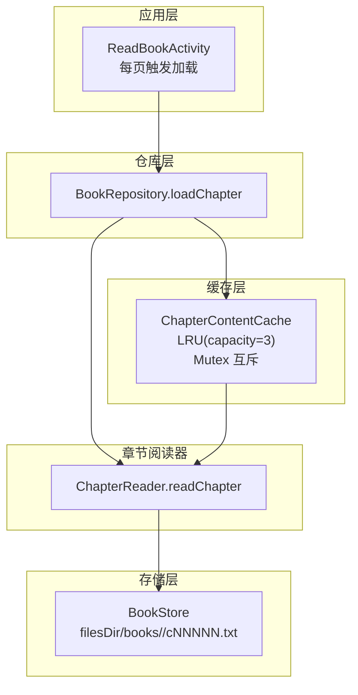
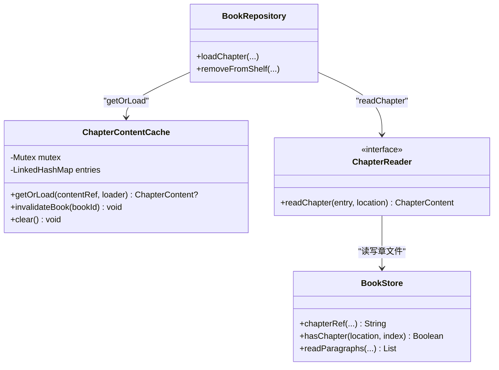
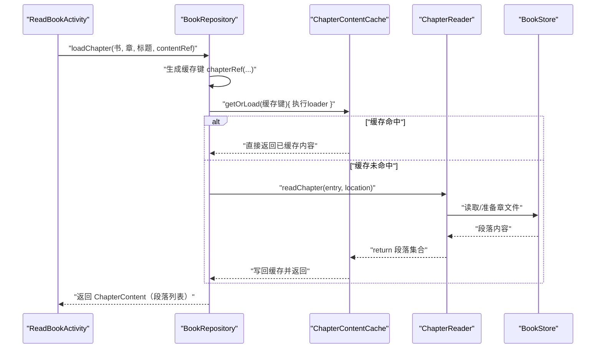
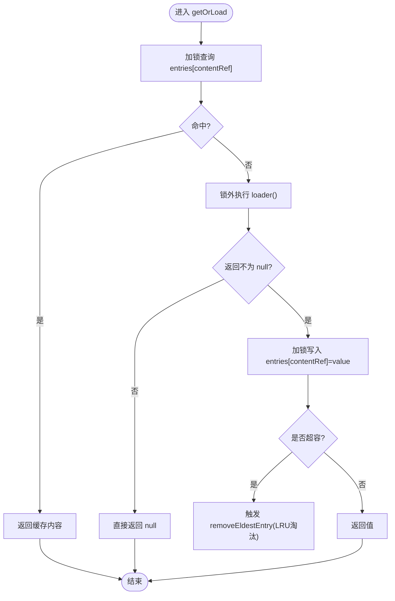
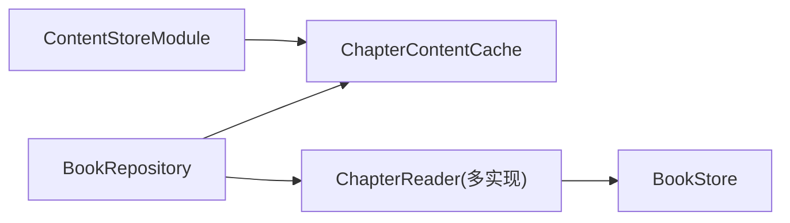

# 章节内容内存缓存

<cite>
**本文引用的文件**
- [ChapterContentCache.kt](file://lib_book_common/src/main/java/com/ebook/common/store/ChapterContentCache.kt)
- [ChapterContentCacheTest.kt](file://lib_book_common/src/test/java/com/ebook/common/store/ChapterContentCacheTest.kt)
- [BookRepository.kt](file://lib_book_common/src/main/java/com/ebook/common/repository/BookRepository.kt)
- [ContentStoreModule.kt](file://lib_book_common/src/main/java/com/ebook/common/di/ContentStoreModule.kt)
- [ChapterReader.kt](file://lib_book_common/src/main/java/com/ebook/common/analyze/local/ChapterReader.kt)
- [BookStore.kt](file://lib_book_common/src/main/java/com/ebook/common/store/BookStore.kt)
</cite>

## 目录
1. [简介](#简介)
2. [项目结构](#项目结构)
3. [核心组件](#核心组件)
4. [架构总览](#架构总览)
5. [关键流程时序](#关键流程时序)
6. [详细组件分析](#详细组件分析)
7. [依赖关系分析](#依赖关系分析)
8. [性能考量](#性能考量)
9. [故障排查指南](#故障排查指南)
10. [结论](#结论)
11. [附录：测试与数据验证要点](#附录测试与数据验证要点)

## 简介
本文件系统性梳理“章节内容内存缓存”系统（ChapterContentCache）的设计、实现与使用方式。它旨在解决 ReadBookActivity 每翻一页就读取一次正文的性能问题：若没有缓存，翻页会重复触发 open/read/decode I/O 与解析，导致性能显著下降。缓存以 LRU 策略组织最近使用的章节正文，默认容量为 3（当前章 ± 前后各一章），既覆盖预加载上一页/下一页，又控制内存占用。

此外，文档解释 getOrLoad 的键设计（contentRef）、空值不入缓存的恢复机制、Mutex 线程安全保证，以及 invalidateBook 基于 bookId 片段的批量失效逻辑，并给出对应的单元测试与可复测的性能对比方案。

## 项目结构
缓存位于 lib_book_common 模块中，由 Hilt 容器装配并通过 BookRepository 暴露统一读取入口；章节正文通过 ChapterReader 按格式路由至本地或网络来源，最终经 ChapterContentCache 命中或加载。

图表来源
- [BookRepository.kt:174-191](file://lib_book_common/src/main/java/com/ebook/common/repository/BookRepository.kt#L174-L191)
- [ChapterContentCache.kt:21-58](file://lib_book_common/src/main/java/com/ebook/common/store/ChapterContentCache.kt#L21-L58)
- [ChapterReader.kt:10-19](file://lib_book_common/src/main/java/com/ebook/common/analyze/local/ChapterReader.kt#L10-L19)
- [BookStore.kt:17-38](file://lib_book_common/src/main/java/com/ebook/common/store/BookStore.kt#L17-L38)

章节来源
- [BookRepository.kt:40-49](file://lib_book_common/src/main/java/com/ebook/common/repository/BookRepository.kt#L40-L49)
- [ContentStoreModule.kt:27-42](file://lib_book_common/src/main/java/com/ebook/common/di/ContentStoreModule.kt#L27-L42)

## 核心组件
- ChapterContentCache：内存缓存主类，提供 getOrLoad/invalidateBook/clear，内部使用 LinkedHashMap(accessOrder=true) 实现 LRU，配合 Mutex 保障并发安全。默认容量为 3，键为 contentRef（含 bookId）。
- BookRepository：统一章节加载入口 loadChapter，构造缓存键、派发 Reader、调用缓存 getOrLoad，并在移除书籍时触发缓存失效。
- ContentStoreModule：Hilt 装配点，提供 ChapterContentCache 单例注入到 BookRepository。
- ChapterReader：章节正文读取最小接口，支持 TXT/EPUB/NETWORK 多种来源，统一返回规范化段落。
- BookStore：章文件存取、路径生成、是否存在判断，充当事实源与磁盘落盘通道。

章节来源
- [ChapterContentCache.kt:21-58](file://lib_book_common/src/main/java/com/ebook/common/store/ChapterContentCache.kt#L21-L58)
- [BookRepository.kt:174-191](file://lib_book_common/src/main/java/com/ebook/common/repository/BookRepository.kt#L174-L191)
- [ContentStoreModule.kt:31-42](file://lib_book_common/src/main/java/com/ebook/common/di/ContentStoreModule.kt#L31-L42)
- [ChapterReader.kt:10-19](file://lib_book_common/src/main/java/com/ebook/common/analyze/local/ChapterReader.kt#L10-L19)
- [BookStore.kt:17-38](file://lib_book_common/src/main/java/com/ebook/common/store/BookStore.kt#L17-L38)

## 架构总览
整体流程围绕“统一加载、优先命中缓存、未命中再读源、结果写回缓存”展开。失效事件（删书/重解析/合并来源）通过 BookRepository 对指定 bookId 触发批量清除。

图表来源
- [ChapterContentCache.kt:21-58](file://lib_book_common/src/main/java/com/ebook/common/store/ChapterContentCache.kt#L21-L58)
- [BookRepository.kt:174-191](file://lib_book_common/src/main/java/com/ebook/common/repository/BookRepository.kt#L174-L191)
- [ChapterReader.kt:10-19](file://lib_book_common/src/main/java/com/ebook/common/analyze/local/ChapterReader.kt#L10-L19)
- [BookStore.kt:17-38](file://lib_book_common/src/main/java/com/ebook/common/store/BookStore.kt#L17-L38)

章节来源
- [BookRepository.kt:149-160](file://lib_book_common/src/main/java/com/ebook/common/repository/BookRepository.kt#L149-L160)

## 关键流程时序
下面用序列图展示一次“翻到某页 → 加载章节正文”的调用链及缓存命中路径。

图表来源
- [BookRepository.kt:174-191](file://lib_book_common/src/main/java/com/ebook/common/repository/BookRepository.kt#L174-L191)
- [ChapterContentCache.kt:37-42](file://lib_book_common/src/main/java/com/ebook/common/store/ChapterContentCache.kt#L37-L42)
- [ChapterReader.kt:10-19](file://lib_book_common/src/main/java/com/ebook/common/analyze/local/ChapterReader.kt#L10-L19)
- [BookStore.kt:33-38](file://lib_book_common/src/main/java/com/ebook/common/store/BookStore.kt#L33-L38)

章节来源
- [BookRepository.kt:174-191](file://lib_book_common/src/main/java/com/ebook/common/repository/BookRepository.kt#L174-L191)

## 详细组件分析

### ChapterContentCache 组件
- 设计动机
  - 避免同一章内连续翻页导致的重复 I/O（open/read/decode），将热点章节正文放入内存，容量小、命中率高的 LRU 更契合阅读场景。
  - 键用 contentRef 而非 (book, chapter) 二元组，便于按 /bookId/ 片段做高效批量剔除。
- 数据结构
  - LinkedHashMap(accessOrder=true)：维护访问顺序，最久未使用排在队首，超容时自动移除队头项。
  - 默认容量 3：当前章 + 前后各一页，满足上下翻与预加载相邻页。
- 并发与安全
  - 使用 kotlinx.coroutines.sync.Mutex，保证读命中、写回与失效操作的原子性。
  - 在锁外执行 loader，避免读盘耗时阻塞其他章节加载。
- key/value 语义
  - contentRef：持久定位符，包含 bookId，且唯一标识某章内容。
  - ChapterContent：规范化的段落列表，作为缓存单元。
- 失效策略
  - invalidateBook(bookId)：删除所有包含 "/bookId/" 的子串键条目，适用于重解析、删书、合并来源等真实事件。
  - clear()：清空全部缓存，常用于全局重置或调试。
- 空值语义
  - getOrLoad 中，如果 loader 返回 null，则不入缓存。这样当 reader 注册表补齐后，下次请求会自动重试，无需显式失效。

图表来源
- [ChapterContentCache.kt:37-42](file://lib_book_common/src/main/java/com/ebook/common/store/ChapterContentCache.kt#L37-L42)
- [ChapterContentCache.kt:26-29](file://lib_book_common/src/main/java/com/ebook/common/store/ChapterContentCache.kt#L26-L29)

章节来源
- [ChapterContentCache.kt:21-58](file://lib_book_common/src/main/java/com/ebook/common/store/ChapterContentCache.kt#L21-L58)

### 与 BookRepository 的集成
- 统一入口 loadChapter
  - 根据书格式从 Map<BookFormat, ChapterReader> 选择具体实现，形成统一管线。
  - 构建缓存键：通过 BookStore.chapterRef(bookId, index)。
  - 传入 reader 时区分网络书（可能使用外部 contentRef）与本地书（直接使用缓存键），确保一致性。
  - 仅当段落非空时写入返回结果，避免无效占位。
- 失效同步
  - removeFromShelf 中，在删除本地书内容后，显式调用 contentCache.invalidateBook(noteUrl)，确保后续不再命中旧数据。

章节来源
- [BookRepository.kt:40-49](file://lib_book_common/src/main/java/com/ebook/common/repository/BookRepository.kt#L40-L49)
- [BookRepository.kt:174-191](file://lib_book_common/src/main/java/com/ebook/common/repository/BookRepository.kt#L174-L191)
- [BookRepository.kt:149-160](file://lib_book_common/src/main/java/com/ebook/common/repository/BookRepository.kt#L149-L160)

### 与 ChapterReader/BookStore 的协作
- ChapterReader 抽象出 readChapter，屏蔽 TXT/EPUB/NETWORK 差异，返回统一的段落结构，供缓存与上层复用。
- BookStore 提供章节文件的存在性检查与读写，承担磁盘层面的事实源角色；存在则读，不存在则网络抓取并由 Reader 落地文件。

章节来源
- [ChapterReader.kt:10-19](file://lib_book_common/src/main/java/com/ebook/common/analyze/local/ChapterReader.kt#L10-L19)
- [BookStore.kt:17-38](file://lib_book_common/src/main/java/com/ebook/common/store/BookStore.kt#L17-L38)

## 依赖关系分析
- 耦合与内聚
  - ChapterContentCache 仅依赖章节内容与协程同步原语，内聚度高。
  - BookRepository 聚合多个 DAO、Reader 映射与缓存，但职责清晰，只关注章节加载流水线。
- 直接/间接依赖
  - BookRepository 依赖 ContentStoreModule 提供的 ChapterContentCache 实例。
  - 章节读取经 ChapterReader 映射到具体 Reader 实现，再依赖 BookStore 进行文件操作。
- 循环依赖
  - 组件之间均为单向调用，未见循环依赖迹象。

图表来源
- [BookRepository.kt:40-49](file://lib_book_common/src/main/java/com/ebook/common/repository/BookRepository.kt#L40-L49)
- [ContentStoreModule.kt:31-42](file://lib_book_common/src/main/java/com/ebook/common/di/ContentStoreModule.kt#L31-L42)
- [ChapterReader.kt:10-19](file://lib_book_common/src/main/java/com/ebook/common/analyze/local/ChapterReader.kt#L10-L19)
- [BookStore.kt:17-38](file://lib_book_common/src/main/java/com/ebook/common/store/BookStore.kt#L17-L38)

章节来源
- [BookRepository.kt:40-49](file://lib_book_common/src/main/java/com/ebook/common/repository/BookRepository.kt#L40-L49)
- [ContentStoreModule.kt:27-42](file://lib_book_common/src/main/java/com/ebook/common/di/ContentStoreModule.kt#L27-L42)

## 性能考量
- 目标指标
  - 降低同章内频繁翻页造成的重复 I/O（开/读/解码）次数。
  - 提升滑动阅读流畅度，减少卡顿。
- LRU 容量
  - 默认 3（当前章 ± 一前一后）匹配典型翻页行为与少量预加载需求。
  - 可通过构造参数调整容量，需结合设备内存与阅读习惯权衡。
- 并发性能
  - 锁仅在缓存查写阶段持有，真正读盘在锁外执行，避免长阻塞。
- 缺失恢复
  - loader 返回 null 不入缓存，reader 注册表补齐后自然恢复，减少全局失效成本。

无额外章节来源。

## 故障排查指南
- 症状：翻页仍频繁 I/O
  - 检查 cacheKey 是否正确（BookStore.chapterRef 生成的 contentRef 是否稳定）。
  - 确认 getOrLoad 未在 loader 返回 null 时被错误缓存。
  - 查看是否有 invalidateBook/triggered clear 导致命中率为零。
- 症状：删除书籍后仍读到旧内容
  - 确认 removeFromShelf 已调用 invalidateBook(noteUrl)。
- 症状：容量不足或内存压力高
  - 适当调整 ChapterContentCache(capacity)；或在必要时主动 clear。
- 现象：Reader 扩展后缓存不生效
  - 因 null 不入缓存，新增/修复 reader 后重新访问即自动拉取新内容，无需手动失效。

章节来源
- [ChapterContentCache.kt:37-58](file://lib_book_common/src/main/java/com/ebook/common/store/ChapterContentCache.kt#L37-L58)
- [BookRepository.kt:149-160](file://lib_book_common/src/main/java/com/ebook/common/repository/BookRepository.kt#L149-L160)

## 结论
ChapterContentCache 以简洁而高效的 LRU + Mutex 设计，解决了章节正文在高频翻页时的 I/O 瓶颈问题。通过以 contentRef 为键的统一布局与按 bookId 片段的批量失效，兼顾了命中率与一致性。与 BookRepository 的解耦式整合使得多种来源（TXT/EPUB/NETWORK）共享同一缓存设施，提升了系统一致性与可维护性。单元测试覆盖了“去重加载、LRU 淘汰、按书失效、全清”的关键场景，具备较强回归保障能力。建议在接入新页面时统一通过 BookRepository.loadChapter 获取内容，以保证缓存策略的贯穿一致性。

## 附录：测试与数据验证要点
- 单元测试覆盖
  - 重复调用只执行一次加载器：证明缓存命中有效。
  - 超出容量后的 LRU 淘汰：验证最近使用优先保留。
  - 按书失效：validate 仅清除匹配 bookId 的条目，不影响其他书。
  - 全量清除：clear 后再次访问应触发重新加载。
- 性能对比实验建议
  - 指标：单位时间内的 I/O 次数、CPU 开销、页面切换延迟。
  - 方法：启用/禁用缓存，或使用不同 capacity，记录翻页 N 次的 I/O 次数变化。
  - 参考基准：同一本电子书的连续翻页 10~30 页，统计 open/read/decode 调用次数；预期有缓存场景显著低于无缓存。

章节来源
- [ChapterContentCacheTest.kt:14-66](file://lib_book_common/src/test/java/com/ebook/common/store/ChapterContentCacheTest.kt#L14-L66)