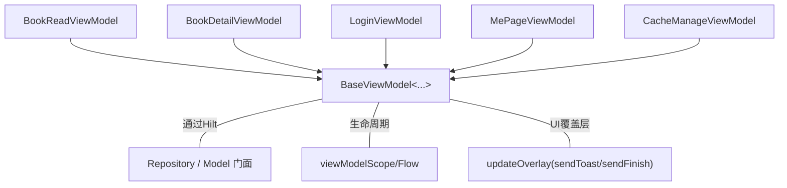
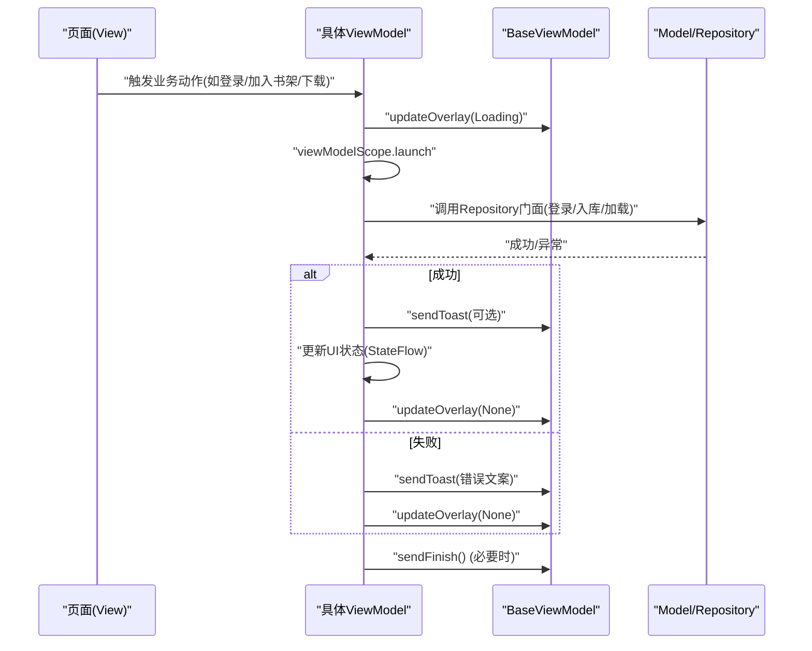
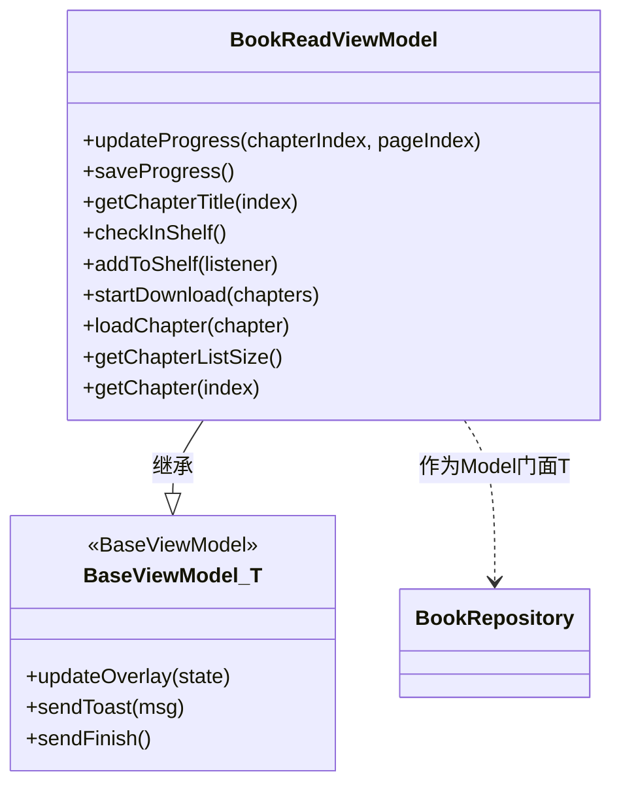
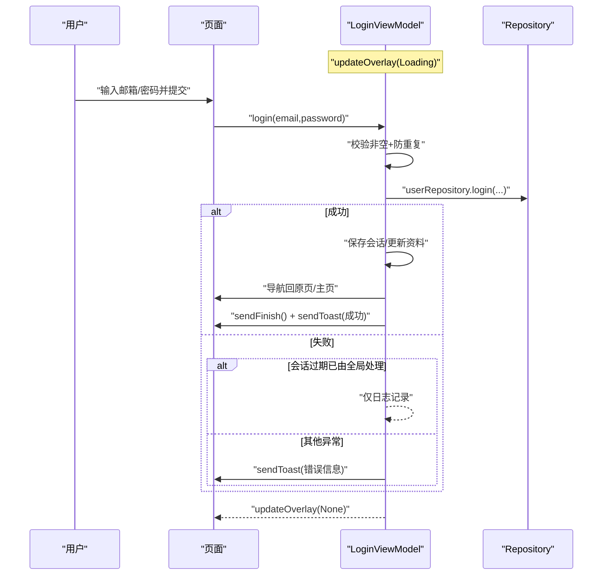
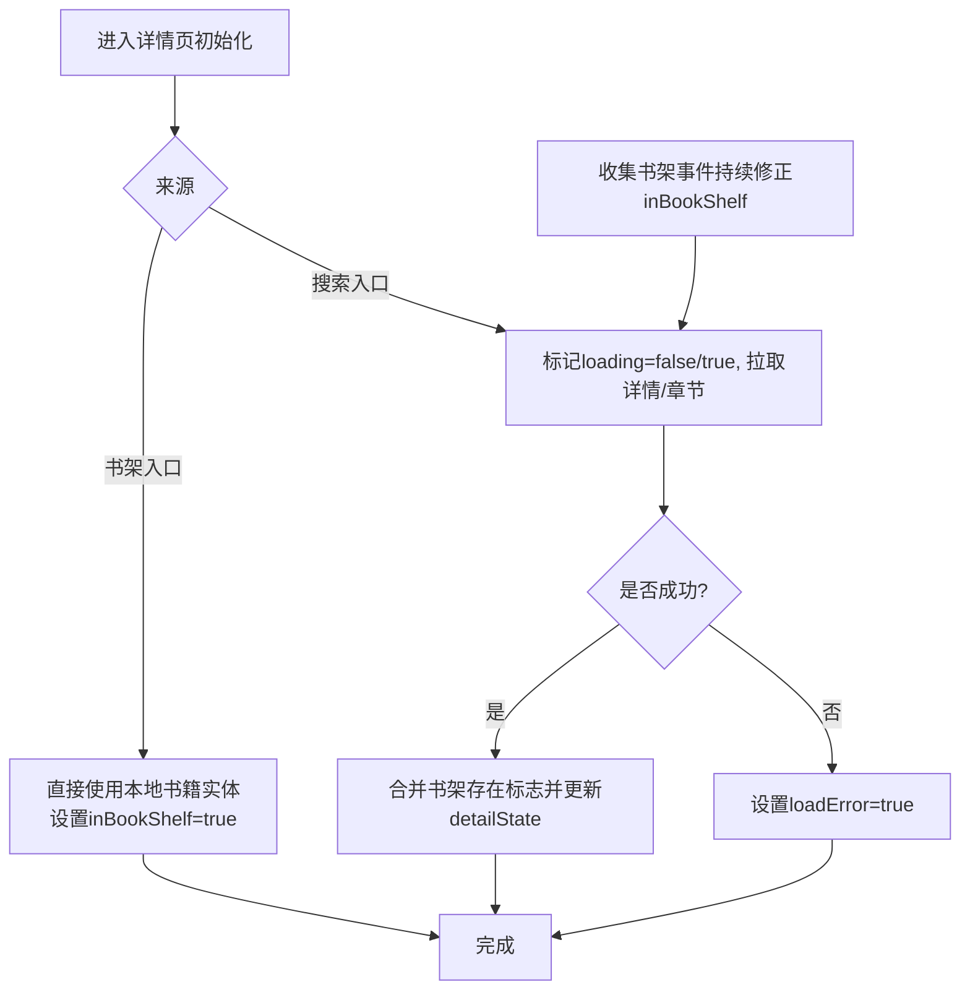
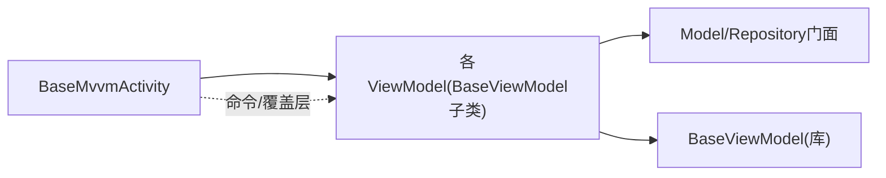

# BaseViewModel继承体系

<cite>
**本文引用的文件**
- [AGENTS.md](file://AGENTS.md)
- [BookReadViewModel.kt](file://module_book/src/main/java/com/ebook/book/mvvm/viewmodel/BookReadViewModel.kt)
- [BookDetailViewModel.kt](file://module_book/src/main/java/com/ebook/book/mvvm/viewmodel/BookDetailViewModel.kt)
- [MePageViewModel.kt](file://module_me/src/main/java/com/ebook/me/mvvm/viewmodel/MePageViewModel.kt)
- [LoginViewModel.kt](file://module_login/src/main/java/com/ebook/login/mvvm/viewmodel/LoginViewModel.kt)
- [CacheManageViewModel.kt](file://module_me/src/main/java/com/ebook/me/mvvm/viewmodel/CacheManageViewModel.kt)
</cite>

## 目录
1. [简介](#简介)
2. [项目结构](#项目结构)
3. [核心组件](#核心组件)
4. [架构总览](#架构总览)
5. [详细组件分析](#详细组件分析)
6. [依赖关系分析](#依赖关系分析)
7. [性能注意事项](#性能注意事项)
8. [故障排查指南](#故障排查指南)
9. [结论](#结论)

## 简介
本文件聚焦于本项目中基于 lib_common 的 ViewModel 基类 BaseViewModel 的继承体系与设计实践。项目采用严格的 Model → ViewModel → View 分层（MVVM），并通过 Hilt 进行构造注入。BaseViewModel 统一封装：
- 异步操作管理：通过 viewModelScope 组织协程任务
- 错误处理与用户提示：封装 sendToast/sendFinish，统一在主线程消费一次性命令
- UI 覆盖层：封装 updateOverlay(Loading/None) 管理加载态与网络错误覆盖层
- Model 门面模式：通过泛型参数<T>将“领域门面（Model）”解耦进 ViewModel，使业务模块只依赖抽象 Repository/UseCase

同时说明：为什么使用 BaseViewModel 而非直接使用 androidx.lifecycle.ViewModel——因为 BaseMvvmActivity/页面基类会绑定一次性命令通道和覆盖层；若不使用该基类，会导致命令堆积、提示不显示、返回栈残留等问题。多模块项目中统一的 ViewModel 约定便于复用与一致性维护。

## 项目结构
- 业务模块（module_book、module_me、module_login、module_find）内的所有 ViewModel 均继承 BaseViewModel，并交由 Hilt 构造注入。
- BaseViewModel 由 lib_common 提供；当前以 Maven 中央坐标引入，可通过本地“迷你独立构建”联调，但不影响在本仓库的使用约定与调用方式。
- Activity 侧统一由 BaseMvvmActivity 提供命令通道和覆盖层消费能力，与 BaseViewModel 配合形成完整 MVVM 闭环。

**图示来源**
- [BookReadViewModel.kt:21-26](file://module_book/src/main/java/com/ebook/book/mvvm/viewmodel/BookReadViewModel.kt#L21-L26)
- [BookDetailViewModel.kt:42-46](file://module_book/src/main/java/com/ebook/book/mvvm/viewmodel/BookDetailViewModel.kt#L42-L46)
- [LoginViewModel.kt:30-35](file://module_login/src/main/java/com/ebook/login/mvvm/viewmodel/LoginViewModel.kt#L30-L35)
- [MePageViewModel.kt:65-70](file://module_me/src/main/java/com/ebook/me/mvvm/viewmodel/MePageViewModel.kt#L65-L70)
- [CacheManageViewModel.kt:31](file://module_me/src/main/java/com/ebook/me/mvvm/viewmodel/CacheManageViewModel.kt#L31)

**章节来源**
- [AGENTS.md:142-176](file://AGENTS.md#L142-L176)
- [AGENTS.md:178-199](file://AGENTS.md#L178-L199)

## 核心组件
- BaseViewModel（来自 lib_common）：为所有业务 ViewModel 提供统一的异步编排、错误收敛、覆盖层以及一次性命令下发能力。
- Model 门面（T）：ViewModel 通过泛型参数<T>持有领域门面（如 BookRepository、UserRepository、NoOpModel 等），将复杂业务逻辑隐藏在门面之后，保持 ViewModel 的职责单一：协调与状态转换。
- 具体 ViewModel：每个业务页面对应一个 ViewModel，负责：
  - 构造注入所需的 Repository/门面（或在没有门面的情况下直接用 NoOpModel 占位）
  - 暴露 UI 可观察状态（StateFlow 等）
  - 封装业务方法（登录、加入书架、下载、进度保存、章节加载等）
  - 调用 BaseViewModel 的统一 API（updateOverlay、sendToast、sendFinish）管理 UI 与导航事件

注意：项目约定避免直接继承 android.lifecycle.ViewModel，应始终使用 BaseViewModel，从而保证全仓一致的行为（包括命令通道、覆盖层等）。

**章节来源**
- [AGENTS.md:142-176](file://AGENTS.md#L142-L176)
- [AGENTS.md:178-199](file://AGENTS.md#L178-L199)

## 架构总览
整体调用链遵循 MVVM：View（Compose 页面）通过 BaseMvvmActivity 提供的能力消费 ViewModel 发出的命令与覆盖层；ViewModel 持有模型门面（Repository/UseCase），在 viewModelScope 中调度数据存取；失败或需要提示时走 BaseViewModel.sendToast，结束时用 sendFinish。

此图为通用流程示意，用于理解数据与控制流。

## 详细组件分析

### 设计要点：泛型参数<T>与Model门面
- 目的：将业务门面注入到 ViewModel，让 ViewModel 仅关心“如何编排状态和生命周期”，不涉及具体数据源细节。
- 优势：
  - 单测更容易隔离（注入 Fake/Stub Repository）
  - 行为一致性：所有 VM 都通过统一基类获得一致的异步与覆盖层能力
  - 易于扩展：更换数据源策略不影响 UI 层和大部分 ViewModel 逻辑

- 使用示例（无 Model 时使用 NoOpModel）：
  - MePageViewModel：不拥有显式 Model 门面，但为了对齐约定仍需继承 BaseViewModel，并以 NoOpModel 占位。
  - CacheManageViewModel/SettingViewModel：同理，按需传入各自 Model 或 NoOpModel。

**章节来源**
- [MePageViewModel.kt:65-70](file://module_me/src/main/java/com/ebook/me/mvvm/viewmodel/MePageViewModel.kt#L65-L70)
- [CacheManageViewModel.kt:31](file://module_me/src/main/java/com/ebook/me/mvvm/viewmodel/CacheManageViewModel.kt#L31)
- [AGENTS.md:178-199](file://AGENTS.md#L178-L199)

### BookReadViewModel：阅读器场景的最佳实践
职责概述：
- 管理书架实体与阅读进度（保存、更新）
- 章节列表访问与内容加载（统一入口 loadChapter）
- 加入书架与下载任务发起（先入库再拉起前台服务，防丢任务）
- 使用 viewModelScope 统一编排异步流程

关键点：
- 构造注入 Repository（BookRepository、DownloadRepository）并透传给 BaseViewModel<BookRepository>
- 使用 viewModelScope.launch 执行耗时任务（保存进度、入库、下载等）
- 对可能失败的操作统一捕获并提示（例如下载限制时的 Toast）
- 对外暴露稳定的读取接口（getChapterTitle/getChapterSize/getChapter/loadChapter）

**图示来源**
- [BookReadViewModel.kt:21-122](file://module_book/src/main/java/com/ebook/book/mvvm/viewmodel/BookReadViewModel.kt#L21-L122)

**章节来源**
- [BookReadViewModel.kt:21-122](file://module_book/src/main/java/com/ebook/book/mvvm/viewmodel/BookReadViewModel.kt#L21-L122)

### LoginViewModel：登录流程与错误收敛
职责概述：
- 表单校验与防重提交
- 发起登录请求，成功后建立会话并回跳
- 使用 updateOverlay(sendToast/sendFinish) 统一管理加载态、提示与导航

关键点：
- 请求过程中设置 Loading 覆盖层
- 成功：保存会话、更新资料缓存、跳转目标页、发送完成与成功提示
- 失败：区分“已全局处理的会话过期”与“其他异常”，避免重复提示
- 使用 viewModelScope 确保生命周期安全

**图示来源**
- [LoginViewModel.kt:30-116](file://module_login/src/main/java/com/ebook/login/mvvm/viewmodel/LoginViewModel.kt#L30-L116)

**章节来源**
- [LoginViewModel.kt:30-116](file://module_login/src/main/java/com/ebook/login/mvvm/viewmodel/LoginViewModel.kt#L30-L116)

### BookDetailViewModel：详情页状态聚合与事件同步
职责概述：
- 统一 StateFlow(detailState) 表达详情加载态、书架状态与失败态
- 收集书架事件（SharedFlow）以保持书架状态实时一致
- 搜索入口发起详情/章节获取，保留已填充数据的容错语义

关键点：
- 将多次分散的状态变更收敛到一个 StateFlow，避免 Compose 重组失效问题
- 通过 bookShelfEvents 收集 Added/Removed 等事件，驱动 inBookShelf 与关闭详情页
- 统一 catch 中设置 loadError 并保持已有数据，避免断链

**图示来源**
- [BookDetailViewModel.kt:22-196](file://module_book/src/main/java/com/ebook/book/mvvm/viewmodel/BookDetailViewModel.kt#L22-L196)

**章节来源**
- [BookDetailViewModel.kt:22-196](file://module_book/src/main/java/com/ebook/book/mvvm/viewmodel/BookDetailViewModel.kt#L22-L196)

### MePageViewModel / CacheManageViewModel：无Model门面与本地统计
- MePageViewModel：使用 NoOpModel 占位 Model 位，直接组合多个 Repository 流（Profile、UserSession、书架），生成 meState/readingStats。体现“纯展示/聚合”的场景仍然要继承 BaseViewModel。
- CacheManageViewModel：涉及清缓操作，按约定通过 BaseViewModel 的命令与覆盖层机制完成提示与反馈。

**章节来源**
- [MePageViewModel.kt:65-103](file://module_me/src/main/java/com/ebook/me/mvvm/viewmodel/MePageViewModel.kt#L65-L103)
- [CacheManageViewModel.kt:31](file://module_me/src/main/java/com/ebook/me/mvvm/viewmodel/CacheManageViewModel.kt#L31)

## 依赖关系分析
- BaseViewModel 是统一的 ViewModel 基类，提供覆盖层、一次性命令通道与提示收敛。
- 各业务 ViewModel 持有不同 Repository/Model 门面（BookRepository、UserRepository 等），或通过 NoOpModel 占位。
- 页面必须继承 BaseMvvmActivity 以保证命令通道能被正确消费，否则会出现“提示不弹、页面关不掉”的症状。

**章节来源**
- [AGENTS.md:142-176](file://AGENTS.md#L142-L176)
- [AGENTS.md:178-199](file://AGENTS.md#L178-L199)

## 性能注意事项
- 合理使用 StateFlow 与 combine/map，避免过度重组。MePageViewModel 展示了用 stateIn + WhileSubscribed 控制订阅时机。
- 列表/集合并发安全：BookDetailViewModel 中对共享列表使用 synchronized 保护，避免旋转重建导致的累积/重复问题。
- 网络与 IO 均在 viewModelScope 中执行，避免造成泄漏或多余工作。
- 前台服务启动前务先把任务入持久化，避免因系统拒绝启动导致的数据丢失（参考 BookReadViewModel.startDownload 的实现思路）。

[本节为通用指导，不直接分析特定代码片段]

## 故障排查指南
- 现象：点击按钮后没有弹窗提示，或页面没有退出
  - 原因：页面未继承 BaseMvvmActivity，导致 ViewModel 的一次性命令未被消费
  - 定位依据：BaseMvvmActivity 提供命令通道与覆盖层消费；不绑定则命令堆积后被丢弃
  - 解决：统一使用 BaseMvvmActivity；ViewModel 中调用 sendToast/sendFinish
- 现象：加载完成页面仍不刷新
  - 原因：旧实现中使用普通字段或事件通知，Compose 无法感知变化
  - 解决：将状态收敛为单一 StateFlow，供 UI collectAsState 观测
- 现象：详情页加入书架后状态未更新
  - 原因：未收集 SharedFlow 事件
  - 解决：在 ViewModel init 中收集书架事件，更新 inBookShelf
- 前台服务被拒导致下载任务丢失
  - 正确做法：先在 Repository 中持久化任务，再拉起 DownloadService.start(context, intent)，失败时提示用户

**章节来源**
- [AGENTS.md:142-176](file://AGENTS.md#L142-L176)
- [BookDetailViewModel.kt:65-87](file://module_book/src/main/java/com/ebook/book/mvvm/viewmodel/BookDetailViewModel.kt#L65-L87)
- [BookReadViewModel.kt:82-90](file://module_book/src/main/java/com/ebook/book/mvvm/viewmodel/BookReadViewModel.kt#L82-L90)

## 结论
本项目基于 BaseViewModel 构建了一套稳定一致的 MVVM 实践：
- 通过 <T> 泛型实现 Model 门面模式，ViewModel 职责清晰（状态编排 + 生命周期 + 业务方法封装），数据访问下沉至 Repository
- 用 BaseViewModel 封装异步编排、错误处理与 UI 覆盖层，配合 BaseMvvmActivity 的命令通道，实现统一的提示、加载、结束等行为
- 在多模块项目中，统一约定极大降低了学习成本与维护成本；新增页面可直接沿用现有基类能力，避免重复造轮子

实践中建议：
- 永远继承 BaseViewModel（即使没有 Model 也使用 NoOpModel 占位）
- 严格将业务逻辑放入 Repository/UseCase，ViewModel 只保留状态流转与一次性的 UI 命令
- 统一使用 StateFlow 暴露界面状态，确保 Compose 能正确响应
- 遇到 UI 不刷新/提示不生效，优先检查是否使用了 BaseMvvmActivity 以及是否正确设置了覆盖层与命令

[本节为总结，不直接分析特定代码片段]