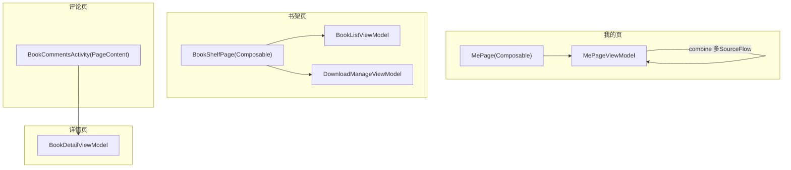
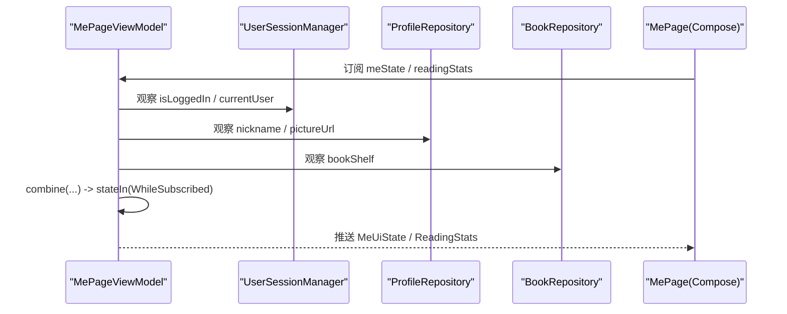
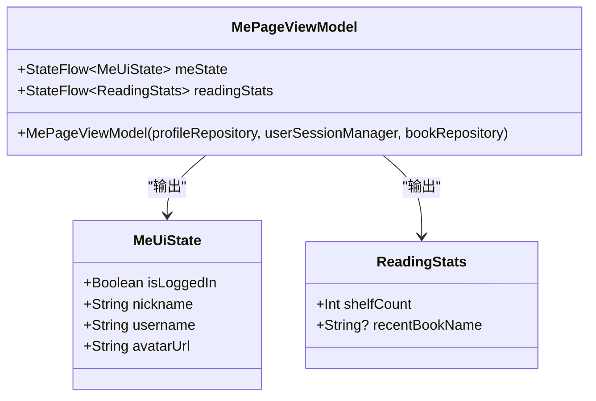
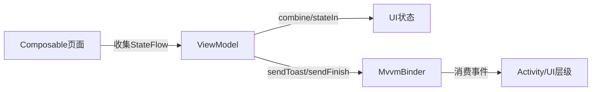

# Compose集成模式

<cite>
**本文引用的文件**
- [MePageViewModel.kt](file://module_me/src/main/java/com/ebook/me/mvvm/viewmodel/MePageViewModel.kt)
- [MePage.kt](file://module_me/src/main/java/com/ebook/me/page/MePage.kt)
- [BookShelfPage.kt](file://module_book/src/main/java/com/ebook/book/page/BookShelfPage.kt)
- [RegisterActivity.kt](file://module_login/src/main/java/com/ebook/login/RegisterActivity.kt)
- [BookDetailViewModel.kt](file://module_book/src/main/java/com/ebook/book/mvvm/viewmodel/BookDetailViewModel.kt)
- [BookCommentsActivity.kt](file://module_book/src/main/java/com/ebook/book/BookCommentsActivity.kt)
</cite>

## 目录
1. [简介](#简介)
2. [项目结构](#项目结构)
3. [核心组件](#核心组件)
4. [架构总览](#架构总览)
5. [详细组件分析](#详细组件分析)
6. [依赖关系分析](#依赖关系分析)
7. [性能考量](#性能考量)
8. [故障排查指南](#故障排查指南)
9. [结论](#结论)

## 简介
本文聚焦于本项目中 ViewModel 与 Jetpack Compose 的集成模式和最佳实践。重点围绕以下主题展开：
- collectAsState() 与 collectAsStateWithLifecycle() 的区别与使用场景
- StateFlow 在 Composable 中的订阅与取消（生命周期绑定）
- 以 MePageViewModel 为例，展示如何组织多个 StateFlow 状态源并在 Compose 层组合显示
- 异步数据加载、错误态、加载中指示器的典型处理模式
- 性能优化技巧：记忆化、条件订阅、避免不必要重组
- Command类（如sendToast）在 Compose 环境下的处理方式

## 项目结构
本项目采用 MVVM + Coroutines Flow 的响应式架构，UI层全面迁移到 Compose；ViewModel通过Hilt注入，页面统一继承基类，命令与覆盖层交由基类MvvmBinder统一管理。

图表来源
- [MePageViewModel.kt:65-103](file://module_me/src/main/java/com/ebook/me/mvvm/viewmodel/MePageViewModel.kt#L65-L103)
- [MePage.kt:79-92](file://module_me/src/main/java/com/ebook/me/page/MePage.kt#L79-L92)
- [BookShelfPage.kt:74-100](file://module_book/src/main/java/com/ebook/book/page/BookShelfPage.kt#L74-L100)
- [BookCommentsActivity.kt:104-107](file://module_book/src/main/java/com/ebook/book/BookCommentsActivity.kt#L104-L107)
- [BookDetailViewModel.kt:42-57](file://module_book/src/main/java/com/ebook/book/mvvm/viewmodel/BookDetailViewModel.kt#L42-L57)

章节来源
- [MePage.kt:79-92](file://module_me/src/main/java/com/ebook/me/page/MePage.kt#L79-L92)
- [BookShelfPage.kt:74-100](file://module_book/src/main/java/com/ebook/book/page/BookShelfPage.kt#L74-L100)

## 核心组件
- MePageViewModel：聚合登录态、个人资料、书架统计等多个StateFlow，输出两个独立的StateFlow供UI订阅（meState、readingStats），使用combine合并并stateIn指定WhileSubscribed策略。
- BookShelfPage：在Composable中收集多个ViewModel的StateFlow（books、remainingCount），使用LaunchedEffect触发一次性逻辑（首次刷新）。
- RegisterActivity：演示collectAsStateWithLifecycle的使用方式，配合BaseMvvmActivity的MvvmBinder进行命令处理。
- BookDetailViewModel：单一detailState管理详情loading/error/数据状态，展示事件聚合到VM层的模式（如书架事件同步inBookShelf标志）。

章节来源
- [MePageViewModel.kt:17-103](file://module_me/src/main/java/com/ebook/me/mvvm/viewmodel/MePageViewModel.kt#L17-L103)
- [BookShelfPage.kt:65-100](file://module_book/src/main/java/com/ebook/book/page/BookShelfPage.kt#L65-L100)
- [RegisterActivity.kt:52-70](file://module_login/src/main/java/com/ebook/login/RegisterActivity.kt#L52-L70)
- [BookDetailViewModel.kt:22-57](file://module_book/src/main/java/com/ebook/book/mvvm/viewmodel/BookDetailViewModel.kt#L22-L57)

## 架构总览
下图展示了MePage的“状态汇聚—UI订阅”流式架构，强调在多来源状态下只暴露少量StateFlow供UI消费。

图表来源
- [MePageViewModel.kt:72-103](file://module_me/src/main/java/com/ebook/me/mvvm/viewmodel/MePageViewModel.kt#L72-L103)
- [MePage.kt:80-84](file://module_me/src/main/java/com/ebook/me/page/MePage.kt#L80-L84)

## 详细组件分析

### MePageViewModel：多StateFlow合并与状态收敛
- 将登录态、资料、头像等分属不同仓库的多条StateFlow用combine组合成单条MeUiState；阅读统计基于Room observeBookShelf转换后导出ReadingStats。
- 使用stateIn(viewModelScope, WhileSubscribed(5s))控制订阅生命周期：离开页面时停止合并，回到页面立即获取缓存值，省电同时保证即时性。
- 命名避开基类的uiState，以避免与加载/错误覆盖层冲突。

图表来源
- [MePageViewModel.kt:17-103](file://module_me/src/main/java/com/ebook/me/mvvm/viewmodel/MePageViewModel.kt#L17-L103)

章节来源
- [MePageViewModel.kt:17-103](file://module_me/src/main/java/com/ebook/me/mvvm/viewmodel/MePageViewModel.kt#L17-L103)

### MePage Composable：订阅与导航
- 顶层MePage Composable内仅做状态收集（collectAsState）和参数派发到子Composable；所有路由跳转委托给回调。
- 子屏幕仅关注呈现，不感知副作用（如导航、Toast），提高可测试性和可复用性。

章节来源
- [MePage.kt:79-132](file://module_me/src/main/java/com/ebook/me/page/MePage.kt#L79-L132)

### CollectAsState vs CollectAsStateWithLifecycle
- collectAsState：在Composition作用域内订阅，适合需要立刻反应的场景；注意与DisposableEffect配合管理生命周期。
- collectAsStateWithLifecycle：自动绑定到组件的生命周期，页面暂停/销毁时无效化订阅；更省心智，尤其适用于Activity级页面中的倒计时、列表等。

在项目中使用示例：
- MePage使用collectAsState订阅meState/readingStats
- RegisterActivity使用collectAsStateWithLifecycle订阅倒计时StateFlow

章节来源
- [MePage.kt:80-84](file://module_me/src/main/java/com/ebook/me/page/MePage.kt#L80-L84)
- [RegisterActivity.kt:57-61](file://module_login/src/main/java/com/ebook/login/RegisterActivity.kt#L57-L61)

### 书架页：初次加载与多ViewModel协作
- LaunchedEffect(Unit)执行一次初始化（设置刷新态、调用刷新），确保进入页面即拉数据。
- 通过hiltViewModel()声明本地与跨模块ViewModel（BookListViewModel、DownloadManageViewModel），在Composable中以键稳定的方式引用，减少重组影响。
- 下载队列数作为独立状态源在UI侧实时可见。

章节来源
- [BookShelfPage.kt:74-100](file://module_book/src/main/java/com/ebook/book/page/BookShelfPage.kt#L74-L100)

### 详情页VM：集中管理Loading/Error/成功
- 将原分散的事件流收进单一detailState（loading/loadError/实体数据/是否已加入书架），便于Compose侧统一渲染。
- 书架事件监听移入VM，避免Activity重建重复订阅导致数据叠加。
- 网络失败不清空已有数据，保持入口链路可用，提升用户体验。

章节来源
- [BookDetailViewModel.kt:22-148](file://module_book/src/main/java/com/ebook/book/mvvm/viewmodel/BookDetailViewModel.kt#L22-L148)

### 评论页：一次性命令与软键盘收起
- 页面中LaunchedEffect用于订阅一次性事件（mVoidSingleLiveEvent），实现发送成功后收起软键盘等行为。
- 刷新信号通过MvvmBinder与ViewModel约定解耦，不在页面写具体刷新逻辑。

章节来源
- [BookCommentsActivity.kt:117-159](file://module_book/src/main/java/com/ebook/book/BookCommentsActivity.kt#L117-L159)

## 依赖关系分析
- Composable与VM单向依赖：UI只订阅VM输出的StateFlow，并通过回调驱动VM方法。
- VM聚合外部依赖：仓库、会话管理器作为构造函数注入，内部以Flow组合出稳定UI状态。
- MvvmBinder在基类中接管一次性命令（Toast、Finish等），与VM解耦UI细节。

图表来源
- [MePageViewModel.kt:72-103](file://module_me/src/main/java/com/ebook/me/mvvm/viewmodel/MePageViewModel.kt#L72-L103)
- [BookShelfPage.kt:74-100](file://module_book/src/main/java/com/ebook/book/page/BookShelfPage.kt#L74-L100)
- [BookDetailViewModel.kt:150-176](file://module_book/src/main/java/com/ebook/book/mvvm/viewmodel/BookDetailViewModel.kt#L150-L176)

## 性能考量
- 使用stateIn(WhileSubscribed)避免后台空闲时的无谓订阅消耗；5秒恢复时间兼顾省电与快速返回体验。
- 使用combine仅在至少一个上游变化时才重组目标StateFlow，降低重复计算与重组压力。
- Composable内只保留必要状态与行为：导航、Toast等副作用放在上层或VM，减少子树重绘。
- 对列表项使用稳定的key（如noteUrl），配合LazyList避免重建开销与重复条目异常。
- 将耗时操作放入viewModelScope中执行，避免阻塞主线程导致UI卡顿。
- 对于非关键UI反馈可使用remember等缓存机制减少重复计算。

[本节为通用指导，不涉及具体文件分析]

## 故障排查指南
- 未正确继承BaseMvvmActivity：页面无法接收sendToast/sendFinish，导致提示丢失或页面残留栈中。请确认Activity继承链与页面类型一致。
- collectAsState未在合适时机收集：如果订阅过早或过晚，可能导致UI不更新。建议在最外层Composable中收集，并确保传入必要的initial值。
- 遗漏initial值导致的空状态闪烁：当上游尚未发出首个值时，应提供合理的初始态，避免UI短暂空白或默认文案错误。
- 使用错误的集合key导致崩溃：LazyColumn items的key需稳定且不重复，否则抛异常；建议按自然键（如URL/ID）。
- 状态更新未及时反映：检查是否在正确的Scope内启动协程，或使用MutableStateFlow.update替换旧值。

章节来源
- [BookDetailViewModel.kt:107-147](file://module_book/src/main/java/com/ebook/book/mvvm/viewmodel/BookDetailViewModel.kt#L107-L147)
- [RegisterActivity.kt:43-70](file://module_login/src/main/java/com/ebook/login/RegisterActivity.kt#L43-L70)

## 结论
本项目的ViewModel与Compose集成遵循如下原则：
- 每个页面只关注其所需的状态切片，通过VM聚合复杂状态后再导出简洁StateFlow
- 结合stateIn的WhileSubscribed与collectAsState/collectAsStateWithLifecycle，实现订阅与生命周期的合理绑定
- 使用combine等Flow工具函数，将多来源状态合成为单一UI状态，避免在UI中散落订阅与回退判断
- 将一次性动作与错误反馈收敛至VM并通过MvvmBinder统一处理，使UI纯粹展示

以上实践有效提升了可维护性、可读性与性能，也为后续扩展提供了清晰边界。

[本节为总结性内容，不涉及具体文件分析]