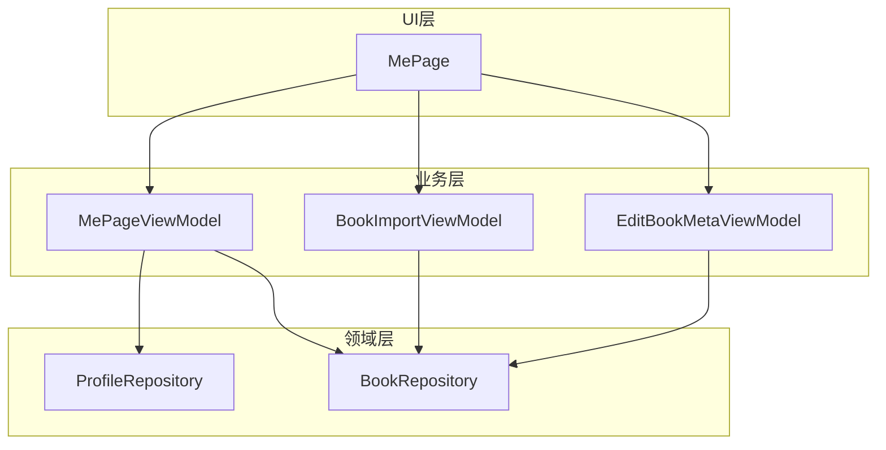
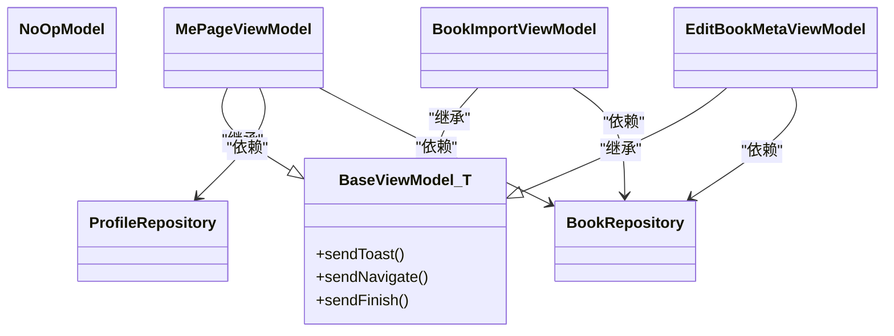
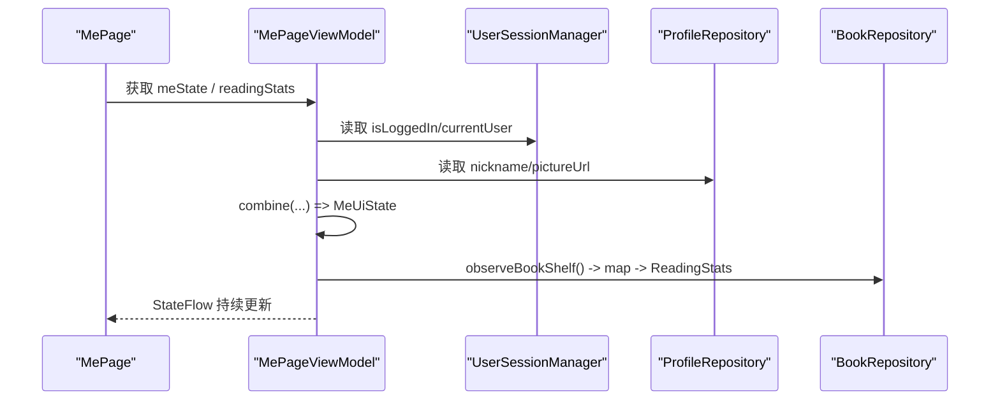
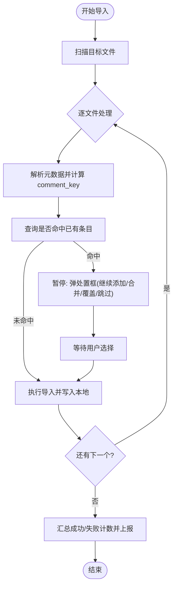
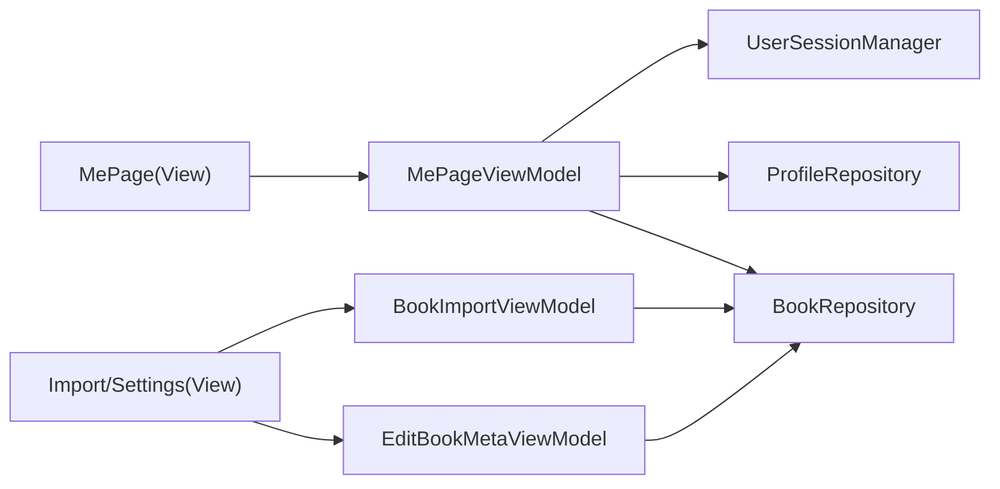

# NoOpModel无操作模式

<cite>
**本文引用的文件 **
- [AGENTS.md](file://AGENTS.md)
- [MePageViewModel.kt](file://module_me/src/main/java/com/ebook/me/mvvm/viewmodel/MePageViewModel.kt)
- [MePage.kt](file://module_me/src/main/java/com/ebook/me/page/MePage.kt)
- [BookImportViewModel.kt](file://module_book/src/main/java/com/ebook/book/mvvm/viewmodel/BookImportViewModel.kt)
- [EditBookMetaViewModel.kt](file://module_book/src/main/java/com/ebook/book/mvvm/viewmodel/EditBookMetaViewModel.kt)
- [ProfileRepository.kt](file://lib_book_common/src/main/java/com/ebook/common/repository/ProfileRepository.kt)
- [BookRepository.kt](file://lib_book_common/src/main/java/com/ebook/common/repository/BookRepository.kt)
</cite>

## 目录
1. [简介](#简介)
2. [项目结构](#项目结构)
3. [核心组件](#核心组件)
4. [架构总览](#架构总览)
5. [详细组件分析](#详细组件分析)
6. [依赖关系分析](#依赖关系分析)
7. [性能考量](#性能考量)
8. [故障排查指南](#故障排查指南)
9. [结论](#结论)
10. [附录](#附录)（如有）

## 简介
本文聚焦于 MVVM 中当 ViewModel 仅直接依赖多个 Repository、无需额外 Model 门面时的设计选择：使用 NoOpModel 占位，既保持全仓统一的 BaseViewModel 类型一致性，又避免为纯展示场景虚构一层无意义的类。通过 MePageViewModel 的具体实现，说明 NoOpModel 如何简化依赖注入并保持与 BaseMvvmActivity/BaseViewModel 的兼容性；同时解释这种模式在组合数据、跨仓库状态合并方面的优势，以及与 MVP Presenter 的本质区别。文末给出何时应使用 NoOpModel 的实践建议。

## 项目结构
当前仓库采用多模块组织，功能模块依赖共享库 lib_book_common。涉及本主题的主要代码位于 module_me 的“我的”页与 module_book 的导入/修键页面。关键路径如下：
- 个人中心 UI 入口与视图层：module_me/page/MePage.kt
- 个人中心 ViewModel：module_me/mvvm/viewmodel/MePageViewModel.kt
- 书籍导入与判重流程 ViewModel：module_book/mvvm/viewmodel/BookImportViewModel.kt
- 编辑元信息（修键面板）ViewModel：module_book/mvvm/viewmodel/EditBookMetaViewModel.kt
- 领域仓储：lib_book_common/repository（如 ProfileRepository、BookRepository）
- 统一约定文档：根 AGENTS.md（定义 MVVM 基类约定与 NoOpModel 使用规范）

图表来源
- [MePage.kt:80-92](file://module_me/src/main/java/com/ebook/me/page/MePage.kt#L80-L92)
- [MePageViewModel.kt:65-103](file://module_me/src/main/java/com/ebook/me/mvvm/viewmodel/MePageViewModel.kt#L65-L103)
- [BookImportViewModel.kt:74-82](file://module_book/src/main/java/com/ebook/book/mvvm/viewmodel/BookImportViewModel.kt#L74-L82)
- [EditBookMetaViewModel.kt:28-35](file://module_book/src/main/java/com/ebook/book/mvvm/viewmodel/EditBookMetaViewModel.kt#L28-L35)
- [ProfileRepository.kt:20-28](file://lib_book_common/src/main/java/com/ebook/common/repository/ProfileRepository.kt#L20-L28)
- [BookRepository.kt:30-49](file://lib_book_common/src/main/java/com/ebook/common/repository/BookRepository.kt#L30-L49)

章节来源
- [AGENTS.md:142-199](file://AGENTS.md#L142-L199)

## 核心组件
- MePageViewModel：聚合登录态、资料信息、书架本地数据，输出两路 StateFlow（meState、readingStats），不持有 Model 门面，而是直接注入 ProfileRepository、UserSessionManager、BookRepository。
- BookImportViewModel：负责本地书导入与判重交互流程，以 Flow/MutableLiveData 暴露事件与进度，无一次性命令 Model，用 NoOpModel 占位。
- EditBookMetaViewModel：负责修键（修改主匹配名/作者、迁移评论键），以 NoOpModel 占位。
- 仓库层：ProfileRepository、BookRepository 提供稳定的状态流与读写能力。

章节来源
- [MePageViewModel.kt:17-103](file://module_me/src/main/java/com/ebook/me/mvvm/viewmodel/MePageViewModel.kt#L17-L103)
- [BookImportViewModel.kt:31-82](file://module_book/src/main/java/com/ebook/book/mvvm/viewmodel/BookImportViewModel.kt#L31-L82)
- [EditBookMetaViewModel.kt:18-35](file://module_book/src/main/java/com/ebook/book/mvvm/viewmodel/EditBookMetaViewModel.kt#L18-L35)
- [ProfileRepository.kt:12-28](file://lib_book_common/src/main/java/com/ebook/common/repository/ProfileRepository.kt#L12-L28)
- [BookRepository.kt:30-49](file://lib_book_common/src/main/java/com/ebook/common/repository/BookRepository.kt#L30-L49)

## 架构总览
NoOpModel 模式的关键在于“将无 Model 门面的情况显式表达”，而不是让 ViewModel 直继 androidx.lifecycle.ViewModel 或自行引入一个空的中间类。通过继承 BaseViewModel<NoOpModel>(NoOpModel())，所有页面型 ViewModel 都具备：
- 统一的 Hilt 生命周期管理与注入方式
- 统一的 loading/错误覆盖层、导航/Toast 等命令通道消费点
- 统一的扩展点（如刷新、分页等由 BaseRefreshViewModel 提供）

图表来源
- [MePageViewModel.kt:65-70](file://module_me/src/main/java/com/ebook/me/mvvm/viewmodel/MePageViewModel.kt#L65-L70)
- [BookImportViewModel.kt:74-79](file://module_book/src/main/java/com/ebook/book/mvvm/viewmodel/BookImportViewModel.kt#L74-L79)
- [EditBookMetaViewModel.kt:28-32](file://module_book/src/main/java/com/ebook/book/mvvm/viewmodel/EditBookMetaViewModel.kt#L28-L32)
- [ProfileRepository.kt:20-28](file://lib_book_common/src/main/java/com/ebook/common/repository/ProfileRepository.kt#L20-L28)
- [BookRepository.kt:40-49](file://lib_book_common/src/main/java/com/ebook/common/repository/BookRepository.kt#L40-L49)

## 详细组件分析

### MePageViewModel：组合多源状态的典型范式
- 角色定位：纯展示 ViewModel，聚合登录态与资料、书架本地阅读统计，输出单一/分离的状态流，供 Compose 订阅渲染。
- 关键实现要点：
  - 直接注入 UserSessionManager、ProfileRepository、BookRepository，不使用 Model 门面。
  - 使用 combine 把登录态、昵称、头像合并为 MeUiState，并通过 stateIn 暴露为 StateFlow。
  - readingStats 来源于 BookRepository.observeBookShelf，计算书架数量与最近在读书名。
  - 使用 WhileSubscribed(5s) 策略优化切 Tab 后的电量与即时刷新体验。

图表来源
- [MePageViewModel.kt:65-103](file://module_me/src/main/java/com/ebook/me/mvvm/viewmodel/MePageViewModel.kt#L65-L103)
- [MePage.kt:80-92](file://module_me/src/main/java/com/ebook/me/page/MePage.kt#L80-L92)

章节来源
- [MePageViewModel.kt:17-103](file://module_me/src/main/java/com/ebook/me/mvvm/viewmodel/MePageViewModel.kt#L17-L103)
- [ProfileRepository.kt:20-28](file://lib_book_common/src/main/java/com/ebook/common/repository/ProfileRepository.kt#L20-L28)
- [BookRepository.kt:30-49](file://lib_book_common/src/main/java/com/ebook/common/repository/BookRepository.kt#L30-L49)

### BookImportViewModel：无需 Model 的复杂业务流程
- 角色定位：负责本地书籍导入循环、文件扫描、判重提示、处置决策、导入结果汇总。
- 关键实现要点：
  - 以 NoOpModel 占位维持 BaseViewModel 统一体系。
  - 暴露导入进度、判重处置状态与成功/失败事件，驱动 UI。
  - 在 IO 上下文执行耗时操作，配合 UI 线程暂停门（CompletableDeferred）等待用户决策。

图表来源
- [BookImportViewModel.kt:74-82](file://module_book/src/main/java/com/ebook/book/mvvm/viewmodel/BookImportViewModel.kt#L74-L82)

章节来源
- [BookImportViewModel.kt:31-82](file://module_book/src/main/java/com/ebook/book/mvvm/viewmodel/BookImportViewModel.kt#L31-L82)

### EditBookMetaViewModel：修键流程中的 NoOpModel 适用性
- 角色定位：编辑书籍主匹配名/作者、迁移本人评论到新键桶、从关联集中拆分次要键。
- 关键点：
  - 无命令式门面需求，直接用 NoOpModel 占位，遵循全仓约定。
  - 通过调用 BookRepository.updateMatchMeta 完成键切换，必要时迁移评论键。
  - UI 以 StateFlow 展示初始值与变更结果。

章节来源
- [EditBookMetaViewModel.kt:18-99](file://module_book/src/main/java/com/ebook/book/mvvm/viewmodel/EditBookMetaViewModel.kt#L18-L99)

### 与传统 MVP Presenter 的本质区别
- 职责边界：MVP 中 Presenter 通常作为 View 与 Model 之间的薄转接头，侧重同步桥接与简单事件转发；而这里的 ViewModel 使用 NoOpModel，强调“不需要额外门面时就不造门面”，业务逻辑集中在 ViewModel，仓储提供可观察的数据流和事务化方法。
- 数据驱动：本方案基于 Coroutines Flow 的响应式数据流，UI 自动重组；Presenter 时代往往依赖回调或观察者手动协调。
- 生命周期管理：Hilt + BaseViewModel 保障生命周期安全的协程作用域、统一的生命周期钩子；Presenter 则需自行管理 Activity 生命周期。
- 耦合度：NoOpModel 模式减少不必要的抽象层级，降低 ViewModel 与领域层的间接耦合。

## 依赖关系分析
- MePageViewModel 强依赖三个独立来源：登录态与会话、个人资料、书架本地数据。通过 Flow combine 合成最终显示模型，避免 UI 侧散布收集与回退判断。
- BookImportViewModel/EditorBookMetaViewModel 同样直接依赖 BookRepository 进行写操作与元信息更新，体现了“以仓储为中心”的数据所有权与一致性保证。

图表来源
- [MePageViewModel.kt:65-103](file://module_me/src/main/java/com/ebook/me/mvvm/viewmodel/MePageViewModel.kt#L65-L103)
- [BookImportViewModel.kt:74-82](file://module_book/src/main/java/com/ebook/book/mvvm/viewmodel/BookImportViewModel.kt#L74-L82)
- [EditBookMetaViewModel.kt:28-35](file://module_book/src/main/java/com/ebook/book/mvvm/viewmodel/EditBookMetaViewModel.kt#L28-L35)

章节来源
- [AGENTS.md:142-199](file://AGENTS.md#L142-L199)

## 性能考量
- Flow WhileSubscribed(5s)：在 MePageViewModel 中用于合并状态与书架列表流，减少切到其他 Tab 时的活跃收集，平衡电量与回到页面时立刻刷新体验。
- 本地数据优先：readingStats 来自 Room 观察，利用 Room 失效通知机制，减少网络请求。
- 批量与顺序：导入流程在 IO 线程执行，UI 阻塞仅在交互处暂停，整体提升吞吐与可用性。

[本节为通用性能讨论，不直接分析具体代码片段]

## 故障排查指南
- 若页面不弹 Toast、该关闭的页面不关闭：请确保持有 ViewModel 的页面继承 BaseMvvmActivity，以便消费 ViewModel 的命令通道。违规会导致命令静默丢弃，表现为跳转/提示失效。
- 登录后“我的”页仍显示旧昵称/头像：确认是否通过统一入口清理会话。应按约定调用 userSessionManager.clearSession()，避免只清某一部分导致三处镜像不一致。
- 导入过程中卡顿或状态错乱：检查暂停门 CompletableDeferred 的使用是否在正确时机完成；避免重复点击造成状态错灌。
- 列表重复项崩溃：确保列表 item key 唯一（例如按 noteUrl），避免重复条目导致的异常。

章节来源
- [AGENTS.md:168-200](file://AGENTS.md#L168-L200)
- [MePageViewModel.kt:72-103](file://module_me/src/main/java/com/ebook/me/mvvm/viewmodel/MePageViewModel.kt#L72-L103)
- [BookImportViewModel.kt:92-103](file://module_book/src/main/java/com/ebook/book/mvvm/viewmodel/BookImportViewModel.kt#L92-L103)

## 结论
NoOpModel 是一种“显式表达无 Model 需求”的设计技巧。它在不牺牲类型一致性与统一基类约定的前提下，避免了虚构 Model 类的冗余与耦合。对于像 MePageViewModel 这样直接依赖多个 Repository、需要组合数据的场景，NoOpModel 能简化注入、保持与 BaseViewModel/BaseMvvmActivity 的兼容，并通过 Flow 组合与 Room 观察获得良好的可读性、可维护性和性能表现。相较于传统 MVP Presenter，该方案更贴近现代 Android 响应式开发实践，以数据流为核心、仓储为权威数据源，ViewModel 专注于 UI 状态聚合与用例编排。

何时应使用 NoOpModel：
- ViewModel 不需要一次性命令门面封装，仅做仓库间的数据聚合/转换与 UI 状态发布。
- 需要保持全仓一致的 BaseViewModel/Hilt 注入与命令通道行为。
- 页面由 Provider/非 Hilt 创建容器传入，仍需借助 HiltViewModel 进行注入和生命周期管理。
- 期望以最小抽象层级实现清晰的职责划分与可测试性。

[本节为总结性内容，不引用具体代码片段]

## 附录
- 参考约定文档中对 NoOpModel 的使用说明与 MVVM 层次约束。
- 关注 MePage 对两个主要状态流的收集与组合；对比 BookImport 的 IO 密集型流程与 UI 暂停交互。

[本节为补充材料，不引用具体代码片段]