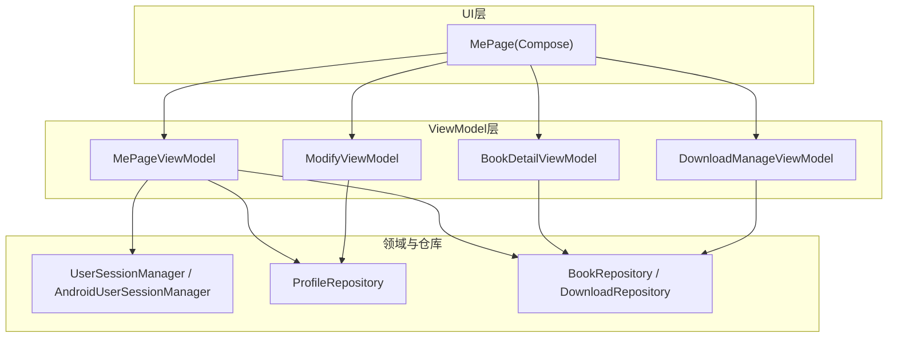
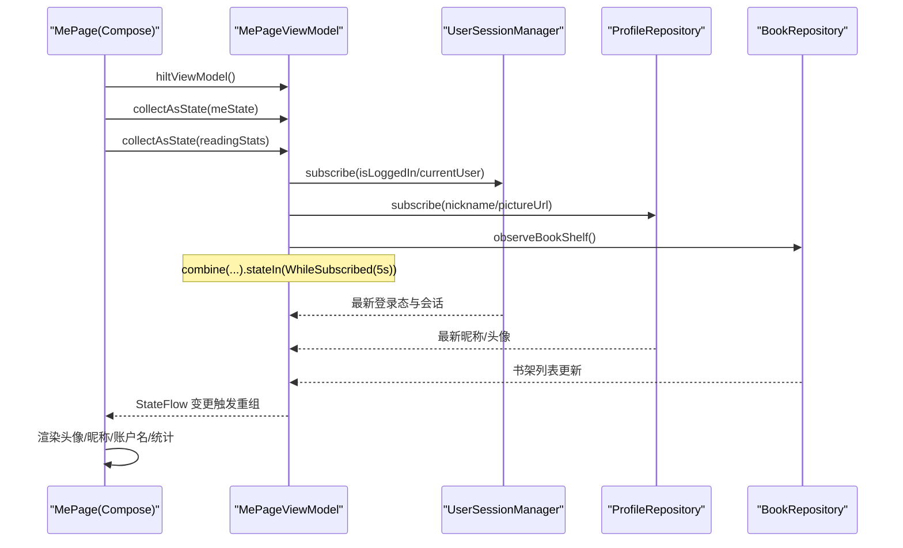
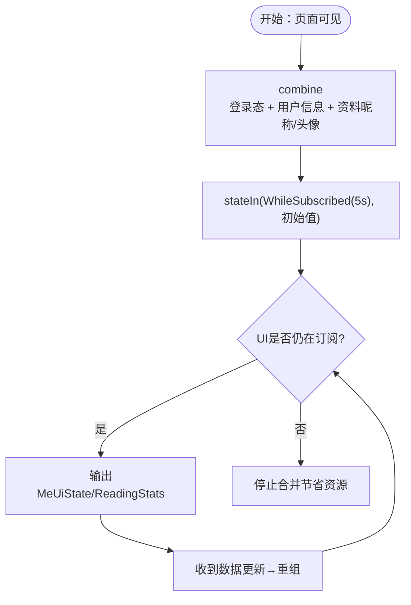
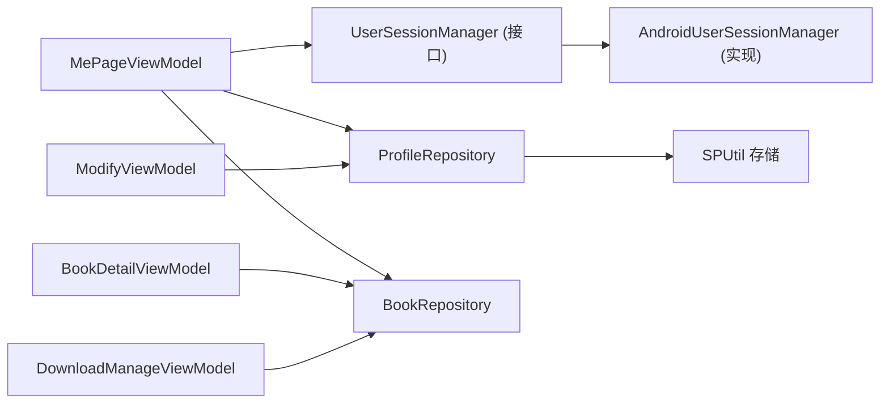

# StateFlow状态管理

<cite>
**本文引用的文件**
- [MePageViewModel.kt](file://module_me/src/main/java/com/ebook/me/mvvm/viewmodel/MePageViewModel.kt)
- [ModifyViewModel.kt](file://module_me/src/main/java/com/ebook/me/mvvm/viewmodel/ModifyViewModel.kt)
- [BookDetailViewModel.kt](file://module_book/src/main/java/com/ebook/book/mvvm/viewmodel/BookDetailViewModel.kt)
- [DownloadManageViewModel.kt](file://module_book/src/main/java/com/ebook/book/mvvm/viewmodel/DownloadManageViewModel.kt)
- [AndroidUserSessionManager.kt](file://lib_book_common/src/main/java/com/ebook/common/domain/AndroidUserSessionManager.kt)
- [UserSessionManager.kt](file://lib_book_common/src/main/java/com/ebook/common/domain/UserSessionManager.kt)
- [ProfileRepository.kt](file://lib_book_common/src/main/java/com/ebook/common/repository/ProfileRepository.kt)
- [MePage.kt](file://module_me/src/main/java/com/ebook/me/page/MePage.kt)
</cite>

## 目录
1. [简介](#简介)
2. [项目结构](#项目结构)
3. [核心组件](#核心组件)
4. [架构总览](#架构总览)
5. [关键组件深度分析](#关键组件深度分析)
6. [依赖关系分析](#依赖关系分析)
7. [性能考量](#性能考量)
8. [故障排查指南](#故障排查指南)
9. [结论](#结论)
10. [附录](#附录)（如有）

## 简介
本方案在 ViewModel 层统一通过 StateFlow 暴露用户状态、业务状态与数据状态，供 Compose UI 订阅。核心思路：
- 将多个来源的状态流（登录态、个人资料、书架数据等）使用 combine 聚合为单一 UI 状态，避免在 Composable 中散布多条 collectAsState 与回退判断。
- 使用 stateIn 将可变或上游流转换为有初始值的、生命周期感知的共享流；结合 SharingStarted.WhileSubscribed(5_000) 在页面不可见时停止合并，切回立即恢复。
- 以 MutableStateFlow + asStateFlow 组合实现“受控写 + 只读展示”的模式，保证 ViewModel 内部可变性不泄露到外部。
- 针对错误、加载等复杂状态，采用可观察的 UiState data class 承载多字段，便于在 UI 中显式渲染。

该方案在 MePageViewModel、ModifyViewModel、BookDetailViewModel 等已有实现中落地，具备一致性与实践验证。

## 项目结构
- 模块边界
  - module_me：个人中心相关页面与 ViewModel（例如 MePageViewModel、ModifyViewModel）。
  - module_book：书籍详情、下载管理等 ViewModel（例如 BookDetailViewModel、DownloadManageViewModel）。
  - lib_book_common：跨模块共享库，包含会话管理 UserSessionManager/AndroidUserSessionManager 与 ProfileRepository 等。
- 文件组织方式
  - MVVM：ViewModel 继承 BaseViewModel/NoOpModel 占位；Repository 负责数据；Domain/Provider 暴露状态源。
  - 状态定义集中在 ViewModel 层，UI 侧仅消费 StateFlow。
- 入口与消费点
  - MePage 通过 hiltViewModel() 获取 VM，collectAsState 订阅 meState 与 readingStats 后渲染页面。

图表来源
- [MePage.kt:79-91](file://module_me/src/main/java/com/ebook/me/page/MePage.kt#L79-L91)
- [MePageViewModel.kt:65-103](file://module_me/src/main/java/com/ebook/me/mvvm/viewmodel/MePageViewModel.kt#L65-L103)
- [ModifyViewModel.kt:42-110](file://module_me/src/main/java/com/ebook/me/mvvm/viewmodel/ModifyViewModel.kt#L42-L110)
- [BookDetailViewModel.kt:42-177](file://module_book/src/main/java/com/ebook/book/mvvm/viewmodel/BookDetailViewModel.kt#L42-L177)
- [DownloadManageViewModel.kt:56-159](file://module_book/src/main/java/com/ebook/book/mvvm/viewmodel/DownloadManageViewModel.kt#L56-L159)
- [AndroidUserSessionManager.kt:17-162](file://lib_book_common/src/main/java/com/ebook/common/domain/AndroidUserSessionManager.kt#L17-L162)
- [ProfileRepository.kt:12-54](file://lib_book_common/src/main/java/com/ebook/common/repository/ProfileRepository.kt#L12-L54)

章节来源
- [MePage.kt:79-91](file://module_me/src/main/java/com/ebook/me/page/MePage.kt#L79-L91)
- [MePageViewModel.kt:65-103](file://module_me/src/main/java/com/ebook/me/mvvm/viewmodel/MePageViewModel.kt#L65-L103)

## 核心组件
- MePageViewModel
  - 职责：合并登录态、用户信息与书架本地统计，产出单一 meState 与 readingStats 供 UI 消费。
  - 模式：combine(userSessionManager.isLoggedIn, currentUser, profileRepository.nickname, pictureUrl) → StateFlow<MeUiState>；Room 书架变化经 map(stateIn)。
- ModifyViewModel
  - 职责：编辑资料页昵称与头像的展示态聚合。
  - 模式：combine(profileRepository.nickname, pictureUrl) → StateFlow<ProfileDisplayState>。
- BookDetailViewModel
  - 职责：详情页网络拉取与书架状态同步，维护 loading、loadError、inBookShelf 等状态字段。
  - 模式：MutableStateFlow<BookDetailUiState> + asStateFlow()；集合事件集中到 VM init 内处理，避免旋转重建重复收集。
- DownloadManageViewModel
  - 职责：按书聚合下载任务与进度、控制下载服务行为、暴露剩余角标流。
  - 模式：SharedFlow<DownloadState> 暴露服务状态；stateIn(viewModelScope, WhileSubscribed, 默认值) 暴露 remainingCount。
- 会话与个人资料
  - UserSessionManager：纯接口，暴露 isLoggedIn/currentUser 等 StateFlow，由 AndroidUserSessionManager 管理内存与 SP 持久化，以及 TokenHolder 同步。
  - ProfileRepository：昵称与头像 StateFlow，读写落盘并支持 resetProfileState() 用于清会话时的内存镜像复位。

章节来源
- [MePageViewModel.kt:17-64](file://module_me/src/main/java/com/ebook/me/mvvm/viewmodel/MePageViewModel.kt#L17-L64)
- [MePageViewModel.kt:65-103](file://module_me/src/main/java/com/ebook/me/mvvm/viewmodel/MePageViewModel.kt#L65-L103)
- [ModifyViewModel.kt:22-59](file://module_me/src/main/java/com/ebook/me/mvvm/viewmodel/ModifyViewModel.kt#L22-L59)
- [BookDetailViewModel.kt:22-64](file://module_book/src/main/java/com/ebook/book/mvvm/viewmodel/BookDetailViewModel.kt#L22-L64)
- [DownloadManageViewModel.kt:23-77](file://module_book/src/main/java/com/ebook/book/mvvm/viewmodel/DownloadManageViewModel.kt#L23-L77)
- [UserSessionManager.kt:5-62](file://lib_book_common/src/main/java/com/ebook/common/domain/UserSessionManager.kt#L5-L62)
- [AndroidUserSessionManager.kt:17-162](file://lib_book_common/src/main/java/com/ebook/common/domain/AndroidUserSessionManager.kt#L17-L162)
- [ProfileRepository.kt:12-54](file://lib_book_common/src/main/java/com/ebook/common/repository/ProfileRepository.kt#L12-L54)

## 架构总览
下面的序列图展示了“我的”页从组合到状态拉取、合并再到重组的流程。

图表来源
- [MePage.kt:79-91](file://module_me/src/main/java/com/ebook/me/page/MePage.kt#L79-L91)
- [MePageViewModel.kt:72-102](file://module_me/src/main/java/com/ebook/me/mvvm/viewmodel/MePageViewModel.kt#L72-L102)

## 关键组件深度分析

### MePageViewModel：多源状态合并策略
- 合并目标
  - meState：统一 login 态与个人资料，提供 nickname/avatar/username/isLoggedIn。
  - readingStats：书架数量与最近在读书名。
- 合并逻辑要点
  - 昵称优先来自 ProfileRepository（改昵称链路写入），若为空则回退到 UserSession.currentUser 中的 nickname，兼容旧迁移场景。
  - 头像同理，pictureUrl 为空回退至 currentUser.avatar。
  - 所有状态使用 combine + stateIn 生产单一 StateFlow，UI 只需 collectAsState。
- 生命周期与省电
  - SharingStarted.WhileSubscribed(5_000)：离开页面 5 秒内停止合并，回到页面立即用缓存值恢复，平衡体验与功耗。
- 推荐代码片段路径
  - 多源合并与 stateIn 初始化：[MePageViewModel.kt:72-102](file://module_me/src/main/java/com/ebook/me/mvvm/viewmodel/MePageViewModel.kt#L72-L102)
  - 阅读统计映射与 stateIn：[MePageViewModel.kt:91-102](file://module_me/src/main/java/com/ebook/me/mvvm/viewmodel/MePageViewModel.kt#L91-L102)

图表来源
- [MePageViewModel.kt:72-102](file://module_me/src/main/java/com/ebook/me/mvvm/viewmodel/MePageViewModel.kt#L72-L102)

章节来源
- [MePageViewModel.kt:65-103](file://module_me/src/main/java/com/ebook/me/mvvm/viewmodel/MePageViewModel.kt#L65-L103)

### ModifyViewModel：编辑资料页的资料态合并
- 聚合 ProfileRepository 的 nickname/pictureUrl，合并为单一 ProfileDisplayState。
- 修改成功后调 ProfileRepository.update*，触发自动刷新 UI。
- 错误处理：会话过期由全局统一处置，当前调用点仅记日志；失败路径使用 sendToast(errorText)。
- 推荐代码片段路径
  - 资料态合并：[ModifyViewModel.kt:50-59](file://module_me/src/main/java/com/ebook/me/mvvm/viewmodel/ModifyViewModel.kt#L50-L59)
  - 修改头像成功后的资料更新：[ModifyViewModel.kt:90-107](file://module_me/src/main/java/com/ebook/me/mvvm/viewmodel/ModifyViewModel.kt#L90-L107)

章节来源
- [ModifyViewModel.kt:42-110](file://module_me/src/main/java/com/ebook/me/mvvm/viewmodel/ModifyViewModel.kt#L42-L110)

### BookDetailViewModel：加载、错误与书架同步
- 以 MutableStateFlow<BookDetailUiState> 封装 loading/inBookShelf/loadError/bookShelf。
- 书架事件监听收拢在 VM init，避免 Activity 侧多次收集导致的重复累积。
- 错误语义：只置 loadError 不清空已有实体，保持“开始阅读”链路不断。
- 推荐代码片段路径
  - detailState 定义与读取属性：[BookDetailViewModel.kt:51-64](file://module_book/src/main/java/com/ebook/book/mvvm/viewmodel/BookDetailViewModel.kt#L51-L64)
  - 书架事件收集与状态更新：[BookDetailViewModel.kt:65-87](file://module_book/src/main/java/com/ebook/book/mvvm/viewmodel/BookDetailViewModel.kt#L65-L87)
  - 详情拉取与错误处理分支：[BookDetailViewModel.kt:107-147](file://module_book/src/main/java/com/ebook/book/mvvm/viewmodel/BookDetailViewModel.kt#L107-L147)

章节来源
- [BookDetailViewModel.kt:22-177](file://module_book/src/main/java/com/ebook/book/mvvm/viewmodel/BookDetailViewModel.kt#L22-L177)

### DownloadManageViewModel：服务状态与剩余计数
- downloadState：SharedFlow<DownloadState> 由模型层暴露，页面订阅以驱动分组活跃态。
- remainingCount：observeRemainingCount().stateIn(viewModelScope, WhileSubscribed(5s), 0)，仅在书架可见时保持活跃，减少数据库查询。
- 操作下发：sendAction 直接发 Intent 到 DownloadService，避免命令通道在宿主缺失时被丢弃。
- 推荐代码片段路径
  - remainingCount 的 stateIn：[DownloadManageViewModel.kt:72-76](file://module_book/src/main/java/com/ebook/book/mvvm/viewmodel/DownloadManageViewModel.kt#L72-L76)
  - 下载动作与启动限制提示：[DownloadManageViewModel.kt:132-135](file://module_book/src/main/java/com/ebook/book/mvvm/viewmodel/DownloadManageViewModel.kt#L132-L135)

章节来源
- [DownloadManageViewModel.kt:56-159](file://module_book/src/main/java/com/ebook/book/mvvm/viewmodel/DownloadManageViewModel.kt#L56-L159)

### 会话与个人资料：StateFlow 驱动的源头
- UserSessionManager：定义 isLoggedIn/currentUser StateFlow 与 saveSession/rotateCredentials/clearSession 等方法，纯 Kotlin 接口方便解耦。
- AndroidUserSessionManager：
  - 将 StateFlow 与 SharedPreferences 双向同步；启动时恢复 token 到 TokenHolder。
  - clearSession 一次性清空三处镜像（user_session SP、spUtils 兼容键、ProfileRepository 内存流），避免登出后显示上个身份的问题。
- ProfileRepository：nickname/pictureUrl StateFlow，update* 同时写 SP；resetProfileState() internal 仅供会话清理调用。
- 推荐代码片段路径
  - 接口定义：[UserSessionManager.kt:13-62](file://lib_book_common/src/main/java/com/ebook/common/domain/UserSessionManager.kt#L13-L62)
  - Android 实现与会话清理：[AndroidUserSessionManager.kt:17-162](file://lib_book_common/src/main/java/com/ebook/common/domain/AndroidUserSessionManager.kt#L17-L162)
  - 个人资料流：[ProfileRepository.kt:12-54](file://lib_book_common/src/main/java/com/ebook/common/repository/ProfileRepository.kt#L12-L54)

章节来源
- [UserSessionManager.kt:5-62](file://lib_book_common/src/main/java/com/ebook/common/domain/UserSessionManager.kt#L5-L62)
- [AndroidUserSessionManager.kt:17-162](file://lib_book_common/src/main/java/com/ebook/common/domain/AndroidUserSessionManager.kt#L17-L162)
- [ProfileRepository.kt:12-54](file://lib_book_common/src/main/java/com/ebook/common/repository/ProfileRepository.kt#L12-L54)

## 依赖关系分析
- 低耦合：ViewModel 只依赖抽象接口（如 UserSessionManager）与仓库，避免直接持有具体持久化细节。
- 单向数据流：UI 仅消费 StateFlow，状态改变由后端仓库/领域层发起，ViewModel 做转换与聚合。
- 组合原则：combine 负责横向拼装不同来源的数据流；map 做纵向变换；stateIn 保障生命周期与初始值。

图表来源
- [MePageViewModel.kt:65-103](file://module_me/src/main/java/com/ebook/me/mvvm/viewmodel/MePageViewModel.kt#L65-L103)
- [ModifyViewModel.kt:42-110](file://module_me/src/main/java/com/ebook/me/mvvm/viewmodel/ModifyViewModel.kt#L42-L110)
- [BookDetailViewModel.kt:42-177](file://module_book/src/main/java/com/ebook/book/mvvm/viewmodel/BookDetailViewModel.kt#L42-L177)
- [DownloadManageViewModel.kt:56-159](file://module_book/src/main/java/com/ebook/book/mvvm/viewmodel/DownloadManageViewModel.kt#L56-L159)

章节来源
- [MePageViewModel.kt:65-103](file://module_me/src/main/java/com/ebook/me/mvvm/viewmodel/MePageViewModel.kt#L65-L103)
- [ModifyViewModel.kt:42-110](file://module_me/src/main/java/com/ebook/me/mvvm/viewmodel/ModifyViewModel.kt#L42-L110)
- [BookDetailViewModel.kt:42-177](file://module_book/src/main/java/com/ebook/book/mvvm/viewmodel/BookDetailViewModel.kt#L42-L177)
- [DownloadManageViewModel.kt:56-159](file://module_book/src/main/java/com/ebook/book/mvvm/viewmodel/DownloadManageViewModel.kt#L56-L159)

## 性能考量
- 合理使用 WhileSubIdle/WhileSubscribed(5_000)
  - 离开页面时延迟停流，兼顾“切回立刻渲染”的体验；降低后台合并的 CPU/IO 开销。
- combine/map 的组合复杂度
  - 合并越多流越需确保每个源轻量、热更新高效；对重型计算建议移至 Repository 层或使用 Flow 操作符优化。
- Room 失效追踪
  - BookRepository.observeBookShelf() 基于 Room 失效机制推送新值，避免轮询。
- 避免无意义重组
  - 使用 immutable 数据结构或精确字段 copy/update；活跃章节 URL 变化才重算分组（DownloadManageViewModel）。
- 前端提示的健壮性
  - DownloadManageViewModel 对启动前台服务的限制进行友好提示，避免未捕获异常导致崩溃。

[本节提供通用指导，无需列出具体源码行]

## 故障排查指南
- 页面不刷新或状态丢失
  - 检查是否正确 collectAsState 且处于可见生命周期；确认 use stateIn(initialValue=...) 提供了稳定的初始值。
  - 参考路径：[MePage.kt:79-91](file://module_me/src/main/java/com/ebook/me/page/MePage.kt#L79-L91)
- 错误态未生效
  - BookDetailViewModel 的错误分支会设置 loadError，注意不要覆盖为 null；必要时增加重试按钮。
  - 参考路径：[BookDetailViewModel.kt:107-147](file://module_book/src/main/java/com/ebook/book/mvvm/viewmodel/BookDetailViewModel.kt#L107-L147)
- 登出后仍显示上一个用户资料
  - 确保通过 AndroidUserSessionManager.clearSession() 一并清理 Session SP/spUtils/ProfileRepository 内存镜像。
  - 参考路径：[AndroidUserSessionManager.kt:100-133](file://lib_book_common/src/main/java/com/ebook/common/domain/AndroidUserSessionManager.kt#L100-L133)
- 角标或进度不更新
  - DownloadManageViewModel.remainingCount 使用 stateIn(WhileSubscribed(5_000), 0)，仅在书架可见时活跃；离开即停止查库属于预期。
  - 参考路径：[DownloadManageViewModel.kt:72-76](file://module_book/src/main/java/com/ebook/book/mvvm/viewmodel/DownloadManageViewModel.kt#L72-L76)

章节来源
- [MePage.kt:79-91](file://module_me/src/main/java/com/ebook/me/page/MePage.kt#L79-L91)
- [BookDetailViewModel.kt:107-147](file://module_book/src/main/java/com/ebook/book/mvvm/viewmodel/BookDetailViewModel.kt#L107-L147)
- [AndroidUserSessionManager.kt:100-133](file://lib_book_common/src/main/java/com/ebook/common/domain/AndroidUserSessionManager.kt#L100-L133)
- [DownloadManageViewModel.kt:72-76](file://module_book/src/main/java/com/ebook/book/mvvm/viewmodel/DownloadManageViewModel.kt#L72-L76)

## 结论
- 本项目在 ViewModel 层已形成稳定、一致的状态管理模式：以 StateFlow 暴露状态、combine 聚合多源、stateIn 绑定生命周期并提供初始值。
- MePageViewModel 展示了典型的多数据源合并（登录态+个人资料）与本地统计；ModifyViewModel 聚焦资料态合并；BookDetailViewModel 和 DownloadManageViewModel 展示了加载/错误/服务状态的可靠封装。
- 对于复杂页面，优先收敛到 VM 内的 StateFlow，UI 仅关注渲染与交互；避免将回退与分发逻辑散落到 Composable 中。
- 在生命周期与安全方面，遵循 WhileSubscribed(5_000)、TokenHolder 与三处镜像清理约定，保证状态一致性与用户体验。

[本节总结性内容，不分析具体文件]

## 附录

### StateFlow vs mutableStateOf 的选择与适用场景
- StateFlow（协程流）
  - 适合跨组件传递的业务/数据状态，具备生命周期感知（stateIn）、冷/热流能力、顺序性与背压（Replay/Buffering）。
  - 典型用法：仓库/领域层暴露的状态、跨 ViewModel 的状态共享、需要合并/变换的场景。
- mutableStateOf（Jetpack Compose 状态）
  - 适合 UI 局部状态（如临时开关、表单输入中间态），不参与长期生命周期管理。
- 选择建议
  - 业务状态与跨层状态统一使用 StateFlow；页面内部短暂交互状态可使用 mutableStateOf。
  - 将二者职责分离有助于避免内存泄漏与不必要重组。

[概念性说明，不引用具体文件]

### 如何避免 StateFlow 导致的内存泄漏
- 始终将 StateFlow 订阅限定在合适的生命周期内（viewModelScope/lifecycleScope）。
- 对于长时间运行的上游流，使用 whileInLifecycle()/stateIn 并设定 stopped 阈值（如 5_000ms）。
- 避免在单例或长生命周期对象中持有短生命周期作用域的 StateFlow 订阅。
- 使用 immutable data class 作为 StateFlow 值，减少对象复用导致的副作用。

[概念性说明，不引用具体文件]

### 具体实践参考（路径）
- 多源合并示例
  - [MePageViewModel.kt:72-102](file://module_me/src/main/java/com/ebook/me/mvvm/viewmodel/MePageViewModel.kt#L72-L102)
- 错误/加载状态封装
  - [BookDetailViewModel.kt:107-147](file://module_book/src/main/java/com/ebook/book/mvvm/viewmodel/BookDetailViewModel.kt#L107-L147)
- 服务状态与角标
  - [DownloadManageViewModel.kt:72-76](file://module_book/src/main/java/com/ebook/book/mvvm/viewmodel/DownloadManageViewModel.kt#L72-L76)