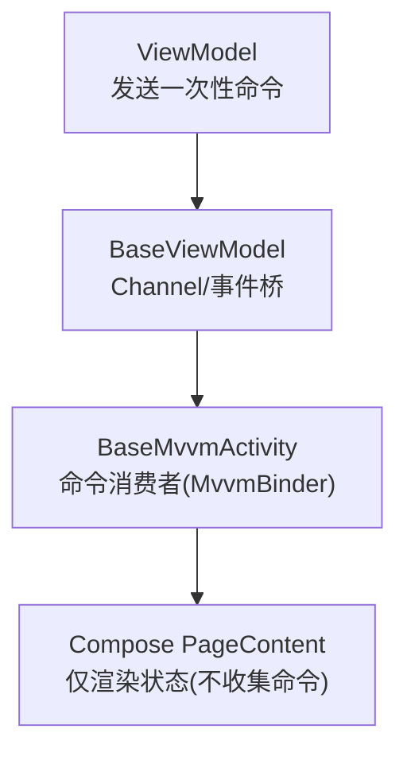
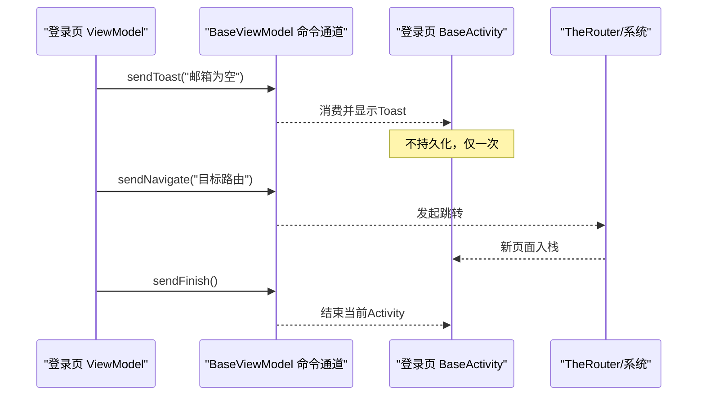
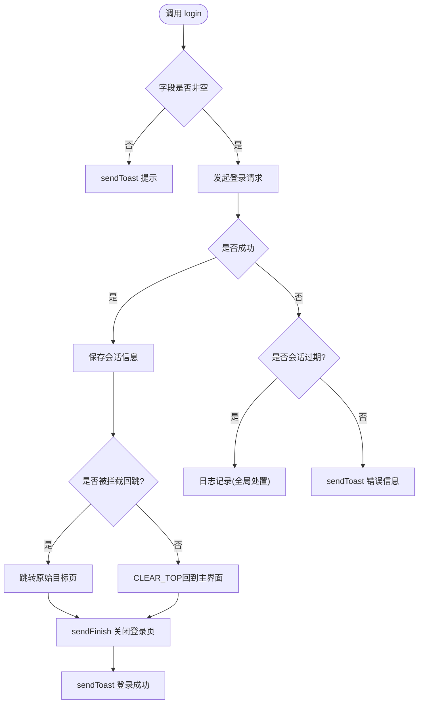
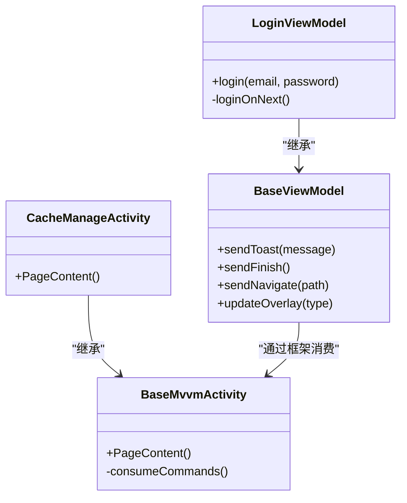

# UI命令通道机制

<cite>
**本文引用的文件**
- [AGENTS.md](file://AGENTS.md)
- [LoginViewModel.kt](file://module_login/src/main/java/com/ebook/login/mvvm/viewmodel/LoginViewModel.kt)
- [LoginActivity.kt](file://module_login/src/main/java/com/ebook/login/LoginActivity.kt)
- [RegisterActivity.kt](file://module_login/src/main/java/com/ebook/login/RegisterActivity.kt)
- [ModifyViewModel.kt](file://module_me/src/main/java/com/ebook/me/mvvm/viewmodel/ModifyViewModel.kt)
- [CacheManageActivity.kt](file://module_me/src/main/java/com/ebook/me/view/CacheManageActivity.kt)
- [BookDetailViewModel.kt](file://module_book/src/main/java/com/ebook/book/mvvm/viewmodel/BookDetailViewModel.kt)
</cite>

## 目录
1. [引言](#引言)
2. [项目结构](#项目结构)
3. [核心组件](#核心组件)
4. [架构总览](#架构总览)
5. [详细组件分析](#详细组件分析)
6. [依赖关系分析](#依赖关系分析)
7. [性能与一致性考量](#性能与一致性考量)
8. [故障排查指南](#故障排查指南)
9. [结论](#结论)

## 引言
本文聚焦于Android端MVVM中的“UI命令通道”设计：由ViewModel通过一次性命令（如显示提示、关闭页面、导航跳转）驱动UI动作，Activity侧由基类自动消费。该机制采用单向数据流，确保命令仅消费一次，避免重复触发。本文将结合仓库中实际实现，详细说明BaseViewModel提供的通道机制、Command到Activity的传递方式、Compose环境下的使用约定，并与StateFlow进行对比，给出常见问题的解决方案。

## 项目结构
本项目采用多模块结构：业务模块通过共享层lib_book_common与底层库协作，页面采用Compose；所有持有ViewModel的页面统一继承lib_common的BaseMvvmActivity，从而获得一次性UI命令通道的能力。关键路径包括：
- Activity基类与命令消费：由BaseMvvmActivity在框架侧订阅并执行命令
- ViewModel命令发送：各业务ViewModel调用BaseViewModel暴露的方法发送一次性命令
- 状态更新与可观察：通过StateFlow/SharedFlow进行持续状态广播

图示映射到实际代码的职责划分：ViewModel通过BaseViewModel发送指令，Activity基类负责消费，页面只管渲染UI状态。

章节来源
- [AGENTS.md:170-175](file://AGENTS.md#L170-L175)

## 核心组件
- BaseViewModel（来自lib_common）：为所有ViewModel提供统一的UI通道入口，包括sendToast（弹出提示）、sendFinish（结束页面）、sendNavigate（发起导航）等一次性方法；还提供updateOverlay用于控制加载/错误覆盖层。
- BaseMvvmActivity（来自lib_common Compose分支）：持有并消费这些一次性命令；页面需继承该类才能生效，否则命令将静默失效。
- LoginViewModel/ModifyViewModel/BookDetailViewModel：业务示例展示如何发送通知、导航与退出。

章节来源
- [AGENTS.md:170-175](file://AGENTS.md#L170-L175)
- [LoginViewModel.kt:1-20](file://module_login/src/main/java/com/ebook/login/mvvm/viewmodel/LoginViewModel.kt#L1-L20)
- [ModifyViewModel.kt:1-20](file://module_me/src/main/java/com/ebook/me/mvvm/viewmodel/ModifyViewModel.kt#L1-L20)
- [BookDetailViewModel.kt:1-20](file://module_book/src/main/java/com/ebook/book/mvvm/viewmodel/BookDetailViewModel.kt#L1-L20)

## 架构总览
UI命令通道遵循“单向数据流”：ViewModel只负责“发出命令”，Activity基类负责“消费命令”。页面自身不订阅命令流，也不自行显示Toast或完成Activity，这样保证幂等和单次消费。同时，页面继续用StateFlow表达UI状态（如加载中、失败态、列表数据），二者职责清晰。

图示说明登录成功时的完整交互链路。

图示来源
- [LoginViewModel.kt:46-83](file://module_login/src/main/java/com/ebook/login/mvvm/viewmodel/LoginViewModel.kt#L46-L83)
- [LoginViewModel.kt:98-116](file://module_login/src/main/java/com/ebook/login/mvvm/viewmodel/LoginViewModel.kt#L98-L116)
- [AGENTS.md:170-175](file://AGENTS.md#L170-L175)

## 详细组件分析

### LoginViewModel：导航、提示与退出的综合示例
- 输入校验：空字段时直接调用sendToast提示，不进入网络流程。
- 登录成功：保存会话后决定回跳策略（被拦截的目标页 vs 主动登录场景的主界面），通过TheRouter发起导航；最后调用sendFinish关闭登录页，并提示登录成功。
- 错误处理：区分会话过期（全局已处置）与其他API异常，分别提示或静默。

图示来源
- [LoginViewModel.kt:46-83](file://module_login/src/main/java/com/ebook/login/mvvm/viewmodel/LoginViewModel.kt#L46-L83)
- [LoginViewModel.kt:98-116](file://module_login/src/main/java/com/ebook/login/mvvm/viewmodel/LoginViewModel.kt#L98-L116)

章节来源
- [LoginViewModel.kt:23-117](file://module_login/src/main/java/com/ebook/login/mvvm/viewmodel/LoginViewModel.kt#L23-L117)

### ModifyViewModel：编辑资料与finish配合
- 修改昵称成功后：调用sendToast反馈，更新资料缓存，再调用sendFinish返回上一级。
- 头像上传：加载覆盖层由updateOverlay控制；成功或失败分别toast提示，失败分支对会话过期做全局统一处理。

章节来源
- [ModifyViewModel.kt:35-79](file://module_me/src/main/java/com/ebook/me/mvvm/viewmodel/ModifyViewModel.kt#L35-L79)
- [ModifyViewModel.kt:81-110](file://module_me/src/main/java/com/ebook/me/mvvm/viewmodel/ModifyViewModel.kt#L81-L110)

### BookDetailViewModel：从事件触发finishing
- 书架移除事件中，调用sendFinish关闭详情页，避免返回列表中出现无效条目。

章节来源
- [BookDetailViewModel.kt:65-88](file://module_book/src/main/java/com/ebook/book/mvvm/viewmodel/BookDetailViewModel.kt#L65-L88)

### 页面如何与通道配合
- LoginActivity/CacheManageActivity/注册页均继承BaseMvvmActivity，使得ViewModel的sendToast/sendFinish/sendNavigate可在运行时被自动消费。页面本身只做Compose组合与状态收集，不涉及命令消费逻辑。

章节来源
- [LoginActivity.kt:49-70](file://module_login/src/main/java/com/ebook/login/LoginActivity.kt#L49-L70)
- [RegisterActivity.kt:43-70](file://module_login/src/main/java/com/ebook/login/RegisterActivity.kt#L43-L70)
- [CacheManageActivity.kt:61-96](file://module_me/src/main/java/com/ebook/me/view/CacheManageActivity.kt#L61-L96)

## 依赖关系分析
- ViewModel → BaseViewModel：统一出口（sendToast/sendFinish/sendNavigate/updateOverlay）
- BaseViewModel → BaseMvvmActivity：由lib_common内部绑定，Activity侧通过MvvmBinder消费
- ViewModel → Repository/Service：领域与IO层
- Activity → Compose PageContent：仅负责UI与事件回调

图示来源
- [AGENTS.md:170-175](file://AGENTS.md#L170-L175)
- [LoginViewModel.kt:46-83](file://module_login/src/main/java/com/ebook/login/mvvm/viewmodel/LoginViewModel.kt#L46-L83)
- [CacheManageActivity.kt:61-96](file://module_me/src/main/java/com/ebook/me/view/CacheManageActivity.kt#L61-L96)

## 性能与一致性考量
- 一次性命令使用“通道”语义：每个命令只消费一次，避免了状态快照丢失导致的重复消费问题。
- 与StateFlow的分工：
  - StateFlow用于“持续状态”，允许重建恢复、重启订阅者后仍可获取最新值（例如加载中、失败态、用户资料）。
  - 一次性命令用于“动作”，强调“触发即执行且仅此一次”，适合Toast、导航、关闭页面等不可重复副作用。
- 推荐模式：
  - 长时间运行的状态变化：StateFlow（结合stateIn、WhileSubscribed优化生命周期内订阅成本）
  - 跨配置变更/旋转的重放需要：StateFlow
  - 不希望重复执行的副作用：一次性命令（sendToast/sendFinish/sendNavigate）

章节来源
- [AGENTS.md:170-175](file://AGENTS.md#L170-L175)
- [MePageViewModel.kt:50-64](file://module_me/src/main/java/com/ebook/me/mvvm/viewmodel/MePageViewModel.kt#L50-L64)

## 故障排查指南
常见问题与定位要点：
- 命令丢失（提示未出现、页面未关闭）
  - 原因：页面没有继承BaseMvvmActivity，导致命令未在基类消费，堆在Channel随VM销毁而丢弃
  - 参考：文档明确说明基类必须继承，否则命令静默失效
  - 解决：确保Activity继承BaseMvvmActivity并正确通过viewModels()获取ViewModel
- 线程安全与异步时序
  - 建议在viewModelScope中执行网络与写库操作，避免主线程阻塞
  - 注意会话过期的全局处置分支：当接口返回会话过期时，由全局拦截器负责清会话+提示+跳转登录，业务VM侧应静默处理仅记日志，不要重复提示
- 内存泄漏防范
  - 使用StateFlow配合stateIn、SharingStarted.WhileSubscribed限制订阅范围
  - 避免在Composable中捕获大对象或不必要的全局引用
  - 确保网络请求或协程通过viewModelScope管理生命周期

章节来源
- [AGENTS.md:170-175](file://AGENTS.md#L170-L175)
- [LoginViewModel.kt:68-76](file://module_login/src/main/java/com/ebook/login/mvvm/viewmodel/LoginViewModel.kt#L68-L76)
- [ModifyViewModel.kt:64-79](file://module_me/src/main/java/com/ebook/me/mvvm/viewmodel/ModifyViewModel.kt#L64-L79)

## 结论
本项目的UI命令通道通过BaseViewModel暴露一次性方法，并由BaseMvvmActivity集中消费，形成清晰的单向通信：ViewModel只关心“该做什么”，Activity关注“何时做”，页面只渲染“状态是什么”。这种方式天然具备幂等与防重特性，极大降低了复杂交互场景下的副作用控制难度。在实践中，应与StateFlow正确分工：持续状态用StateFlow，一次性副作用用命令通道。严格遵循基类契约，可在Compose环境下稳定地驱动Toast、导航与页面生命周期等行为，并在大规模模块工程中保持一致性。