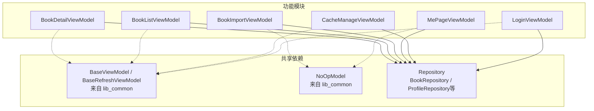
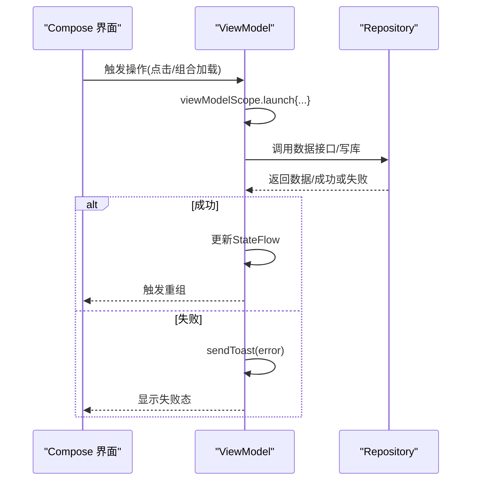
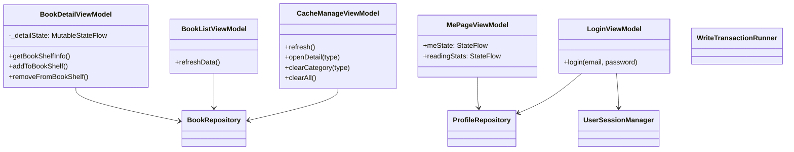

# ViewModel层设计

<cite>
**本文引用的文件列表**
- [AGENTS.md](file://AGENTS.md)
- [ContentStoreModule.kt](file://lib_book_common/src/main/java/com/ebook/common/di/ContentStoreModule.kt)
- [TransactionModule.kt](file://lib_book_common/src/main/java/com/ebook/common/di/TransactionModule.kt)
- [BookDetailViewModel.kt](file://module_book/src/main/java/com/ebook/book/mvvm/viewmodel/BookDetailViewModel.kt)
- [BookListViewModel.kt](file://module_book/src/main/java/com/ebook/book/mvvm/viewmodel/BookListViewModel.kt)
- [BookImportViewModel.kt](file://module_book/src/main/java/com/ebook/book/mvvm/viewmodel/BookImportViewModel.kt)
- [MePageViewModel.kt](file://module_me/src/main/java/com/ebook/me/mvvm/viewmodel/MePageViewModel.kt)
- [CacheManageViewModel.kt](file://module_me/src/main/java/com/ebook/me/mvvm/viewmodel/CacheManageViewModel.kt)
- [LoginViewModel.kt](file://module_login/src/main/java/com/ebook/login/mvvm/viewmodel/LoginViewModel.kt)
</cite>

## 目录
1. [简介](#简介)
2. [项目结构](#项目结构)
3. [核心组件](#核心组件)
4. [架构总览](#架构总览)
5. [关键组件详解](#关键组件详解)
6. [依赖关系分析](#依赖关系分析)
7. [性能考量](#性能考量)
8. [故障排查指南](#故障排查指南)
9. [结论](#结论)

## 简介
本文面向Android小说阅读器的MVVM ViewModel层，围绕BaseViewModel继承体系与NoOpModel在纯展示类中的使用模式进行系统化说明，覆盖状态管理、错误处理、UI命令通道的统一实践；讲解Compose UI与ViewModel的集成方式（StateFlow、共享状态、副作用边界、生命周期感知）；并给出基于仓库实际代码的示例路径，帮助实现正确的异步流程、状态驱动UI更新与业务和UI解耦。

## 项目结构
本项目的ViewModel均位于各功能模块的mvvm.viewmodel包下，遵循“功能模块→lib_book_common→底层能力”的分层模式。基类由外部库提供：
- 通用ViewModel基类为BaseViewModel，列表刷新型用BaseRefreshViewModel。
- NoOpModel是“无模型门面”占位类型，用于不暴露单一Model职责的页面。
- Hilt通过@HiltViewModel与@Inject完成注入。
- Activity必须继承BaseMvvmActivity以消费一次性命令通道（如sendToast/sendFinish），避免静默失效。

**图表来源**
- [BookDetailViewModel.kt:42-47](file://module_book/src/main/java/com/ebook/book/mvvm/viewmodel/BookDetailViewModel.kt#L42-L47)
- [BookListViewModel.kt:23-27](file://module_book/src/main/java/com/ebook/book/mvvm/viewmodel/BookListViewModel.kt#L23-L27)
- [BookImportViewModel.kt:74-79](file://module_book/src/main/java/com/ebook/book/mvvm/viewmodel/BookImportViewModel.kt#L74-L79)
- [MePageViewModel.kt:65-70](file://module_me/src/main/java/com/ebook/me/mvvm/viewmodel/MePageViewModel.kt#L65-L70)
- [CacheManageViewModel.kt:27-32](file://module_me/src/main/java/com/ebook/me/mvvm/viewmodel/CacheManageViewModel.kt#L27-L32)
- [LoginViewModel.kt:30-35](file://module_login/src/main/java/com/ebook/login/mvvm/viewmodel/LoginViewModel.kt#L30-L35)

**章节来源**
- [AGENTS.md](file://AGENTS.md)

## 核心组件
- BaseViewModel/BaseRefreshViewModel：统一的基类契约，封装加载/空态/失败态覆盖层控制（updateOverlay）、刷新结束信号（updateStopRefresh）以及一次性命令通道（sendToast/sendFinish）。
- NoOpModel：在不需要“单一模型门面”的页面作为占位参数传入BaseViewModel，保持所有ViewModel统一继承一致，便于被Activity消费命令通道。
- Repository：数据抽象层（本地Room、网络Retrofit、缓存策略、事务Runner等），ViewModel仅持有Repository依赖，不直接操作数据库或网络API。
- Compose集成：StateFlow/stateIn暴露可观察状态；viewModelScope保证协程随生命周期取消；WhileSubscribed节流省电。

**章节来源**
- [AGENTS.md](file://AGENTS.md)
- [ContentStoreModule.kt:27-86](file://lib_book_common/src/main/java/com/ebook/common/di/ContentStoreModule.kt#L27-L86)
- [TransactionModule.kt:12-24](file://lib_book_common/src/main/java/com/ebook/common/di/TransactionModule.kt#L12-L24)

## 架构总览
ViewModel负责把Repository的数据与用户动作转换为稳定的状态流，供Compose重组。常见路径：
- 读取：StateFlow + stateIn 暴露到UI层；
- 写入：方法内viewModelScope发起 suspend 调用，成功后更新状态，失败通过sendToast传递；
- 事件：SharedFlow或一次性的UI命令（Toast/导航/关闭页面）走基类通道；
- 列表页：BaseRefreshViewModel提供refreshData/updateList/updateStopRefresh的标准骨架。

**图表来源**
- [BookDetailViewModel.kt:107-148](file://module_book/src/main/java/com/ebook/book/mvvm/viewmodel/BookDetailViewModel.kt#L107-L148)
- [LoginViewModel.kt:46-83](file://module_login/src/main/java/com/ebook/login/mvvm/viewmodel/LoginViewModel.kt#L46-L83)
- [CommentViewModel.kt:35-60](file://module_me/src/main/java/com/ebook/me/mvvm/viewmodel/CommentViewModel.kt#L35-L60)

## 关键组件详解

### BaseViewModel 继承体系与用途
- 继承约定：所有业务ViewModel都应继承BaseViewModel或BaseRefreshViewModel，保持统一的生命周期、错误覆盖层与命令通道语义。
- 状态管理：页面专属StateFlow命名避免与基类的uiState冲突，例如detailState/meState/cacheState等。
- 错误处理：异常集中处理，必要时发送Toast；登录/会话过期已由全局处置时不再二次提示。
- 一次性命令通道：sendToast/sendFinish必须由继承BaseMvvmActivity的页面消费，否则会静默丢弃导致行为缺失。

**章节来源**
- [AGENTS.md](file://AGENTS.md)
- [LoginViewModel.kt:46-83](file://module_login/src/main/java/com/ebook/login/mvvm/viewmodel/LoginViewModel.kt#L46-L83)
- [BookImportViewModel.kt:168-192](file://module_book/src/main/java/com/ebook/book/mvvm/viewmodel/BookImportViewModel.kt#L168-L192)

### NoOpModel在纯展示ViewModel中的使用模式
- 当页面只需直接注入多个Repository而无“模型门面”必要，将NoOpModel作为BaseViewModel的类型参数传入，保持全仓一致：便于统一接入命令通道、避免散落的例外。
- 适用于多源合并、纯展示聚合场景。

示例参考路径：
- [MePageViewModel构造](file://module_me/src/main/java/com/ebook/me/mvvm/viewmodel/MePageViewModel.kt#L65-L70)
- [BookImportViewModel构造](file://module_book/src/main/java/com/ebook/book/mvvm/viewmodel/BookImportViewModel.kt#L74-L79)

**章节来源**
- [MePageViewModel.kt:65-70](file://module_me/src/main/java/com/ebook/me/mvvm/viewmodel/MePageViewModel.kt#L65-L70)
- [BookImportViewModel.kt:74-79](file://module_book/src/main/java/com/ebook/book/mvvm/viewmodel/BookImportViewModel.kt#L74-L79)

### 不同类型ViewModel的职责分离
- 详情/读页型：以细粒度StateFlow表达详细UI状态，复杂初始化分函数拆封（如详情页initFromBookShelf/initFromSearch/getBookShelfInfo）。
- 列表型：继承BaseRefreshViewModel，将事件驱动与手动刷新统一到refreshData+updateList+updateStopRefresh，避免重复收集导致的累加问题。
- 导入/任务型：复杂IO流水线放在内部私有流程，对外仅暴露结果流与进度流，使用原子门控/防重保护并发安全。
- 设置/账户型：以状态流组合多源（登录态、个人资料、版本信息等），强调无UI可见文本、文案由UI解析资源。

**章节来源**
- [BookDetailViewModel.kt:22-148](file://module_book/src/main/java/com/ebook/book/mvvm/viewmodel/BookDetailViewModel.kt#L22-L148)
- [BookListViewModel.kt:13-57](file://module_book/src/main/java/com/ebook/book/mvvm/viewmodel/BookListViewModel.kt#L13-L57)
- [BookImportViewModel.kt:62-192](file://module_book/src/main/java/com/ebook/book/mvvm/viewmodel/BookImportViewModel.kt#L62-L192)
- [MePageViewModel.kt:17-103](file://module_me/src/main/java/com/ebook/me/mvvm/viewmodel/MePageViewModel.kt#L17-L103)
- [CacheManageViewModel.kt:19-144](file://module_me/src/main/java/com/ebook/me/mvvm/viewmodel/CacheManageViewModel.kt#L19-L144)

### Compose UI与ViewModel集成
- StateFlow/stateIn：通过stateIn(scope=viewModelScope, started=SharingStarted.WhileSubscribed(...), initialValue=...)暴露稳定状态给Composable收集。
- 副作用边界：所有IO在ViewModel中viewModelScope运行，UI只消费StateFlow与一次性命令，不在Compose内做耗时逻辑。
- 生命周期感知：collectAsState仅在界面可见时消费；WhileSubscribed在切走Tab时暂停采集，回切快速恢复（用缓存值），平衡功耗与即时性。

参考路径：
- [MePageViewModel状态流组合与stateIn](file://module_me/src/main/java/com/ebook/me/mvvm/viewmodel/MePageViewModel.kt#L72-L103)
- [CacheManageViewModel明细BottomSheet的状态流](file://module_me/src/main/java/com/ebook/me/mvvm/viewmodel/CacheManageViewModel.kt#L61-L92)
- [BookDetailViewModel详情页状态流](file://module_book/src/main/java/com/ebook/book/mvvm/viewmodel/BookDetailViewModel.kt#L51-L58)

**章节来源**
- [MePageViewModel.kt:65-103](file://module_me/src/main/java/com/ebook/me/mvvm/viewmodel/MePageViewModel.kt#L65-L103)
- [CacheManageViewModel.kt:61-92](file://module_me/src/main/java/com/ebook/me/mvvm/viewmodel/CacheManageViewModel.kt#L61-L92)
- [BookDetailViewModel.kt:51-58](file://module_book/src/main/java/com/ebook/book/mvvm/viewmodel/BookDetailViewModel.kt#L51-L58)

### 错误处理与UI命令通道
- 一次性命令：sendToast用于提示，sendFinish用于关闭页面；这些命令只有继承BaseMvvmActivity才会生效。
- 覆盖层：updateOverlay用于表达Loading/None/NoData；列表刷新完成后需updateStopRefresh复位指示器。
- 会话过期：已在全局处理的错误分支中跳过再次提示，仅记录日志。

参考路径：
- [LoginViewModel登录失败分支与返回栈处置](file://module_login/src/main/java/com/ebook/login/mvvm/viewmodel/LoginViewModel.kt#L46-L83)
- [BookDetailViewModel添加书架失败提示](file://module_book/src/main/java/com/ebook/book/mvvm/viewmodel/BookDetailViewModel.kt#L150-L164)
- [BookListViewModel刷新结束复位](file://module_book/src/main/java/com/ebook/book/mvvm/viewmodel/BookListViewModel.kt:43-57)

**章节来源**
- [LoginViewModel.kt:46-83](file://module_login/src/main/java/com/ebook/login/mvvm/viewmodel/LoginViewModel.kt#L46-L83)
- [BookDetailViewModel.kt:150-176](file://module_book/src/main/java/com/ebook/book/mvvm/viewmodel/BookDetailViewModel.kt#L150-L176)
- [BookListViewModel.kt:43-57](file://module_book/src/main/java/com/ebook/book/mvvm/viewmodel/BookListViewModel.kt#L43-L57)

## 依赖关系分析
- Hilt装配：内容存储、事务执行器等通过Dagger Module在SingletonComponent中提供；ViewModel通过@Inject构造函数获取依赖。
- Repository解耦：ViewModel只依赖Repository接口，具体实现（本地Room、网络Retrofit、缓存等）在DI中装配。
- 数据一致性：写事务通过WriteTransactionRunner包装Room IMMEDIATE事务，保障批量写的一致性。

**图表来源**
- [BookDetailViewModel.kt:42-176](file://module_book/src/main/java/com/ebook/book/mvvm/viewmodel/BookDetailViewModel.kt#L42-L176)
- [BookListViewModel.kt:23-57](file://module_book/src/main/java/com/ebook/book/mvvm/viewmodel/BookListViewModel.kt#L23-L57)
- [CacheManageViewModel.kt:27-144](file://module_me/src/main/java/com/ebook/me/mvvm/viewmodel/CacheManageViewModel.kt#L27-L144)
- [MePageViewModel.kt:65-103](file://module_me/src/main/java/com/ebook/me/mvvm/viewmodel/MePageViewModel.kt#L65-L103)
- [LoginViewModel.kt:30-83](file://module_login/src/main/java/com/ebook/login/mvvm/viewmodel/LoginViewModel.kt#L30-L83)
- [TransactionModule.kt:12-24](file://lib_book_common/src/main/java/com/ebook/common/di/TransactionModule.kt#L12-L24)

**章节来源**
- [TransactionModule.kt:12-24](file://lib_book_common/src/main/java/com/ebook/common/di/TransactionModule.kt#L12-L24)
- [ContentStoreModule.kt:27-86](file://lib_book_common/src/main/java/com/ebook/common/di/ContentStoreModule.kt#L27-L86)

## 性能考量
- WhileSubscribed：在列表或统计页面使用stateIn配合WhileSubscribed，降低后台采集功耗并在短时间内保留缓存值。
- 避免在UI层做耗时计算：所有IO与计算在ViewModel的viewModelScope中进行，Compose只做状态消费。
- 列表分页去重与软404处理：通过repository的合并逻辑避免重复条目带来的重建异常与无效请求。

[本节未直接分析具体源码片段]

## 故障排查指南
常见问题与定位要点：
- 命令通道无效：若页面未继承BaseMvvmActivity，则sendToast/sendFinish不会生效。确认入口Activity继承正确。
- 列表重复元素：检查列表项key是否唯一；若后端“越界页返回首页”带来重复条目，需要按noteUrl去重。
- 状态不刷新：详情页曾存在普通字段但无重组通知，迁移为StateFlow解决；确保收集的是asStateFlow暴露的公开流。
- 会话过期多次提示：已在全局处理的路径中避免重复提示，仅留日志；如果仍出现，检查是否误入其他异常分支。
- 前台服务启动失败：下载相关逻辑请查看ADR-0018约束，确保通过DownloadService.start发起并先入库再启动。

**章节来源**
- [AGENTS.md](file://AGENTS.md)
- [BookDetailViewModel.kt:22-58](file://module_book/src/main/java/com/ebook/book/mvvm/viewmodel/BookDetailViewModel.kt#L22-L58)
- [BookListViewModel.kt:13-57](file://module_book/src/main/java/com/ebook/book/mvvm/viewmodel/BookListViewModel.kt#L13-L57)
- [LoginViewModel.kt:46-83](file://module_login/src/main/java/com/ebook/login/mvvm/viewmodel/LoginViewModel.kt#L46-L83)

## 结论
本项目ViewModel层基于统一的BaseViewModel体系，结合StateFlow与Hilt DI，实现了清晰的状态驱动UI、可靠的异步处理与一致的错误反馈机制。NoOpModel确保了“无模型门面”场景下的类型一致性，便于跨页面复用命令通道与覆盖层逻辑。通过Repository隔离数据访问，ViewModel专注于UI状态与业务流程编排，达到业务逻辑与UI的良好解耦。对复杂页面，采用模块化职责划分（详情/列表/导入/设置）提升可读性与可维护性。