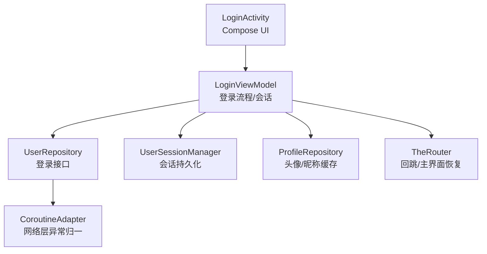
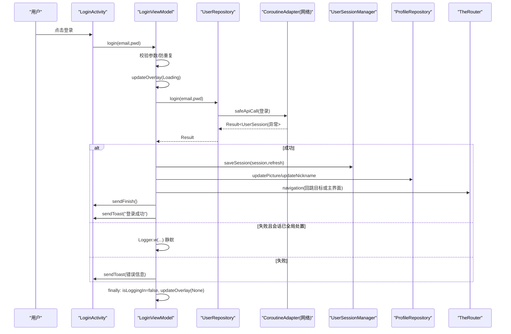
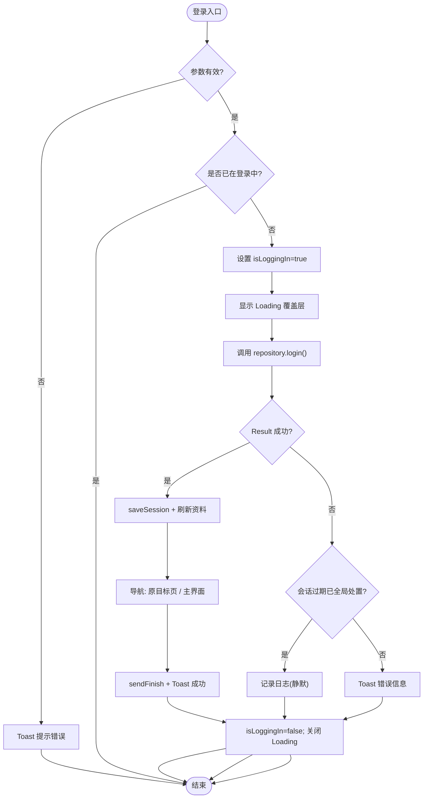
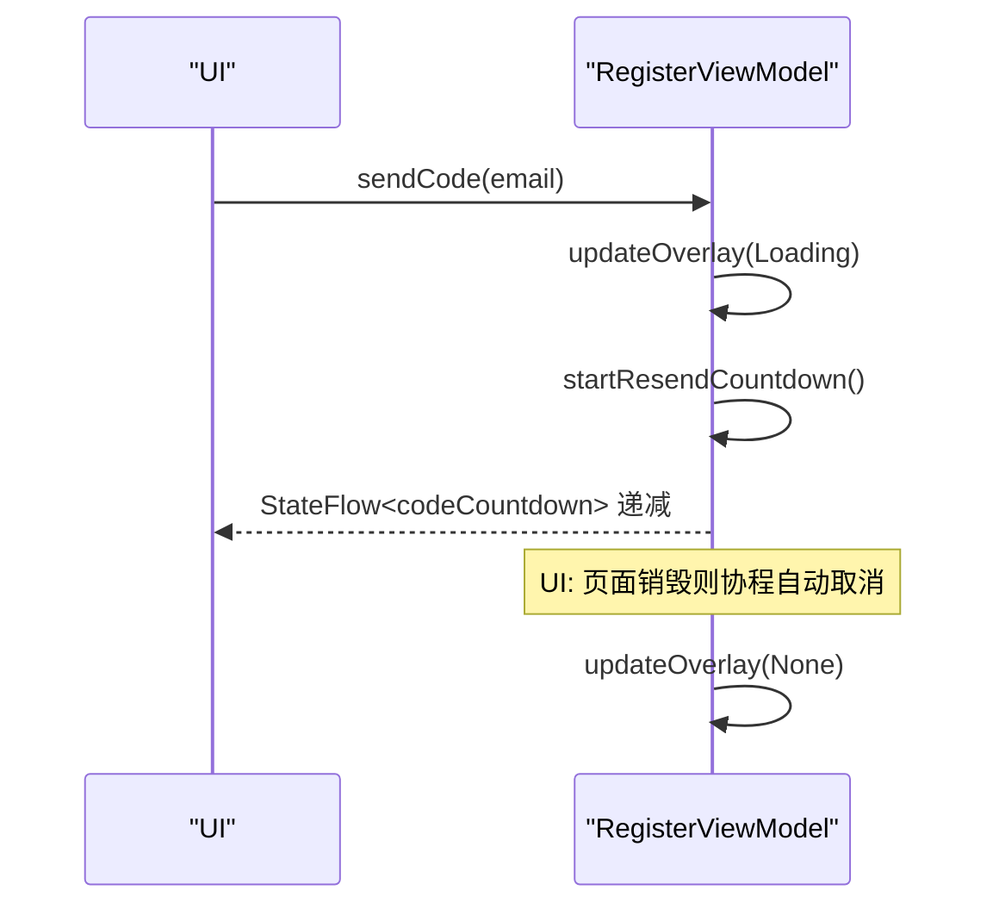
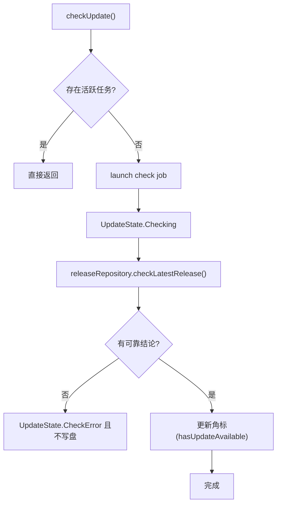
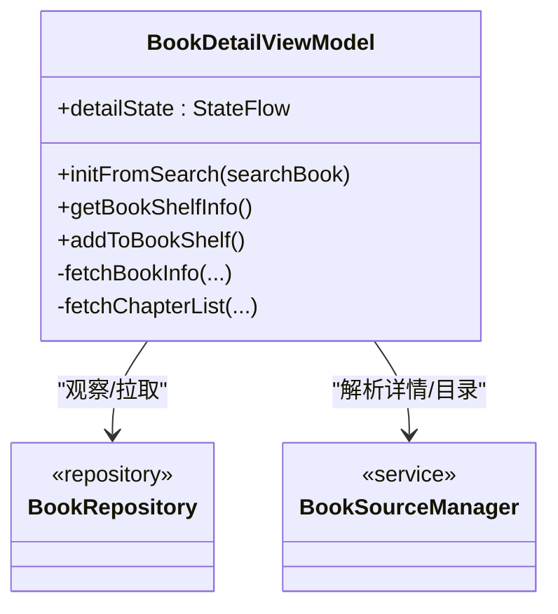
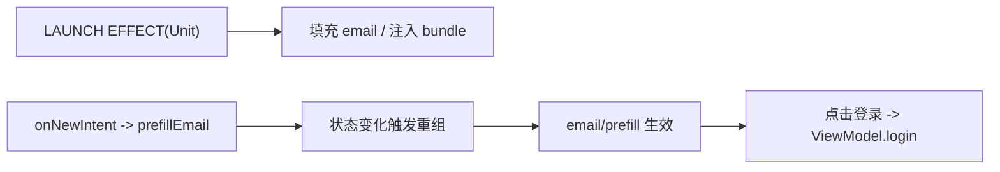
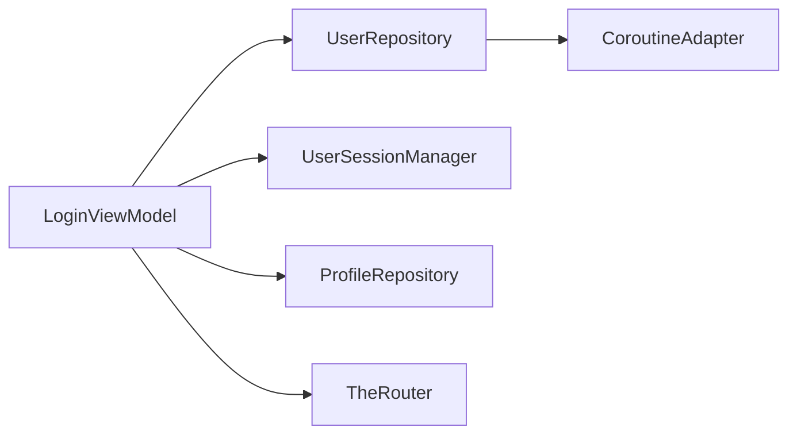

# 生命周期感知操作

<cite>
**本文件引用的源文件列表**
- [LoginViewModel.kt](file://module_login/src/main/java/com/ebook/login/mvvm/viewmodel/LoginViewModel.kt)
- [UserRepository.kt](file://module_login/src/main/java/com/ebook/login/repository/UserRepository.kt)
- [LoginActivity.kt](file://module_login/src/main/java/com/ebook/login/LoginActivity.kt)
- [RegisterViewModel.kt](file://module_login/src/main/java/com/ebook/login/mvvm/viewmodel/RegisterViewModel.kt)
- [SettingViewModel.kt](file://module_me/src/main/java/com/ebook/me/mvvm/viewmodel/SettingViewModel.kt)
- [BookDetailViewModel.kt](file://module_book/src/main/java/com/ebook/book/mvvm/viewmodel/BookDetailViewModel.kt)
- [CONTEXT.md](file://AGENTS.md)
</cite>

## 目录
1. [简介](#简介)
2. [项目结构](#项目结构)
3. [核心组件](#核心组件)
4. [架构总览](#架构总览)
5. [详细组件分析](#详细组件分析)
6. [依赖关系分析](#依赖关系分析)
7. [性能与健壮性建议](#性能与健壮性建议)
8. [故障排查指南](#故障排查指南)
9. [结论](#结论)

## 简介
本文围绕 ViewModel 中的“生命周期感知”实践，聚焦以下要点：
- 在 viewModelScope 中安全发起协程，确保页面销毁时自动取消任务，避免内存泄漏。
- 登录态、加载状态、错误处理等跨配置变更（旋转/后台切前台）的稳健管理。
- 通过 LoginViewModel 的登录流程展示防重复点击、加载中覆盖层、异常统一处理和会话恢复策略。
- 说明 Compose UI 侧使用 LaunchedEffect/lifecycleScope 进行订阅和启动副作用的时机把握。
- 给出资源释放、请求取消等通用优化与最佳实践。

## 项目结构
本仓库采用多模块 MVVM 架构，登录功能集中在 module_login：
- LoginActivity：Compose UI + Activity 生命周期桥接，负责用户输入与一次性命令消费。
- LoginViewModel：业务逻辑编排，封装登录、会话保存与回跳导航；在 viewModelScope 中使用协程并确保覆盖层与错误处理。
- UserRepository：认证域的数据访问层，统一 Result 返回并对接 CoroutineAdapter 做网络异常归一。

图示来源
- [LoginActivity.kt:49-193](file://module_login/src/main/java/com/ebook/login/LoginActivity.kt#L49-L193)
- [LoginViewModel.kt:23-116](file://module_login/src/main/java/com/ebook/login/mvvm/viewmodel/LoginViewModel.kt#L23-L116)
- [UserRepository.kt:26-84](file://module_login/src/main/java/com/ebook/login/repository/UserRepository.kt#L26-L84)

章节来源
- [LoginActivity.kt:49-193](file://module_login/src/main/java/com/ebook/login/LoginActivity.kt#L49-L193)
- [LoginViewModel.kt:23-116](file://module_login/src/main/java/com/ebook/login/mvvm/viewmodel/LoginViewModel.kt#L23-L116)
- [UserRepository.kt:26-84](file://module_login/src/main/java/com/ebook/login/repository/UserRepository.kt#L26-L84)
- [CONTEXT.md](file://AGENTS.md)

## 核心组件
- LoginViewModel
  - 入口方法 login(email, password)：非空校验 → 防重复 → 启用 Loading → 调用 repository → 成功保存会话/刷新资料 → 导航 → finally 清理 Loading。
  - 失败分支：对“会话过期已全局处置”静默记录日志，其他错误通过 sendToast 提示。
  - 防抖：isLoggingIn 字段阻止并发登录。
- UserRepository
  - 所有认证能力以 suspend + Result 暴露，内部经 CoroutineAdapter.safeApiCall 统一捕获传输/业务码异常。
- LoginActivity
  - Compose 表单，LaunchedEffect 初始化预填邮箱；单例路由（singleTask）下通过状态触发重组来消费新 Intent。

章节来源
- [LoginViewModel.kt:23-116](file://module_login/src/main/java/com/ebook/login/mvvm/viewmodel/LoginViewModel.kt#L23-L116)
- [UserRepository.kt:26-84](file://module_login/src/main/java/com/ebook/login/repository/UserRepository.kt#L26-L84)
- [LoginActivity.kt:49-193](file://module_login/src/main/java/com/ebook/login/LoginActivity.kt#L49-L193)

## 架构总览
下图描述了登录的端到端序列：从 UI 触发到网络请求、异常收口与会话处理。

图示来源
- [LoginActivity.kt:143-154](file://module_login/src/main/java/com/ebook/login/LoginActivity.kt#L143-L154)
- [LoginViewModel.kt:46-116](file://module_login/src/main/java/com/ebook/login/mvvm/viewmodel/LoginViewModel.kt#L46-L116)
- [UserRepository.kt:50-55](file://module_login/src/main/java/com/ebook/login/repository/UserRepository.kt#L50-L55)

## 详细组件分析

### LoginViewModel 登录流程（含防重复、Loading、错误恢复）
- 输入校验：邮箱为空、密码为空即 Toast 提示并早退。
- 并发控制：isLoggingIn 在启动前置 true，finally 中复位，防止重复点击。
- 协程作用域：viewModelScope.launch 保证页面销毁自动取消，不会继续更新 UI。
- 覆盖层：updateOverlay(Loading) 开始，finally 中 reset，避免悬停。
- 成功路径：保存会话、刷新本地资料缓存、回跳至被拦截页或主界面。
- 失败路径：区分会话过期全局处置与其他异常；后者通过 sendToast 提示。

图示来源
- [LoginViewModel.kt:46-82](file://module_login/src/main/java/com/ebook/login/mvvm/viewmodel/LoginViewModel.kt#L46-L82)
- [LoginViewModel.kt:85-116](file://module_login/src/main/java/com/ebook/login/mvvm/viewmodel/LoginViewModel.kt#L85-L116)

章节来源
- [LoginViewModel.kt:23-116](file://module_login/src/main/java/com/ebook/login/mvvm/viewmodel/LoginViewModel.kt#L23-L116)

### RegisterViewModel 倒计时与协程作用域管理
- 发送验证码后，仅在成功时开启 60 秒重发倒计时（StateFlow）。
- 使用 Job 句柄保存倒计时任务，支持重新发码时 cancel 旧任务，避免竞态覆盖。
- 页面销毁时 viewModelScope 自动取消，无泄露风险。

图示来源
- [RegisterViewModel.kt:54-88](file://module_login/src/main/java/com/ebook/login/mvvm/viewmodel/RegisterViewModel.kt#L54-L88)
- [RegisterViewModel.kt:96-132](file://module_login/src/main/java/com/ebook/login/mvvm/viewmodel/RegisterViewModel.kt#L96-L132)

章节来源
- [RegisterViewModel.kt:31-155](file://module_login/src/main/java/com/ebook/login/mvvm/viewmodel/RegisterViewModel.kt#L31-L155)

### SettingViewModel 版本检查的重入保护与取消
- 同一时刻仅允许一个版本检查任务（checkJob.isActive），避免多次点击导致竞态与覆盖。
- 弹窗关闭时主动取消在途任务，避免“关窗后再弹”。
- 静默刷新遵循 7 天限频策略，不弹出提示。

图示来源
- [SettingViewModel.kt:131-150](file://module_me/src/main/java/com/ebook/me/mvvm/viewmodel/SettingViewModel.kt#L131-L150)
- [SettingViewModel.kt:156-177](file://module_me/src/main/java/com/ebook/me/mvvm/viewmodel/SettingViewModel.kt#L156-L177)
- [SettingViewModel.kt:179-191](file://module_me/src/main/java/com/ebook/me/mvvm/viewmodel/SettingViewModel.kt#L179-L191)

章节来源
- [SettingViewModel.kt:24-200](file://module_me/src/main/java/com/ebook/me/mvvm/viewmodel/SettingViewModel.kt#L24-L200)

### BookDetailViewModel 事件收集与页面级订阅
- init 中用 viewModelScope 收集书架事件，避免 Activity 重建导致的重复添加。
- 移除书籍时统一 sendFinish，减少残留页面。
- 搜索/书架入口分别走不同数据获取路径，但共享 detailState 驱动 UI。

图示来源
- [BookDetailViewModel.kt:42-88](file://module_book/src/main/java/com/ebook/book/mvvm/viewmodel/BookDetailViewModel.kt#L42-L88)
- [BookDetailViewModel.kt:101-148](file://module_book/src/main/java/com/ebook/book/mvvm/viewmodel/BookDetailViewModel.kt#L101-L148)

章节来源
- [BookDetailViewModel.kt:22-200](file://module_book/src/main/java/com/ebook/book/mvvm/viewmodel/BookDetailViewModel.kt#L22-L200)

### Compose 侧的生命周期绑定：LaunchedEffect 与 prefillEmail
- LoginActivity 使用 LaunchedEffect(Unit) 读取初始 intent，并以 prefillEmail 状态驱动 singleTask 复用场景下的再次生效。
- enableFitsSystemWindows = false，需手动 statusBarsPadding 避让。
- 按钮 onClick 直接调用 ViewModel 的方法，保持 UI 薄、逻辑在 VM。

图示来源
- [LoginActivity.kt:68-84](file://module_login/src/main/java/com/ebook/login/LoginActivity.kt#L68-L84)
- [LoginActivity.kt:143-154](file://module_login/src/main/java/com/ebook/login/LoginActivity.kt#L143-L154)
- [LoginActivity.kt:175-184](file://module_login/src/main/java/com/ebook/login/LoginActivity.kt#L175-L184)

章节来源
- [LoginActivity.kt:49-193](file://module_login/src/main/java/com/ebook/login/LoginActivity.kt#L49-L193)

## 依赖关系分析
- LoginViewModel 依赖 UserRepository（API 封装）、UserSessionManager（会话持久化）、ProfileRepository（资料缓存）及 TheRouter（导航）。
- UserRepository 将网络异常与业务码异常统一为 Result，交由上层处理成败逻辑，简化 ViewModel。
- 活动页通过 BaseMvvmActivity/BaseMvvmRefreshActivity 基类统一管理命令通道（sendToast/sendFinish）和覆盖层（Overlay）。

图示来源
- [LoginViewModel.kt:23-116](file://module_login/src/main/java/com/ebook/login/mvvm/viewmodel/LoginViewModel.kt#L23-L116)
- [UserRepository.kt:26-84](file://module_login/src/main/java/com/ebook/login/repository/UserRepository.kt#L26-L84)

章节来源
- [LoginViewModel.kt:23-116](file://module_login/src/main/java/com/ebook/login/mvvm/viewmodel/LoginViewModel.kt#L23-L116)
- [UserRepository.kt:26-84](file://module_login/src/main/java/com/ebook/login/repository/UserRepository.kt#L26-L84)
- [CONTEXT.md](file://AGENTS.md)

## 性能与健壮性建议
- 始终在 viewModelScope 中执行异步：页面销毁时自动取消，避免内存泄漏与多余网络请求。
- 使用 Job/Job? 持有可取消的任务（如倒计时、版本检查），在重新触发或页面离开时 cancel。
- 对易重复的操作增加重入保护（LoginViewModel 的 isLoggingIn，SettingViewModel 的 checkJob），降低竞态。
- 统一用覆盖层（Overlay.Loading）表达全局加载中，避免多个状态互相覆盖引起闪烁。
- 错误分类处理：
  - 网络/业务异常：优先通过 Repository 返回 Result 并在 VM 中分派到 sendToast。
  - 会话过期已由全局处置（静默刷新/清会话/跳转登录）：在本调用点静默记录日志即可，避免重复提示。
- 页面销毁后的状态恢复：
  - 状态尽量由 StateFlow/MutableStateFlow 持有，组合侧 collectAsState，旋屏不丢。
  - Activity 中一次性命令（toast/finish）由基类 Binder 在主线程消费，确保 UI 一致。
- 资源与网络：
  - 每次网络请求前标记 loading，完成后务必 reset。
  - 导航到主界面时使用 CLEAR_TOP | SINGLE_TOP 恢复栈，避免中间页滞留。
- Compose 副作用：
  - LaunchedEffect 内只放置必要的副作用，使用 key 避免不必要重跑。
  - 长耗时逻辑下沉到 ViewModel，UI 只做聚合显示。

[本节为通用指导，无需特定文件来源]

## 故障排查指南
- 登录成功却未回跳：
  - 检查路由 path 是否正确、TheRouter 是否在集成模式注册了 MAIN_PATH（独立模式的占位行为）。
  - 确认 LoginInterceptor 写入的 PATH 是否被正确识别为非 LOGIN_PATH。
- 登录阻塞或不响应：
  - 核查 isLoggingIn 是否为 true（可能被异常分支漏重置）；确认 finally 块运行。
  - 检查 UserRepository.safeApiCall 是否吞异常或抛了未被处理的类型。
- 倒计时/版本检查结束后 UI 未更新：
  - 检查 Job 是否已被取消；确认 StateFlow 发布与收集链路上游是否存在热流丢失。
- 页面退出后仍在更新 UI：
  - 确认没有遗漏 in viewModelScope 的错误用法（如在 lifecycleScope 或全局协程中执行）。
- 会话过期重复提示：
  - 使用 CoroutineAdapter.isSessionExpiredHandled 判断，不要在此处再提示，统一交由全局处理。

章节来源
- [LoginViewModel.kt:46-116](file://module_login/src/main/java/com/ebook/login/mvvm/viewmodel/LoginViewModel.kt#L46-L116)
- [UserRepository.kt:50-55](file://module_login/src/main/java/com/ebook/login/repository/UserRepository.kt#L50-L55)
- [CONTEXT.md](file://AGENTS.md)

## 结论
本项目在登录及相关页面中，遵循了“ViewModel 主导逻辑、UI 薄而直观”的原则：
- 通过 viewModelScope 保证协程生命周期与页面一致，天然避免内存泄漏。
- 使用 Job 与状态标志实现防重复与重入保护，提升交互稳健性。
- 统一的 Result 与覆盖层机制简化了异常分流与 loading 管理。
- Compose 侧借助 LaunchedEffect 与 state 驱动 UI 更新，既声明式又可控。
这些模式同样适用于项目中其他需要生命周期感知与复杂交互的场景。