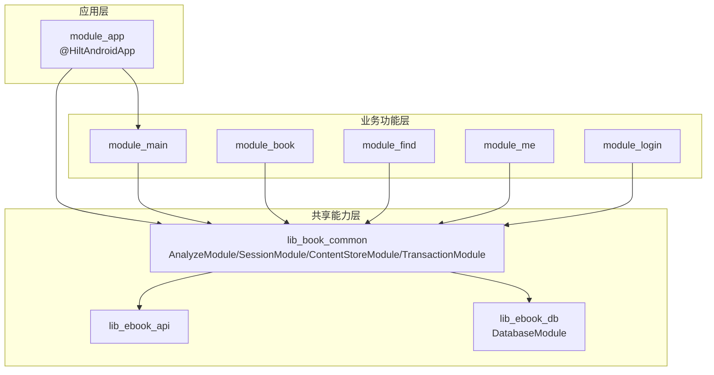
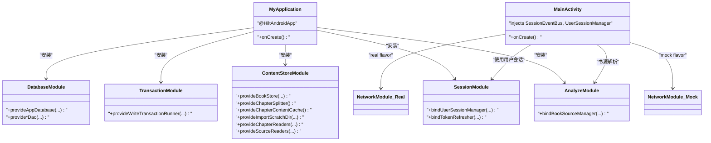
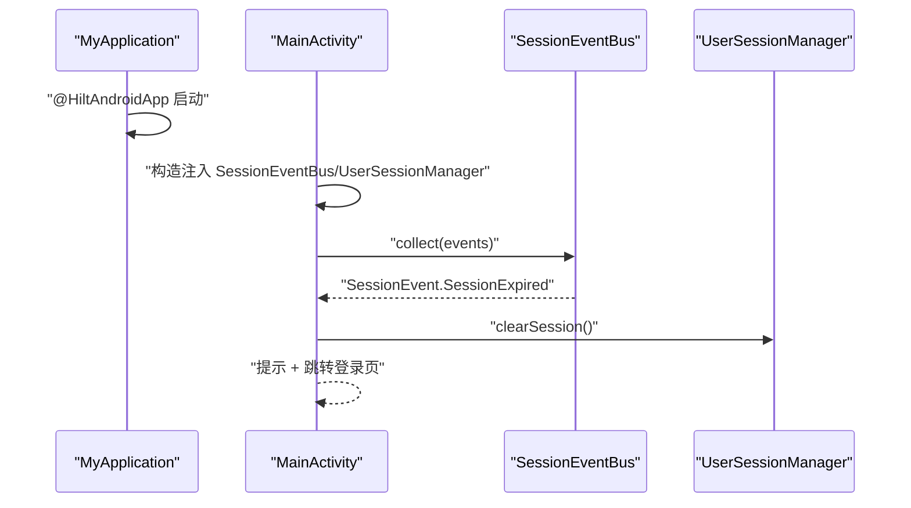
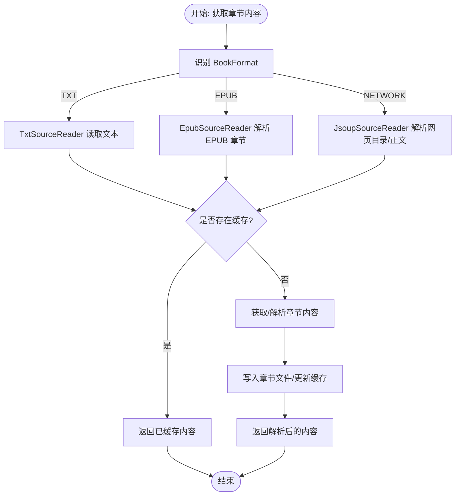
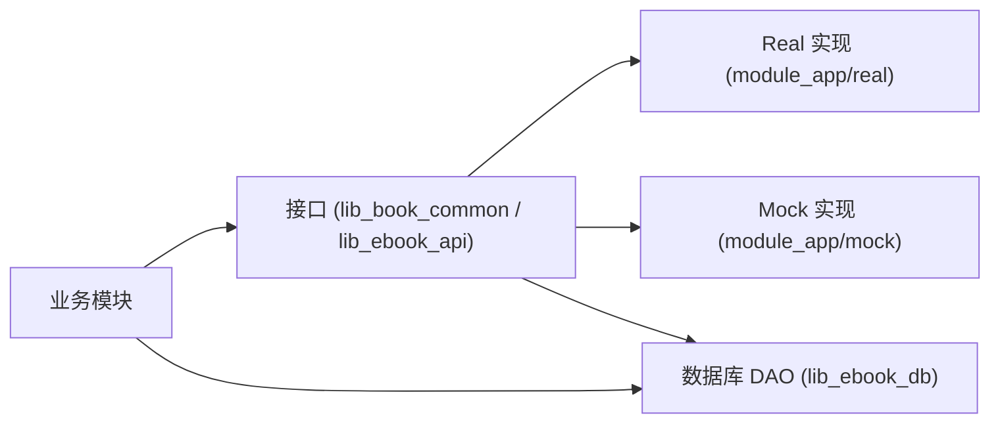

# 依赖注入与模块装配

<cite>
**本文引用的文件**   
- [MyApplication.kt](file://module_app/src/main/java/com/ebook/MyApplication.kt)
- [HiltConventionPlugin.kt](file://build-logic/convention/src/main/kotlin/com/xrn1997/convention/HiltConventionPlugin.kt)
- [libs.versions.toml](file://gradle/libs.versions.toml)
- [AnalyzeModule.kt](file://lib_book_common/src/main/java/com/ebook/common/di/AnalyzeModule.kt)
- [SessionModule.kt](file://lib_book_common/src/main/java/com/ebook/common/di/SessionModule.kt)
- [ContentStoreModule.kt](file://lib_book_common/src/main/java/com/ebook/common/di/ContentStoreModule.kt)
- [TransactionModule.kt](file://lib_book_common/src/main/java/com/ebook/common/di/TransactionModule.kt)
- [DatabaseModule.kt](file://lib_ebook_db/src/main/java/com/ebook/db\di\DatabaseModule.kt)
- [NetworkModule（mock flavor）.kt](file://module_app/src/mock/java/com/ebook/di/NetworkModule.kt)
- [NetworkModule（real flavor）.kt](file://module_app/src/real/java/com/ebook/di/NetworkModule.kt)
- [MainActivity.kt](file://module_main/src/main/java/com/ebook/main/MainActivity.kt)
</cite>

## 目录
1. [简介](#简介)
2. [项目结构](#项目结构)
3. [核心组件](#核心组件)
4. [架构总览](#架构总览)
5. [详细组件分析](#详细组件分析)
6. [依赖关系分析](#依赖关系分析)
7. [性能注意事项](#性能注意事项)
8. [故障排查指南](#故障排查指南)
9. [结论](#结论)
10. [附录：构建与测试配置示例](#附录构建与测试配置示例)

## 简介
本章节面向Android小说阅读器的多模块工程，系统性说明 Hilt 在整个项目中的应用方式、模块级依赖装配策略、构建时 KSP/约定插件配置、以及通过 product flavor 与 source set 实现运行时可替换的 Provider 注入方案。目标是让读者既能从宏观把握工程分层与依赖边界，也能在微观上按图索骥完成新增模块装配与问题定位。

## 项目结构
工程采用严格的分层与多模块组织：功能业务模块（如 module_main / module_book / module_find / module_me / module_login）统一依赖 lib_book_common，后者进一步依赖 lib_ebook_api 与 lib_ebook_db。Hilt 被集中应用在应用入口启用，并在各模块中通过 @Module + @InstallIn(SingletonComponent::class) 进行解耦的提供与绑定；同时借助 build-logic 约定插件统一管理 Hilt 插件及 KSP 相关设置。

图示来源
- [MyApplication.kt:1-15](file://module_app/src/main/java/com/ebook/MyApplication.kt#L1-L15)
- [AnalyzeModule.kt:1-18](file://lib_book_common/src/main/java/com/ebook/common/di/AnalyzeModule.kt#L1-L18)
- [SessionModule.kt:1-37](file://lib_book_common/src/main/java/com/ebook/common/di/SessionModule.kt#L1-L37)
- [ContentStoreModule.kt:21-87](file://lib_book_common/src/main/java/com/ebook/common/di/ContentStoreModule.kt#L21-L87)
- [TransactionModule.kt:12-24](file://lib_book_common/src/main/java/com/ebook/common/di/TransactionModule.kt#L12-L24)
- [DatabaseModule.kt:23-124](file://lib_ebook_db/src/main/java/com/ebook/db\di\DatabaseModule.kt#L23-L124)

节来源
- [MyApplication.kt:8-14](file://module_app/src/main/java/com/ebook/MyApplication.kt#L8-L14)
- [libs.versions.toml:35-39](file://gradle/libs.versions.toml#L35-L39)

## 核心组件
- 应用级 Hilt 根组件：通过 Application 类注解开启 Hilt，并承载整个生命周期内的单例范围。
- 模块级装配点：以 @Module 标注并声明安装到 @SingletonComponent，使用 @Provides 创建对象或用 @Binds 进行接口到实现的映射。
- 跨模块 Provider 注入：以接口作为抽象类型暴露能力，由不同 product flavor（或 source set）提供具体实现，便于在无后端条件下开发调试。

节来源
- [AnalyzeModule.kt:11-18](file://lib_book_common/src/main/java/com/ebook/common/di/AnalyzeModule.kt#L11-L18)
- [SessionModule.kt:22-37](file://lib_book_common/src/main/java/com/ebook/common/di/SessionModule.kt#L22-L37)
- [ContentStoreModule.kt:27-87](file://lib_book_common/src/main/java/com/ebook/common/di/ContentStoreModule.kt#L27-L87)
- [TransactionModule.kt:13-24](file://lib_book_common/src/main/java/com/ebook/common/di/TransactionModule.kt#L13-L24)
- [NetworkModule（mock flavor）.kt:14-37](file://module_app/src/mock/java/com/ebook/di/NetworkModule.kt#L14-L37)
- [NetworkModule（real flavor）.kt:14-35](file://module_app/src/real/java/com/ebook/di/NetworkModule.kt#L14-L35)

## 架构总览
下图展示 Hilt 在应用启动与依赖注入过程中的关键角色关系：Application 负责激活 Hilt，核心领域模块定义接口并通过各自 Module 绑定实现；数据库模块集中提供 Room 数据库实例及其 DAO；网络层通过 flavor 源集切换 mock/real 实现。

图示来源
- [MyApplication.kt:8-14](file://module_app/src/main/java/com/ebook/MyApplication.kt#L8-L14)
- [AnalyzeModule.kt:11-18](file://lib_book_common/src/main/java/com/ebook/common/di/AnalyzeModule.kt#L11-L18)
- [SessionModule.kt:22-37](file://lib_book_common/src/main/java/com/ebook/common/di/SessionModule.kt#L22-L37)
- [ContentStoreModule.kt:27-87](file://lib_book_common/src/main/java/com/ebook/common/di/ContentStoreModule.kt#L27-L87)
- [TransactionModule.kt:13-24](file://lib_book_common/src/main/java/com/ebook/common/di/TransactionModule.kt#L13-L24)
- [DatabaseModule.kt:23-124](file://lib_ebook_db/src/main/java/com/ebook/db\di\DatabaseModule.kt#L23-L124)
- [MainActivity.kt:57-80](file://module_main/src/main/java/com/ebook/main/MainActivity.kt#L57-L80)
- [NetworkModule（mock flavor）.kt:14-37](file://module_app/src/mock/java/com/ebook/di/NetworkModule.kt#L14-L37)
- [NetworkModule（real flavor）.kt:14-35](file://module_app/src/real/java/com/ebook/di/NetworkModule.kt#L14-L35)

## 详细组件分析

### Hilt 基础配置与使用模式
- 应用级根组件：Application 类通过 @HiltAndroidApp 启用 Hilt 编译期处理与运行时代码生成，作为依赖容器起点。
- ViewModel 与 Activity 注入：Activity 使用 @AndroidEntryPoint，ViewModel 使用 @HiltViewModel，配合构造参数注入，避免手动管理生命周期与内存泄露。
- 作用域：多数基础设施组件声明为 @Singleton，保证全局唯一。

节来源
- [MyApplication.kt:8-14](file://module_app/src/main/java/com/ebook/MyApplication.kt#L8-L14)
- [MainActivity.kt:57-80](file://module_main/src/main/java/com/ebook/main/MainActivity.kt#L57-L80)

### 领域模块装配（lib_book_common）
- 分析模块（AnalyzeModule）：使用 @Binds 将解析器接口绑定到实现，限定为 Singleton。
- 会话模块（SessionModule）：将会话管理器与 Token 刷新接口的实现绑定，满足跨层依赖。
- 内容存储模块（ContentStoreModule）：提供 BookStore、章节拆分器、章节内容缓存等基础设施，并提供按格式路由的 reader map，使仓库层代码零分支扩展新格式。
- 事务模块（TransactionModule）：封装 Room 写事务执行器，向调用方屏蔽底层细节。

节来源
- [AnalyzeModule.kt:11-18](file://lib_book_common/src/main/java/com/ebook/common/di/AnalyzeModule.kt#L11-L18)
- [SessionModule.kt:22-37](file://lib_book_common/src/main/java/com/ebook/common/di/SessionModule.kt#L22-L37)
- [ContentStoreModule.kt:27-87](file://lib_book_common/src/main/java/com/ebook/common/di/ContentStoreModule.kt#L27-L87)
- [TransactionModule.kt:13-24](file://lib_book_common/src/main/java/com/ebook/common/di/TransactionModule.kt#L13-L24)

### 数据层装配（lib_ebook_db）
- 数据库模块（DatabaseModule）：提供 AppDatabase 实例（含迁移链）、以及各 DAO 的单例提供者，确保数据库访问的统一入口。

节来源
- [DatabaseModule.kt:23-124](file://lib_ebook_db/src/main/java/com/ebook/db\di\DatabaseModule.kt#L23-L124)

### 跨模块 Provider 的可插拔注入
- 网络层在 app 模块下通过 product flavor 区分：
  - mock flavor 下的 NetworkModule 将所有数据源接口绑定到测试实现，无需后端即可跑通全链路。
  - real flavor 下的 NetworkModule 绑定真实后端实现，并包含版本更新检查的网络数据源。
- 该设计使得业务模块仅依赖接口，具体实现根据构建 flavor 自动选择，降低耦合。

节来源
- [NetworkModule（mock flavor）.kt:14-37](file://module_app/src/mock/java/com/ebook/di/NetworkModule.kt#L14-L37)
- [NetworkModule（real flavor）.kt:14-35](file://module_app/src/real/java/com/ebook/di/NetworkModule.kt#L14-L35)

### 典型用例流程：主页面订阅会话过期事件并处置

图示来源
- [MyApplication.kt:8-14](file://module_app/src/main/java/com/ebook/MyApplication.kt#L8-L14)
- [MainActivity.kt:57-80](file://module_main/src/main/java/com/ebook/main/MainActivity.kt#L57-L80)

### 导入期正文读取分发逻辑（基于 ContentStoreModule）

图示来源
- [ContentStoreModule.kt:60-87](file://lib_book_common/src/main/java/com/ebook/common/di/ContentStoreModule.kt#L60-L87)

## 依赖关系分析
- 分层清晰：业务模块不直接耦合实现细节，所有基础设施通过接口暴露并由 Hilt 模块提供。
- 循环依赖规避：各模块通过 @Binds 对接口进行绑定，依赖方向自底向上，避免环。
- 外部集成点：Room 数据库、OkHttp/Retrofit 网络栈、TheRouter 等第三方组件集中在相应模块中提供。
- Flavor 隔离：同一接口在不同 flavor 下绑定不同实现，编译期即确定，零运行时代码分支。

图示来源
- [NetworkModule（mock flavor）.kt:14-37](file://module_app/src/mock/java/com/ebook/di/NetworkModule.kt#L14-L37)
- [NetworkModule（real flavor）.kt:14-35](file://module_app/src/real/java/com/ebook/di/NetworkModule.kt#L14-L35)
- [DatabaseModule.kt:91-124](file://lib_ebook_db/src/main/java/com/ebook/db\di\DatabaseModule.kt#L91-L124)

节来源
- [AnalyzeModule.kt:11-18](file://lib_book_common/src/main/java/com/ebook/common/di/AnalyzeModule.kt#L11-L18)
- [SessionModule.kt:22-37](file://lib_book_common/src/main/java/com/ebook/common/di/SessionModule.kt#L22-L37)
- [ContentStoreModule.kt:27-87](file://lib_book_common/src/main/java/com/ebook/common/di/ContentStoreModule.kt#L27-L87)
- [NetworkModule（mock flavor）.kt:14-37](file://module_app/src/mock/java/com/ebook/di/NetworkModule.kt#L14-L37)
- [NetworkModule（real flavor）.kt:14-35](file://module_app/src/real/java/com/ebook/di/NetworkModule.kt#L14-L35)
- [DatabaseModule.kt:23-124](file://lib_ebook_db/src/main/java/com/ebook/db\di\DatabaseModule.kt#L23-L124)

## 性能注意事项
- 单例范围合理：大部分基础设施使用 @Singleton，避免重复创建带来的开销。但注意不要将状态对象错误设置为单例导致并发问题。
- 懒加载与按需解析：内容读取按格式分发，仅在需要时才触发对应 Reader，有利于延迟与缓存命中。
- 数据库事务封装：事务执行集中在单一实现，避免分散的事务管理与资源泄漏风险。

[本节为通用指导，不直接分析特定源码文件]

## 故障排查指南
- 未识别的依赖：确认对应模块是否安装到 @SingletonComponent，且方法签名正确。
- 循环依赖：若出现 Dagger 编译错误提示循环依赖，应引入中间接口或重构职责边界。
- Flavor 绑定缺失：当某个 flavor 的 NetworkModule 未覆盖接口时，会在构建或运行时报 MissingBinding 错误。请确保 mock/real flavor 均有完整绑定。
- 注入位置无效：确保持有注入点的类已被 Hilt 扫描到（例如 Activity 需 @AndroidEntryPoint，ViewModel 需 @HiltViewModel）。
- 日志定位：统一通过 lib_common 提供的 Logger 输出关键上下文，以便定位注入失败与数据流问题。

节来源
- [SessionModule.kt:22-37](file://lib_book_common/src/main/java/com/ebook/common/di/SessionModule.kt#L22-L37)
- [NetworkModule（mock flavor）.kt:14-37](file://module_app/src/mock/java/com/ebook/di/NetworkModule.kt#L14-L37)
- [NetworkModule（real flavor）.kt:14-35](file://module_app/src/real/java/com/ebook/di/NetworkModule.kt#L14-L35)

## 结论
本项目以 Hilt 为核心实现解耦的依赖注入体系：通过在 Application 端启用 Hilt、在各模块内用 @Module 明确提供/绑定对象、借助 flavor 与 source set 实现 Provider 的运行时切换。结合统一的构建约定插件与版本目录，保证了依赖管理的清晰度与一致性。按照本文的分层思路与示例进行新增模块装配时，可显著提升可测性与可维护性。

[本节为总结性内容，不直接分析特定源码文件]

## 附录：构建与测试配置示例

### Gradle 约定插件中的 Hilt 配置要点
- 在项目 build-logic 的约定插件中添加 Hilt Android 与 Compiler 依赖，保持统一版本与 Kotlin/KSP 兼容。
- 通过插件统一应用 Hilt 相关任务，减少各模块重复配置，提升可维护性。

节来源
- [HiltConventionPlugin.kt](file://build-logic/convention/src/main/kotlin/com/xrn1997/convention/HiltConventionPlugin.kt)

### KSP 注解处理与版本对齐
- Hilt 2.60.1 配合 KSP 2.3.10，需确保各模块编译工具链一致，否则可能出现生成代码与 Kotlin 版本不兼容的问题。
- 建议在版本目录集中管理 dagger/hilt/ksp 的版本引用，避免碎片化。

节来源
- [libs.versions.toml:35-39](file://gradle/libs.versions.toml#L35-L39)
- [libs.versions.toml:156-159](file://gradle/libs.versions.toml#L156-L159)

### 多 Flavor 环境下的依赖差异化配置
- 在 module_app 下分别提供 src/mock 与 src/real 两个源集，各自放置同名 NetworkModule，实现接口到实现的不同绑定。
- 业务模块只依赖接口，因此可无缝切换，实现“无后端”开发与线上稳定版本的同一套 UI/逻辑。

节来源
- [NetworkModule（mock flavor）.kt:14-37](file://module_app/src/mock/java/com/ebook/di/NetworkModule.kt#L14-L37)
- [NetworkModule（real flavor）.kt:14-35](file://module_app/src/real/java/com/ebook/di/NetworkModule.kt#L14-L35)