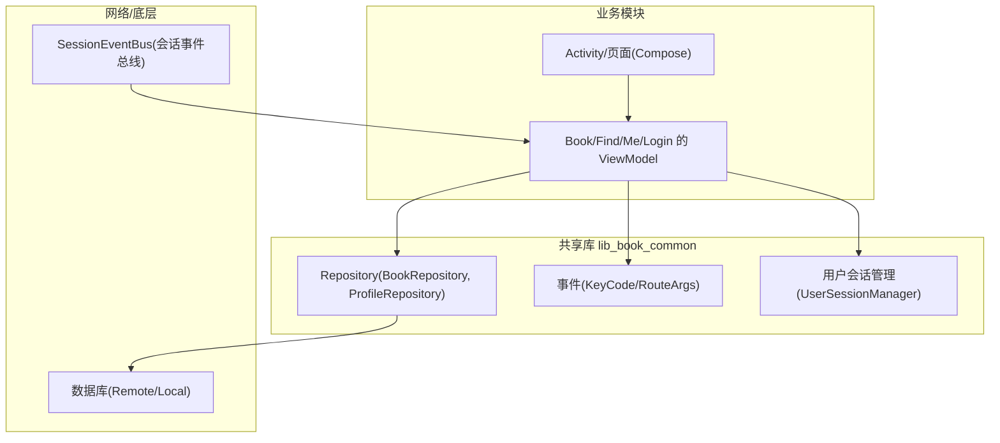
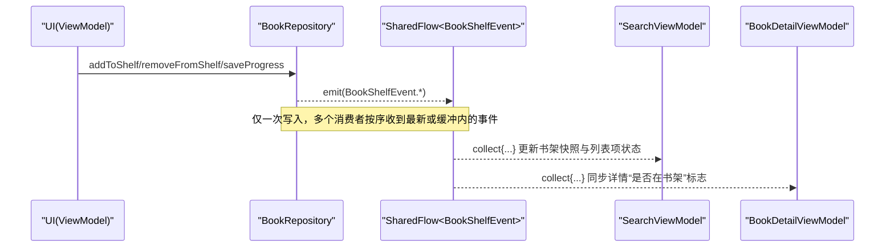
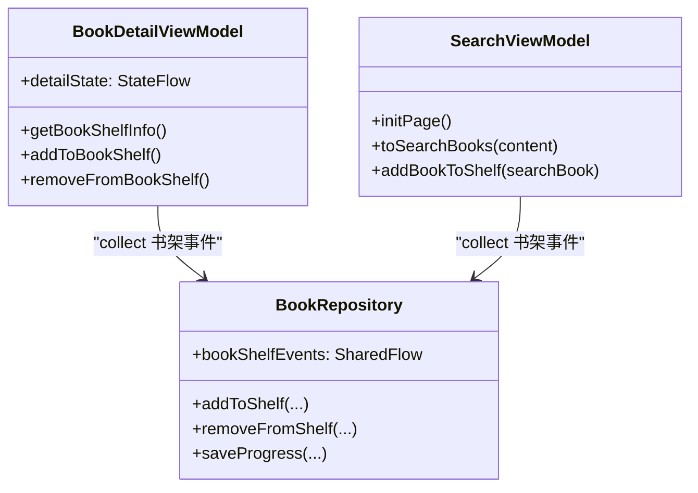
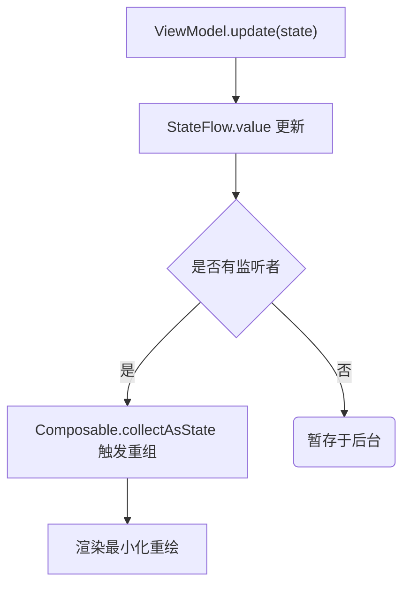
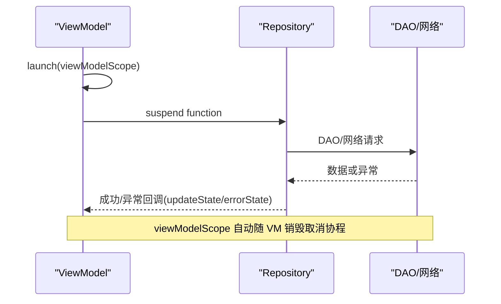
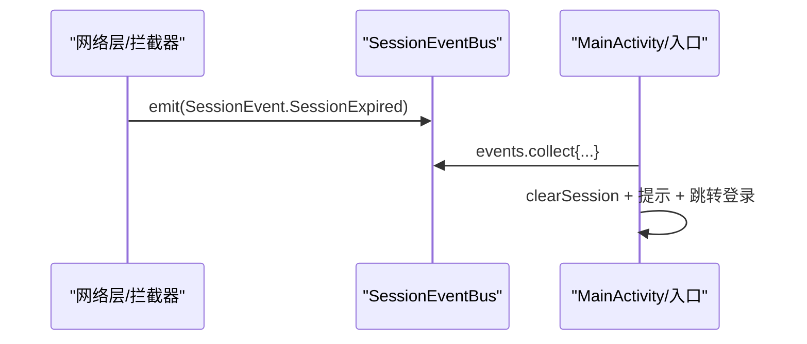
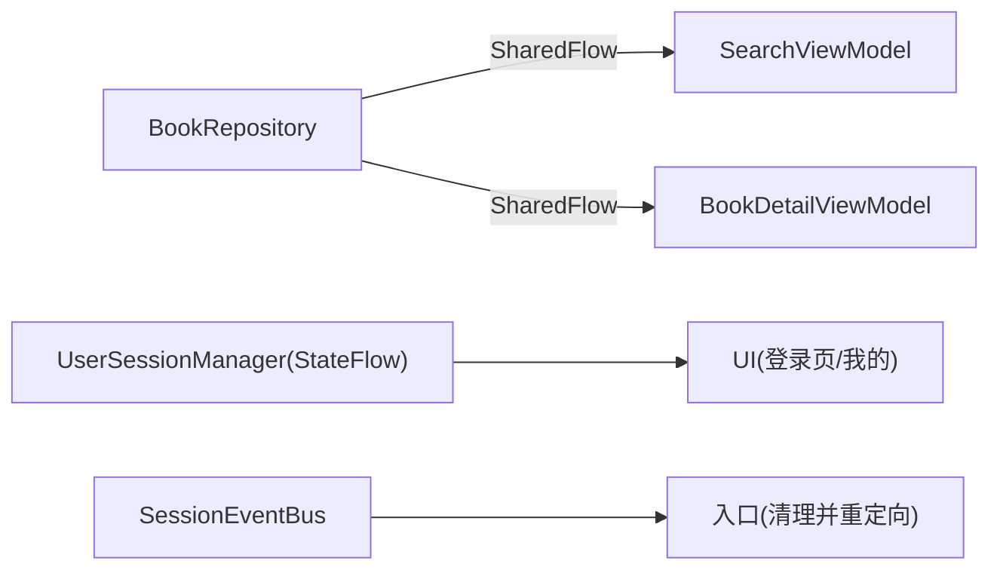

# 数据流与状态管理

<cite>
**本文件引用的源码路径**
- [lib_book_common/src/main/java/com/ebook/common/event/KeyCode.kt](file://lib_book_common/src/main/java/com/ebook/common/event/KeyCode.kt)
- [lib_book_common/src/main/java/com/ebook/common/event/RouteArgs.kt](file://lib_book_common/src/main/java/com/ebook/common/event/RouteArgs.kt)
- [lib_book_common/src/main/java/com/ebook/common/repository/BookRepository.kt](file://lib_book_common/src/main/java/com/ebook/common/repository/BookRepository.kt)
- [lib_ebook_api/src/main/java/com/ebook/api/auth/SessionEventBus.kt](file://lib_ebook_api/src/main/java/com/ebook/api/auth/SessionEventBus.kt)
- [lib_book_common/src/main/java/com/ebook/common/domain/UserSessionManager.kt](file://lib_book_common/src/main/java/com/ebook/common/domain/UserSessionManager.kt)
- [lib_book_common/src/main/java/com/ebook/common/domain/AndroidUserSessionManager.kt](file://lib_book_common/src/main/java/com/ebook/common/domain/AndroidUserSessionManager.kt)
- [lib_book_common/src/main/java/com/ebook/common/repository/ProfileRepository.kt](file://lib_book_common/src/main/java/com/ebook/common/repository/ProfileRepository.kt)
- [module_book/src/main/java/com/ebook/book/mvvm/viewmodel/BookDetailViewModel.kt](file://module_book/src/main/java/com/ebook/book/mvvm/viewmodel/BookDetailViewModel.kt)
- [module_find/src/main/java/com/ebook/find/mvvm/viewmodel/SearchViewModel.kt](file://module_find/src/main/java/com/ebook/find/mvvm/viewmodel/SearchViewModel.kt)
</cite>

## 目录
1. [简介](#简介)
2. [项目结构与数据流总览](#项目结构与数据流总览)
3. [核心组件](#核心组件)
4. [架构总览](#架构总览)
5. [关键组件深度分析](#关键组件深度分析)
6. [依赖关系分析](#依赖关系分析)
7. [性能考虑](#性能考虑)
8. [故障诊断指南](#故障诊断指南)
9. [结论](#结论)
10. [附录：使用示例指引](#附录：使用示例指引)

## 简介
本文面向现代 Android 开发中的 Flow、StateFlow、SharedFlow、Channel 等异步数据流工具，结合本项目的 MVVM + Coroutines 体系，说明事件系统与路由参数约定、跨模块通信机制、状态管理的最佳实践，以及如何通过协程进行并发控制、取消与异常处理。所有设计均源自仓库现有实现，帮助读者在保持代码一致性的同时避免内存泄漏与状态不一致等常见问题。

## 项目结构与数据流总览
本项目采用模块化分层：业务模块（module_*）依赖共享库 lib_book_common，再依赖网络层 lib_ebook_api 与数据库 lib_ebook_db。数据流遵循 Model → Repository → ViewModel → View 的单向流向；事件通过 SharedFlow 广播，UI 通过 StateFlow 暴露当前状态被 Compose 订阅。

无直接图示来源（高层概览示意）

## 核心组件
- 事件与路由
  - KeyCode：集中定义跨模块路由常量与跳转路径，作为 TheRouter 的统一键源，避免字符串常量散落导致的运行时静默丢失。
  - RouteArgs：统一声明跨模块 Bundle key（如书籍、章节、评论聚合键），确保发送方与接收方使用同一常量，提升可维护性。
- 仓库与事件总线
  - BookRepository：封装书架 CRUD 与章节读取，并以 SharedFlow 发布书架事件（添加/移除/进度更新）。
  - SessionEventBus：会话级全局事件（如 Token 刷新失败导致会话过期），用于上层统一收口处置。
- 用户会话
  - UserSessionManager：抽象认证状态的唯一 seam（登录态、当前用户、双 token 轮换）。
  - AndroidUserSessionManager：StateFlow 暴露登录态与当前用户，并负责 SP 持久化与清理三处镜像。
- 用户资料
  - ProfileRepository：头像、昵称以 StateFlow 暴露，变更时自动驱动 UI；清会话时由会话管理器联动重置。

**小节来源**
- [lib_book_common/src/main/java/com/ebook/common/event/KeyCode.kt:1-98](file://lib_book_common/src/main/java/com/ebook/common/event/KeyCode.kt#L1-L98)
- [lib_book_common/src/main/java/com/ebook/common/event/RouteArgs.kt:1-34](file://lib_book_common/src/main/java/com/ebook/common/event/RouteArgs.kt#L1-L34)
- [lib_book_common/src/main/java/com/ebook/common/repository/BookRepository.kt:30-161](file://lib_book_common/src/main/java/com/ebook/common/repository/BookRepository.kt#L30-L161)
- [lib_ebook_api/src/main/java/com/ebook/api/auth/SessionEventBus.kt:1-44](file://lib_ebook_api/src/main/java/com/ebook/api/auth/SessionEventBus.kt#L1-L44)
- [lib_book_common/src/main/java/com/ebook/common/domain/UserSessionManager.kt:1-62](file://lib_book_common/src/main/java/com/ebook/common/domain/UserSessionManager.kt#L1-L62)
- [lib_book_common/src/main/java/com/ebook/common/domain/AndroidUserSessionManager.kt:17-161](file://lib_book_common/src/main/java/com/ebook/common/domain/AndroidUserSessionManager.kt#L17-L161)
- [lib_book_common/src/main/java/com/ebook/common/repository/ProfileRepository.kt:12-54](file://lib_book_common/src/main/java/com/ebook/common/repository/ProfileRepository.kt#L12-L54)

## 架构总览
下图展示了“操作 → 事件 → 状态”的整体链路，以及事件在跨模块之间的传播方式。

**图示来源**
- [lib_book_common/src/main/java/com/ebook/common/repository/BookRepository.kt:50-161](file://lib_book_common/src/main/java/com/ebook/common/repository/BookRepository.kt#L50-L161)
- [module_find/src/main/java/com/ebook/find/mvvm/viewmodel/SearchViewModel.kt:59-75](file://module_find/src/main/java/com/ebook/find/mvvm/viewmodel/SearchViewModel.kt#L59-L75)
- [module_book/src/main/java/com/ebook/book/mvvm/viewmodel/BookDetailViewModel.kt:65-88](file://module_book/src/main/java/com/ebook/book/mvvm/viewmodel/BookDetailViewModel.kt#L65-L88)

## 关键组件深度分析

### 1) Flow 在现代 Android 中的分工
- StateFlow（单值有界流）：适合“UI 状态”，新订阅者立即收到当前值，生命周期安全且线程友好。
  - 用法示例引用：登录态与当前用户的 StateFlow；个人资料头像/昵称的 StateFlow。
- SharedFlow（多播一次性/多次事件流）：适合“事件总线”，多个订阅者可消费同一事件，适合跨模块通知。
  - 用法示例引用：书架事件 BookShelfEvent；搜索历史结果 event。
- Channel（一次性命令通道，项目在 VM 基类中统一提供 sendToast/sendNavigate）：适用于需要“单次执行”的命令型消息。
  - 参考：ViewModel 内部命令下发给 Activity 的消息通道（如 Toast、返回、导航）。

实践要点
- 将 UI 状态收敛到单个 StateFlow 对象，避免分散字段导致重组失效（详情页即为此改进点）。
- 用 SharedFlow 替代旧 RxBus 模式，避免重复收集与热启动时的重复累积问题。

**小节来源**
- [lib_book_common/src/main/java/com/ebook/common/domain/UserSessionManager.kt:13-23](file://lib_book_common/src/main/java/com/ebook/common/domain/UserSessionManager.kt#L13-L23)
- [lib_book_common/src/main/java/com/ebook/common/repository/ProfileRepository.kt:20-38](file://lib_book_common/src/main/java/com/ebook/common/repository/ProfileRepository.kt#L20-L38)
- [lib_book_common/src/main/java/com/ebook/common/repository/BookRepository.kt:50-53](file://lib_book_common/src/main/java/com/ebook/common/repository/BookRepository.kt#L50-L53)
- [module_book/src/main/java/com/ebook/book/mvvm/viewmodel/BookDetailViewModel.kt:22-57](file://module_book/src/main/java/com/ebook/book/mvvm/viewmodel/BookDetailViewModel.kt#L22-L57)

### 2) 事件系统设计与跨模块通信
- 路由键集中：KeyCode 将所有模块的路径定义为常量（Main、Login、Book、Find、Me），配合 TheRouter 做跨模块导航，编译期不报错但运行期找不到占位会静默丢失，因此独立模式下需补充占位路由。
- 传参 Key 收敛：RouteArgs 集中 Bundle key，避免跨模块写字面量造成的 key 不同步。
- 事件广播：BookRepository.bookShelfEvents 以 SharedFlow 暴露，任意 ViewModel 可在 viewModelScope 中 collect，旋转重建自然幂等。

**图示来源**
- [lib_book_common/src/main/java/com/ebook/common/repository/BookRepository.kt:30-161](file://lib_book_common/src/main/java/com/ebook/common/repository/BookRepository.kt#L30-L161)
- [module_book/src/main/java/com/ebook/book/mvvm/viewmodel/BookDetailViewModel.kt:42-88](file://module_book/src/main/java/com/ebook/book/mvvm/viewmodel/BookDetailViewModel.kt#L42-L88)
- [module_find/src/main/java/com/ebook/find/mvvm/viewmodel/SearchViewModel.kt:30-75](file://module_find/src/main/java/com/ebook/find/mvvm/viewmodel/SearchViewModel.kt#L30-L75)

**小节来源**
- [lib_book_common/src/main/java/com/ebook/common/event/KeyCode.kt:4-98](file://lib_book_common/src/main/java/com/ebook/common/event/KeyCode.kt#L4-L98)
- [lib_book_common/src/main/java/com/ebook/common/event/RouteArgs.kt:10-33](file://lib_book_common/src/main/java/com/ebook/common/event/RouteArgs.kt#L10-L33)
- [lib_book_common/src/main/java/com/ebook/common/repository/BookRepository.kt:50-161](file://lib_book_common/src/main/java/com/ebook/common/repository/BookRepository.kt#L50-L161)

### 3) 状态管理最佳实践
- 不可变状态设计：UI 状态以数据类表示（如 BookDetailUiState），通过 StateFlow 暴露，修改走 update/copy，保证原子性与可预测性。
- 状态派生计算：列表项的状态根据书架快照与事件实时推导，避免冗余状态。
- 状态持久化策略：会话相关（登录态、用户信息、refresh token）通过 UserSessionManager + SP 持久化；用户资料（头像/昵称）由 ProfileRepository 维护，并在清会话时联动重置。

**小节来源**
- [module_book/src/main/java/com/ebook/book/mvvm/viewmodel/BookDetailViewModel.kt:22-57](file://module_book/src/main/java/com/ebook/book/mvvm/viewmodel/BookDetailViewModel.kt#L22-L57)
- [lib_book_common/src/main/java/com/ebook/common/domain/AndroidUserSessionManager.kt:39-43](file://lib_book_common/src/main/java/com/ebook/common/domain/AndroidUserSessionManager.kt#L39-L43)
- [lib_book_common/src/main/java/com/ebook/common/repository/ProfileRepository.kt:20-54](file://lib_book_common/src/main/java/com/ebook/common/repository/ProfileRepository.kt#L20-L54)

### 4) 协程在异步数据处理中的应用
- 并发控制：Repository 的 IO 任务使用 withContext(Dispatchers.IO) 切换执行线程；分页搜索通过 BaseRefreshViewModel 控制加载与更多判断。
- 取消机制：所有 UI 相关长耗时任务在 viewModelScope 或 lifecycleScope 中启动，随生命周期销毁而自动取消，避免内存泄漏。
- 异常处理：网络/DB 异常捕获后更新错误态或提示，保持视图稳定。

**小节来源**
- [module_book/src/main/java/com/ebook/book/mvvm/viewmodel/BookDetailViewModel.kt:101-148](file://module_book/src/main/java/com/ebook/book/mvvm/viewmodel/BookDetailViewModel.kt#L101-L148)
- [module_find/src/main/java/com/ebook/find/mvvm/viewmodel/SearchViewModel.kt:125-167](file://module_find/src/main/java/com/ebook/find/mvvm/viewmodel/SearchViewModel.kt#L125-L167)
- [lib_book_common/src/main/java/com/ebook/common/repository/BookRepository.kt:56-161](file://lib_book_common/src/main/java/com/ebook/common/repository/BookRepository.kt#L56-L161)

### 5) 会话事件（Token 刷新失败）与上层统一处置
SessionEventBus 以 SharedFlow 暴露单一会话事件，网络层在 refresh token 刷新失败时 emit，主流程订阅并执行“清会话 + 提示 + 跳转登录”的统一策略。

**图示来源**
- [lib_ebook_api/src/main/java/com/ebook/api/auth/SessionEventBus.kt:9-44](file://lib_ebook_api/src/main/java/com/ebook/api/auth/SessionEventBus.kt#L9-L44)

**小节来源**
- [lib_ebook_api/src/main/java/com/ebook/api/auth/SessionEventBus.kt:10-44](file://lib_ebook_api/src/main/java/com/ebook/api/auth/SessionEventBus.kt#L10-L44)

## 依赖关系分析
- 解耦与单一职责：Repository 专注数据与事件，ViewModel 专注状态编排与交互，View 只消费 StateFlow 渲染。
- 事件单向传播：仓库发射事件 → 各 ViewModel 订阅 → 更新各自 StateFlow → UI 重组。
- 会话状态收敛：UserSessionManager 为唯一 seam，避免多处写登录态造成不一致。

**小节来源**
- [lib_book_common/src/main/java/com/ebook/common/repository/BookRepository.kt:50-161](file://lib_book_common/src/main/java/com/ebook/common/repository/BookRepository.kt#L50-L161)
- [lib_book_common/src/main/java/com/ebook/common/domain/UserSessionManager.kt:13-23](file://lib_book_common/src/main/java/com/ebook/common/domain/UserSessionManager.kt#L13-L23)
- [module_find/src/main/java/com/ebook/find/mvvm/viewmodel/SearchViewModel.kt:59-75](file://module_find/src/main/java/com/ebook/find/mvvm/viewmodel/SearchViewModel.kt#L59-L75)
- [module_book/src/main/java/com/ebook/book/mvvm/viewmodel/BookDetailViewModel.kt:65-88](file://module_book/src/main/java/com/ebook/book/mvvm/viewmodel/BookDetailViewModel.kt#L65-L88)

## 性能考虑
- 事件缓冲大小合理设置：SharedFlow 使用适当 extraBufferCapacity，兼顾吞吐与内存。
- 列表去重与合并：搜索结果与分类页使用 distinctBy/mergeBookPage 去重，避免重复 item 引发 UI 异常。
- 懒加载与条件读取：仅在必要时发起网络或磁盘 IO，减少无效计算。
- Flow 链式操作尽量简单清晰，避免过深链或频繁中间集合创建。

[本节为通用性能指导]

## 故障诊断指南
- 事件丢失：检查 SharedFlow 缓冲是否过小、是否存在订阅不及时；确保在 viewModelScope 启动 collect。
- 列表重复项：确认列表 item key 唯一（noteUrl），并使用去重逻辑。
- 状态未更新：确认 UI 订阅的是 StateFlow 的最新值，而非旧快照；查看详情页 StateFlow 的更新路径。
- 会话残留：清会话必须调用 UserSessionManager.clearSession，它会一并清除三处镜像（SP/内存/ProfileRepository），避免“已登出仍显示用户信息”。
- Token 刷新失败：监听 SessionEventBus.events，按统一策略处理。

**小节来源**
- [lib_book_common/src/main/java/com/ebook/common/repository/BookRepository.kt:50-53](file://lib_book_common/src/main/java/com/ebook/common/repository/BookRepository.kt#L50-L53)
- [module_find/src/main/java/com/ebook/find/mvvm/viewmodel/SearchViewModel.kt:142-167](file://module_find/src/main/java/com/ebook/find/mvvm/viewmodel/SearchViewModel.kt#L142-L167)
- [lib_book_common/src/main/java/com/ebook/common/domain/AndroidUserSessionManager.kt:100-133](file://lib_book_common/src/main/java/com/ebook/common/domain/AndroidUserSessionManager.kt#L100-L133)
- [lib_ebook_api/src/main/java/com/ebook/api/auth/SessionEventBus.kt:30-44](file://lib_ebook_api/src/main/java/com/ebook/api/auth/SessionEventBus.kt#L30-L44)

## 结论
本项目以 Flow 为核心构建响应式数据流：StateFlow 管理 UI 状态，SharedFlow 承担事件总线，协程保障生命周期安全的异步执行。通过集中化的路由键与传参 key、统一的会话管理与单一事实源，形成了清晰、可扩展且稳定的数据流与状态管理体系。遵循本文的最佳实践，可以有效避免内存泄漏、状态不一致等问题，并提升可维护性与测试性。

## 附录：使用示例指引
以下示例以“文件+行号范围”形式给出，请根据路径定位查看具体实现，不在本文中直接粘贴代码片段。

- StateFlow 用于 UI 状态（详情页）
  - 定义与暴露：[module_book/src/main/java/com/ebook/book/mvvm/viewmodel/BookDetailViewModel.kt:22-57](file://module_book/src/main/java/com/ebook/book/mvvm/viewmodel/BookDetailViewModel.kt#L22-L57)
  - 状态更新与事件订阅：[module_book/src/main/java/com/ebook/book/mvvm/viewmodel/BookDetailViewModel.kt:65-88](file://module_book/src/main/java/com/ebook/book/mvvm/viewmodel/BookDetailViewModel.kt#L65-L88)
  - 拉取详情与错误态处理：[module_book/src/main/java/com/ebook/book/mvvm/viewmodel/BookDetailViewModel.kt:101-148](file://module_book/src/main/java/com/ebook/book/mvvm/viewmodel/BookDetailViewModel.kt#L101-L148)

- SharedFlow 作为事件总线（书架事件）
  - 事件定义与发射：[lib_book_common/src/main/java/com/ebook/common/repository/BookRepository.kt:50-161](file://lib_book_common/src/main/java/com/ebook/common/repository/BookRepository.kt#L50-L161)
  - 订阅端（搜索页）：[module_find/src/main/java/com/ebook/find/mvvm/viewmodel/SearchViewModel.kt:59-75](file://module_find/src/main/java/com/ebook/find/mvvm/viewmodel/SearchViewModel.kt#L59-L75)
  - 订阅端（详情页）：[module_book/src/main/java/com/ebook/book/mvvm/viewmodel/BookDetailViewModel.kt:65-88](file://module_book/src/main/java/com/ebook/book/mvvm/viewmodel/BookDetailViewModel.kt#L65-L88)

- SessionEventBus（会话过期事件）
  - 事件模型与总线：[lib_ebook_api/src/main/java/com/ebook/api/auth/SessionEventBus.kt:9-44](file://lib_ebook_api/src/main/java/com/ebook/api/auth/SessionEventBus.kt#L9-L44)

- 用户会话状态（StateFlow）
  - 接口定义：[lib_book_common/src/main/java/com/ebook/common/domain/UserSessionManager.kt:13-23](file://lib_book_common/src/main/java/com/ebook/common/domain/UserSessionManager.kt#L13-L23)
  - Android 实现（登录/登出/轮换）：[lib_book_common/src/main/java/com/ebook/common/domain/AndroidUserSessionManager.kt:39-98](file://lib_book_common/src/main/java/com/ebook/common/domain/AndroidUserSessionManager.kt#L39-L98)
  - 清会话（三处镜像）：[lib_book_common/src/main/java/com/ebook/common/domain/AndroidUserSessionManager.kt:100-133](file://lib_book_common/src/main/java/com/ebook/common/domain/AndroidUserSessionManager.kt#L100-L133)

- 个人头像/昵称（StateFlow）
  - 定义与更新：[lib_book_common/src/main/java/com/ebook/common/repository/ProfileRepository.kt:20-38](file://lib_book_common/src/main/java/com/ebook/common/repository/ProfileRepository.kt#L20-L38)

- 协程使用（search、异步操作）
  - 搜索与分页：[module_find/src/main/java/com/ebook/find/mvvm/viewmodel/SearchViewModel.kt:125-167](file://module_find/src/main/java/com/ebook/find/mvvm/viewmodel/SearchViewModel.kt#L125-L167)

- 路由与传参（KeyCode/RouteArgs）
  - 路由路径：[lib_book_common/src/main/java/com/ebook/common/event/KeyCode.kt:4-98](file://lib_book_common/src/main/java/com/ebook/common/event/KeyCode.kt#L4-L98)
  - 传参键名：[lib_book_common/src/main/java/com/ebook/common/event/RouteArgs.kt:10-33](file://lib_book_common/src/main/java/com/ebook/common/event/RouteArgs.kt#L10-L33)