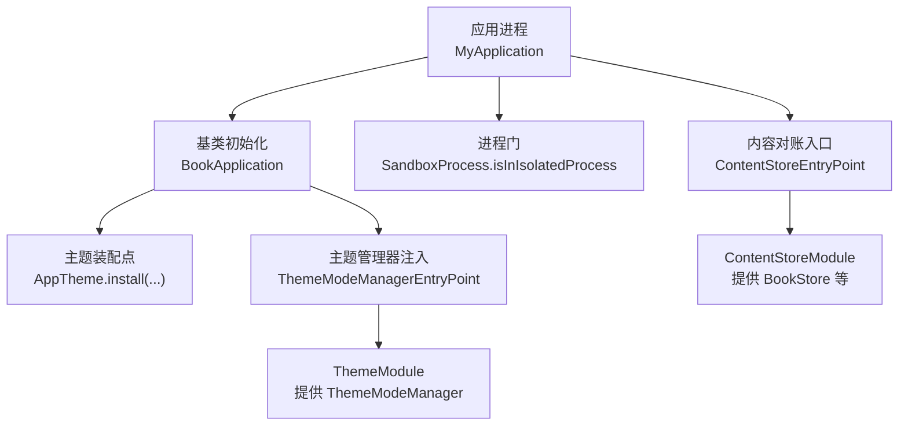
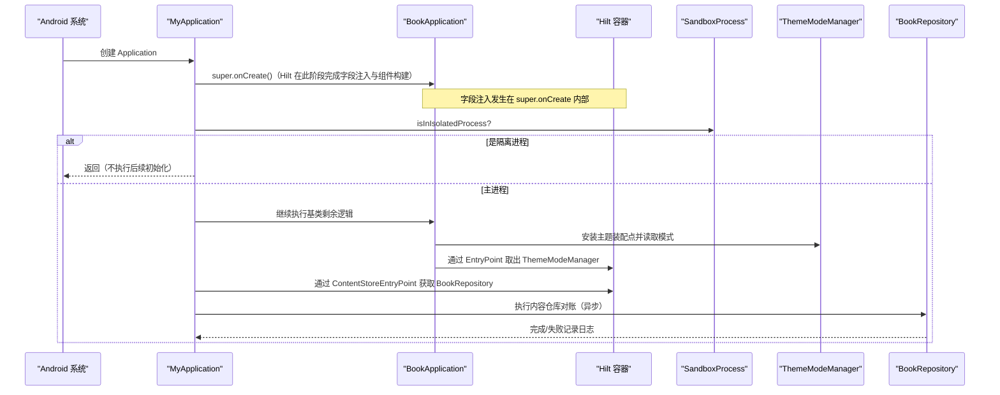
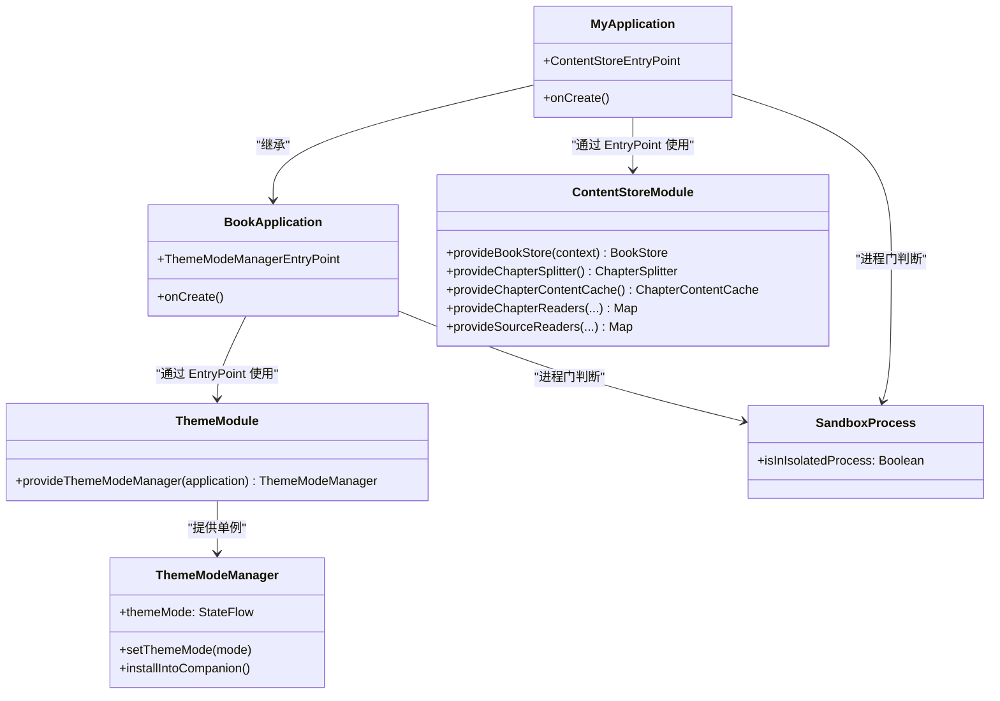
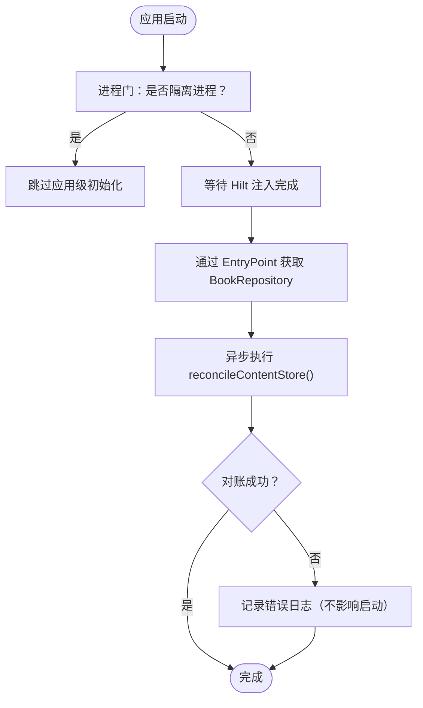

# Hilt 配置与应用初始化

<cite>
**本文引用的文件**   
- [MyApplication.kt](file://module_app/src/main/java/com/ebook/MyApplication.kt)
- [BookApplication.kt](file://lib_book_common/src/main/java/com/ebook/common/BookApplication.kt)
- [SandboxProcess.kt](file://lib_book_source/src/main/java/com/ebook/source/sandbox/SandboxProcess.kt)
- [ThemeModule.kt](file://lib_book_common/src/main/java/com/ebook/common/di/ThemeModule.kt)
- [ContentStoreModule.kt](file://lib_book_common/src/main/java/com/ebook/common/di/ContentStoreModule.kt)
- [ThemeModeManager.kt](file://lib_book_common/src/main/java/com/ebook/common/domain/ThemeModeManager.kt)
</cite>

## 目录
1. [引言](#引言)
2. [项目结构](#项目结构)
3. [核心组件](#核心组件)
4. [架构总览](#架构总览)
5. [详细组件分析](#详细组件分析)
6. [依赖关系分析](#依赖关系分析)
7. [性能与启动优化](#性能与启动优化)
8. [故障排查指南](#故障排查指南)
9. [结论](#结论)

## 引言
本文围绕 Android 应用启动期的 Hilt 配置、Application 级生命周期管理以及“进程门”机制，系统化说明以下内容：
- @HiltAndroidApp 的使用方式与 Application 的初始化顺序
- EntryPoint 机制的设计动机、装配位置与使用场景（以 ContentStoreEntryPoint 为例）
- 在隔离进程（沙箱）中如何避免不必要的 DI 初始化
- Hilt 组件装配顺序与依赖图构建要点
- 常见问题的定位思路与优化建议（循环依赖、启动性能等）

## 项目结构
本仓库采用多模块结构，Hilt 相关的关键实现集中在应用入口模块与共享基础库：
- 应用入口模块提供 @HiltAndroidApp 的 Application 类，并在启动期按需通过 EntryPoint 获取重对象
- 共享基础库负责主题模式管理、内容存储仓库等单例对象的装配与暴露
- 沙箱进程检测工具提供统一的“进程门”判断

图表来源
- [MyApplication.kt:19-61](file://module_app/src/main/java/com/ebook/MyApplication.kt#L19-L61)
- [BookApplication.kt:17-59](file://lib_book_common/src/main/java/com/ebook/common/BookApplication.kt#L17-L59)
- [SandboxProcess.kt:23-28](file://lib_book_source/src/main/java/com/ebook/source/sandbox/SandboxProcess.kt#L23-L28)
- [ThemeModule.kt:17-26](file://lib_book_common/src/main/java/com/ebook/common/di/ThemeModule.kt#L17-L26)
- [ContentStoreModule.kt:21-87](file://lib_book_common/src/main/java/com/ebook/common/di/ContentStoreModule.kt#L21-L87)

章节来源
- [MyApplication.kt:19-61](file://module_app/src/main/java/com/ebook/MyApplication.kt#L19-L61)
- [BookApplication.kt:17-59](file://lib_book_common/src/main/java/com/ebook/common/BookApplication.kt#L17-L59)
- [SandboxProcess.kt:23-28](file://lib_book_source/src/main/java/com/ebook/source/sandbox/SandboxProcess.kt#L23-L28)
- [ThemeModule.kt:17-26](file://lib_book_common/src/main/java/com/ebook/common/di/ThemeModule.kt#L17-L26)
- [ContentStoreModule.kt:21-87](file://lib_book_common/src/main/java/com/ebook/common/di/ContentStoreModule.kt#L21-L87)

## 核心组件
- 应用入口与 Hilt 根组件
  - 应用入口类标注为 Hilt 根组件，确保全局 DI 容器可用
  - 在 Application.onCreate 中先调用父类完成框架与 Hilt 的初始化，再执行进程门判断与业务初始化
- 进程门
  - 统一入口判断当前是否运行在系统隔离的沙箱进程中，用于跳过主题装配与仓库初始化等不适配逻辑
- 主题模式管理
  - 通过 Hilt 模块提供 ThemeModeManager，并由 BookApplication 在注入完成后挂入伴生对象，供 Compose 主题装配点读取
- 内容存储仓库入口
  - 通过自定义 EntryPoint 暴露 BookRepository 的重对象，延迟到需要时再取用，避免在隔离进程或启动早期触发

章节来源
- [MyApplication.kt:19-61](file://module_app/src/main/java/com/ebook/MyApplication.kt#L19-L61)
- [BookApplication.kt:17-59](file://lib_book_common/src/main/java/com/ebook/common/BookApplication.kt#L17-L59)
- [ThemeModule.kt:17-26](file://lib_book_common/src/main/java/com/ebook/common/di/ThemeModule.kt#L17-L26)
- [ContentStoreModule.kt:21-87](file://lib_book_common/src/main/java/com/ebook/common/di/ContentStoreModule.kt#L21-L87)
- [ThemeModeManager.kt:44-92](file://lib_book_common/src/main/java/com/ebook/common/domain/ThemeModeManager.kt#L44-L92)

## 架构总览
下图展示了从进程启动到依赖图构建与关键任务执行的序列流程。

图表来源
- [MyApplication.kt:19-61](file://module_app/src/main/java/com/ebook/MyApplication.kt#L19-L61)
- [BookApplication.kt:17-59](file://lib_book_common/src/main/java/com/ebook/common/BookApplication.kt#L17-L59)
- [SandboxProcess.kt:23-28](file://lib_book_source/src/main/java/com/ebook/source/sandbox/SandboxProcess.kt#L23-L28)
- [ThemeModule.kt:17-26](file://lib_book_common/src/main/java/com/ebook/common/di/ThemeModule.kt#L17-L26)
- [ContentStoreModule.kt:21-87](file://lib_book_common/src/main/java/com/ebook/common/di/ContentStoreModule.kt#L21-L87)

## 详细组件分析

### MyApplication：@HiltAndroidApp 与启动时序
- 作为 Hilt 根组件，确保整个应用拥有唯一的 DI 容器
- onCreate 调用父类后立刻进行进程门检查，隔离进程直接返回，避免不必要的初始化
- 登录拦截与内容仓库对账均在协程作用域内异步执行，失败仅记录日志，不阻塞启动
- 通过 EntryPointAccessors 在需要时才取 BookRepository，避免 Application 上的 eager 注入

章节来源
- [MyApplication.kt:19-61](file://module_app/src/main/java/com/ebook/MyApplication.kt#L19-L61)

### BookApplication：主题装配与进程门
- 在 onCreate 中设置主题装配点，依据 ThemeModeManager 的状态决定深色模式
- 同样具备进程门，隔离进程跳过主题装配与持久化操作
- 通过 ThemeModeManagerEntryPoint 获取 ThemeModeManager，并挂入伴生对象供 Compose 装配点读取

章节来源
- [BookApplication.kt:17-59](file://lib_book_common/src/main/java/com/ebook/common/BookApplication.kt#L17-L59)

### SandboxProcess：进程门实现与必要性
- 统一入口判断当前进程是否为系统隔离进程（API 门槛 + Process.isIsolated）
- 将判据封装为公开对象，便于多个模块复用；短路与顺序保证低 API 设备不崩溃
- 选择“是否隔离”而非“进程名匹配”，避免因系统行为差异导致的误判

章节来源
- [SandboxProcess.kt:23-28](file://lib_book_source/src/main/java/com/ebook/source/sandbox/SandboxProcess.kt#L23-L28)

### ThemeModule 与 ThemeModeManager：主题模式管理
- ThemeModule 以 SingletonComponent 提供 ThemeModeManager，确保全应用单例
- ThemeModeManager 持久化用户主题选择并以 StateFlow 暴露，支持运行时切换
- 通过 installIntoCompanion 把实例挂入伴生对象，供无法走 Hilt 注入的 Compose 装配点读取

章节来源
- [ThemeModule.kt:17-26](file://lib_book_common/src/main/java/com/ebook/common/di/ThemeModule.kt#L17-L26)
- [ThemeModeManager.kt:44-92](file://lib_book_common/src/main/java/com/ebook/common/domain/ThemeModeManager.kt#L44-L92)

### ContentStoreModule 与 ContentStoreEntryPoint：延迟获取重对象
- ContentStoreModule 提供 BookStore、ChapterSplitter、ChapterContentCache 等单例，集中装配本地内容基础设施
- ContentStoreEntryPoint 暴露 BookRepository，使调用方仅在真正使用时才触发依赖解析与构造
- 这种“按需注入”的方式有效避免在隔离进程或冷启动早期执行重开销逻辑

章节来源
- [ContentStoreModule.kt:21-87](file://lib_book_common/src/main/java/com/ebook/common/di/ContentStoreModule.kt#L21-L87)
- [MyApplication.kt:46-61](file://module_app/src/main/java/com/ebook/MyApplication.kt#L46-L61)

### 类关系图（Hilt 装配与入口）

图表来源
- [MyApplication.kt:19-61](file://module_app/src/main/java/com/ebook/MyApplication.kt#L19-L61)
- [BookApplication.kt:17-59](file://lib_book_common/src/main/java/com/ebook/common/BookApplication.kt#L17-L59)
- [ThemeModule.kt:17-26](file://lib_book_common/src/main/java/com/ebook/common/di/ThemeModule.kt#L17-L26)
- [ContentStoreModule.kt:21-87](file://lib_book_common/src/main/java/com/ebook/common/di/ContentStoreModule.kt#L21-L87)
- [ThemeModeManager.kt:44-92](file://lib_book_common/src/main/java/com/ebook/common/domain/ThemeModeManager.kt#L44-L92)
- [SandboxProcess.kt:23-28](file://lib_book_source/src/main/java/com/ebook/source/sandbox/SandboxProcess.kt#L23-L28)

### 内容仓库对账流程图（启动期）

图表来源
- [MyApplication.kt:24-43](file://module_app/src/main/java/com/ebook/MyApplication.kt#L24-L43)
- [SandboxProcess.kt:23-28](file://lib_book_source/src/main/java/com/ebook/source/sandbox/SandboxProcess.kt#L23-L28)

## 依赖关系分析
- 组件装配层级
  - 根组件由 @HiltAndroidApp 声明，SingletonComponent 承载全局单例
  - ThemeModule 与 ContentStoreModule 均安装于 SingletonComponent，提供跨模块共享的单例
- 依赖方向
  - BookApplication 依赖 ThemeModule（主题模式管理）
  - MyApplication 依赖 ContentStoreModule（通过 EntryPoint 获取 BookRepository）
  - 两个 Application 均依赖 SandboxProcess 进行进程门判断
- 潜在耦合点
  - 若 EntryPoint 暴露的对象构造链过长，会拉长首次获取时间；应遵循“用时再取”的原则
  - 主题装配点在 Compose 重组时读取 ThemeModeManager，需保证实例已安装且线程安全

章节来源
- [ThemeModule.kt:17-26](file://lib_book_common/src/main/java/com/ebook/common/di/ThemeModule.kt#L17-L26)
- [ContentStoreModule.kt:21-87](file://lib_book_common/src/main/java/com/ebook/common/di/ContentStoreModule.kt#L21-L87)
- [BookApplication.kt:17-59](file://lib_book_common/src/main/java/com/ebook/common/BookApplication.kt#L17-L59)
- [MyApplication.kt:19-61](file://module_app/src/main/java/com/ebook/MyApplication.kt#L19-L61)

## 性能与启动优化
- 启动期策略
  - 严格区分主进程与隔离进程，隔离进程跳过主题装配与仓库初始化，减少无效 IO 与网络访问
  - 将重对象（如 BookRepository）的获取推迟至实际使用时，避免冷启动阶段的大对象构造
- 依赖图构建
  - 通过模块化 DI 装配，按功能拆分 Module，降低单次构建复杂度
  - 使用 SingletonComponent 管理跨模块共享单例，避免重复创建
- 可观测性
  - 对关键路径（如对账）增加异常捕获与日志记录，便于快速定位问题而不影响启动

[本节为通用指导，无需特定文件引用]

## 故障排查指南
- 循环依赖
  - 症状：Hilt 构建失败或启动时抛出循环依赖异常
  - 排查：检查各 Module 提供的对象是否存在环状依赖；必要时引入延迟加载或重构依赖方向
  - 参考：通过 EntryPoint 按需获取对象，减少 Application 层的全局 eager 依赖
- 启动性能下降
  - 症状：冷启动耗时明显增加
  - 排查：确认是否有重对象在 Application 上被 eager 注入；改用 EntryPointAccessors 在需要时取用
  - 优化：将非关键初始化改为异步或懒加载
- 隔离进程异常
  - 症状：在沙箱进程中出现崩溃或无响应
  - 排查：确认是否在进程门之后仍有依赖 Application 上下文或文件系统的路径；确保所有此类逻辑受进程门保护
- 主题不生效
  - 症状：深色模式未按用户设置切换
  - 排查：确认 ThemeModeManager 已安装到伴生对象；主题装配点是否正确读取 StateFlow

章节来源
- [MyApplication.kt:24-43](file://module_app/src/main/java/com/ebook/MyApplication.kt#L24-L43)
- [BookApplication.kt:17-59](file://lib_book_common/src/main/java/com/ebook/common/BookApplication.kt#L17-L59)
- [ThemeModeManager.kt:44-92](file://lib_book_common/src/main/java/com/ebook/common/domain/ThemeModeManager.kt#L44-L92)

## 结论
本项目通过 @HiltAndroidApp 与模块化 DI 装配，结合进程门与 EntryPoint 延迟注入机制，实现了：
- 清晰的依赖图与可控的启动时序
- 在隔离进程中的安全降级与资源保护
- 主题模式的灵活管理与跨模块共享
- 重对象的按需获取，提升启动性能与稳定性

建议在后续迭代中持续遵循“Application 层不做 eager 注入”“重对象延迟获取”“进程门覆盖所有不适配逻辑”的原则，以保持系统的可维护性与健壮性。