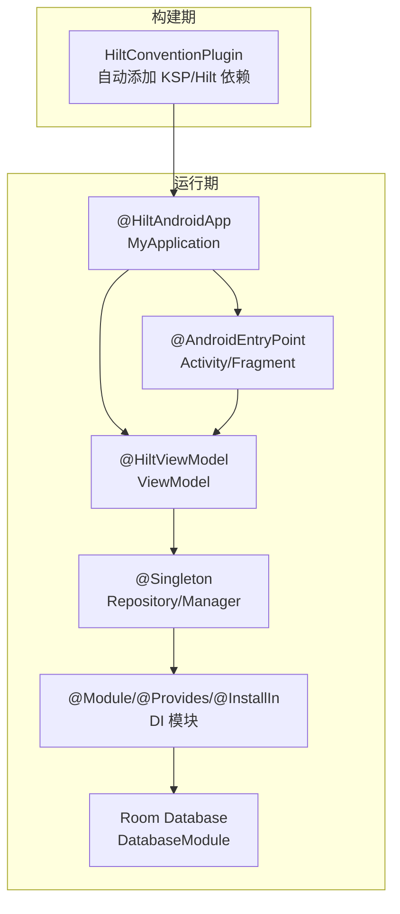
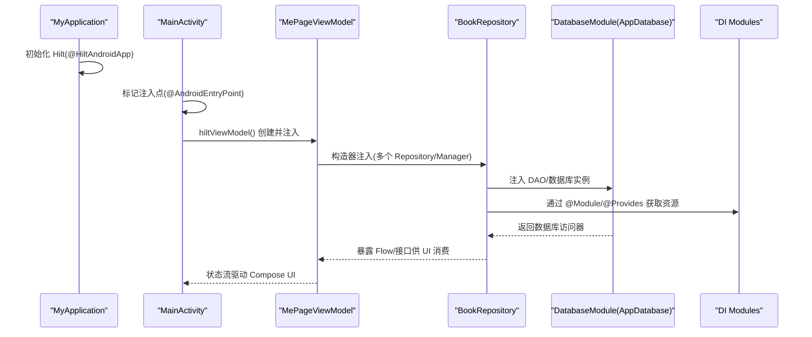
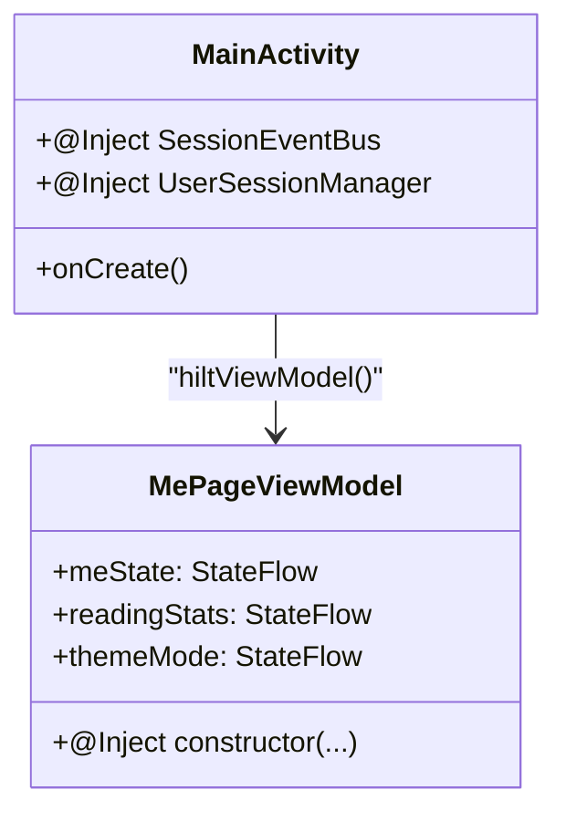
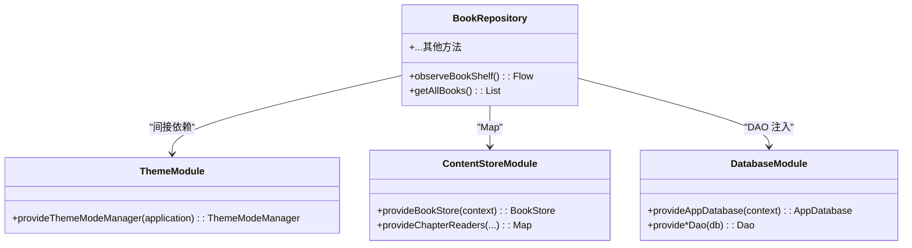
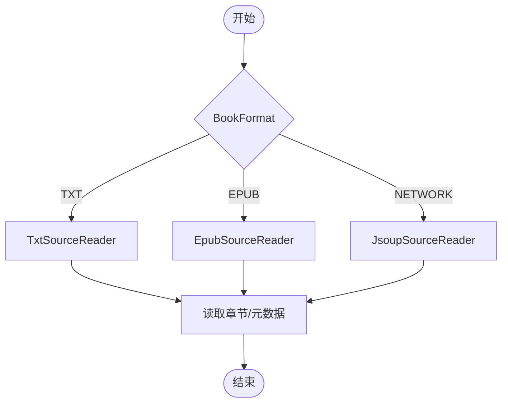
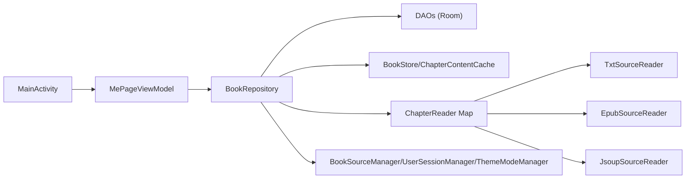

# Hilt 依赖注入集成

<cite>
**本文引用的文件**
- [HiltConventionPlugin.kt](file://build-logic/convention/src/main/kotlin/HiltConventionPlugin.kt)
- [MyApplication.kt](file://module_app/src/main/java/com/ebook/MyApplication.kt)
- [MainActivity.kt](file://module_main/src/main/java/com/ebook/main/MainActivity.kt)
- [ThemeModule.kt](file://lib_book_common/src/main/java/com/ebook/common/di/ThemeModule.kt)
- [ContentStoreModule.kt](file://lib_book_common/src/main/java/com/ebook/common/di/ContentStoreModule.kt)
- [DatabaseModule.kt](file://lib_ebook_db/src/main/java/com/ebook/db/di/DatabaseModule.kt)
- [MePageViewModel.kt](file://module_me/src/main/java/com/ebook/me/mvvm/viewmodel/MePageViewModel.kt)
- [BookRepository.kt](file://lib_book_common/src/main/java/com/ebook/common/repository/BookRepository.kt)
</cite>

## 目录
1. [简介](#简介)
2. [项目结构](#项目结构)
3. [核心组件](#核心组件)
4. [架构总览](#架构总览)
5. [详细组件分析](#详细组件分析)
6. [依赖关系分析](#依赖关系分析)
7. [性能考量](#性能考量)
8. [故障排查指南](#故障排查指南)
9. [结论](#结论)
10. [附录](#附录)

## 简介
本文件面向工程中的 Hilt 依赖注入实践，系统性说明如何在多模块 Android 项目中装配与组织依赖。内容覆盖：
- 应用级初始化与模块装配（@HiltAndroidApp、约定插件）
- 组件级注入点（@AndroidEntryPoint、@HiltViewModel）
- 单例与服务提供（@Singleton、@Module/@Provides/@InstallIn）
- ViewModel、Repository、Service 等组件的依赖关系与生命周期
- 构造器注入的优势与模式
- 复杂依赖图、条件注入、测试替身注入示例与最佳实践

## 项目结构
本项目采用多模块架构，通过 build-logic 的统一约定插件为所有 Android 模块自动启用 Hilt/KSP，并在需要时引入运行时依赖。应用入口使用 @HiltAndroidApp 启动 Hilt，业务模块以 Activity/Fragment 作为注入点，领域层通过 Repository 暴露能力，数据库通过 Room + Hilt 模块提供 DAO。

图表来源
- [HiltConventionPlugin.kt:24-49](file://build-logic/convention/src/main/kotlin/HiltConventionPlugin.kt#L24-L49)
- [MyApplication.kt:19-20](file://module_app/src/main/java/com/ebook/MyApplication.kt#L19-L20)
- [MainActivity.kt:57-67](file://module_main/src/main/java/com/ebook/main/MainActivity.kt#L57-L67)
- [MePageViewModel.kt:69-75](file://module_me/src/main/java/com/ebook/me/mvvm/viewmodel/MePageViewModel.kt#L69-L75)
- [BookRepository.kt:51-74](file://lib_book_common/src/main/java/com/ebook/common/repository/BookRepository.kt#L51-L74)
- [DatabaseModule.kt:192-208](file://lib_ebook_db/src/main/java/com/ebook/db/di/DatabaseModule.kt#L192-L208)

章节来源
- [HiltConventionPlugin.kt:24-49](file://build-logic/convention/src/main/kotlin/HiltConventionPlugin.kt#L24-L49)
- [MyApplication.kt:19-20](file://module_app/src/main/java/com/ebook/MyApplication.kt#L19-L20)
- [MainActivity.kt:57-67](file://module_main/src/main/java/com/ebook/main/MainActivity.kt#L57-L67)

## 核心组件
- 应用入口与全局装配
  - @HiltAndroidApp：在 Application 上开启 Hilt，负责生成并安装 Hilt 组件。
  - EntryPointAccessors：在进程隔离场景下按需取用仓库实例，避免在 Application 字段上 eager 注入导致沙箱进程崩溃。
- 注入点
  - @AndroidEntryPoint：用于 Activity/Fragment，允许在其内部使用 @Inject 注入依赖。
  - @HiltViewModel：用于 ViewModel，支持构造器注入与生命周期绑定。
- 单例与模块
  - @Singleton：声明全应用级单例（如 Repository、Manager）。
  - @Module/@Provides/@InstallIn：集中定义可提供的依赖及其作用域（如 SingletonComponent），用于外部对象或第三方库的装配（如 Room、主题管理器）。

章节来源
- [MyApplication.kt:19-61](file://module_app/src/main/java/com/ebook/MyApplication.kt#L19-L61)
- [MainActivity.kt:57-67](file://module_main/src/main/java/com/ebook/main/MainActivity.kt#L57-L67)
- [MePageViewModel.kt:69-75](file://module_me/src/main/java/com/ebook/me/mvvm/viewmodel/MePageViewModel.kt#L69-L75)
- [BookRepository.kt:51-74](file://lib_book_common/src/main/java/com/ebook/common/repository/BookRepository.kt#L51-L74)
- [ThemeModule.kt:17-26](file://lib_book_common/src/main/java/com/ebook/common/di/ThemeModule.kt#L17-L26)
- [ContentStoreModule.kt:27-87](file://lib_book_common/src/main/java/com/ebook/common/di/ContentStoreModule.kt#L27-L87)
- [DatabaseModule.kt:192-208](file://lib_ebook_db/src/main/java/com/ebook/db/di/DatabaseModule.kt#L192-L208)

## 架构总览
下图展示了从应用启动到页面渲染的关键依赖注入流程：Application 初始化 → Activity 获取注入 → ViewModel 构造 → Repository 单例 → DI 模块提供数据源。

图表来源
- [MyApplication.kt:19-61](file://module_app/src/main/java/com/ebook/MyApplication.kt#L19-L61)
- [MainActivity.kt:57-67](file://module_main/src/main/java/com/ebook/main/MainActivity.kt#L57-L67)
- [MePageViewModel.kt:69-75](file://module_me/src/main/java/com/ebook/me/mvvm/viewmodel/MePageViewModel.kt#L69-L75)
- [BookRepository.kt:51-74](file://lib_book_common/src/main/java/com/ebook/common/repository/BookRepository.kt#L51-L74)
- [DatabaseModule.kt:192-208](file://lib_ebook_db/src/main/java/com/ebook/db/di/DatabaseModule.kt#L192-L208)

## 详细组件分析

### 应用级装配与进程安全
- @HiltAndroidApp 确保 Hilt 在应用启动时完成组件安装。
- 在 Application 中避免使用 eager @Inject 字段；对于需要延迟初始化的重型对象，使用 EntryPointAccessors 在真正使用时获取，防止沙箱进程因读取不到 Room 等资源而崩溃。

章节来源
- [MyApplication.kt:19-61](file://module_app/src/main/java/com/ebook/MyApplication.kt#L19-L61)

### 注入点：Activity 与 ViewModel
- Activity：通过 @AndroidEntryPoint 标注，可在类内使用 @Inject 注入依赖。
- ViewModel：通过 @HiltViewModel 标注并使用 @Inject 构造器注入依赖，结合 lifecycleScope 管理协程与状态流。

图表来源
- [MainActivity.kt:57-67](file://module_main/src/main/java/com/ebook/main/MainActivity.kt#L57-L67)
- [MePageViewModel.kt:69-75](file://module_me/src/main/java/com/ebook/me/mvvm/viewmodel/MePageViewModel.kt#L69-L75)

章节来源
- [MainActivity.kt:57-67](file://module_main/src/main/java/com/ebook/main/MainActivity.kt#L57-L67)
- [MePageViewModel.kt:69-75](file://module_me/src/main/java/com/ebook/me/mvvm/viewmodel/MePageViewModel.kt#L69-L75)

### 单例与模块：Repository 与 DI 模块
- Repository：通过 @Singleton 与 @Inject 构造器注入 DAO、存储、解析器等依赖，提供统一的数据访问与事件发布能力。
- DI 模块：
  - ThemeModule：提供 ThemeModeManager，依赖 Application 上下文。
  - ContentStoreModule：提供 BookStore、ChapterSplitter、ChapterContentCache 及按格式路由的 ChapterReader Map。
  - DatabaseModule：提供 AppDatabase 与各 DAO 的单例，内置迁移链。

图表来源
- [BookRepository.kt:51-74](file://lib_book_common/src/main/java/com/ebook/common/repository/BookRepository.kt#L51-L74)
- [ThemeModule.kt:17-26](file://lib_book_common/src/main/java/com/ebook/common/di/ThemeModule.kt#L17-L26)
- [ContentStoreModule.kt:27-87](file://lib_book_common/src/main/java/com/ebook/common/di/ContentStoreModule.kt#L27-L87)
- [DatabaseModule.kt:192-208](file://lib_ebook_db/src/main/java/com/ebook/db/di/DatabaseModule.kt#L192-L208)

章节来源
- [BookRepository.kt:51-74](file://lib_book_common/src/main/java/com/ebook/common/repository/BookRepository.kt#L51-L74)
- [ThemeModule.kt:17-26](file://lib_book_common/src/main/java/com/ebook/common/di/ThemeModule.kt#L17-L26)
- [ContentStoreModule.kt:27-87](file://lib_book_common/src/main/java/com/ebook/common/di/ContentStoreModule.kt#L27-L87)
- [DatabaseModule.kt:192-208](file://lib_ebook_db/src/main/java/com/ebook/db/di/DatabaseModule.kt#L192-L208)

### 复杂依赖图：按格式路由与多实现
通过 Map 注入将不同 BookFormat 的实现（TXT、EPUB、NETWORK）进行路由，新增格式只需扩展 Map，符合开闭原则。

图表来源
- [ContentStoreModule.kt:60-71](file://lib_book_common/src/main/java/com/ebook/common/di/ContentStoreModule.kt#L60-L71)

章节来源
- [ContentStoreModule.kt:60-71](file://lib_book_common/src/main/java/com/ebook/common/di/ContentStoreModule.kt#L60-L71)

### 条件注入与测试替身注入
- 条件注入：通过不同的 source set 或 flavor 提供不同实现（例如 mock/real 的 NetworkModule 替换网络客户端）。
- 测试替身：在测试源集下提供同接口的 Fake/Mock 实现，由 Hilt 按编译产物选择，便于单元测试与仪器测试解耦。

章节来源
- [HiltConventionPlugin.kt:24-49](file://build-logic/convention/src/main/kotlin/HiltConventionPlugin.kt#L24-L49)

## 依赖关系分析
- 耦合与内聚
  - Activity 仅持有轻量依赖（事件总线、会话管理），UI 状态集中在 ViewModel。
  - ViewModel 组合多个 Repository/Manager，职责清晰，避免 UI 直接访问数据层。
  - Repository 聚合 DAO、存储、解析器，封装业务逻辑，保持高内聚。
- 直接/间接依赖
  - 直接依赖：Activity→ViewModel→Repository→DAO/Store/Manager。
  - 间接依赖：Repository 通过 Map 路由到具体 Reader，DatabaseModule 提供数据库与迁移链。
- 外部依赖与集成点
  - Room：通过 DatabaseModule 提供 AppDatabase 与各 DAO。
  - Retrofit/OkHttp：通过各模块的 NetworkModule（mock/real）提供不同客户端。
  - 沙箱执行器：通过 Hilt 装配 Host/Client，避免主线程调用与白名单限制。

图表来源
- [MainActivity.kt:57-67](file://module_main/src/main/java/com/ebook/main/MainActivity.kt#L57-L67)
- [MePageViewModel.kt:69-75](file://module_me/src/main/java/com/ebook/me/mvvm/viewmodel/MePageViewModel.kt#L69-L75)
- [BookRepository.kt:51-74](file://lib_book_common/src/main/java/com/ebook/common/repository/BookRepository.kt#L51-L74)
- [ContentStoreModule.kt:60-71](file://lib_book_common/src/main/java/com/ebook/common/di/ContentStoreModule.kt#L60-L71)

章节来源
- [BookRepository.kt:51-74](file://lib_book_common/src/main/java/com/ebook/common/repository/BookRepository.kt#L51-L74)
- [ContentStoreModule.kt:60-71](file://lib_book_common/src/main/java/com/ebook/common/di/ContentStoreModule.kt#L60-L71)

## 性能考量
- 懒加载与一次性计算：通过 EntryPointAccessors 延迟获取重型对象，减少冷启动开销。
- 单例复用：Repository、DAO、缓存对象均以单例形式提供，避免重复创建。
- 响应式数据流：ViewModel 中使用 StateFlow 与 whileSubscribed 策略，减少无效订阅与内存占用。
- 数据库迁移：迁移链设计最小化破坏性变更，保证升级路径稳定。

## 故障排查指南
- 启动阶段崩溃
  - 检查 Application 是否存在 eager @Inject 字段；如有，改为延迟获取（EntryPointAccessors）。
- 注入失败或空指针
  - 确认目标类已正确标注 @AndroidEntryPoint/@HiltViewModel/@Singleton。
  - 检查对应 @Module/@Provides 是否安装在正确的作用域（SingletonComponent）。
- 沙箱进程异常
  - 确保在进程门之后才进行可能访问 Room 的操作；必要时通过 EntryPointAccessors 按需获取。
- 路由与模块独立运行
  - 独立模式下需确保占位路由存在；否则跨模块导航静默失败。

章节来源
- [MyApplication.kt:19-61](file://module_app/src/main/java/com/ebook/MyApplication.kt#L19-L61)
- [MainActivity.kt:57-67](file://module_main/src/main/java/com/ebook/main/MainActivity.kt#L57-L67)

## 结论
本项目通过 Hilt 实现了清晰的分层与解耦：应用入口负责装配，Activity/Fragment 作为注入点，ViewModel 编排业务状态，Repository 聚合数据与解析逻辑，DI 模块集中管理第三方与外部依赖。配合 Map 路由、条件注入与测试替身，既满足多书源/多实现的扩展性，又保证了测试友好性与稳定性。建议遵循以下最佳实践：
- 优先使用构造器注入，明确依赖关系
- 将可共享对象定义为 @Singleton，并通过 @Module/@Provides 提供
- 在 Application 中避免 eager 注入，使用延迟获取
- 通过 Map 路由多实现，遵循开闭原则
- 利用 flavor/source set 切换 mock/real 实现，提升测试效率

## 附录
- 常用注解速查
  - @HiltAndroidApp：应用级装配入口
  - @AndroidEntryPoint：Activity/Fragment 注入点
  - @HiltViewModel：ViewModel 注入与生命周期绑定
  - @Singleton：全应用单例
  - @Module/@Provides/@InstallIn：依赖提供与作用域装配