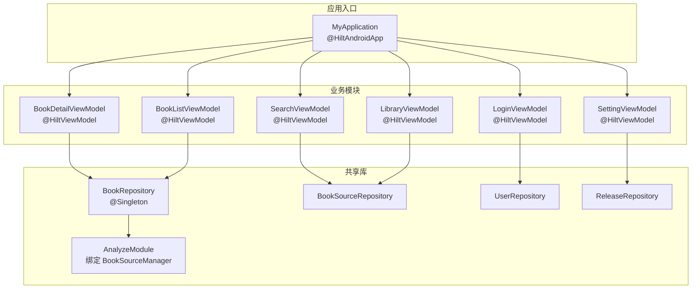
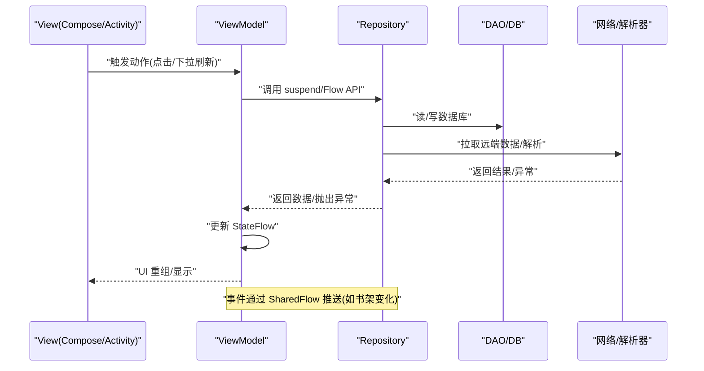
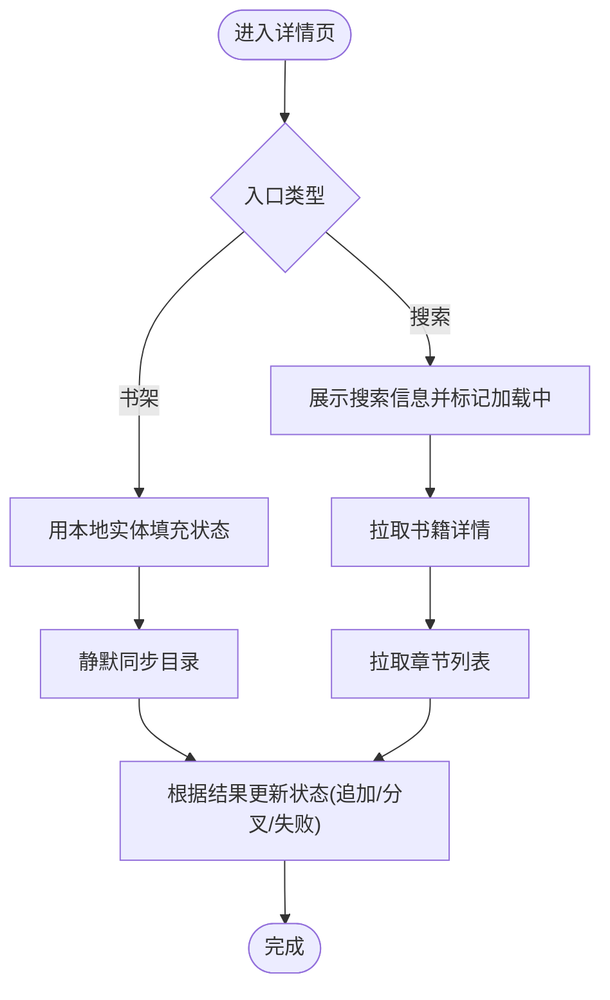
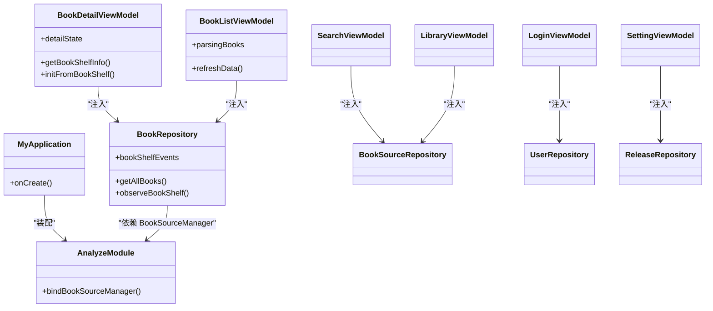

# MVVM 架构集成

<cite>
**本文引用的文件**
- [BookDetailViewModel.kt](file://module_book/src/main/java/com/ebook/book/mvvm/viewmodel/BookDetailViewModel.kt)
- [BookListViewModel.kt](file://module_book/src/main/java/com/ebook/book/mvvm/viewmodel/BookListViewModel.kt)
- [BookRepository.kt](file://lib_book_common/src/main/java/com/ebook/common/repository/BookRepository.kt)
- [AnalyzeModule.kt](file://lib_book_common/src/main/java/com/ebook/common/di/AnalyzeModule.kt)
- [MyApplication.kt](file://module_app/src/main/java/com/ebook/MyApplication.kt)
- [SearchViewModel.kt](file://module_find/src/main/java/com/ebook/find/mvvm/viewmodel/SearchViewModel.kt)
- [LibraryViewModel.kt](file://module_find/src/main/java/com/ebook/find/mvvm/viewmodel/LibraryViewModel.kt)
- [LoginViewModel.kt](file://module_login/src/main/java/com/ebook/login/mvvm/viewmodel/LoginViewModel.kt)
- [SettingViewModel.kt](file://module_me/src/main/java/com/ebook/me/mvvm/viewmodel/SettingViewModel.kt)
- [BookSourceRepository.kt](file://module_find/src/main/java/com/ebook/find/repository/BookSourceRepository.kt)
- [UserRepository.kt](file://module_login/src/main/java/com/ebook/login/repository/UserRepository.kt)
- [ReleaseRepository.kt](file://module_me/src/main/java/com/ebook/me/repository/ReleaseRepository.kt)
</cite>

## 目录
1. [引言](#引言)
2. [项目结构](#项目结构)
3. [核心组件](#核心组件)
4. [架构总览](#架构总览)
5. [详细组件分析](#详细组件分析)
6. [依赖关系分析](#依赖关系分析)
7. [性能与状态管理要点](#性能与状态管理要点)
8. [故障排查指南](#故障排查指南)
9. [结论](#结论)
10. [附录：最佳实践与常见陷阱](#附录：最佳实践与常见陷阱)

## 引言
本文件面向希望在 Android 端落地 MVVM + Hilt 的团队，基于仓库中已有的 ViewModel、Repository 与 DI 模块实现，系统性说明：
- 如何使用 @HiltViewModel 进行依赖注入
- ViewModel 生命周期管理与状态管理策略（StateFlow/SharedFlow）
- Repository 模式在 MVVM 中的应用与注入方式
- 数据流向与状态更新机制
- 测试替身（Mock/Fake）的创建与使用方式
- 结合代码路径给出 ViewModel、Repository、View 层之间的依赖关系与数据流图
- 最佳实践与常见陷阱避免方法

## 项目结构
本项目采用多模块 Gradle 工程，业务模块通过 lib_book_common 共享领域能力，统一以 Hilt 装配依赖。MVVM 各层的典型位置如下：
- View 层：Activity/Compose 页面（由基类统一管理主题、覆盖层与命令通道）
- ViewModel 层：每个功能域一个或多个 ViewModel，继承 BaseViewModel/BaseRefreshViewModel，使用 StateFlow/SharedFlow 暴露状态
- Repository 层：聚合 DAO、网络、存储等数据源，对外暴露领域 API 与事件流
- DI 层：@Module/@InstallIn(@SingletonComponent) 提供单例；@HiltViewModel 注入 ViewModel；@AndroidEntryPoint 用于 Activity

图表来源
- [MyApplication.kt:19-43](file://module_app/src/main/java/com/ebook/MyApplication.kt#L19-L43)
- [BookDetailViewModel.kt:52-56](file://module_book/src/main/java/com/ebook/book/mvvm/viewmodel/BookDetailViewModel.kt#L52-L56)
- [BookListViewModel.kt:27-31](file://module_book/src/main/java/com/ebook/book/mvvm/viewmodel/BookListViewModel.kt#L27-L31)
- [AnalyzeModule.kt:11-18](file://lib_book_common/src/main/java/com/ebook/common/di/AnalyzeModule.kt#L11-L18)

章节来源
- [MyApplication.kt:19-43](file://module_app/src/main/java/com/ebook/MyApplication.kt#L19-L43)
- [AnalyzeModule.kt:11-18](file://lib_book_common/src/main/java/com/ebook/common/di/AnalyzeModule.kt#L11-L18)

## 核心组件
- ViewModel 层
  - 详情页：BookDetailViewModel，负责详情加载、目录同步、书架状态变更响应
  - 书架列表页：BookListViewModel，负责刷新与事件驱动更新
  - 书城搜索/书库：SearchViewModel、LibraryViewModel，负责搜索/分类数据与缓存
  - 登录：LoginViewModel，处理认证流程
  - 设置：SettingViewModel，处理本地配置
- Repository 层
  - BookRepository：书架 CRUD、阅读进度、内容读取路由、换源、事件发布
  - BookSourceRepository：书城/书源相关数据访问与缓存策略
  - UserRepository：用户会话、认证相关操作
  - ReleaseRepository：版本检查发布源访问
- DI 层
  - AnalyzeModule：将 BookSourceManagerImpl 绑定为 BookSourceManager 单例
  - MyApplication：@HiltAndroidApp 启动 Hilt，按需通过 EntryPointAccessors 获取重对象

章节来源
- [BookDetailViewModel.kt:52-56](file://module_book/src/main/java/com/ebook/book/mvvm/viewmodel/BookDetailViewModel.kt#L52-L56)
- [BookListViewModel.kt:27-31](file://module_book/src/main/java/com/ebook/book/mvvm/viewmodel/BookListViewModel.kt#L27-L31)
- [BookRepository.kt:51-74](file://lib_book_common/src/main/java/com/ebook/common/repository/BookRepository.kt#L51-L74)
- [AnalyzeModule.kt:11-18](file://lib_book_common/src/main/java/com/ebook/common/di/AnalyzeModule.kt#L11-L18)

## 架构总览
MVVM + Hilt 的核心约定：
- ViewModel 通过 @HiltViewModel + @Inject 构造，依赖注入 Repository、Manager 等
- Repository 通过 @Singleton + @Inject 构造，聚合 DAO、网络、存储，并暴露 Flow/StateFlow
- 页面（Activity/Compose）通过 BaseMvvmActivity 或 Compose 订阅 StateFlow，驱动 UI 重组
- 事件总线：SharedFlow 跨层传递一次性事件（如书架变化）

图表来源
- [BookDetailViewModel.kt:168-209](file://module_book/src/main/java/com/ebook/book/mvvm/viewmodel/BookDetailViewModel.kt#L168-L209)
- [BookRepository.kt:81-100](file://lib_book_common/src/main/java/com/ebook/common/repository/BookRepository.kt#L81-L100)

## 详细组件分析

### BookDetailViewModel 与详情页状态机
- 注解与注入：@HiltViewModel，@Inject 注入 BookRepository、BookSourceManager
- 状态管理：内部 MutableStateFlow<BookDetailUiState> 暴露 detailState，供 Compose collectAsState 订阅
- 事件收集：init 中 viewModelScope.launch 收集 bookShelfEvents，保证旋转重建不重复累积
- 数据流：
  - 书架入口：先渲染本地实体，再静默重抓目录（追加/分叉/失败分别处理）
  - 搜索入口：先展示基本信息，再网络拉取详情与目录，失败置 loadError
- 关键流程（流程图）

图表来源
- [BookDetailViewModel.kt:113-154](file://module_book/src/main/java/com/ebook/book/mvvm/viewmodel/BookDetailViewModel.kt#L113-L154)
- [BookDetailViewModel.kt:168-209](file://module_book/src/main/java/com/ebook/book/mvvm/viewmodel/BookDetailViewModel.kt#L168-L209)

章节来源
- [BookDetailViewModel.kt:52-56](file://module_book/src/main/java/com/ebook/book/mvvm/viewmodel/BookDetailViewModel.kt#L52-L56)
- [BookDetailViewModel.kt:75-100](file://module_book/src/main/java/com/ebook/book/mvvm/viewmodel/BookDetailViewModel.kt#L75-L100)
- [BookDetailViewModel.kt:113-154](file://module_book/src/main/java/com/ebook/book/mvvm/viewmodel/BookDetailViewModel.kt#L113-L154)
- [BookDetailViewModel.kt:168-209](file://module_book/src/main/java/com/ebook/book/mvvm/viewmodel/BookDetailViewModel.kt#L168-L209)

### BookListViewModel 与事件驱动刷新
- 职责：下拉刷新与事件驱动刷新共用 refreshData；收集 BookRepository.bookShelfEvents 自动刷新
- 导入协调器：转发 LocalImportCoordinator.parsingBooks 到 UI，显示“解析中”占位行
- 数据流：refreshData -> model.getAllBooksWithDetails() -> updateList()

章节来源
- [BookListViewModel.kt:27-31](file://module_book/src/main/java/com/ebook/book/mvvm/viewmodel/BookListViewModel.kt#L27-L31)
- [BookListViewModel.kt:36-67](file://module_book/src/main/java/com/ebook/book/mvvm/viewmodel/BookListViewModel.kt#L36-L67)

### SearchViewModel 与 LibraryViewModel（书城）
- SearchViewModel：发起搜索请求，聚合结果，维护搜索态（分页、错误、加载）
- LibraryViewModel：管理默认源与分类数据，首帧 Unknown 留空，Room 答复后落定；支持 SWR 与缓存策略（TTL 6 小时）
- 数据流：ViewModel -> BookSourceRepository -> 网络/缓存 -> Flow/StateFlow -> UI

章节来源
- [SearchViewModel.kt](file://module_find/src/main/java/com/ebook/find/mvvm/viewmodel/SearchViewModel.kt)
- [LibraryViewModel.kt](file://module_find/src/main/java/com/ebook/find/mvvm/viewmodel/LibraryViewModel.kt)
- [BookSourceRepository.kt](file://module_find/src/main/java/com/ebook/find/repository/BookSourceRepository.kt)

### LoginViewModel（登录流程）
- 职责：组装登录/注册/验证流程，处理会话与提示
- 依赖：UserRepository，可能依赖 TokenHolder/SessionManager（由 DI 提供）
- 状态：loading、success、error 通过 StateFlow 暴露

章节来源
- [LoginViewModel.kt](file://module_login/src/main/java/com/ebook/login/mvvm/viewmodel/LoginViewModel.kt)
- [UserRepository.kt](file://module_login/src/main/java/com/ebook/login/repository/UserRepository.kt)

### SettingViewModel（设置与发布检查）
- 职责：本地设置项管理、版本检查
- 依赖：ReleaseRepository
- 数据流：ViewModel -> ReleaseRepository -> 网络/缓存 -> UI

章节来源
- [SettingViewModel.kt](file://module_me/src/main/java/com/ebook/me/mvvm/viewmodel/SettingViewModel.kt)
- [ReleaseRepository.kt](file://module_me/src/main/java/com/ebook/me/repository/ReleaseRepository.kt)

## 依赖关系分析
- Hilt 装配点
  - Application：@HiltAndroidApp 启动 Hilt，必要时通过 EntryPointAccessors 延迟获取重对象
  - Module：AnalyzeModule 将 BookSourceManagerImpl 绑定为 BookSourceManager
- ViewModel 依赖
  - BookDetailViewModel 依赖 BookRepository、BookSourceManager
  - BookListViewModel 依赖 BookRepository、LocalImportCoordinator
  - SearchViewModel/LibraryViewModel 依赖 BookSourceRepository
  - LoginViewModel 依赖 UserRepository
  - SettingViewModel 依赖 ReleaseRepository
- Repository 依赖
  - BookRepository 依赖多个 DAO、BookStore、ChapterContentCache、WriteTransactionRunner、BookSourceManager

图表来源
- [MyApplication.kt:19-43](file://module_app/src/main/java/com/ebook/MyApplication.kt#L19-L43)
- [AnalyzeModule.kt:11-18](file://lib_book_common/src/main/java/com/ebook/common/di/AnalyzeModule.kt#L11-L18)
- [BookDetailViewModel.kt:52-56](file://module_book/src/main/java/com/ebook/book/mvvm/viewmodel/BookDetailViewModel.kt#L52-L56)
- [BookListViewModel.kt:27-31](file://module_book/src/main/java/com/ebook/book/mvvm/viewmodel/BookListViewModel.kt#L27-L31)
- [BookRepository.kt:51-74](file://lib_book_common/src/main/java/com/ebook/common/repository/BookRepository.kt#L51-L74)

章节来源
- [MyApplication.kt:19-43](file://module_app/src/main/java/com/ebook/MyApplication.kt#L19-L43)
- [AnalyzeModule.kt:11-18](file://lib_book_common/src/main/java/com/ebook/common/di/AnalyzeModule.kt#L11-L18)
- [BookRepository.kt:51-74](file://lib_book_common/src/main/java/com/ebook/common/repository/BookRepository.kt#L51-L74)

## 性能与状态管理要点
- 使用 StateFlow 管理可观察状态，避免普通字段无法触发重组的问题（详情页已收敛为单一 StateFlow）
- 使用 SharedFlow 发布一次性事件（书架变化），避免重复累积
- 在 ViewModel 内收集事件（viewModelScope），保证旋转重建不丢失且幂等
- 列表刷新复用同一入口（refreshData），减少重复逻辑
- 书城首帧 Unknown 留空，避免误导文案；缓存 TTL 6 小时，下拉强刷走不同策略
- 避免在 Application 中使用 eager @Inject 字段，防止沙箱进程启动崩溃

章节来源
- [BookDetailViewModel.kt:75-100](file://module_book/src/main/java/com/ebook/book/mvvm/viewmodel/BookDetailViewModel.kt#L75-L100)
- [BookListViewModel.kt:36-67](file://module_book/src/main/java/com/ebook/book/mvvm/viewmodel/BookListViewModel.kt#L36-L67)
- [MyApplication.kt:19-43](file://module_app/src/main/java/com/ebook/MyApplication.kt#L19-L43)

## 故障排查指南
- 页面不弹提示/不关闭：确保 Activity 继承 BaseMvvmActivity，使 MvvmBinder 能消费一次性命令通道
- 数据永远加载不出来：检查是否误吞取消异常（CancellationException），或错误地吞掉类型化异常导致 UI 停留在 loading
- 目录重抓失效：确认只按 content_ref 判定追加/分叉，不要按位置硬比；限频时间戳写入需走定向 UPDATE
- 书城缓存命中导致下拉无效：确认缓存策略在 BookSourceRepository，不在解析器
- 沙箱执行失败：区分未装配执行器与执行失败，避免把问题归因为“源失效”

章节来源
- [BookDetailViewModel.kt:248-297](file://module_book/src/main/java/com/ebook/book/mvvm/viewmodel/BookDetailViewModel.kt#L248-L297)
- [BookRepository.kt:81-100](file://lib_book_common/src/main/java/com/ebook/common/repository/BookRepository.kt#L81-L100)

## 结论
本项目以严格的 MVVM + Hilt 构建清晰分层：ViewModel 负责状态与交互，Repository 聚合数据源与事件，DI 集中装配。通过 StateFlow/SharedFlow 实现响应式 UI，结合完善的测试替身与模块化隔离，支撑多书源与脚本解析的复杂场景。遵循本文的最佳实践与避坑建议，可在现有架构上稳健扩展新功能。

## 附录：最佳实践与常见陷阱
- 最佳实践
  - ViewModel 一律 @HiltViewModel + @Inject 构造，依赖注入 Repository/Manager
  - 状态用 StateFlow，事件用 SharedFlow，避免直调 UI 或持有 Context
  - 在 ViewModel 内收集事件，保证幂等与旋转安全
  - Repository 对外暴露领域 API 与 Flow，隐藏实现细节
  - 使用 EntryPointAccessors 延迟获取重对象，避免 Application 中的 eager 注入
- 常见陷阱
  - 直接修改 StateFlow 包裹的对象引用而不 copy，导致 UI 不刷新
  - 吞掉 CancellationException，让销毁中的页面错误渲染
  - 混淆“未装配执行器”和“执行失败”，导致错误引导用户重导源
  - 在解析器中混入缓存策略，导致下拉刷新被缓存命中吞掉
  - 忽略单例/作用域边界，造成内存泄漏或线程安全问题

章节来源
- [BookDetailViewModel.kt:113-154](file://module_book/src/main/java/com/ebook/book/mvvm/viewmodel/BookDetailViewModel.kt#L113-L154)
- [BookDetailViewModel.kt:248-297](file://module_book/src/main/java/com/ebook/book/mvvm/viewmodel/BookDetailViewModel.kt#L248-L297)
- [MyApplication.kt:19-43](file://module_app/src/main/java/com/ebook/MyApplication.kt#L19-L43)
- [BookSourceRepository.kt](file://module_find/src/main/java/com/ebook/find/repository/BookSourceRepository.kt)