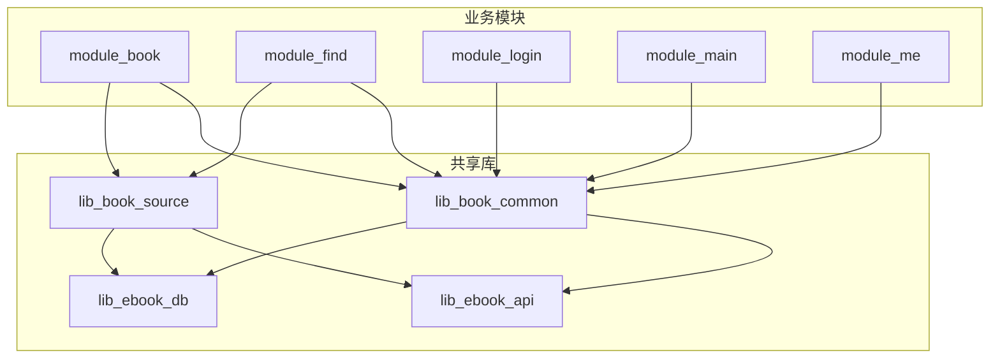
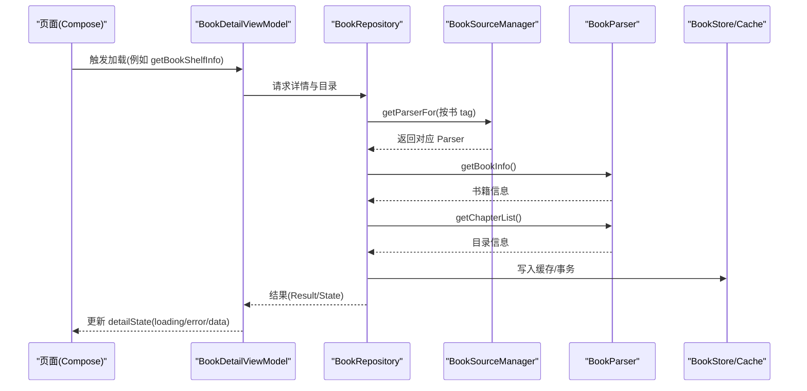
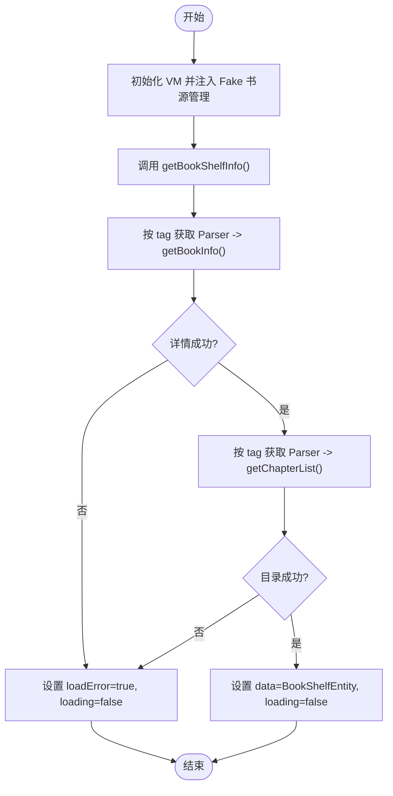
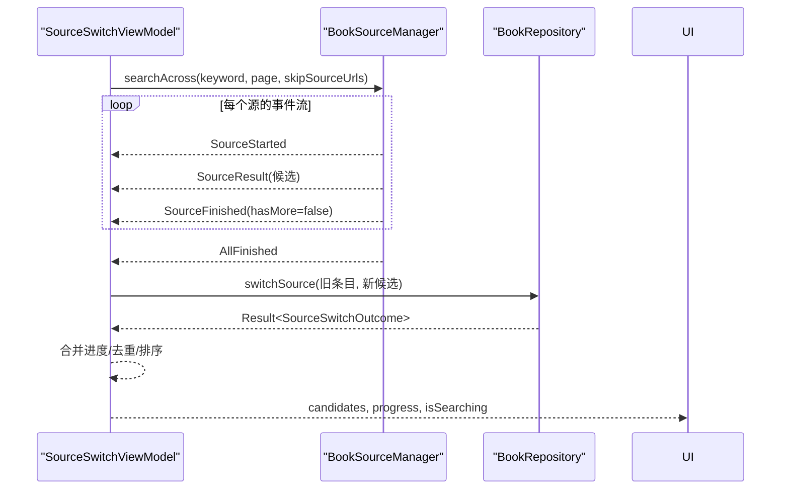
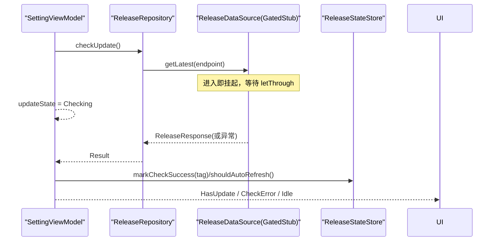
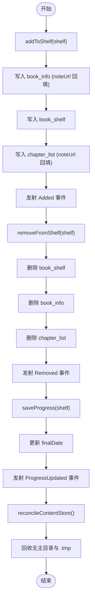
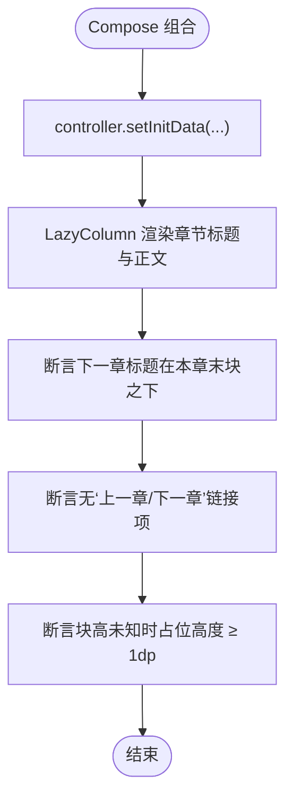
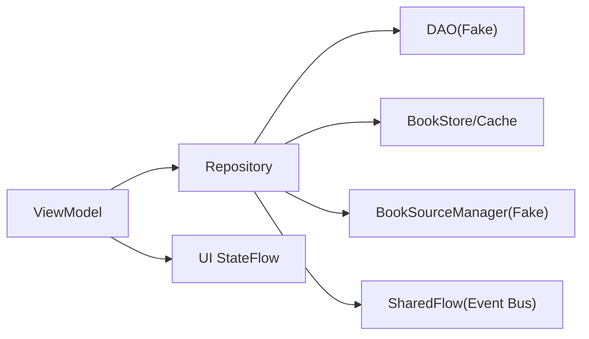

# MVVM 测试策略与实践

<cite>
**本文引用的文件**   
- [BookDetailViewModelSourceTest.kt](file://module_book/src/test/java/com/ebook/book/mvvm/viewmodel/BookDetailViewModelSourceTest.kt)
- [SourceSwitchViewModelTest.kt](file://module_book/src/test/java/com/ebook/book/mvvm/viewmodel/SourceSwitchViewModelTest.kt)
- [SettingViewModelTest.kt](file://module_me/src/test/java/com/ebook/me/mvvm/viewmodel/SettingViewModelTest.kt)
- [BookRepositoryTest.kt](file://lib_book_common/src/test/java/com/ebook/common/repository/BookRepositoryTest.kt)
- [FakeUserSessionManager.kt](file://lib_book_common/src/test/java/com/ebook/common/domain/FakeUserSessionManager.kt)
- [ReaderScrollSeamlessTest.kt](file://module_book/src/test/java/com/ebook/book/reader/ReaderScrollSeamlessTest.kt)
- [test-coverage-todo.md](file://docs/test-coverage-todo.md)
</cite>

## 目录
1. [简介](#简介)
2. [项目结构](#项目结构)
3. [核心组件](#核心组件)
4. [架构总览](#架构总览)
5. [详细组件分析](#详细组件分析)
6. [依赖关系分析](#依赖关系分析)
7. [性能考量](#性能考量)
8. [故障排查指南](#故障排查指南)
9. [结论](#结论)
10. [附录](#附录)

## 简介
本文件围绕 MVVM 架构中的 ViewModel 与 Repository 层，总结本仓库的单元测试策略、Mock/Fake 实践、协程与 Flow 异步测试方法、UI 状态与交互测试方式，并给出覆盖率提升与持续集成建议。文档以仓库中已有的测试用例为事实源，结合 ADR 与测试待办清单进行系统化整理，帮助读者快速掌握在 Android + Kotlin Coroutines + Flow + Compose 环境下的可测性设计与验证方法。

## 项目结构
- 模块分层清晰：业务模块（module_*）依赖共享库 lib_book_common；解析与书源逻辑集中在 lib_book_source；网络与数据库分别在 lib_ebook_api 与 lib_ebook_db。
- 测试按模块组织于各模块的 src/test 与 src/androidTest，JVM 单测优先（不依赖 Android 框架），需要 Android 上下文或渲染的用例使用 Robolectric。
- 测试基线与约定见仓库指南与 ADR：统一使用 JUnit 4、Kotlin 协程与 Flow、Robolectric 用于需要 Context/资源/Composable 渲染的场景；事件总线采用 SharedFlow。

**图表来源**
- [BookRepositoryTest.kt:35-82](file://lib_book_common/src/test/java/com/ebook/common/repository/BookRepositoryTest.kt#L35-L82)
- [test-coverage-todo.md:5-14](file://docs/test-coverage-todo.md#L5-L14)

**章节来源**
- [test-coverage-todo.md:5-14](file://docs/test-coverage-todo.md#L5-L14)

## 核心组件
- ViewModel 层：负责 UI 状态编排、命令通道与异步流程控制，通常继承 BaseViewModel/BaseRefreshViewModel，通过 Hilt 注入 Repository 与领域服务。
- Repository 层：聚合 DAO、存储、解析器与外部数据源，暴露稳定的领域 API；内部通过 SharedFlow 广播事件（如书架变更）。
- 数据访问：Room DAO 接口由 Fake/Stub 替换，避免引入真实数据库；必要时用临时目录隔离文件写入。
- 书源与解析：BookParser 与 BookSourceManager 提供按 tag 取源与跨源搜索能力，测试中通过内联 Fake 或 ScriptedManager 控制事件流。

**章节来源**
- [BookRepositoryTest.kt:35-82](file://lib_book_common/src/test/java/com/ebook/common/repository/BookRepositoryTest.kt#L35-L82)
- [SourceSwitchViewModelTest.kt:100-157](file://module_book/src/test/java/com/ebook/book/mvvm/viewmodel/SourceSwitchViewModelTest.kt#L100-L157)

## 架构总览
下图展示了“详情页按书绑源”的典型调用链：页面动作触发 ViewModel，VM 委托 Repository 通过 BookSourceManager 按书的 tag 获取对应 BookParser，再完成详情与目录的两次解析，最终将结果映射到 UI 状态。

**图表来源**
- [BookDetailViewModelSourceTest.kt:126-152](file://module_book/src/test/java/com/ebook/book/mvvm/viewmodel/BookDetailViewModelSourceTest.kt#L126-L152)
- [BookDetailViewModelSourceTest.kt:221-255](file://module_book/src/test/java/com/ebook/book/mvvm/viewmodel/BookDetailViewModelSourceTest.kt#L221-L255)

## 详细组件分析

### ViewModel 单元测试：按书绑源（BookDetailViewModel）
- 目标：确保详情页两次解析（详情与目录）都按该书的 tag 取 parser，全局默认源不被误用；当归属源缺失或目录失败时进入错误态并关闭 loading。
- 关键技巧：
  - 使用 Robolectric 提供 Application 上下文以解析字符串资源。
  - 自定义 StandardTestDispatcher 作为主线程调度器，并通过轮询 awaitUntil 等待 IO 协程落地，避免固定 sleep 导致的竞态。
  - 白名单 DAO Stub：仅允许被测路径调用的 DAO 方法返回空集合，其余方法抛错，防止静默假绿。
  - FakeSourceManager：最小化实现 getParserFor，记录调用顺序，便于断言“只问了该书的 tag”。

**图表来源**
- [BookDetailViewModelSourceTest.kt:154-187](file://module_book/src/test/java/com/ebook/book/mvvm/viewmodel/BookDetailViewModelSourceTest.kt#L154-L187)
- [BookDetailViewModelSourceTest.kt:197-213](file://module_book/src/test/java/com/ebook/book/mvvm/viewmodel/BookDetailViewModelSourceTest.kt#L197-L213)

**章节来源**
- [BookDetailViewModelSourceTest.kt:126-187](file://module_book/src/test/java/com/ebook/book/mvvm/viewmodel/BookDetailViewModelSourceTest.kt#L126-L187)

### ViewModel 单元测试：换源面板与聚合搜索（SourceSwitchViewModel）
- 目标：验证匹配度打分、排除当前源、候选排序稳定、去重、进度收尾（AllFinished）、异常处理与结果回传。
- 关键技巧：
  - 使用 ScriptedManager 按脚本序列发出 AggregateSearchEvent（Started/Result/Finished/AllFinished），模拟多源并发与丢失 Finished 的边界场景。
  - 通过白名单 DAO Stub 限定仓库落库范围，使测试聚焦 VM 编排与 Result 语义。
  - 使用 awaitUntil 等待真实 IO 协程落地，避免竞态。

**图表来源**
- [SourceSwitchViewModelTest.kt:213-230](file://module_book/src/test/java/com/ebook/book/mvvm/viewmodel/SourceSwitchViewModelTest.kt#L213-L230)
- [SourceSwitchViewModelTest.kt:334-354](file://module_book/src/test/java/com/ebook/book/mvvm/viewmodel/SourceSwitchViewModelTest.kt#L334-L354)
- [SourceSwitchViewModelTest.kt:358-394](file://module_book/src/test/java/com/ebook/book/mvvm/viewmodel/SourceSwitchViewModelTest.kt#L358-L394)

**章节来源**
- [SourceSwitchViewModelTest.kt:176-394](file://module_book/src/test/java/com/ebook/book/mvvm/viewmodel/SourceSwitchViewModelTest.kt#L176-L394)

### ViewModel 单元测试：版本检查与登出编排（SettingViewModel）
- 目标：锁定一次检查的结果如何被用户看到（failover/.apk 过滤等策略归仓库层），以及登出链路在 ViewModel 作用域内完成，保证旋转重建后仍可收尾。
- 关键技巧：
  - GatedStub ReleaseDataSource：进入即挂起，等待 letThrough 放行，用于控制时序与并发。
  - RecordingSessionManager：记录 clearSession 次数与调用日志，验证本地会话清理。
  - 轮询 awaitUntil：交替推进虚拟时钟与真实 IO 时间，避免竞态。

**图表来源**
- [SettingViewModelTest.kt:97-114](file://module_me/src/test/java/com/ebook/me/mvvm/viewmodel/SettingViewModelTest.kt#L97-L114)
- [SettingViewModelTest.kt:200-229](file://module_me/src/test/java/com/ebook/me/mvvm/viewmodel/SettingViewModelTest.kt#L200-L229)
- [SettingViewModelTest.kt:268-312](file://module_me/src/test/java/com/ebook/me/mvvm/viewmodel/SettingViewModelTest.kt#L268-L312)

**章节来源**
- [SettingViewModelTest.kt:200-312](file://module_me/src/test/java/com/ebook/me/mvvm/viewmodel/SettingViewModelTest.kt#L200-L312)

### Repository 单元测试：级联写入、事件总线与对账
- 目标：覆盖 addToShelf/removeFromShelf 级联、评论键查询、事件总线（Added/Removed/ProgressUpdated）、孤立记录清理、补章策略、内容仓库对账等。
- 关键技巧：
  - 手写 FakeDaos：集中维护插入/删除/查询等行为，便于断言中间状态。
  - TemporaryFolder：为每类用例隔离文件根目录，避免交叉污染。
  - DirectTransactionRunner：让事务块同步执行，便于断言事务边界。

**图表来源**
- [BookRepositoryTest.kt:86-111](file://lib_book_common/src/test/java/com/ebook/common/repository/BookRepositoryTest.kt#L86-L111)
- [BookRepositoryTest.kt:152-196](file://lib_book_common/src/test/java/com/ebook/common/repository/BookRepositoryTest.kt#L152-L196)
- [BookRepositoryTest.kt:337-351](file://lib_book_common/src/test/java/com/ebook/common/repository/BookRepositoryTest.kt#L337-L351)

**章节来源**
- [BookRepositoryTest.kt:86-351](file://lib_book_common/src/test/java/com/ebook/common/repository/BookRepositoryTest.kt#L86-L351)

### Mock/Fake 对象创建与使用
- FakeUserSessionManager：内存实现 UserSessionManager，同步 token 到 TokenHolder，支持 saveSession/rotateCredentials/clearSession/reset，用于纯 JVM 测试。
- 白名单 DAO Stub：通过 Proxy.newProxyInstance 限制方法白名单，未授权调用抛错，防止静默假绿。
- ScriptedManager：按脚本序列发出 AggregateSearchEvent，精确控制并发与结束条件，便于断言 VM 对事件的处置。
- FakeParser：最小化实现 BookParser，记录调用次数与失败分支，用于断言“只问了该书的 tag”。

**章节来源**
- [FakeUserSessionManager.kt:7-72](file://lib_book_common/src/test/java/com/ebook/common/domain/FakeUserSessionManager.kt#L7-L72)
- [BookDetailViewModelSourceTest.kt:197-213](file://module_book/src/test/java/com/ebook/book/mvvm/viewmodel/BookDetailViewModelSourceTest.kt#L197-L213)
- [SourceSwitchViewModelTest.kt:417-467](file://module_book/src/test/java/com/ebook/book/mvvm/viewmodel/SourceSwitchViewModelTest.kt#L417-L467)
- [BookDetailViewModelSourceTest.kt:257-286](file://module_book/src/test/java/com/ebook/book/mvvm/viewmodel/BookDetailViewModelSourceTest.kt#L257-L286)

### 协程与 Flow 测试策略
- 主线程调度器：StandardTestDispatcher 替换 Dispatchers.Main，配合 runTest/advanceUntilIdle 驱动测试。
- 真实 IO 协程：存在 withContext(Dispatchers.IO) 的路径不受虚拟时钟控制，需借助 awaitUntil 轮询可观察状态，避免固定等待导致竞态。
- Flow 事件：SharedFlow 无 replay，订阅需在写事件前完成（runCurrent），否则丢事件；测试中通过 backgroundScope.launch 收集并 runCurrent 确保订阅就绪。
- 异常处理：整条聚合流出问题时，AllFinished 可能不发出，需兜底收满进度并保留失败原因供 UI 渲染。

**章节来源**
- [BookDetailViewModelSourceTest.kt:107-124](file://module_book/src/test/java/com/ebook/book/mvvm/viewmodel/BookDetailViewModelSourceTest.kt#L107-L124)
- [SourceSwitchViewModelTest.kt:160-174](file://module_book/src/test/java/com/ebook/book/mvvm/viewmodel/SourceSwitchViewModelTest.kt#L160-L174)
- [BookRepositoryTest.kt:152-196](file://lib_book_common/src/test/java/com/ebook/common/repository/BookRepositoryTest.kt#L152-L196)

### UI 状态与交互测试（Compose）
- ReaderScrollSeamlessTest：使用 Robolectric @GraphicsMode(NATIVE) 与 createAndroidComposeRule<ComponentActivity>，断言滚屏容器的章界形态与占位行为。
- 关键点：
  - 跨章连续列表结构：下一章标题与正文在同一 LazyColumn，无“上一章/下一章”链接项。
  - 首次落点应用前不写进度，避免首帧误报。
  - 块高未知时占位不塌陷，保持可读 UI。

**图表来源**
- [ReaderScrollSeamlessTest.kt:57-89](file://module_book/src/test/java/com/ebook/book/reader/ReaderScrollSeamlessTest.kt#L57-L89)
- [ReaderScrollSeamlessTest.kt:111-130](file://module_book/src/test/java/com/ebook/book/reader/ReaderScrollSeamlessTest.kt#L111-L130)

**章节来源**
- [ReaderScrollSeamlessTest.kt:57-130](file://module_book/src/test/java/com/ebook/book/reader/ReaderScrollSeamlessTest.kt#L57-L130)

## 依赖关系分析
- 测试对依赖的隔离：通过 Fake/Stub 将 DAO、Repository 与外部数据源替换为可控实现，确保测试聚焦被测单元。
- 跨模块协作：VM 测试常注入 Repository，Repository 测试则注入 FakeDaos 与 BookStore，避免引入真实 Room/网络。
- 事件总线契约：SharedFlow 的事件（Added/Removed/ProgressUpdated）由 Repository 发射，VM 消费；测试通过收集事件并断言类型与数量。

**图表来源**
- [BookRepositoryTest.kt:35-82](file://lib_book_common/src/test/java/com/ebook/common/repository/BookRepositoryTest.kt#L35-L82)
- [SourceSwitchViewModelTest.kt:100-157](file://module_book/src/test/java/com/ebook/book/mvvm/viewmodel/SourceSwitchViewModelTest.kt#L100-L157)

**章节来源**
- [BookRepositoryTest.kt:35-82](file://lib_book_common/src/test/java/com/ebook/common/repository/BookRepositoryTest.kt#L35-L82)
- [SourceSwitchViewModelTest.kt:100-157](file://module_book/src/test/java/com/ebook/book/mvvm/viewmodel/SourceSwitchViewModelTest.kt#L100-L157)

## 性能考量
- 避免固定 sleep：使用 advanceUntilIdle 与 awaitUntil 轮询可观察状态，减少竞态导致的 flaky 测试。
- 事件订阅时机：SharedFlow 无 replay，先订阅再写事件，避免丢事件。
- 文件隔离：TemporaryFolder 隔离用例间文件写入，避免交叉污染影响性能与正确性。

[本节为通用指导，无需特定文件引用]

## 故障排查指南
- 常见问题：
  - 永久 loading：当归属源缺失或目录失败时，必须设置 loadError 并关闭 loading，避免覆盖层常驻。
  - 事件丢失：SharedFlow 晚订阅会丢事件，需确保订阅在写事件前完成。
  - 竞态：withContext(Dispatchers.IO) 不受虚拟时钟控制，需用 awaitUntil 等待真实 IO 协程落地。
- 定位方法：
  - 检查 Fake/Stub 是否限制了白名单方法，未授权调用应抛错。
  - 确认 ScriptedManager 是否正确发出 AllFinished，或在异常分支兜底收满进度。
  - 使用 awaitUntil 断言“可观察状态”而非固定时长。

**章节来源**
- [BookDetailViewModelSourceTest.kt:154-187](file://module_book/src/test/java/com/ebook/book/mvvm/viewmodel/BookDetailViewModelSourceTest.kt#L154-L187)
- [SourceSwitchViewModelTest.kt:294-354](file://module_book/src/test/java/com/ebook/book/mvvm/viewmodel/SourceSwitchViewModelTest.kt#L294-L354)
- [SettingViewModelTest.kt:78-91](file://module_me/src/test/java/com/ebook/me/mvvm/viewmodel/SettingViewModelTest.kt#L78-L91)

## 结论
本仓库的 MVVM 测试策略强调：
- 通过 Fake/Stub 隔离外部依赖，聚焦 VM 编排与 Repository 领域逻辑。
- 使用 Robolectric 与 Compose UI Test 验证 UI 状态与交互。
- 利用协程测试工具与 awaitUntil 模式解决异步竞态。
- 以事件总线契约与白名单 DAO 确保测试的确定性与可维护性。
后续可参考测试待办清单逐步补齐缺失覆盖（如下载队列重试、Compose 页面交互等），并持续优化 CI 配置以提升覆盖率与稳定性。

[本节为总结性内容，无需特定文件引用]

## 附录
- 测试覆盖率待办与人工装机验证清单详见 docs/test-coverage-todo.md，包含已覆盖项、未覆盖项与设备侧验证步骤。
- 建议在 CI 中增加：
  - ./gradlew test 全量 JVM 单测
  - ./gradlew :module_book:testDebugUnitTest 与 :module_me:testDebugUnitTest 等模块级测试
  - 可选 connectedAndroidTest 用于 Compose UI 与设备侧验证

**章节来源**
- [test-coverage-todo.md:5-14](file://docs/test-coverage-todo.md#L5-L14)