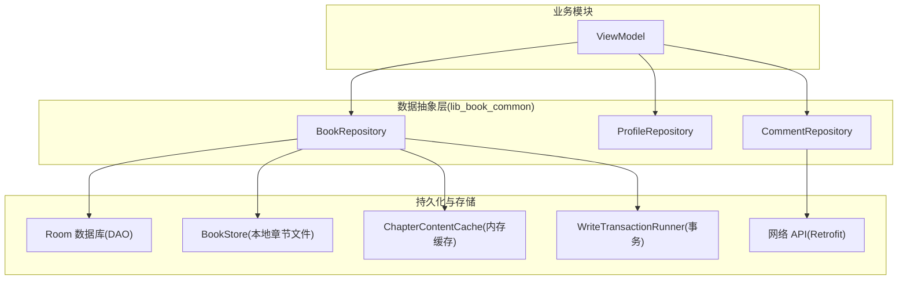
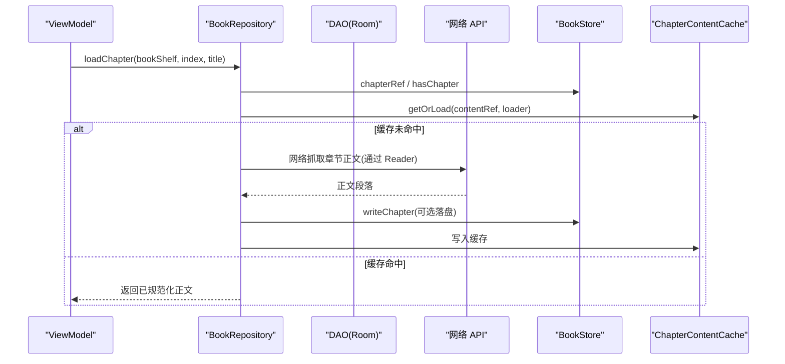
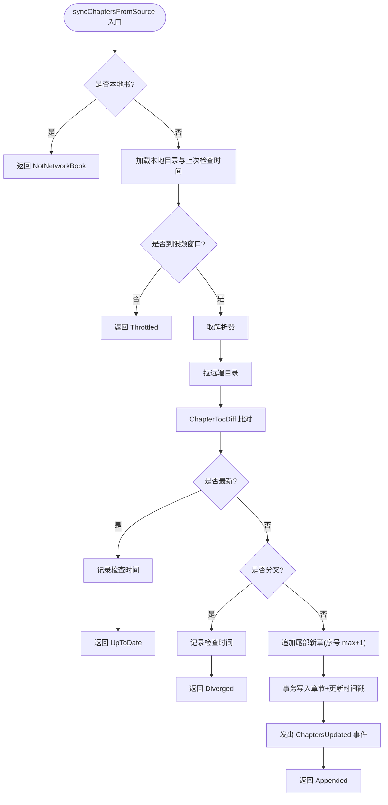
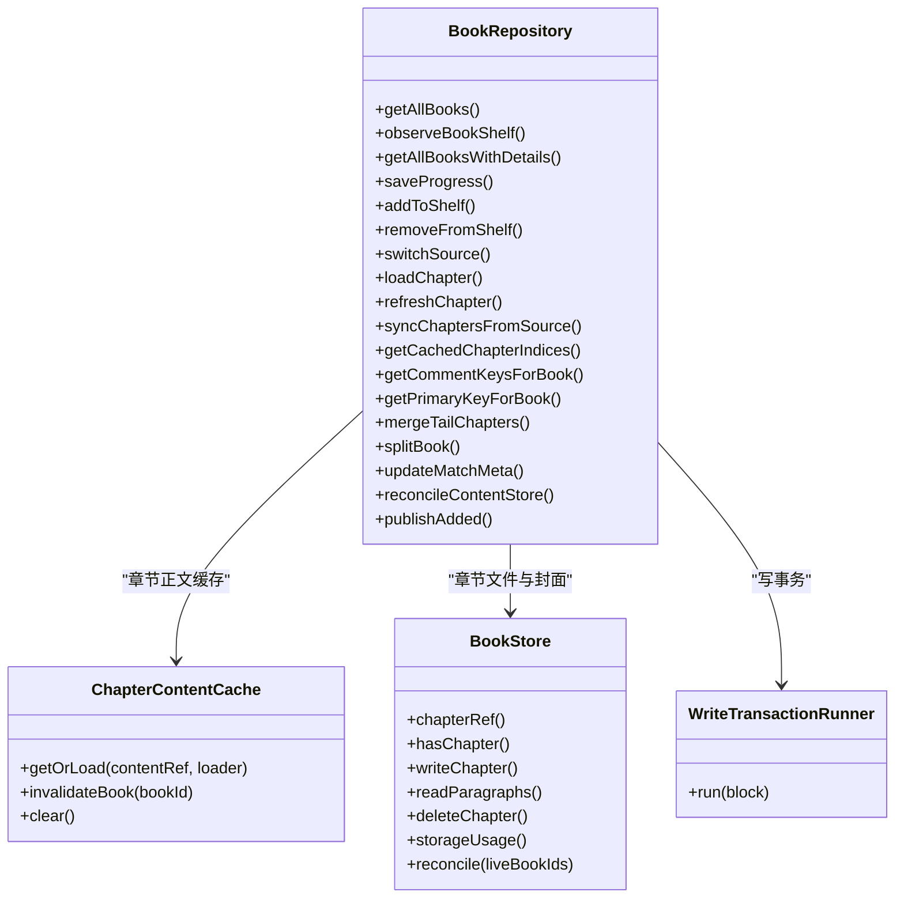
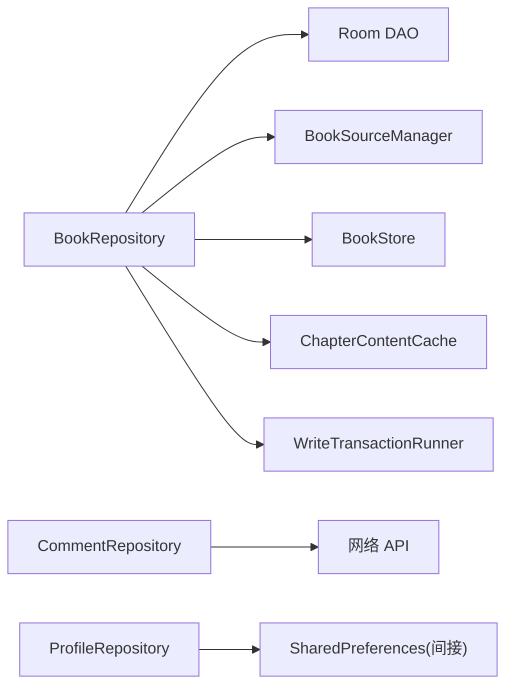

# Repository 模式与数据抽象

<cite>
**本文引用的文件**
- [BookRepository.kt](file://lib_book_common/src/main/java/com/ebook/common/repository/BookRepository.kt)
- [ProfileRepository.kt](file://lib_book_common/src/main/java/com/ebook/common/repository/ProfileRepository.kt)
- [CommentRepository.kt](file://lib_book_common/src/main/java/com/ebook/common/repository/CommentRepository.kt)
- [ChapterContentCache.kt](file://lib_book_common/src/main/java/com/ebook/common/store/ChapterContentCache.kt)
- [BookStore.kt](file://lib_book_common/src/main/java/com/ebook/common/store/BookStore.kt)
- [WriteTransactionRunner.kt](file://lib_book_common/src/main/java/com/ebook/common/store/WriteTransactionRunner.kt)
- [TransactionModule.kt](file://lib_book_common/src/main/java/com/ebook/common/di/TransactionModule.kt)
</cite>

## 目录
1. [引言](#引言)
2. [项目结构](#项目结构)
3. [核心组件](#核心组件)
4. [架构总览](#架构总览)
5. [详细组件分析](#详细组件分析)
6. [依赖关系分析](#依赖关系分析)
7. [性能考量](#性能考量)
8. [故障排查指南](#故障排查指南)
9. [结论](#结论)
10. [附录](#附录)

## 引言
本文件聚焦 MVVM 架构下的数据抽象层：以 Repository 为中心，统一封装本地数据库、网络 API 与本地内容存储，向上暴露稳定的领域接口。重点解析 BookRepository、ProfileRepository、CommentRepository 的职责边界、多数据源整合策略、Flow/SharedFlow 的数据流设计、缓存策略、错误处理与事务管理，并给出跨模块数据访问的最佳实践与性能优化建议。

## 项目结构
仓库采用多模块分层：业务模块通过 lib_book_common 的 Repository 层聚合 lib_ebook_db（Room）、lib_ebook_api（Retrofit）与本地 BookStore 内容仓库；ViewModel 仅持有仓库依赖，不感知底层实现细节。

图表来源
- [BookRepository.kt:38-74](file://lib_book_common/src/main/java/com/ebook/common/repository/BookRepository.kt#L38-L74)
- [CommentRepository.kt:16-20](file://lib_book_common/src/main/java/com/ebook/common/repository/CommentRepository.kt#L16-L20)
- [ProfileRepository.kt:12-21](file://lib_book_common/src/main/java/com/ebook/common/repository/ProfileRepository.kt#L12-L21)

章节来源
- [BookRepository.kt:38-74](file://lib_book_common/src/main/java/com/ebook/common/repository/BookRepository.kt#L38-L74)
- [CommentRepository.kt:16-20](file://lib_book_common/src/main/java/com/ebook/common/repository/CommentRepository.kt#L16-L20)
- [ProfileRepository.kt:12-21](file://lib_book_common/src/main/java/com/ebook/common/repository/ProfileRepository.kt#L12-L21)

## 核心组件
- BookRepository：书架与阅读的核心仓库，负责书籍 CRUD、阅读进度、章节正文统一读取、目录同步、换源、评论键合并/拆分/修键、事件发布与内容对账。
- ProfileRepository：用户个人信息状态仓库，使用 StateFlow 暴露头像与昵称，并在会话清理时重置内存态。
- CommentRepository：评论数据仓库，封装网络请求、分页、空键短路、领域模型映射与迁移逻辑。
- ChapterContentCache：章节正文内存缓存，按 content_ref 键命中，支持按书失效。
- BookStore：本地章节文件仓库，提供读写、导入提交、删除、占用统计与对账能力。
- WriteTransactionRunner + TransactionModule：统一的写事务入口，生产环境基于 Room 写事务。

章节来源
- [BookRepository.kt:38-866](file://lib_book_common/src/main/java/com/ebook/common/repository/BookRepository.kt#L38-L866)
- [ProfileRepository.kt:12-54](file://lib_book_common/src/main/java/com/ebook/common/repository/ProfileRepository.kt#L12-L54)
- [CommentRepository.kt:16-114](file://lib_book_common/src/main/java/com/ebook/common/repository/CommentRepository.kt#L16-L114)
- [ChapterContentCache.kt:7-63](file://lib_book_common/src/main/java/com/ebook/common/store/ChapterContentCache.kt#L7-L63)
- [BookStore.kt:8-216](file://lib_book_common/src/main/java/com/ebook/common/store/BookStore.kt#L8-L216)
- [WriteTransactionRunner.kt:1-13](file://lib_book_common/src/main/java/com/ebook/common/store/WriteTransactionRunner.kt#L1-L13)
- [TransactionModule.kt:12-24](file://lib_book_common/src/main/java/com/ebook/common/di/TransactionModule.kt#L12-L24)

## 架构总览
Repository 作为 MVVM 的“数据抽象层”，屏蔽 DAO、网络、本地存储与缓存细节，对外暴露领域语义方法；ViewModel 订阅 Flow/StateFlow 并驱动 UI。

图表来源
- [BookRepository.kt:455-475](file://lib_book_common/src/main/java/com/ebook/common/repository/BookRepository.kt#L455-L475)
- [ChapterContentCache.kt:35-46](file://lib_book_common/src/main/java/com/ebook/common/store/ChapterContentCache.kt#L35-L46)
- [BookStore.kt:39-60](file://lib_book_common/src/main/java/com/ebook/common/store/BookStore.kt#L39-L60)

## 详细组件分析

### BookRepository：多数据源整合与事件流
- 职责边界
  - 书架 CRUD、阅读进度保存、章节正文统一读取、目录重抓追加、阅读中换源、评论键并集读/主键写、内容对账、事件发布。
- 多数据源整合
  - 本地：Room DAO（book_shelf/book_info/chapter_list/book_group）。
  - 网络：通过 BookSourceManager 获取解析器，拉详情与目录；正文经 ChapterReader 路由（本地书 vs 网络书）。
  - 本地存储：BookStore 管理章节文件与封面；ChapterContentCache 做章级内存缓存。
- Flow/SharedFlow
  - bookShelfEvents: SharedFlow<BookShelfEvent> 用于书架增删、进度更新、目录变更等事件广播。
  - observeBookShelf(): Flow<List<BookShelfEntity>> 响应式查询，自动关联 bookInfo 并按序排序。
- 事务管理
  - 写操作统一经 WriteTransactionRunner.run {} 包裹，生产由 Room withWriteTransaction 保证原子性。
  - 换源 commitSwitch 在单一事务内完成“插新→吸收旧键→删旧→清旧队列”。
- 缓存策略
  - 章节正文先过 TextNormalizer 规范化再入内存缓存；按 content_ref 为键，支持按书失效。
  - 章节文件存在性判定走 BookStore.hasChapter，避免重复 IO。
- 错误处理
  - 网络/解析失败以 Result/特定异常上抛或返回明确枚举（如 ChapterSyncResult.Failed），调用方集中处置。
  - 限频判窗 isTocCheckDue 控制目录重抓频率，失败不写时间戳以便后续重试。
- 关键流程

图表来源
- [BookRepository.kt:512-600](file://lib_book_common/src/main/java/com/ebook/common/repository/BookRepository.kt#L512-L600)
- [BookRepository.kt:964-968](file://lib_book_common/src/main/java/com/ebook/common/repository/BookRepository.kt#L964-L968)

章节来源
- [BookRepository.kt:38-866](file://lib_book_common/src/main/java/com/ebook/common/repository/BookRepository.kt#L38-L866)

#### 类关系图（代码级）

图表来源
- [BookRepository.kt:38-866](file://lib_book_common/src/main/java/com/ebook/common/repository/BookRepository.kt#L38-L866)
- [ChapterContentCache.kt:25-63](file://lib_book_common/src/main/java/com/ebook/common/store/ChapterContentCache.kt#L25-L63)
- [BookStore.kt:37-216](file://lib_book_common/src/main/java/com/ebook/common/store/BookStore.kt#L37-L216)
- [WriteTransactionRunner.kt:11-13](file://lib_book_common/src/main/java/com/ebook/common/store/WriteTransactionRunner.kt#L11-L13)

### ProfileRepository：用户态 StateFlow 与一致性
- 使用 StateFlow 暴露头像与昵称，确保订阅者立即拿到当前值，且生命周期过渡期不丢失。
- 状态持久化到 SP；会话清理时通过内部 resetProfileState 仅重置内存镜像，SP 与持久会话由统一管理器负责。
- 适合在 ViewModel 中以 StateFlow 收集，驱动“我的”页面渲染。

章节来源
- [ProfileRepository.kt:12-54](file://lib_book_common/src/main/java/com/ebook/common/repository/ProfileRepository.kt#L12-L54)

### CommentRepository：网络 API 与领域映射
- 统一通过 CoroutineAdapter.safeApiCall 包装网络调用，返回 Result，便于上层处理成功/失败分支。
- 分页策略：默认 PAGE_SIZE=20，“我的评论”一次性大页加载待后续接入分页。
- 空键短路：当 commentKeys 为空时直接返回空页，避免触发后端全局列表行为带来的歧义。
- 领域模型映射：将 API 实体转换为 BookComment/BookCommentPage，隐藏传输细节。

章节来源
- [CommentRepository.kt:16-114](file://lib_book_common/src/main/java/com/ebook/common/repository/CommentRepository.kt#L16-L114)

## 依赖关系分析
- BookRepository 强依赖 Room DAO 与 BookSourceManager，解耦具体书源实现；同时组合 BookStore 与 ChapterContentCache，形成“网络/本地/缓存”三层读取路径。
- CommentRepository 仅依赖网络层与 DTO 映射，保持薄封装。
- ProfileRepository 无外部依赖，仅维护内存态与轻量持久化。
- 事务通过 WriteTransactionRunner 抽象，生产绑定 Room 写事务，测试可替换为纯 JVM 执行器，提升可测性与隔离性。

图表来源
- [BookRepository.kt:38-74](file://lib_book_common/src/main/java/com/ebook/common/repository/BookRepository.kt#L38-L74)
- [CommentRepository.kt:16-20](file://lib_book_common/src/main/java/com/ebook/common/repository/CommentRepository.kt#L16-L20)
- [TransactionModule.kt:12-24](file://lib_book_common/src/main/java/com/ebook/common/di/TransactionModule.kt#L12-L24)

## 性能考量
- 章节正文缓存：ChapterContentCache 容量小（默认 3），覆盖当前章及前后预读，避免每页重复 IO；按 content_ref 键命中，支持按书失效。
- 目录重抓限频：isTocCheckDue 基于 final_refresh_data 控制频率，避免频繁网络请求；失败不写时间戳以便下次重试。
- 批量写入与事务：换源与补章写入集中在事务内，减少锁竞争与中间态；追加新章索引取 max+1，避免覆盖已有章。
- 文件与缓存分离：BookStore 负责磁盘，ChapterContentCache 负责内存，二者通过 content_ref 协同，降低重复计算。
- 统计与对账：BookStore.storageUsage 一次遍历得出字节与册数，避免多次 IO；reconcile 回收无主目录与散落文件，防止空间泄漏。

[本节为通用性能建议，无需引用具体文件]

## 故障排查指南
- 章节无法加载
  - 检查 ChapterContentCache 是否命中；若未命中，确认 ChapterReader 是否正确注册对应格式；若仍失败，查看网络/解析异常。
  - 参考路径：[BookRepository.loadChapter](file://lib_book_common/src/main/java/com/ebook/common/repository/BookRepository.kt#L455-L475)、[ChapterContentCache.getOrLoad](file://lib_book_common/src/main/java/com/ebook/common/store/ChapterContentCache.kt#L35-L46)。
- 目录重抓无效
  - 检查限频窗口：isTocCheckDue 判断；若未到窗口则返回 Throttled。
  - 若返回 Failed，查看网络/解析异常原因；分叉情况会返回 Diverged，需用户处置。
  - 参考路径：[BookRepository.syncChaptersFromSource](file://lib_book_common/src/main/java/com/ebook/common/repository/BookRepository.kt#L512-L600)、[isTocCheckDue](file://lib_book_common/src/main/java/com/ebook/common/repository/BookRepository.kt#L964-L968)。
- 换源后数据不一致
  - 确认事务是否完整：commitSwitch 内顺序为“插新→吸收旧键→删旧→清旧队列”；若失败，Room 回滚应保证原子性。
  - 参考路径：[BookRepository.commitSwitch](file://lib_book_common/src/main/java/com/ebook/common/repository/BookRepository.kt#L411-L416)、[TransactionModule](file://lib_book_common/src/main/java/com/ebook/common/di/TransactionModule.kt#L12-L24)。
- 缓存未刷新
  - 确认是否调用 invalidateBook 或 deleteChapter；注意 content_ref 与 cacheMarker 的一致性。
  - 参考路径：[ChapterContentCache.invalidateBook](file://lib_book_common/src/main/java/com/ebook/common/store/ChapterContentCache.kt#L48-L53)、[BookStore.deleteChapter](file://lib_book_common/src/main/java/com/ebook/common/store/BookStore.kt#L106-L114)。

章节来源
- [BookRepository.kt:455-600](file://lib_book_common/src/main/java/com/ebook/common/repository/BookRepository.kt#L455-L600)
- [ChapterContentCache.kt:35-53](file://lib_book_common/src/main/java/com/ebook/common/store/ChapterContentCache.kt#L35-L53)
- [BookStore.kt:106-114](file://lib_book_common/src/main/java/com/ebook/common/store/BookStore.kt#L106-L114)
- [TransactionModule.kt:12-24](file://lib_book_common/src/main/java/com/ebook/common/di/TransactionModule.kt#L12-L24)

## 结论
本项目以 Repository 为核心构建数据抽象层：BookRepository 统一编排本地数据库、网络 API 与本地内容存储，并通过 Flow/SharedFlow 暴露稳定数据流；CommentRepository 与 ProfileRepository 分别专注网络评论与用户态。结合 ChapterContentCache 与 BookStore，实现了高效的章节正文缓存与文件管理；WriteTransactionRunner 抽象了写事务，保障复杂写操作的原子性。整体设计清晰、可测试性强，具备良好的扩展性与性能表现。

[本节为总结，无需引用具体文件]

## 附录
- 最佳实践
  - 仓库方法应保持领域语义，避免泄露底层实现细节（如 DAO/网络/缓存）。
  - 使用 Flow/StateFlow 表达可变状态与响应式数据流，ViewModel 仅消费而不修改。
  - 所有写操作尽量纳入事务块，避免部分提交导致的中间态。
  - 缓存键设计要稳定且可失效，content_ref 是章节正文的理想键。
  - 网络调用统一包装，返回 Result，上层集中处理错误与提示。
- 性能优化技巧
  - 优先命中内存缓存，其次本地文件，最后网络请求。
  - 目录重抓加限频，失败不写时间戳以便重试。
  - 批量写入合并为单事务，减少锁与 IO 次数。
  - 统计与对账一次性遍历，避免多次扫描。

[本节为通用指导，无需引用具体文件]