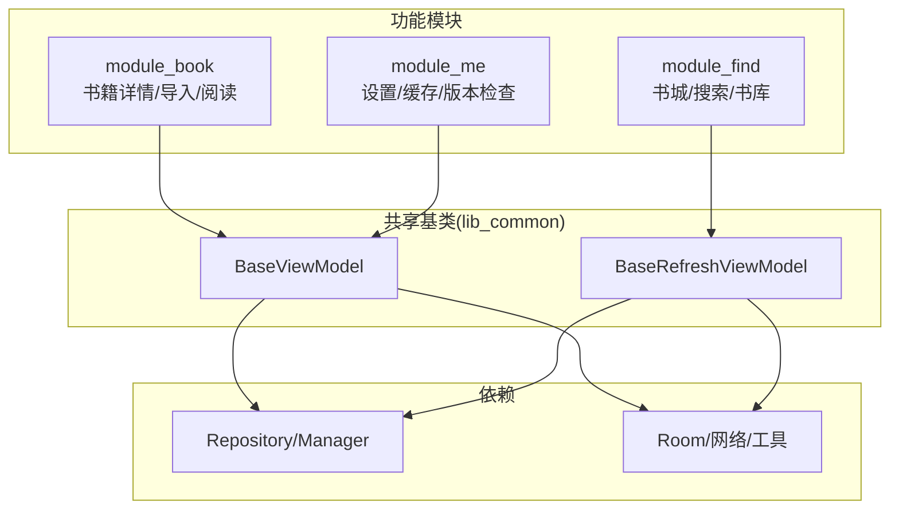
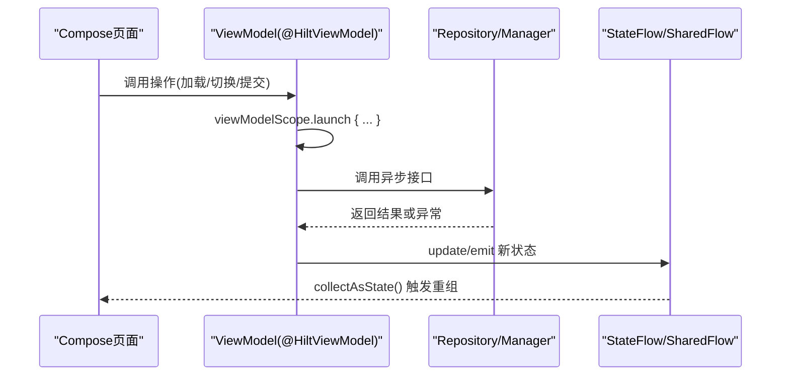
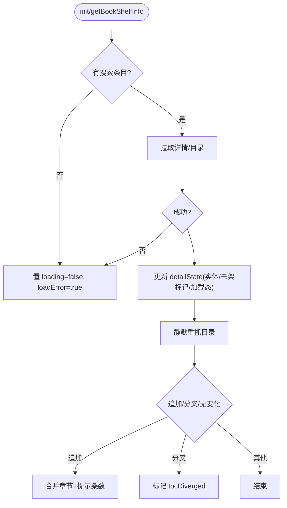
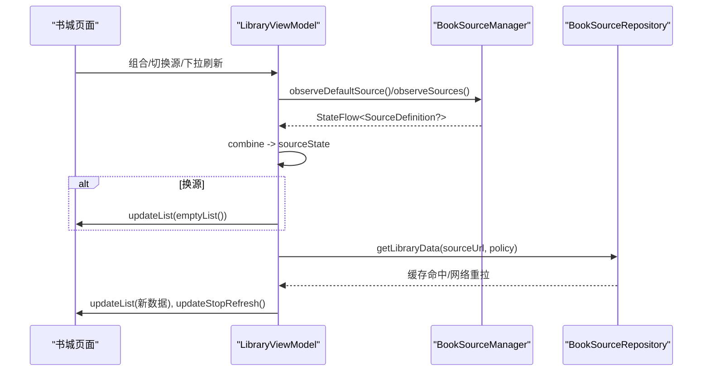
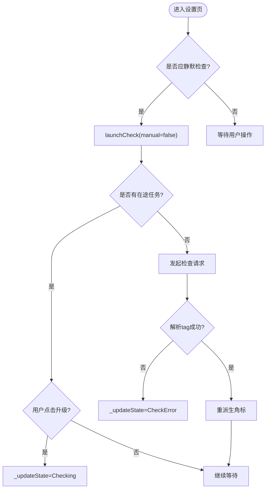
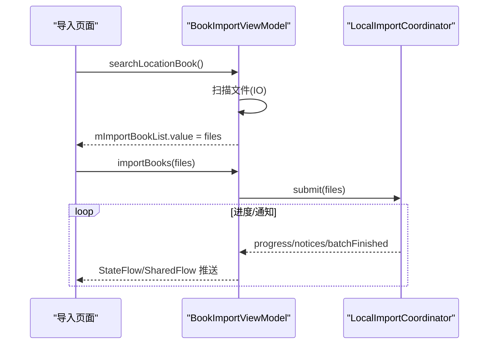
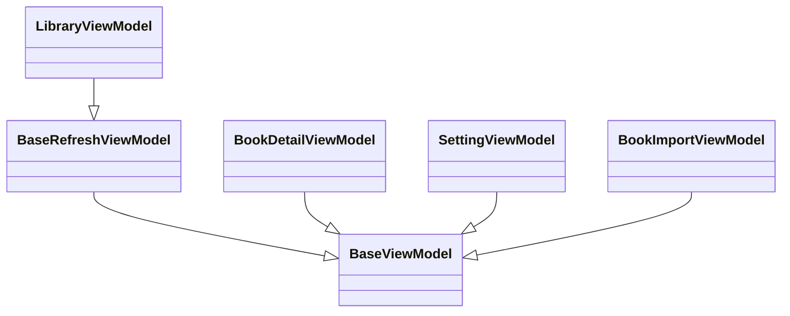

# ViewModel 模式与生命周期管理

<cite>
**本文引用的文件**
- [module_book/src/main/java/com/ebook/book/mvvm/viewmodel/BookDetailViewModel.kt](file://module_book/src/main/java/com/ebook/book/mvvm/viewmodel/BookDetailViewModel.kt)
- [module_find/src/main/java/com/ebook/find/mvvm/viewmodel/LibraryViewModel.kt](file://module_find/src/main/java/com/ebook/find/mvvm/viewmodel/LibraryViewModel.kt)
- [module_me/src/main/java/com/ebook/me/mvvm/viewmodel/SettingViewModel.kt](file://module_me/src/main/java/com/ebook/me/mvvm/viewmodel/SettingViewModel.kt)
- [module_book/src/main/java/com/ebook/book/mvvm/viewmodel/BookImportViewModel.kt](file://module_book/src/main/java/com/ebook/book/mvvm/viewmodel/BookImportViewModel.kt)
</cite>

## 目录
1. [引言](#引言)
2. [项目结构](#项目结构)
3. [核心组件](#核心组件)
4. [架构总览](#架构总览)
5. [详细组件分析](#详细组件分析)
6. [依赖关系分析](#依赖关系分析)
7. [性能考量](#性能考量)
8. [故障排查指南](#故障排查指南)
9. [结论](#结论)
10. [附录：示例与最佳实践清单](#附录示例与最佳实践清单)

## 引言
本文件聚焦于本项目中基于 Hilt 的 ViewModel 模式、生命周期管理与状态管理实践，围绕以下要点展开：
- Hilt @HiltViewModel 的使用方式与依赖注入机制在本项目的落地方式
- BaseViewModel 与 BaseRefreshViewModel 的职责边界与使用场景
- viewModelScope 的正确用法与协程作用域的生命周期对齐
- StateFlow / MutableStateFlow 的状态建模与最佳实践
- 结合真实 ViewModel 实现，给出状态管理、错误处理、数据同步的完整范式

## 项目结构
本项目采用多模块架构，业务逻辑集中在各功能模块（如 module_book、module_find、module_me），ViewModel 统一位于各模块 mvvm/viewmodel 目录下。基类来自外部共享库 lib_common（通过 com.xrn1997.common.mvvm.viewmodel 包引入），并通过 Hilt 完成构造期注入。页面侧以 Compose 为主，配合 Activity 基类消费 ViewModel 的命令通道（Toast、Finish 等）。

图示为概念性结构示意，便于理解模块间职责与基类归属。

## 核心组件
- Hilt @HiltViewModel：用于声明式创建并注入 ViewModel，构造函数参数由 Hilt 提供（仓库、管理器、上下文等）。
- BaseViewModel：通用 VM 基类，封装命令通道（如 sendToast/sendFinish）、覆盖层控制（updateOverlay）、以及无 Model 场景下的 NoOpModel 占位能力。
- BaseRefreshViewModel：在 BaseViewModel 之上，针对列表刷新场景提供统一的 refreshData/loadMore 与列表更新 API（updateList/updateStopRefresh/updateStopLoadMore）。
- StateFlow/MutableStateFlow：作为 UI 可观察状态的载体；配合 stateIn + SharingStarted 策略，将冷流转为热流并绑定到 viewModelScope，确保配置变更不丢失且订阅者可控。

章节来源
- [module_book/src/main/java/com/ebook/book/mvvm/viewmodel/BookDetailViewModel.kt:1-298](file://module_book/src/main/java/com/ebook/book/mvvm/viewmodel/BookDetailViewModel.kt#L1-L298)
- [module_find/src/main/java/com/ebook/find/mvvm/viewmodel/LibraryViewModel.kt:1-294](file://module_find/src/main/java/com/ebook/find/mvvm/viewmodel/LibraryViewModel.kt#L1-L294)
- [module_me/src/main/java/com/ebook/me/mvvm/viewmodel/SettingViewModel.kt:1-360](file://module_me/src/main/java/com/ebook/me/mvvm/viewmodel/SettingViewModel.kt#L1-L360)
- [module_book/src/main/java/com/ebook/book/mvvm/viewmodel/BookImportViewModel.kt:1-192](file://module_book/src/main/java/com/ebook/book/mvvm/viewmodel/BookImportViewModel.kt#L1-L192)

## 架构总览
下图展示典型页面到 ViewModel 再到 Repository/Manager 的数据流，以及 StateFlow 驱动的 UI 重组路径。

图示说明：
- VM 负责编排业务逻辑，所有耗时操作在 viewModelScope 内执行
- 通过 StateFlow/SharedFlow 暴露状态，UI 以 collectAsState 订阅
- 错误与提示通过基类命令通道下发，避免在 VM 中直接操作 UI

## 详细组件分析

### BookDetailViewModel：详情页状态收敛与事件同步
- 职责：维护详情页 UI 状态（实体、书架标记、加载中、失败态、目录分叉提示）；监听书架事件，保持“是否在书架”一致；从本地书架或搜索结果初始化详情；静默重抓目录并处理追加/分叉/失败。
- 关键点：
  - 单一 StateFlow(detailState) 驱动 Compose 重组，避免多处事件流与字段不同步问题
  - 使用 viewModelScope 收集跨页事件，保证旋转重建时只收集一次、幂等
  - 对失败进行“静默降级”，仅在不影响主流程的前提下记录日志或局部提示
  - 书源失效时通过 reportFailure 上报，避免用户被误导为“无源”

章节来源
- [module_book/src/main/java/com/ebook/book/mvvm/viewmodel/BookDetailViewModel.kt:25-298](file://module_book/src/main/java/com/ebook/book/mvvm/viewmodel/BookDetailViewModel.kt#L25-L298)

### LibraryViewModel：书城列表刷新与源切换
- 职责：维护书城可用源、当前默认源、分类入口与书库数据；处理下拉刷新、换源清空与增量更新；区分“无源/源坏/就绪/未知”的首帧语义。
- 关键点：
  - 继承 BaseRefreshViewModel，复用刷新/加载更多能力
  - 使用 StateFlow.combine 将 currentSource 与 _sourceUnusable 合成 sourceState，集中决定 UI 文案与行为
  - 首次进入 Unknown 首帧留空，避免误报“无源”
  - 换源时先清空列表再拉取，防止旧源残留导致错配
  - SWR 策略：进页/换源优先显示缓存，过期则后台重拉再推新值

章节来源
- [module_find/src/main/java/com/ebook/find/mvvm/viewmodel/LibraryViewModel.kt:27-294](file://module_find/src/main/java/com/ebook/find/mvvm/viewmodel/LibraryViewModel.kt#L27-L294)

### SettingViewModel：版本检查与主题/会话管理
- 职责：设置页的多项能力——缓存大小计算、版本检查弹窗与角标、外观主题切换、退出登录收尾。
- 关键点：
  - 使用 StateFlow 暴露 themeMode、hasUpdateAvailable、sourcesCount 等可观察状态
  - 版本检查支持主动与静默两种模式，共用一条在途任务，避免并发重复请求
  - 登出流程在 viewModelScope 中串行化：服务端作废 → 清本地会话 → 提示 + 关页，顺序严格
  - 通过 updateOverlay 与 sendToast/sendFinish 统一 UI 反馈

章节来源
- [module_me/src/main/java/com/ebook/me/mvvm/viewmodel/SettingViewModel.kt:34-343](file://module_me/src/main/java/com/ebook/me/mvvm/viewmodel/SettingViewModel.kt#L34-L343)

### BookImportViewModel：导入流程协调与状态投影
- 职责：扫描本地文件、发起批量导入、映射进程级协调器的进度/判重/通知到 UI 状态。
- 关键点：
  - 将进程级协调器状态投影为 StateFlow（importProgress、isImporting、duplicateState），确保页面销毁后仍可恢复
  - 使用 SharedFlow 发送一次性事件（searchFinishEvent/addSuccessEvent/addErrorEvent）
  - 批量导入在 coordinator 作用域运行，不受页面销毁取消影响
  - 扫描结果整体替换，避免重复叠加

章节来源
- [module_book/src/main/java/com/ebook/book/mvvm/viewmodel/BookImportViewModel.kt:28-192](file://module_book/src/main/java/com/ebook/book/mvvm/viewmodel/BookImportViewModel.kt#L28-L192)

## 依赖关系分析
- Hilt 注入：@HiltViewModel 标注的 ViewModel 通过 @Inject 构造函数获取 Repository/Manager/Context 等依赖，保证解耦与可测试性
- 基类依赖：BaseViewModel/BaseRefreshViewModel 提供命令通道与刷新框架，减少样板代码
- 状态流依赖：StateFlow/SharedFlow 作为 VM 对外状态契约，UI 通过 collectAsState 订阅，确保单向数据流

图表来源
- [module_book/src/main/java/com/ebook/book/mvvm/viewmodel/BookDetailViewModel.kt:52-56](file://module_book/src/main/java/com/ebook/book/mvvm/viewmodel/BookDetailViewModel.kt#L52-L56)
- [module_find/src/main/java/com/ebook/find/mvvm/viewmodel/LibraryViewModel.kt:102-106](file://module_find/src/main/java/com/ebook/find/mvvm/viewmodel/LibraryViewModel.kt#L102-L106)
- [module_me/src/main/java/com/ebook/me/mvvm/viewmodel/SettingViewModel.kt:62-71](file://module_me/src/main/java/com/ebook/me/mvvm/viewmodel/SettingViewModel.kt#L62-L71)
- [module_book/src/main/java/com/ebook/book/mvvm/viewmodel/BookImportViewModel.kt:39-42](file://module_book/src/main/java/com/ebook/book/mvvm/viewmodel/BookImportViewModel.kt#L39-L42)

## 性能考量
- 冷转热流：使用 stateIn(viewModelScope, SharingStarted.Eagerly|WhileSubscribed(...)) 将冷流转为热流，避免每次组合都重新建立上游链
- 首帧语义：Unknown 首帧留空，避免误导用户（书城示例）
- 去抖与节流：对于频繁操作（如切换源、下拉刷新）采用明确策略（换源清空、同源重拉不清）避免闪烁与重复请求
- 取消传播：在换源/销毁时及时 cancel 在途 Job，避免慢任务覆盖新状态
- 状态不可变更新：StateFlow 更新采用 copy 新对象，确保引用变化触发重组

## 故障排查指南
- 页面永不刷新：检查是否使用普通字段而非 StateFlow；确认 update 是否生成新对象引用
- 错误态无法恢复：检查 catch 分支是否正确更新 loading/loadError，避免永远卡在加载中
- 命令未生效：确认页面继承 BaseMvvmActivity 并使用 viewModels() 注入 VM，以便 MvvmBinder 消费命令通道
- 列表错乱：换源时先清空列表；列表 key 必须稳定唯一；分页追加需去重
- 版本检查无效：检查 tag 解析与限频窗口；“无法判定”不应写入成功时间戳

章节来源
- [module_book/src/main/java/com/ebook/book/mvvm/viewmodel/BookDetailViewModel.kt:103-154](file://module_book/src/main/java/com/ebook/book/mvvm/viewmodel/BookDetailViewModel.kt#L103-L154)
- [module_find/src/main/java/com/ebook/find/mvvm/viewmodel/LibraryViewModel.kt:239-289](file://module_find/src/main/java/com/ebook/find/mvvm/viewmodel/LibraryViewModel.kt#L239-L289)
- [module_me/src/main/java/com/ebook/me/mvvm/viewmodel/SettingViewModel.kt:214-289](file://module_me/src/main/java/com/ebook/me/mvvm/viewmodel/SettingViewModel.kt#L214-L289)

## 结论
本项目以 Hilt + ViewModel + Flow 为核心，构建清晰、可测试、易维护的 MVVM 架构。通过 BaseViewModel/BaseRefreshViewModel 统一命令与刷新范式，借助 StateFlow/SharedFlow 实现单向数据流与响应式 UI。实践中强调首帧语义、取消传播、状态不可变更新与错误降级，确保用户体验与系统健壮性。

## 附录：示例与最佳实践清单
- Hilt 注入
  - 使用 @HiltViewModel 标注 VM，@Inject 构造函数注入依赖
  - 纯展示 VM 使用 NoOpModel 占位，保持基类一致性
- 生命周期与作用域
  - 所有异步操作在 viewModelScope 内执行
  - 使用 Job 跟踪在途任务，换源/销毁时取消
- 状态管理
  - 使用 StateFlow 暴露可观察状态，MutableStateFlow 内部更新
  - 使用 stateIn 将冷流转为热流，合理选择 SharingStarted 策略
  - 事件用 SharedFlow 传递一次性动作
- 错误处理
  - 区分网络错误、业务错误与取消异常
  - 使用 reportFailure 上报会话相关错误，避免重复提示
  - 对失败进行降级处理，避免破坏主流程
- 数据同步
  - 列表换源先清空再拉取，避免脏数据
  - SWR 策略提升首屏速度，同时保证数据新鲜度
  - 事件总线（SharedFlow）用于跨组件事件同步（如书架事件）

章节来源
- [module_book/src/main/java/com/ebook/book/mvvm/viewmodel/BookDetailViewModel.kt:52-298](file://module_book/src/main/java/com/ebook/book/mvvm/viewmodel/BookDetailViewModel.kt#L52-L298)
- [module_find/src/main/java/com/ebook/find/mvvm/viewmodel/LibraryViewModel.kt:102-294](file://module_find/src/main/java/com/ebook/find/mvvm/viewmodel/LibraryViewModel.kt#L102-L294)
- [module_me/src/main/java/com/ebook/me/mvvm/viewmodel/SettingViewModel.kt:62-343](file://module_me/src/main/java/com/ebook/me/mvvm/viewmodel/SettingViewModel.kt#L62-L343)
- [module_book/src/main/java/com/ebook/book/mvvm/viewmodel/BookImportViewModel.kt:39-192](file://module_book/src/main/java/com/ebook/book/mvvm/viewmodel/BookImportViewModel.kt#L39-L192)