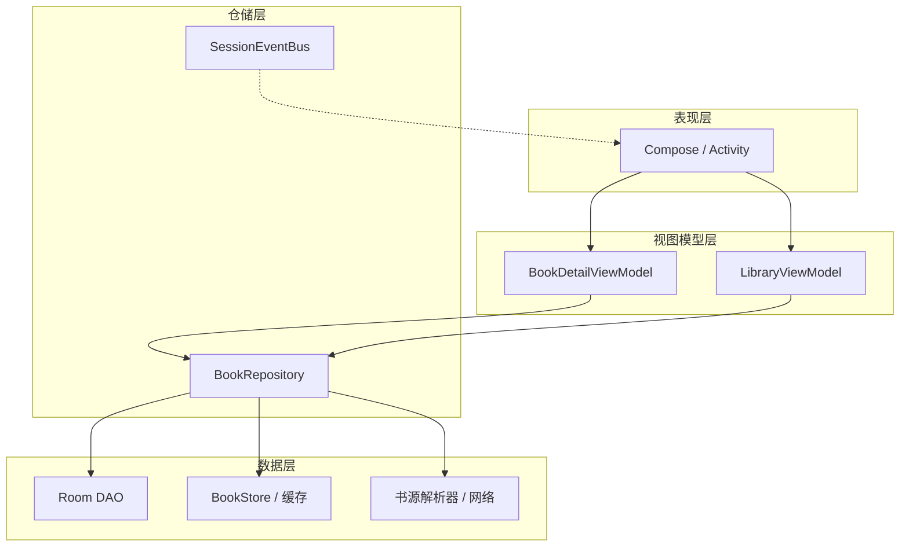
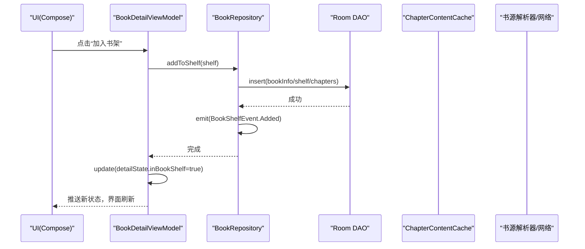
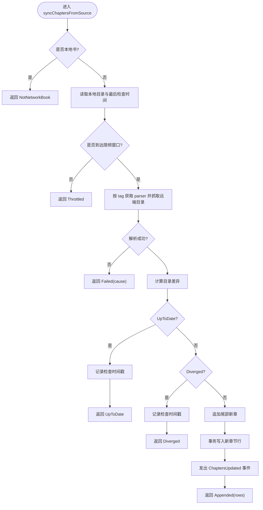
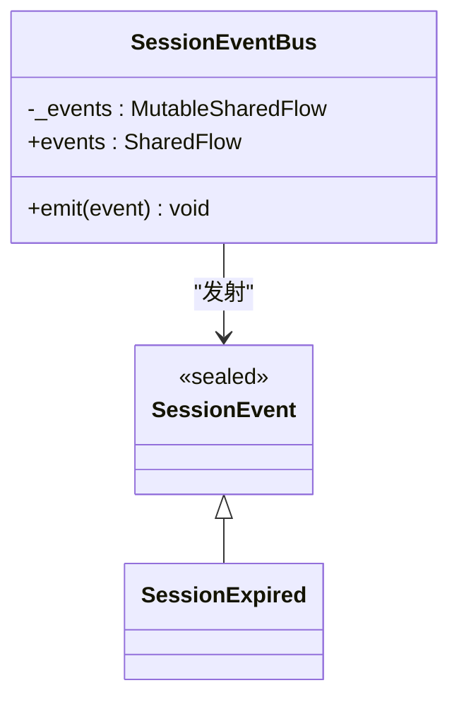
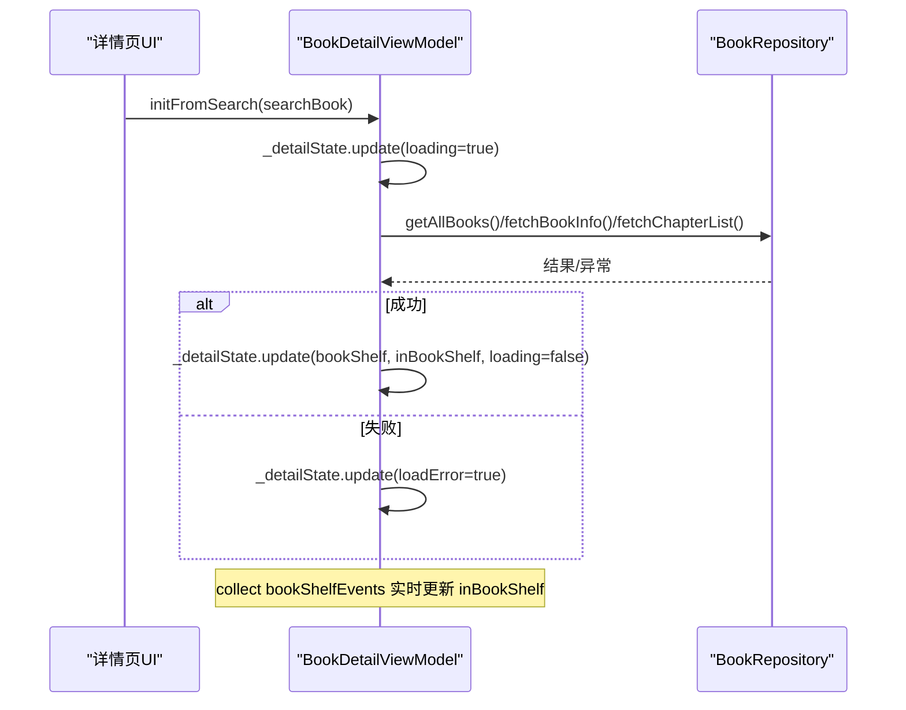
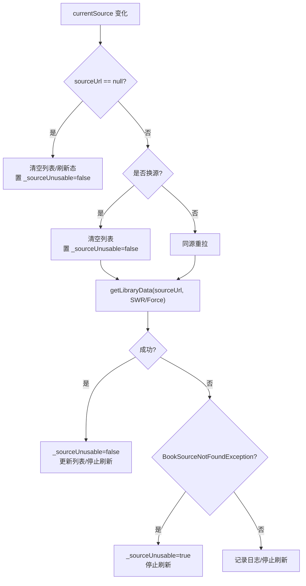
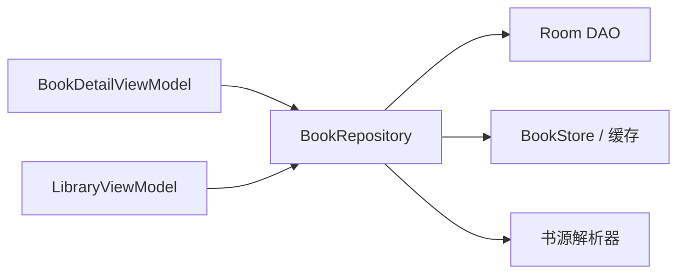

# 数据流与状态管理

<cite>
**本文引用的文件**
- [BookRepository.kt](file://lib_book_common/src/main/java/com/ebook/common/repository/BookRepository.kt)
- [SessionEventBus.kt](file://lib_ebook_api/src/main/java/com/ebook/api/auth/SessionEventBus.kt)
- [BookDetailViewModel.kt](file://module_book/src/main/java/com/ebook/book/mvvm/viewmodel/BookDetailViewModel.kt)
- [LibraryViewModel.kt](file://module_find/src/main/java/com/ebook/find/mvvm/viewmodel/LibraryViewModel.kt)
</cite>

## 目录
1. [简介](#简介)
2. [项目结构（与数据流相关）](#项目结构与数据流相关)
3. [核心组件](#核心组件)
4. [架构总览](#架构总览)
5. [详细组件分析](#详细组件分析)
6. [依赖关系分析](#依赖关系分析)
7. [性能考虑](#性能考虑)
8. [故障排查指南](#故障排查指南)
9. [结论](#结论)
10. [附录：选型原则与最佳实践](#附录选型原则与最佳实践)

## 简介
本文件聚焦 MVVM 架构下 Kotlin Coroutines + Flow 的数据流与状态管理实践，结合仓库中的实际实现，解释以下主题：
- StateFlow、SharedFlow、LiveData 的使用场景与选择原则
- 单向数据流与状态更新机制
- 事件总线设计（以 BookRepository.bookShelfEvents 为例）
- 复杂状态组合、异步数据流处理、错误传播的完整示例
- 状态持久化、内存泄漏防护的性能优化方案

本项目统一使用 Kotlin Coroutines + Flow（RxJava3 已移除），通过 Repository 暴露响应式数据源与一次性事件，ViewModel 负责组合状态并暴露给 UI，UI 层使用 Compose 订阅 StateFlow 驱动重组。

## 项目结构（与数据流相关）
围绕数据流的关键层次：
- 领域/仓储层：BookRepository 封装书架、章节、评论等数据的读写与事件发布；SessionEventBus 提供会话级全局事件。
- 业务视图层：各模块 ViewModel（如 BookDetailViewModel、LibraryViewModel）组合仓库流，计算页面状态并暴露 StateFlow。
- 表现层：Activity/Compose 订阅 ViewModel 暴露的状态流，进行界面渲染。

图示来源
- [BookRepository.kt:75-78](file://lib_book_common/src/main/java/com/ebook/common/repository/BookRepository.kt#L75-L78)
- [SessionEventBus.kt:30-44](file://lib_ebook_api/src/main/java/com/ebook/api/auth/SessionEventBus.kt#L30-L44)
- [BookDetailViewModel.kt:61-67](file://module_book/src/main/java/com/ebook/book/mvvm/viewmodel/BookDetailViewModel.kt#L61-L67)
- [LibraryViewModel.kt:123-167](file://module_find/src/main/java/com/ebook/find/mvvm/viewmodel/LibraryViewModel.kt#L123-L167)

章节来源
- [BookRepository.kt:75-78](file://lib_book_common/src/main/java/com/ebook/common/repository/BookRepository.kt#L75-L78)
- [SessionEventBus.kt:30-44](file://lib_ebook_api/src/main/java/com/ebook/api/auth/SessionEventBus.kt#L30-L44)
- [BookDetailViewModel.kt:61-67](file://module_book/src/main/java/com/ebook/book/mvvm/viewmodel/BookDetailViewModel.kt#L61-L67)
- [LibraryViewModel.kt:123-167](file://module_find/src/main/java/com/ebook/find/mvvm/viewmodel/LibraryViewModel.kt#L123-L167)

## 核心组件
- BookRepository
  - 暴露响应式数据：observeBookShelf() 返回 Flow<List<BookShelfEntity>>，用于观察书架全量数据变化。
  - 暴露一次性事件：bookShelfEvents SharedFlow<BookShelfEvent>，用于“加入书架/移出/进度更新/目录追加”等一次性通知。
  - 职责边界清晰：写操作在 IO 线程执行，事务性写入集中在 WriteTransactionRunner；失败路径返回 Result 或类型化异常。
- SessionEventBus
  - 会话级全局事件总线，使用 MutableSharedFlow(缓冲=1) 发射不可恢复的会话过期事件，避免阻塞请求线程。
- BookDetailViewModel
  - 维护详情页 UI 状态 detailState（StateFlow），订阅 bookShelfEvents 实时修正“是否在书架”、关闭页面等。
  - 组合异步任务：静默目录重抓、搜索入口拉取详情与目录、错误态置位与重试。
- LibraryViewModel
  - 书城主 Tab 的状态控制器：sources（切换器候选）、currentSource（当前默认源）、sourceState（页面展示判据）。
  - 将多路事实（当前源可用性、解析失败标记）合并为单一 state，驱动分类列表与书库数据加载策略（SWR/强制网络）。

章节来源
- [BookRepository.kt:81-100](file://lib_book_common/src/main/java/com/ebook/common/repository/BookRepository.kt#L81-L100)
- [BookRepository.kt:75-78](file://lib_book_common/src/main/java/com/ebook/common/repository/BookRepository.kt#L75-L78)
- [SessionEventBus.kt:30-44](file://lib_ebook_api/src/main/java/com/ebook/api/auth/SessionEventBus.kt#L30-L44)
- [BookDetailViewModel.kt:61-67](file://module_book/src/main/java/com/ebook/book/mvvm/viewmodel/BookDetailViewModel.kt#L61-L67)
- [LibraryViewModel.kt:123-167](file://module_find/src/main/java/com/ebook/find/mvvm/viewmodel/LibraryViewModel.kt#L123-L167)

## 架构总览
单向数据流在 MVVM 中体现为：
- UI → 用户交互触发 ViewModel 动作
- ViewModel → 调用 Repository 发起异步任务（协程）
- Repository → 访问数据库/存储/网络，并返回 Flow/Result
- Repository 通过 SharedFlow 广播一次性事件（如书架变更）
- ViewModel 组合多个 Flow（StateFlow/Flow）计算页面状态
- UI 订阅 StateFlow 驱动重组

图示来源
- [BookDetailViewModel.kt:211-225](file://module_book/src/main/java/com/ebook/book/mvvm/viewmodel/BookDetailViewModel.kt#L211-L225)
- [BookRepository.kt:143-146](file://lib_book_common/src/main/java/com/ebook/common/repository/BookRepository.kt#L143-L146)
- [BookRepository.kt:158-191](file://lib_book_common/src/main/java/com/ebook/common/repository/BookRepository.kt#L158-L191)
- [BookRepository.kt:75-78](file://lib_book_common/src/main/java/com/ebook/common/repository/BookRepository.kt#L75-L78)

## 详细组件分析

### BookRepository：数据流与事件总线
- 事件总线
  - 使用 MutableSharedFlow<BookShelfEvent>(extraBufferCapacity = 64) 作为一次性事件通道，对外暴露 SharedFlow 只读接口。
  - 事件包括 Added、Removed、ProgressUpdated、ChaptersUpdated，覆盖书架生命周期与目录变更。
- 响应式数据
  - observeBookShelf() 返回 Flow<List<BookShelfEntity>>，基于 DAO 的 Flow 结果做关联填充与过滤，保证下游拿到非空 bookInfo。
- 事务与一致性
  - switchSource 的网络解析在事务外，库内写集中到 transactions.run { commitSwitch(...) }，确保原子性；失败时回滚。
  - publishSwitched 仅在提交成功后广播 Removed+Added，顺序先旧后新，便于靠事件维护快照的消费方保持幂等。
- 章节正文读取与缓存
  - loadChapter 统一路由 ChapterReader，规范化后再经 ChapterContentCache 缓存；本地书走文件存在性判定，网络书命中缓存则直接返回。
- 目录重抓与限频
  - syncChaptersFromSource 通过 isTocCheckDue 控制限频窗口，仅当追加合法时才落库并发出 ChaptersUpdated；分叉不写时间戳也不发事件。

图示来源
- [BookRepository.kt:512-600](file://lib_book_common/src/main/java/com/ebook/common/repository/BookRepository.kt#L512-L600)
- [BookRepository.kt:964-968](file://lib_book_common/src/main/java/com/ebook/common/repository/BookRepository.kt#L964-L968)

章节来源
- [BookRepository.kt:75-78](file://lib_book_common/src/main/java/com/ebook/common/repository/BookRepository.kt#L75-L78)
- [BookRepository.kt:81-100](file://lib_book_common/src/main/java/com/ebook/common/repository/BookRepository.kt#L81-L100)
- [BookRepository.kt:143-146](file://lib_book_common/src/main/java/com/ebook/common/repository/BookRepository.kt#L143-L146)
- [BookRepository.kt:292-339](file://lib_book_common/src/main/java/com/ebook/common/repository/BookRepository.kt#L292-L339)
- [BookRepository.kt:455-475](file://lib_book_common/src/main/java/com/ebook/common/repository/BookRepository.kt#L455-L475)
- [BookRepository.kt:512-600](file://lib_book_common/src/main/java/com/ebook/common/repository/BookRepository.kt#L512-L600)

### SessionEventBus：会话级事件总线
- 使用 MutableSharedFlow(缓冲=1) 发射不可恢复的会话过期事件，采用 tryEmit 避免阻塞。
- 事件定义简洁：SessionExpired，由网络层触发，UI 层订阅并执行清会话+跳转登录页的统一处置。

图示来源
- [SessionEventBus.kt:30-44](file://lib_ebook_api/src/main/java/com/ebook/api/auth/SessionEventBus.kt#L30-L44)

章节来源
- [SessionEventBus.kt:30-44](file://lib_ebook_api/src/main/java/com/ebook/api/auth/SessionEventBus.kt#L30-L44)

### BookDetailViewModel：详情页状态组合
- 状态载体：detailState（MutableStateFlow -> StateFlow），包含 bookShelf、inBookShelf、loading、loadError、tocDiverged。
- 事件订阅：在 init 中收集 bookShelfEvents，更新 inBookShelf、根据 Removed 发送关闭命令。
- 异步流程：
  - 从书架入口：先渲染本地实体，再静默重抓目录（Append→提示条数；Diverged→常驻提示；其他静默）。
  - 从搜索入口：显示基本信息后拉详情与目录，失败置 loadError 且不清空已有实体。
- 错误传播：对 BookSourceNotFoundException 使用 reportFailure 上报，并在日志中记录原因，最终返回 null 让调用方设置错误态。

图示来源
- [BookDetailViewModel.kt:61-67](file://module_book/src/main/java/com/ebook/book/mvvm/viewmodel/BookDetailViewModel.kt#L61-L67)
- [BookDetailViewModel.kt:75-100](file://module_book/src/main/java/com/ebook/book/mvvm/viewmodel/BookDetailViewModel.kt#L75-L100)
- [BookDetailViewModel.kt:156-209](file://module_book/src/main/java/com/ebook/book/mvvm/viewmodel/BookDetailViewModel.kt#L156-L209)

章节来源
- [BookDetailViewModel.kt:61-67](file://module_book/src/main/java/com/ebook/book/mvvm/viewmodel/BookDetailViewModel.kt#L61-L67)
- [BookDetailViewModel.kt:75-100](file://module_book/src/main/java/com/ebook/book/mvvm/viewmodel/BookDetailViewModel.kt#L75-L100)
- [BookDetailViewModel.kt:156-209](file://module_book/src/main/java/com/ebook/book/mvvm/viewmodel/BookDetailViewModel.kt#L156-L209)

### LibraryViewModel：书城状态组合与加载策略
- 三股事实流：
  - sources：启用中的书源清单（stateIn Eagerly，首帧即热）。
  - currentSource：当前默认源（stateIn Eagerly，首帧为 null，表示“还不知道”）。
  - sourceState：combine(currentSource, _sourceUnusable) 得出 Ready/NoSource/BrokenSource，首帧 Unknown。
- 加载策略：
  - 进页/换源：StaleWhileRevalidate（缓存先上屏，随后重抓更新）。
  - 下拉刷新：ForceNetwork（强制网络，绕过缓存）。
- 错误处理：
  - BookSourceNotFoundException 置位 _sourceUnusable，引导区提示“换一个源/重导这条源”。
  - 普通异常仅停止刷新，不抛到上层导致崩溃。

图示来源
- [LibraryViewModel.kt:123-167](file://module_find/src/main/java/com/ebook/find/mvvm/viewmodel/LibraryViewModel.kt#L123-L167)
- [LibraryViewModel.kt:239-289](file://module_find/src/main/java/com/ebook/find/mvvm/viewmodel/LibraryViewModel.kt#L239-L289)

章节来源
- [LibraryViewModel.kt:123-167](file://module_find/src/main/java/com/ebook/find/mvvm/viewmodel/LibraryViewModel.kt#L123-L167)
- [LibraryViewModel.kt:239-289](file://module_find/src/main/java/com/ebook/find/mvvm/viewmodel/LibraryViewModel.kt#L239-L289)

## 依赖关系分析
- 耦合度
  - ViewModel 与 Repository 松耦合：通过接口注入，测试可替换假实现。
  - Repository 与 DAO/Store/Parser 解耦：通过构造参数注入，便于单测隔离 IO。
- 外部依赖
  - Room：DAO 暴露 Flow/List，Repository 负责组合与清理孤立记录。
  - BookStore/ChapterContentCache：负责章节文件的读写与内存缓存。
  - 书源解析器：按 tag 获取 Parser，网络请求在事务外进行，避免阻塞 Room 写线程。
- 循环依赖
  - 未发现循环依赖迹象；依赖方向遵循 module_* → lib_book_common → lib_ebook_api/db。

图示来源
- [BookDetailViewModel.kt:52-56](file://module_book/src/main/java/com/ebook/book/mvvm/viewmodel/BookDetailViewModel.kt#L52-L56)
- [LibraryViewModel.kt:102-106](file://module_find/src/main/java/com/ebook/find/mvvm/viewmodel/LibraryViewModel.kt#L102-L106)
- [BookRepository.kt:52-74](file://lib_book_common/src/main/java/com/ebook/common/repository/BookRepository.kt#L52-L74)

章节来源
- [BookDetailViewModel.kt:52-56](file://module_book/src/main/java/com/ebook/book/mvvm/viewmodel/BookDetailViewModel.kt#L52-L56)
- [LibraryViewModel.kt:102-106](file://module_find/src/main/java/com/ebook/find/mvvm/viewmodel/LibraryViewModel.kt#L102-L106)
- [BookRepository.kt:52-74](file://lib_book_common/src/main/java/com/ebook/common/repository/BookRepository.kt#L52-L74)

## 性能考虑
- 事件总线缓冲
  - SessionEventBus 使用 extraBufferCapacity=1，避免重复过期风暴阻塞；tryEmit 丢弃重复事件，保证非阻塞。
- 共享流启动策略
  - LibraryViewModel 的 sources/currentSource/sourceState 使用 SharingStarted.Eagerly，保证主 Tab 首帧前即为热流，减少首次渲染空白。
- 事务边界
  - switchSource 将网络解析放在事务外，仅将必要的写操作放入 WriteTransactionRunner 的一个事务，缩短 Room 写锁持有时间。
- 缓存与去重
  - 章节内容经 ChapterContentCache 缓存，loadChapter 命中则直接返回；目录重抓仅追加合法新章，避免无效失效与重复请求。
- 限频控制
  - 目录重抓通过 isTocCheckDue 限制频率，避免频繁网络请求；得出结论（UpToDate/Diverged）才写时间戳，失败不写以便下次重试。

[本节为通用性能建议，无需特定文件引用]

## 故障排查指南
- 详情页永远不刷新
  - 现象：网络拉取完成后页面未更新。
  - 根因：历史使用普通字段，Compose 重组不感知；解决方案：收敛为 StateFlow（detailState），见 BookDetailViewModel 的状态定义。
- 书城“没有可用书源”误导
  - 现象：有源但首帧显示“无源”。
  - 根因：直接把 currentSource 的 null 当成无源；解决方案：引入 Unknown 首帧占位，sourceState 在 combine 后才给出真实状态。
- 会话过期风暴
  - 现象：多次过期事件导致 UI 重复处理。
  - 根因：事件堆积阻塞；解决方案：SessionEventBus 使用缓冲=1 的 SharedFlow + tryEmit，重复事件丢弃。
- 目录重抓误报
  - 现象：目录重抓频繁失败或误判分叉。
  - 根因：未区分失败与分叉、或未正确写时间戳；解决方案：仅 UpToDate/Diverged 写时间戳，失败不写，按需重试。

章节来源
- [BookDetailViewModel.kt:25-50](file://module_book/src/main/java/com/ebook/book/mvvm/viewmodel/BookDetailViewModel.kt#L25-L50)
- [LibraryViewModel.kt:42-76](file://module_find/src/main/java/com/ebook/find/mvvm/viewmodel/LibraryViewModel.kt#L42-L76)
- [SessionEventBus.kt:30-44](file://lib_ebook_api/src/main/java/com/ebook/api/auth/SessionEventBus.kt#L30-L44)
- [BookRepository.kt:556-600](file://lib_book_common/src/main/java/com/ebook/common/repository/BookRepository.kt#L556-L600)

## 结论
本项目在 MVVM 架构下严格遵循单向数据流：
- Repository 暴露 Flow 数据与 SharedFlow 事件，ViewModel 组合状态，UI 订阅 StateFlow。
- 事件总线采用 SharedFlow，保证一次性事件的正确性与非阻塞。
- 复杂状态通过 combine/map/stateIn 组合，首帧占位避免误导。
- 事务与缓存合理划分，提升性能与一致性。
- 错误传播明确，UI 能给出可读反馈。

[本节总结性内容，无需特定文件引用]

## 附录：选型原则与最佳实践
- StateFlow vs SharedFlow vs LiveData
  - StateFlow：适合“最近值+订阅者”，如页面状态（detailState、sourceState）。
  - SharedFlow：适合“一次性事件”，如书架事件、会话过期事件。
  - LiveData：项目中未使用；统一使用 Flow，避免混合带来的复杂度。
- 单向数据流
  - UI 不直接修改状态，所有变更经由 ViewModel 调用 Repository，Repository 通过 Flow/事件回推。
- 复杂状态组合
  - 使用 combine/map/stateIn 将多路事实合并为单一状态，避免页面多处分支判断。
- 异步数据流处理
  - 协程作用域（viewModelScope）管理生命周期；取消异常不吞掉，避免销毁中页面错误态。
- 错误传播
  - Repository 返回 Result 或抛出类型化异常；ViewModel 捕获并转化为 UI 可理解的错误态。
- 状态持久化
  - 通过 Room 持久化核心状态；UI 状态（如 tocDiverged）仅内存态，重启后重新计算。
- 内存泄漏防护
  - 使用 viewModelScope 收集流，随 VM 销毁自动取消；SharedFlow 缓冲有限，避免堆积。
  - 避免在 Application 中 eager 注入对象，防止沙箱进程启动问题。

[本节为通用最佳实践，无需特定文件引用]