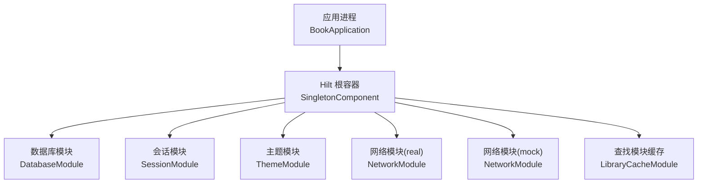
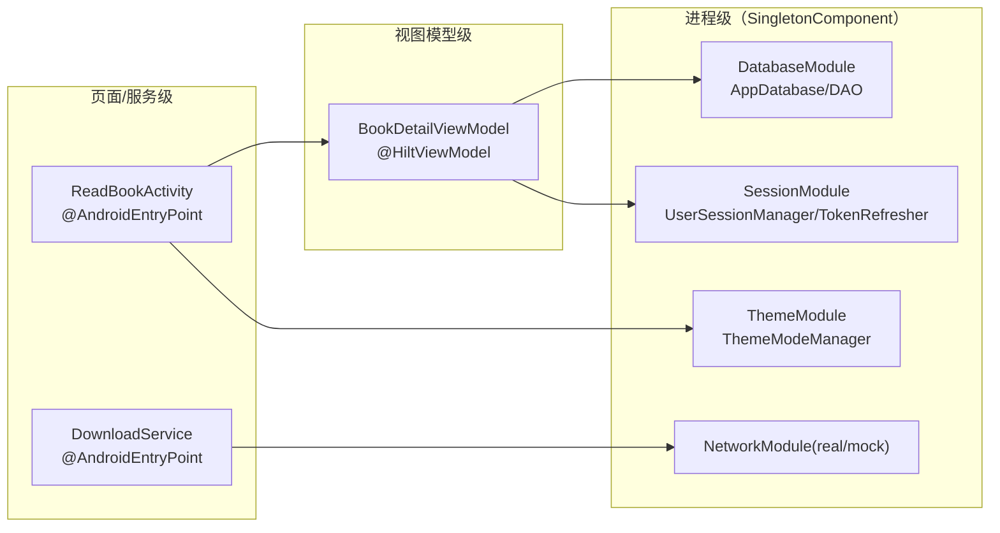
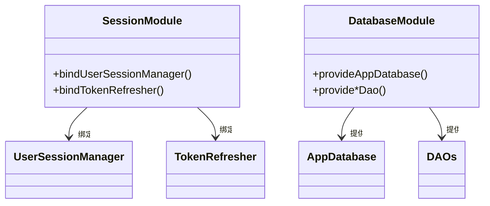
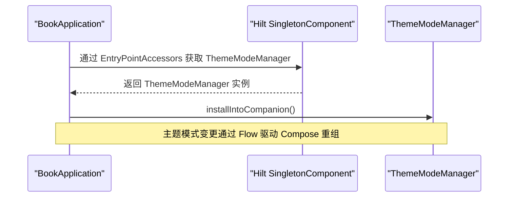
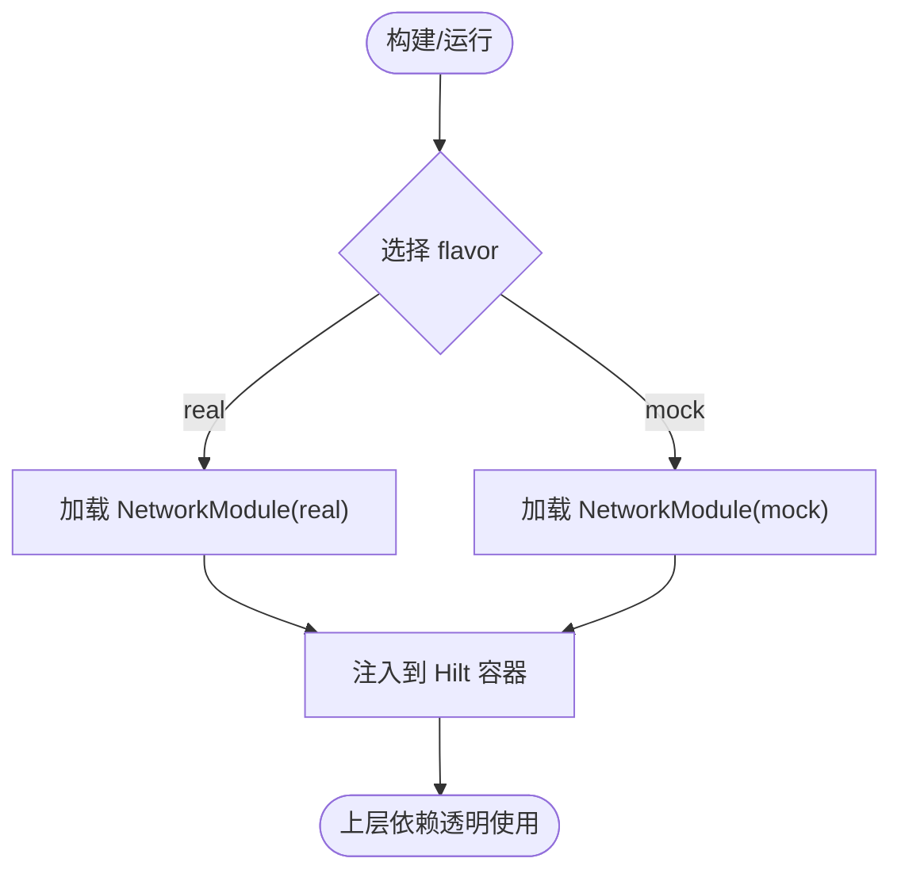
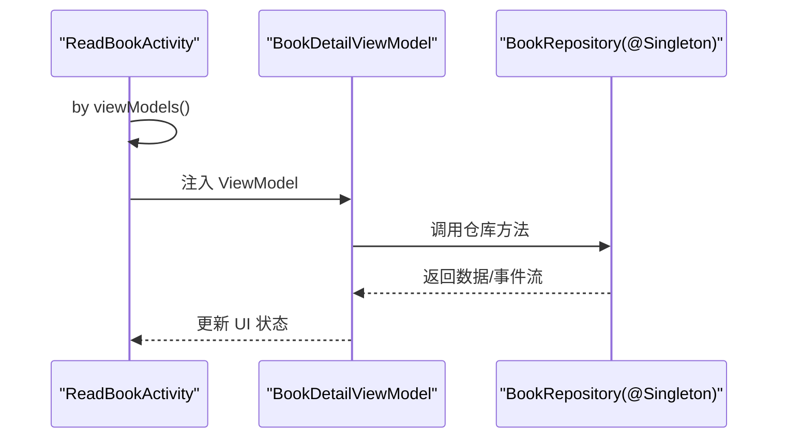
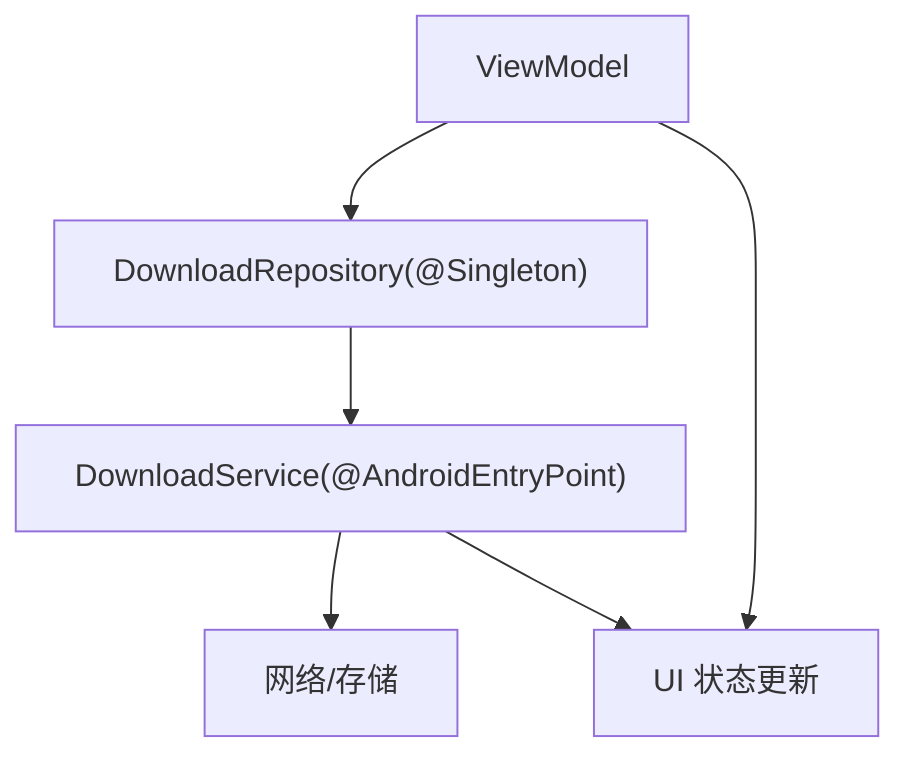
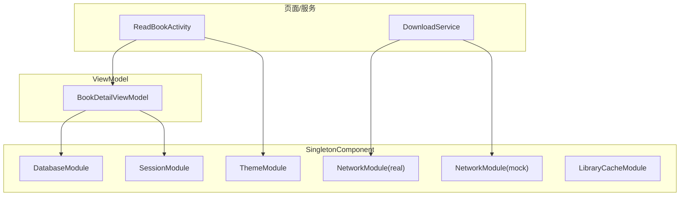

# 作用域管理与生命周期

<cite>
**本文引用的文件**
- [BookApplication.kt](file://lib_book_common/src/main/java/com/ebook/common/BookApplication.kt)
- [HiltConventionPlugin.kt](file://build-logic/convention/src/main/kotlin/HiltConventionPlugin.kt)
- [SessionModule.kt](file://lib_book_common/src/main/java/com/ebook/common/di/SessionModule.kt)
- [ThemeModule.kt](file://lib_book_common/src/main/java/com/ebook/common/di/ThemeModule.kt)
- [DatabaseModule.kt](file://lib_ebook_db/src/main/java/com/ebook/db/di/DatabaseModule.kt)
- [NetworkModule (real).kt](file://module_app/src/real/java/com/ebook/di/NetworkModule.kt)
- [NetworkModule (mock).kt](file://module_app/src/mock/java/com/ebook/di/NetworkModule.kt)
- [LibraryCacheModule.kt](file://module_find/src/main/java/com/ebook/find/di/LibraryCacheModule.kt)
- [BookRepository.kt](file://lib_book_common/src/main/java/com/ebook/common/repository/BookRepository.kt)
- [DownloadRepository.kt](file://module_book/src/main/java/com/ebook/book/repository/DownloadRepository.kt)
- [BookDetailViewModel.kt](file://module_book/src/main/java/com/ebook/book/mvvm/viewmodel/BookDetailViewModel.kt)
- [ReadBookActivity.kt](file://module_book/src/main/java/com/ebook/book/ReadBookActivity.kt)
- [DownloadService.kt](file://module_book/src/main/java/com/ebook/book/service/DownloadService.kt)
</cite>

## 目录
1. [简介](#简介)
2. [项目结构中的 Hilt 与模块装配](#项目结构中的-hilt-与模块装配)
3. [核心组件与作用域总览](#核心组件与作用域总览)
4. [架构总览](#架构总览)
5. [详细组件分析](#详细组件分析)
6. [依赖关系与作用域图](#依赖关系与作用域图)
7. [性能与内存考量](#性能与内存考量)
8. [故障排查指南](#故障排查指南)
9. [结论](#结论)

## 简介
本文件聚焦于本仓库中基于 Hilt 的作用域管理与生命周期实践，覆盖以下主题：
- 作用域概念与适用场景：@Singleton、@ActivityScoped、@FragmentScoped 等（结合项目实际使用）
- 单例对象的生命周期：创建时机、销毁时机、内存泄漏防护
- ViewModel 作用域的特殊性与注意事项
- 跨作用域的依赖传递与生命周期同步机制
- 作用域冲突的检测与解决方法
- 代码级示例路径与最佳实践
- 设计原则与常见问题解决方案

## 项目结构中的 Hilt 与模块装配
- 构建期通过约定插件统一引入 KSP 与 Hilt Android 插件，避免在各模块重复配置。
- 应用入口 BookApplication 通过 EntryPointAccessors 从 SingletonComponent 获取 ThemeModeManager，说明主题管理走全局单例作用域。
- 数据层以 DatabaseModule 提供 Room AppDatabase 与各 DAO，统一注入为 @Singleton。
- 会话与会话刷新能力通过 SessionModule 将接口绑定到具体实现，并标记为 @Singleton。
- 网络层在 module_app 中按 flavor 提供 NetworkModule（real/mock），用于切换真实后端或 Mock 服务。
- 功能模块如 find 的 LibraryCacheModule 提供缓存相关依赖，遵循模块内 DI 边界。

**图表来源**
- [HiltConventionPlugin.kt:24-48](file://build-logic/convention/src/main/kotlin/HiltConventionPlugin.kt#L24-L48)
- [DatabaseModule.kt:192-208](file://lib_ebook_db/src/main/java/com/ebook/db/di/DatabaseModule.kt#L192-L208)
- [SessionModule.kt:22-37](file://lib_book_common/src/main/java/com/ebook/common/di/SessionModule.kt#L22-L37)
- [ThemeModule.kt:17-26](file://lib_book_common/src/main/java/com/ebook/common/di/ThemeModule.kt#L17-L26)
- [NetworkModule (real).kt](file://module_app/src/real/java/com/ebook/di/NetworkModule.kt)
- [NetworkModule (mock).kt](file://module_app/src/mock/java/com/ebook/di/NetworkModule.kt)
- [LibraryCacheModule.kt](file://module_find/src/main/java/com/ebook/find/di/LibraryCacheModule.kt)

**章节来源**
- [HiltConventionPlugin.kt:24-48](file://build-logic/convention/src/main/kotlin/HiltConventionPlugin.kt#L24-L48)
- [BookApplication.kt:17-59](file://lib_book_common/src/main/java/com/ebook/common/BookApplication.kt#L17-L59)

## 核心组件与作用域总览
- 单例作用域（@Singleton）
  - 适用于无状态或进程级共享状态的对象，例如数据库连接、会话管理器、主题模式管理器、仓库类等。
  - 优点：生命周期长、易于共享；风险：易成为隐式全局、增加耦合与内存占用。
- Activity/Fragment 作用域（@ActivityScoped / @FragmentScoped）
  - 适用于与 UI 组件同生命周期的依赖，如页面级控制器、UI 相关资源等。
  - 注意：需确保依赖不持有 Activity/Fragment 强引用，避免泄漏。
- ViewModel 作用域（@HiltViewModel）
  - 由 Hilt 与 Lifecycle 协作管理，随 ViewModelStoreOwner 生命周期存在。
  - 适合承载 UI 状态与业务编排逻辑，但不建议直接持有 UI 引用。

在本项目中：
- 数据层仓库与基础设施多为 @Singleton，贯穿整个应用。
- 页面与 Service 通过 @AndroidEntryPoint 接入 Hilt，配合 @HiltViewModel 使用。
- 应用启动阶段通过 EntryPointAccessors 取用单例，规避 Application 上 eager 注入导致的沙箱进程问题。

**章节来源**
- [SessionModule.kt:22-37](file://lib_book_common/src/main/java/com/ebook/common/di/SessionModule.kt#L22-L37)
- [ThemeModule.kt:17-26](file://lib_book_common/src/main/java/com/ebook/common/di/ThemeModule.kt#L17-L26)
- [DatabaseModule.kt:192-242](file://lib_ebook_db/src/main/java/com/ebook/db/di/DatabaseModule.kt#L192-L242)
- [BookRepository.kt:38-50](file://lib_book_common/src/main/java/com/ebook/common/repository/BookRepository.kt#L38-L50)
- [DownloadRepository.kt:41-44](file://module_book/src/main/java/com/ebook/book/repository/DownloadRepository.kt#L41-L44)
- [BookDetailViewModel.kt:52](file://module_book/src/main/java/com/ebook/book/mvvm/viewmodel/BookDetailViewModel.kt#L52)
- [ReadBookActivity.kt:98](file://module_book/src/main/java/com/ebook/book/ReadBookActivity.kt#L98)
- [DownloadService.kt:56](file://module_book/src/main/java/com/ebook/book/service/DownloadService.kt#L56)

## 架构总览
下图展示了 Hilt 在应用中的作用域层次与关键依赖流向。SingletonComponent 作为根容器，提供进程级共享依赖；Activity/Fragment/Service 通过各自作用域容器消费依赖；ViewModel 由 Hilt + Lifecycle 管理，与 UI 生命周期同步。

**图表来源**
- [DatabaseModule.kt:192-242](file://lib_ebook_db/src/main/java/com/ebook/db/di/DatabaseModule.kt#L192-L242)
- [SessionModule.kt:22-37](file://lib_book_common/src/main/java/com/ebook/common/di/SessionModule.kt#L22-L37)
- [ThemeModule.kt:17-26](file://lib_book_common/src/main/java/com/ebook/common/di/ThemeModule.kt#L17-L26)
- [NetworkModule (real).kt](file://module_app/src/real/java/com/ebook/di/NetworkModule.kt)
- [NetworkModule (mock).kt](file://module_app/src/mock/java/com/ebook/di/NetworkModule.kt)
- [BookDetailViewModel.kt:52](file://module_book/src/main/java/com/ebook/book/mvvm/viewmodel/BookDetailViewModel.kt#L52)
- [ReadBookActivity.kt:98](file://module_book/src/main/java/com/ebook/book/ReadBookActivity.kt#L98)
- [DownloadService.kt:56](file://module_book/src/main/java/com/ebook/book/service/DownloadService.kt#L56)

## 详细组件分析

### 单例作用域：数据库与会话
- 数据库与会话刷新均通过 @InstallIn(SingletonComponent::class) 暴露为 @Singleton。
- 优势：保证全局一致性与资源复用（如数据库连接、会话状态）。
- 风险：若单例持有 UI 引用或短生命周期对象，会造成内存泄漏；应仅持有可安全跨生命周期存在的资源。

**图表来源**
- [SessionModule.kt:22-37](file://lib_book_common/src/main/java/com/ebook/common/di/SessionModule.kt#L22-L37)
- [DatabaseModule.kt:192-242](file://lib_ebook_db/src/main/java/com/ebook/db/di/DatabaseModule.kt#L192-L242)

**章节来源**
- [SessionModule.kt:22-37](file://lib_book_common/src/main/java/com/ebook/common/di/SessionModule.kt#L22-L37)
- [DatabaseModule.kt:192-242](file://lib_ebook_db/src/main/java/com/ebook/db/di/DatabaseModule.kt#L192-L242)

### 应用入口与主题单例
- BookApplication 通过 EntryPointAccessors 从 SingletonComponent 取出 ThemeModeManager，并在 Compose 主题装配点安装。
- 这体现了“应用启动时按需取单例”的模式，避免在 Application 构造期进行可能失败的重操作。

**图表来源**
- [BookApplication.kt:44-59](file://lib_book_common/src/main/java/com/ebook/common/BookApplication.kt#L44-L59)

**章节来源**
- [BookApplication.kt:17-59](file://lib_book_common/src/main/java/com/ebook/common/BookApplication.kt#L17-L59)

### 网络模块与多环境装配
- module_app 通过 real/mock source set 切换 NetworkModule，实现开发调试与生产环境的解耦。
- 该模式便于在不同作用域中替换网络栈，同时保持上层调用不变。

**图表来源**
- [NetworkModule (real).kt](file://module_app/src/real/java/com/ebook/di/NetworkModule.kt)
- [NetworkModule (mock).kt](file://module_app/src/mock/java/com/ebook/di/NetworkModule.kt)

**章节来源**
- [NetworkModule (real).kt](file://module_app/src/real/java/com/ebook/di/NetworkModule.kt)
- [NetworkModule (mock).kt](file://module_app/src/mock/java/com/ebook/di/NetworkModule.kt)

### ViewModel 作用域与页面交互
- BookDetailViewModel 标注 @HiltViewModel，由 Hilt 与 Lifecycle 共同管理其生命周期，与宿主页面生命周期同步。
- 页面类 ReadBookActivity 使用 @AndroidEntryPoint 接入 Hilt，并通过 viewModels() 委托注入 ViewModel。

**图表来源**
- [ReadBookActivity.kt:98](file://module_book/src/main/java/com/ebook/book/ReadBookActivity.kt#L98)
- [BookDetailViewModel.kt:52](file://module_book/src/main/java/com/ebook/book/mvvm/viewmodel/BookDetailViewModel.kt#L52)
- [BookRepository.kt:38-50](file://lib_book_common/src/main/java/com/ebook/common/repository/BookRepository.kt#L38-L50)

**章节来源**
- [ReadBookActivity.kt:98](file://module_book/src/main/java/com/ebook/book/ReadBookActivity.kt#L98)
- [BookDetailViewModel.kt:52](file://module_book/src/main/java/com/ebook/book/mvvm/viewmodel/BookDetailViewModel.kt#L52)
- [BookRepository.kt:38-50](file://lib_book_common/src/main/java/com/ebook/common/repository/BookRepository.kt#L38-L50)

### 跨作用域依赖与生命周期同步
- 单例仓库（如 DownloadRepository）被多个 ViewModel 与后台服务（DownloadService）共享，需确保线程安全与状态隔离。
- 下载任务涉及前台服务，需在 Repository 层协调任务入队与服务启动，避免在服务生命周期外持有 UI 引用。

**图表来源**
- [DownloadRepository.kt:41-44](file://module_book/src/main/java/com/ebook/book/repository/DownloadRepository.kt#L41-L44)
- [DownloadService.kt:56](file://module_book/src/main/java/com/ebook/book/service/DownloadService.kt#L56)

**章节来源**
- [DownloadRepository.kt:41-44](file://module_book/src/main/java/com/ebook/book/repository/DownloadRepository.kt#L41-L44)
- [DownloadService.kt:56](file://module_book/src/main/java/com/ebook/book/service/DownloadService.kt#L56)

### 作用域冲突检测与解决
- 同一类型在多个模块重复提供且未区分限定符时，Hilt 会报错提示歧义。
- 解决方式：
  - 使用 @Named 或其他自定义限定符区分不同实现（如 real/mock）。
  - 通过模块粒度拆分依赖，确保每个作用域只声明必要依赖。
  - 使用 @Binds/@Provides 明确绑定接口与实现，避免多实现冲突。
- 本项目在网络层通过 flavor 源集分别提供 NetworkModule，天然隔离了实现差异。

**章节来源**
- [NetworkModule (real).kt](file://module_app/src/real/java/com/ebook/di/NetworkModule.kt)
- [NetworkModule (mock).kt](file://module_app/src/mock/java/com/ebook/di/NetworkModule.kt)

### 代码级示例与最佳实践
- 单例仓库：参考 [BookRepository.kt](file://lib_book_common/src/main/java/com/ebook/common/repository/BookRepository.kt) 的职责划分与 @Singleton 使用。
- 页面注入：参考 [ReadBookActivity.kt](file://module_book/src/main/java/com/ebook/book/ReadBookActivity.kt) 的 @AndroidEntryPoint 与 viewModels() 用法。
- ViewModel：参考 [BookDetailViewModel.kt](file://module_book/src/main/java/com/ebook/book/mvvm/viewmodel/BookDetailViewModel.kt) 的 @HiltViewModel 与依赖注入。
- 服务注入：参考 [DownloadService.kt](file://module_book/src/main/java/com/ebook/book/service/DownloadService.kt) 的 @AndroidEntryPoint 使用。
- 模块装配：参考 [DatabaseModule.kt](file://lib_ebook_db/src/main/java/com/ebook/db/di/DatabaseModule.kt)、[SessionModule.kt](file://lib_book_common/src/main/java/com/ebook/common/di/SessionModule.kt)、[ThemeModule.kt](file://lib_book_common/src/main/java/com/ebook/common/di/ThemeModule.kt)。

**章节来源**
- [BookRepository.kt:38-50](file://lib_book_common/src/main/java/com/ebook/common/repository/BookRepository.kt#L38-L50)
- [ReadBookActivity.kt:98](file://module_book/src/main/java/com/ebook/book/ReadBookActivity.kt#L98)
- [BookDetailViewModel.kt:52](file://module_book/src/main/java/com/ebook/book/mvvm/viewmodel/BookDetailViewModel.kt#L52)
- [DownloadService.kt:56](file://module_book/src/main/java/com/ebook/book/service/DownloadService.kt#L56)
- [DatabaseModule.kt:192-242](file://lib_ebook_db/src/main/java/com/ebook/db/di/DatabaseModule.kt#L192-L242)
- [SessionModule.kt:22-37](file://lib_book_common/src/main/java/com/ebook/common/di/SessionModule.kt#L22-L37)
- [ThemeModule.kt:17-26](file://lib_book_common/src/main/java/com/ebook/common/di/ThemeModule.kt#L17-L26)

## 依赖关系与作用域图
下图汇总了各模块间的关键依赖与作用域归属，展示 Singleton 与页面/服务作用域的交互。

**图表来源**
- [DatabaseModule.kt:192-242](file://lib_ebook_db/src/main/java/com/ebook/db/di/DatabaseModule.kt#L192-L242)
- [SessionModule.kt:22-37](file://lib_book_common/src/main/java/com/ebook/common/di/SessionModule.kt#L22-L37)
- [ThemeModule.kt:17-26](file://lib_book_common/src/main/java/com/ebook/common/di/ThemeModule.kt#L17-L26)
- [NetworkModule (real).kt](file://module_app/src/real/java/com/ebook/di/NetworkModule.kt)
- [NetworkModule (mock).kt](file://module_app/src/mock/java/com/ebook/di/NetworkModule.kt)
- [LibraryCacheModule.kt](file://module_find/src/main/java/com/ebook/find/di/LibraryCacheModule.kt)
- [ReadBookActivity.kt:98](file://module_book/src/main/java/com/ebook/book/ReadBookActivity.kt#L98)
- [DownloadService.kt:56](file://module_book/src/main/java/com/ebook/book/service/DownloadService.kt#L56)
- [BookDetailViewModel.kt:52](file://module_book/src/main/java/com/ebook/book/mvvm/viewmodel/BookDetailViewModel.kt#L52)

## 性能与内存考量
- 单例使用需谨慎：
  - 避免在单例中持有 UI 引用或短生命周期对象，防止内存泄漏。
  - 对高开销资源（如数据库、网络客户端）采用单例以提升复用率。
- ViewModel 作用域：
  - 随页面生命周期存在，适合保存 UI 状态与异步任务编排。
  - 不要在 ViewModel 中持有 Context/View 引用，避免泄漏。
- 跨作用域共享：
  - 通过 @Singleton 暴露无状态或进程级共享的仓库与服务。
  - 对于需要与 UI 同步的状态，优先使用 ViewModel + Flow。
- 构建期优化：
  - 通过约定插件统一启用 KSP 与 Hilt Android 插件，减少重复配置与编译开销。

**章节来源**
- [HiltConventionPlugin.kt:24-48](file://build-logic/convention/src/main/kotlin/HiltConventionPlugin.kt#L24-L48)
- [DatabaseModule.kt:192-242](file://lib_ebook_db/src/main/java/com/ebook/db/di/DatabaseModule.kt#L192-L242)
- [BookRepository.kt:38-50](file://lib_book_common/src/main/java/com/ebook/common/repository/BookRepository.kt#L38-L50)

## 故障排查指南
- Hilt 注入失败或循环依赖：
  - 检查是否存在同一类型多实现未加限定符。
  - 确认模块是否被正确安装到对应作用域容器。
- 内存泄漏：
  - 扫描单例中是否有 UI 引用或短生命周期对象。
  - 检查 ViewModel 中是否持有 Context/View 引用。
- 网络层问题：
  - 确认 flavor 对应的 NetworkModule 已正确加载。
  - 检查拦截器与认证流程是否在正确的客户端上生效。
- 前台服务异常：
  - 确保下载任务先入库再拉起服务，避免启动被拒导致任务丢失。
  - 检查服务声明的前台服务类型与通知参数是否符合规范。

**章节来源**
- [NetworkModule (real).kt](file://module_app/src/real/java/com/ebook/di/NetworkModule.kt)
- [NetworkModule (mock).kt](file://module_app/src/mock/java/com/ebook/di/NetworkModule.kt)
- [DownloadService.kt:56](file://module_book/src/main/java/com/ebook/book/service/DownloadService.kt#L56)

## 结论
- 本项目以 Hilt 为核心，构建了清晰的单例、页面/服务与 ViewModel 三层作用域。
- 数据层与会话管理采用 @Singleton 保障全局一致性；页面与 UI 相关逻辑通过 @HiltViewModel 与 @AndroidEntryPoint 实现生命周期同步。
- 通过 flavor 与模块化装配，实现了网络层与环境解耦，提升了可维护性与测试性。
- 在实际使用中，应避免在单例中持有 UI 引用，合理使用 ViewModel 管理 UI 状态，确保跨作用域依赖的安全与高效。