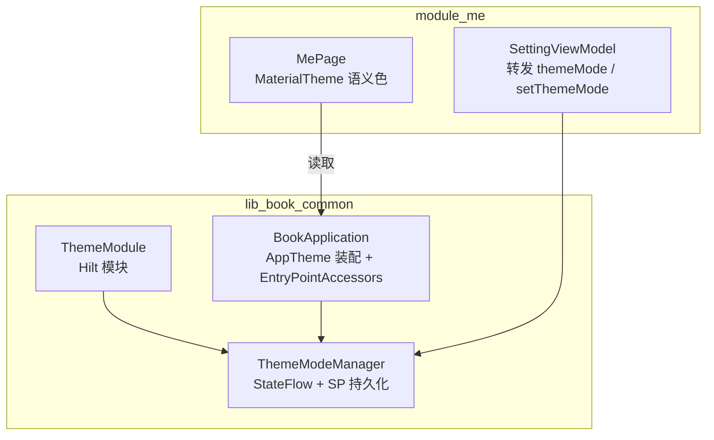
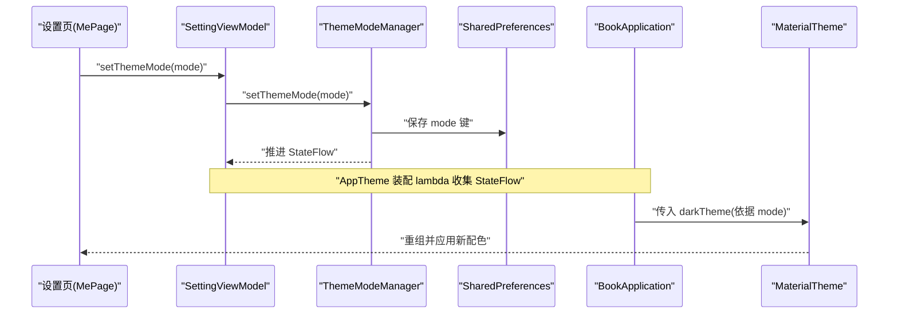
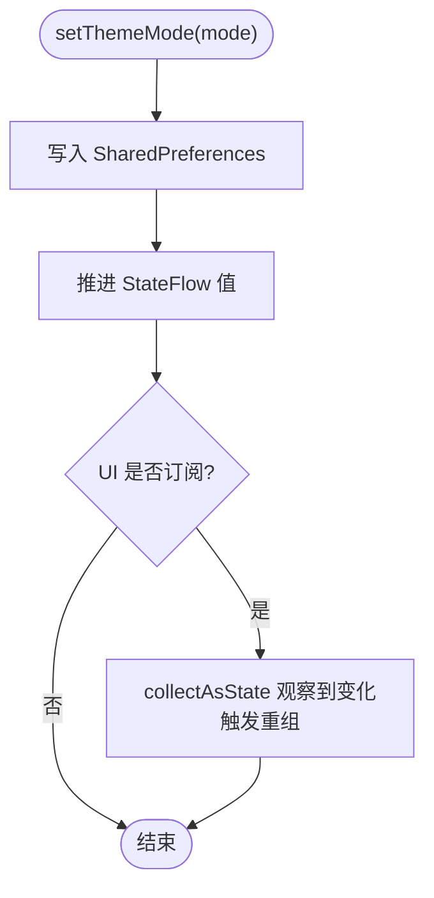
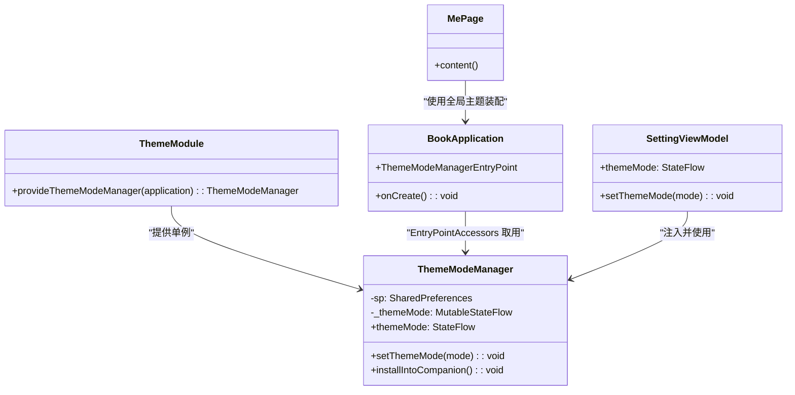

# 主题模块 (ThemeModule)

<cite>
**本文引用的文件**
- [lib_book_common/src/main/java/com/ebook/common/di/ThemeModule.kt](file://lib_book_common/src/main/java/com/ebook/common/di/ThemeModule.kt)
- [lib_book_common/src/main/java/com/ebook/common/domain/ThemeModeManager.kt](file://lib_book_common/src/main/java/com/ebook/common/domain/ThemeModeManager.kt)
- [lib_book_common/src/main/java/com/ebook/common/BookApplication.kt](file://lib_book_common/src/main/java/com/ebook/common/BookApplication.kt)
- [module_me/src/main/java/com/ebook/me/mvvm/viewmodel/SettingViewModel.kt](file://module_me/src/main/java/com/ebook/me/mvvm/viewmodel/SettingViewModel.kt)
- [module_me/src/main/java/com/ebook/me/page/MePage.kt](file://module_me/src/main/java/com/ebook/me/page/MePage.kt)
- [docs/adr/0031-theme-mode-three-state-companion-singleton.md](file://docs/adr/0031-theme-mode-three-state-companion-singleton.md)
</cite>

## 目录
1. [简介](#简介)
2. [项目结构](#项目结构)
3. [核心组件](#核心组件)
4. [架构总览](#架构总览)
5. [详细组件分析](#详细组件分析)
6. [依赖关系分析](#依赖关系分析)
7. [性能考量](#性能考量)
8. [故障排查指南](#故障排查指南)
9. [结论](#结论)
10. [附录：扩展与自定义指南](#附录扩展与自定义指南)

## 简介
本模块负责“外观主题模式”的全局管理，提供浅色、深色、跟随系统的三态切换，并通过 Hilt 进行依赖注入与单例生命周期管理。主题选择持久化到 SharedPreferences，以 StateFlow 暴露当前值；应用启动时在 BookApplication 中完成装配，将 ThemeModeManager 挂入进程级访问点，供 Compose 的 AppTheme 装配 lambda 在重组时读取，从而驱动 MaterialTheme 的深浅色切换。设置页通过 SettingViewModel 调用 ThemeModeManager 写入主题模式，UI 层使用 MaterialTheme.colorScheme/typography 等语义化资源实现主题一致性。

## 项目结构
主题相关代码主要分布在共享库 lib_book_common 以及设置页所在的功能模块 module_me：
- lib_book_common：定义 ThemeMode 枚举、ThemeModeManager 管理器、Hilt 模块 ThemeModule，以及在 BookApplication 中的装配逻辑。
- module_me：设置页 ViewModel 转发主题状态并提供写入入口，页面使用 MaterialTheme 语义色。

图表来源
- [lib_book_common/src/main/java/com/ebook/common/di/ThemeModule.kt:10-26](file://lib_book_common/src/main/java/com/ebook/common/di/ThemeModule.kt#L10-L26)
- [lib_book_common/src/main/java/com/ebook/common/domain/ThemeModeManager.kt:10-92](file://lib_book_common/src/main/java/com/ebook/common/domain/ThemeModeManager.kt#L10-L92)
- [lib_book_common/src/main/java/com/ebook/common/BookApplication.kt:17-59](file://lib_book_common/src/main/java/com/ebook/common/BookApplication.kt#L17-L59)
- [module_me/src/main/java/com/ebook/me/mvvm/viewmodel/SettingViewModel.kt:62-172](file://module_me/src/main/java/com/ebook/me/mvvm/viewmodel/SettingViewModel.kt#L62-L172)
- [module_me/src/main/java/com/ebook/me/page/MePage.kt:112-175](file://module_me/src/main/java/com/ebook/me/page/MePage.kt#L112-L175)

章节来源
- [lib_book_common/src/main/java/com/ebook/common/di/ThemeModule.kt:10-26](file://lib_book_common/src/main/java/com/ebook/common/di/ThemeModule.kt#L10-L26)
- [lib_book_common/src/main/java/com/ebook/common/domain/ThemeModeManager.kt:10-92](file://lib_book_common/src/main/java/com/ebook/common/domain/ThemeModeManager.kt#L10-L92)
- [lib_book_common/src/main/java/com/ebook/common/BookApplication.kt:17-59](file://lib_book_common/src/main/java/com/ebook/common/BookApplication.kt#L17-L59)
- [module_me/src/main/java/com/ebook/me/mvvm/viewmodel/SettingViewModel.kt:62-172](file://module_me/src/main/java/com/ebook/me/mvvm/viewmodel/SettingViewModel.kt#L62-L172)
- [module_me/src/main/java/com/ebook/me/page/MePage.kt:112-175](file://module_me/src/main/java/com/ebook/me/page/MePage.kt#L112-L175)

## 核心组件
- ThemeMode：三态枚举（LIGHT、DARK、SYSTEM），默认 SYSTEM，与系统深色语义对齐。
- ThemeModeManager：负责读取/写入主题模式、持久化到 SharedPreferences、暴露 StateFlow 并支持安装到伴生对象以供非 Hilt 上下文读取。
- ThemeModule：Hilt 模块，将 ThemeModeManager 以 @Singleton 绑定到 SingletonComponent。
- BookApplication：在应用启动时装配 AppTheme，根据 ThemeModeManager 决定 darkTheme，并通过 EntryPointAccessors 取出 ThemeModeManager 实例挂到伴生对象。
- SettingViewModel：设置页 ViewModel，转发 themeMode 并调用 setThemeMode 完成用户选择落盘与状态推进。
- MePage：使用 MaterialTheme.colorScheme/typography 等语义色渲染界面，确保随主题切换一致。

章节来源
- [lib_book_common/src/main/java/com/ebook/common/domain/ThemeModeManager.kt:10-92](file://lib_book_common/src/main/java/com/ebook/common/domain/ThemeModeManager.kt#L10-L92)
- [lib_book_common/src/main/java/com/ebook/common/di/ThemeModule.kt:10-26](file://lib_book_common/src/main/java/com/ebook/common/di/ThemeModule.kt#L10-L26)
- [lib_book_common/src/main/java/com/ebook/common/BookApplication.kt:17-59](file://lib_book_common/src/main/java/com/ebook/common/BookApplication.kt#L17-L59)
- [module_me/src/main/java/com/ebook/me/mvvm/viewmodel/SettingViewModel.kt:62-172](file://module_me/src/main/java/com/ebook/me/mvvm/viewmodel/SettingViewModel.kt#L62-L172)
- [module_me/src/main/java/com/ebook/me/page/MePage.kt:112-175](file://module_me/src/main/java/com/ebook/me/page/MePage.kt#L112-L175)

## 架构总览
主题管理采用“持久化 + 响应式 + 装配点”的组合：
- 持久化：SharedPreferences 存储单键 mode，默认 fallback 为 SYSTEM，避免首次组合出现空值或类型错误。
- 响应式：StateFlow 暴露当前模式，UI 侧 collectAsState 订阅后触发重组，整 App 即时换肤。
- 装配点：BookApplication 注册 AppTheme 装配 lambda，按三态映射计算 darkTheme；通过 EntryPointAccessors 从 SingletonComponent 获取 ThemeModeManager 并 installIntoCompanion，使非 Hilt 上下文可读取。

图表来源
- [module_me/src/main/java/com/ebook/me/mvvm/viewmodel/SettingViewModel.kt:163-172](file://module_me/src/main/java/com/ebook/me/mvvm/viewmodel/SettingViewModel.kt#L163-L172)
- [lib_book_common/src/main/java/com/ebook/common/domain/ThemeModeManager.kt:44-69](file://lib_book_common/src/main/java/com/ebook/common/domain/ThemeModeManager.kt#L44-L69)
- [lib_book_common/src/main/java/com/ebook/common/BookApplication.kt:29-48](file://lib_book_common/src/main/java/com/ebook/common/BookApplication.kt#L29-L48)

## 详细组件分析

### ThemeModeManager：三态管理与持久化
- 职责
  - 以 StateFlow 暴露当前主题模式。
  - 将用户选择持久化到 SharedPreferences（theme_mode 文件，单键 mode）。
  - 提供 setThemeMode 写入入口，由设置页 ViewModel 调用。
  - 安装到伴生对象，供 BookApplication 的 AppTheme 装配 lambda 在非 Hilt 上下文中读取。
- 关键设计
  - 默认值 SYSTEM，与 isSystemInDarkTheme 默认语义一致。
  - 读取时 runCatching 包裹枚举解析，坏值回退 SYSTEM，保证冷启动安全。
  - 写入后立即推进 StateFlow，UI 侧 collectAsState 观察变化触发重组。
- 复杂度
  - 读写均为 O(1)，无额外内存占用；StateFlow 仅持有当前值与订阅者列表。

图表来源
- [lib_book_common/src/main/java/com/ebook/common/domain/ThemeModeManager.kt:44-69](file://lib_book_common/src/main/java/com/ebook/common/domain/ThemeModeManager.kt#L44-L69)

章节来源
- [lib_book_common/src/main/java/com/ebook/common/domain/ThemeModeManager.kt:10-92](file://lib_book_common/src/main/java/com/ebook/common/domain/ThemeModeManager.kt#L10-L92)

### ThemeModule：Hilt 依赖注入配置
- 作用
  - 提供 ThemeModeManager 单例，绑定到 Hilt 的 SingletonComponent。
  - 显式提供 Application 上下文用于读取 SharedPreferences。
- 选择 SingletonComponent 的原因
  - 主题模式为全局单值，跨模块共享，需要进程内唯一实例。
  - 与 BookApplication 的伴生实例同源，避免多实例导致的状态不一致。

章节来源
- [lib_book_common/src/main/java/com/ebook/common/di/ThemeModule.kt:10-26](file://lib_book_common/src/main/java/com/ebook/common/di/ThemeModule.kt#L10-L26)

### BookApplication：装配点与上下文注入
- 装配流程
  - 通过 AppTheme.install 注册装配 lambda，在该 lambda 内：
    - 读取 ThemeModeManager.instance（伴生对象）的 themeMode StateFlow。
    - 根据三态映射计算 darkTheme 并传给 MyApplicationTheme。
  - 使用 EntryPointAccessors.fromApplication 从 SingletonComponent 取出 ThemeModeManager 并调用 installIntoCompanion。
- Application 上下文注入方式
  - 非 @HiltAndroidApp 的应用基类，无法直接使用 @Inject；改用 EntryPointAccessors 在运行时取用。
  - 隔离进程门：沙箱进程跳过初始化，避免读不到数据目录导致的 IO 失败。

章节来源
- [lib_book_common/src/main/java/com/ebook/common/BookApplication.kt:17-59](file://lib_book_common/src/main/java/com/ebook/common/BookApplication.kt#L17-L59)

### SettingViewModel：设置页的主题控制
- 职责
  - 转发 ThemeModeManager.themeMode 给 UI。
  - 提供 setThemeMode 方法，调用 ThemeModeManager.setThemeMode 完成持久化与状态推进。
- 使用模式
  - UI 层 collectAsState 观察 themeMode 流，显示当前选中项。
  - 用户选择后调用 setThemeMode，立即触发全 App 重组换肤。

章节来源
- [module_me/src/main/java/com/ebook/me/mvvm/viewmodel/SettingViewModel.kt:62-172](file://module_me/src/main/java/com/ebook/me/mvvm/viewmodel/SettingViewModel.kt#L62-L172)

### MePage：MaterialTheme 集成与语义色使用
- 集成方式
  - 不重复包裹 MaterialTheme，使用全局装配的 AppTheme/MyApplicationTheme。
  - 通过 MaterialTheme.colorScheme/typography 等语义色/字体资源，确保深浅色一致。
- 注意事项
  - 避免硬编码颜色，所有 UI 元素使用语义色，保证主题切换的一致性。

章节来源
- [module_me/src/main/java/com/ebook/me/page/MePage.kt:112-175](file://module_me/src/main/java/com/ebook/me/page/MePage.kt#L112-L175)

## 依赖关系分析
- 组件耦合
  - ThemeModule 依赖 ThemeModeManager，提供单例。
  - BookApplication 依赖 ThemeModeManager（通过 EntryPointAccessors）和 AppTheme。
  - SettingViewModel 依赖 ThemeModeManager，只读/写主题状态。
  - MePage 依赖 MaterialTheme，不直接依赖 ThemeModeManager。
- 外部依赖
  - SharedPreferences 用于持久化。
  - Hilt 的 SingletonComponent 管理生命周期。
  - Compose 的 StateFlow + collectAsState 驱动重组。

图表来源
- [lib_book_common/src/main/java/com/ebook/common/di/ThemeModule.kt:10-26](file://lib_book_common/src/main/java/com/ebook/common/di/ThemeModule.kt#L10-L26)
- [lib_book_common/src/main/java/com/ebook/common/domain/ThemeModeManager.kt:44-92](file://lib_book_common/src/main/java/com/ebook/common/domain/ThemeModeManager.kt#L44-L92)
- [lib_book_common/src/main/java/com/ebook/common/BookApplication.kt:17-59](file://lib_book_common/src/main/java/com/ebook/common/BookApplication.kt#L17-L59)
- [module_me/src/main/java/com/ebook/me/mvvm/viewmodel/SettingViewModel.kt:62-172](file://module_me/src/main/java/com/ebook/me/mvvm/viewmodel/SettingViewModel.kt#L62-L172)
- [module_me/src/main/java/com/ebook/me/page/MePage.kt:112-175](file://module_me/src/main/java/com/ebook/me/page/MePage.kt#L112-L175)

章节来源
- [lib_book_common/src/main/java/com/ebook/common/di/ThemeModule.kt:10-26](file://lib_book_common/src/main/java/com/ebook/common/di/ThemeModule.kt#L10-L26)
- [lib_book_common/src/main/java/com/ebook/common/domain/ThemeModeManager.kt:44-92](file://lib_book_common/src/main/java/com/ebook/common/domain/ThemeModeManager.kt#L44-L92)
- [lib_book_common/src/main/java/com/ebook/common/BookApplication.kt:17-59](file://lib_book_common/src/main/java/com/ebook/common/BookApplication.kt#L17-L59)
- [module_me/src/main/java/com/ebook/me/mvvm/viewmodel/SettingViewModel.kt:62-172](file://module_me/src/main/java/com/ebook/me/mvvm/viewmodel/SettingViewModel.kt#L62-L172)
- [module_me/src/main/java/com/ebook/me/page/MePage.kt:112-175](file://module_me/src/main/java/com/ebook/me/page/MePage.kt#L112-L175)

## 性能考量
- 读写性能：SharedPreferences 单键存取为 O(1)，StateFlow 推送与订阅开销低。
- 重组成本：仅在主题模式变更时触发一次重组，影响范围限于受 AppTheme 覆盖的 UI 树。
- 隔离进程：沙箱进程跳过主题装配，避免无效 IO 与日志噪音。

[本节为通用性能讨论，不直接分析具体文件]

## 故障排查指南
- 问题：首次启动闪一帧浅色/深色再跳变
  - 原因：异步读取导致初始值未就绪。
  - 解决：确保 loadMode 返回默认 SYSTEM，并在装配 lambda 中 collectAsState 订阅。
- 问题：主题不生效
  - 检查：SettingViewModel.setThemeMode 是否被调用；ThemeModeManager.setThemeMode 是否推进 StateFlow。
  - 检查：BookApplication 是否在 onCreate 中完成 installIntoCompanion。
- 问题：沙箱进程崩溃
  - 原因：在沙箱进程中尝试读取 SharedPreferences。
  - 解决：确保 SandboxProcess.isInIsolatedProcess 时提前返回，不执行主题装配。

章节来源
- [lib_book_common/src/main/java/com/ebook/common/domain/ThemeModeManager.kt:65-69](file://lib_book_common/src/main/java/com/ebook/common/domain/ThemeModeManager.kt#L65-L69)
- [lib_book_common/src/main/java/com/ebook/common/BookApplication.kt:20-28](file://lib_book_common/src/main/java/com/ebook/common/BookApplication.kt#L20-L28)
- [module_me/src/main/java/com/ebook/me/mvvm/viewmodel/SettingViewModel.kt:163-172](file://module_me/src/main/java/com/ebook/me/mvvm/viewmodel/SettingViewModel.kt#L163-L172)

## 结论
主题模块通过 ThemeModeManager 统一管理三态主题，结合 Hilt 的单例注入与 SharedPreferences 持久化，实现了稳定、可观测且即时的全局主题切换。BookApplication 作为装配点，将主题决策注入到 Compose 的 MaterialTheme 中；设置页通过 SettingViewModel 提供安全的写入入口；业务页面统一使用 MaterialTheme 语义色，确保主题一致性。该设计清晰解耦、易于扩展，并为后续品牌色定制提供了良好基础。

[本节为总结性内容，不直接分析具体文件]

## 附录：扩展与自定义指南
- 新增主题模式
  - 在 ThemeMode 枚举中添加新值，更新 BookApplication 的三态映射。
  - 在 SettingViewModel 中增加对应的 UI 选项与写入逻辑。
- 自定义品牌色
  - 在 BookApplication 的 AppTheme 装配 lambda 中调整 dynamicColor 或其他参数，无需修改页面。
- 扩展持久化策略
  - 如需迁移或升级，可在 loadMode 中增加兼容逻辑，保持默认 FALLBACK 行为。
- 测试建议
  - 对 ThemeModeManager 的读写路径进行单元测试，验证默认值与异常回退。
  - 对 SettingViewModel 的 setThemeMode 进行行为断言，确保 StateFlow 推进。

章节来源
- [lib_book_common/src/main/java/com/ebook/common/domain/ThemeModeManager.kt:10-92](file://lib_book_common/src/main/java/com/ebook/common/domain/ThemeModeManager.kt#L10-L92)
- [lib_book_common/src/main/java/com/ebook/common/BookApplication.kt:29-48](file://lib_book_common/src/main/java/com/ebook/common/BookApplication.kt#L29-L48)
- [module_me/src/main/java/com/ebook/me/mvvm/viewmodel/SettingViewModel.kt:163-172](file://module_me/src/main/java/com/ebook/me/mvvm/viewmodel/SettingViewModel.kt#L163-L172)