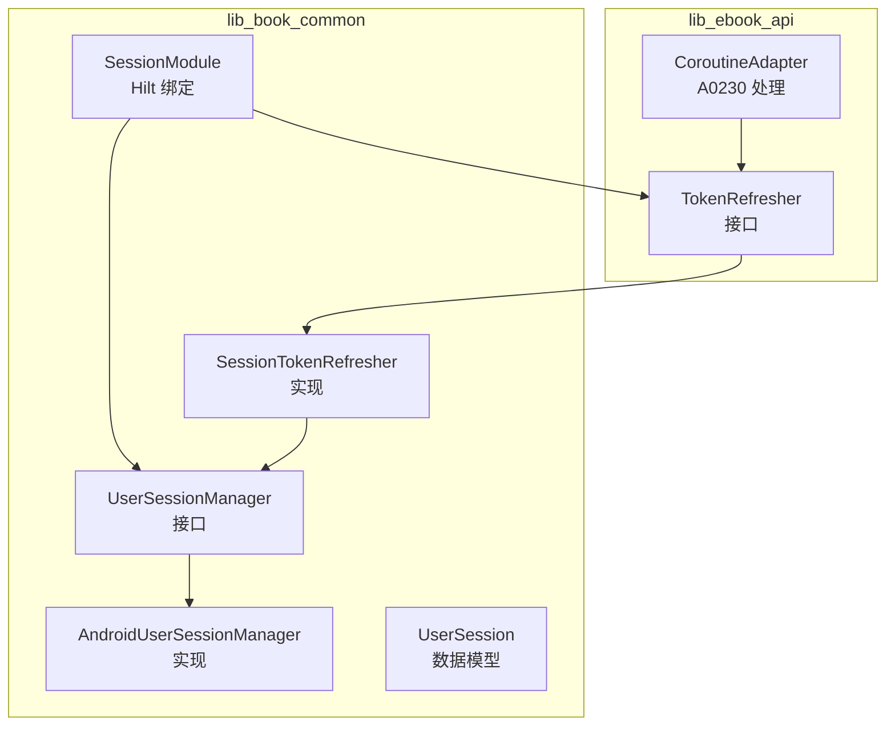
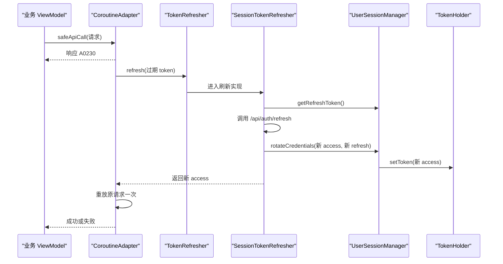
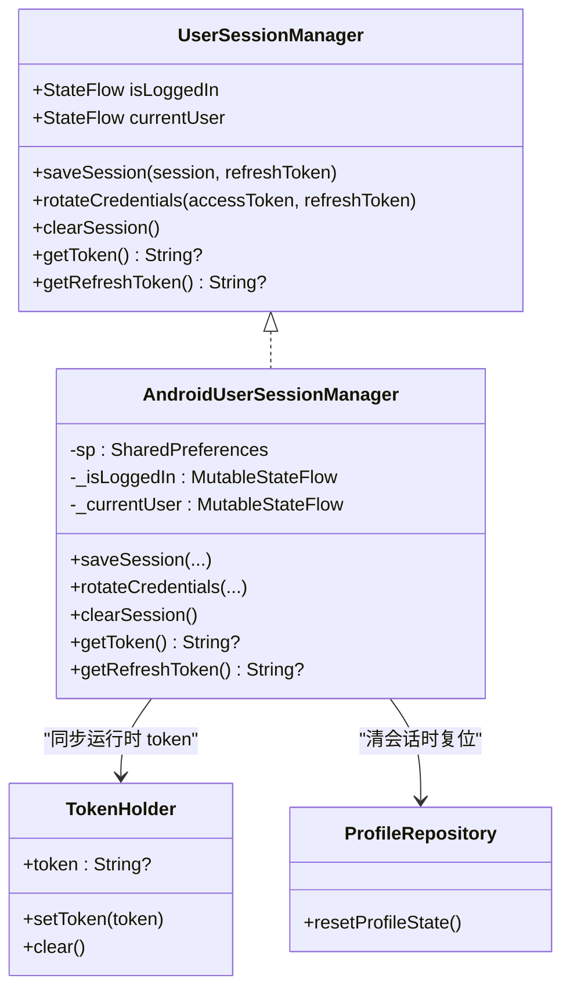
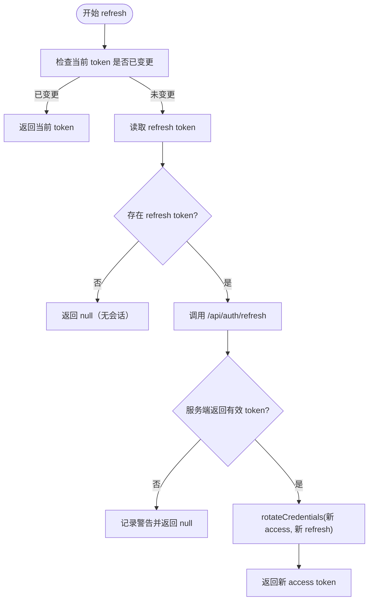
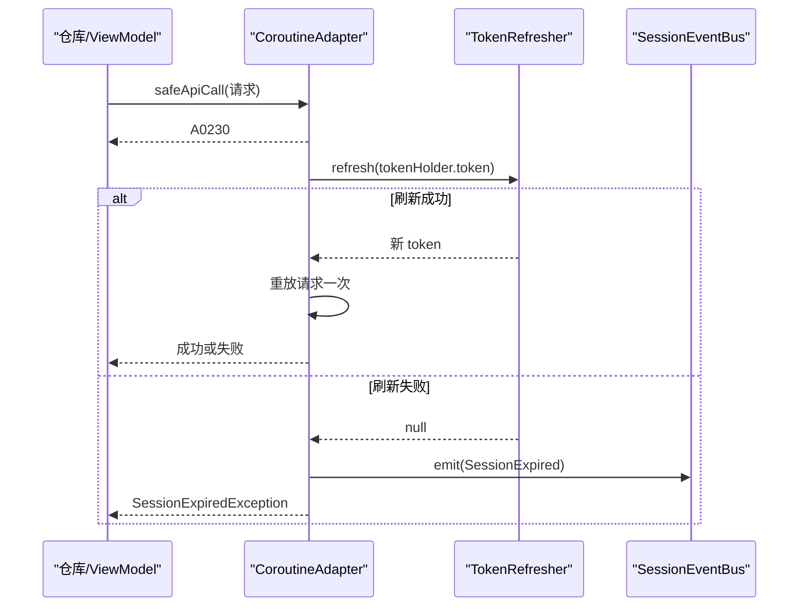
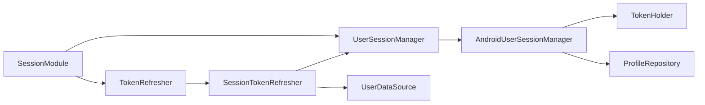

# 会话模块 (SessionModule)

<cite>
**本文引用的文件**
- [SessionModule.kt](file://lib_book_common/src/main/java/com/ebook/common/di/SessionModule.kt)
- [UserSessionManager.kt](file://lib_book_common/src/main/java/com/ebook/common/domain/UserSessionManager.kt)
- [AndroidUserSessionManager.kt](file://lib_book_common/src/main/java/com/ebook/common/domain/AndroidUserSessionManager.kt)
- [TokenRefresher.kt](file://lib_ebook_api/src/main/java/com/ebook/api/auth/TokenRefresher.kt)
- [SessionTokenRefresher.kt](file://lib_book_common/src/main/java/com/ebook/common/domain/SessionTokenRefresher.kt)
- [CoroutineAdapter.kt](file://lib_ebook_api/src/main/java/com/ebook/api/utils/CoroutineAdapter.kt)
- [UserSession.kt](file://lib_book_common/src/main/java/com/ebook/common/domain/UserSession.kt)
- [AndroidUserSessionManagerTest.kt](file://lib_book_common/src/test/java/com/ebook/common/domain/AndroidUserSessionManagerTest.kt)
</cite>

## 目录
1. [简介](#简介)
2. [项目结构](#项目结构)
3. [核心组件](#核心组件)
4. [架构总览](#架构总览)
5. [详细组件分析](#详细组件分析)
6. [依赖关系分析](#依赖关系分析)
7. [性能与并发特性](#性能与并发特性)
8. [故障排查指南](#故障排查指南)
9. [结论](#结论)
10. [附录：注入与使用模式](#附录注入与使用模式)

## 简介
本模块负责应用的用户认证与会话管理，提供统一的接口抽象与 Android 实现，并通过 Hilt 将接口与实现绑定。其关键职责包括：
- 登录/登出与会话状态的持久化（双 token、用户信息）
- access token 的自动刷新（静默刷新）与重试
- 与网络层的集成（A0230 过期时统一处理）
- 全局会话生命周期控制（进程内状态流 + 存储镜像一致性）

## 项目结构
会话相关代码主要分布在以下位置：
- lib_book_common：会话接口、Android 实现、刷新器实现、会话数据模型
- lib_ebook_api：刷新器接口定义、网络适配器（A0230 处理）
- module_*：通过 Hilt 注入使用会话能力

**图表来源**
- [SessionModule.kt:13-37](file://lib_book_common/src/main/java/com/ebook/common/di/SessionModule.kt#L13-L37)
- [UserSessionManager.kt:5-62](file://lib_book_common/src/main/java/com/ebook/common/domain/UserSessionManager.kt#L5-L62)
- [AndroidUserSessionManager.kt:17-161](file://lib_book_common/src/main/java/com/ebook/common/domain/AndroidUserSessionManager.kt#L17-L161)
- [TokenRefresher.kt:1-27](file://lib_ebook_api/src/main/java/com/ebook/api/auth/TokenRefresher.kt#L1-L27)
- [SessionTokenRefresher.kt:15-96](file://lib_book_common/src/main/java/com/ebook/common/domain/SessionTokenRefresher.kt#L15-L96)
- [CoroutineAdapter.kt:17-149](file://lib_ebook_api/src/main/java/com/ebook/api/utils/CoroutineAdapter.kt#L17-L149)

**章节来源**
- [SessionModule.kt:13-37](file://lib_book_common/src/main/java/com/ebook/common/di/SessionModule.kt#L13-L37)
- [UserSessionManager.kt:5-62](file://lib_book_common/src/main/java/com/ebook/common/domain/UserSessionManager.kt#L5-L62)
- [TokenRefresher.kt:1-27](file://lib_ebook_api/src/main/java/com/ebook/api/auth/TokenRefresher.kt#L1-L27)

## 核心组件
- SessionModule：Hilt 模块，将 UserSessionManager 绑定到 AndroidUserSessionManager；将 TokenRefresher 绑定到 SessionTokenRefresher。
- UserSessionManager：纯 Kotlin 接口，暴露会话状态、保存/轮换/清除会话、获取 token 的能力。
- AndroidUserSessionManager：Android 实现，维护 StateFlow 内存态，落盘 user_session SP，同步 TokenHolder，兼容旧拦截器，清理三处镜像。
- TokenRefresher：刷新器接口，定义 refresh(expiredAccessToken) 契约。
- SessionTokenRefresher：实现单飞互斥刷新、调用 UserDataSource.refreshToken、调用 rotateCredentials 更新凭证。
- CoroutineAdapter：网络层统一收口，检测 A0230 并触发刷新，失败则发射会话过期事件。

**章节来源**
- [SessionModule.kt:13-37](file://lib_book_common/src/main/java/com/ebook/common/di/SessionModule.kt#L13-L37)
- [UserSessionManager.kt:5-62](file://lib_book_common/src/main/java/com/ebook/common/domain/UserSessionManager.kt#L5-L62)
- [AndroidUserSessionManager.kt:17-161](file://lib_book_common/src/main/java/com/ebook/common/domain/AndroidUserSessionManager.kt#L17-L161)
- [TokenRefresher.kt:1-27](file://lib_ebook_api/src/main/java/com/ebook/api/auth/TokenRefresher.kt#L1-L27)
- [SessionTokenRefresher.kt:15-96](file://lib_book_common/src/main/java/com/ebook/common/domain/SessionTokenRefresher.kt#L15-L96)
- [CoroutineAdapter.kt:17-149](file://lib_ebook_api/src/main/java/com/ebook/api/utils/CoroutineAdapter.kt#L17-L149)

## 架构总览
会话管理的整体流程如下：
- 登录：保存用户会话与 refresh token，access token 进入内存 TokenHolder。
- 请求：网络请求经 CoroutineAdapter，若返回 A0230，则调用 TokenRefresher 进行静默刷新。
- 刷新：SessionTokenRefresher 串行化执行刷新，成功后调用 rotateCredentials 更新内存与持久化的 refresh token。
- 重试：刷新成功后重放原请求一次；刷新失败则发送 SessionExpired 事件由上层统一处置。

**图表来源**
- [CoroutineAdapter.kt:41-112](file://lib_ebook_api/src/main/java/com/ebook/api/utils/CoroutineAdapter.kt#L41-L112)
- [TokenRefresher.kt:16-27](file://lib_ebook_api/src/main/java/com/ebook/api/auth/TokenRefresher.kt#L16-L27)
- [SessionTokenRefresher.kt:50-91](file://lib_book_common/src/main/java/com/ebook/common/domain/SessionTokenRefresher.kt#L50-L91)
- [AndroidUserSessionManager.kt:87-98](file://lib_book_common/src/main/java/com/ebook/common/domain/AndroidUserSessionManager.kt#L87-L98)

## 详细组件分析

### SessionModule：Hilt 装配
- 作用：将 UserSessionManager 绑定到 AndroidUserSessionManager；将 TokenRefresher 绑定到 SessionTokenRefresher。
- 设计要点：刷新器实现位于上层（lib_book_common），因为需要访问会话持久化；接口定义在 lib_ebook_api，避免反向依赖。

**章节来源**
- [SessionModule.kt:13-37](file://lib_book_common/src/main/java/com/ebook/common/di/SessionModule.kt#L13-L37)

### UserSessionManager 接口与 AndroidUserSessionManager 实现
- 接口能力：
  - isLoggedIn/currentUser 状态流
  - saveSession：保存会话与 refresh token，access token 仅驻内存
  - rotateCredentials：仅更新双 token，不触碰身份字段
  - clearSession：清会话（三处镜像一致失效）
  - getToken/getRefreshToken：运行时与持久化 token 读取
- Android 实现职责：
  - 管理 StateFlow 内存态
  - 持久化 user_session SP（不包含 access token）
  - 启动恢复时将持久化 token 写入 TokenHolder
  - 兼容 LoginInterceptor 的 spUtils 键
  - clearSession 同时重置 ProfileRepository 的昵称/头像流

**图表来源**
- [UserSessionManager.kt:5-62](file://lib_book_common/src/main/java/com/ebook/common/domain/UserSessionManager.kt#L5-L62)
- [AndroidUserSessionManager.kt:17-161](file://lib_book_common/src/main/java/com/ebook/common/domain/AndroidUserSessionManager.kt#L17-L161)

**章节来源**
- [UserSessionManager.kt:5-62](file://lib_book_common/src/main/java/com/ebook/common/domain/UserSessionManager.kt#L5-L62)
- [AndroidUserSessionManager.kt:17-161](file://lib_book_common/src/main/java/com/ebook/common/domain/AndroidUserSessionManager.kt#L17-L161)

### TokenRefresher 接口与 SessionTokenRefresher 实现
- 接口契约：refresh(expiredAccessToken) 返回新 access token 或 null。
- 实现要点：
  - 使用 Mutex 保证刷新串行化，避免并发刷新导致 refresh token 重复使用而失效
  - 先比对当前 token 与触发过期的 token，如已不同则直接复用，避免多余刷新
  - 通过 UserDataSource.refreshToken 调用刷新端点，不走 CoroutineAdapter 以避免死循环
  - 成功后调用 rotateCredentials 更新内存与持久化 refresh token
  - 捕获取消异常并上抛，其他异常记录日志并返回 null

**图表来源**
- [SessionTokenRefresher.kt:50-91](file://lib_book_common/src/main/java/com/ebook/common/domain/SessionTokenRefresher.kt#L50-L91)

**章节来源**
- [TokenRefresher.kt:1-27](file://lib_ebook_api/src/main/java/com/ebook/api/auth/TokenRefresher.kt#L1-L27)
- [SessionTokenRefresher.kt:15-96](file://lib_book_common/src/main/java/com/ebook/common/domain/SessionTokenRefresher.kt#L15-L96)

### 网络层集成：A0230 处理与自动重试
- CoroutineAdapter.safeApiCall：
  - 执行 IO 线程网络请求
  - 成功返回 Result.success
  - A0230 触发 handleTokenExpired：调用 TokenRefresher.refresh 刷新
  - 刷新成功：重放原请求一次；失败：发射 SessionEvent.SessionExpired 并返回标记性失败
  - 取消异常原样上抛，避免误判为会话过期

**图表来源**
- [CoroutineAdapter.kt:41-112](file://lib_ebook_api/src/main/java/com/ebook/api/utils/CoroutineAdapter.kt#L41-L112)

**章节来源**
- [CoroutineAdapter.kt:17-149](file://lib_ebook_api/src/main/java/com/ebook/api/utils/CoroutineAdapter.kt#L17-L149)

## 依赖关系分析
- 依赖方向：
  - lib_book_common 依赖 lib_ebook_api（刷新器接口、数据源）
  - lib_ebook_api 不依赖 lib_book_common（通过接口解耦）
  - Hilt 在 lib_book_common 中完成绑定，业务模块注入接口使用
- 耦合与内聚：
  - SessionModule 高内聚地集中绑定两个 seam：UserSessionManager 与 TokenRefresher
  - AndroidUserSessionManager 与 TokenHolder、ProfileRepository 紧密协作，确保三处镜像一致
  - SessionTokenRefresher 对 UserSessionManager 与 UserDataSource 有明确依赖，封装刷新逻辑

**图表来源**
- [SessionModule.kt:13-37](file://lib_book_common/src/main/java/com/ebook/common/di/SessionModule.kt#L13-L37)
- [SessionTokenRefresher.kt:42-46](file://lib_book_common/src/main/java/com/ebook/common/domain/SessionTokenRefresher.kt#L42-L46)
- [AndroidUserSessionManager.kt:29-33](file://lib_book_common/src/main/java/com/ebook/common/domain/AndroidUserSessionManager.kt#L29-L33)

**章节来源**
- [SessionModule.kt:13-37](file://lib_book_common/src/main/java/com/ebook/common/di/SessionModule.kt#L13-L37)
- [SessionTokenRefresher.kt:42-46](file://lib_book_common/src/main/java/com/ebook/common/domain/SessionTokenRefresher.kt#L42-L46)
- [AndroidUserSessionManager.kt:29-33](file://lib_book_common/src/main/java/com/ebook/common/domain/AndroidUserSessionManager.kt#L29-L33)

## 性能与并发特性
- 刷新串行化：SessionTokenRefresher 使用 Mutex.withLock 保证同一时刻仅一个刷新任务，避免 refresh token 被并发使用导致服务端作废。
- 快速复用：锁内比较当前 token 与触发过期 token，若已变更说明其他请求已完成刷新，直接复用，减少无效网络开销。
- 冷启动优化：access token 只驻内存，冷启动为空时首个请求经 A0230 走静默刷新，避免不必要的启动期网络。
- 重试策略：A0230 刷新成功后仅重放一次原请求，防止刷新风暴。

[本节为通用性能讨论，不直接分析具体文件]

## 故障排查指南
- 症状：页面反复报错但不跳转登录
  - 可能原因：静默刷新失败且未发出 SessionExpired；或刷新自身被 CoroutineAdapter 包裹导致死循环
  - 处理：确认刷新链路不经过 CoroutineAdapter；检查 SessionTokenRefresher 日志；查看 CoroutineAdapter 是否发出 SessionExpired
- 症状：会话已过期但“我的”页仍显示上一个身份
  - 可能原因：clearSession 未复位 ProfileRepository 的昵称/头像流
  - 处理：确保调用 AndroidUserSessionManager.clearSession；验证 resetProfileState 被调用
- 症状：刷新后 refresh token 仍为旧值
  - 可能原因：服务端响应缺失 refresh_token，实现保留旧值；需检查服务端契约与客户端解析
  - 处理：确认 rotateCredentials 的参数传递；检查服务端是否返回新 refresh token

**章节来源**
- [SessionTokenRefresher.kt:66-89](file://lib_book_common/src/main/java/com/ebook/common/domain/SessionTokenRefresher.kt#L66-L89)
- [AndroidUserSessionManager.kt:111-133](file://lib_book_common/src/main/java/com/ebook/common/domain/AndroidUserSessionManager.kt#L111-L133)
- [CoroutineAdapter.kt:71-112](file://lib_ebook_api/src/main/java/com/ebook/api/utils/CoroutineAdapter.kt#L71-L112)

## 结论
会话模块通过清晰的接口与实现分离，结合 Hilt 装配，提供了健壮的认证与会话管理能力。关键设计包括：
- 双 token 策略：access token 仅驻内存，refresh token 持久化
- 单飞互斥刷新：避免并发导致的凭证冲突
- 三处镜像一致性：SP、内存态、ProfileRepository 状态同步
- 网络层集成：A0230 统一处理，失败转交全局会话过期处置

该模块在保证安全性的同时兼顾了用户体验与可维护性。

[本节为总结性内容，不直接分析具体文件]

## 附录：注入与使用模式
- 注入方式：
  - 业务组件通过 Hilt 注入 UserSessionManager 与 TokenRefresher
  - SessionModule 负责绑定接口与实现
- 使用模式示例路径：
  - 登录成功后保存会话：调用 saveSession(session, refreshToken)
  - 网络请求：使用 CoroutineAdapter.safeApiCall，自动处理 A0230
  - 退出登录：调用 clearSession()，确保三处镜像一致失效
  - 刷新监听：如需关注会话状态，订阅 isLoggedIn 与 currentUser

**章节来源**
- [SessionModule.kt:13-37](file://lib_book_common/src/main/java/com/ebook/common/di/SessionModule.kt#L13-L37)
- [UserSessionManager.kt:24-62](file://lib_book_common/src/main/java/com/ebook/common/domain/UserSessionManager.kt#L24-L62)
- [CoroutineAdapter.kt:41-112](file://lib_ebook_api/src/main/java/com/ebook/api/utils/CoroutineAdapter.kt#L41-L112)
- [AndroidUserSessionManagerTest.kt:88-108](file://lib_book_common/src/test/java/com/ebook/common/domain/AndroidUserSessionManagerTest.kt#L88-L108)