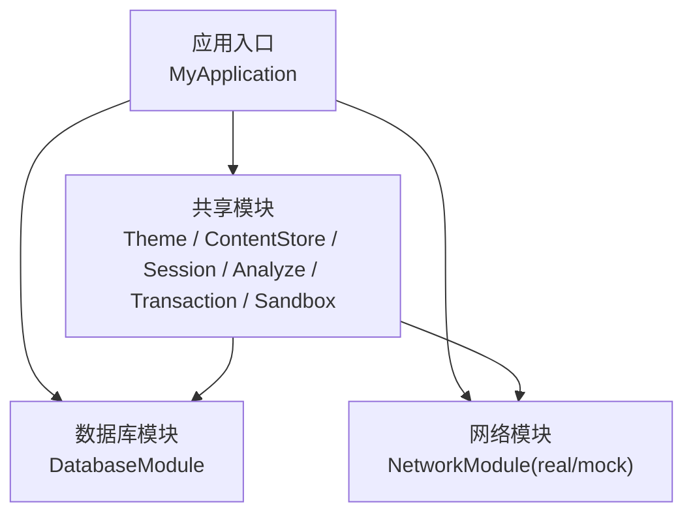
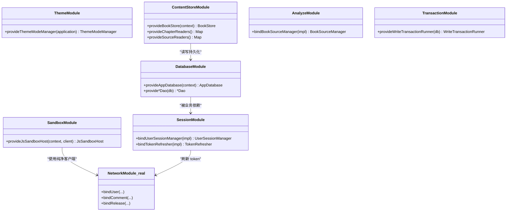
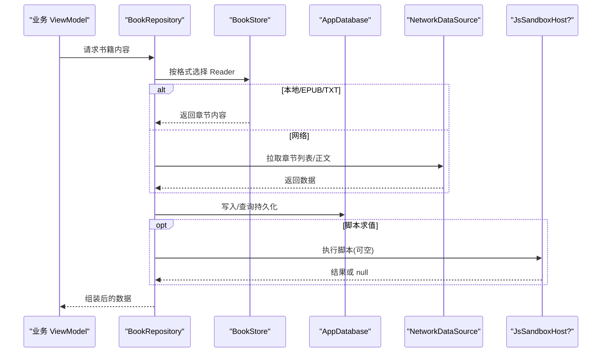

# 依赖模块与提供者

<cite>
**本文引用的文件**   
- [ThemeModule.kt](file://lib_book_common/src/main/java/com/ebook/common/di/ThemeModule.kt)
- [DatabaseModule.kt](file://lib_ebook_db/src/main/java/com/ebook/db/di/DatabaseModule.kt)
- [SandboxModule.kt](file://lib_book_common/src/main/java/com/ebook/common/di/SandboxModule.kt)
- [AnalyzeModule.kt](file://lib_book_common/src/main/java/com/ebook/common/di/AnalyzeModule.kt)
- [SessionModule.kt](file://lib_book_common/src/main/java/com/ebook/common/di/SessionModule.kt)
- [ContentStoreModule.kt](file://lib_book_common/src/main/java/com/ebook/common/di/ContentStoreModule.kt)
- [TransactionModule.kt](file://lib_book_common/src/main/java/com/ebook/common/di/TransactionModule.kt)
- [MyApplication.kt](file://module_app/src/main/java/com/ebook/MyApplication.kt)
- [NetworkModule.kt](file://module_app/src/real/java/com/ebook/di/NetworkModule.kt)
</cite>

## 目录
1. [简介](#简介)
2. [项目结构中的依赖注入布局](#项目结构中的依赖注入布局)
3. [核心模块总览](#核心模块总览)
4. [架构总览](#架构总览)
5. [详细组件分析](#详细组件分析)
6. [依赖关系分析](#依赖关系分析)
7. [性能与生命周期考量](#性能与生命周期考量)
8. [故障排查指南](#故障排查指南)
9. [结论与设计规范](#结论与设计规范)

## 简介
本文件围绕 Hilt/Dagger 的 @Module、@Provides/@Binds、@InstallIn(SingletonComponent::class) 等注解，系统梳理本仓库中各依赖模块的职责边界、装配方式与最佳实践。重点覆盖：
- DatabaseModule、ThemeModule、SandboxModule、ContentStoreModule、SessionModule、AnalyzeModule、TransactionModule 等核心模块的设计与实现
- 条件依赖与可选依赖（可空注入）的处理方式
- Provider 接口的抽象设计与绑定模式
- 单例作用域 SingletonComponent 的使用场景与约束
- 命名约定、职责分离与扩展点设计原则

## 项目结构中的依赖注入布局
- 应用入口 module_app 通过 @HiltAndroidApp 启动全局 DI 图；业务与共享层通过多个 @Module 以 @InstallIn(SingletonComponent::class) 声明为全局单例装配点。
- 数据层（Room）集中在 lib_ebook_db 的 DatabaseModule 提供数据库与 DAO。
- 跨模块能力（主题、内容存储、事务、会话、解析器、沙箱）集中在 lib_book_common 的多个 Module 中统一装配。
- 网络层按 flavor 切换：module_app 的 real/mock 源集提供同名 NetworkModule，通过 product flavor 互斥装配真实或 mock 后端。

图表来源
- [MyApplication.kt:19-61](file://module_app/src/main/java/com/ebook/MyApplication.kt#L19-L61)
- [DatabaseModule.kt:25-208](file://lib_ebook_db/src/main/java/com/ebook/db/di/DatabaseModule.kt#L25-L208)
- [NetworkModule.kt:24-35](file://module_app/src/real/java/com/ebook/di/NetworkModule.kt#L24-L35)

章节来源
- [MyApplication.kt:19-61](file://module_app/src/main/java/com/ebook/MyApplication.kt#L19-L61)
- [DatabaseModule.kt:25-208](file://lib_ebook_db/src/main/java/com/ebook/db/di/DatabaseModule.kt#L25-L208)
- [NetworkModule.kt:24-35](file://module_app/src/real/java/com/ebook/di/NetworkModule.kt#L24-L35)

## 核心模块总览
- ThemeModule：提供外观主题管理器，基于 Application 读取偏好，作为单例注入。
- DatabaseModule：提供 Room 数据库实例与全部 DAO，集中管理迁移链。
- ContentStoreModule：提供本地内容存储、章节拆分与缓存、导入临时目录，以及按格式路由的 Reader Map。
- SessionModule：将 UserSessionManager、TokenRefresher 接口绑定到 Android 实现。
- AnalyzeModule：将 BookSourceManager 接口绑定到实现类，便于测试替换。
- TransactionModule：提供写事务执行器，封装 Room 3 的写事务。
- SandboxModule：提供脚本沙箱宿主（JsSandboxHost），按需连接隔离进程；客户端默认可空，未装配时走“待执行”行为。
- NetworkModule（real）：将数据源接口绑定到真实网络实现；mock 版本在对应 source set 提供同名模块进行替换。

章节来源
- [ThemeModule.kt:17-26](file://lib_book_common/src/main/java/com/ebook/common/di/ThemeModule.kt#L17-L26)
- [DatabaseModule.kt:25-243](file://lib_ebook_db/src/main/java/com/ebook/db/di/DatabaseModule.kt#L25-L243)
- [ContentStoreModule.kt:27-87](file://lib_book_common/src/main/java/com/ebook/common/di/ContentStoreModule.kt#L27-L87)
- [SessionModule.kt:22-37](file://lib_book_common/src/main/java/com/ebook/common/di/SessionModule.kt#L22-L37)
- [AnalyzeModule.kt:11-18](file://lib_book_common/src/main/java/com/ebook/common/di/AnalyzeModule.kt#L11-L18)
- [TransactionModule.kt:13-24](file://lib_book_common/src/main/java/com/ebook/common/di/TransactionModule.kt#L13-L24)
- [SandboxModule.kt:29-56](file://lib_book_common/src/main/java/com/ebook/common/di/SandboxModule.kt#L29-L56)
- [NetworkModule.kt:24-35](file://module_app/src/real/java/com/ebook/di/NetworkModule.kt#L24-L35)

## 架构总览
整体采用“接口 + 实现绑定”的分层策略：
- 接口定义在较低层（如 lib_ebook_api、lib_book_common），由上层或同层模块通过 @Binds 绑定具体实现。
- 资源型对象（数据库、目录、客户端）通过 @Provides 创建并标注 @Singleton，配合 @InstallIn(SingletonComponent::class) 保证全应用范围唯一。
- 条件/可选依赖通过可空注入与守卫逻辑实现：例如沙箱宿主未装配时调用方使用 null 分支，避免强依赖。

图表来源
- [ThemeModule.kt:17-26](file://lib_book_common/src/main/java/com/ebook/common/di/ThemeModule.kt#L17-L26)
- [DatabaseModule.kt:25-243](file://lib_ebook_db/src/main/java/com/ebook/db/di/DatabaseModule.kt#L25-L243)
- [ContentStoreModule.kt:27-87](file://lib_book_common/src/main/java/com/ebook/common/di/ContentStoreModule.kt#L27-L87)
- [SessionModule.kt:22-37](file://lib_book_common/src/main/java/com/ebook/common/di/SessionModule.kt#L22-L37)
- [AnalyzeModule.kt:11-18](file://lib_book_common/src/main/java/com/ebook/common/di/AnalyzeModule.kt#L11-L18)
- [TransactionModule.kt:13-24](file://lib_book_common/src/main/java/com/ebook/common/di/TransactionModule.kt#L13-L24)
- [SandboxModule.kt:29-56](file://lib_book_common/src/main/java/com/ebook/common/di/SandboxModule.kt#L29-L56)
- [NetworkModule.kt:24-35](file://module_app/src/real/java/com/ebook/di/NetworkModule.kt#L24-L35)

## 详细组件分析

### ThemeModule：主题与偏好
- 职责：提供 ThemeModeManager，从 Application 读取用户偏好，并以单例暴露。
- 关键点：@Provides + @Singleton 配合 @InstallIn(SingletonComponent::class)，确保全应用共享同一份主题状态；与 BookApplication 中的入口保持一致生命周期。
- 使用建议：所有 UI 相关主题消费方直接注入该管理器，避免自行持有 Context。

章节来源
- [ThemeModule.kt:17-26](file://lib_book_common/src/main/java/com/ebook/common/di/ThemeModule.kt#L17-L26)

### DatabaseModule：Room 数据库与迁移
- 职责：提供 AppDatabase 与全部 DAO；集中维护多版本迁移链（v1→v8）。
- 关键点：
  - 使用 BundledSQLiteDriver，确保迁移与建表一致。
  - 迁移语句与 Room 生成的 schema 严格对齐（包括 DEFAULT、列名变更、删除旧数据策略）。
  - 每个 DAO 单独 @Provides，方便测试替换。
- 使用建议：DAO 一律通过注入获取，不要直接 new Room 实例；新增实体需同步追加迁移并在测试中验证。

章节来源
- [DatabaseModule.kt:25-243](file://lib_ebook_db/src/main/java/com/ebook/db/di/DatabaseModule.kt#L25-L243)

### ContentStoreModule：本地内容与格式路由
- 职责：提供 BookStore、ChapterSplitter、ChapterContentCache、导入临时目录，以及按 BookFormat 路由的 ChapterReader Map。
- 关键点：
  - 唯一一次将 Context 转为 File 的位置，保持内容基座无上下文依赖。
  - 通过 Map<BookFormat, ChapterReader> 开闭扩展新格式，不改动仓库侧分支。
  - 导入链路使用独立的 SourceReader Map，与正文读取解耦。
- 使用建议：新增阅读格式时仅修改此处映射，遵循单一职责。

章节来源
- [ContentStoreModule.kt:27-87](file://lib_book_common/src/main/java/com/ebook/common/di/ContentStoreModule.kt#L27-L87)

### SessionModule：会话与 Token 刷新
- 职责：将 UserSessionManager、TokenRefresher 绑定到 Android 实现。
- 关键点：
  - 使用 @Binds 建立接口与实现的绑定，便于测试替换。
  - Token 运行时容器由底层库提供，会话管理器负责同步。
- 使用建议：业务只依赖接口，实现细节下沉至模块内。

章节来源
- [SessionModule.kt:22-37](file://lib_book_common/src/main/java/com/ebook/common/di/SessionModule.kt#L22-L37)

### AnalyzeModule：书源解析接口绑定
- 职责：将 BookSourceManager 接口绑定到实现类。
- 关键点：@Binds + @Singleton，保证解析器管理器全局唯一。
- 使用建议：测试中使用同名接口实现替换，无需改动调用方。

章节来源
- [AnalyzeModule.kt:11-18](file://lib_book_common/src/main/java/com/ebook/common/di/AnalyzeModule.kt#L11-L18)

### TransactionModule：写事务执行器
- 职责：封装 Room 3 的写事务（IMMEDIATE），提供统一的 WriteTransactionRunner。
- 关键点：在单例组件中提供，所有需要原子写入的路径统一使用此执行器。
- 使用建议：批量写操作必须经此执行器，避免分散的事务边界。

章节来源
- [TransactionModule.kt:13-24](file://lib_book_common/src/main/java/com/ebook/common/di/TransactionModule.kt#L13-L24)

### SandboxModule：脚本沙箱宿主（可选依赖）
- 职责：提供 JsSandboxHost，连接隔离进程执行脚本；客户端默认可空，未装配时不走沙箱。
- 关键点：
  - 转子与 HostCallbackRouter 构造顺序严格：先建 router，再传给 JsSandboxClient/Host。
  - 注入方使用可空参数，未装配时走“JS 待执行”的原行为，避免冷启动与独立运行失败。
  - 使用 @Named("source") 纯净客户端，不携带用户 token。
- 使用建议：仅在脚本求值路径接入沙箱；非脚本路径不应感知其存在。

章节来源
- [SandboxModule.kt:29-56](file://lib_book_common/src/main/java/com/ebook/common/di/SandboxModule.kt#L29-L56)

### NetworkModule（real）：网络实现绑定
- 职责：将数据源接口绑定到真实网络实现；与 mock 同名模块互斥。
- 关键点：通过 product flavor/source set 切换，实现真实/模拟后端无缝替换。
- 使用建议：新增接口需在两个 flavor 下同时提供绑定。

章节来源
- [NetworkModule.kt:24-35](file://module_app/src/real/java/com/ebook/di/NetworkModule.kt#L24-L35)

### MyApplication：DI 启动与入口点
- 职责：@HiltAndroidApp 启动全局图；通过 EntryPointAccessors 延迟获取 BookRepository，避免在隔离进程触发注入。
- 关键点：
  - 在隔离进程门之后才构建 DI 相关逻辑，防止沙箱进程因缺少依赖而崩溃。
  - 提供 ContentStoreEntryPoint，将重对象获取推迟到使用时机。
- 使用建议：Application 上禁止 eager @Inject 字段；需要时改用 Entry Point。

章节来源
- [MyApplication.kt:19-61](file://module_app/src/main/java/com/ebook/MyApplication.kt#L19-L61)

## 依赖关系分析
- 模块间耦合以接口为中心，实现集中在各自模块内，降低耦合度。
- 通过 @InstallIn(SingletonComponent::class) 统一管理生命周期，避免重复创建与内存泄漏。
- 条件依赖通过可空注入与守卫逻辑处理，提升鲁棒性（如沙箱宿主）。
- 网络层通过 flavor 切换，实现真实/模拟环境解耦。

图表来源
- [ContentStoreModule.kt:60-87](file://lib_book_common/src/main/java/com/ebook/common/di/ContentStoreModule.kt#L60-L87)
- [DatabaseModule.kt:192-243](file://lib_ebook_db/src/main/java/com/ebook/db/di/DatabaseModule.kt#L192-L243)
- [SandboxModule.kt:33-56](file://lib_book_common/src/main/java/com/ebook/common/di/SandboxModule.kt#L33-L56)
- [NetworkModule.kt:24-35](file://module_app/src/real/java/com/ebook/di/NetworkModule.kt#L24-L35)

## 性能与生命周期考量
- 单例作用域：所有模块均安装于 SingletonComponent，适合全局共享的资源（数据库、主题、存储、事务执行器）。
- 冷启动优化：沙箱宿主仅在首次脚本执行时才连接进程，避免冷启动开销。
- 延迟初始化：Application 中使用 EntryPointAccessors 延迟获取重对象，避免在隔离进程触发依赖。
- 事务边界：统一通过 WriteTransactionRunner 管理写事务，减少锁竞争与不一致风险。

章节来源
- [SandboxModule.kt:29-56](file://lib_book_common/src/main/java/com/ebook/common/di/SandboxModule.kt#L29-L56)
- [MyApplication.kt:46-61](file://module_app/src/main/java/com/ebook/MyApplication.kt#L46-L61)
- [TransactionModule.kt:13-24](file://lib_book_common/src/main/java/com/ebook/common/di/TransactionModule.kt#L13-L24)

## 故障排查指南
- 数据库迁移异常：检查迁移链是否与 Room 生成 schema 一致，特别是 DEFAULT、列名、删除策略。
- 沙箱未装配导致功能降级：确认 SandboxModule 是否参与当前 flavor/source set；注入方应正确处理 null 分支。
- 网络实现缺失：确认当前 flavor 是否包含对应的 NetworkModule；mock/real 同名模块不可同时编译。
- Application 注入时机错误：避免在 Application 中使用 eager @Inject 字段，改用 EntryPoint 延迟获取。

章节来源
- [DatabaseModule.kt:25-243](file://lib_ebook_db/src/main/java/com/ebook/db/di/DatabaseModule.kt#L25-L243)
- [SandboxModule.kt:29-56](file://lib_book_common/src/main/java/com/ebook/common/di/SandboxModule.kt#L29-L56)
- [NetworkModule.kt:24-35](file://module_app/src/real/java/com/ebook/di/NetworkModule.kt#L24-L35)
- [MyApplication.kt:46-61](file://module_app/src/main/java/com/ebook/MyApplication.kt#L46-L61)

## 结论与设计规范
- 命名约定：模块以功能域命名（如 ThemeModule、DatabaseModule），接口与实现分离（如 UserSessionManager/AndroidUserSessionManager）。
- 职责分离：每个模块聚焦单一职责（主题、数据库、存储、事务、会话、解析、沙箱、网络）。
- 作用域管理：统一使用 @InstallIn(SingletonComponent::class) 管理全局单例；避免跨作用域引用不当。
- 条件依赖：通过可空注入与守卫逻辑处理可选依赖，提升健壮性。
- 扩展性：通过 Map/接口绑定提供扩展点（如 Reader Map、数据源绑定），新增能力时最小化改动面。
- 测试友好：大量使用 @Binds 绑定接口与实现，便于单元测试替换。