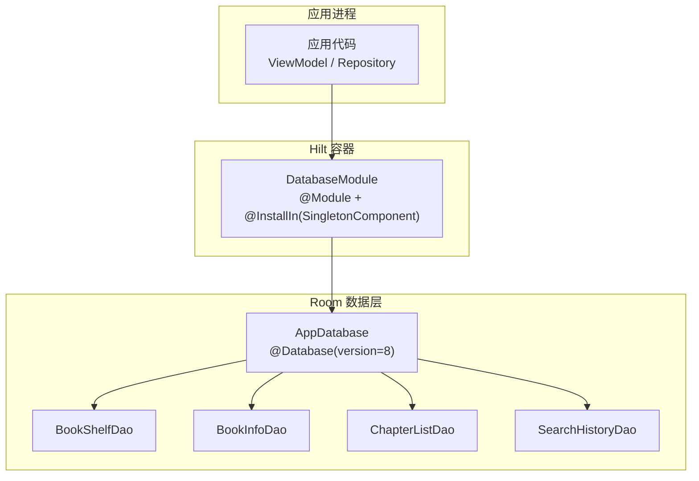
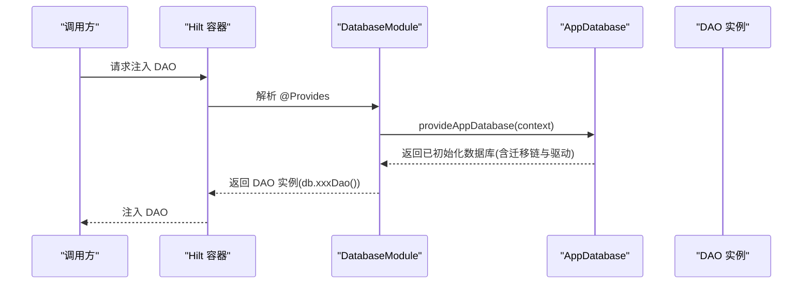
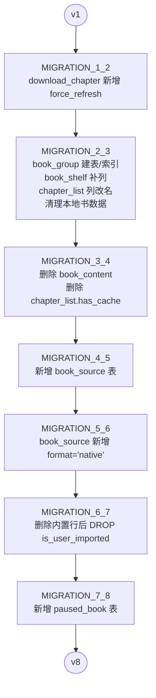
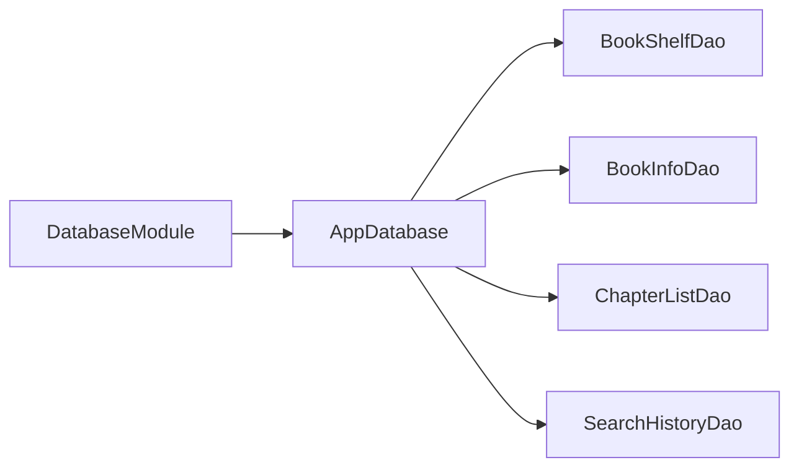

# 数据库模块 (DatabaseModule)

<cite>
**本文引用的文件**   
- [AppDatabase.kt](file://lib_ebook_db/src/main/java/com/ebook/db/AppDatabase.kt)
- [DatabaseModule.kt](file://lib_ebook_db/src/main/java/com/ebook/db/di/DatabaseModule.kt)
- [BookShelfDao.kt](file://lib_ebook_db/src/main/java/com/ebook/db/dao/BookShelfDao.kt)
- [BookInfoDao.kt](file://lib_ebook_db/src/main/java/com/ebook/db/dao/BookInfoDao.kt)
- [ChapterListDao.kt](file://lib_ebook_db/src/main/java/com/ebook/db/dao/ChapterListDao.kt)
- [SearchHistoryDao.kt](file://lib_ebook_db/src/main/java/com/ebook/db/dao/SearchHistoryDao.kt)
</cite>

## 目录
1. [简介](#简介)
2. [项目结构](#项目结构)
3. [核心组件](#核心组件)
4. [架构总览](#架构总览)
5. [详细组件分析](#详细组件分析)
6. [依赖关系分析](#依赖关系分析)
7. [性能与迁移注意事项](#性能与迁移注意事项)
8. [故障排查指南](#故障排查指南)
9. [结论](#结论)

## 简介
本模块基于 Room 3（artifact 群组 androidx.room3）实现应用的本地数据层，提供 AppDatabase 的构建、版本迁移链以及各 DAO 的 Hilt 单例提供。数据层围绕书架、书籍信息、章节目录、搜索历史、下载队列、作品分组、书源与按书暂停标记八张表组织，所有读写均通过上层仓库经 DAO 访问，数据库类仅声明表与 DAO 的对应关系。

## 项目结构
- 数据库入口：AppDatabase 声明实体集合、版本号、导出 schema，并暴露各 DAO 抽象方法。
- DI 模块：DatabaseModule 使用 @Module/@Provides 装配 AppDatabase 与全部 DAO，注册完整迁移链，选择 BundledSQLiteDriver。
- DAO 层：每个业务表对应一个 DAO 接口，定义查询、插入、更新、删除等操作，部分使用 Flow 暴露响应式数据。
- 实体与传输模型：持久化实体位于 entity 包；另有若干非持久化的传输模型不在 entities 中声明。

图表来源
- [DatabaseModule.kt:192-243](file://lib_ebook_db/src/main/java/com/ebook/db/di/DatabaseModule.kt#L192-L243)
- [AppDatabase.kt:40-76](file://lib_ebook_db/src/main/java/com/ebook/db/AppDatabase.kt#L40-L76)

章节来源
- [AppDatabase.kt:8-39](file://lib_ebook_db/src/main/java/com/ebook/db/AppDatabase.kt#L8-L39)
- [AppDatabase.kt:40-76](file://lib_ebook_db/src/main/java/com/ebook/db/AppDatabase.kt#L40-L76)
- [DatabaseModule.kt:25-27](file://lib_ebook_db/src/main/java/com/ebook/db/di/DatabaseModule.kt#L25-L27)

## 核心组件
- AppDatabase：集中声明 8 个实体、数据库版本为 8、开启 exportSchema，并提供 bookShelfDao()/bookInfoDao()/chapterListDao() 等 DAO 访问器。
- DatabaseModule：以 @Module/@InstallIn(SingletonComponent::class) 暴露 AppDatabase 与各 DAO 的单例实例，统一装配迁移链与驱动。
- DAO 提供者：
  - BookShelfDao：书架列表与阅读进度，支持全量快照与 Flow 响应式观察，UP/SERT 语义由 REPLACE 主键自然键保证。
  - BookInfoDao：书籍元数据，提供定向 UPDATE final_refresh_data 避免整行覆盖带来的字段丢失风险。
  - ChapterListDao：章节目录，按 content_ref 主键去重与 upsert，按 dur_chapter_index 稳定排序。
  - SearchHistoryDao：搜索历史流水表，自增 id，按类型展示/清除，upsert 查重只更新时间戳。

章节来源
- [AppDatabase.kt:40-76](file://lib_ebook_db/src/main/java/com/ebook/db/AppDatabase.kt#L40-L76)
- [DatabaseModule.kt:192-243](file://lib_ebook_db/src/main/java/com/ebook/db/di/DatabaseModule.kt#L192-L243)
- [BookShelfDao.kt:8-109](file://lib_ebook_db/src/main/java/com/ebook/db/dao/BookShelfDao.kt#L8-L109)
- [BookInfoDao.kt:6-50](file://lib_ebook_db/src/main/java/com/ebook/db/dao/BookInfoDao.kt#L6-L50)
- [ChapterListDao.kt:6-44](file://lib_ebook_db/src/main/java/com/ebook/db/dao/ChapterListDao.kt#L6-L44)
- [SearchHistoryDao.kt:6-66](file://lib_ebook_db/src/main/java/com/ebook/db/dao/SearchHistoryDao.kt#L6-L66)

## 架构总览
DatabaseModule 负责数据库生命周期与数据访问对象的装配：
- 通过 Room.databaseBuilder 创建 AppDatabase，指定数据库文件名、添加 MIGRATION_1_2 到 MIGRATION_7_8 的迁移链，并设置 BundledSQLiteDriver。
- 将 AppDatabase 与各 DAO 以 @Singleton 形式暴露给 Hilt 容器，供上层模块注入。
- 各 DAO 在 AppDatabase 中以 abstract 方法暴露，Room 在编译期生成实现类并由 DI 提供。

图表来源
- [DatabaseModule.kt:192-243](file://lib_ebook_db/src/main/java/com/ebook/db/di/DatabaseModule.kt#L192-L243)
- [AppDatabase.kt:40-76](file://lib_ebook_db/src/main/java/com/ebook/db/AppDatabase.kt#L40-L76)

## 详细组件分析

### AppDatabase 与 Room 配置
- 实体清单：包含书架、书籍信息、章节目录、搜索历史、下载队列、作品分组、书源、按书暂停标记共 8 张表。
- 版本与导出：version=8，exportSchema=true，便于迁移前后 schema 对比与校验。
- 主键策略：书架/书籍用自然键 note_url；章节用 content_ref；书源用 url；暂停标记用 note_url；下载任务与搜索历史用自增 id。
- 访问器：提供 bookShelfDao()/bookInfoDao()/chapterListDao()/searchHistoryDao()/downloadChapterDao()/bookGroupDao()/bookSourceDao()/pausedBookDao()。

章节来源
- [AppDatabase.kt:8-39](file://lib_ebook_db/src/main/java/com/ebook/db/AppDatabase.kt#L8-L39)
- [AppDatabase.kt:40-76](file://lib_ebook_db/src/main/java/com/ebook/db/AppDatabase.kt#L40-L76)

### 迁移链 MIGRATION_1_2 → MIGRATION_7_8
迁移以“逐版相邻”的方式串联，禁止跳版与破坏性迁移开关，确保升级路径可追踪、可回测。

- MIGRATION_1_2：为 download_chapter 新增 force_refresh 列（默认 0），保留旧任务语义。
- MIGRATION_2_3：M1a 本地书正文迁至章文件。新建 book_group 及索引；为 book_shelf 补充格式/字符集/匹配名/匹配作者列；将 chapter_list.dur_chapter_url 重命名为 content_ref；清理本地书相关数据（book_content/book_info/chapter_list/book_shelf 中 tag=loc_book 的行）。
- MIGRATION_3_4：M1b 网络书正文迁至章文件。删除 book_content 表与 chapter_list.has_cache 列，缓存存在性改由 BookStore 判定。
- MIGRATION_4_5：多书源共存。新增 book_source 表（无 DEFAULT 值，遵循“实体未声明则不写 DEFAULT”的约定），空表由用户导入填充。
- MIGRATION_5_6：脚本书源双格式并存。为 book_source 新增 format 列，带 DEFAULT 'native'，与实体声明一致以避免覆盖安装与全新安装的 schema 漂移。
- MIGRATION_6_7：移除内置源标记列 is_user_imported。先删除内置行再 DROP COLUMN，顺序不可颠倒。
- MIGRATION_7_8：新增 paused_book 表用于按书暂停标记，纯建表无数据迁移。

图表来源
- [DatabaseModule.kt:29-190](file://lib_ebook_db/src/main/java/com/ebook/db/di/DatabaseModule.kt#L29-L190)

章节来源
- [DatabaseModule.kt:29-190](file://lib_ebook_db/src/main/java/com/ebook/db/di/DatabaseModule.kt#L29-L190)

### 驱动选择：BundledSQLiteDriver
- 选择原因：使用 bundled 的 SQLite 引擎，DDL 能力取决于随包 SQLite（而非设备系统版本），确保迁移语句（如 DROP COLUMN）在不同设备上行为一致且可用。
- 优势：迁移确定性高、无需额外权限或适配；配合 Room 的迁移链可稳定升级。

章节来源
- [DatabaseModule.kt:150-168](file://lib_ebook_db/src/main/java/com/ebook/db/di/DatabaseModule.kt#L150-L168)
- [DatabaseModule.kt:192-208](file://lib_ebook_db/src/main/java/com/ebook/db/di/DatabaseModule.kt#L192-L208)

### DAO 生命周期与作用
- 生命周期：全部 DAO 通过 @Provides 以 @Singleton 暴露，由 Hilt 在应用进程中维护单一实例，线程安全由 Room 内部并发控制保障。
- BookShelfDao：提供全量快照与 Flow 响应式观察；@Relation 拼装需置于事务中避免中间态；REPLACE 主键自然键实现幂等写入。
- BookInfoDao：提供定向 UPDATE final_refresh_data，避免整行 REPLACE 导致字段被默认值覆盖的风险。
- ChapterListDao：按 content_ref 主键 upsert，按 dur_chapter_index 稳定排序；删除按 bookNoteUrl 清理目录。
- SearchHistoryDao：自增 id 流水表；按 type 展示/清除；upsert 查重仅更新时间戳。

章节来源
- [DatabaseModule.kt:210-243](file://lib_ebook_db/src/main/java/com/ebook/db/di/DatabaseModule.kt#L210-L243)
- [BookShelfDao.kt:8-109](file://lib_ebook_db/src/main/java/com/ebook/db/dao/BookShelfDao.kt#L8-L109)
- [BookInfoDao.kt:6-50](file://lib_ebook_db/src/main/java/com/ebook/db/dao/BookInfoDao.kt#L6-L50)
- [ChapterListDao.kt:6-44](file://lib_ebook_db/src/main/java/com/ebook/db/dao/ChapterListDao.kt#L6-L44)
- [SearchHistoryDao.kt:6-66](file://lib_ebook_db/src/main/java/com/ebook/db/dao/SearchHistoryDao.kt#L6-L66)

### 最佳实践示例（以路径引用代替具体代码）
- 数据库初始化与迁移注册：见 [DatabaseModule.kt:192-208](file://lib_ebook_db/src/main/java/com/ebook/db/di/DatabaseModule.kt#L192-L208)
- 注入 DAO 使用：见 [DatabaseModule.kt:210-243](file://lib_ebook_db/src/main/java/com/ebook/db/di/DatabaseModule.kt#L210-L243)
- 书架响应式观察：见 [BookShelfDao.kt:35-46](file://lib_ebook_db/src/main/java/com/ebook/db/dao/BookShelfDao.kt#L35-L46)
- 定向更新刷新时间戳：见 [BookInfoDao.kt:27-42](file://lib_ebook_db/src/main/java/com/ebook/db/dao/BookInfoDao.kt#L27-L42)
- 目录 upsert 与排序：见 [ChapterListDao.kt:15-34](file://lib_ebook_db/src/main/java/com/ebook/db/dao/ChapterListDao.kt#L15-L34)
- 搜索历史 upsert 查重：见 [SearchHistoryDao.kt:38-52](file://lib_ebook_db/src/main/java/com/ebook/db/dao/SearchHistoryDao.kt#L38-L52)

## 依赖关系分析
- 模块内依赖：DatabaseModule 依赖 AppDatabase 与各 DAO 抽象；AppDatabase 依赖实体与 DAO 抽象；DAO 依赖实体。
- 外部依赖：Room3（androidx.room3）、Hilt（Dagger）、AndroidX SQLite Bundled Driver。
- 耦合度：AppDatabase 与 DAO 强耦合（抽象方法绑定），但通过 Hilt 解耦了构造过程；迁移逻辑集中在 DatabaseModule，降低分散风险。

图表来源
- [DatabaseModule.kt:192-243](file://lib_ebook_db/src/main/java/com/ebook/db/di/DatabaseModule.kt#L192-L243)
- [AppDatabase.kt:40-76](file://lib_ebook_db/src/main/java/com/ebook/db/AppDatabase.kt#L40-L76)

章节来源
- [DatabaseModule.kt:192-243](file://lib_ebook_db/src/main/java/com/ebook/db/di/DatabaseModule.kt#L192-L243)
- [AppDatabase.kt:40-76](file://lib_ebook_db/src/main/java/com/ebook/db/AppDatabase.kt#L40-L76)

## 性能与迁移注意事项
- 事务与关联：BookShelfDao 的全量 @Relation 查询必须包裹在 @Transaction 中，避免子查询与主查询跨事务导致的中间态不一致。
- 排序稳定性：ChapterListDao 显式 ORDER BY dur_chapter_index，保证目录顺序稳定；BookShelfDao 全量按 final_date DESC 排序。
- 迁移一致性：所有迁移均为相邻版本、无破坏性开关；DDL 能力由 BundledSQLiteDriver 保证，DROP COLUMN 等语句行为稳定。
- 流式读取：Flow 查询适合 UI 监听变化（如“我的”页统计），注意避免在流中执行写操作以免副作用重复触发。

章节来源
- [BookShelfDao.kt:21-46](file://lib_ebook_db/src/main/java/com/ebook/db/dao/BookShelfDao.kt#L21-L46)
- [ChapterListDao.kt:15-22](file://lib_ebook_db/src/main/java/com/ebook/db/dao/ChapterListDao.kt#L15-L22)
- [DatabaseModule.kt:150-168](file://lib_ebook_db/src/main/java/com/ebook/db/di/DatabaseModule.kt#L150-L168)

## 故障排查指南
- 启动崩溃或数据库打不开：检查迁移链是否完整、版本号是否与 schema 一致；确认未启用 fallbackToDestructiveMigration。
- 数据缺失或字段被清空：避免对需要增量更新的表使用整行 REPLACE；优先使用定向 UPDATE（如 BookInfoDao.setFinalRefreshData）。
- 目录顺序错乱：确保 ChapterListDao 查询包含 ORDER BY dur_chapter_index；@Relation 关联结果不自带排序，需在上层处理。
- 搜索历史显示异常：确认按 type 隔离查询与清除；upsert 查重使用精确 content 匹配，避免 LIKE 通配引入误判。

章节来源
- [BookInfoDao.kt:27-42](file://lib_ebook_db/src/main/java/com/ebook/db/dao/BookInfoDao.kt#L27-L42)
- [ChapterListDao.kt:15-22](file://lib_ebook_db/src/main/java/com/ebook/db/dao/ChapterListDao.kt#L15-L22)
- [SearchHistoryDao.kt:17-66](file://lib_ebook_db/src/main/java/com/ebook/db/dao/SearchHistoryDao.kt#L17-L66)

## 结论
DatabaseModule 通过 Hilt 提供统一的数据库与 DAO 单例，结合 Room 迁移链与 BundledSQLiteDriver，实现了稳定、可追踪的数据层演进。各 DAO 职责清晰、策略明确（自然键 upsert、定向更新、Flow 响应式观察），上层仓库仅需关注业务语义。遵循“逐版相邻迁移、禁用破坏性迁移、schema 导出校验”的原则，可保障长期演进的可靠性与可维护性。