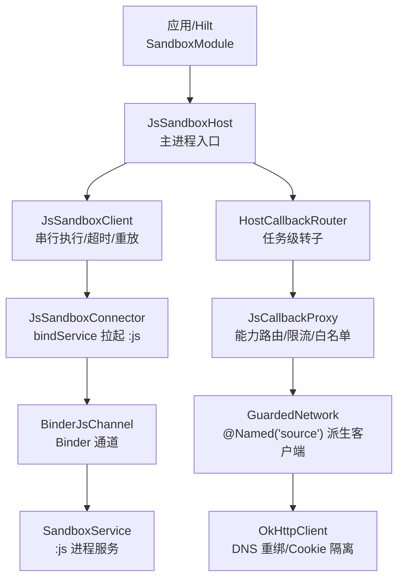
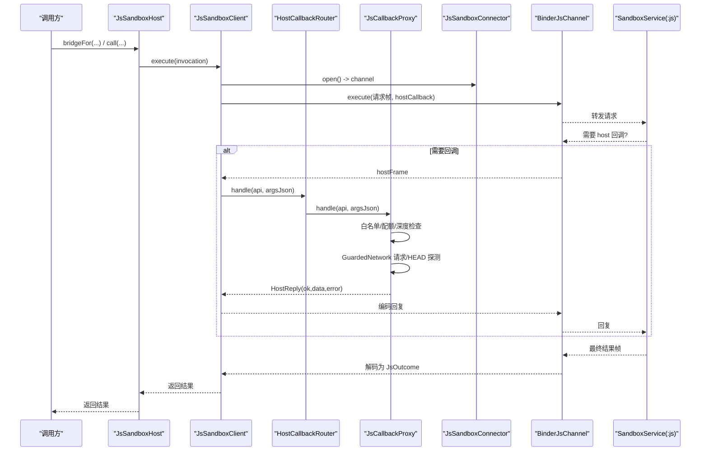
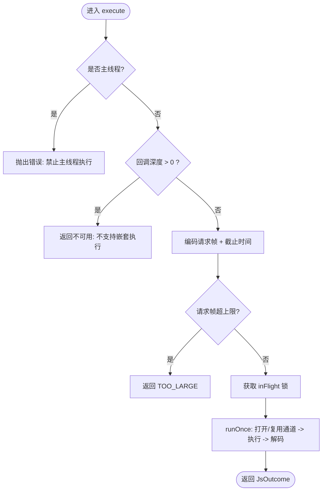
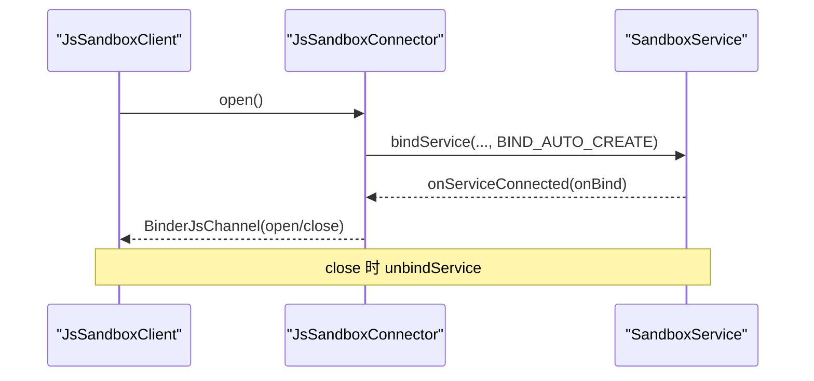
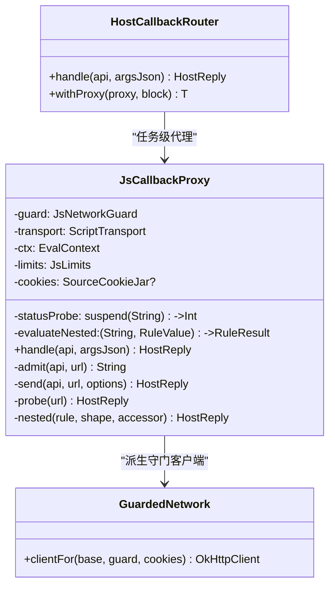
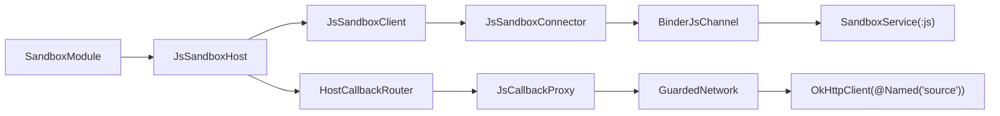

# 沙箱模块（SandboxModule）

<cite>
**本文引用的文件**
- [SandboxModule.kt](file://lib_book_common/src/main/java/com/ebook/common/di/SandboxModule.kt)
- [JsSandboxHost.kt](file://lib_book_source/src/main/java/com/ebook/source/sandbox/JsSandboxHost.kt)
- [JsSandboxClient.kt](file://lib_book_source/src/main/java/com/ebook/source/sandbox/JsSandboxClient.kt)
- [JsSandboxConnector.kt](file://lib_book_source/src/main/java/com/ebook/source/sandbox/JsSandboxConnector.kt)
- [JsLimits.kt](file://lib_book_source/src/main/java/com/ebook/source/sandbox/JsLimits.kt)
- [JsCallbackProxy.kt](file://lib_book_source/src/main/java/com/ebook/source/sandbox/JsCallbackProxy.kt)
- [JsProtocol.kt](file://lib_book_source/src/main/java/com/ebook/source/sandbox/JsProtocol.kt)
- [BinderJsChannel.kt](file://lib_book_source/src/main/java/com/ebook/source/sandbox/BinderJsChannel.kt)
- [SandboxService.kt](file://lib_book_source/src/main/java/com/ebook/source/sandbox/SandboxService.kt)
</cite>

## 目录
1. [简介](#简介)
2. [项目结构](#项目结构)
3. [核心组件](#核心组件)
4. [架构总览](#架构总览)
5. [详细组件分析](#详细组件分析)
6. [依赖关系分析](#依赖关系分析)
7. [性能与限制](#性能与限制)
8. [故障排查指南](#故障排查指南)
9. [结论](#结论)

## 简介
本模块为“脚本源解析”的沙箱执行体系，负责在主进程与独立的 `:js` 沙箱进程之间安全、可控地执行用户提供的脚本规则。核心职责包括：
- 通过 Hilt 装配 JsSandboxHost，提供主进程侧统一入口；
- 使用 JsSandboxClient 串行化调用、跨进程传输与回调路由；
- 通过 JsSandboxConnector 建立与 SandboxService 的 Binder 通道；
- 以 HostCallbackRouter 将沙箱的 host 回调路由到当前任务代理；
- 以 JsCallbackProxy 实现网络白名单、配额、深度限制、变量与会话管理；
- 以 JsLimits 集中定义资源上限与安全边界；
- 通过 OkHttp 的 @Named("source") 纯净客户端派生带 DNS 重绑防护与 Cookie 隔离的守门客户端，避免用户 token 泄漏与私网访问。

## 项目结构
- 装配层（Hilt）位于 lib_book_common，确保 lib_book_source 无 Hilt/KSP 依赖也能被注入使用。
- 执行与控制层位于 lib_book_source，包含客户端、连接器、回调代理、协议与传输等。
- 运行时服务 SandboxService 在 :js 进程中承载 QuickJS 内核与 JNI 桥接。

**图示来源**
- [SandboxModule.kt:18-55](file://lib_book_common/src/main/java/com/ebook/common/di/SandboxModule.kt#L18-L55)
- [JsSandboxHost.kt:21-60](file://lib_book_source/src/main/java/com/ebook/source/sandbox/JsSandboxHost.kt#L21-L60)
- [JsSandboxClient.kt:35-185](file://lib_book_source/src/main/java/com/ebook/source/sandbox/JsSandboxClient.kt#L35-L185)
- [JsSandboxConnector.kt:24-142](file://lib_book_source/src/main/java/com/ebook/source/sandbox/JsSandboxConnector.kt#L24-L142)
- [JsCallbackProxy.kt:105-506](file://lib_book_source/src/main/java/com/ebook/source/sandbox/JsCallbackProxy.kt#L105-L506)

**章节来源**
- [SandboxModule.kt:18-55](file://lib_book_common/src/main/java/com/ebook/common/di/SandboxModule.kt#L18-L55)

## 核心组件
- SandboxModule：提供 JsSandboxHost 单例，注入 @Named("source") 纯净客户端，构造 JsLimits、HostCallbackRouter，并延迟创建 JsSandboxClient 连接。
- JsSandboxHost：封装一条长命客户端与任务级回调代理，暴露 call/bridgeFor 作为唯一入口。
- JsSandboxClient：执行调度器，负责超时计算、重放策略、host 回调中继、主线程保护与嵌套自锁。
- JsSandboxConnector：绑定 SandboxService，等待 IBinder，返回 BinderJsChannel；失败抛出不可用异常而非断连异常。
- HostCallbackRouter：维护当前任务的 HostHandler，withProxy 保证一次任务内唯一代理。
- JsCallbackProxy：实现宿主 API 路由、网络准入/限流、变量与会话、嵌套求值深度控制、响应大小限制等。
- JsLimits：集中配置挂钟、堆栈、报文、回调深度、绑定超时、请求次数等安全边界。
- GuardedNetwork：基于 @Named("source") 构建带 DNS 重绑与 Cookie 隔离的客户端，供探测与取体共用。

**章节来源**
- [SandboxModule.kt:18-55](file://lib_book_common/src/main/java/com/ebook/common/di/SandboxModule.kt#L18-L55)
- [JsSandboxHost.kt:21-60](file://lib_book_source/src/main/java/com/ebook/source/sandbox/JsSandboxHost.kt#L21-L60)
- [JsSandboxClient.kt:35-185](file://lib_book_source/src/main/java/com/ebook/source/sandbox/JsSandboxClient.kt#L35-L185)
- [JsSandboxConnector.kt:24-142](file://lib_book_source/src/main/java/com/ebook/source/sandbox/JsSandboxConnector.kt#L24-L142)
- [JsCallbackProxy.kt:105-506](file://lib_book_source/src/main/java/com/ebook/source/sandbox/JsCallbackProxy.kt#L105-L506)
- [JsLimits.kt:1-58](file://lib_book_source/src/main/java/com/ebook/source/sandbox/JsLimits.kt#L1-L58)

## 架构总览
沙箱执行从主进程发起，经客户端序列化请求帧，跨进程交由 :js 执行器运行。执行过程中如需读取网页或状态码，会通过 host 回调回到主进程，由 HostCallbackRouter 路由到当前任务代理（JsCallbackProxy），再由 GuardedNetwork 通过受控的 OkHttpClient 发起请求，最后结果回传至执行器。所有资源与并发行为受 JsLimits 约束。

**图示来源**
- [JsSandboxHost.kt:29-59](file://lib_book_source/src/main/java/com/ebook/source/sandbox/JsSandboxHost.kt#L29-L59)
- [JsSandboxClient.kt:65-185](file://lib_book_source/src/main/java/com/ebook/source/sandbox/JsSandboxClient.kt#L65-L185)
- [JsSandboxConnector.kt:37-60](file://lib_book_source/src/main/java/com/ebook/source/sandbox/JsSandboxConnector.kt#L37-L60)
- [JsCallbackProxy.kt:152-239](file://lib_book_source/src/main/java/com/ebook/source/sandbox/JsCallbackProxy.kt#L152-L239)
- [JsCallbackProxy.kt:474-506](file://lib_book_source/src/main/java/com/ebook/source/sandbox/JsCallbackProxy.kt#L474-L506)

## 详细组件分析

### SandboxModule：进程级装配
- 提供 @Singleton 的 JsSandboxHost，注入 ApplicationContext 与 @Named("source") 纯净客户端。
- 先创建 HostCallbackRouter，再将其显式传给 JsSandboxClient 与 JsSandboxHost，避免多实例导致回调找不到任务。
- JsSandboxClient 的连接是懒创建的（openChannel lambda），首次真正执行时才 bind :js 进程，冷启动零开销。
- 不预热连接：未用到脚本的源不会触发跨进程绑定。

**章节来源**
- [SandboxModule.kt:18-55](file://lib_book_common/src/main/java/com/ebook/common/di/SandboxModule.kt#L18-L55)

### JsSandboxHost：主进程装配面
- 对外暴露 call(proxy, invocation) 与 bridgeFor(ctx, guard, transport, bindings, cookies)。
- call 通过 router.withProxy 包装一次执行，确保回调期间路由到正确代理。
- bridgeFor 用于 ScriptBookParser 等场景，构造 SandboxScriptJs，并将 HeadStatusProbe 与 GuardedNetwork 接入探测/取体链路。

**章节来源**
- [JsSandboxHost.kt:21-60](file://lib_book_source/src/main/java/com/ebook/source/sandbox/JsSandboxHost.kt#L21-L60)

### JsSandboxClient：执行调度与安全保障
- 主线程保护：execute 开始前校验不在主线程，防止阻塞 UI。
- 嵌套自锁：通过 ThreadLocal 深度计数，阻止在 host 回调中再次发起执行，避免死锁。
- 串行化：inFlight 锁保证同一时刻仅一帧在飞，从而可安全使用 binder 缓冲上限。
- 超时与重放：encode 时附加截止时间；断连后若本次尚未产生副作用则重连并重放一次。
- 尺寸限制：请求帧与 host 回复均按 JsLimits 判断超限，拒绝大报文。
- 异常收敛：通道异常转为不可用结果，协议异常保留以便定位构建不同步问题。

**图示来源**
- [JsSandboxClient.kt:65-185](file://lib_book_source/src/main/java/com/ebook/source/sandbox/JsSandboxClient.kt#L65-L185)

**章节来源**
- [JsSandboxClient.kt:35-185](file://lib_book_source/src/main/java/com/ebook/source/sandbox/JsSandboxClient.kt#L35-L185)

### JsSandboxConnector：进程绑定与通道创建
- bindService 拉起 SandboxService，内部 Connection 等待 onServiceConnected/onNullBinding/onBindingDied，带超时。
- 未成功绑定抛 SandboxUnavailableException，避免误判为断连重放。
- 返回 BinderJsChannel，close 时解绑，确保旧连接失效。

**图示来源**
- [JsSandboxConnector.kt:37-60](file://lib_book_source/src/main/java/com/ebook/source/sandbox/JsSandboxConnector.kt#L37-L60)
- [SandboxService.kt](file://lib_book_source/src/main/java/com/ebook/source/sandbox/SandboxService.kt)

**章节来源**
- [JsSandboxConnector.kt:24-142](file://lib_book_source/src/main/java/com/ebook/source/sandbox/JsSandboxConnector.kt#L24-L142)

### HostCallbackRouter 与 JsCallbackProxy：回调路由与能力实现
- HostCallbackRouter 维护当前任务的 HostHandler，withProxy 保证一次执行期间唯一代理；若没有当前代理，回调直接返回“无任务”。
- JsCallbackProxy 实现 host API：
  - 网络类：ajax/load/post/responseCode/setContent/cookie 族
  - 变量：put/get/remove 变量、sourceVariable
  - 嵌套求值：getElements/getElement/queryString，限制最大深度
  - 日志：toast/log
- 准入与限流：
  - 白名单：JsNetworkGuard.check(url)
  - 配额：每任务 maxRequestsPerTask 次外呼
  - 深度：maxCallbackDepth 限制嵌套求值
  - 响应大小：maxHostReplyBytes 限制单次回调响应
- 会话隔离：通过 SourceCookieJar 与 GuardedNetwork 共享 cookie jar，避免半截会话。

**图示来源**
- [JsCallbackProxy.kt:105-506](file://lib_book_source/src/main/java/com/ebook/source/sandbox/JsCallbackProxy.kt#L105-L506)

**章节来源**
- [JsCallbackProxy.kt:152-239](file://lib_book_source/src/main/java/com/ebook/source/sandbox/JsCallbackProxy.kt#L152-L239)
- [JsCallbackProxy.kt:241-439](file://lib_book_source/src/main/java/com/ebook/source/sandbox/JsCallbackProxy.kt#L241-L439)
- [JsCallbackProxy.kt:474-506](file://lib_book_source/src/main/java/com/ebook/source/sandbox/JsCallbackProxy.kt#L474-L506)

### OkHttp 客户端配置与隔离策略
- 基础客户端：@Named("source") 纯净客户端，不带用户 token，专用于第三方站点请求。
- 派生客户端：GuardedNetwork.clientFor 基于 base.newBuilder() 设置自定义 DNS（GuardedDns）与 CookieJar，保持连接池与线程池共享，避免重复建连。
- 一致性：探测与取体必须共用同一派生客户端，防止“探测放行、取体被拒”的防线断裂。
- 安全：DNS 重绑在真正解析时生效，杜绝 DNS 重绑定攻击窗口；Cookie 隔离保证会话不泄漏到其他上下文。

**章节来源**
- [JsCallbackProxy.kt:482-506](file://lib_book_source/src/main/java/com/ebook/source/sandbox/JsCallbackProxy.kt#L482-L506)

### 沙箱限制配置（JsLimits）与安全边界
- wallClockMs：单次执行挂钟上限，执行器线程逐轮中断，host 阻塞调用可能不受立即打断。
- heapBytes/stackBytes：QuickJS 堆与栈上限，栈上限需结合线程剩余栈做二次收紧，避免 native 栈溢出。
- maxRequestBytes/maxOutcomeBytes/maxHostReplyBytes：binder 事务缓冲限制下的帧大小上限，本地提前拒绝大报文，避免 TransactionTooLargeException。
- maxCallbackDepth：嵌套规则求值深度上限，防止深递归导致的栈风险。
- bindTimeoutMs：绑定 :js 进程的超时，避免冷启动长时间等待。
- maxRequestsPerTask：单任务外呼次数上限，防止 while(true) ajax 滥用。

**章节来源**
- [JsLimits.kt:1-58](file://lib_book_source/src/main/java/com/ebook/source/sandbox/JsLimits.kt#L1-L58)

### 主线程保护与回调路由机制
- 主线程保护：JsSandboxClient.execute 检测 Looper 是否为主线程，若在则直接拒绝，避免 ANR。
- 回调路由：HostCallbackRouter.withProxy 在执行期间挂载任务级代理，回调期间通过 JsCallbackProxy.handle 路由到具体能力；若无当前代理，返回“无任务”错误，便于诊断。
- 嵌套保护：insideHostCall 深度计数防止在回调中再次执行 JS，避免双向死锁。

**章节来源**
- [JsSandboxClient.kt:45-68](file://lib_book_source/src/main/java/com/ebook/source/sandbox/JsSandboxClient.kt#L45-L68)
- [JsCallbackProxy.kt:57-75](file://lib_book_source/src/main/java/com/ebook/source/sandbox/JsCallbackProxy.kt#L57-L75)

## 依赖关系分析
- 装配依赖：SandboxModule 依赖 Hilt（@Module/@Provides）、OkHttpClient（@Named("source")）、Android Context。
- 运行时依赖：JsSandboxHost 依赖 JsSandboxClient、HostCallbackRouter、JsLimits；JsSandboxClient 依赖 JsSandboxConnector、JsProtocol、JsLimits；JsSandboxConnector 依赖 Android Service 绑定；JsCallbackProxy 依赖 JsNetworkGuard、ScriptTransport、OkHttpClient。
- 进程边界：主进程与 :js 进程通过 BinderJsChannel 通信，SandboxService 在 :js 进程提供执行环境。

**图示来源**
- [SandboxModule.kt:18-55](file://lib_book_common/src/main/java/com/ebook/common/di/SandboxModule.kt#L18-L55)
- [JsSandboxHost.kt:21-60](file://lib_book_source/src/main/java/com/ebook/source/sandbox/JsSandboxHost.kt#L21-L60)
- [JsSandboxClient.kt:35-185](file://lib_book_source/src/main/java/com/ebook/source/sandbox/JsSandboxClient.kt#L35-L185)
- [JsSandboxConnector.kt:24-142](file://lib_book_source/src/main/java/com/ebook/source/sandbox/JsSandboxConnector.kt#L24-L142)
- [JsCallbackProxy.kt:105-506](file://lib_book_source/src/main/java/com/ebook/source/sandbox/JsCallbackProxy.kt#L105-L506)

**章节来源**
- [SandboxModule.kt:18-55](file://lib_book_common/src/main/java/com/ebook/common/di/SandboxModule.kt#L18-L55)
- [JsSandboxHost.kt:21-60](file://lib_book_source/src/main/java/com/ebook/source/sandbox/JsSandboxHost.kt#L21-L60)
- [JsSandboxClient.kt:35-185](file://lib_book_source/src/main/java/com/ebook/source/sandbox/JsSandboxClient.kt#L35-L185)
- [JsSandboxConnector.kt:24-142](file://lib_book_source/src/main/java/com/ebook/source/sandbox/JsSandboxConnector.kt#L24-L142)
- [JsCallbackProxy.kt:105-506](file://lib_book_source/src/main/java/com/ebook/source/sandbox/JsCallbackProxy.kt#L105-L506)

## 性能与限制
- 冷启动零开销：JsSandboxClient 不预建连接，首次执行才绑定 :js 进程。
- 串行执行：inFlight 锁保证一帧在飞，避免 binder 缓冲争用与大报文竞争。
- 超时与限流：wallClockMs 限制单次执行时间，maxRequestsPerTask 限制外呼次数，maxHostReplyBytes 限制回调响应大小。
- 内存与栈：heapBytes/stackBytes 限制 QuickJS 内存与栈，避免深递归与指数分配。
- 网络优化：GuardedNetwork 共享连接池与线程池，减少建连开销；DNS 重绑在解析时生效，避免额外 RTT。

[本节为通用指导，不直接分析具体文件]

## 故障排查指南
- 主线程调用：若出现“脚本沙箱不能在主线程执行”，请确保调用发生在非 UI 线程。
- 绑定失败：若报“绑定脚本沙箱执行器失败”或“系统拒绝绑定”，检查 SandboxService 是否可用、权限与清单配置是否正确。
- 回调找不到任务：若 host 回调返回“主进程没有正在进行的脚本任务”，确认 HostCallbackRouter 已显式传入 JsSandboxHost 与 JsSandboxClient，且 withProxy 包裹了执行。
- 嵌套执行：若提示“不支持嵌套执行”，检查是否在 host 回调中再次发起 JS 执行，应拆分逻辑或改用嵌套求值接口。
- 报文过大：若报“请求/响应超出字节上限”，调整规则以减少绑定数据或分页抓取。
- 配额耗尽：若报“本轮任务已用满外呼上限”，检查是否存在循环请求或过多 CDN 图片抓取。
- 会话不一致：若 HEAD 能通但取体失败，确认探测与取体使用同一 GuardedNetwork 派生客户端与同一 CookieJar。

**章节来源**
- [JsSandboxClient.kt:65-98](file://lib_book_source/src/main/java/com/ebook/source/sandbox/JsSandboxClient.kt#L65-L98)
- [JsSandboxConnector.kt:37-60](file://lib_book_source/src/main/java/com/ebook/source/sandbox/JsSandboxConnector.kt#L37-L60)
- [JsCallbackProxy.kt:152-239](file://lib_book_source/src/main/java/com/ebook/source/sandbox/JsCallbackProxy.kt#L152-L239)
- [JsLimits.kt:13-58](file://lib_book_source/src/main/java/com/ebook/source/sandbox/JsLimits.kt#L13-L58)

## 结论
沙箱模块通过清晰的层次划分与严格的安全边界，实现了脚本源解析的可扩展性与安全性。SandboxModule 负责装配，JsSandboxHost 提供统一入口，JsSandboxClient 保障执行时序与资源限制，JsSandboxConnector 管理进程绑定，HostCallbackRouter 与 JsCallbackProxy 协作完成回调路由与能力实现，GuardedNetwork 通过 @Named("source") 纯净客户端派生实现网络隔离与白名单控制。配合 JsLimits 的各项限制，系统在可用性、安全性与性能之间取得平衡。

[本节为总结性内容，不直接分析具体文件]