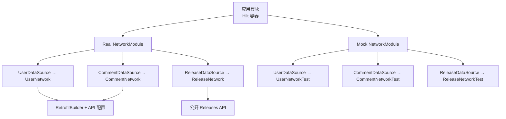
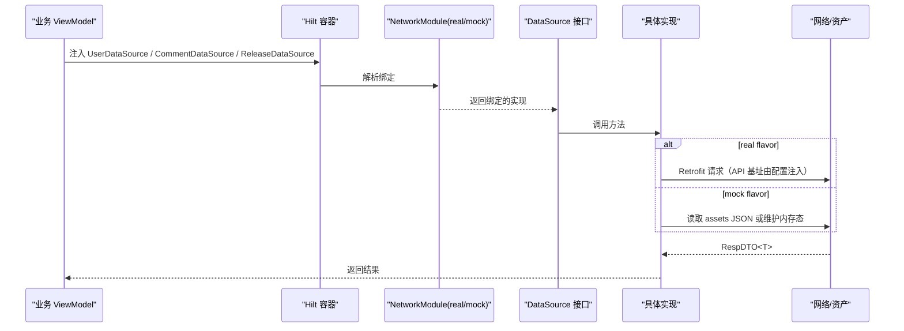
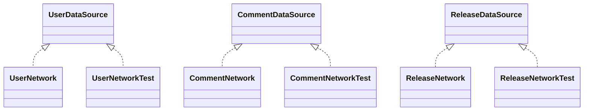
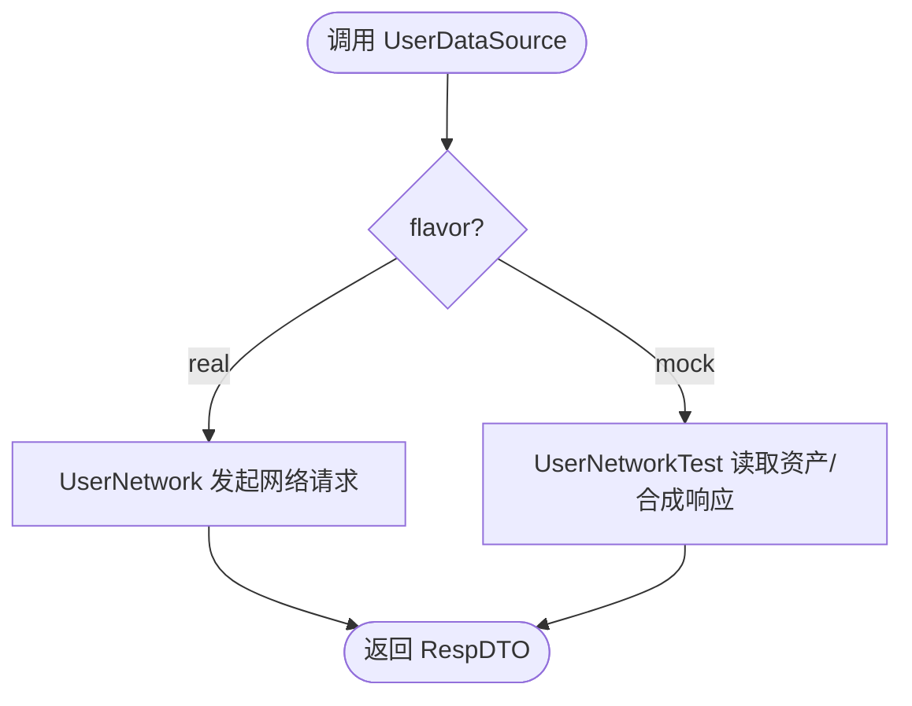
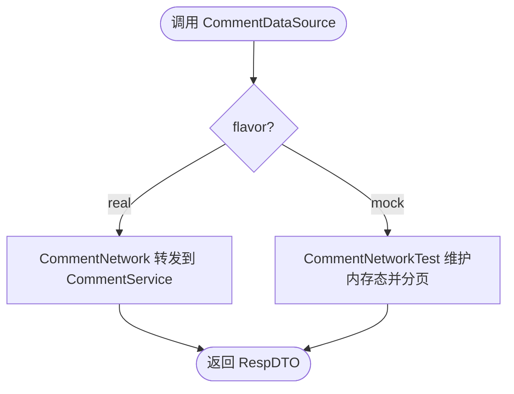
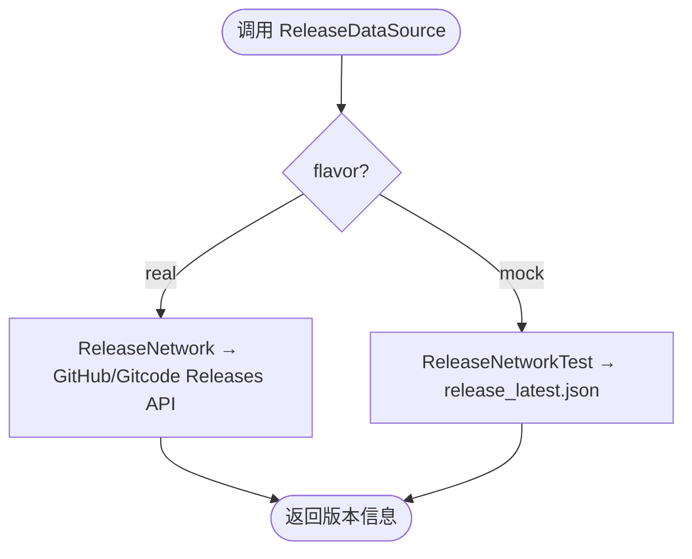
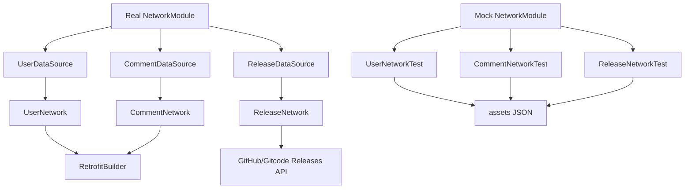

# 网络模块 (NetworkModule)

<cite>
**本文引用的文件**
- [module_app/src/real/java/com/ebook/di/NetworkModule.kt](file://module_app/src/real/java/com/ebook/di/NetworkModule.kt)
- [module_app/src/mock/java/com/ebook/di/NetworkModule.kt](file://module_app/src/mock/java/com/ebook/di/NetworkModule.kt)
- [lib_ebook_api/src/main/java/com/ebook/api/service/user/UserDataSource.kt](file://lib_ebook_api/src/main/java/com/ebook/api/service/user/UserDataSource.kt)
- [lib_ebook_api/src/main/java/com/ebook/api/service/user/UserNetwork.kt](file://lib_ebook_api/src/main/java/com/ebook/api/service/user/UserNetwork.kt)
- [lib_ebook_api/src/main/java/com/ebook/api/service/user/UserNetworkTest.kt](file://lib_ebook_api/src/main/java/com/ebook/api/service/user/UserNetworkTest.kt)
- [lib_ebook_api/src/main/java/com/ebook/api/service/comment/CommentDataSource.kt](file://lib_ebook_api/src/main/java/com/ebook/api/service/comment/CommentDataSource.kt)
- [lib_ebook_api/src/main/java/com/ebook/api/service/comment/CommentNetwork.kt](file://lib_ebook_api/src/main/java/com/ebook/api/service/comment/CommentNetwork.kt)
- [lib_ebook_api/src/main/java/com/ebook/api/service/comment/CommentNetworkTest.kt](file://lib_ebook_api/src/main/java/com/ebook/api/service/comment/CommentNetworkTest.kt)
- [lib_ebook_api/src/main/java/com/ebook/api/service/release/ReleaseDataSource.kt](file://lib_ebook_api/src/main/java/com/ebook/api/service/release/ReleaseDataSource.kt)
- [lib_ebook_api/src/main/java/com/ebook/api/service/release/ReleaseNetwork.kt](file://lib_ebook_api/src/main/java/com/ebook/api/service/release/ReleaseNetwork.kt)
- [lib_ebook_api/src/main/java/com/ebook/api/service/release/ReleaseNetworkTest.kt](file://lib_ebook_api/src/main/java/com/ebook/api/service/release/ReleaseNetworkTest.kt)
- [lib_ebook_api/src/main/java/com/ebook/api/RetrofitBuilder.kt](file://lib_ebook_api/src/main/java/com/ebook/api/RetrofitBuilder.kt)
</cite>

## 目录
1. [引言](#引言)
2. [项目结构](#项目结构)
3. [核心组件](#核心组件)
4. [架构总览](#架构总览)
5. [详细组件分析](#详细组件分析)
6. [依赖关系分析](#依赖关系分析)
7. [性能与扩展性考虑](#性能与扩展性考虑)
8. [故障排查指南](#故障排查指南)
9. [结论](#结论)

## 引言
本文件聚焦于应用层的网络注入模块 NetworkModule，说明其在 real 与 mock 两种构建变体下的绑定策略与切换机制；解释基于 @Binds 的接口抽象设计；阐述 UserDataSource、CommentDataSource、ReleaseDataSource 等数据源在真实后端与内存模拟之间的实现选择；说明 real flavor 下对 ebook-server 基址与认证的配置要点，以及 ReleaseDataSource 的特殊处理（指向 GitHub/Gitcode 公开 Releases API）；并提供网络层扩展与自定义的指导原则。

## 项目结构
NetworkModule 以 Hilt Module + Dagger @Binds 的方式，按 product flavor 提供不同的实现绑定：
- real flavor：将 DataSource 接口绑定到真实网络实现（UserNetwork、CommentNetwork、ReleaseNetwork），这些实现通过 RetrofitBuilder 构造对应服务的客户端，并由配置常量注入 ebook-server 基址。
- mock flavor：将 DataSource 接口绑定到内存模拟实现（UserNetworkTest、CommentNetworkTest、ReleaseNetworkTest），这些实现从 lib_ebook_api/assets 读取 JSON 资产，无需后端即可运行全链路。

图表来源
- [module_app/src/real/java/com/ebook/di/NetworkModule.kt:14-35](file://module_app/src/real/java/com/ebook/di/NetworkModule.kt#L14-L35)
- [module_app/src/mock/java/com/ebook/di/NetworkModule.kt:14-37](file://module_app/src/mock/java/com/ebook/di/NetworkModule.kt#L14-L37)
- [lib_ebook_api/src/main/java/com/ebook/api/service/user/UserNetwork.kt:20-27](file://lib_ebook_api/src/main/java/com/ebook/api/service/user/UserNetwork.kt#L20-L27)
- [lib_ebook_api/src/main/java/com/ebook/api/service/comment/CommentNetwork.kt:18-25](file://lib_ebook_api/src/main/java/com/ebook/api/service/comment/CommentNetwork.kt#L18-L25)
- [lib_ebook_api/src/main/java/com/ebook/api/service/release/ReleaseNetwork.kt:1-200](file://lib_ebook_api/src/main/java/com/ebook/api/service/release/ReleaseNetwork.kt#L1-L200)

章节来源
- [module_app/src/real/java/com/ebook/di/NetworkModule.kt:14-35](file://module_app/src/real/java/com/ebook/di/NetworkModule.kt#L14-L35)
- [module_app/src/mock/java/com/ebook/di/NetworkModule.kt:14-37](file://module_app/src/mock/java/com/ebook/di/NetworkModule.kt#L14-L37)

## 核心组件
- 接口抽象层
  - UserDataSource：定义用户认证与个人信息相关能力（登录、注册、刷新 token、登出、改密、验证码、更新资料、上传头像）。
  - CommentDataSource：定义评论聚合查询、我的评论、迁移等能力。
  - ReleaseDataSource：定义版本发布检查的数据访问能力。
- 真实实现层（real flavor）
  - UserNetwork、CommentNetwork：封装 Retrofit 服务调用，基址来自 API 配置。
  - ReleaseNetwork：对接 GitHub/Gitcode 公开 Releases API。
- 模拟实现层（mock flavor）
  - UserNetworkTest、CommentNetworkTest、ReleaseNetworkTest：基于 assets 中的 JSON 资产或内存状态，提供离线可用的稳定响应。

章节来源
- [lib_ebook_api/src/main/java/com/ebook/api/service/user/UserDataSource.kt:16-47](file://lib_ebook_api/src/main/java/com/ebook/api/service/user/UserDataSource.kt#L16-L47)
- [lib_ebook_api/src/main/java/com/ebook/api/service/comment/CommentDataSource.kt:8-34](file://lib_ebook_api/src/main/java/com/ebook/api/service/comment/CommentDataSource.kt#L8-L34)
- [lib_ebook_api/src/main/java/com/ebook/api/service/release/ReleaseDataSource.kt:1-200](file://lib_ebook_api/src/main/java/com/ebook/api/service/release/ReleaseDataSource.kt#L1-L200)
- [lib_ebook_api/src/main/java/com/ebook/api/service/user/UserNetwork.kt:20-67](file://lib_ebook_api/src/main/java/com/ebook/api/service/user/UserNetwork.kt#L20-L67)
- [lib_ebook_api/src/main/java/com/ebook/api/service/comment/CommentNetwork.kt:13-47](file://lib_ebook_api/src/main/java/com/ebook/api/service/comment/CommentNetwork.kt#L13-L47)
- [lib_ebook_api/src/main/java/com/ebook/api/service/release/ReleaseNetwork.kt:1-200](file://lib_ebook_api/src/main/java/com/ebook/api/service/release/ReleaseNetwork.kt#L1-L200)
- [lib_ebook_api/src/main/java/com/ebook/api/service/user/UserNetworkTest.kt:24-95](file://lib_ebook_api/src/main/java/com/ebook/api/service/user/UserNetworkTest.kt#L24-L95)
- [lib_ebook_api/src/main/java/com/ebook/api/service/comment/CommentNetworkTest.kt:21-253](file://lib_ebook_api/src/main/java/com/ebook/api/service/comment/CommentNetworkTest.kt#L21-L253)
- [lib_ebook_api/src/main/java/com/ebook/api/service/release/ReleaseNetworkTest.kt:1-200](file://lib_ebook_api/src/main/java/com/ebook/api/service/release/ReleaseNetworkTest.kt#L1-L200)

## 架构总览
NetworkModule 通过 Hilt 的 @InstallIn(SingletonComponent::class) 将 DataSource 接口与其具体实现绑定。real 与 mock 两个同名模块分别位于 module_app/src/real 和 module_app/src/mock，由 Gradle 的 product flavor 选择编译哪一份，从而实现运行时替换。

图表来源
- [module_app/src/real/java/com/ebook/di/NetworkModule.kt:24-35](file://module_app/src/real/java/com/ebook/di/NetworkModule.kt#L24-L35)
- [module_app/src/mock/java/com/ebook/di/NetworkModule.kt:26-37](file://module_app/src/mock/java/com/ebook/di/NetworkModule.kt#L26-L37)
- [lib_ebook_api/src/main/java/com/ebook/api/service/user/UserNetwork.kt:20-27](file://lib_ebook_api/src/main/java/com/ebook/api/service/user/UserNetwork.kt#L20-L27)
- [lib_ebook_api/src/main/java/com/ebook/api/service/comment/CommentNetwork.kt:18-25](file://lib_ebook_api/src/main/java/com/ebook/api/service/comment/CommentNetwork.kt#L18-L25)
- [lib_ebook_api/src/main/java/com/ebook/api/service/release/ReleaseNetwork.kt:1-200](file://lib_ebook_api/src/main/java/com/ebook/api/service/release/ReleaseNetwork.kt#L1-L200)
- [lib_ebook_api/src/main/java/com/ebook/api/service/user/UserNetworkTest.kt:24-95](file://lib_ebook_api/src/main/java/com/ebook/api/service/user/UserNetworkTest.kt#L24-L95)
- [lib_ebook_api/src/main/java/com/ebook/api/service/comment/CommentNetworkTest.kt:44-253](file://lib_ebook_api/src/main/java/com/ebook/api/service/comment/CommentNetworkTest.kt#L44-L253)

## 详细组件分析

### @Binds 与接口抽象设计
- 使用 Dagger @Binds 将 DataSource 接口绑定到具体实现，保证调用方只依赖接口，便于在不同 flavor 间切换。
- real flavor 的 NetworkModule 将 UserDataSource、CommentDataSource、ReleaseDataSource 分别绑定到 UserNetwork、CommentNetwork、ReleaseNetwork。
- mock flavor 的 NetworkModule 将同样三个接口绑定到对应的 Test 实现，使开发调试无需后端。

图表来源
- [module_app/src/real/java/com/ebook/di/NetworkModule.kt:24-35](file://module_app/src/real/java/com/ebook/di/NetworkModule.kt#L24-L35)
- [module_app/src/mock/java/com/ebook/di/NetworkModule.kt:26-37](file://module_app/src/mock/java/com/ebook/di/NetworkModule.kt#L26-L37)
- [lib_ebook_api/src/main/java/com/ebook/api/service/user/UserNetwork.kt:20-27](file://lib_ebook_api/src/main/java/com/ebook/api/service/user/UserNetwork.kt#L20-L27)
- [lib_ebook_api/src/main/java/com/ebook/api/service/comment/CommentNetwork.kt:18-25](file://lib_ebook_api/src/main/java/com/ebook/api/service/comment/CommentNetwork.kt#L18-L25)
- [lib_ebook_api/src/main/java/com/ebook/api/service/release/ReleaseNetwork.kt:1-200](file://lib_ebook_api/src/main/java/com/ebook/api/service/release/ReleaseNetwork.kt#L1-L200)
- [lib_ebook_api/src/main/java/com/ebook/api/service/user/UserNetworkTest.kt:24-95](file://lib_ebook_api/src/main/java/com/ebook/api/service/user/UserNetworkTest.kt#L24-L95)
- [lib_ebook_api/src/main/java/com/ebook/api/service/comment/CommentNetworkTest.kt:44-253](file://lib_ebook_api/src/main/java/com/ebook/api/service/comment/CommentNetworkTest.kt#L44-L253)
- [lib_ebook_api/src/main/java/com/ebook/api/service/release/ReleaseNetworkTest.kt:1-200](file://lib_ebook_api/src/main/java/com/ebook/api/service/release/ReleaseNetworkTest.kt#L1-L200)

章节来源
- [module_app/src/real/java/com/ebook/di/NetworkModule.kt:14-35](file://module_app/src/real/java/com/ebook/di/NetworkModule.kt#L14-L35)
- [module_app/src/mock/java/com/ebook/di/NetworkModule.kt:14-37](file://module_app/src/mock/java/com/ebook/di/NetworkModule.kt#L14-L37)

### UserDataSource 实现选择
- real 路径：UserNetwork 通过 RetrofitBuilder 创建服务客户端，基址由 API 配置注入（包含主机与端口），所有方法透传至 UserService。
- mock 路径：UserNetworkTest 从 assets 中读取固定 JSON 资产作为响应，部分写操作（如 updateMe、uploadAvatar）进行本地合成或返回占位值。

图表来源
- [lib_ebook_api/src/main/java/com/ebook/api/service/user/UserNetwork.kt:20-67](file://lib_ebook_api/src/main/java/com/ebook/api/service/user/UserNetwork.kt#L20-L67)
- [lib_ebook_api/src/main/java/com/ebook/api/service/user/UserNetworkTest.kt:24-95](file://lib_ebook_api/src/main/java/com/ebook/api/service/user/UserNetworkTest.kt#L24-L95)

章节来源
- [lib_ebook_api/src/main/java/com/ebook/api/service/user/UserNetwork.kt:20-67](file://lib_ebook_api/src/main/java/com/ebook/api/service/user/UserNetwork.kt#L20-L67)
- [lib_ebook_api/src/main/java/com/ebook/api/service/user/UserNetworkTest.kt:24-95](file://lib_ebook_api/src/main/java/com/ebook/api/service/user/UserNetworkTest.kt#L24-L95)

### CommentDataSource 实现选择
- real 路径：CommentNetwork 将评论查询参数转为逗号分隔字符串，并透传到 CommentService，支持 M2 的聚合键并集查询与迁移端点。
- mock 路径：CommentNetworkTest 维护两份内存态（我的评论与章节评论），首次懒加载 JSON 种子，之后增删改均影响内存列表；分页与时间戳遵循服务端契约。

图表来源
- [lib_ebook_api/src/main/java/com/ebook/api/service/comment/CommentNetwork.kt:13-47](file://lib_ebook_api/src/main/java/com/ebook/api/service/comment/CommentNetwork.kt#L13-L47)
- [lib_ebook_api/src/main/java/com/ebook/api/service/comment/CommentNetworkTest.kt:44-253](file://lib_ebook_api/src/main/java/com/ebook/api/service/comment/CommentNetworkTest.kt#L44-L253)

章节来源
- [lib_ebook_api/src/main/java/com/ebook/api/service/comment/CommentNetwork.kt:13-47](file://lib_ebook_api/src/main/java/com/ebook/api/service/comment/CommentNetwork.kt#L13-L47)
- [lib_ebook_api/src/main/java/com/ebook/api/service/comment/CommentNetworkTest.kt:44-253](file://lib_ebook_api/src/main/java/com/ebook/api/service/comment/CommentNetworkTest.kt#L44-L253)

### ReleaseDataSource 特殊处理
- real 路径：ReleaseNetwork 不指向内部 ebook-server，而是直接调用 GitHub/Gitcode 的公开 Releases API（匿名、无 token）。
- mock 路径：ReleaseNetworkTest 使用固定资产 release_latest.json，避免 CI 与离线开发依赖外网可达性。

图表来源
- [lib_ebook_api/src/main/java/com/ebook/api/service/release/ReleaseNetwork.kt:1-200](file://lib_ebook_api/src/main/java/com/ebook/api/service/release/ReleaseNetwork.kt#L1-L200)
- [lib_ebook_api/src/main/java/com/ebook/api/service/release/ReleaseNetworkTest.kt:1-200](file://lib_ebook_api/src/main/java/com/ebook/api/service/release/ReleaseNetworkTest.kt#L1-L200)

章节来源
- [lib_ebook_api/src/main/java/com/ebook/api/service/release/ReleaseNetwork.kt:1-200](file://lib_ebook_api/src/main/java/com/ebook/api/service/release/ReleaseNetwork.kt#L1-L200)
- [lib_ebook_api/src/main/java/src/mock/java/com/ebook/di/NetworkModule.kt:14-37](file://module_app/src/mock/java/com/ebook/di/NetworkModule.kt#L14-L37)

### real flavor 下 ebook-server 基址与认证配置
- 基址注入：UserNetwork 与 CommentNetwork 通过 RetrofitBuilder 构造服务时，使用 API 配置（主机与端口）生成基础 URL。该配置由 build 阶段注入，避免硬编码。
- 认证配置：认证相关的拦截器与 token 管理集中在网络层与 Session 管理中，调用方不感知细节；Release 专用客户端为纯净客户端，不携带 token。

图表来源
- [lib_ebook_api/src/main/java/com/ebook/api/service/user/UserNetwork.kt:20-27](file://lib_ebook_api/src/main/java/com/ebook/api/service/user/UserNetwork.kt#L20-L27)
- [lib_ebook_api/src/main/java/com/ebook/api/service/comment/CommentNetwork.kt:18-25](file://lib_ebook_api/src/main/java/com/ebook/api/service/comment/CommentNetwork.kt#L18-L25)
- [lib_ebook_api/src/main/java/com/ebook/api/RetrofitBuilder.kt:1-200](file://lib_ebook_api/src/main/java/com/ebook/api/RetrofitBuilder.kt#L1-L200)

章节来源
- [lib_ebook_api/src/main/java/com/ebook/api/service/user/UserNetwork.kt:20-27](file://lib_ebook_api/src/main/java/com/ebook/api/service/user/UserNetwork.kt#L20-L27)
- [lib_ebook_api/src/main/java/com/ebook/api/service/comment/CommentNetwork.kt:18-25](file://lib_ebook_api/src/main/java/com/ebook/api/service/comment/CommentNetwork.kt#L18-L25)
- [lib_ebook_api/src/main/java/com/ebook/api/RetrofitBuilder.kt:1-200](file://lib_ebook_api/src/main/java/com/ebook/api/RetrofitBuilder.kt#L1-L200)

### 代码示例：网络模块的切换与配置
- 切换方式：通过 Gradle 的 product flavor 选择编译 src/real 或 src/mock 下的 NetworkModule，Hilt 自动装配相应实现。
- 配置要点：
  - real：确保 API 配置正确（ebook-server 主机与端口），并确保网络权限与拦截器可用。
  - mock：确认 assets 中的 JSON 资产与接口契约一致，必要时补充新资产的字段以匹配 DTO。

参考路径
- [module_app/src/real/java/com/ebook/di/NetworkModule.kt:14-35](file://module_app/src/real/java/com/ebook/di/NetworkModule.kt#L14-L35)
- [module_app/src/mock/java/com/ebook/di/NetworkModule.kt:14-37](file://module_app/src/mock/java/com/ebook/di/NetworkModule.kt#L14-L37)
- [lib_ebook_api/src/main/java/com/ebook/api/service/user/UserNetwork.kt:20-27](file://lib_ebook_api/src/main/java/com/ebook/api/service/user/UserNetwork.kt#L20-L27)
- [lib_ebook_api/src/main/java/com/ebook/api/service/comment/CommentNetwork.kt:18-25](file://lib_ebook_api/src/main/java/com/ebook/api/service/comment/CommentNetwork.kt#L18-L25)

## 依赖关系分析
- NetworkModule 依赖各 DataSource 接口及其实现类；实现类依赖 RetrofitBuilder 与 API 配置（real），或依赖测试资产管理器与 Json（mock）。
- ReleaseDataSource 的 real 实现独立于 ebook-server，直接与外部公开 API 通信；其 mock 实现使用本地资产，降低对外部网络的依赖。

图表来源
- [module_app/src/real/java/com/ebook/di/NetworkModule.kt:24-35](file://module_app/src/real/java/com/ebook/di/NetworkModule.kt#L24-L35)
- [module_app/src/mock/java/com/ebook/di/NetworkModule.kt:26-37](file://module_app/src/mock/java/com/ebook/di/NetworkModule.kt#L26-L37)
- [lib_ebook_api/src/main/java/com/ebook/api/service/user/UserNetwork.kt:20-27](file://lib_ebook_api/src/main/java/com/ebook/api/service/user/UserNetwork.kt#L20-L27)
- [lib_ebook_api/src/main/java/com/ebook/api/service/comment/CommentNetwork.kt:18-25](file://lib_ebook_api/src/main/java/com/ebook/api/service/comment/CommentNetwork.kt#L18-L25)
- [lib_ebook_api/src/main/java/com/ebook/api/service/release/ReleaseNetwork.kt:1-200](file://lib_ebook_api/src/main/java/com/ebook/api/service/release/ReleaseNetwork.kt#L1-L200)
- [lib_ebook_api/src/main/java/com/ebook/api/service/user/UserNetworkTest.kt:24-95](file://lib_ebook_api/src/main/java/com/ebook/api/service/user/UserNetworkTest.kt#L24-L95)
- [lib_ebook_api/src/main/java/com/ebook/api/service/comment/CommentNetworkTest.kt:44-253](file://lib_ebook_api/src/main/java/com/ebook/api/service/comment/CommentNetworkTest.kt#L44-L253)
- [lib_ebook_api/src/main/java/com/ebook/api/service/release/ReleaseNetworkTest.kt:1-200](file://lib_ebook_api/src/main/java/com/ebook/api/service/release/ReleaseNetworkTest.kt#L1-L200)

## 性能与扩展性考虑
- 解耦与可替换：通过 DataSource 接口与 @Binds，新增实现只需在同一 flavor source set 内提供实现并绑定，不影响上层调用。
- 资源隔离：real 与 mock 的实现分离清晰，便于并行开发与回归验证；mock 使用内存态与静态资产，提升测试稳定性与速度。
- 可扩展点：
  - 新增功能接口：在 DataSource 中添加方法，并在 real 与 mock 两端同步实现。
  - 新增数据源：新增 XxxDataSource 接口与 XxxNetwork/XxxNetworkTest 实现，并在对应 NetworkModule 中用 @Binds 绑定。
  - 配置扩展：如需新的基址或域名，应在 API 配置或 RetrofitBuilder 中集中管理，避免散落在实现类中。

[本节为通用指导，不直接分析具体文件]

## 故障排查指南
- 页面不闪退但数据永远加载不出来：常见于 mock 资产形态与服务端契约不一致，导致序列化异常被上层吞掉；需核对资产结构与 DTO 类型是否一致。
- 评论页空或无法删除：检查 CommentNetworkTest 的内存态初始化与 ID 自增策略，确保“本人”判定与用户名一致性。
- 登录态问题：确保 TokenHolder 与 Session 生命周期管理正确，且仅对白名单 host 附加认证头；Release 客户端不应携带 token。
- 基址配置错误：real flavor 下若 API 主机/端口不正确，请求会失败；请检查配置注入是否正确。

章节来源
- [lib_ebook_api/src/main/java/com/ebook/api/service/comment/CommentNetworkTest.kt:21-253](file://lib_ebook_api/src/main/java/com/ebook/api/service/comment/CommentNetworkTest.kt#L21-L253)
- [lib_ebook_api/src/main/java/com/ebook/api/service/user/UserNetworkTest.kt:24-95](file://lib_ebook_api/src/main/java/com/ebook/api/service/user/UserNetworkTest.kt#L24-L95)
- [lib_ebook_api/src/main/java/com/ebook/api/service/user/UserNetwork.kt:20-27](file://lib_ebook_api/src/main/java/com/ebook/api/service/user/UserNetwork.kt#L20-L27)
- [lib_ebook_api/src/main/java/com/ebook/api/service/comment/CommentNetwork.kt:18-25](file://lib_ebook_api/src/main/java/com/ebook/api/service/comment/CommentNetwork.kt#L18-L25)

## 结论
NetworkModule 通过 Hilt 的 @Binds 与 product flavor 实现了灵活的网络层切换：real flavor 连接 ebook-server 或公开 Releases API，mock flavor 提供稳定的离线开发体验。UserDataSource、CommentDataSource、ReleaseDataSource 三组接口与实现构成了清晰的边界，便于扩展与维护。建议在新增网络能力时，优先完善接口与契约，再在 real/mock 两端同步实现，并严格校验资产形态与服务端契约的一致性。