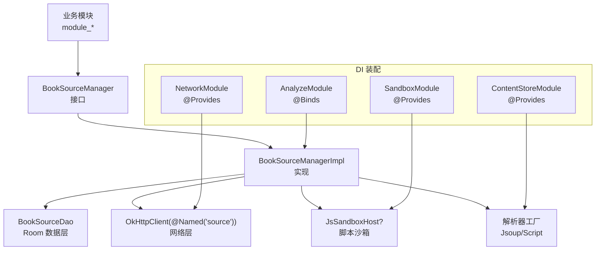
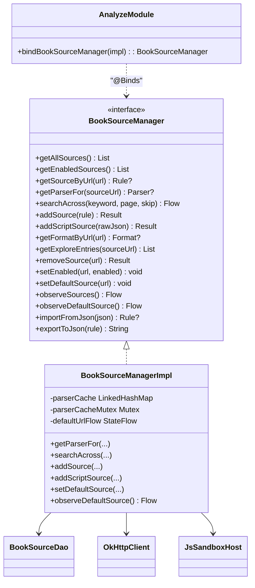
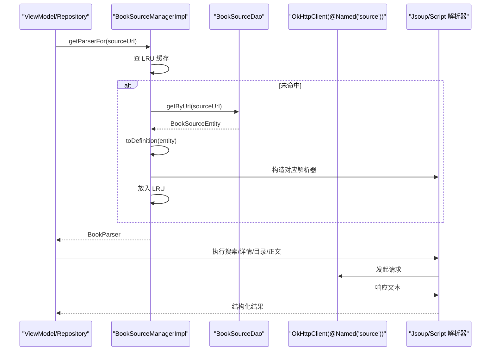
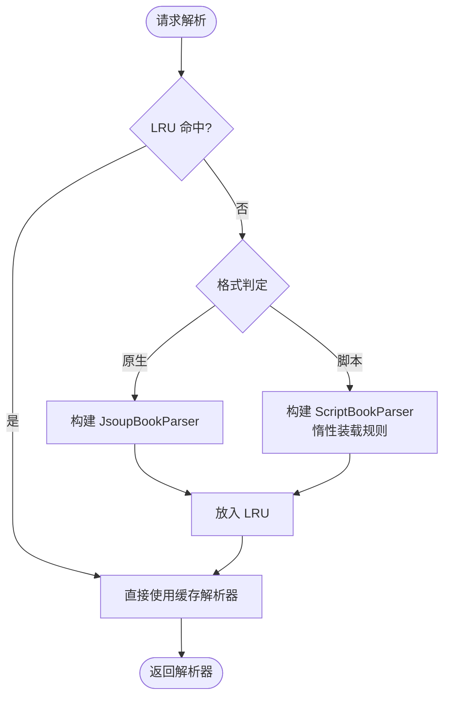
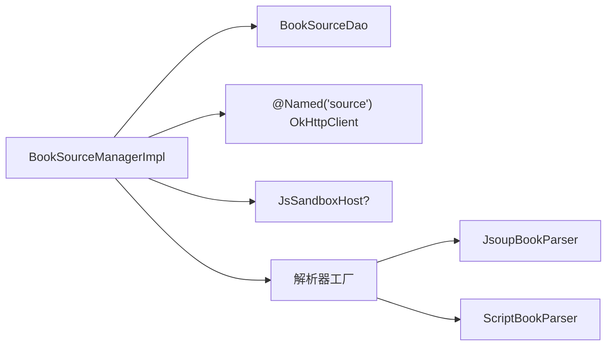

# 解析模块 (AnalyzeModule)

<cite>
**本文引用的文件**
- [AnalyzeModule.kt](file://lib_book_common/src/main/java/com/ebook/common/di/AnalyzeModule.kt)
- [BookSourceManager.kt](file://lib_book_common/src/main/java/com/ebook/common/analyze/source/BookSourceManager.kt)
- [BookSourceManagerImpl.kt](file://lib_book_common/src/main/java/com/ebook/common/analyze/source/BookSourceManagerImpl.kt)
- [SandboxModule.kt](file://lib_book_common/src/main/java/com/ebook/common/di/SandboxModule.kt)
- [NetworkModule.kt](file://lib_ebook_api/src/main/java/com/ebook/api/utils/NetworkModule.kt)
- [BookSourceDao.kt](file://lib_ebook_db/src/main/java/com/ebook/db/dao/BookSourceDao.kt)
- [ContentStoreModule.kt](file://lib_book_common/src/main/java/com/ebook/common/di/ContentStoreModule.kt)
- [BookSourceManagerImplTest.kt](file://lib_book_common/src/test/java/com/ebook/common/analyze/source/BookSourceManagerImplTest.kt)
</cite>

## 目录
1. [简介](#简介)
2. [项目结构](#项目结构)
3. [核心组件](#核心组件)
4. [架构总览](#架构总览)
5. [详细组件分析](#详细组件分析)
6. [依赖关系分析](#依赖关系分析)
7. [性能考量](#性能考量)
8. [故障排查指南](#故障排查指南)
9. [结论](#结论)
10. [附录：注入与使用示例、扩展指南](#附录注入与使用示例扩展指南)

## 简介
本模块围绕“书源解析”的核心职责，提供多书源共存、插件化解析器与动态加载能力。通过 Hilt 的依赖注入装配，将抽象接口 BookSourceManager 与其具体实现 BookSourceManagerImpl 绑定，并以 AnalyzeModule 作为解析域的配置入口。解析器支持原生规则（Jsoup）与脚本书源（Script），通过统一接口对外暴露搜索、详情、目录、正文读取等能力；默认源、启用态、聚合搜索、缓存失效等策略在 Manager 层集中收敛，保证行为一致性与可测试性。

## 项目结构
解析相关代码主要分布在以下位置：
- lib_book_common: 解析域 DI 配置（AnalyzeModule）、书源管理器接口与实现（BookSourceManager/Impl）、沙箱宿主装配（SandboxModule）、内容存储装配（ContentStoreModule）。
- lib_ebook_api: 网络客户端装配（@Named("source") 纯净客户端）。
- lib_ebook_db: 书源表 DAO（BookSourceDao），Room 事实源。
- module_*: 业务侧通过 ViewModel/Repository 消费 BookSourceManager，不直调 DAO。

**图表来源**
- [AnalyzeModule.kt:11-18](file://lib_book_common/src/main/java/com/ebook/common/di/AnalyzeModule.kt#L11-L18)
- [BookSourceManagerImpl.kt:84-119](file://lib_book_common/src/main/java/com/ebook/common/analyze/source/BookSourceManagerImpl.kt#L84-L119)
- [NetworkModule.kt:44-56](file://lib_ebook_api/src/main/java/com/ebook/api/utils/NetworkModule.kt#L44-L56)
- [SandboxModule.kt:29-55](file://lib_book_common/src/main/java/com/ebook/common/di/SandboxModule.kt#L29-L55)
- [ContentStoreModule.kt:27-87](file://lib_book_common/src/main/java/com/ebook/common/di/ContentStoreModule.kt#L27-L87)

**章节来源**
- [AnalyzeModule.kt:11-18](file://lib_book_common/src/main/java/com/ebook/common/di/AnalyzeModule.kt#L11-L18)
- [BookSourceManager.kt:10-50](file://lib_book_common/src/main/java/com/ebook/common/analyze/source/BookSourceManager.kt#L10-L50)
- [BookSourceDao.kt:7-24](file://lib_ebook_db/src/main/java/com/ebook/db/dao/BookSourceDao.kt#L7-L24)

## 核心组件
- AnalyzeModule：Hilt 模块，负责以 @Binds 将 BookSourceManager 接口绑定到 BookSourceManagerImpl 实现，作用域为 @Singleton。
- BookSourceManager：书源解析的统一抽象，提供清单查询、默认源订阅、聚合搜索、导入导出、解析器获取等能力。
- BookSourceManagerImpl：实现类，封装 Room 事实源、LRU 解析器缓存、默认源现算、格式路由（原生/脚本）、并发编排与错误收敛。
- SandboxModule：装配脚本沙箱宿主（可选），用于执行含 JS 的规则段。
- NetworkModule：提供纯净 OkHttpClient（@Named("source")），避免 token 泄漏至第三方书源。
- ContentStoreModule：装配本地内容与章节读取能力，支撑导入与正文读取。

**章节来源**
- [AnalyzeModule.kt:11-18](file://lib_book_common/src/main/java/com/ebook/common/di/AnalyzeModule.kt#L11-L18)
- [BookSourceManager.kt:51-277](file://lib_book_common/src/main/java/com/ebook/common/analyze/source/BookSourceManager.kt#L51-L277)
- [BookSourceManagerImpl.kt:84-119](file://lib_book_common/src/main/java/com/ebook/common/analyze/source/BookSourceManagerImpl.kt#L84-L119)
- [SandboxModule.kt:29-55](file://lib_book_common/src/main/java/com/ebook/common/di/SandboxModule.kt#L29-L55)
- [NetworkModule.kt:44-56](file://lib_ebook_api/src/main/java/com/ebook/api/utils/NetworkModule.kt#L44-L56)
- [ContentStoreModule.kt:27-87](file://lib_book_common/src/main/java/com/ebook/common/di/ContentStoreModule.kt#L27-L87)

## 架构总览
解析模块采用“接口 + 实现 + DI 装配”的分层设计：
- 抽象层：BookSourceManager 定义清晰边界，屏蔽底层 Room、网络、解析器等细节。
- 实现层：BookSourceManagerImpl 负责状态管理、并发控制、缓存失效、默认源现算与错误收敛。
- 装配层：AnalyzeModule 通过 @Binds 注入；SandboxModule/NetworkModule/ContentStoreModule 提供外部依赖。
- 数据层：BookSourceDao 是书源清单的唯一事实源，所有读操作均走挂起或 Flow，杜绝内存快照。

**图表来源**
- [BookSourceManager.kt:51-277](file://lib_book_common/src/main/java/com/ebook/common/analyze/source/BookSourceManager.kt#L51-L277)
- [BookSourceManagerImpl.kt:84-119](file://lib_book_common/src/main/java/com/ebook/common/analyze/source/BookSourceManagerImpl.kt#L84-L119)
- [AnalyzeModule.kt:11-18](file://lib_book_common/src/main/java/com/ebook/common/di/AnalyzeModule.kt#L11-L18)

## 详细组件分析

### AnalyzeModule：依赖注入与单例作用域
- 角色：声明式地将 BookSourceManager 绑定到 BookSourceManagerImpl，确保全局唯一实例。
- 注解：
  - @Module/@InstallIn(SingletonComponent::class)：注册模块并限定生命周期为应用级单例。
  - @Binds/@Singleton：绑定接口与实现，并标记为单例。
- 优势：调用方仅依赖抽象接口，便于替换与测试；单例保证资源（如 LRU 缓存）复用。

**章节来源**
- [AnalyzeModule.kt:11-18](file://lib_book_common/src/main/java/com/ebook/common/di/AnalyzeModule.kt#L11-L18)

### BookSourceManager：抽象设计与职责边界
- 设计要点：
  - 多书源共存：按 tag/sourceUrl 绑定归属，解析一律跟书走。
  - 规则类型化读面（getAll/getEnabled/getByUrl）只返回原生规则行；脚本行由 observeSources 带 format 元数据暴露。
  - 默认源载体 SourceDefinition 兼容两种格式，且每次现算，无内存快照。
  - 聚合搜索 searchAcross：并发上限 5，失败不中断整条流，事件增量产出。
  - 导入导出：import/export 纯函数，不落库；脚本源原样落库。
- 错误处理：null 语义严格区分“不存在/坏行”，脚本行取 parser 不为 null，异常类型化抛出。

**章节来源**
- [BookSourceManager.kt:10-50](file://lib_book_common/src/main/java/com/ebook/common/analyze/source/BookSourceManager.kt#L10-L50)
- [BookSourceManager.kt:51-277](file://lib_book_common/src/main/java/com/ebook/common/analyze/source/BookSourceManager.kt#L51-L277)

### BookSourceManagerImpl：实现绑定与生命周期管理
- 初始化：构造期仅建立 SharedPreferences、StateFlow 初始值；无 IO，冷启动轻量。
- 默认源现算：defaultFromRows 从 Room 行中挑选（SP 命中优先，否则第一条启用行），两种格式平等。
- 解析器缓存：LRU 容量小（PARSER_CACHE_SIZE=3），配合 Mutex 串行化访问，避免并发重复构建。
- 格式路由：toDefinition 按 format 分派到 JsoupBookParser 或 ScriptBookParser；脚本行惰性装载，首次求值才校验。
- 聚合搜索：searchAcross 对启用源并发解析，单源失败记录日志并产出 Failed 事件，AllFinished 始终发出。
- 写入路径：addSource/addScriptSource/removeSource/setEnabled/setDefaultSource 成功后统一 evictParser 失效缓存，并在必要时同步默认源。

**图表来源**
- [BookSourceManagerImpl.kt:433-443](file://lib_book_common/src/main/java/com/ebook/common/analyze/source/BookSourceManagerImpl.kt#L433-L443)
- [NetworkModule.kt:44-56](file://lib_ebook_api/src/main/java/com/ebook/api/utils/NetworkModule.kt#L44-L56)

**章节来源**
- [BookSourceManagerImpl.kt:84-119](file://lib_book_common/src/main/java/com/ebook/common/analyze/source/BookSourceManagerImpl.kt#L84-L119)
- [BookSourceManagerImpl.kt:197-238](file://lib_book_common/src/main/java/com/ebook/common/analyze/source/BookSourceManagerImpl.kt#L197-L238)
- [BookSourceManagerImpl.kt:433-443](file://lib_book_common/src/main/java/com/ebook/common/analyze/source/BookSourceManagerImpl.kt#L433-L443)
- [BookSourceManagerImpl.kt:464-510](file://lib_book_common/src/main/java/com/ebook/common/analyze/source/BookSourceManagerImpl.kt#L464-L510)
- [BookSourceManagerImpl.kt:525-637](file://lib_book_common/src/main/java/com/ebook/common/analyze/source/BookSourceManagerImpl.kt#L525-L637)
- [BookSourceManagerImpl.kt:692-778](file://lib_book_common/src/main/java/com/ebook/common/analyze/source/BookSourceManagerImpl.kt#L692-L778)
- [BookSourceManagerImpl.kt:817-851](file://lib_book_common/src/main/java/com/ebook/common/analyze/source/BookSourceManagerImpl.kt#L817-L851)

### 插件化设计与动态加载
- 插件化：解析器通过 parserFactory 按 SourceDefinition 分支生产，新增解析器只需在此处扩展分支。
- 动态加载：脚本解析器惰性装载规则，首次求值时才校验 JSON 与能力缺失；坏规则抛类型化异常，不影响其他源。
- 沙箱执行：JsSandboxHost 可选装配，含 JS 的规则段在主线程外执行，主进程回调通过 HostCallbackRouter 转发。

**图表来源**
- [BookSourceManagerImpl.kt:109-118](file://lib_book_common/src/main/java/com/ebook/common/analyze/source/BookSourceManagerImpl.kt#L109-L118)
- [BookSourceManagerImpl.kt:433-443](file://lib_book_common/src/main/java/com/ebook/common/analyze/source/BookSourceManagerImpl.kt#L433-L443)

**章节来源**
- [BookSourceManagerImpl.kt:109-118](file://lib_book_common/src/main/java/com/ebook/common/analyze/source/BookSourceManagerImpl.kt#L109-L118)
- [SandboxModule.kt:29-55](file://lib_book_common/src/main/java/com/ebook/common/di/SandboxModule.kt#L29-L55)

### 与其他组件的交互关系
- 网络层：通过 @Named("source") 纯净 OkHttpClient，超时短、加编码拦截器，避免 token 泄露。
- 存储层：Room BookSourceDao 是唯一事实源；内容存储（BookStore/ChapterReader）由 ContentStoreModule 装配，供导入与正文读取。
- 沙箱：JsSandboxHost 可选，未装配时脚本规则按“待执行”语义上报，不影响主流程可用性。

**章节来源**
- [NetworkModule.kt:44-56](file://lib_ebook_api/src/main/java/com/ebook/api/utils/NetworkModule.kt#L44-L56)
- [ContentStoreModule.kt:27-87](file://lib_book_common/src/main/java/com/ebook/common/di/ContentStoreModule.kt#L27-L87)
- [BookSourceDao.kt:7-24](file://lib_ebook_db/src/main/java/com/ebook/db/dao/BookSourceDao.kt#L7-L24)

## 依赖关系分析
- 内聚性：BookSourceManagerImpl 集中了默认源策略、缓存失效、并发编排与错误收敛，内聚度高。
- 耦合点：
  - 与 BookSourceDao：强依赖（事实源）。
  - 与 OkHttpClient(@Named("source"))：网络请求。
  - 与 JsSandboxHost：可选依赖，解耦脚本执行。
  - 与解析器工厂：开放扩展点，新增解析器仅需修改一处。
- 循环依赖：无。各模块职责清晰，通过 DI 装配降低直接耦合。

**图表来源**
- [BookSourceManagerImpl.kt:84-119](file://lib_book_common/src/main/java/com/ebook/common/analyze/source/BookSourceManagerImpl.kt#L84-L119)

**章节来源**
- [BookSourceManagerImpl.kt:84-119](file://lib_book_common/src/main/java/com/ebook/common/analyze/source/BookSourceManagerImpl.kt#L84-L119)

## 性能考量
- LRU 解析器缓存：容量小（3），减少对象重建开销；并发安全（Mutex）。
- 聚合搜索并发：上限 5，平衡体感与风控，避免触发第三方站点限流。
- 默认源现算：无内存快照，避免额外同步成本；订阅面通过 combine 高效合并变化。
- 惰性装载：脚本规则首次求值才解析，降低冷启动与常规路径开销。

[本节为通用指导，无需特定文件引用]

## 故障排查指南
- “没有可用书源”：检查 Room 是否有任何启用行；若无，页面应展示引导态。
- “某源解析失败”：查看聚合搜索中的 SourceFailed 事件与日志；脚本源可能因 JSON 或能力缺失导致。
- “改规则后解析不变”：确认写操作后是否调用了 evictParser（实现已内置，但需确认覆盖逻辑正确）。
- “脚本源不可用”：确认是否装配 JsSandboxHost；未装配时会报“待执行”。

**章节来源**
- [BookSourceManagerImpl.kt:464-510](file://lib_book_common/src/main/java/com/ebook/common/analyze/source/BookSourceManagerImpl.kt#L464-L510)
- [BookSourceManagerImpl.kt:817-851](file://lib_book_common/src/main/java/com/ebook/common/analyze/source/BookSourceManagerImpl.kt#L817-L851)

## 结论
解析模块通过清晰的接口抽象、集中的实现与灵活的 DI 装配，实现了多书源共存、插件化解析与动态加载。默认源现算、LRU 缓存、并发编排与错误收敛共同保证了系统的稳定性与可扩展性。开发者可通过扩展解析器工厂与适配脚本规则快速接入新站点。

[本节为总结，无需特定文件引用]

## 附录：注入与使用示例、扩展指南

### 注入与使用模式
- 在模块中通过 Hilt 注入 BookSourceManager，调用其方法完成书源管理与解析。
- 典型流程：
  - 订阅默认源：observeDefaultSource() 获取当前默认源。
  - 聚合搜索：searchAcross(keyword, page) 获取全站搜索结果。
  - 获取解析器：getParserFor(sourceUrl) 得到具体解析器进行详情/目录/正文读取。

**章节来源**
- [BookSourceManager.kt:51-277](file://lib_book_common/src/main/java/com/ebook/common/analyze/source/BookSourceManager.kt#L51-L277)
- [BookSourceManagerImplTest.kt:44-77](file://lib_book_common/src/test/java/com/ebook/common/analyze/source/BookSourceManagerImplTest.kt#L44-L77)

### 书源扩展与自定义开发指导
- 新增解析器：在 parserFactory 中添加分支，遵循 SourceDefinition 密封类型；保持惰性装载与类型化异常。
- 脚本规则：确保 JSON 符合社区规范；JS 段需在沙箱中执行；URL 模板与分页规则遵循规格。
- 导入与导出：使用 importFromJson/exportToJson 进行规则交换；注意字段映射与校验。
- 测试建议：注入假 parserFactory 锁定并发与编排行为；验证默认源回落、缓存失效与事件流。

**章节来源**
- [BookSourceManagerImpl.kt:109-118](file://lib_book_common/src/main/java/com/ebook/common/analyze/source/BookSourceManagerImpl.kt#L109-L118)
- [BookSourceManagerImpl.kt:856-865](file://lib_book_common/src/main/java/com/ebook/common/analyze/source/BookSourceManagerImpl.kt#L856-L865)
- [BookSourceManagerImplTest.kt:44-77](file://lib_book_common/src/test/java/com/ebook/common/analyze/source/BookSourceManagerImplTest.kt#L44-L77)