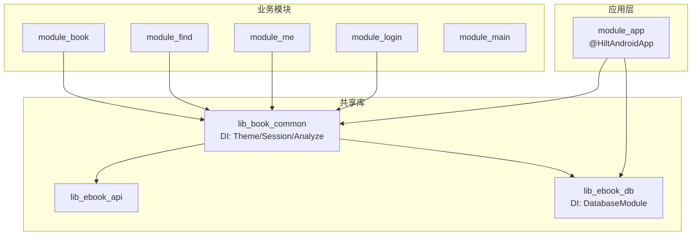
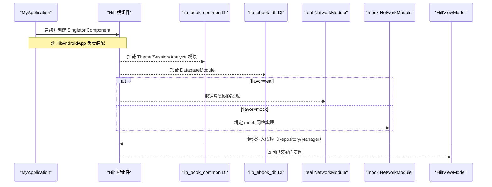
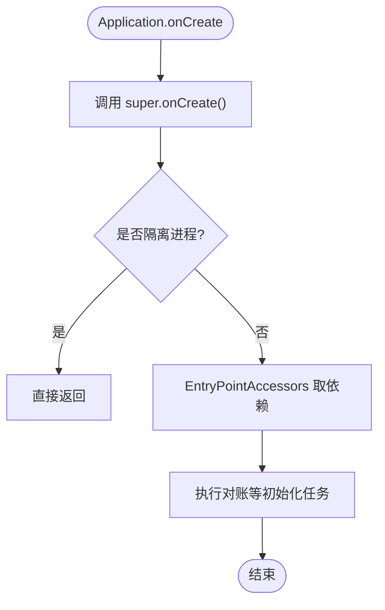
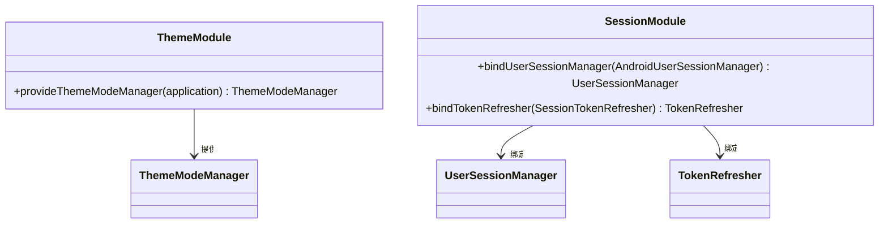
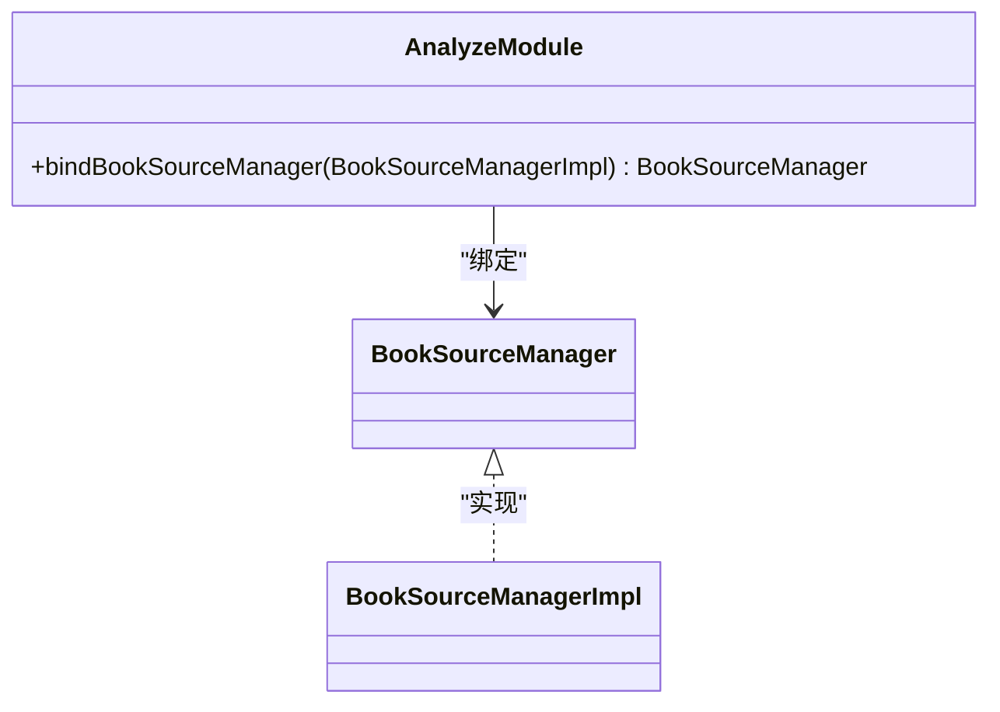
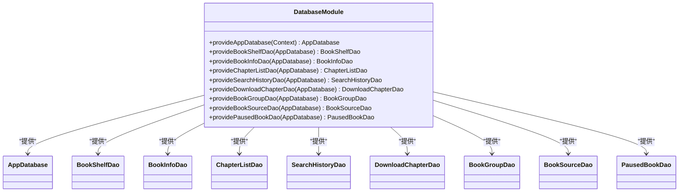
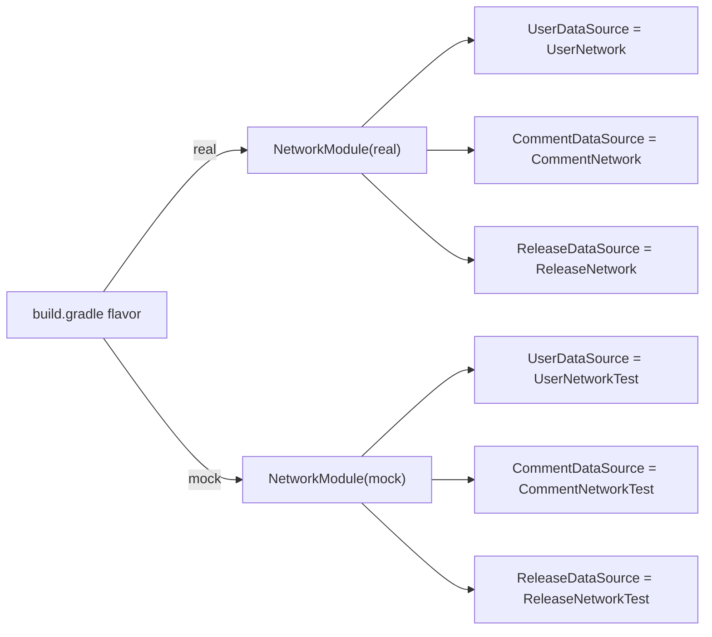
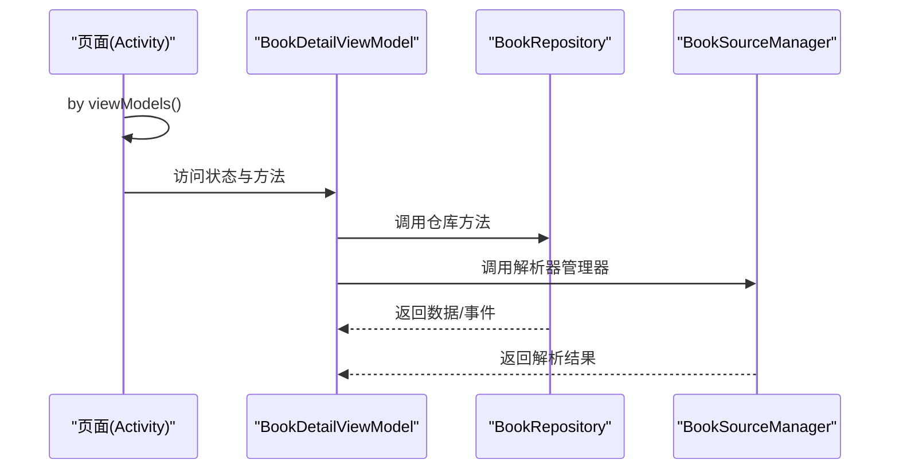

# 依赖注入与Hilt集成

<cite>
**本文引用的文件**
- [MyApplication.kt](file://module_app/src/main/java/com/ebook/MyApplication.kt)
- [ThemeModule.kt](file://lib_book_common/src/main/java/com/ebook/common/di/ThemeModule.kt)
- [SessionModule.kt](file://lib_book_common/src/main/java/com/ebook/common/di/SessionModule.kt)
- [AnalyzeModule.kt](file://lib_book_common/src/main/java/com/ebook/common/di/AnalyzeModule.kt)
- [DatabaseModule.kt](file://lib_ebook_db/src/main/java/com/ebook/db/di/DatabaseModule.kt)
- [NetworkModule.kt (real)](file://module_app/src/real/java/com/ebook/di/NetworkModule.kt)
- [NetworkModule.kt (mock)](file://module_app/src/mock/java/com/ebook/di/NetworkModule.kt)
- [BookDetailViewModel.kt](file://module_book/src/main/java/com/ebook/book/mvvm/viewmodel/BookDetailViewModel.kt)
- [ContentStoreEntryPoint.kt](file://module_app/src/main/java/com/ebook/MyApplication.kt)
</cite>

## 目录
1. [简介](#简介)
2. [项目结构](#项目结构)
3. [核心组件](#核心组件)
4. [架构总览](#架构总览)
5. [详细组件分析](#详细组件分析)
6. [依赖关系分析](#依赖关系分析)
7. [性能考量](#性能考量)
8. [故障排查指南](#故障排查指南)
9. [结论](#结论)
10. [附录：常见注入场景示例路径](#附录：常见注入场景示例路径)

## 简介
本文件系统性梳理本项目中基于 Hilt 的依赖注入方案，覆盖注解使用、作用域设计、跨模块装配、MVVM 集成、测试替身与常见问题。目标是让读者在不深入源码的前提下，也能理解并正确使用 Hilt 在本工程中的模式与最佳实践。

## 项目结构
本项目采用多模块架构：应用入口在 module_app，业务模块（module_main、module_book、module_find、module_me、module_login）通过 Provider 接口与共享库交互；共享能力集中在 lib_book_common、lib_book_source、lib_ebook_api、lib_ebook_db。Hilt 以 SingletonComponent 为根，各模块通过 Module + @InstallIn(SingletonComponent::class) 向全局图提供单例依赖；Activity/Fragment/ViewModel 通过 AndroidEntryPoint/HiltViewModel 获取依赖。

**图表来源**
- [MyApplication.kt:19-61](file://module_app/src/main/java/com/ebook/MyApplication.kt#L19-L61)
- [ThemeModule.kt:17-26](file://lib_book_common/src/main/java/com/ebook/common/di/ThemeModule.kt#L17-L26)
- [SessionModule.kt:22-37](file://lib_book_common/src/main/java/com/ebook/common/di/SessionModule.kt#L22-L37)
- [DatabaseModule.kt:25-27](file://lib_ebook_db/src/main/java/com/ebook/db/di/DatabaseModule.kt#L25-L27)

**章节来源**
- [MyApplication.kt:19-61](file://module_app/src/main/java/com/ebook/MyApplication.kt#L19-L61)
- [DatabaseModule.kt:25-27](file://lib_ebook_db/src/main/java/com/ebook/db/di/DatabaseModule.kt#L25-L27)

## 核心组件
- 应用入口与全局图
  - @HiltAndroidApp 标记 Application，启动时创建 Hilt 根组件（SingletonComponent）。
  - 通过 @EntryPoint 暴露给非注入点（如 Application 初始化阶段）按需取用依赖，避免字段注入时机过早。
- 模块级 DI 配置
  - 主题、会话、解析器等通用能力通过 @Module + @InstallIn(SingletonComponent::class) 暴露。
  - 数据库通过 Room 构建并在 @Provides 中暴露 DAO。
- 网络层绑定
  - real/mock flavor 通过同名 NetworkModule 切换实现（UserDataSource、CommentDataSource、ReleaseDataSource），便于离线开发与 CI。
- MVVM 集成
  - ViewModel 使用 @HiltViewModel + @Inject 构造器注入仓库与管理器；页面通过 by viewModels() 获取 VM。

**章节来源**
- [MyApplication.kt:19-61](file://module_app/src/main/java/com/ebook/MyApplication.kt#L19-L61)
- [ThemeModule.kt:17-26](file://lib_book_common/src/main/java/com/ebook/common/di/ThemeModule.kt#L17-L26)
- [SessionModule.kt:22-37](file://lib_book_common/src/main/java/com/ebook/common/di/SessionModule.kt#L22-L37)
- [DatabaseModule.kt:192-243](file://lib_ebook_db/src/main/java/com/ebook/db/di/DatabaseModule.kt#L192-L243)
- [NetworkModule.kt (real):24-35](file://module_app/src/real/java/com/ebook/di/NetworkModule.kt#L24-L35)
- [NetworkModule.kt (mock):26-37](file://module_app/src/mock/java/com/ebook/di/NetworkModule.kt#L26-L37)
- [BookDetailViewModel.kt:52-56](file://module_book/src/main/java/com/ebook/book/mvvm/viewmodel/BookDetailViewModel.kt#L52-L56)

## 架构总览
下图展示 Hilt 在全局图中的角色与各模块如何消费依赖：

**图表来源**
- [MyApplication.kt:19-61](file://module_app/src/main/java/com/ebook/MyApplication.kt#L19-L61)
- [ThemeModule.kt:17-26](file://lib_book_common/src/main/java/com/ebook/common/di/ThemeModule.kt#L17-L26)
- [SessionModule.kt:22-37](file://lib_book_common/src/main/java/com/ebook/common/di/SessionModule.kt#L22-L37)
- [DatabaseModule.kt:25-27](file://lib_ebook_db/src/main/java/com/ebook/db/di/DatabaseModule.kt#L25-L27)
- [NetworkModule.kt (real):24-35](file://module_app/src/real/java/com/ebook/di/NetworkModule.kt#L24-L35)
- [NetworkModule.kt (mock):26-37](file://module_app/src/mock/java/com/ebook/di/NetworkModule.kt#L26-L37)

## 详细组件分析

### 应用入口与 EntryPoint
- 使用 @HiltAndroidApp 标记 Application，保证全局依赖图可用。
- 为避免在沙箱进程或早期生命周期触发不必要的注入，采用 @EntryPoint + InstallIn(SingletonComponent::class) 在“用到时才取”，例如内容仓库对账。
- 关键约束：Application 上不要有 eager @Inject 字段，防止沙箱进程因读取不到数据而崩溃。

**图表来源**
- [MyApplication.kt:19-61](file://module_app/src/main/java/com/ebook/MyApplication.kt#L19-L61)

**章节来源**
- [MyApplication.kt:19-61](file://module_app/src/main/java/com/ebook/MyApplication.kt#L19-L61)

### 主题与会话管理（Singleton 作用域）
- ThemeModule：通过 @Provides + @Singleton 提供 ThemeModeManager，依赖 Application 上下文。
- SessionModule：通过 @Binds 将 UserSessionManager 与 TokenRefresher 的具体实现绑定到接口，统一生命周期与作用域。

**图表来源**
- [ThemeModule.kt:17-26](file://lib_book_common/src/main/java/com/ebook/common/di/ThemeModule.kt#L17-L26)
- [SessionModule.kt:22-37](file://lib_book_common/src/main/java/com/ebook/common/di/SessionModule.kt#L22-L37)

**章节来源**
- [ThemeModule.kt:17-26](file://lib_book_common/src/main/java/com/ebook/common/di/ThemeModule.kt#L17-L26)
- [SessionModule.kt:22-37](file://lib_book_common/src/main/java/com/ebook/common/di/SessionModule.kt#L22-L37)

### 书源解析能力（接口绑定）
- AnalyzeModule 将 BookSourceManagerImpl 绑定到 BookSourceManager 接口，供上层业务模块按接口消费，解耦具体实现。

**图表来源**
- [AnalyzeModule.kt:11-18](file://lib_book_common/src/main/java/com/ebook/common/di/AnalyzeModule.kt#L11-L18)

**章节来源**
- [AnalyzeModule.kt:11-18](file://lib_book_common/src/main/java/com/ebook/common/di/AnalyzeModule.kt#L11-L18)

### 数据库与 DAO（Room + Hilt）
- DatabaseModule 提供 AppDatabase 及所有 DAO 的单例提供者，包含版本迁移链。
- 通过 @ApplicationContext 限定 Context 来源，避免内存泄漏。

**图表来源**
- [DatabaseModule.kt:25-27](file://lib_ebook_db/src/main/java/com/ebook/db/di/DatabaseModule.kt#L25-L27)
- [DatabaseModule.kt:192-243](file://lib_ebook_db/src/main/java/com/ebook/db/di/DatabaseModule.kt#L192-L243)

**章节来源**
- [DatabaseModule.kt:192-243](file://lib_ebook_db/src/main/java/com/ebook/db/di/DatabaseModule.kt#L192-L243)

### 网络层 flavor 绑定（real vs mock）
- 通过同名 NetworkModule 在不同 flavor source set 下替换实现：
  - real：绑定真实后端（UserNetwork、CommentNetwork、ReleaseNetwork）。
  - mock：绑定内存实现（UserNetworkTest、CommentNetworkTest、ReleaseNetworkTest），配合静态 JSON 资产，无需后端即可运行全链路。

**图表来源**
- [NetworkModule.kt (real):24-35](file://module_app/src/real/java/com/ebook/di/NetworkModule.kt#L24-L35)
- [NetworkModule.kt (mock):26-37](file://module_app/src/mock/java/com/ebook/di/NetworkModule.kt#L26-L37)

**章节来源**
- [NetworkModule.kt (real):24-35](file://module_app/src/real/java/com/ebook/di/NetworkModule.kt#L24-L35)
- [NetworkModule.kt (mock):26-37](file://module_app/src/mock/java/com/ebook/di/NetworkModule.kt#L26-L37)

### MVVM 与 ViewModel 注入
- ViewModel 使用 @HiltViewModel 与 @Inject 构造器，从 Hilt 注入 Repository/Manager 等依赖。
- 页面通过 by viewModels() 获取 VM，基类处理 UI 状态与命令通道。

**图表来源**
- [BookDetailViewModel.kt:52-56](file://module_book/src/main/java/com/ebook/book/mvvm/viewmodel/BookDetailViewModel.kt#L52-L56)

**章节来源**
- [BookDetailViewModel.kt:52-100](file://module_book/src/main/java/com/ebook/book/mvvm/viewmodel/BookDetailViewModel.kt#L52-L100)

## 依赖关系分析
- 作用域策略
  - 全局单例：ThemeModeManager、UserSessionManager、TokenRefresher、BookSourceManager、数据库与 DAO、网络 DataSource 均在 SingletonComponent 中提供。
  - 组件级：当前代码未引入自定义子组件，业务依赖均走全局图。
  - Activity/Fragment/ViewModel：由 Hilt 自动管理与生命周期对齐，无需额外作用域。
- 模块耦合
  - 业务模块仅依赖接口（如 DataSource、BookSourceManager），实现由 flavor 或共享库装配，降低耦合。
  - 跨模块通过 Provider 接口（TheRouter）与 DI 共同协作，页面级 VM 注入减少模块间强依赖。
- 依赖验证
  - 通过 flavor 切换可验证不同实现是否正确注入。
  - 单元测试中使用同包内 Fake/Mock 替代复杂依赖，确保 VM/Repository 行为正确。

**章节来源**
- [SessionModule.kt:22-37](file://lib_book_common/src/main/java/com/ebook/common/di/SessionModule.kt#L22-L37)
- [AnalyzeModule.kt:11-18](file://lib_book_common/src/main/java/com/ebook/common/di/AnalyzeModule.kt#L11-L18)
- [NetworkModule.kt (real):24-35](file://module_app/src/real/java/com/ebook/di/NetworkModule.kt#L24-L35)
- [NetworkModule.kt (mock):26-37](file://module_app/src/mock/java/com/ebook/di/NetworkModule.kt#L26-L37)

## 性能考量
- 延迟初始化：使用 EntryPoint 在需要时取依赖，避免 Application 阶段构造昂贵对象。
- 单例复用：数据库、DAO、网络客户端、解析器等均为单例，减少重复创建开销。
- 避免过度注入：仅在必要时注入所需依赖，保持 ViewModel 轻量。

[本节为通用指导，不直接分析具体文件]

## 故障排查指南
- 循环依赖
  - 现象：启动时报循环依赖错误。
  - 排查：检查是否存在 A→B→A 的注入环；通过拆分职责或引入工厂/Provider 打破环。
- 作用域冲突
  - 现象：在不同作用域混用 Application/Context 导致异常。
  - 排查：确保 @Provides 使用 @ApplicationContext；确认 @Singleton 对象不持有短生命周期 Context。
- flavor 绑定失效
  - 现象：mock/real 切换后仍走旧实现。
  - 排查：确认同名 NetworkModule 位于正确的 flavor source set；清理重建。
- 注入时机不当
  - 现象：Application 阶段崩溃或沙箱进程异常。
  - 排查：移除 Application 上的 eager @Inject 字段，改用 EntryPoint 按需取用。

**章节来源**
- [MyApplication.kt:19-61](file://module_app/src/main/java/com/ebook/MyApplication.kt#L19-L61)
- [DatabaseModule.kt:192-208](file://lib_ebook_db/src/main/java/com/ebook/db/di/DatabaseModule.kt#L192-L208)
- [NetworkModule.kt (real):24-35](file://module_app/src/real/java/com/ebook/di/NetworkModule.kt#L24-L35)
- [NetworkModule.kt (mock):26-37](file://module_app/src/mock/java/com/ebook/di/NetworkModule.kt#L26-L37)

## 结论
本项目以 Hilt 为核心，围绕 SingletonComponent 组织全局依赖，结合 @Module/@Provides/@Binds/@Singleton 实现清晰的依赖声明与生命周期管理；通过 flavor 与接口绑定达成灵活的实现替换；MVVM 层借助 @HiltViewModel 完成 ViewModel 注入，整体具备良好的可测试性与可扩展性。遵循本文所述的最佳实践，可在多模块、多 flavor 环境下稳定扩展与维护依赖图。

[本节为总结，不直接分析具体文件]

## 附录：常见注入场景示例路径
- 应用级单例提供
  - 主题：[ThemeModule.kt:17-26](file://lib_book_common/src/main/java/com/ebook/common/di/ThemeModule.kt#L17-L26)
  - 会话：[SessionModule.kt:22-37](file://lib_book_common/src/main/java/com/ebook/common/di/SessionModule.kt#L22-L37)
  - 解析器：[AnalyzeModule.kt:11-18](file://lib_book_common/src/main/java/com/ebook/common/di/AnalyzeModule.kt#L11-L18)
- 数据库与 DAO
  - 数据库与 DAO：[DatabaseModule.kt:192-243](file://lib_ebook_db/src/main/java/com/ebook/db/di/DatabaseModule.kt#L192-L243)
- Flavor 网络实现
  - real：[NetworkModule.kt (real):24-35](file://module_app/src/real/java/com/ebook/di/NetworkModule.kt#L24-L35)
  - mock：[NetworkModule.kt (mock):26-37](file://module_app/src/mock/java/com/ebook/di/NetworkModule.kt#L26-L37)
- ViewModel 注入
  - 详情页 VM：[BookDetailViewModel.kt:52-100](file://module_book/src/main/java/com/ebook/book/mvvm/viewmodel/BookDetailViewModel.kt#L52-L100)
- 应用入口与延迟注入
  - EntryPoint 用法：[MyApplication.kt:19-61](file://module_app/src/main/java/com/ebook/MyApplication.kt#L19-L61)

[本节列出示例路径，不直接分析具体文件]