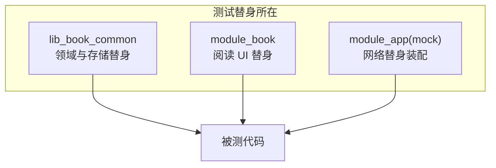
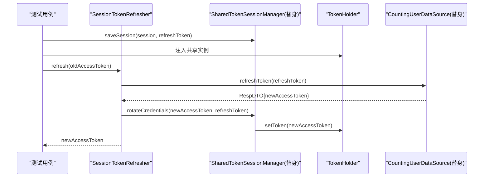
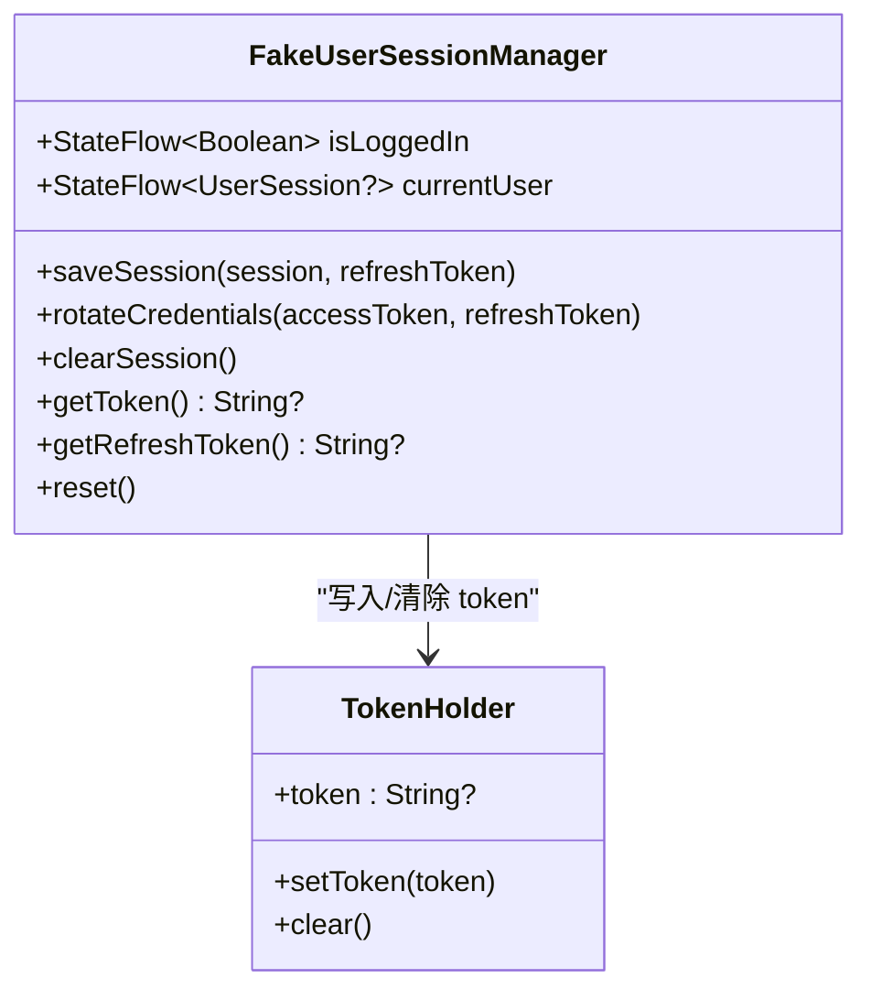
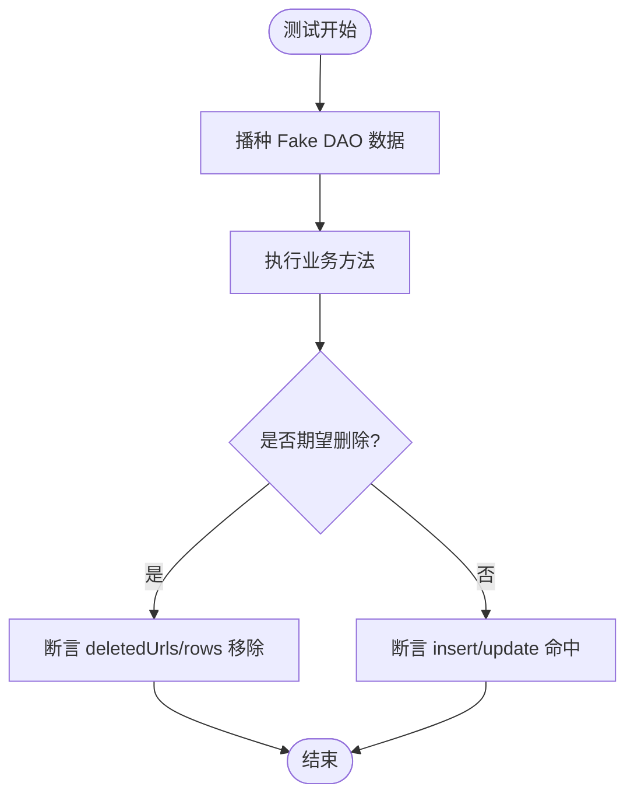
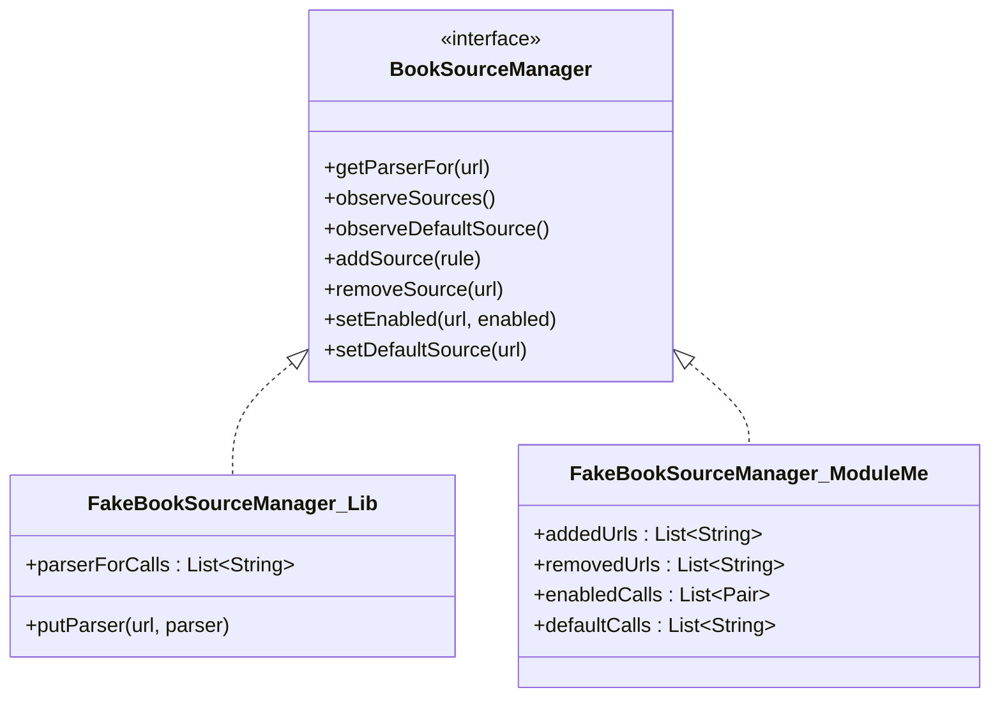
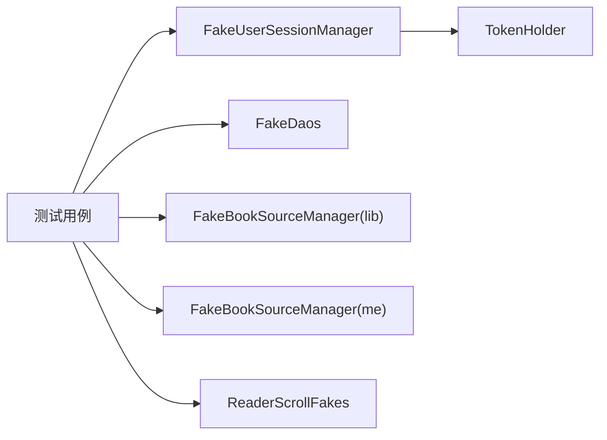
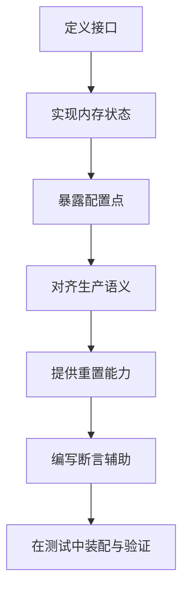

# Mock 对象与替身模式

<cite>
**本文引用的文件**
- [FakeUserSessionManager.kt](file://lib_book_common/src/test/java/com/ebook/common/domain/FakeUserSessionManager.kt)
- [UserSessionManagerTest.kt](file://lib_book_common/src/test/java/com/ebook/common/domain/UserSessionManagerTest.kt)
- [SessionTokenRefresherTest.kt](file://lib_book_common/src/test/java/com/ebook/common/domain/SessionTokenRefresherTest.kt)
- [FakeDaos.kt](file://lib_book_common/src/test/java/com/ebook/common/repository/FakeDaos.kt)
- [FakeBookSourceManager.kt（lib_book_common）](file://lib_book_common/src/test/java/com/ebook/common/analyze/source/FakeBookSourceManager.kt)
- [FakeBookSourceManager.kt（module_me）](file://module_me/src/test/java/com/ebook/me/mvvm/viewmodel/FakeBookSourceManager.kt)
- [ReaderScrollFakes.kt](file://module_book/src/test/java/com/ebook/book/reader/ReaderScrollFakes.kt)
- [NetworkModule.kt（mock flavor）](file://module_app/src/mock/java/com/ebook/di/NetworkModule.kt)
</cite>

## 目录
1. [引言](#引言)
2. [项目结构与测试替身分布](#项目结构与测试替身分布)
3. [核心组件与替身总览](#核心组件与替身总览)
4. [架构总览](#架构总览)
5. [详细组件分析](#详细组件分析)
6. [依赖关系与耦合分析](#依赖关系与耦合分析)
7. [性能与可维护性考虑](#性能与可维护性考虑)
8. [故障排查指南](#故障排查指南)
9. [结论](#结论)
10. [附录：配置化替身模板](#附录：配置化替身模板)

## 引言
本文件聚焦于该仓库中的“Mock 对象与替身模式”，以 FakeUserSessionManager 为核心案例，系统阐述 Fake、Stub、Spy、Mock 的使用边界与最佳实践；解释在不同测试层级（单元测试、集成测试、UI 测试、独立模块调试）如何选择合适的替代实现；并总结状态管理与断言验证策略，避免常见反模式。

## 项目结构与测试替身分布
- lib_book_common 的测试集中提供了领域层与存储层的通用替身：用户会话、DAO、书源管理器、解析器记录器等。
- module_* 业务模块在各自 test source set 中针对 ViewModel、页面逻辑编写轻量级替身（例如 ReaderScrollFakes）。
- 应用层通过 product flavor 的 mock 分支提供 NetworkModule，将网络请求替换为内存数据或固定响应，便于独立开发与调试。

[无具体源码映射，此图为概念示意]

**Section sources**
- [NetworkModule.kt（mock flavor）:1-200](file://module_app/src/mock/java/com/ebook/di/NetworkModule.kt#L1-L200)

## 核心组件与替身总览
- 用户会话管理
  - 真实职责：登录态、当前用户、token 驻内存与轮换、清会话。
  - 替身：FakeUserSessionManager（内存 StateFlow + TokenHolder），共享式 SharedTokenSessionManager（用于并发守卫测试）。
- DAO 层
  - 真实职责：Room DAO 接口。
  - 替身：FakeDaos 集合，包含书架、书籍信息、章节列表、分组、下载任务等内存实现，并提供统计/观察能力。
- 书源管理
  - 真实职责：按 tag 取解析器、默认源、增删改启用、导入导出、观察清单。
  - 替身：两份 FakeBookSourceManager（lib_book_common 侧重 parser 路由契约；module_me 侧重管理页行为契约与编解码简化）。
- 阅读滚动控制
  - 替身：ReaderScrollFakes，隔离渲染与布局细节，专注滚动/翻页逻辑验证。

**Section sources**
- [FakeUserSessionManager.kt:1-72](file://lib_book_common/src/test/java/com/ebook/common/domain/FakeUserSessionManager.kt#L1-L72)
- [SessionTokenRefresherTest.kt:259-308](file://lib_book_common/src/test/java/com/ebook/common/domain/SessionTokenRefresherTest.kt#L259-L308)
- [FakeDaos.kt:18-256](file://lib_book_common/src/test/java/com/ebook/common/repository/FakeDaos.kt#L18-L256)
- [FakeBookSourceManager.kt（lib_book_common）:15-129](file://lib_book_common/src/test/java/com/ebook/common/analyze/source/FakeBookSourceManager.kt#L15-L129)
- [FakeBookSourceManager.kt（module_me）:19-302](file://module_me/src/test/java/com/ebook/me/mvvm/viewmodel/FakeBookSourceManager.kt#L19-L302)
- [ReaderScrollFakes.kt:1-200](file://module_book/src/test/java/com/ebook/book/reader/ReaderScrollFakes.kt#L1-L200)

## 架构总览
以下序列图展示了“静默刷新”场景下，测试替身如何配合被测组件完成并发守卫、凭据轮换与状态同步。

**图表来源**
- [SessionTokenRefresherTest.kt:46-76](file://lib_book_common/src/test/java/com/ebook/common/domain/SessionTokenRefresherTest.kt#L46-L76)
- [SessionTokenRefresherTest.kt:259-308](file://lib_book_common/src/test/java/com/ebook/common/domain/SessionTokenRefresherTest.kt#L259-L308)
- [SessionTokenRefresherTest.kt:316-358](file://lib_book_common/src/test/java/com/ebook/common/domain/SessionTokenRefresherTest.kt#L316-L358)

**Section sources**
- [SessionTokenRefresherTest.kt:46-76](file://lib_book_common/src/test/java/com/ebook/common/domain/SessionTokenRefresherTest.kt#L46-L76)
- [SessionTokenRefresherTest.kt:259-308](file://lib_book_common/src/test/java/com/ebook/common/domain/SessionTokenRefresherTest.kt#L259-L308)
- [SessionTokenRefresherTest.kt:316-358](file://lib_book_common/src/test/java/com/ebook/common/domain/SessionTokenRefresherTest.kt#L316-L358)

## 详细组件分析

### 用户会话管理替身（FakeUserSessionManager）
- 设计要点
  - 使用 MutableStateFlow 暴露 isLoggedIn/currentUser，模拟生产态的响应式状态。
  - 与 TokenHolder 协作，确保 token 驻内存语义一致。
  - 记录 savedSessions/rotated/clearCount 供断言调用历史与副作用。
  - 提供 reset() 以便测试间隔离。
- 典型用法
  - 登录/登出流程：保存会话后断言登录态与 currentUser，清理后断言状态归零。
  - 轮换凭证：只更新 token，不重建身份字段。
  - 获取 refresh token：登录后返回最近写入值，未登录返回 null。
- 复杂场景
  - 并发刷新守卫测试中使用“共享 TokenHolder”的专用替身（SharedTokenSessionManager），保证守卫读取到正确的新 token。

**图表来源**
- [FakeUserSessionManager.kt:12-72](file://lib_book_common/src/test/java/com/ebook/common/domain/FakeUserSessionManager.kt#L12-L72)

**Section sources**
- [FakeUserSessionManager.kt:12-72](file://lib_book_common/src/test/java/com/ebook/common/domain/FakeUserSessionManager.kt#L12-L72)
- [UserSessionManagerTest.kt:12-160](file://lib_book_common/src/test/java/com/ebook/common/domain/UserSessionManagerTest.kt#L12-L160)
- [SessionTokenRefresherTest.kt:259-308](file://lib_book_common/src/test/java/com/ebook/common/domain/SessionTokenRefresherTest.kt#L259-L308)

### DAO 层替身（FakeDaos）
- 设计要点
  - 内存 LinkedHashMap/LinkedHashSet 模拟持久化，保持插入顺序与查询稳定性。
  - 提供 storedValues()/countFor()/deletedUrls 等观测口，便于断言写操作结果。
  - DownloadChapterDao 额外维护剩余任务数 Flow，模拟 Room 的响应式失效。
- 适用场景
  - 仓库层单元测试：无需启动 Room，快速验证业务流程。
  - 跨表一致性校验：如换源时旧任务清理、主键唯一性、增量计数等。

**图表来源**
- [FakeDaos.kt:32-81](file://lib_book_common/src/test/java/com/ebook/common/repository/FakeDaos.kt#L32-L81)
- [FakeDaos.kt:184-248](file://lib_book_common/src/test/java/com/ebook/common/repository/FakeDaos.kt#L184-L248)

**Section sources**
- [FakeDaos.kt:18-256](file://lib_book_common/src/test/java/com/ebook/common/repository/FakeDaos.kt#L18-L256)

### 书源管理器替身（两份 FakeBookSourceManager）
- lib_book_common 版
  - 侧重“按 tag 取 parser”的契约验证，提供 RecordingBookParser 记录调用入参与返回。
  - 对未实现的方法直接抛异常，避免假绿。
- module_me 版
  - 侧重管理页行为契约：同 URL 覆盖、默认源资格、导入导出简化的 JSON 编解码。
  - 暴露 addedUrls/removedUrls/enabledCalls/defaultCalls 等调用轨迹，便于编排断言。
- 选择原则
  - 若关注“解析器路由与调用追踪”，用 lib_book_common 版。
  - 若关注“清单管理、默认源、导入导出”，用 module_me 版。

**图表来源**
- [FakeBookSourceManager.kt（lib_book_common）:35-129](file://lib_book_common/src/test/java/com/ebook/common/analyze/source/FakeBookSourceManager.kt#L35-L129)
- [FakeBookSourceManager.kt（module_me）:38-302](file://module_me/src/test/java/com/ebook/me/mvvm/viewmodel/FakeBookSourceManager.kt#L38-L302)

**Section sources**
- [FakeBookSourceManager.kt（lib_book_common）:15-129](file://lib_book_common/src/test/java/com/ebook/common/analyze/source/FakeBookSourceManager.kt#L15-L129)
- [FakeBookSourceManager.kt（module_me）:19-302](file://module_me/src/test/java/com/ebook/me/mvvm/viewmodel/FakeBookSourceManager.kt#L19-L302)

### 阅读滚动替身（ReaderScrollFakes）
- 目的：隔离渲染/布局相关复杂性，专注于滚动控制器、分页切换、锚点稳定性的行为验证。
- 做法：提供最小可用实现，仅暴露被测试逻辑所需的接口与回调，屏蔽 Compose/视图细节。

**Section sources**
- [ReaderScrollFakes.kt:1-200](file://module_book/src/test/java/com/ebook/book/reader/ReaderScrollFakes.kt#L1-L200)

### 网络层替身（mock flavor 的 NetworkModule）
- 作用：通过 product flavor 的 mock 源集替换真实网络依赖，使应用可在无后端环境下运行。
- 价值：独立模块开发、端到端调试、UI 交互联调均无需真实网络。

**Section sources**
- [NetworkModule.kt（mock flavor）:1-200](file://module_app/src/mock/java/com/ebook/di/NetworkModule.kt#L1-L200)

## 依赖关系与耦合分析
- 低耦合
  - 替身严格遵循接口契约，不侵入生产代码。
  - DAO 替身封装内部数据结构，对外仅暴露 Flow/List 与必要计数。
- 高内聚
  - 每个替身专注单一职责：会话、DAO、书源、解析器、滚动。
- 外部依赖
  - 用户会话替身依赖 TokenHolder（与生产一致），确保 token 驻内存语义。
  - 书源替身依赖实体类型（BookSourceRule 等），但避免引入序列化库，采用简化编解码。

**图表来源**
- [FakeUserSessionManager.kt:12-72](file://lib_book_common/src/test/java/com/ebook/common/domain/FakeUserSessionManager.kt#L12-L72)
- [FakeDaos.kt:18-256](file://lib_book_common/src/test/java/com/ebook/common/repository/FakeDaos.kt#L18-L256)
- [FakeBookSourceManager.kt（lib_book_common）:35-129](file://lib_book_common/src/test/java/com/ebook/common/analyze/source/FakeBookSourceManager.kt#L35-L129)
- [FakeBookSourceManager.kt（module_me）:38-302](file://module_me/src/test/java/com/ebook/me/mvvm/viewmodel/FakeBookSourceManager.kt#L38-L302)
- [ReaderScrollFakes.kt:1-200](file://module_book/src/test/java/com/ebook/book/reader/ReaderScrollFakes.kt#L1-L200)

**Section sources**
- [FakeUserSessionManager.kt:12-72](file://lib_book_common/src/test/java/com/ebook/common/domain/FakeUserSessionManager.kt#L12-L72)
- [FakeDaos.kt:18-256](file://lib_book_common/src/test/java/com/ebook/common/repository/FakeDaos.kt#L18-L256)
- [FakeBookSourceManager.kt（lib_book_common）:35-129](file://lib_book_common/src/test/java/com/ebook/common/analyze/source/FakeBookSourceManager.kt#L35-L129)
- [FakeBookSourceManager.kt（module_me）:38-302](file://module_me/src/test/java/com/ebook/me/mvvm/viewmodel/FakeBookSourceManager.kt#L38-L302)
- [ReaderScrollFakes.kt:1-200](file://module_book/src/test/java/com/ebook/book/reader/ReaderScrollFakes.kt#L1-L200)

## 性能与可维护性考虑
- 性能
  - 内存替身无 I/O 开销，适合大量细粒度单元测试。
  - DAO 替身的 Flow 推发仅在写操作触发，避免无谓计算。
- 可维护性
  - 统一命名与职责划分，便于新增替身时复用模式。
  - 通过“调用记录 + 状态快照”双通道断言，减少脆弱断言。
  - 对于复杂协议（如书源导入导出），只在需要的替身中保留最小可行实现，避免重复造轮子。

[本节为通用指导，不直接分析具体文件]

## 故障排查指南
- 现象：刷新守卫测试失败，多次发起刷新请求
  - 检查是否使用了共享 TokenHolder 的替身（如 SharedTokenSessionManager），否则守卫读不到新 token。
  - 参考路径：[SessionTokenRefresherTest.kt:46-76](file://lib_book_common/src/test/java/com/ebook/common/domain/SessionTokenRefresherTest.kt#L46-L76)
- 现象：轮换后身份信息丢失
  - 确认 rotateCredentials 仅更新 token，不重建 UserSession。
  - 参考路径：[FakeUserSessionManager.kt:38-44](file://lib_book_common/src/test/java/com/ebook/common/domain/FakeUserSessionManager.kt#L38-L44)
- 现象：DAO 写入后 Flow 未推送
  - 检查 FakeDownloadChapterDao 是否在 insert/delete/clearAll 中调用 publish()。
  - 参考路径：[FakeDaos.kt:217-248](file://lib_book_common/src/test/java/com/ebook/common/repository/FakeDaos.kt#L217-L248)
- 现象：书源管理页断言失败（提示分流）
  - 不要依赖替身的错误消息文本，应断言“清单是否存在该行”。
  - 参考路径：[FakeBookSourceManager.kt（module_me）:202-219](file://module_me/src/test/java/com/ebook/me/mvvm/viewmodel/FakeBookSourceManager.kt#L202-L219)

**Section sources**
- [SessionTokenRefresherTest.kt:46-76](file://lib_book_common/src/test/java/com/ebook/common/domain/SessionTokenRefresherTest.kt#L46-L76)
- [FakeUserSessionManager.kt:38-44](file://lib_book_common/src/test/java/com/ebook/common/domain/FakeUserSessionManager.kt#L38-L44)
- [FakeDaos.kt:217-248](file://lib_book_common/src/test/java/com/ebook/common/repository/FakeDaos.kt#L217-L248)
- [FakeBookSourceManager.kt（module_me）:202-219](file://module_me/src/test/java/com/ebook/me/mvvm/viewmodel/FakeBookSourceManager.kt#L202-L219)

## 结论
本项目在多层级广泛采用替身模式，围绕“接口契约”而非“实现细节”构建测试替身，既保证了测试稳定性，也提升了可读性与可维护性。通过 FakeUserSessionManager、FakeDaos、FakeBookSourceManager、ReaderScrollFakes 以及 mock flavor 的网络替换，实现了从单元到集成的全链路可控环境。建议在后续扩展中继续坚持：
- 明确替身职责边界，未实现接口直接抛出异常以避免假绿。
- 通过“状态 + 调用记录”双维度断言，增强行为验证。
- 在复杂协议处采用最小可行实现，避免过度建模。
- 对关键并发与状态机场景（如刷新守卫）优先构造共享依赖的替身，确保行为真实。

[本节为总结，不直接分析具体文件]

## 附录：配置化替身模板
以下为构建“可配置测试替身”的步骤指引（以用户会话为例），请根据实际接口调整：

- 步骤
  1) 定义接口：明确所有公开方法与返回值类型。
  2) 创建内存状态：使用可变容器或 Flow 暴露当前状态。
  3) 暴露配置点：允许测试注入初始状态、模拟失败、记录调用。
  4) 对齐生产语义：如 token 驻内存、轮换不重建身份、清会话三处镜像一致。
  5) 提供重置能力：测试间隔离状态。
  6) 编写断言辅助：暴露调用轨迹与快照，方便断言。

[无具体源码映射，此图为概念示意]

[本节为通用指导，不直接分析具体文件]