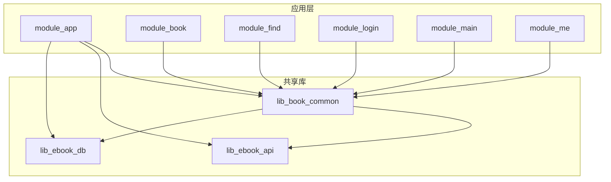
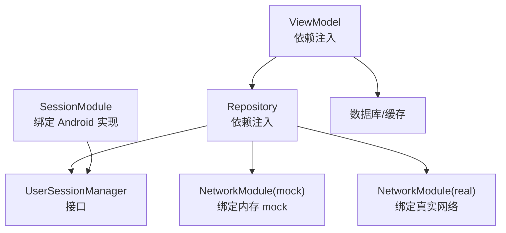
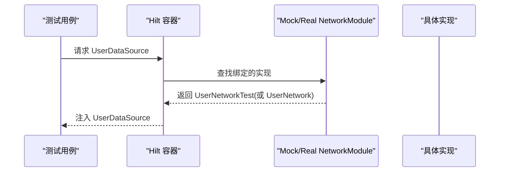
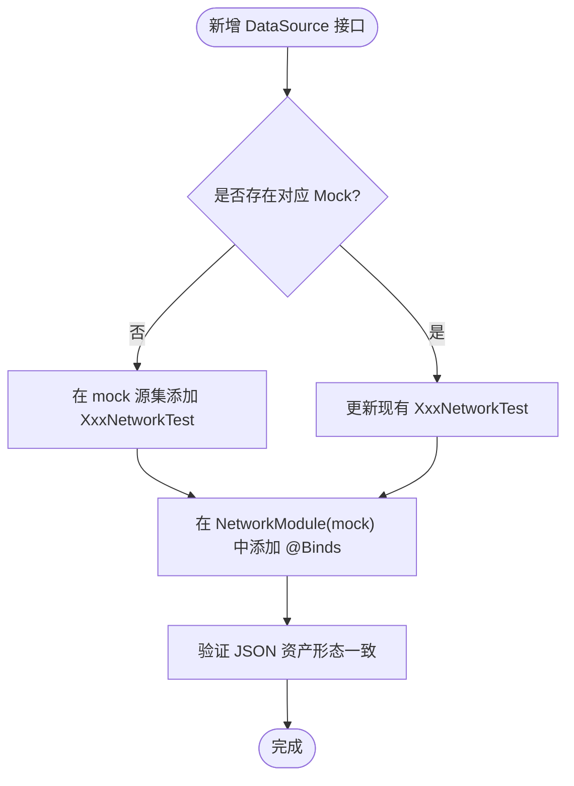
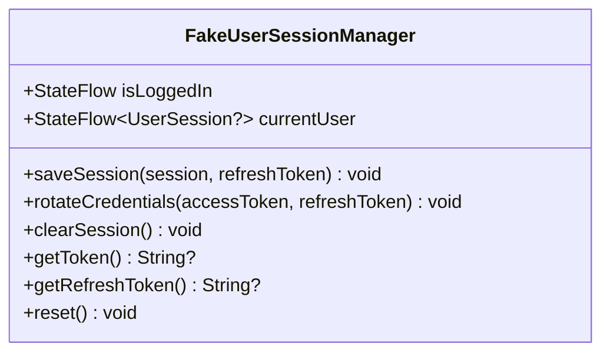
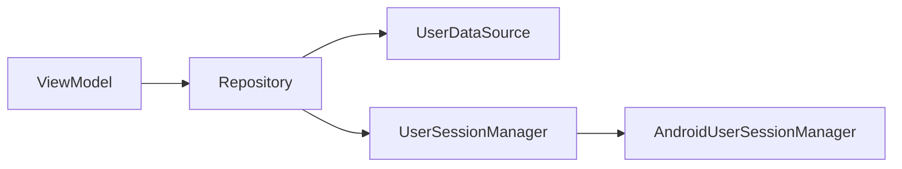

# 单元测试配置与依赖注入

<cite>
**本文引用的文件**
- [module_book/src/main/test/debug/MockNetworkModule.kt](file://module_book/src/main/test/debug/MockNetworkModule.kt)
- [module_book/src/main/test/debug/TestApplication.kt](file://module_book/src/main/test/debug/TestApplication.kt)
- [module_app/src/mock/java/com/ebook/di/NetworkModule.kt](file://module_app/src/mock/java/com/ebook/di/NetworkModule.kt)
- [module_app/src/real/java/com/ebook/di/NetworkModule.kt](file://module_app/src/real/java/com/ebook/di/NetworkModule.kt)
- [lib_book_common/src/main/java/com/ebook/common/di/SessionModule.kt](file://lib_book_common/src/main/java/com/ebook/common/di/SessionModule.kt)
- [lib_book_common/src/test/java/com/ebook/common/domain/FakeUserSessionManager.kt](file://lib_book_common/src/test/java/com/ebook/common/domain/FakeUserSessionManager.kt)
- [build-logic/convention/src/main/kotlin/com/xrn1997/convention/HiltConventionPlugin.kt](file://build-logic/convention/src/main/kotlin/com/xrn1997/convention/HiltConventionPlugin.kt)
- [CONTEXT.md](file://CONTEXT.md)
</cite>

## 目录
1. [简介](#简介)
2. [项目结构](#项目结构)
3. [核心组件](#核心组件)
4. [架构总览](#架构总览)
5. [详细组件分析](#详细组件分析)
6. [依赖关系分析](#依赖关系分析)
7. [性能考量](#性能考量)
8. [故障排查指南](#故障排查指南)
9. [结论](#结论)
10. [附录](#附录)

## 简介
本文件聚焦于单元测试与集成测试中的 Hilt 依赖注入配置，覆盖以下主题：
- 在测试环境中如何装配 Hilt 模块（含 @InstallIn、@Binds 的用法）
- MockNetworkModule 的实现原理与扩展方式
- Fake 替身模式最佳实践（以 FakeUserSessionManager 为例）
- 测试环境与生产环境依赖差异的处理策略
- 常见问题与调试技巧

## 项目结构
本项目采用多模块架构，功能模块通过 Hilt 注入依赖。测试相关的关键位置包括：
- 各模块的 test/debug 目录下的 TestApplication 与 MockNetworkModule，用于独立运行时的宿主与网络替换
- app 层的 mock/real flavor source set，用于集成构建时切换后端实现
- lib_book_common 的 di 包，提供会话管理等共享依赖绑定
- build-logic 的 Hilt 约定插件，统一启用 Hilt 编译期代码生成

**图表来源**
- [module_app/src/mock/java/com/ebook/di/NetworkModule.kt:14-37](file://module_app/src/mock/java/com/ebook/di/NetworkModule.kt#L14-L37)
- [module_app/src/real/java/com/ebook/di/NetworkModule.kt:14-35](file://module_app/src/real/java/com/ebook/di/NetworkModule.kt#L14-L35)
- [lib_book_common/src/main/java/com/ebook/common/di/SessionModule.kt:13-37](file://lib_book_common/src/main/java/com/ebook/common/di/SessionModule.kt#L13-L37)

**章节来源**
- [CONTEXT.md](file://CONTEXT.md)
- [module_app/src/mock/java/com/ebook/di/NetworkModule.kt:14-37](file://module_app/src/mock/java/com/ebook/di/NetworkModule.kt#L14-L37)
- [module_app/src/real/java/com/ebook/di/NetworkModule.kt:14-35](file://module_app/src/real/java/com/ebook/di/NetworkModule.kt#L14-L35)
- [lib_book_common/src/main/java/com/ebook/common/di/SessionModule.kt:13-37](file://lib_book_common/src/main/java/com/ebook/common/di/SessionModule.kt#L13-L37)

## 核心组件
- Hilt 约定插件：统一为 Android 模块启用 Hilt 的编译期处理与组件装配，保证各模块在测试与生产环境下具有一致的注入行为。
- 会话管理模块：将 UserSessionManager 绑定到 Android 实现，并桥接 TokenRefresher，确保登录、刷新、登出等流程的注入一致性。
- 网络模块：通过 mock/real flavor 或独立运行的 test/debug source set，将数据源接口绑定到内存 mock 或真实网络实现，实现解耦的可测性。
- 测试替身：FakeUserSessionManager 提供内存态的会话管理实现，便于纯 JVM 单元测试断言状态流转。

**章节来源**
- [build-logic/convention/src/main/kotlin/com/xrn1997/convention/HiltConventionPlugin.kt](file://build-logic/convention/src/main/kotlin/com/xrn1997/convention/HiltConventionPlugin.kt)
- [lib_book_common/src/main/java/com/ebook/common/di/SessionModule.kt:13-37](file://lib_book_common/src/main/java/com/ebook/common/di/SessionModule.kt#L13-L37)
- [module_app/src/mock/java/com/ebook/di/NetworkModule.kt:14-37](file://module_app/src/mock/java/com/ebook/di/NetworkModule.kt#L14-L37)
- [module_app/src/real/java/com/ebook/di/NetworkModule.kt:14-35](file://module_app/src/real/java/com/ebook/di/NetworkModule.kt#L14-L35)
- [lib_book_common/src/test/java/com/ebook/common/domain/FakeUserSessionManager.kt:7-72](file://lib_book_common/src/test/java/com/ebook/common/domain/FakeUserSessionManager.kt#L7-L72)

## 架构总览
下图展示了测试/集成态下，Hilt 如何通过不同模块装配不同的实现，从而在不改动业务代码的前提下切换依赖：

**图表来源**
- [lib_book_common/src/main/java/com/ebook/common/di/SessionModule.kt:13-37](file://lib_book_common/src/main/java/com/ebook/common/di/SessionModule.kt#L13-L37)
- [module_app/src/mock/java/com/ebook/di/NetworkModule.kt:14-37](file://module_app/src/mock/java/com/ebook/di/NetworkModule.kt#L14-L37)
- [module_app/src/real/java/com/ebook/di/NetworkModule.kt:14-35](file://module_app/src/real/java/com/ebook/di/NetworkModule.kt#L14-L35)

## 详细组件分析

### Hilt 在测试环境的装配要点
- 使用 @InstallIn(SingletonComponent::class) 将模块安装到全局单例作用域，确保跨页面/组件共享同一实例。
- 使用 @Binds 声明接口到实现的绑定，避免重复构造逻辑，便于测试替换。
- 独立运行时，test/debug 目录下的 MockNetworkModule 会被并入 main 源码集参与编译；集成构建时由 flavor source set 选择 mock 或 real 实现。

**图表来源**
- [module_book/src/main/test/debug/MockNetworkModule.kt:19-27](file://module_book/src/main/test/debug/MockNetworkModule.kt#L19-L27)
- [module_app/src/mock/java/com/ebook/di/NetworkModule.kt:14-37](file://module_app/src/mock/java/com/ebook/di/NetworkModule.kt#L14-L37)
- [module_app/src/real/java/com/ebook/di/NetworkModule.kt:14-35](file://module_app/src/real/java/com/ebook/di/NetworkModule.kt#L14-L35)

**章节来源**
- [module_book/src/main/test/debug/MockNetworkModule.kt:19-27](file://module_book/src/main/test/debug/MockNetworkModule.kt#L19-L27)
- [module_app/src/mock/java/com/ebook/di/NetworkModule.kt:14-37](file://module_app/src/mock/java/com/ebook/di/NetworkModule.kt#L14-L37)
- [module_app/src/real/java/com/ebook/di/NetworkModule.kt:14-35](file://module_app/src/real/java/com/ebook/di/NetworkModule.kt#L14-L35)

### MockNetworkModule 的实现原理与扩展
- 独立运行场景：test/debug 下的 MockNetworkModule 将 UserDataSource/CommentDataSource 绑定到内存 mock 实现（UserNetworkTest/CommentNetworkTest），无需后端即可调试 UI。
- 集成构建场景：mock flavor 的 NetworkModule 同样绑定到内存 mock；real flavor 的 NetworkModule 绑定到真实网络实现。两者互斥，由 flavor source set 决定。
- 扩展方式：新增 DataSource 接口方法时，需同步更新对应的 XxxNetworkTest mock 实现；如需新增数据源，按相同模式在对应 flavor/source set 添加 @Binds 绑定。

**图表来源**
- [module_book/src/main/test/debug/MockNetworkModule.kt:19-27](file://module_book/src/main/test/debug/MockNetworkModule.kt#L19-L27)
- [module_app/src/mock/java/com/ebook/di/NetworkModule.kt:14-37](file://module_app/src/mock/java/com/ebook/di/NetworkModule.kt#L14-L37)

**章节来源**
- [module_book/src/main/test/debug/MockNetworkModule.kt:19-27](file://module_book/src/main/test/debug/MockNetworkModule.kt#L19-L27)
- [module_app/src/mock/java/com/ebook/di/NetworkModule.kt:14-37](file://module_app/src/mock/java/com/ebook/di/NetworkModule.kt#L14-L37)
- [module_app/src/real/java/com/ebook/di/NetworkModule.kt:14-35](file://module_app/src/real/java/com/ebook/di/NetworkModule.kt#L14-L35)

### FakeUserSessionManager 的设计思路与最佳实践
- 目标：在纯 JVM 测试中模拟用户会话生命周期（登录、轮换凭证、登出），并与生产语义保持一致（TokenHolder 同步）。
- 设计要点：
  - 使用 StateFlow 暴露 isLoggedIn 与 currentUser，便于断言状态变化。
  - 记录 savedSessions 与 rotated 以便验证调用顺序与内容。
  - 提供 reset() 方法用于测试前后清理状态。
- 最佳实践：
  - 保持与生产实现一致的语义（如 rotateCredentials 只更新 token，不改变身份字段）。
  - 对外暴露可观测状态，方便测试断言。
  - 提供清晰的清理入口，避免测试间污染。

**图表来源**
- [lib_book_common/src/test/java/com/ebook/common/domain/FakeUserSessionManager.kt:7-72](file://lib_book_common/src/test/java/com/ebook/common/domain/FakeUserSessionManager.kt#L7-L72)

**章节来源**
- [lib_book_common/src/test/java/com/ebook/common/domain/FakeUserSessionManager.kt:7-72](file://lib_book_common/src/test/java/com/ebook/common/domain/FakeUserSessionManager.kt#L7-L72)

### 测试环境与生产环境的依赖差异处理
- 独立运行：test/debug 下的 TestApplication 与 MockNetworkModule 参与编译，默认使用 mock 数据源。
- 集成构建：
  - mock flavor：NetworkModule 绑定到内存 mock，适合离线开发与 CI。
  - real flavor：NetworkModule 绑定到真实网络，适合端到端验证。
- 会话管理：SessionModule 始终绑定到 Android 实现，确保生产语义；测试中可通过 FakeUserSessionManager 进行 JVM 级断言。

**章节来源**
- [module_book/src/main/test/debug/TestApplication.kt:9-22](file://module_book/src/main/test/debug/TestApplication.kt#L9-L22)
- [module_app/src/mock/java/com/ebook/di/NetworkModule.kt:14-37](file://module_app/src/mock/java/com/ebook/di/NetworkModule.kt#L14-L37)
- [module_app/src/real/java/com/ebook/di/NetworkModule.kt:14-35](file://module_app/src/real/java/com/ebook/di/NetworkModule.kt#L14-L35)
- [lib_book_common/src/main/java/com/ebook/common/di/SessionModule.kt:13-37](file://lib_book_common/src/main/java/com/ebook/common/di/SessionModule.kt#L13-L37)

## 依赖关系分析
- 模块耦合：
  - 业务模块通过 Hilt 注入依赖，降低对具体实现的耦合。
  - 网络层通过接口抽象，使 mock/real 实现可互换。
- 直接依赖：
  - ViewModel → Repository → DataSource/UserSessionManager
  - SessionModule → AndroidUserSessionManager
- 间接依赖：
  - 通过 Hilt 容器解析依赖图，避免循环依赖。

**图表来源**
- [lib_book_common/src/main/java/com/ebook/common/di/SessionModule.kt:13-37](file://lib_book_common/src/main/java/com/ebook/common/di/SessionModule.kt#L13-L37)

**章节来源**
- [lib_book_common/src/main/java/com/ebook/common/di/SessionModule.kt:13-37](file://lib_book_common/src/main/java/com/ebook/common/di/SessionModule.kt#L13-L37)

## 性能考量
- 测试替身应轻量无副作用，避免 I/O 或网络调用，确保单元测试快速稳定。
- 使用 StateFlow 暴露状态，便于高效断言且不影响性能。
- Mock 数据源应避免创建大对象或复杂计算，必要时提供精简数据集。

[本节为通用指导，无需特定文件引用]

## 故障排查指南
- 症状：页面不闪退但数据永远加载不出来
  - 可能原因：JSON 资产形态与 reified 类型不匹配，导致反序列化异常被吞掉。
  - 排查步骤：检查 assets 中的 JSON 结构与 DTO 定义是否一致；确认网络层未错误包装响应。
- 症状：沙箱进程启动崩溃
  - 可能原因：Application 中存在 eager @Inject 字段，导致注入早于进程门。
  - 排查步骤：移除 Application 中的 eagerly injected 字段，改用 EntryPointAccessors 延迟获取。
- 症状：路由在独立模式下静默丢失
  - 可能原因：跨模块路由在独立模式下不存在，TheRouter 找不到路径。
  - 排查步骤：在 src/main/test/debug 下添加占位路由；重新构建 routeMap。

**章节来源**
- [CONTEXT.md](file://CONTEXT.md)

## 结论
通过 Hilt 的模块化装配与 flavor/source set 机制，项目实现了测试与生产环境依赖的清晰分离。MockNetworkModule 与 FakeUserSessionManager 提供了稳定的替身能力，确保业务逻辑可在无外部依赖的环境下被充分测试。遵循本文的最佳实践，可有效提升测试覆盖率与稳定性。

[本节为总结，无需特定文件引用]

## 附录
- 常用命令：
  - 运行单元测试：./gradlew test
  - 运行模块单元测试：./gradlew :module_book:testDebugUnitTest
  - 连接设备运行插桩测试：./gradlew connectedAndroidTest
- 参考文档：
  - ADR 系列决策记录位于 docs/adr/
  - 测试覆盖待办见 docs/test-coverage-todo.md

[本节为补充信息，无需特定文件引用]