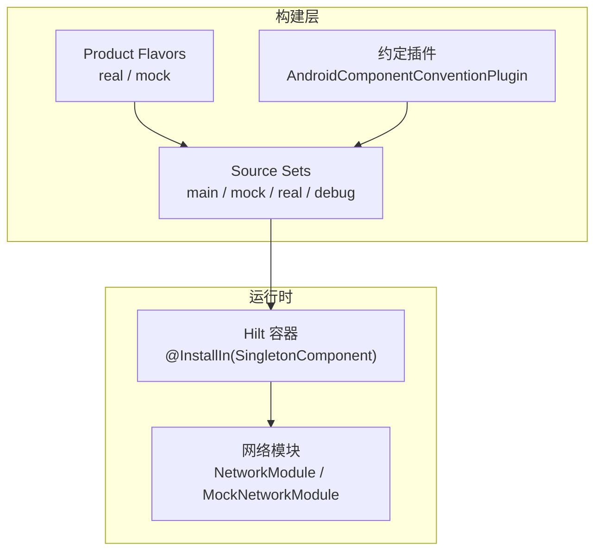
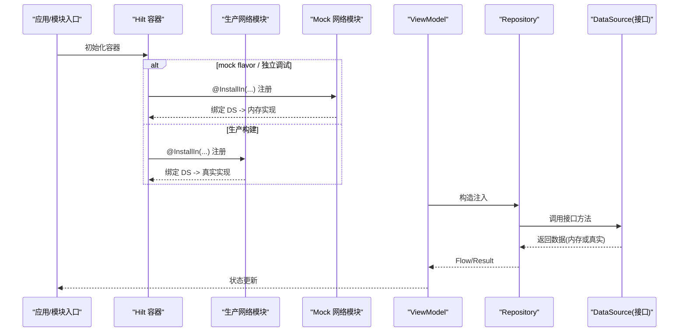
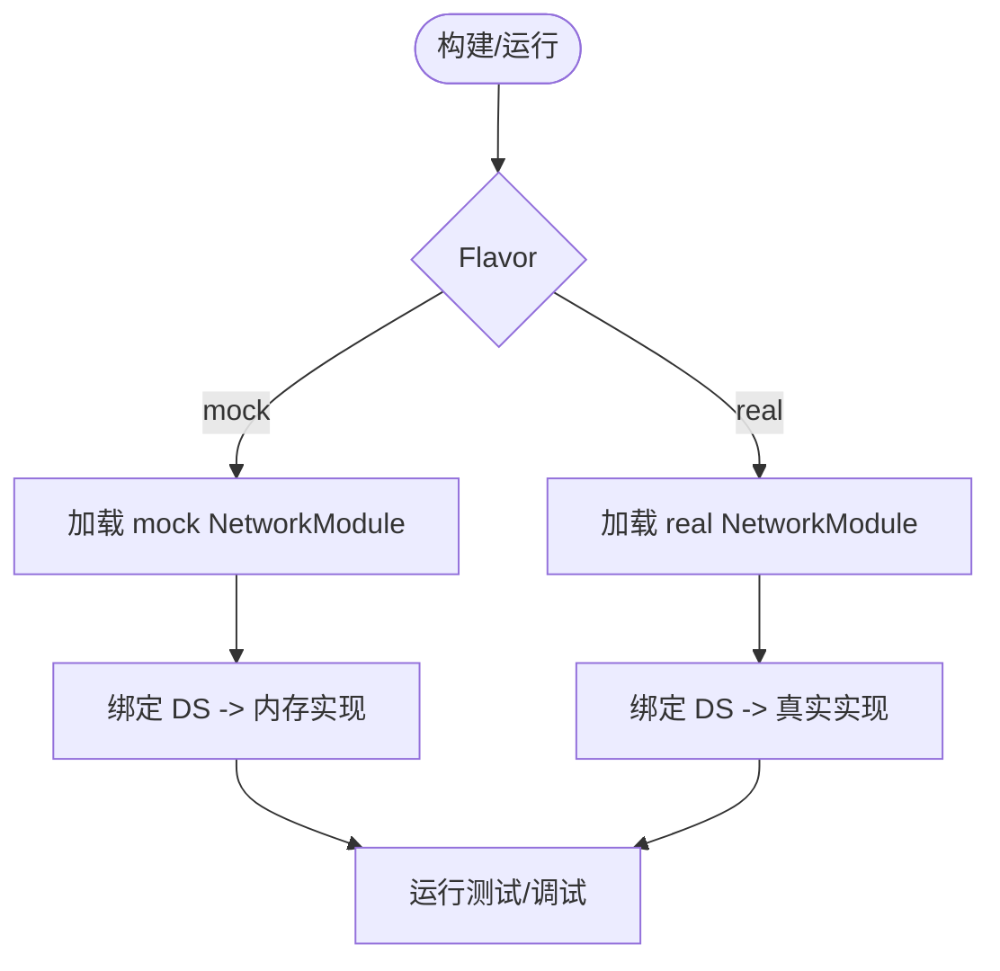
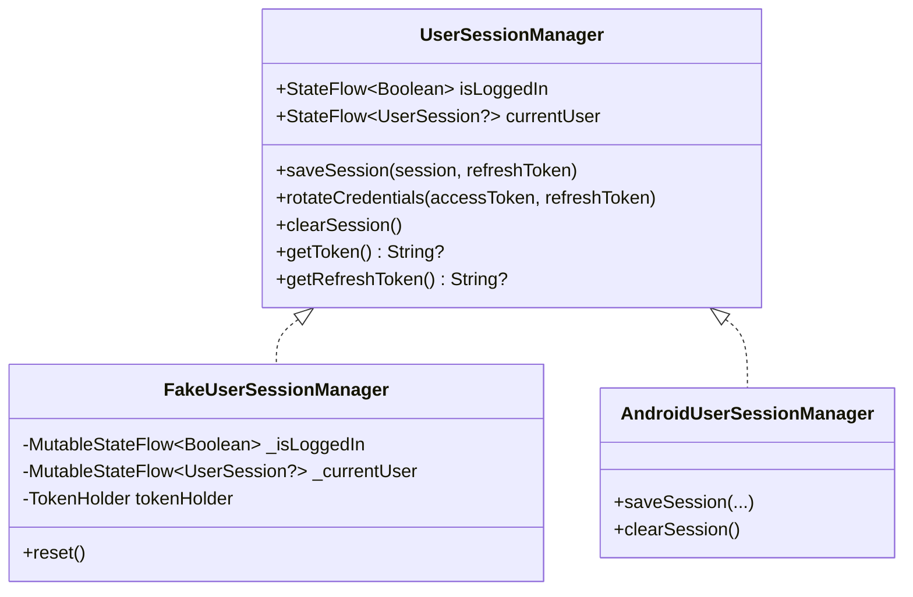
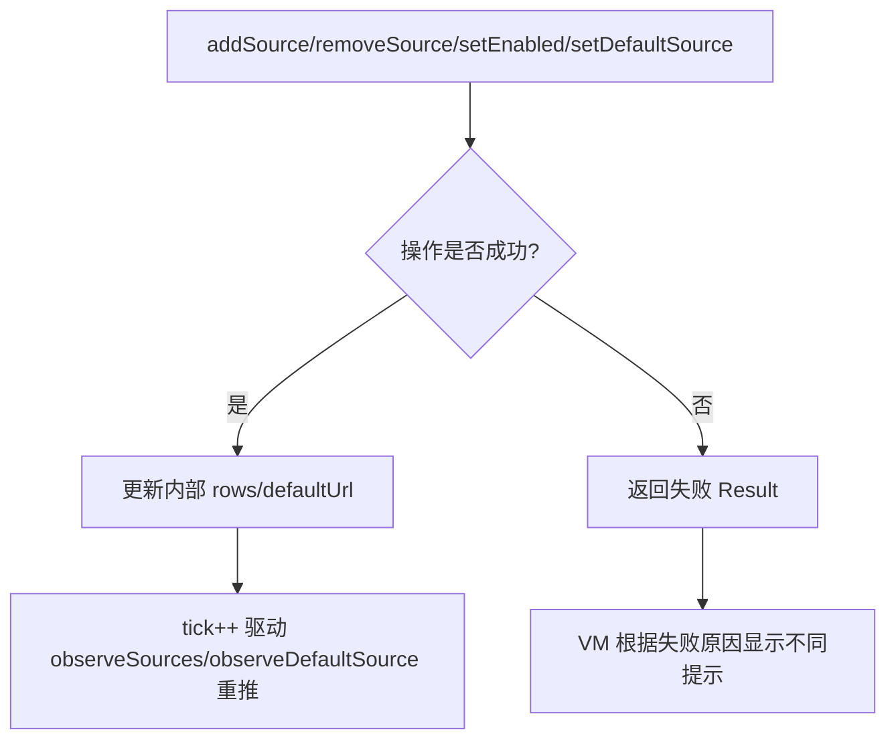
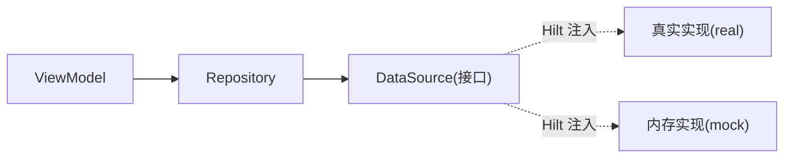

# 测试策略与替代实现

<cite>
**本文引用的文件**
- [NetworkModule.kt](file://module_app/src/mock/java/com/ebook/di/NetworkModule.kt)
- [MockNetworkModule.kt](file://module_book/src/main/test/debug/MockNetworkModule.kt)
- [FakeUserSessionManager.kt](file://lib_book_common/src/test/java/com/ebook/common/domain/FakeUserSessionManager.kt)
- [UserSessionManagerTest.kt](file://lib_book_common/src/test/java/com/ebook/common/domain/UserSessionManagerTest.kt)
- [AndroidUserSessionManagerTest.kt](file://lib_book_common/src/test/java/com/ebook/common/domain/AndroidUserSessionManagerTest.kt)
- [FakeBookSourceManager.kt](file://module_me/src/test/java/com/ebook/me/mvvm/viewmodel/FakeBookSourceManager.kt)
- [build.gradle.kts](file://module_app/build.gradle.kts)
- [HiltConventionPlugin.kt](file://build-logic/convention/src/main/kotlin/com/xrn1997/convention/HiltConventionPlugin.kt)
- [AndroidComponentConventionPlugin.kt](file://build-logic/convention/src/main/kotlin/AndroidComponentConventionPlugin.kt)
- [BookDetailViewModelSourceTest.kt](file://module_book/src/test/java/com/ebook/book/mvvm/viewmodel/BookDetailViewModelSourceTest.kt)
- [SearchViewModelTest.kt](file://module_find/src/test/java/com/ebook/find/mvvm/viewmodel/SearchViewModelTest.kt)
</cite>

## 目录
1. [简介](#简介)
2. [项目结构](#项目结构)
3. [核心组件](#核心组件)
4. [架构总览](#架构总览)
5. [详细组件分析](#详细组件分析)
6. [依赖分析](#依赖分析)
7. [性能考虑](#性能考虑)
8. [故障排查指南](#故障排查指南)
9. [结论](#结论)
10. [附录](#附录)

## 简介
本文件面向本仓库的测试体系，系统性阐述单元测试与集成测试中的依赖注入配置、替身（Mock/Fake）创建与注入方式、测试环境替换策略与生产环境的差异处理，以及 Hilt 模块卸载/安装模式在测试中的使用建议。同时提供 TDD 实践指南与常见问题解决方案，帮助团队以稳定、可维护的方式提升覆盖率与质量。

## 项目结构
本项目采用多模块 Gradle 工程，测试按“单元/插桩”分层：
- 单元测试位于各模块 src/test/java，使用 JUnit 4 与 Kotlin 协程测试工具；对 Android 依赖较多的场景通过 Robolectric 运行。
- 插桩测试位于 src/androidTest/java，用于需要真实设备/模拟器的链路验证。
- 依赖替换通过 Hilt Module + Product Flavor + Source Set 组合实现：
  - mock flavor（module_app）提供内存 Mock 数据源，避免后端依赖。
  - 独立模块调试（isModule=true）时，约定插件将 src/main/test/debug 作为额外源码目录并入 main，从而让 test/debug 下的 MockNetworkModule 参与编译并绑定到 Hilt 容器。

图示来源
- [build.gradle.kts:17-26](file://module_app/build.gradle.kts#L17-L26)
- [MockNetworkModule.kt:1-27](file://module_book/src/main/test/debug/MockNetworkModule.kt#L1-L27)
- [HiltConventionPlugin.kt](file://build-logic/convention/src/main/kotlin/com/xrn1997/convention/HiltConventionPlugin.kt)
- [AndroidComponentConventionPlugin.kt](file://build-logic/convention/src/main/kotlin/AndroidComponentConventionPlugin.kt)

章节来源
- [build.gradle.kts:17-26](file://module_app/build.gradle.kts#L17-L26)

## 核心组件
- 网络层依赖替换
  - mock flavor：通过 module_app/src/mock/.../NetworkModule 将 UserDataSource/CommentDataSource/ReleaseDataSource 绑定到内存实现，无需后端即可跑通全链路。
  - 独立模块调试：通过 module_book/src/main/test/debug/MockNetworkModule 将 UserDataSource/CommentDataSource 绑定到内存实现，便于单模块独立调试 UI。
- 会话管理替身
  - FakeUserSessionManager：纯 JVM 内存实现，行为对齐生产语义，供无 Android 依赖的单元测试复用。
  - AndroidUserSessionManagerTest：基于 Robolectric + 真实 SharedPreferences，验证三处镜像（SP、内存、ProfileRepository）的一致性。
- 书源管理器替身
  - FakeBookSourceManager：保留关键业务契约（默认源选择、覆盖写入、删除失败分流等），屏蔽序列化细节，聚焦页面交互逻辑。

章节来源
- [NetworkModule.kt:14-37](file://module_app/src/mock/java/com/ebook/di/NetworkModule.kt#L14-L37)
- [MockNetworkModule.kt:12-27](file://module_book/src/main/test/debug/MockNetworkModule.kt#L12-L27)
- [FakeUserSessionManager.kt:7-72](file://lib_book_common/src/test/java/com/ebook/common/domain/FakeUserSessionManager.kt#L7-L72)
- [AndroidUserSessionManagerTest.kt:24-39](file://lib_book_common/src/test/java/com/ebook/common/domain/AndroidUserSessionManagerTest.kt#L24-L39)
- [FakeBookSourceManager.kt:19-37](file://module_me/src/test/java/com/ebook/me/mvvm/viewmodel/FakeBookSourceManager.kt#L19-L37)

## 架构总览
下图展示了测试环境下依赖注入的装配路径与替换点：

图示来源
- [NetworkModule.kt:26-37](file://module_app/src/mock/java/com/ebook/di/NetworkModule.kt#L26-L37)
- [MockNetworkModule.kt:19-27](file://module_book/src/main/test/debug/MockNetworkModule.kt#L19-L27)

## 详细组件分析

### 网络层依赖替换（mock flavor vs 独立调试）
- 目标
  - 在不依赖后端的情况下完成端到端链路验证；独立模块开发时也能快速启动。
- 机制
  - 通过 product flavors 区分 real/mock；在 mock 源集下提供同名 NetworkModule，覆盖真实网络模块的绑定。
  - 独立模式下，约定插件将 test/debug 加入源码目录，使该目录下的 MockNetworkModule 参与编译并被 Hilt 拾取。
- 关键点
  - 所有 DataSource 接口由 Hilt 注入，调用方不感知实现差异。
  - ReleaseDataSource 的 mock 使用本地资产，保证离线稳定性。

图示来源
- [build.gradle.kts:17-26](file://module_app/build.gradle.kts#L17-L26)
- [NetworkModule.kt:26-37](file://module_app/src/mock/java/com/ebook/di/NetworkModule.kt#L26-L37)
- [MockNetworkModule.kt:19-27](file://module_book/src/main/test/debug/MockNetworkModule.kt#L19-L27)

章节来源
- [build.gradle.kts:17-26](file://module_app/build.gradle.kts#L17-L26)
- [NetworkModule.kt:14-37](file://module_app/src/mock/java/com/ebook/di/NetworkModule.kt#L14-L37)
- [MockNetworkModule.kt:12-27](file://module_book/src/main/test/debug/MockNetworkModule.kt#L12-L27)

### 会话管理替身与回归测试
- 纯 JVM 测试
  - 使用 FakeUserSessionManager 模拟登录态、令牌轮换与清理，断言 StateFlow 与 TokenHolder 的一致性。
- Android 环境回归
  - 使用 Robolectric + 真实 SharedPreferences 验证三处镜像的一致性，确保清会话能重置 ProfileRepository 的内存流。
- 典型用例
  - 初始未登录、保存会话、清除会话、令牌轮换只改 token、重置状态、刷新令牌获取等。

图示来源
- [FakeUserSessionManager.kt:12-72](file://lib_book_common/src/test/java/com/ebook/common/domain/FakeUserSessionManager.kt#L12-L72)
- [AndroidUserSessionManagerTest.kt:24-39](file://lib_book_common/src/test/java/com/ebook/common/domain/AndroidUserSessionManagerTest.kt#L24-L39)

章节来源
- [UserSessionManagerTest.kt:21-159](file://lib_book_common/src/test/java/com/ebook/common/domain/UserSessionManagerTest.kt#L21-L159)
- [AndroidUserSessionManagerTest.kt:88-205](file://lib_book_common/src/test/java/com/ebook/common/domain/AndroidUserSessionManagerTest.kt#L88-L205)

### 书源管理器替身（FakeBookSourceManager）
- 设计原则
  - 保持关键业务契约：默认源选择、覆盖写入、删除失败分流、启用/禁用联动默认源等。
  - 简化编解码：仅保留页面关心的字段，避免引入序列化器依赖，降低测试耦合。
- 适用场景
  - 书源管理页 ViewModel 的行为测试；关注 UI 提示分流、默认源回退、错误消息分支等。
- 注意事项
  - 脚本行入库与清单可见性由真实现侧测试覆盖；假件专注页面交互契约。

图示来源
- [FakeBookSourceManager.kt:113-239](file://module_me/src/test/java/com/ebook/me/mvvm/viewmodel/FakeBookSourceManager.kt#L113-L239)

章节来源
- [FakeBookSourceManager.kt:19-302](file://module_me/src/test/java/com/ebook/me/mvvm/viewmodel/FakeBookSourceManager.kt#L19-L302)

### ViewModel 测试中的依赖注入
- 通过 Hilt 提供的 @HiltViewModel 注入 Repository/DataSource 等依赖；测试中使用 Fake 或 Mock 替换。
- 常见模式
  - 为 ViewModel 构造注入准备 Fake 实例（如 FakeBookSourceManager），或在测试中通过 Hilt 的卸载/安装模块进行替换。
- 示例参考
  - BookDetailViewModelSourceTest、SearchViewModelTest 展示了 ViewModel 层的测试组织方式与断言思路。

章节来源
- [BookDetailViewModelSourceTest.kt](file://module_book/src/test/java/com/ebook/book/mvvm/viewmodel/BookDetailViewModelSourceTest.kt)
- [SearchViewModelTest.kt](file://module_find/src/test/java/com/ebook/find/mvvm/viewmodel/SearchViewModelTest.kt)

### @UninstallModules 与 @InstallModules 的使用建议
- 现状
  - 当前仓库未发现直接使用 @UninstallModules/@InstallModules 的测试类；主要依赖产品风味与 source set 进行模块级替换。
- 推荐实践
  - 当某个测试需要临时替换某 Module（例如全局日志、网络、存储）时，可在测试类上使用 @UninstallModules 卸载生产模块，并使用 @InstallModules 安装测试模块。
  - 注意作用域：通常针对单个测试类或测试套件，避免污染其他测试。
  - 结合 Hilt 的测试能力（如 HiltTestingExtension）确保容器生命周期正确管理。

[本节为通用实践说明，不直接分析具体代码文件]

## 依赖分析
- 解耦点
  - 所有外部依赖（网络、存储、数据库）均通过接口暴露并由 Hilt 注入；测试侧用 Fake/Mock 替换。
- 替换策略
  - 产品风味：real/mock 切换网络层实现。
  - Source Set：独立调试时，test/debug 下的 MockNetworkModule 参与编译并绑定到 Hilt。
- 风险点
  - 若新增接口未同步 Mock，会导致 mock 构建失败或行为不一致。
  - 若替换模块的作用域不当，可能导致跨测试污染。

图示来源
- [NetworkModule.kt:26-37](file://module_app/src/mock/java/com/ebook/di/NetworkModule.kt#L26-L37)
- [MockNetworkModule.kt:19-27](file://module_book/src/main/test/debug/MockNetworkModule.kt#L19-L27)

章节来源
- [build.gradle.kts:17-26](file://module_app/build.gradle.kts#L17-L26)

## 性能考虑
- 单元测试优先使用 Fake/Mock，避免 I/O 与网络开销。
- 插桩测试仅在必要时运行，减少 CI 时间。
- 使用内存流（StateFlow）和轻量数据结构，减少 GC 压力。
- 避免在测试中创建重型对象，按需懒加载或通过 EntryPointAccessors 获取。

[本节提供通用指导，不直接分析具体代码文件]

## 故障排查指南
- 症状：页面不弹提示、该关的页不关
  - 可能原因：页面未继承 BaseMvvmActivity，命令通道未被消费。
  - 解决：统一继承 BaseMvvmActivity，确保 MvvmBinder 生效。
- 症状：会话已过期但“我的”页仍显示旧昵称头像
  - 可能原因：清会话未重置 ProfileRepository 的内存流。
  - 解决：确保 clearSession 末尾调用 resetProfileState，并通过 AndroidUserSessionManagerTest 锁定行为。
- 症状：数据永远加载不出来
  - 可能原因：mock 资产形态与服务端契约不一致导致反序列化异常被吞。
  - 解决：校验 JSON 资产类型与 DTO 一致；写接口需代码合成响应而非固定 JSON。
- 症状：独立模式路由丢失
  - 可能原因：跨模块路由在独立模式下不存在，TheRouter 找不到路由。
  - 解决：在 test/debug 宿主上挂占位路由，并确保 routeMap 重新生成后再次构建。

章节来源
- [AndroidUserSessionManagerTest.kt:112-131](file://lib_book_common/src/test/java/com/ebook/common/domain/AndroidUserSessionManagerTest.kt#L112-L131)
- [NetworkModule.kt:14-37](file://module_app/src/mock/java/com/ebook/di/NetworkModule.kt#L14-L37)

## 结论
本项目通过 Hilt 模块化注入、产品风味与 source set 的组合，实现了灵活且稳定的依赖替换策略。配合 Fake/Mock 替身与 Robolectric 回归测试，既能保障单元测试的高效性，又能覆盖 Android 环境的关键边界。建议在新增接口时同步补充替身与测试，并在必要时使用 @UninstallModules/@InstallModules 进行细粒度替换，以确保测试隔离与可维护性。

## 附录

### 测试驱动开发（TDD）实践指南
- 先写失败的测试：明确输入、预期输出与边界条件。
- 最小实现：编写最少代码使测试通过，避免过度设计。
- 重构：在测试保护下优化结构与性能。
- 持续覆盖：新功能或变更必须同步更新相关测试。
- 常见问题
  - 测试不稳定：避免共享状态，使用 setUp/reset 清理。
  - 耦合过重：通过接口与替身解耦，便于替换。
  - 环境依赖：使用 Fake/Mock 替代 I/O，必要时用 Robolectric。

[本节为通用实践说明，不直接分析具体代码文件]