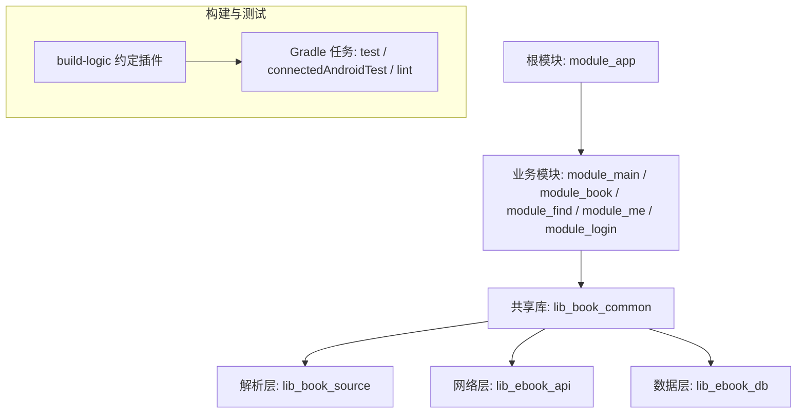
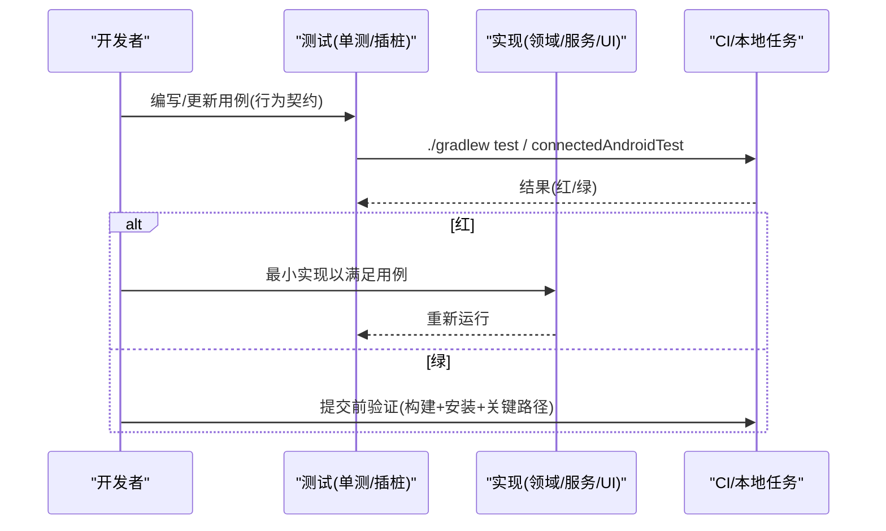
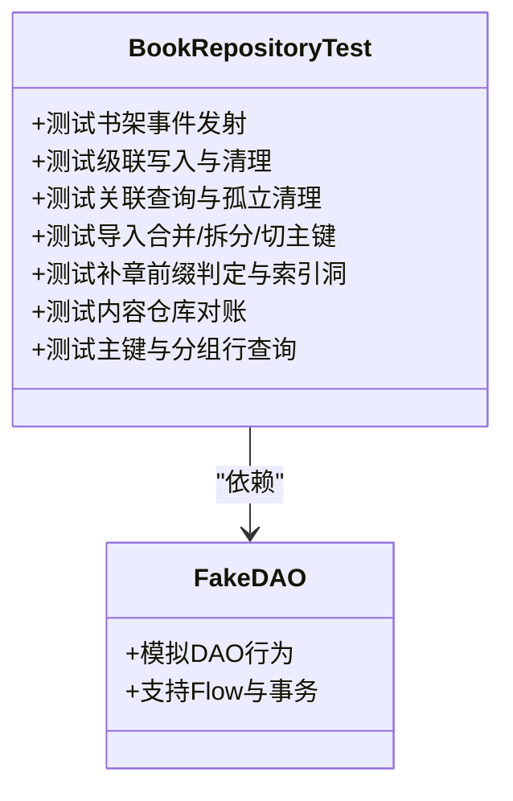
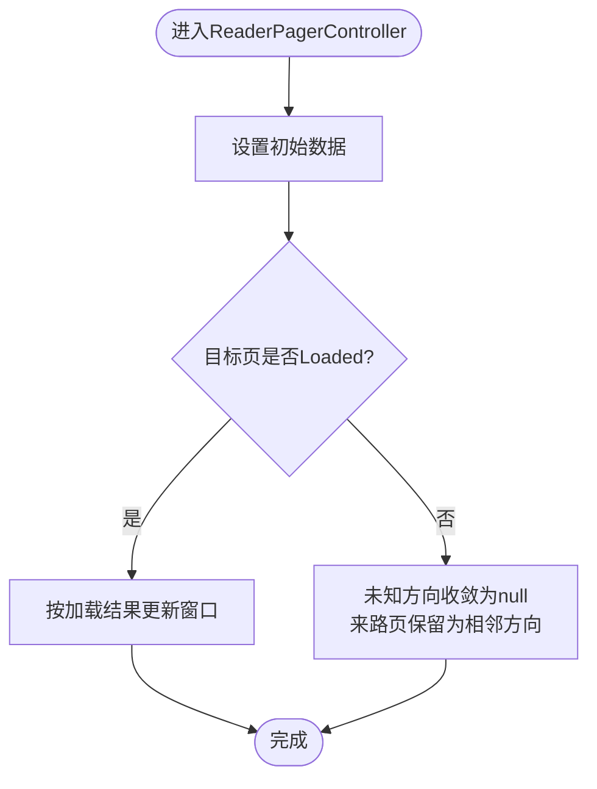
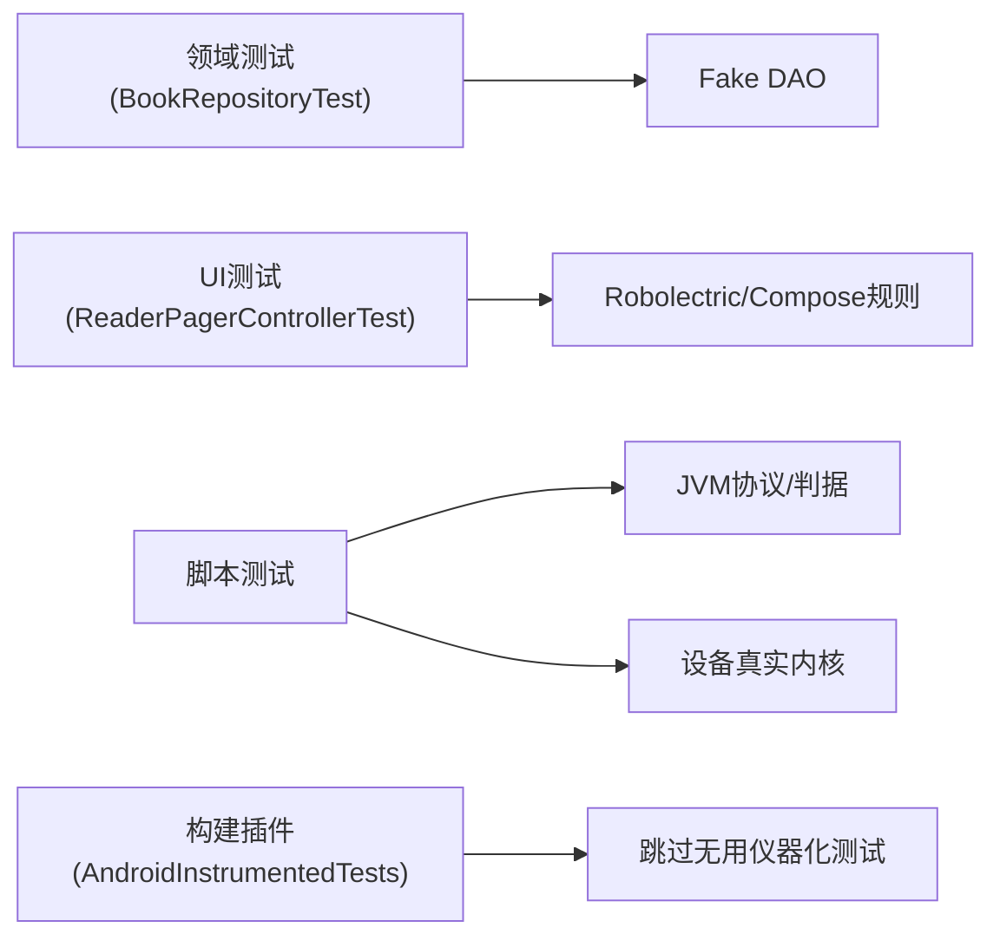

# 测试驱动开发实践

<cite>
**本文引用的文件**
- [README.MD](file://README.MD)
- [AGENTS.md](file://AGENTS.md)
- [test-coverage-todo.md](file://docs/test-coverage-todo.md)
- [AndroidInstrumentedTests.kt](file://build-logic/convention/src/main/kotlin/com/xrn1997/convention/AndroidInstrumentedTests.kt)
- [BookRepositoryTest.kt](file://lib_book_common/src/test/java/com/ebook/common/repository/BookRepositoryTest.kt)
- [ReaderPagerControllerTest.kt](file://module_book/src/test/java/com/ebook/book/reader/ReaderPagerControllerTest.kt)
</cite>

## 目录
1. [引言](#引言)
2. [项目结构](#项目结构)
3. [核心组件](#核心组件)
4. [架构总览](#架构总览)
5. [详细组件分析](#详细组件分析)
6. [依赖关系分析](#依赖关系分析)
7. [性能考量](#性能考量)
8. [故障排查指南](#故障排查指南)
9. [结论](#结论)
10. [附录](#附录)

## 引言
本实践文档面向本仓库的测试体系与 TDD（测试驱动开发）落地方式，聚焦于：从需求到用例、再到实现与回归的完整闭环；不同类型测试的组织策略；以测试驱动接口与架构设计；覆盖率目标与质量门禁；团队协作规范与代码审查要点；以及性能与压力测试的实践。内容基于仓库现有测试与约定插件、测试待办清单与工程约定进行归纳，避免主观臆测。

## 项目结构
本项目采用多模块 Gradle 工程，测试分布于各模块的 src/test（JVM 单元测试）与 src/androidTest（插桩测试）。构建侧通过 build-logic 的约定插件统一配置，并自动跳过无 androidTest 的模块的仪器化测试执行，减少无效开销。根 README 提供常用命令，包括单元测试、连接设备测试与 Lint。

图表来源
- [AndroidInstrumentedTests.kt:22-35](file://build-logic/convention/src/main/kotlin/com/xrn1997/convention/AndroidInstrumentedTests.kt#L22-L35)
- [README.MD:60-85](file://README.MD#L60-L85)

章节来源
- [README.MD:60-85](file://README.MD#L60-L85)
- [AGENTS.md](file://AGENTS.md)
- [AndroidInstrumentedTests.kt:22-35](file://build-logic/convention/src/main/kotlin/com/xrn1997/convention/AndroidInstrumentedTests.kt#L22-L35)

## 核心组件
- 测试组织与命名
  - 单元测试位于各模块 src/test/java，插桩测试位于 src/androidTest/java。
  - 类名遵循 <Subject>Test；方法使用反引号包裹的句子式描述，便于阅读与检索。
- 运行与任务
  - 全量单测：./gradlew test
  - 指定模块单测：./gradlew :module_book:testDebugUnitTest
  - 仪器化测试：./gradlew connectedAndroidTest
  - Lint：./gradlew lint
- 约定与工具
  - 无 androidTest 的模块自动跳过仪器化测试，避免“启动 0 个测试”的无效流程。
  - 测试失败时优先定位被测对象与假件装配是否正确，再检查外部依赖（数据库、网络、沙箱进程）。

章节来源
- [AGENTS.md](file://AGENTS.md)
- [AndroidInstrumentedTests.kt:22-35](file://build-logic/convention/src/main/kotlin/com/xrn1997/convention/AndroidInstrumentedTests.kt#L22-L35)

## 架构总览
TDD 在本项目的落地围绕“行为契约先行”的原则：先定义可验证的行为（测试），再通过最小实现满足用例；对跨进程、异步与 UI 渲染等复杂场景，分层使用 JVM 单测、Robolectric、真实设备与真内核校验。

[此图为概念性流程图，不直接映射具体源码文件]

## 详细组件分析

### 组件一：领域与仓储层测试（BookRepository 示例）
- 覆盖目标
  - 书架事件总线（Added/Removed/ProgressUpdated）
  - 级联写入/清理（addToShelf/removeFromShelf）
  - 关联查询与孤立记录清理（getAllBooksWithDetails/observeBookShelf）
  - 评论聚合键查询（getCommentKeysForBook）
  - 导入合并/拆分/切主键（absorbGroupKeys/splitBook/updateMatchMeta）
  - 补章（mergeTailChapters）
  - 内容仓库对账（reconcileContentStore）
  - 主键与分组行查询（getPrimaryKeyForBook/getBookGroupRows）
- 实现要点
  - 纯 JVM 测试，手写 Fake DAO，不依赖 Robolectric/Room，确保初始化轻量且稳定。
  - 通过协程测试工具控制调度器与时序，避免在测试中泄漏在飞协程。
- 复杂度与性能
  - 用例多为逻辑断言与流式状态验证，时间复杂度与空间复杂度取决于被测方法；测试本身保持 O(1)~O(n) 的输入规模，保证快速反馈。
- 错误处理与边界
  - 针对空键、越界、重复项、事务回滚等边界构造断言，确保异常路径被覆盖。

图表来源
- [BookRepositoryTest.kt:35-50](file://lib_book_common/src/test/java/com/ebook/common/repository/BookRepositoryTest.kt#L35-L50)

章节来源
- [BookRepositoryTest.kt:35-50](file://lib_book_common/src/test/java/com/ebook/common/repository/BookRepositoryTest.kt#L35-L50)

### 组件二：阅读器翻页状态机（ReaderPagerController 示例）
- 覆盖目标
  - 三页窗口状态机的收敛规则：nextKey/prevKey/当前 key 互不相同；未知方向收敛为 null；来路页保留为相邻方向；失败页自动重试。
- 实现要点
  - 使用 Robolectric 提供 Context 与资源；Animatable 动画由虚拟帧时钟推进；控制器需挂前台 TestScope，确保 advanceUntilIdle() 能推进任务。
- 复杂度与性能
  - 状态转换与窗口重算均为常数级操作；测试通过虚拟时钟避免真实时间消耗，提升稳定性与速度。
- 错误处理与边界
  - 断言翻到加载中/失败的页不会导致空转或死页；已 Loaded 的页不被重复重抓，避免闪烁与冗余请求。

图表来源
- [ReaderPagerControllerTest.kt:20-37](file://module_book/src/test/java/com/ebook/book/reader/ReaderPagerControllerTest.kt#L20-L37)

章节来源
- [ReaderPagerControllerTest.kt:20-37](file://module_book/src/test/java/com/ebook/book/reader/ReaderPagerControllerTest.kt#L20-L37)

### 组件三：UI 与 Compose 渲染测试
- 覆盖目标
  - 下载队列角标在不同剩余数下的渲染正确性；列表滚动、对话框、手势的像素级断言。
- 实现要点
  - 使用 Robolectric @GraphicsMode(NATIVE) + createAndroidComposeRule<ComponentActivity> + decorView.draw(Canvas(bitmap)) 进行像素探针断言；captureToImage 在此不可用。
- 复杂度与性能
  - 渲染测试聚焦“画出来没有”，以探针色像素计数作为判定，避免引入昂贵的截图比对。
- 错误处理与边界
  - 针对 Material 容器裁剪导致的角标齐边口问题，锁定回归点，防止后续版本回归。

章节来源
- [test-coverage-todo.md:71-79](file://docs/test-coverage-todo.md#L71-L79)

### 组件四：脚本源与沙箱执行器测试
- 覆盖目标
  - 词法/求值/JSONPath/取文链路；白名单与守门客户端；超时、内存超限、栈溢出等失败档案；真内核跨进程通信与回调路由。
- 实现要点
  - JVM 侧锁住协议、判据与失败分类；设备侧跑通真实内核与跨进程；Hilt 装配需保证转子与客户端为同一对象。
- 复杂度与性能
  - 大量边界与异常分支；通过夹具与金标准案例冻结真实响应与规则串，降低不稳定因素。
- 错误处理与边界
  - 区分“未装配执行器”和“执行失败”两类失败；脚本外呼仅允许白名单 host，禁止私网与凭证泄露。

章节来源
- [test-coverage-todo.md:281-363](file://docs/test-coverage-todo.md#L281-L363)
- [test-coverage-todo.md:420-519](file://docs/test-coverage-todo.md#L420-L519)

### 组件五：下载与服务层测试（待完善）
- 现状
  - 下载队列失败重试/出队语义尚未自动化覆盖，主要依赖人工装机验证。
- 建议
  - 将“取任务→重试→出队/入库”抽成可注入假仓库与假时钟的纯挂起函数；或使用 Robolectric + 假 DownloadRepository 补齐自动化用例。
- 风险点
  - Handler.postDelayed、前台通知、serviceScope 绑定在 Service 上，时序与生命周期管理需特别关注。

章节来源
- [test-coverage-todo.md:56-60](file://docs/test-coverage-todo.md#L56-L60)

## 依赖关系分析
- 模块内测试依赖
  - 领域与仓储层：手写 Fake DAO，避免数据库框架依赖，保证纯 JVM 快速执行。
  - UI 层：Robolectric + Compose 测试规则，提供 Context、资源与渲染能力。
  - 脚本与沙箱：JVM 断言协议与判据，设备端验证真实内核与跨进程行为。
- 构建侧依赖
  - 约定插件自动禁用无 androidTest 的模块的仪器化测试，减少 CI 负担。
- 潜在耦合与解耦
  - 通过假件与隔离的测试作用域降低对外部依赖的耦合；对异步与协程使用测试调度器与时钟，避免真实线程干扰。

图表来源
- [BookRepositoryTest.kt:35-50](file://lib_book_common/src/test/java/com/ebook/common/repository/BookRepositoryTest.kt#L35-L50)
- [ReaderPagerControllerTest.kt:20-37](file://module_book/src/test/java/com/ebook/book/reader/ReaderPagerControllerTest.kt#L20-L37)
- [AndroidInstrumentedTests.kt:22-35](file://build-logic/convention/src/main/kotlin/com/xrn1997/convention/AndroidInstrumentedTests.kt#L22-L35)

章节来源
- [BookRepositoryTest.kt:35-50](file://lib_book_common/src/test/java/com/ebook/common/repository/BookRepositoryTest.kt#L35-L50)
- [ReaderPagerControllerTest.kt:20-37](file://module_book/src/test/java/com/ebook/book/reader/ReaderPagerControllerTest.kt#L20-L37)
- [AndroidInstrumentedTests.kt:22-35](file://build-logic/convention/src/main/kotlin/com/xrn1997/convention/AndroidInstrumentedTests.kt#L22-L35)

## 性能考量
- 测试执行性能
  - 优先使用纯 JVM 单测（如仓储与逻辑），避免不必要的 Android 框架依赖。
  - UI 渲染测试采用像素探针而非全屏截图，减少 IO 与比较成本。
- 异步与协程
  - 使用测试作用域与虚拟时钟，避免真实线程泄漏与竞态；确保 advanceUntilIdle() 能推进前台任务。
- 设备与真实内核
  - 脚本与沙箱测试在设备端验证真实内核行为，但应限制用例数量与频率，避免 CI 过长。

章节来源
- [test-coverage-todo.md:21-37](file://docs/test-coverage-todo.md#L21-L37)
- [test-coverage-todo.md:71-79](file://docs/test-coverage-todo.md#L71-L79)

## 故障排查指南
- 常见症状与定位
  - “页面不闪退、数据永远加载不出来”：检查 mock 资产形态与解码类型一致性；确认协程适配器与错误翻译。
  - “列表项 key 冲突崩溃”：检查列表项 key 的唯一性与稳定性（避免扁平序号或空标题）。
  - “沙箱报需执行器/执行失败”：区分未装配执行器与执行失败；确认 Hilt 装配转子与客户端为同一对象。
- 排查步骤
  - 先在 JVM 单测复现与断言；再在 Robolectric 下验证 UI 行为；最后在设备端验证真实内核与跨进程。
  - 利用日志与断点定位异步任务泄漏与线程模型问题。

章节来源
- [test-coverage-todo.md:15-22](file://docs/test-coverage-todo.md#L15-L22)
- [test-coverage-todo.md:420-519](file://docs/test-coverage-todo.md#L420-L519)

## 结论
本项目已形成较为完善的 TDD 实践：以行为契约驱动的测试用例、分层覆盖（JVM/Robolectric/设备）、构建侧的约定插件优化、以及对复杂子系统（脚本源与沙箱）的严格校验。建议在后续迭代中持续补齐下载队列与服务层自动化测试，完善 UI 测试覆盖面，并通过覆盖率目标与质量门禁保障交付质量。

## 附录
- 常用命令
  - 构建与测试：见根 README 提供的命令集合。
- 覆盖率与质量
  - 参考 docs/test-coverage-todo.md 中的待办清单，逐步补齐缺失的用例与装机验证项。
- 协作与审查
  - 遵循 AGENTS.md 的提交规范与约定；重大决策沉淀为 ADR；评审时关注测试覆盖与边界断言。

章节来源
- [README.MD:60-85](file://README.MD#L60-L85)
- [AGENTS.md](file://AGENTS.md)
- [test-coverage-todo.md](file://docs/test-coverage-todo.md)