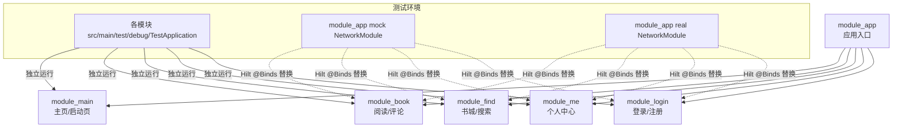
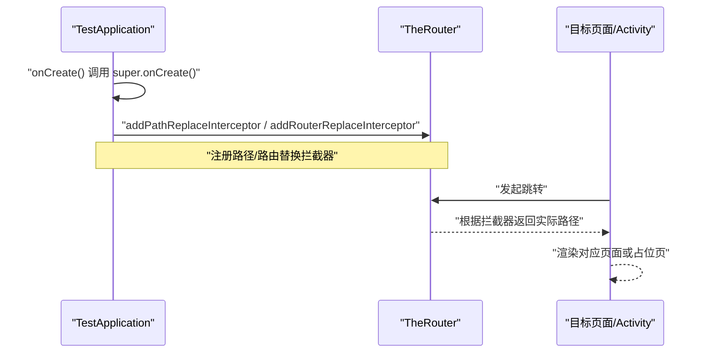
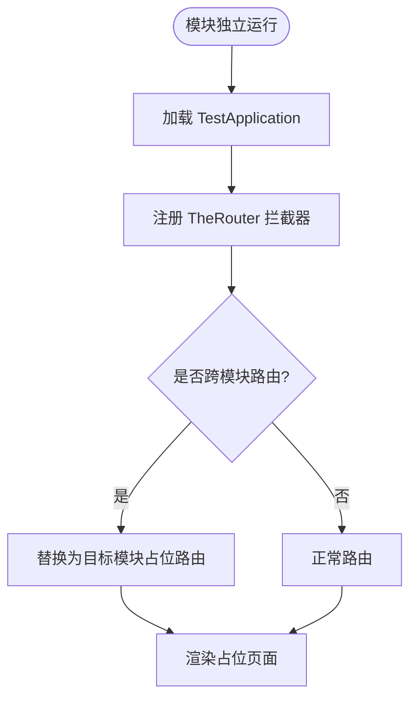
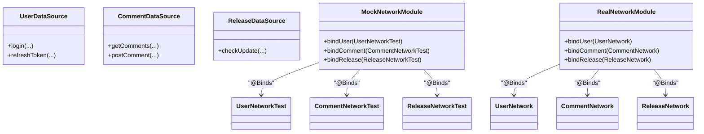
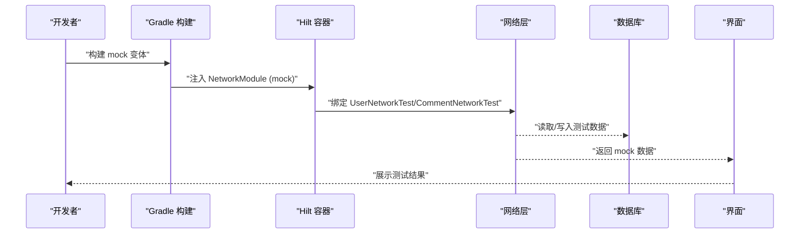

# 集成测试环境搭建

<cite>
**本文引用的文件**   
- [module_book/src/main/test/debug/TestApplication.kt](file://module_book/src/main/test/debug/TestApplication.kt)
- [module_find/src/main/test/debug/TestApplication.kt](file://module_find/src/main/test/debug/TestApplication.kt)
- [module_login/src/main/test/debug/TestApplication.kt](file://module_login/src/main/test/debug/TestApplication.kt)
- [module_main/src/main/test/debug/TestApplication.kt](file://module_main/src/main/test/debug/TestApplication.kt)
- [module_me/src/main/test/debug/TestApplication.kt](file://module_me/src/main/test/debug/TestApplication.kt)
- [module_app/src/mock/java/com/ebook/di/NetworkModule.kt](file://module_app/src/mock/java/com/ebook/di/NetworkModule.kt)
- [module_app/src/real/java/com/ebook/di/NetworkModule.kt](file://module_app/src/real/java/com/ebook/di/NetworkModule.kt)
- [lib_ebook_api/src/main/assets/user_login.json](file://lib_ebook_api/src/main/assets/user_login.json)
- [lib_ebook_api/src/main/assets/release_latest.json](file://lib_ebook_api/src/main/assets/release_latest.json)
- [AGENTS.md](file://AGENTS.md)
</cite>

## 目录
1. [简介](#简介)
2. [项目结构与测试入口](#项目结构与测试入口)
3. [核心组件：TestApplication 的作用与初始化流程](#核心组件testapplication-的作用与初始化流程)
4. [为不同模块配置独立的测试应用实例](#为不同模块配置独立的测试应用实例)
5. [测试数据库隔离策略与数据准备](#测试数据库隔离策略与数据准备)
6. [网络层 Mock 方案](#网络层-mock-方案)
7. [完整的测试环境配置示例](#完整的测试环境配置示例)
8. [测试数据生命周期管理与清理策略](#测试数据生命周期管理与清理策略)
9. [性能优化建议](#性能优化建议)
10. [常见问题排查指南](#常见问题排查指南)
11. [结论](#结论)

## 简介
本文面向本项目的集成测试（Instrumented Test）与独立模块调试运行，目标是帮助读者快速、稳定地搭建“无后端也能跑通”的测试环境。文档重点覆盖：
- TestApplication 的职责与初始化流程
- 各功能模块独立运行时的测试应用实例
- 测试数据库的隔离与数据准备
- 网络层的 Mock 方案（flavor + Hilt 绑定替换）
- 完整可操作的配置示例（Hilt 模块替换、服务 Mock、路由拦截）
- 测试数据生命周期与清理策略
- 性能优化与问题定位方法

## 项目结构与测试入口
本项目采用多模块架构，业务模块之间通过 TheRouter 与 Provider 解耦。为了支持独立开发与调试，每个业务模块在 `src/main/test/debug` 下提供独立的测试 Application，并在独立模式清单中声明该 Application。同时，应用入口通过 product flavor 切换 mock/real 两种网络实现，使集成测试在不依赖真实后端的情况下完成全链路验证。

图表来源
- [module_app/src/mock/java/com/ebook/di/NetworkModule.kt:14-37](file://module_app/src/mock/java/com/ebook/di/NetworkModule.kt#L14-L37)
- [module_app/src/real/java/com/ebook/di/NetworkModule.kt:14-35](file://module_app/src/real/java/com/ebook/di/NetworkModule.kt#L14-L35)
- [module_book/src/main/test/debug/TestApplication.kt:1-22](file://module_book/src/main/test/debug/TestApplication.kt#L1-L22)
- [module_find/src/main/test/debug/TestApplication.kt:9-35](file://module_find/src/main/test/debug/TestApplication.kt#L9-L35)
- [module_me/src/main/test/debug/TestApplication.kt:14-45](file://module_me/src/main/test/debug/TestApplication.kt#L14-L45)
- [module_login/src/main/test/debug/TestApplication.kt:8-14](file://module_login/src/main/test/debug/TestApplication.kt#L8-L14)
- [module_main/src/main/test/debug/TestApplication.kt:6-7](file://module_main/src/main/test/debug/TestApplication.kt#L6-L7)

章节来源
- [AGENTS.md](file://AGENTS.md)

## 核心组件：TestApplication 的作用与初始化流程
每个模块的 `TestApplication` 继承自公共基类 `BookApplication`，并通过 Hilt 的 `@HiltAndroidApp` 启用依赖注入。其职责包括：
- 复用公共初始化逻辑（由 `BookApplication` 提供）
- 针对独立运行场景，注册 TheRouter 的路径替换或路由替换拦截器，避免跨模块依赖导致的路由缺失
- 在登录态校验场景中，将需要登录的路由重定向到模块内的模拟登录页，保证独立运行时体验完整

以 `module_find` 的 `TestApplication` 为例，它会将两条跨模块路由替换为本模块内提供的占位 Activity，从而在独立模式下无需依赖其他业务模块即可运行；以 `module_me` 的 `TestApplication` 为例，它会在未登录时拦截需要登录的路由并跳转到本模块的测试登录页，避免路由不存在导致的导航中断。

图表来源
- [module_book/src/main/test/debug/TestApplication.kt:11-21](file://module_book/src/main/test/debug/TestApplication.kt#L11-L21)
- [module_find/src/main/test/debug/TestApplication.kt:21-34](file://module_find/src/main/test/debug/TestApplication.kt#L21-L34)
- [module_me/src/main/test/debug/TestApplication.kt:16-43](file://module_me/src/main/test/debug/TestApplication.kt#L16-L43)
- [module_login/src/main/test/debug/TestApplication.kt:10-13](file://module_login/src/main/test/debug/TestApplication.kt#L10-L13)

章节来源
- [module_book/src/main/test/debug/TestApplication.kt:1-22](file://module_book/src/main/test/debug/TestApplication.kt#L1-L22)
- [module_find/src/main/test/debug/TestApplication.kt:9-35](file://module_find/src/main/test/debug/TestApplication.kt#L9-L35)
- [module_me/src/main/test/debug/TestApplication.kt:14-45](file://module_me/src/main/test/debug/TestApplication.kt#L14-L45)
- [module_login/src/main/test/debug/TestApplication.kt:8-14](file://module_login/src/main/test/debug/TestApplication.kt#L8-L14)
- [module_main/src/main/test/debug/TestApplication.kt:6-7](file://module_main/src/main/test/debug/TestApplication.kt#L6-L7)

## 为不同模块配置独立的测试应用实例
每个业务模块都提供了独立的测试 Application，用于在独立运行模式下替代默认 Application，确保：
- 不依赖其它模块的路由或 Provider
- 对登录态进行本地化控制
- 保持与正式应用一致的初始化行为（通过继承 `BookApplication`）

典型配置要点：
- 使用 `@HiltAndroidApp` 标注，使 Hilt 在该 Application 上生效
- 在 `onCreate()` 中注册 TheRouter 的拦截器，处理跨模块路由缺失问题
- 对于需要登录才能访问的页面，通过路由替换或条件判断跳转到模块内提供的测试登录页

图表来源
- [module_find/src/main/test/debug/TestApplication.kt:21-34](file://module_find/src/main/test/debug/TestApplication.kt#L21-L34)
- [module_me/src/main/test/debug/TestApplication.kt:22-43](file://module_me/src/main/test/debug/TestApplication.kt#L22-L43)
- [module_book/src/main/test/debug/TestApplication.kt:13-21](file://module_book/src/main/test/debug/TestApplication.kt#L13-L21)

章节来源
- [module_find/src/main/test/debug/TestApplication.kt:9-35](file://module_find/src/main/test/debug/TestApplication.kt#L9-L35)
- [module_me/src/main/test/debug/TestApplication.kt:14-45](file://module_me/src/main/test/debug/TestApplication.kt#L14-L45)
- [module_book/src/main/test/debug/TestApplication.kt:1-22](file://module_book/src/main/test/debug/TestApplication.kt#L1-L22)
- [module_login/src/main/test/debug/TestApplication.kt:8-14](file://module_login/src/main/test/debug/TestApplication.kt#L8-L14)
- [module_main/src/main/test/debug/TestApplication.kt:6-7](file://module_main/src/main/test/debug/TestApplication.kt#L6-L7)

## 测试数据库隔离策略与数据准备
本项目使用 Room 作为持久化方案，测试数据库的隔离通常遵循以下原则：
- 每个测试进程拥有独立的数据库实例，避免测试间相互污染
- 通过测试专用数据库名或临时目录隔离数据
- 在测试用例的 `@Before` 阶段准备必要数据，在 `@After` 或 tearDown 阶段清理数据
- 对于涉及迁移或 schema 变更的测试，需确保测试数据库版本与代码一致

由于当前仓库未直接提供统一的测试数据库初始化脚本，建议在每个模块的 Android Instrumented Test 中：
- 使用内存数据库或临时数据库路径
- 在测试前插入最小数据集（如用户会话、书源、书籍条目等）
- 在测试后删除数据库文件或重置状态

注意：若测试依赖网络返回的数据写入数据库，应结合网络 Mock，确保写入的数据结构与服务端契约一致。

[本节为通用指导，未直接分析具体源码文件]

## 网络层 Mock 方案
项目通过 product flavor 与 Hilt 的 `@Binds` 机制实现网络层 Mock。`module_app` 下分别提供 `mock` 和 `real` 两个 source set 的 `NetworkModule`，用于在不同构建变体中绑定不同的数据源实现：
- `mock` 变体：将 `UserDataSource`、`CommentDataSource`、`ReleaseDataSource` 绑定到内存实现（基于 assets JSON），无需后端服务器
- `real` 变体：将数据源绑定到真实网络实现，连接 ebook-server 或其他公开 API

图表来源
- [module_app/src/mock/java/com/ebook/di/NetworkModule.kt:14-37](file://module_app/src/mock/java/com/ebook/di/NetworkModule.kt#L14-L37)
- [module_app/src/real/java/com/ebook/di/NetworkModule.kt:14-35](file://module_app/src/real/java/com/ebook/di/NetworkModule.kt#L14-L35)

章节来源
- [module_app/src/mock/java/com/ebook/di/NetworkModule.kt:14-37](file://module_app/src/mock/java/com/ebook/di/NetworkModule.kt#L14-L37)
- [module_app/src/real/java/com/ebook/di/NetworkModule.kt:14-35](file://module_app/src/real/java/com/ebook/di/NetworkModule.kt#L14-L35)

## 完整的测试环境配置示例
以下为典型的集成测试环境配置步骤，涵盖 Hilt 模块替换、服务 Mock、路由拦截和数据准备：

1. 选择构建变体
   - 使用 `assembleMockDebug` 构建 mock 变体，无需后端
   - 使用 `assembleRealDebug` 构建 real 变体，连接真实后端

2. 配置模块独立运行
   - 在每个业务模块的 `src/main/test/debug` 下提供 `TestApplication`
   - 在独立模式清单中声明该 Application
   - 通过 TheRouter 拦截器替换跨模块路由

3. 网络层 Mock
   - 在 `module_app/src/mock/java/com/ebook/di/NetworkModule.kt` 中绑定内存实现
   - 在 `module_app/src/real/java/com/ebook/di/NetworkModule.kt` 中绑定真实实现
   - 确保 assets 中的 JSON 资产与接口契约一致

4. 数据准备与清理
   - 在测试用例中准备最小数据集
   - 使用测试专用数据库或内存存储
   - 在测试结束后清理数据

5. 登录态管理
   - 通过 `SPUtil` 设置登录标志
   - 在 `TestApplication` 中拦截需要登录的路由

图表来源
- [module_app/src/mock/java/com/ebook/di/NetworkModule.kt:14-37](file://module_app/src/mock/java/com/ebook/di/NetworkModule.kt#L14-L37)
- [module_app/src/real/java/com/ebook/di/NetworkModule.kt:14-35](file://module_app/src/real/java/com/ebook/di/NetworkModule.kt#L14-L35)

章节来源
- [module_app/src/mock/java/com/ebook/di/NetworkModule.kt:14-37](file://module_app/src/mock/java/com/ebook/di/NetworkModule.kt#L14-L37)
- [module_app/src/real/java/com/ebook/di/NetworkModule.kt:14-35](file://module_app/src/real/java/com/ebook/di/NetworkModule.kt#L14-L35)

## 测试数据生命周期管理与清理策略
测试数据的生命周期管理应遵循以下原则：
- **创建**：在测试用例的 `@Before` 或 setup 方法中创建最小必要数据
- **使用**：在测试过程中只访问和修改必要的字段
- **清理**：在 `@After` 或 tearDown 方法中清理数据，避免影响后续测试
- **隔离**：每个测试用例应有独立的数据空间，避免共享状态

对于 Room 数据库：
- 使用内存数据库或临时文件数据库
- 在测试前执行必要的迁移脚本
- 在测试后删除数据库文件或重置状态

对于 SharedPreferences：
- 使用测试专用的 key 前缀
- 在测试后清理所有测试相关的键值对

对于网络缓存：
- 禁用或清空缓存
- 使用 Mock 网络层避免真实网络请求

[本节为通用指导，未直接分析具体源码文件]

## 性能优化建议
为提升集成测试的执行效率和稳定性，建议采取以下优化措施：

1. **减少测试数据量**
   - 只创建测试所需的最小数据集
   - 避免一次性导入大量书籍或评论数据

2. **并行执行测试**
   - 合理分组测试用例，避免并发冲突
   - 使用数据库锁或事务确保数据一致性

3. **优化网络 Mock**
   - 预加载常用响应数据到内存
   - 避免重复的网络解析开销

4. **数据库优化**
   - 使用内存数据库进行测试
   - 批量插入数据时使用事务
   - 避免在测试中进行复杂的查询操作

5. **资源管理**
   - 及时释放数据库连接
   - 关闭不必要的服务和监听器

[本节为通用指导，未直接分析具体源码文件]

## 常见问题排查指南
在搭建和使用集成测试环境时，可能会遇到以下常见问题：

### 1. 路由跳转失败
**现象**：点击按钮后无响应或跳转到错误页面  
**原因**：跨模块路由在独立模式下未正确替换  
**解决**：检查 `TestApplication` 中的路径替换拦截器是否正确配置

### 2. 登录态异常
**现象**：需要登录的页面无法访问  
**原因**：登录状态未正确设置或路由拦截逻辑错误  
**解决**：确认 `SPUtil` 中的登录标志已设置，检查路由拦截器的优先级

### 3. 网络请求失败
**现象**：页面加载数据为空或报错  
**原因**：Mock 数据与接口契约不一致  
**解决**：检查 assets 中的 JSON 文件是否与接口定义匹配

### 4. 数据库冲突
**现象**：测试间数据互相污染  
**原因**：数据库未正确隔离或清理  
**解决**：使用独立的数据库实例，确保测试结束后清理数据

### 5. Hilt 注入失败
**现象**：运行时出现依赖注入错误  
**原因**：Hilt 模块配置不正确或作用域冲突  
**解决**：检查 `@Module` 和 `@InstallIn` 注解，确认模块已正确安装

章节来源
- [module_app/src/mock/java/com/ebook/di/NetworkModule.kt:14-37](file://module_app/src/mock/java/com/ebook/di/NetworkModule.kt#L14-L37)
- [module_app/src/real/java/com/ebook/di/NetworkModule.kt:14-35](file://module_app/src/real/java/com/ebook/di/NetworkModule.kt#L14-L35)
- [module_find/src/main/test/debug/TestApplication.kt:21-34](file://module_find/src/main/test/debug/TestApplication.kt#L21-L34)
- [module_me/src/main/test/debug/TestApplication.kt:22-43](file://module_me/src/main/test/debug/TestApplication.kt#L22-L43)

## 结论
通过合理的 TestApplication 配置、Hilt 模块替换和网络层 Mock，可以在无需后端服务器的情况下完成完整的集成测试。关键点包括：
- 每个模块提供独立的测试 Application，处理路由和登录态
- 使用 product flavor 切换 mock/real 网络实现
- 通过 TheRouter 拦截器解决跨模块依赖问题
- 合理管理测试数据生命周期，确保测试隔离性
- 遵循性能优化建议，提升测试执行效率

这种架构设计使得开发者能够在离线环境下高效地进行功能开发和测试，同时保证了测试的稳定性和可维护性。

[本节为总结性内容，未直接分析具体源码文件]