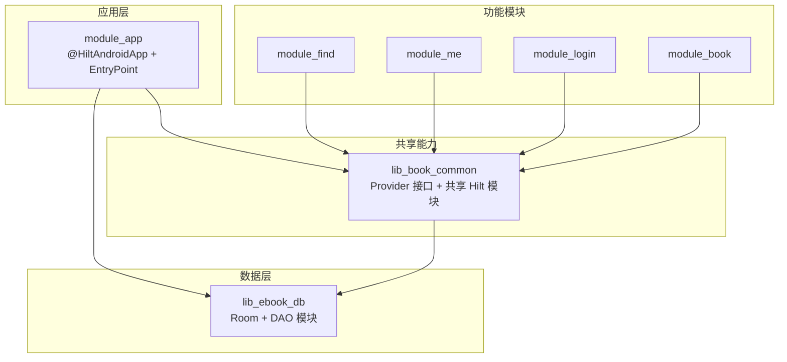
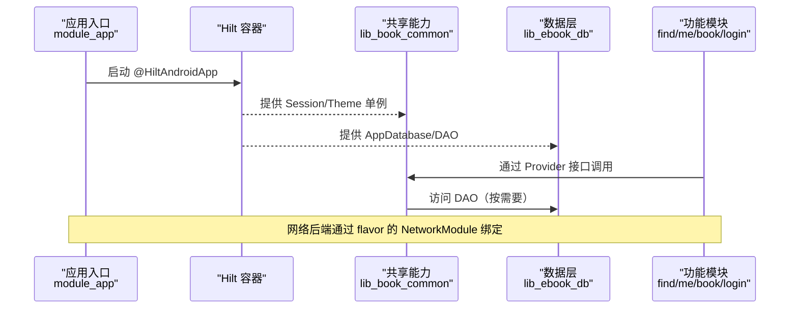
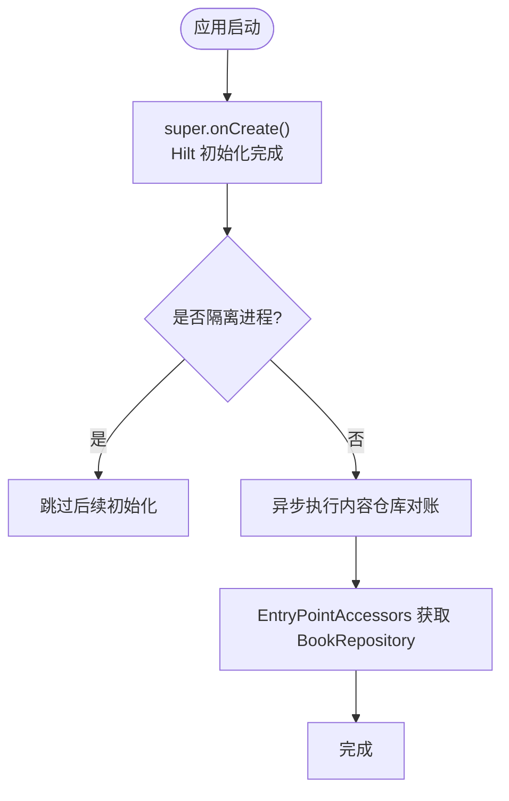
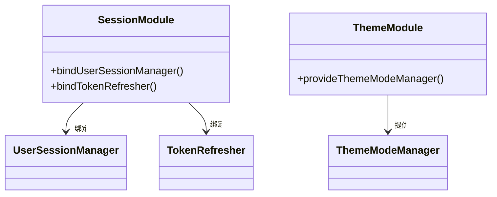
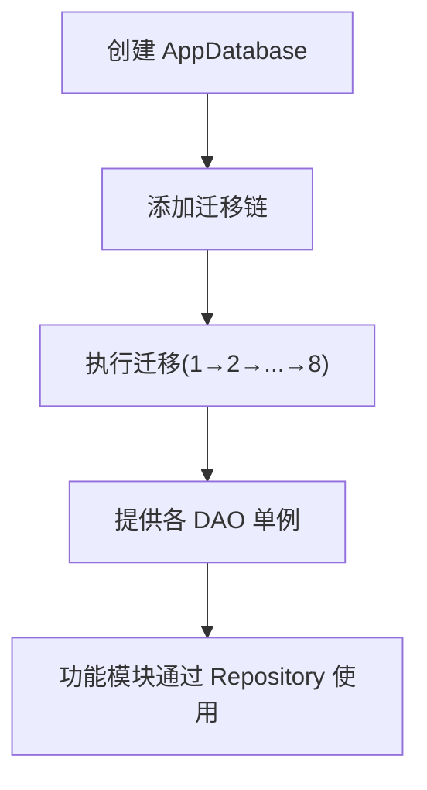
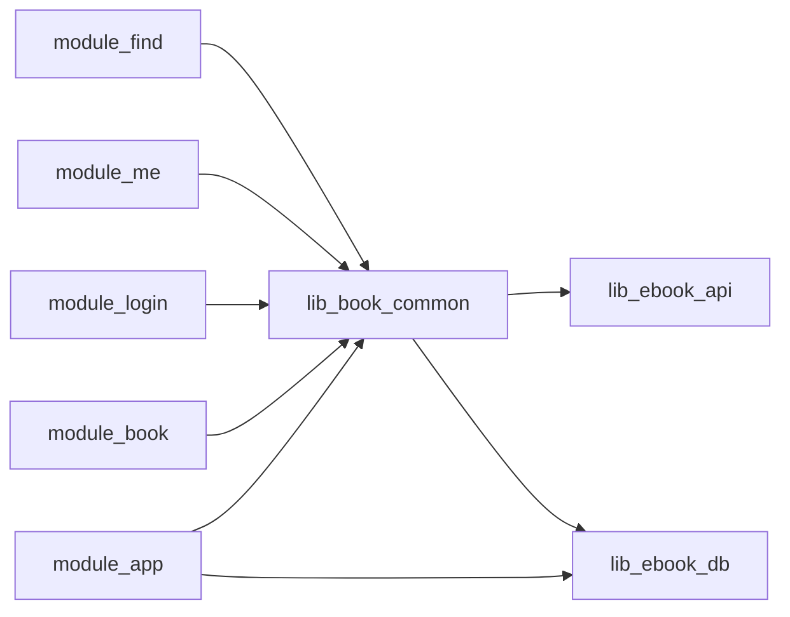

# 跨模块依赖注入

<cite>
**本文引用的文件**
- [MyApplication.kt](file://module_app/src/main/java/com/ebook/MyApplication.kt)
- [ThemeModule.kt](file://lib_book_common/src/main/java/com/ebook/common/di/ThemeModule.kt)
- [SessionModule.kt](file://lib_book_common/src/main/java/com/ebook/common/di/SessionModule.kt)
- [DatabaseModule.kt](file://lib_ebook_db/src/main/java/com/ebook/db/di/DatabaseModule.kt)
- [CacheModule.kt](file://module_me/src/main/java/com/ebook/me/di/CacheModule.kt)
- [LibraryCacheModule.kt](file://module_find/src/main/java/com/ebook/find/di/LibraryCacheModule.kt)
- [NetworkModule(实装).kt](file://module_app/src/real/java/com/ebook/di/NetworkModule.kt)
- [NetworkModule(mock).kt](file://module_app/src/mock/java/com/ebook/di/NetworkModule.kt)
- [ILoginProvider.kt](file://lib_book_common/src/main/java/com/ebook/common/provider/ILoginProvider.kt)
- [IMeProvider.kt](file://lib_book_common/src/main/java/com/ebook/common/provider/IMeProvider.kt)
- [IBookProvider.kt](file://lib_book_common/src/main/java/com/ebook/common/provider/IBookProvider.kt)
- [IFindProvider.kt](file://lib_book_common/src/main/java/com/ebook/common/provider/IFindProvider.kt)
</cite>

## 目录
1. [引言](#引言)
2. [项目结构与依赖边界](#项目结构与依赖边界)
3. [核心组件与装配点](#核心组件与装配点)
4. [架构总览](#架构总览)
5. [详细组件分析](#详细组件分析)
6. [依赖关系与方向控制](#依赖关系与方向控制)
7. [性能与可测试性](#性能与可测试性)
8. [故障排查指南](#故障排查指南)
9. [结论](#结论)
10. [附录：最佳实践清单](#附录最佳实践清单)

## 引言
本文件聚焦于多模块 Android 工程中的跨模块依赖注入策略与接口设计，重点解释 Provider 接口的定义与实现模式、Hilt 在不同模块间的组件装配与依赖传递机制、以及跨模块服务暴露与消费方式。文档同时给出具体代码位置指引，帮助读者快速定位实现细节并落地最佳实践。

## 项目结构与依赖边界
- 应用入口与根 DI 容器：module_app 通过 @HiltAndroidApp 启动 Hilt，并在 Application 中按需使用 EntryPointAccessors 获取共享能力（如 BookRepository），避免在 Application 上 eager 注入导致隔离进程崩溃。
- 共享能力与公共接口：lib_book_common 提供跨模块共享的 Provider 接口与通用领域能力；其 Hilt 模块以 SingletonComponent 提供全局单例。
- 数据持久化：lib_ebook_db 提供 Room 数据库与 DAO 的 Hilt 模块，并通过迁移链管理版本演进。
- 功能模块：module_find、module_me、module_login、module_book 等各自拥有业务视图与仓库，并通过依赖 lib_book_common 暴露的 Provider 接口与其他模块解耦。
- 网络与构建变体：module_app 通过 real/mock flavor 的 NetworkModule 将接口绑定到真实或 mock 实现，从而在不改动业务代码的前提下切换后端来源。

图表来源
- [MyApplication.kt:1-66](file://module_app/src/main/java/com/ebook/MyApplication.kt#L1-L66)
- [ThemeModule.kt:17-26](file://lib_book_common/src/main/java/com/ebook/common/di/ThemeModule.kt#L17-L26)
- [DatabaseModule.kt:25-243](file://lib_ebook_db/src/main/java/com/ebook/db/di/DatabaseModule.kt#L25-L243)

章节来源
- [MyApplication.kt:1-66](file://module_app/src/main/java/com/ebook/MyApplication.kt#L1-L66)
- [DatabaseModule.kt:25-243](file://lib_ebook_db/src/main/java/com/ebook/db/di/DatabaseModule.kt#L25-L243)

## 核心组件与装配点
- 应用级入口与延迟注入
  - 应用类标注 @HiltAndroidApp，并在 onCreate 后通过 EntryPointAccessors 按需取用共享能力（例如内容仓库对账），确保沙箱隔离进程不会触发不应执行的初始化。
- 共享会话与主题
  - SessionModule 将 UserSessionManager 与 TokenRefresher 绑定为单例，位于 lib_book_common，供所有功能模块消费。
  - ThemeModule 提供 ThemeModeManager，读取 SharedPreferences，作为全局外观主题管理器。
- 数据访问
  - DatabaseModule 集中提供 AppDatabase 与各 DAO，封装迁移逻辑，保证数据库结构演进一致性。
- 缓存与存储
  - module_me 的 CacheModule 提供缓存模型，仅依赖 cacheDir 路径，便于测试与替换。
  - module_find 的 LibraryCacheModule 提供书库磁盘缓存，负责清理旧缓存残留并提供稳定目录。
- 网络实现切换
  - module_app 的 real/mock 源集分别定义同名 NetworkModule，将 UserDataSource/CommentDataSource/ReleaseDataSource 绑定到真实或内存 mock 实现，实现无侵入的网络后端切换。

章节来源
- [MyApplication.kt:19-61](file://module_app/src/main/java/com/ebook/MyApplication.kt#L19-L61)
- [SessionModule.kt:22-37](file://lib_book_common/src/main/java/com/ebook/common/di/SessionModule.kt#L22-L37)
- [ThemeModule.kt:17-26](file://lib_book_common/src/main/java/com/ebook/common/di/ThemeModule.kt#L17-L26)
- [DatabaseModule.kt:192-243](file://lib_ebook_db/src/main/java/com/ebook/db/di/DatabaseModule.kt#L192-L243)
- [CacheModule.kt:19-27](file://module_me/src/main/java/com/ebook/me/di/CacheModule.kt#L19-L27)
- [LibraryCacheModule.kt:25-47](file://module_find/src/main/java/com/ebook/find/di/LibraryCacheModule.kt#L25-L47)
- [NetworkModule(实装).kt:24-35](file://module_app/src/real/java/com/ebook/di/NetworkModule.kt#L24-L35)
- [NetworkModule(mock).kt:26-37](file://module_app/src/mock/java/com/ebook/di/NetworkModule.kt#L26-L37)

## 架构总览
下图展示 Hilt 在模块间的装配与依赖流向：应用入口统一装配，共享模块提供跨模块可见的接口与实现绑定，数据层由 lib_ebook_db 提供，功能模块通过 Provider 接口消费共享能力。

图表来源
- [MyApplication.kt:19-61](file://module_app/src/main/java/com/ebook/MyApplication.kt#L19-L61)
- [SessionModule.kt:22-37](file://lib_book_common/src/main/java/com/ebook/common/di/SessionModule.kt#L22-L37)
- [DatabaseModule.kt:192-243](file://lib_ebook_db/src/main/java/com/ebook/db/di/DatabaseModule.kt#L192-L243)
- [NetworkModule(实装).kt:24-35](file://module_app/src/real/java/com/ebook/di/NetworkModule.kt#L24-L35)
- [NetworkModule(mock).kt:26-37](file://module_app/src/mock/java/com/ebook/di/NetworkModule.kt#L26-L37)

## 详细组件分析

### 应用入口与延迟注入（EntryPoint）
- 作用
  - 在 Application 中避免字段级 eager 注入，防止隔离进程（:js）因无法访问本地资源而崩溃。
  - 通过 EntryPointAccessors 在“用到那一刻”才从 Hilt 容器中取出共享对象（如 BookRepository）。
- 关键点
  - 使用 @EntryPoint + @InstallIn(SingletonComponent::class) 声明能力出口。
  - 在 onCreate 中先执行 super.onCreate()，再进入进程门判断与异步任务。

图表来源
- [MyApplication.kt:19-61](file://module_app/src/main/java/com/ebook/MyApplication.kt#L19-L61)

章节来源
- [MyApplication.kt:19-61](file://module_app/src/main/java/com/ebook/MyApplication.kt#L19-L61)

### 会话与主题模块（lib_book_common）
- 会话模块
  - 将 UserSessionManager 与 TokenRefresher 绑定为单例，供上层刷新 token、维护登录态。
- 主题模块
  - 提供 ThemeModeManager 单例，基于 Application 上下文读取偏好设置，统一全应用外观主题。

图表来源
- [SessionModule.kt:22-37](file://lib_book_common/src/main/java/com/ebook/common/di/SessionModule.kt#L22-L37)
- [ThemeModule.kt:17-26](file://lib_book_common/src/main/java/com/ebook/common/di/ThemeModule.kt#L17-L26)

章节来源
- [SessionModule.kt:22-37](file://lib_book_common/src/main/java/com/ebook/common/di/SessionModule.kt#L22-L37)
- [ThemeModule.kt:17-26](file://lib_book_common/src/main/java/com/ebook/common/di/ThemeModule.kt#L17-L26)

### 数据库模块（lib_ebook_db）
- 职责
  - 提供 AppDatabase 实例及所有 DAO，集中管理迁移链。
  - 使用 BundledSQLiteDriver，保证迁移行为一致且可测。
- 迁移
  - 覆盖 v1→v8 的多阶段演进，包括新增表、重命名列、删除列、清理历史数据等。

图表来源
- [DatabaseModule.kt:192-243](file://lib_ebook_db/src/main/java/com/ebook/db/di/DatabaseModule.kt#L192-L243)

章节来源
- [DatabaseModule.kt:25-243](file://lib_ebook_db/src/main/java/com/ebook/db/di/DatabaseModule.kt#L25-L243)

### 缓存与存储模块（功能模块）
- 缓存模型（module_me）
  - 仅提供 cacheDir 路径给 CacheModel，屏蔽 Context，便于单元测试替换。
- 书库缓存（module_find）
  - 提供 LibraryDiskCache 指向 cacheDir/library_cache，并在提供时尝试清理旧 ACache 遗留数据，失败仅记日志不抛错，确保装配健壮。

章节来源
- [CacheModule.kt:19-27](file://module_me/src/main/java/com/ebook/me/di/CacheModule.kt#L19-L27)
- [LibraryCacheModule.kt:25-47](file://module_find/src/main/java/com/ebook/find/di/LibraryCacheModule.kt#L25-L47)

### 网络后端切换（flavor 绑定）
- 实装 flavor
  - 将 UserDataSource/CommentDataSource/ReleaseDataSource 绑定到真实网络实现。
- Mock flavor
  - 将相同接口绑定到内存 mock 实现，载荷来自 assets JSON，无需后端即可验证全链路。
- 优势
  - 业务模块无需感知后端差异；通过单一 source set 切换，降低耦合与维护成本。

章节来源
- [NetworkModule(实装).kt:24-35](file://module_app/src/real/java/com/ebook/di/NetworkModule.kt#L24-L35)
- [NetworkModule(mock).kt:26-37](file://module_app/src/mock/java/com/ebook/di/NetworkModule.kt#L26-L37)

### Provider 接口与跨模块服务暴露
- 接口定义位置
  - ILoginProvider、IMeProvider、IBookProvider、IFindProvider 均位于 lib_book_common 的 provider 包，作为跨模块可见的服务契约。
- 典型模式
  - 功能模块在自身 di 包中提供对应 Provider 的实现，并将实现注册到 Hilt（或通过 TheRouter/宿主装配），使其他模块仅依赖接口而非具体实现。
  - 页面级 ViewModel 通过 Hilt 注入所需仓库或服务，避免直接依赖具体模块。
- 建议
  - 接口保持最小化、语义清晰；实现集中在对应功能模块；跨模块消费一律走接口。

章节来源
- [ILoginProvider.kt](file://lib_book_common/src/main/java/com/ebook/common/provider/ILoginProvider.kt)
- [IMeProvider.kt](file://lib_book_common/src/main/java/com/ebook/common/provider/IMeProvider.kt)
- [IBookProvider.kt](file://lib_book_common/src/main/java/com/ebook/common/provider/IBookProvider.kt)
- [IFindProvider.kt](file://lib_book_common/src/main/java/com/ebook/common/provider/IFindProvider.kt)

## 依赖关系与方向控制
- 依赖方向
  - 业务模块 → lib_book_common → lib_ebook_api / lib_ebook_db（lib_book_common 与 lib_book_source 并列依赖 API/DB；lib_book_source 为书源解析专用层）。
- 解耦原则
  - 跨模块服务通过 Provider 接口暴露；具体实现放在各自模块，避免反向依赖。
  - 应用入口仅在必要时通过 EntryPoint 获取共享能力，避免 Application 上 eager 注入。
- 变体隔离
  - 网络后端通过 flavor 同名模块绑定不同实现，业务层无感知。

图表来源
- [SessionModule.kt:22-37](file://lib_book_common/src/main/java/com/ebook/common/di/SessionModule.kt#L22-L37)
- [DatabaseModule.kt:192-243](file://lib_ebook_db/src/main/java/com/ebook/db/di/DatabaseModule.kt#L192-L243)

章节来源
- [SessionModule.kt:22-37](file://lib_book_common/src/main/java/com/ebook/common/di/SessionModule.kt#L22-L37)
- [DatabaseModule.kt:192-243](file://lib_ebook_db/src/main/java/com/ebook/db/di/DatabaseModule.kt#L192-L243)

## 性能与可测试性
- 性能
  - 数据库采用 BundledSQLiteDriver 与显式迁移链，保证升级路径可控；DAO 以单例提供，减少重复开销。
  - 缓存模块以目录参数形式注入，避免在模块内持有 Context，利于测试与替换。
- 可测试性
  - 网络后端通过 flavor 切换，单元测试与集成测试均可独立运行。
  - 缓存/存储模块仅依赖 File 路径，便于构造假目录进行断言。
  - 应用入口避免 eager 注入，减少隔离进程下的不稳定因素。

## 故障排查指南
- 隔离进程崩溃
  - 症状：:js 进程启动即崩溃，堆栈可能隐藏在 binder 超时。
  - 原因：Application 存在 eager @Inject 字段，导致 Hilt 在进程门之前尝试访问受限资源。
  - 处理：移除 Application 上的 eager 注入，改用 EntryPointAccessors 在需要时获取。
- 路由丢失
  - 症状：独立模式下跨模块跳转静默失败，仅记录日志。
  - 处理：在 src/main/test/debug 下补充占位路由，确保独立模式可运行；修改路由后需二次构建以更新 routeMap。
- 缓存未生效
  - 症状：书城每次进入都拉网络。
  - 处理：检查 LibraryCacheModule 提供的目录是否正确写入；确认旧缓存清理逻辑是否误删；核对缓存键生成与读取一致性。
- 数据库升级异常
  - 症状：升级后无法打开数据库或数据丢失。
  - 处理：检查迁移链顺序与语句正确性；确保实体与迁移一致；避免使用破坏性迁移。

章节来源
- [MyApplication.kt:19-61](file://module_app/src/main/java/com/ebook/MyApplication.kt#L19-L61)
- [LibraryCacheModule.kt:25-47](file://module_find/src/main/java/com/ebook/find/di/LibraryCacheModule.kt#L25-L47)
- [DatabaseModule.kt:25-243](file://lib_ebook_db/src/main/java/com/ebook/db/di/DatabaseModule.kt#L25-L243)

## 结论
本项目通过 Hilt 在共享模块与功能模块间建立清晰的依赖边界：lib_book_common 提供跨模块可见的 Provider 接口与通用能力，lib_ebook_db 集中管理数据层，module_app 通过 flavor 切换网络后端，并以 EntryPoint 避免不当的 eager 注入。该体系既保证了模块解耦，又提升了可测试性与可维护性。遵循本文的最佳实践与故障排查要点，可在扩展新功能时保持稳定与可控。

## 附录：最佳实践清单
- 在共享模块（lib_book_common）定义跨模块 Provider 接口，具体实现放在各自功能模块。
- 应用入口使用 @HiltAndroidApp，并避免 Application 上的 eager @Inject；需要时通过 EntryPointAccessors 延迟获取。
- 网络后端通过 flavor 的同名模块绑定不同实现，业务层零感知。
- 数据库模块集中管理迁移链，确保版本演进可追溯、可回滚。
- 缓存/存储模块仅依赖路径参数，便于测试与替换。
- 跨模块服务一律通过接口消费，禁止反向依赖实现。
- 变更涉及 Provider 接口时，同步更新 mock 与测试，保持契约一致性。