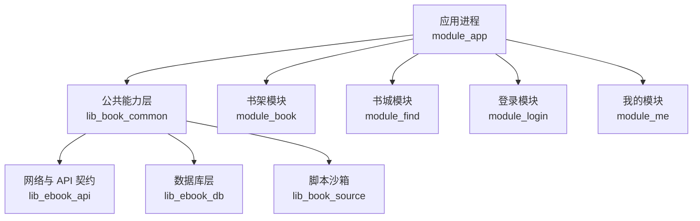
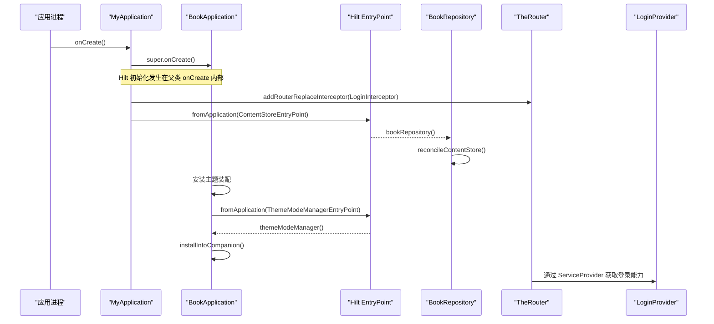
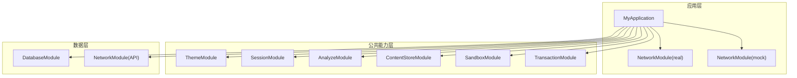
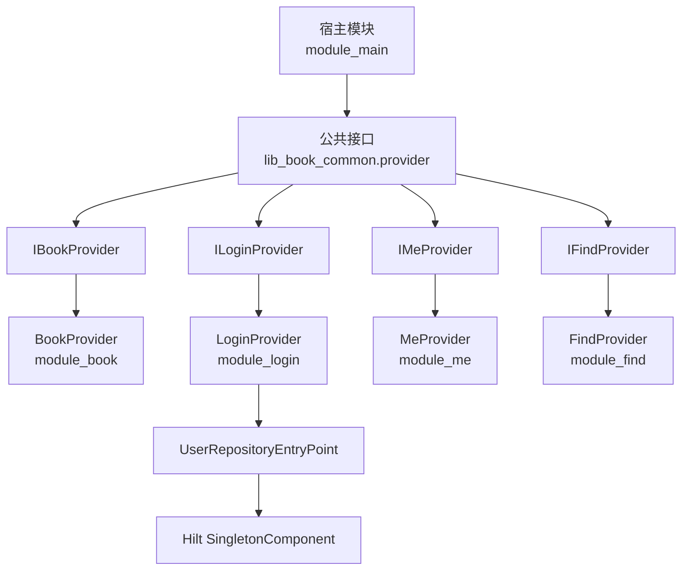
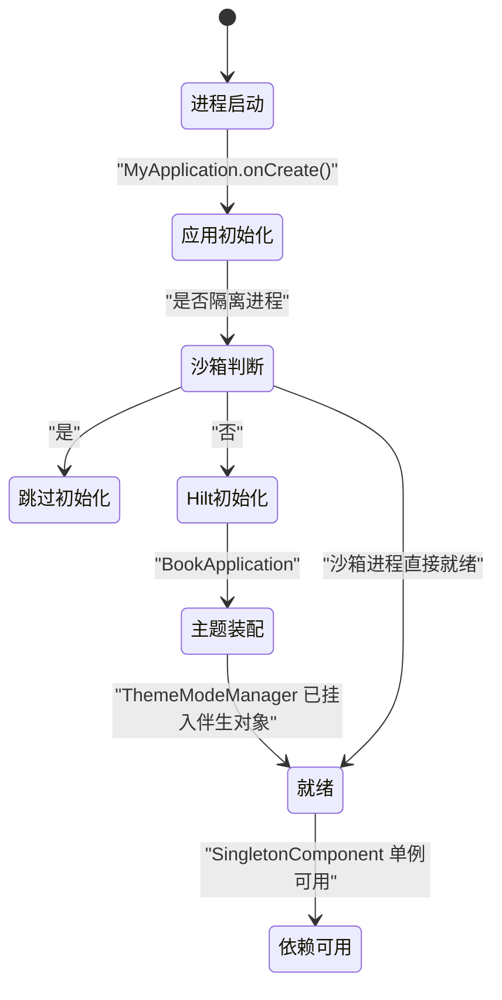

# 依赖注入架构

<cite>
**本文引用的文件**   
- [MyApplication.kt](file://module_app/src/main/java/com/ebook/MyApplication.kt)
- [BookApplication.kt](file://lib_book_common/src/main/java/com/ebook/common/BookApplication.kt)
- [ThemeModule.kt](file://lib_book_common/src/main/java/com/ebook/common/di/ThemeModule.kt)
- [SessionModule.kt](file://lib_book_common/src/main/java/com/ebook/common/di/SessionModule.kt)
- [AnalyzeModule.kt](file://lib_book_common/src/main/java/com/ebook/common/di/AnalyzeModule.kt)
- [ContentStoreModule.kt](file://lib_book_common/src/main/java/com/ebook/common/di/ContentStoreModule.kt)
- [SandboxModule.kt](file://lib_book_common/src/main/java/com/ebook/common/di/SandboxModule.kt)
- [TransactionModule.kt](file://lib_book_common/src/main/java/com/ebook/common/di/TransactionModule.kt)
- [DatabaseModule.kt](file://lib_ebook_db/src/main/java/com/ebook/db/di/DatabaseModule.kt)
- [NetworkModule.kt（API 层）](file://lib_ebook_api/src/main/java/com/ebook/api/utils/NetworkModule.kt)
- [NetworkModule.kt（real flavor）](file://module_app/src/real/java/com/ebook/di/NetworkModule.kt)
- [NetworkModule.kt（mock flavor）](file://module_app/src/mock/java/com/ebook/di/NetworkModule.kt)
- [CacheModule.kt](file://module_me/src/main/java/com/ebook/me/di/CacheModule.kt)
- [LibraryCacheModule.kt](file://module_find/src/main/java/com/ebook/find/di/LibraryCacheModule.kt)
- [IBookProvider.kt](file://lib_book_common/src/main/java/com/ebook/common/provider/IBookProvider.kt)
- [BookProvider.kt](file://module_book/src/main/java/com/ebook/book/provider/BookProvider.kt)
- [ILoginProvider.kt](file://lib_book_common/src/main/java/com/ebook/common/provider/ILoginProvider.kt)
- [LoginProvider.kt](file://module_login/src/main/java/com/ebook/login/provider/LoginProvider.kt)
- [IMeProvider.kt](file://lib_book_common/src/main/java/com/ebook/common/provider/IMeProvider.kt)
- [MeProvider.kt](file://module_me/src/main/java/com/ebook/me/provider/MeProvider.kt)
- [IFindProvider.kt](file://lib_book_common/src/main/java/com/ebook/common/provider/IFindProvider.kt)
- [FindProvider.kt](file://module_find/src/main/java/com/ebook/find/provider/FindProvider.kt)
</cite>

## 目录
1. [引言](#引言)
2. [项目结构与依赖注入边界](#项目结构与依赖注入边界)
3. [核心组件与装配层次](#核心组件与装配层次)
4. [体系结构总览](#体系结构总览)
5. [详细组件分析](#详细组件分析)
6. [依赖关系图](#依赖关系图)
7. [单例对象管理策略](#单例对象管理策略)
8. [模块隔离与 Provider 接口机制](#模块隔离与-provider-接口机制)
9. [生命周期管理](#生命周期管理)
10. [循环依赖防范与最佳实践](#循环依赖防范与最佳实践)
11. [性能考量](#性能考量)
12. [故障排查指南](#故障排查指南)
13. [结论](#结论)

## 引言
本仓库采用 Hilt 作为 Android 应用的依赖注入框架，并结合 TheRouter 的 `@ServiceProvider` SPI 实现跨模块服务发现。整体设计围绕“应用级全局单例 + 模块级能力暴露”展开：基础能力通过 `SingletonComponent` 提供全局单例，业务模块通过接口定义对外能力并由宿主通过路由或服务发现机制获取页面或行为入口。本文聚焦 Hilt 的应用级与组件级模块、单例管理、Provider 接口的跨模块发现、依赖关系图以及生命周期约束，帮助开发者理解并正确使用该项目的依赖注入模式。

## 项目结构与依赖注入边界
该项目按功能域拆分为多个 Gradle 模块：
- 应用壳与启动流程：`module_app`
- 公共基座与通用能力：`lib_book_common`
- 网络与 API 契约：`lib_ebook_api`
- 数据库层：`lib_ebook_db`
- 书源脚本沙箱：`lib_book_source`
- 业务模块：`module_book`、`module_find`、`module_login`、`module_me`
- 主界面模块：`module_main`

Hilt 在以下边界发挥作用：
- 应用进程入口由 `@HiltAndroidApp` 初始化依赖图。
- 基础能力集中在 `lib_book_common` 的 `di` 包中，以 `@InstallIn(SingletonComponent::class)` 暴露全局单例。
- 数据访问集中在 `lib_ebook_db` 的 `di` 包，负责 Room 数据库和 DAO 的装配。
- 网络能力在 `lib_ebook_api` 提供统一客户端配置，并在 `module_app` 的 real/mock flavor 中替换具体实现。
- 跨模块页面和服务通过 lib_book_common 中的 Provider 接口暴露，由各业务模块提供实现并通过 TheRouter 注册。

**图表来源**
- [MyApplication.kt:1-66](file://module_app/src/main/java/com/ebook/MyApplication.kt#L1-L66)
- [BookApplication.kt:1-64](file://lib_book_common/src/main/java/com/ebook/common/BookApplication.kt#L1-L64)

**章节来源**
- [MyApplication.kt:1-66](file://module_app/src/main/java/com/ebook/MyApplication.kt#L1-L66)
- [BookApplication.kt:1-64](file://lib_book_common/src/main/java/com/ebook/common/BookApplication.kt#L1-L64)

## 核心组件与装配层次
Hilt 在本项目中的装配层次可概括为三层：
1. 应用级装配：`MyApplication` 标注 `@HiltAndroidApp`，继承 `BookApplication`；`BookApplication` 负责主题装配与通过 `EntryPointAccessors` 从 `SingletonComponent` 取回全局管理器。
2. 能力模块装配：`lib_book_common` 下的 `ThemeModule`、`SessionModule`、`AnalyzeModule`、`ContentStoreModule`、`SandboxModule`、`TransactionModule` 将全局服务绑定到 `SingletonComponent`。
3. 数据与网络装配：`lib_ebook_db` 的 `DatabaseModule` 提供 `AppDatabase` 与各 DAO；`lib_ebook_api` 的 `NetworkModule` 提供 JSON、OkHttpClient；`module_app` 的 real/mock `NetworkModule` 用 `@Binds` 替换网络实现。

此外，模块间跨模块调用不直接依赖对方类，而是通过 `lib_book_common.provider` 下定义的接口，由各业务模块的 Provider 类通过 TheRouter 暴露。

**章节来源**
- [MyApplication.kt:1-66](file://module_app/src/main/java/com/ebook/MyApplication.kt#L1-L66)
- [BookApplication.kt:1-64](file://lib_book_common/src/main/java/com/ebook/common/BookApplication.kt#L1-L64)
- [ThemeModule.kt:1-26](file://lib_book_common/src/main/java/com/ebook/common/di/ThemeModule.kt#L1-L26)
- [SessionModule.kt:1-37](file://lib_book_common/src/main/java/com/ebook/common/di/SessionModule.kt#L1-L37)
- [AnalyzeModule.kt:1-18](file://lib_book_common/src/main/java/com/ebook/common/di/AnalyzeModule.kt#L1-L18)
- [ContentStoreModule.kt:1-87](file://lib_book_common/src/main/java/com/ebook/common/di/ContentStoreModule.kt#L1-L87)
- [SandboxModule.kt:1-56](file://lib_book_common/src/main/java/com/ebook/common/di/SandboxModule.kt#L1-L56)
- [TransactionModule.kt:1-24](file://lib_book_common/src/main/java/com/ebook/common/di/TransactionModule.kt#L1-L24)
- [DatabaseModule.kt:1-243](file://lib_ebook_db/src/main/java/com/ebook/db/di/DatabaseModule.kt#L1-L243)
- [NetworkModule.kt（API 层）:1-76](file://lib_ebook_api/src/main/java/com/ebook/api/utils/NetworkModule.kt#L1-L76)
- [NetworkModule.kt（real flavor）:1-35](file://module_app/src/real/java/com/ebook/di/NetworkModule.kt#L1-L35)
- [NetworkModule.kt（mock flavor）:1-37](file://module_app/src/mock/java/com/ebook/di/NetworkModule.kt#L1-L37)

## 体系结构总览
下图展示应用启动、主题装配、内容仓库对账与跨模块服务发现的总体流程：

**图表来源**
- [MyApplication.kt:1-66](file://module_app/src/main/java/com/ebook/MyApplication.kt#L1-L66)
- [BookApplication.kt:1-64](file://lib_book_common/src/main/java/com/ebook/common/BookApplication.kt#L1-L64)
- [LoginProvider.kt:1-36](file://module_login/src/main/java/com/ebook/login/provider/LoginProvider.kt#L1-L36)

**章节来源**
- [MyApplication.kt:1-66](file://module_app/src/main/java/com/ebook/MyApplication.kt#L1-L66)
- [BookApplication.kt:1-64](file://lib_book_common/src/main/java/com/ebook/common/BookApplication.kt#L1-L64)
- [LoginProvider.kt:1-36](file://module_login/src/main/java/com/ebook/login/provider/LoginProvider.kt#L1-L36)

## 详细组件分析

### 应用入口与 EntryPoint 使用
`MyApplication` 是应用入口，标注 `@HiltAndroidApp`，并在 `onCreate` 中执行：
- 保留 `super.onCreate()`，保证 Hilt 在父类内完成注入。
- 在沙箱隔离进程中提前返回，避免无意义初始化。
- 注册路由拦截器。
- 通过 `EntryPointAccessors.fromApplication` 获取 `ContentStoreEntryPoint`，延迟拿到 `BookRepository` 并执行内容仓库对账。
- 定义 `ContentStoreEntryPoint` 接口，标注 `@EntryPoint` 与 `@InstallIn(SingletonComponent::class)`，用于在 Application 层级按需访问 Hilt 提供的依赖。

`BookApplication` 负责：
- 在沙箱进程中跳过主题装配。
- 安装 Compose 主题，并根据 `ThemeModeManager` 的状态决定深色模式。
- 通过 `ThemeModeManagerEntryPoint` 从 Hilt 图中取回 `ThemeModeManager` 并挂入伴生对象供 Compose 重组读取。

关键点：
- Application 上不允许字段级 eager `@Inject`，因为 Hilt 生成的注入发生在 `super.onCreate()` 内部；若需要应用级依赖，应通过 EntryPoint 在真正使用时获取。
- 沙箱进程门确保非 UI 进程不会触发主题与 SharedPreferences 等依赖失败路径。

**章节来源**
- [MyApplication.kt:1-66](file://module_app/src/main/java/com/ebook/MyApplication.kt#L1-L66)
- [BookApplication.kt:1-64](file://lib_book_common/src/main/java/com/ebook/common/BookApplication.kt#L1-L64)

### 主题与会话模块
`ThemeModule` 通过 `@Provides` 提供 `ThemeModeManager`，并标注 `@Singleton`，由 `SingletonComponent` 管理生命周期。它与 `BookApplication` 的伴生实例同源，确保 Compose 主题状态一致。

`SessionModule` 使用 `@Binds` 将接口绑定到 Android 实现：
- `UserSessionManager` 绑定到 `AndroidUserSessionManager`。
- `TokenRefresher` 绑定到 `SessionTokenRefresher`。
两者均为 `@Singleton`，体现会话与 Token 刷新在全局范围共享。

**章节来源**
- [ThemeModule.kt:1-26](file://lib_book_common/src/main/java/com/ebook/common/di/ThemeModule.kt#L1-L26)
- [SessionModule.kt:1-37](file://lib_book_common/src/main/java/com/ebook/common/di/SessionModule.kt#L1-L37)

### 分析能力与书源管理器
`AnalyzeModule` 是抽象模块，使用 `@Binds` 将 `BookSourceManagerImpl` 绑定到 `BookSourceManager` 接口，并以 `@Singleton` 暴露。这样上层只需依赖接口，实现细节被封装在分析模块中。

**章节来源**
- [AnalyzeModule.kt:1-18](file://lib_book_common/src/main/java/com/ebook/common/di/AnalyzeModule.kt#L1-L18)

### 本地内容与导入管线
`ContentStoreModule` 承担本地内容存储与解析能力的装配：
- 提供 `BookStore`，传入 `filesDir/books` 目录，避免让业务层直接持有 `Context`。
- 提供 `ChapterSplitter`、`ChapterContentCache` 等单例工具。
- 提供导入临时目录 `import`，用于 Uri 转 File 后复用“拷贝即哈希”流水线。
- 按 `BookFormat` 路由到对应 `ChapterReader`，包括 TXT、EPUB 与 NETWORK（jsoup）。
- 提供仅本地格式的 `SourceReader` Map，用于导入链路。

该模块注释明确说明：新增格式只需修改一处路由，仓库侧无需分支改动，体现开闭原则。

**章节来源**
- [ContentStoreModule.kt:1-87](file://lib_book_common/src/main/java/com/ebook/common/di/ContentStoreModule.kt#L1-L87)

### 脚本沙箱装配
`SandboxModule` 提供 `JsSandboxHost`，其构造顺序非常关键：
- 先创建 `HostCallbackRouter`。
- 再创建 `JsSandboxClient`，传入连接器与主机处理器。
- 最后把 router 显式传给 `JsSandboxHost`，避免默认值产生另一个路由器导致回调不一致。
- 使用 `@Named("source")` 注入纯净 OkHttp 客户端，避免泄露 token。
- 客户端不在这里预热，首次执行时才连接沙箱进程，冷启动零额外开销。

注入方使用可空参数接收，测试或缺少 binding 时走降级行为。

**章节来源**
- [SandboxModule.kt:1-56](file://lib_book_common/src/main/java/com/ebook/common/di/SandboxModule.kt#L1-L56)

### 写事务运行器
`TransactionModule` 提供 `WriteTransactionRunner` 的实现，基于 Room 3 的 `withWriteTransaction` 包装异步块，以 IMMEDIATE 事务方式执行写入逻辑。它暴露给上层仓储或协调器使用，屏蔽底层 Room 事务细节。

**章节来源**
- [TransactionModule.kt:1-24](file://lib_book_common/src/main/java/com/ebook/common/di/TransactionModule.kt#L1-L24)

### 数据库装配与迁移
`DatabaseModule` 提供：
- `AppDatabase`，包含 v1→v8 的多段 Migration，涵盖下载章节增强、本地书正文迁移、网络书正文迁移、书源表增加、脚本双格式、内置源清理、暂停标记表等。
- 各 DAO 的单例提供者：`BookShelfDao`、`BookInfoDao`、`ChapterListDao`、`SearchHistoryDao`、`DownloadChapterDao`、`BookGroupDao`、`BookSourceDao`、`PausedBookDao`。
- 使用 `BundledSQLiteDriver`，使 DDL 能力取决于随包 SQLite 版本而非设备系统版本。

Migration 注释详细说明每次变更的业务动机、数据影响、兼容性判断与测试覆盖策略，体现数据库演进的可审计性。

**章节来源**
- [DatabaseModule.kt:1-243](file://lib_ebook_db/src/main/java/com/ebook/db/di/DatabaseModule.kt#L1-L243)

### 网络客户端与 Flavor 替换
`lib_ebook_api` 的 `NetworkModule` 提供：
- 统一的 `Json` 配置。
- `TestAssetManager`，用于测试资产加载。
- `@AuthAllowedHosts` 白名单集合。
- `@Named("source")` 的纯净 OkHttp 客户端，用于第三方书源请求。
- `@Named("release")` 的纯净 OkHttp 客户端，用于发布检查。

`module_app` 的 real 与 mock flavor 各自提供同名 `NetworkModule` 接口，用 `@Binds` 替换 `UserDataSource`、`CommentDataSource`、`ReleaseDataSource` 的具体实现：
- real：真实后端实现。
- mock：内存或静态资产实现，适合离线集成测试与 CI。

这种设计将“契约定义”与“实现选择”解耦，便于多环境切换。

**章节来源**
- [NetworkModule.kt（API 层）:1-76](file://lib_ebook_api/src/main/java/com/ebook/api/utils/NetworkModule.kt#L1-L76)
- [NetworkModule.kt（real flavor）:1-35](file://module_app/src/real/java/com/ebook/di/NetworkModule.kt#L1-L35)
- [NetworkModule.kt（mock flavor）:1-37](file://module_app/src/mock/java/com/ebook/di/NetworkModule.kt#L1-L37)

### 模块缓存装配
`module_me` 的 `CacheModule` 提供 `CacheModel`，只接收 `cacheDir` 而不接收 `Context`，将 Context 转换限制在装配点。

`module_find` 的 `LibraryCacheModule` 提供 `LibraryDiskCache`，同样只接收 `cacheDir/library_cache` 目录，并顺手清理旧 ACache 留下的 SharedPreferences，失败仅记录日志。

**章节来源**
- [CacheModule.kt:1-27](file://module_me/src/main/java/com/ebook/me/di/CacheModule.kt#L1-L27)
- [LibraryCacheModule.kt:1-47](file://module_find/src/main/java/com/ebook/find/di/LibraryCacheModule.kt#L1-L47)

## 依赖关系图
下图展示 Hilt 模块之间的依赖方向与主要装配关系：

**图表来源**
- [MyApplication.kt:1-66](file://module_app/src/main/java/com/ebook/MyApplication.kt#L1-L66)
- [ThemeModule.kt:1-26](file://lib_book_common/src/main/java/com/ebook/common/di/ThemeModule.kt#L1-L26)
- [SessionModule.kt:1-37](file://lib_book_common/src/main/java/com/ebook/common/di/SessionModule.kt#L1-L37)
- [AnalyzeModule.kt:1-18](file://lib_book_common/src/main/java/com/ebook/common/di/AnalyzeModule.kt#L1-L18)
- [ContentStoreModule.kt:1-87](file://lib_book_common/src/main/java/com/ebook/common/di/ContentStoreModule.kt#L1-L87)
- [SandboxModule.kt:1-56](file://lib_book_common/src/main/java/com/ebook/common/di/SandboxModule.kt#L1-L56)
- [TransactionModule.kt:1-24](file://lib_book_common/src/main/java/com/ebook/common/di/TransactionModule.kt#L1-L24)
- [DatabaseModule.kt:1-243](file://lib_ebook_db/src/main/java/com/ebook/db/di/DatabaseModule.kt#L1-L243)
- [NetworkModule.kt（API 层）:1-76](file://lib_ebook_api/src/main/java/com/ebook/api/utils/NetworkModule.kt#L1-L76)
- [NetworkModule.kt（real flavor）:1-35](file://module_app/src/real/java/com/ebook/di/NetworkModule.kt#L1-L35)
- [NetworkModule.kt（mock flavor）:1-37](file://module_app/src/mock/java/com/ebook/di/NetworkModule.kt#L1-L37)

## 单例对象管理策略
项目中所有通过 Hilt 提供的全局服务均使用 `@Singleton` 与 `@InstallIn(SingletonComponent::class)`：
- `ThemeModeManager`：主题模式持久化与状态广播。
- `UserSessionManager`、`TokenRefresher`：用户会话与 Token 刷新。
- `BookSourceManager`：书源管理器实现。
- `BookStore`、`ChapterSplitter`、`ChapterContentCache`：本地内容与章节处理。
- `JsSandboxHost`：脚本沙箱主机。
- `WriteTransactionRunner`：写事务运行器。
- `AppDatabase`、各 DAO：数据库与数据访问器。
- `Json`、`OkHttpClient`：网络基础设施。

这些单例的生命周期与应用进程一致，适合保存全局状态、缓存、网络客户端与数据库连接。

注意：
- 沙箱客户端不预构建，避免冷启动成本。
- 某些 Provider（如登录 Provider）由 TheRouter 创建，但其内部桥接的 UserRepository 来自 Hilt，仍受 Hilt 单例管理。

**章节来源**
- [ThemeModule.kt:1-26](file://lib_book_common/src/main/java/com/ebook/common/di/ThemeModule.kt#L1-L26)
- [SessionModule.kt:1-37](file://lib_book_common/src/main/java/com/ebook/common/di/SessionModule.kt#L1-L37)
- [AnalyzeModule.kt:1-18](file://lib_book_common/src/main/java/com/ebook/common/di/AnalyzeModule.kt#L1-L18)
- [ContentStoreModule.kt:1-87](file://lib_book_common/src/main/java/com/ebook/common/di/ContentStoreModule.kt#L1-L87)
- [SandboxModule.kt:1-56](file://lib_book_common/src/main/java/com/ebook/common/di/SandboxModule.kt#L1-L56)
- [TransactionModule.kt:1-24](file://lib_book_common/src/main/java/com/ebook/common/di/TransactionModule.kt#L1-L24)
- [DatabaseModule.kt:1-243](file://lib_ebook_db/src/main/java/com/ebook/db/di/DatabaseModule.kt#L1-L243)
- [NetworkModule.kt（API 层）:1-76](file://lib_ebook_api/src/main/java/com/ebook/api/utils/NetworkModule.kt#L1-L76)
- [LoginProvider.kt:1-36](file://module_login/src/main/java/com/ebook/login/provider/LoginProvider.kt#L1-L36)

## 模块隔离与 Provider 接口机制
跨模块通信遵循“接口定义在公共层，实现在各业务模块”的原则：

| 接口 | 所在模块 | 实现模块 | 用途 |
| --- | --- | --- | --- |
| `IBookProvider` | `lib_book_common` | `module_book` | 书架主页 |
| `ILoginProvider` | `lib_book_common` | `module_login` | 服务端登出 |
| `IMeProvider` | `lib_book_common` | `module_me` | 个人中心主页 |
| `IFindProvider` | `lib_book_common` | `module_find` | 书城主页 |

每个 Provider 实现类通过 TheRouter 的 `@ServiceProvider` 注解注册，宿主通过接口获取页面或服务。例如：
- `BookProvider` 返回 `BookShelfPage`，并允许宿主注入“去书城”回调。
- `LoginProvider` 通过 `UserRepositoryEntryPoint` 从 Hilt 桥接获取 `UserRepository`，再调用 `logout`。
- `MeProvider`、`FindProvider` 返回各自 Compose 页面。

这种设计避免业务模块之间互相直接依赖，同时保持宿主能动态组合页面。

**图表来源**
- [IBookProvider.kt:1-23](file://lib_book_common/src/main/java/com/ebook/common/provider/IBookProvider.kt#L1-L23)
- [BookProvider.kt:1-16](file://module_book/src/main/java/com/ebook/book/provider/BookProvider.kt#L1-L16)
- [ILoginProvider.kt:1-19](file://lib_book_common/src/main/java/com/ebook/common/provider/ILoginProvider.kt#L1-L19)
- [LoginProvider.kt:1-36](file://module_login/src/main/java/com/ebook/login/provider/LoginProvider.kt#L1-L36)
- [IMeProvider.kt:1-13](file://lib_book_common/src/main/java/com/ebook/common/provider/IMeProvider.kt#L1-L13)
- [MeProvider.kt:1-20](file://module_me/src/main/java/com/ebook/me/provider/MeProvider.kt#L1-L20)
- [IFindProvider.kt:1-13](file://lib_book_common/src/main/java/com/ebook/common/provider/IFindProvider.kt#L1-L13)
- [FindProvider.kt:1-19](file://module_find/src/main/java/com/ebook/find/provider/FindProvider.kt#L1-L19)

**章节来源**
- [IBookProvider.kt:1-23](file://lib_book_common/src/main/java/com/ebook/common/provider/IBookProvider.kt#L1-L23)
- [BookProvider.kt:1-16](file://module_book/src/main/java/com/ebook/book/provider/BookProvider.kt#L1-L16)
- [ILoginProvider.kt:1-19](file://lib_book_common/src/main/java/com/ebook/common/provider/ILoginProvider.kt#L1-L19)
- [LoginProvider.kt:1-36](file://module_login/src/main/java/com/ebook/login/provider/LoginProvider.kt#L1-L36)
- [IMeProvider.kt:1-13](file://lib_book_common/src/main/java/com/ebook/common/provider/IMeProvider.kt#L1-L13)
- [MeProvider.kt:1-20](file://module_me/src/main/java/com/ebook/me/provider/MeProvider.kt#L1-L20)
- [IFindProvider.kt:1-13](file://lib_book_common/src/main/java/com/ebook/common/provider/IFindProvider.kt#L1-L13)
- [FindProvider.kt:1-19](file://module_find/src/main/java/com/ebook/find/provider/FindProvider.kt#L1-L19)

## 生命周期管理
Hilt 在本项目中的生命周期管理围绕 `SingletonComponent` 与进程边界展开：
- 应用级单例：所有全局服务均声明 `@Singleton`，由 Hilt 在应用进程生命周期内维护唯一实例。
- 沙箱进程：`SandboxProcess.isInIsolatedProcess` 作为进程门，阻止主题装配、SharedPreferences 读写等非必要初始化。
- EntryPoint：Application 层级通过 `EntryPointAccessors` 延迟获取依赖，避免字段注入时机问题。
- Compose 主题：`ThemeModeManager` 通过伴生对象暴露，Compose 重组时读取最新状态。
- Provider 生命周期：页面级 Provider 由 TheRouter 创建，ViewModel 作用域由 `hiltViewModel` 绑定到 NavBackStackEntry。

**图表来源**
- [MyApplication.kt:1-66](file://module_app/src/main/java/com/ebook/MyApplication.kt#L1-L66)
- [BookApplication.kt:1-64](file://lib_book_common/src/main/java/com/ebook/common/BookApplication.kt#L1-L64)
- [ThemeModule.kt:1-26](file://lib_book_common/src/main/java/com/ebook/common/di/ThemeModule.kt#L1-L26)

**章节来源**
- [MyApplication.kt:1-66](file://module_app/src/main/java/com/ebook/MyApplication.kt#L1-L66)
- [BookApplication.kt:1-64](file://lib_book_common/src/main/java/com/ebook/common/BookApplication.kt#L1-L64)

## 循环依赖防范与最佳实践
项目通过以下方式降低循环依赖风险：
- 接口与实现分离：`AnalyzeModule`、`SessionModule` 使用 `@Binds` 将接口绑定到实现，调用方只依赖接口。
- Context 转换收敛：`ContentStoreModule`、`CacheModule`、`LibraryCacheModule` 在装配点完成 `Context → File` 转换，业务层不持有 Context。
- 跨模块通信通过 Provider 接口：业务模块不直接依赖其他业务模块类，而是通过 `lib_book_common` 中的接口。
- Flavor 替换：real/mock 的 `NetworkModule` 通过同名接口与 `@Binds` 替换实现，避免运行时条件分支耦合。
- EntryPoint 延迟获取：Application 层不字段注入重依赖，改用 EntryPoint 在需要时取回。

建议：
- 新增全局服务时优先放在 `lib_book_common.di`，并使用 `@InstallIn(SingletonComponent::class)`。
- 新增业务实现时使用 `@Binds` 绑定接口，避免直接引用实现类。
- 新增跨模块能力时先在 `lib_book_common.provider` 定义接口，再由业务模块提供实现。
- 避免在 Application 字段上使用 eager `@Inject`，改用 EntryPoint 或构造函数注入。

**章节来源**
- [AnalyzeModule.kt:1-18](file://lib_book_common/src/main/java/com/ebook/common/di/AnalyzeModule.kt#L1-L18)
- [SessionModule.kt:1-37](file://lib_book_common/src/main/java/com/ebook/common/di/SessionModule.kt#L1-L37)
- [ContentStoreModule.kt:1-87](file://lib_book_common/src/main/java/com/ebook/common/di/ContentStoreModule.kt#L1-L87)
- [CacheModule.kt:1-27](file://module_me/src/main/java/com/ebook/me/di/CacheModule.kt#L1-L27)
- [LibraryCacheModule.kt:1-47](file://module_find/src/main/java/com/ebook/find/di/LibraryCacheModule.kt#L1-L47)
- [NetworkModule.kt（real flavor）:1-35](file://module_app/src/real/java/com/ebook/di/NetworkModule.kt#L1-L35)
- [NetworkModule.kt（mock flavor）:1-37](file://module_app/src/mock/java/com/ebook/di/NetworkModule.kt#L1-L37)
- [MyApplication.kt:1-66](file://module_app/src/main/java/com/ebook/MyApplication.kt#L1-L66)

## 性能考量
- 沙箱客户端懒连接：`SandboxModule` 不在装配阶段连接沙箱进程，减少冷启动开销。
- 主题装配延迟：`ThemeModeManager` 通过 EntryPoint 取回后再挂入伴生对象，避免 Application 初始化阻塞。
- 网络客户端复用：`OkHttpClient`、`Json` 作为单例复用，避免重复创建。
- 数据库驱动固定：使用 `BundledSQLiteDriver`，避免设备差异导致的性能波动。
- 内容仓库对账异步执行：`MyApplication` 中使用协程异步执行，不影响启动主线。

[本节为通用性能建议，不直接分析特定代码片段]

## 故障排查指南
常见问题与定位思路：
1. **Application 字段注入为空或崩溃**
   - 检查是否在 `super.onCreate()` 前使用字段注入；应改为 EntryPoint 延迟获取。
   - 参考 `MyApplication` 中对 `ContentStoreEntryPoint` 的使用方式。

2. **沙箱进程初始化异常**
   - 检查 `SandboxProcess.isInIsolatedProcess` 分支是否正确跳过主题与 SharedPreferences 操作。
   - 确认 `SandboxModule` 中 router 与 client 的构造顺序。

3. **网络实现未生效**
   - 确认当前 flavor 使用的是 real 还是 mock 的 `NetworkModule`。
   - 检查 `@Binds` 绑定的实现是否与预期一致。

4. **跨模块服务找不到**
   - 检查 Provider 是否通过 `@ServiceProvider` 注册。
   - 确认宿主是否能通过接口获取对应 Provider。

5. **数据库迁移失败**
   - 检查 Migration 链是否完整，SQL 语句是否与 Room schema 一致。
   - 关注带 DEFAULT 列与不带 DEFAULT 列的迁移写法差异。

**章节来源**
- [MyApplication.kt:1-66](file://module_app/src/main/java/com/ebook/MyApplication.kt#L1-L66)
- [SandboxModule.kt:1-56](file://lib_book_common/src/main/java/com/ebook/common/di/SandboxModule.kt#L1-L56)
- [NetworkModule.kt（real flavor）:1-35](file://module_app/src/real/java/com/ebook/di/NetworkModule.kt#L1-L35)
- [NetworkModule.kt（mock flavor）:1-37](file://module_app/src/mock/java/com/ebook/di/NetworkModule.kt#L1-L37)
- [DatabaseModule.kt:1-243](file://lib_ebook_db/src/main/java/com/ebook/db/di/DatabaseModule.kt#L1-L243)

## 结论
该项目的依赖注入架构以 Hilt 为核心，围绕 `SingletonComponent` 提供全局单例，结合 TheRouter 的 `@ServiceProvider` 实现跨模块服务发现。应用级模块负责初始化与入口控制，能力模块负责全局服务装配，数据与网络模块负责基础设施，业务模块通过接口暴露页面与服务。这种分层与解耦设计有助于避免循环依赖、提升可测试性，并支持多 flavor 与多进程场景。开发者在使用时应遵循接口先行、Context 转换收敛、EntryPoint 延迟获取、Flavor 替换等最佳实践，确保依赖图清晰、稳定且易于扩展。