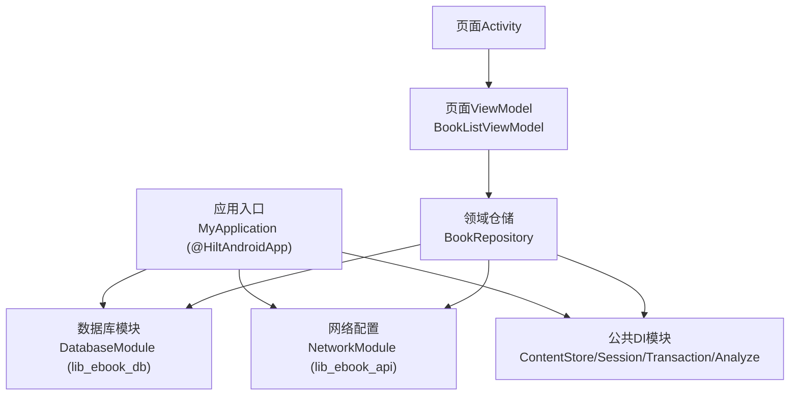
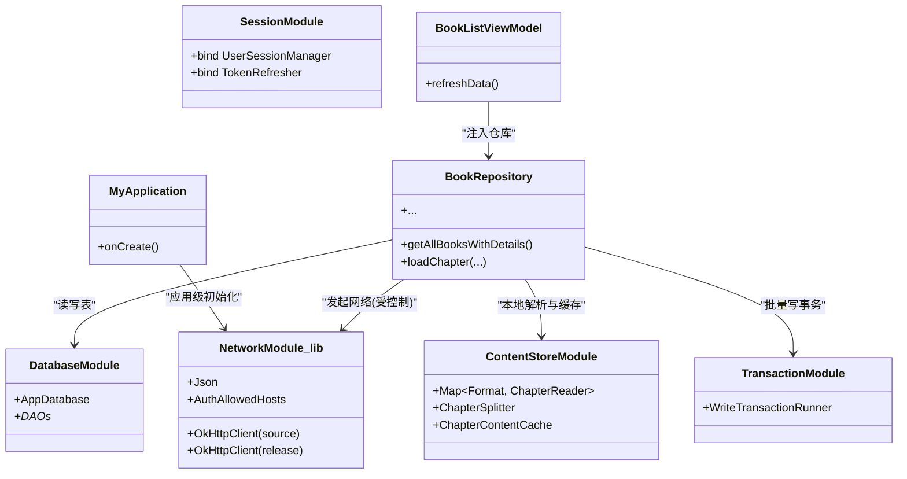
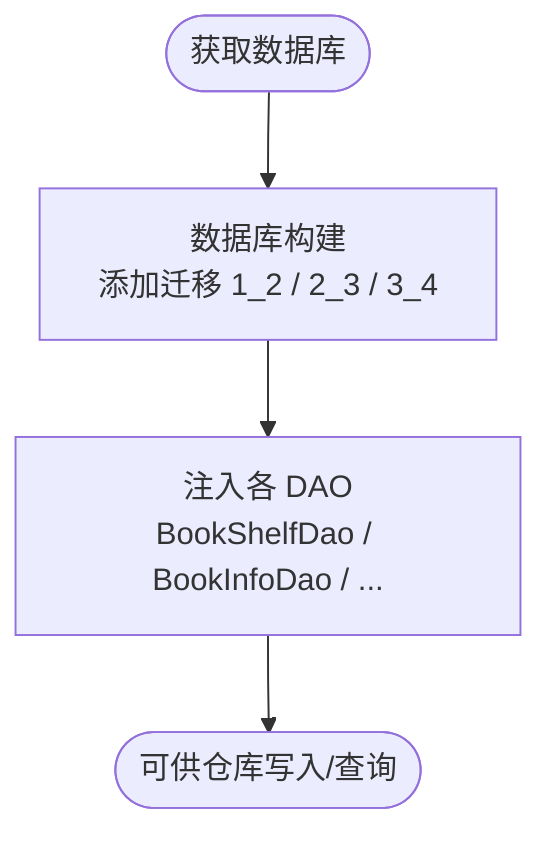
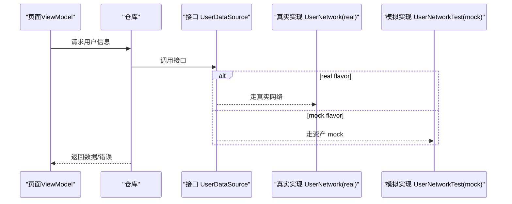
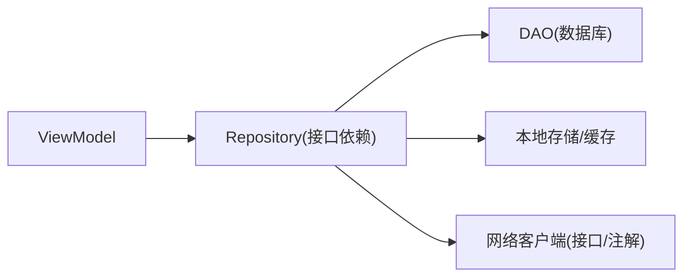

# 依赖注入框架

<cite>
**本文引用的文件**
- [module_app/src/main/java/com/ebook/MyApplication.kt](file://module_app/src/main/java/com/ebook/MyApplication.kt)
- [lib_book_common/src/main/java/com/ebook/common/di/ContentStoreModule.kt](file://lib_book_common/src/main/java/com/ebook/common/di/ContentStoreModule.kt)
- [lib_book_common/src/main/java/com/ebook/common/di/TransactionModule.kt](file://lib_book_common/src/main/java/com/ebook/common/di/TransactionModule.kt)
- [lib_book_common/src/main/java/com/ebook/common/di/SessionModule.kt](file://lib_book_common/src/main/java/com/ebook/common/di/SessionModule.kt)
- [lib_book_common/src/main/java/com/ebook/common/di/AnalyzeModule.kt](file://lib_book_common/src/main/java/com/ebook/common/di/AnalyzeModule.kt)
- [lib_ebook_db/src/main/java/com/ebook/db\di\DatabaseModule.kt](file://lib_ebook_db/src/main/java/com/ebook/db/di/DatabaseModule.kt)
- [lib_ebook_api/src/main/java/com/ebook/api/utils/NetworkModule.kt](file://lib_ebook_api/src/main/java/com/ebook/api/utils/NetworkModule.kt)
- [module_app/src/real/java/com/ebook/di/NetworkModule.kt](file://module_app/src/real/java/com/ebook/di/NetworkModule.kt)
- [module_app/src/mock/java/com/ebook/di/NetworkModule.kt](file://module_app/src/mock/java/com/ebook/di/NetworkModule.kt)
- [build-logic/convention/src/main/kotlin/HiltConventionPlugin.kt](file://build-logic/convention/src/main/kotlin/HiltConventionPlugin.kt)
- [gradle/libs.versions.toml](file://gradle/libs.versions.toml)
- [lib_book_common/src/main/java/com/ebook/common/repository/BookRepository.kt](file://lib_book_common/src/main/java/com/ebook/common/repository/BookRepository.kt)
- [module_book/src/main/java/com/ebook/book/mvvm/viewmodel/BookListViewModel.kt](file://module_book/src/main/java/com/ebook/book/mvvm/viewmodel/BookListViewModel.kt)
- [module_book/src/main/test/debug/MockNetworkModule.kt](file://module_book/src/main/test/debug/MockNetworkModule.kt)
</cite>

## 目录
1. [简介](#简介)
2. [项目结构](#项目结构)
3. [核心组件](#核心组件)
4. [架构总览](#架构总览)
5. [详细组件分析](#详细组件分析)
6. [依赖关系分析](#依赖关系分析)
7. [性能与内存考虑](#性能与内存考虑)
8. [测试策略](#测试策略)
9. [结论](#结论)

## 简介
本仓库使用 Hilt（基于 Dagger）完成 Android 应用的依赖注入。通过 @Module/@Provides、@Binds、@InstallIn(SingletonComponent::class)、@Singleton 等注解，将数据库、网络、业务实现与 UI/ViewModel 进行解耦；同时借助 product flavor（real/mock）和测试 source set（debug）切换不同实现，确保可测试性与可维护性。本项目遵循 MVVM 架构，Activity/Fragment 通过 Hilt 自动注入 ViewModel，ViewModel 注入 Repository，Repository 再注入 DAO、存储层、网络客户端等横切能力，形成单向依赖链与松耦合边界。

## 项目结构
- 应用入口：application 类声明了 Hilt 入口点，启动时完成依赖图构建。
- 基础模块：
  - lib_ebook_db：提供 Room 数据库与 DAO 的注入绑定。
  - lib_ebook_api：统一 JSON、OkHttpClient 配置与认证主机白名单等。
  - lib_book_common：领域共享能力与模块内 DI 装配（会话、事务、本地内容导入等）。
- 业务模块：各功能域（主站、发现、书架/阅读、个人中心等）仅面向接口与抽象消费依赖，不感知具体实现。
- 构建约定：统一通过 build-logic 中的 Hilt 约定插件在 Android/JVM 模块中注入依赖，避免在各模块重复配置。

图表来源
- [module_app/src/main/java/com/ebook/MyApplication.kt:8-15](file://module_app/src/main/java/com/ebook/MyApplication.kt#L8-L15)
- [lib_ebook_api/src/main/java/com/ebook/api/utils/NetworkModule.kt:19-72](file://lib_ebook_api/src/main/java/com/ebook/api/utils/NetworkModule.kt#L19-L72)
- [lib_ebook_db/src/main/java/com/ebook/db/di/DatabaseModule.kt:23-124](file://lib_ebook_db/src/main/java/com/ebook/db/di/DatabaseModule.kt#L23-L124)
- [lib_book_common/src/main/java/com/ebook/common/di/ContentStoreModule.kt:21-87](file://lib_book_common/src/main/java/com/ebook/common/di/ContentStoreModule.kt#L21-L87)
- [lib_book_common/src/main/java/com/ebook/common/di/SessionModule.kt:13-37](file://lib_book_common/src/main/java/com/ebook/common/di/SessionModule.kt#L13-L37)
- [lib_book_common/src/main/java/com/ebook/common/di/TransactionModule.kt:12-24](file://lib_book_common/src/main/java/com/ebook/common/di/TransactionModule.kt#L12-L24)
- [lib_book_common/src/main/java/com/ebook/common/repository/BookRepository.kt:27-49](file://lib_book_common/src/main/java/com/ebook/common/repository/BookRepository.kt#L27-L49)
- [module_book/src/main/java/com/ebook/book/mvvm/viewmodel/BookListViewModel.kt:23-26](file://module_book/src/main/java/com/ebook/book/mvvm/viewmodel/BookListViewModel.kt#L23-L26)

章节来源
- [module_app/src/main/java/com/ebook/MyApplication.kt:8-15](file://module_app/src/main/java/com/ebook/MyApplication.kt#L8-L15)
- [gradle/libs.versions.toml:35-38](file://gradle/libs.versions.toml#L35-L38)

## 核心组件
- 应用级依赖图初始化：应用类标注为 @HiltAndroidApp，由 Hilt 在进程启动时生成并绑定全局依赖图，生命周期与 Application 一致。
- 单例组件：绝大多数横切能力（数据库、网络、通用工具）以 @Singleton 暴露，并通过 @InstallIn(SingletonComponent::class) 绑定到应用作用域，供全应用复用。
- 构造函数注入：ViewModel 与 Repository 通过 @Inject 构造参数接收依赖，无需手写 Provider。
- 接口绑定：以 @Binds 将接口映射到具体实现（如网络数据源、会话管理器），便于按 flavor 或测试替换。

章节来源
- [lib_book_common/src/main/java/com/ebook/common/di/SessionModule.kt:13-37](file://lib_book_common/src/main/java/com/ebook/common/di/SessionModule.kt#L13-L37)
- [lib_book_common/src/main/java/com/ebook/common/di/AnalyzeModule.kt:11-18](file://lib_book_common/src/main/java/com/ebook/common/di/AnalyzeModule.kt#L11-L18)
- [module_book/src/main/java/com/ebook/book/mvvm/viewmodel/BookListViewModel.kt:23-26](file://module_book/src/main/java/com/ebook/book/mvvm/viewmodel/BookListViewModel.kt#L23-L26)
- [lib_book_common/src/main/java/com/ebook/common/repository/BookRepository.kt:39-49](file://lib_book_common/src/main/java/com/ebook/common/repository/BookRepository.kt#L39-L49)

## 架构总览
项目采用“模块 → 模块”的清晰分层与“接口 → 实现”的绑定方式。UI 层只持有 ViewModel，ViewModel 持有仓库（Model），仓库负责协调持久化、存储、网络与外部服务。关键 DI 路径包括：
- 网络：通过统一的 OkHttpClient 与注解区分用途（认证客户端、书源客户端、发布检查客户端）。
- 数据库：Room 实例与 DAO 由 DatabaseModule 统一创建并注入。
- 业务能力：会话、事务、本地内容导入 reader 路由等在 lib_book_common 中以 @Binds 与 @Provides 组合暴露。
- 多风味：real/mock flavor 的 NetworkModule 覆盖同一组接口，用于切换后端与缓存实现，不影响上层调用方。

图表来源
- [module_app/src/main/java/com/ebook/MyApplication.kt:8-15](file://module_app/src/main/java/com/ebook/MyApplication.kt#L8-L15)
- [lib_ebook_api/src/main/java/com/ebook/api/utils/NetworkModule.kt:19-72](file://lib_ebook_api/src/main/java/com/ebook/api/utils/NetworkModule.kt#L19-L72)
- [lib_ebook_db/src/main/java/com/ebook/db/di/DatabaseModule.kt:91-124](file://lib_ebook_db/src/main/java/com/ebook/db/di/DatabaseModule.kt#L91-L124)
- [lib_book_common/src/main/java/com/ebook/common/di/ContentStoreModule.kt:21-87](file://lib_book_common/src/main/java/com/ebook/common/di/ContentStoreModule.kt#L21-L87)
- [lib_book_common/src/main/java/com/ebook/common/di/TransactionModule.kt:12-24](file://lib_book_common/src/main/java/com/ebook/common/di/TransactionModule.kt#L12-L24)
- [lib_book_common/src/main/java/com/ebook/common/repository/BookRepository.kt:39-49](file://lib_book_common/src/main/java/com/ebook/common/repository/BookRepository.kt#L39-L49)
- [module_book/src/main/java/com/ebook/book/mvvm/viewmodel/BookListViewModel.kt:23-26](file://module_book/src/main/java/com/ebook/book/mvvm/viewmodel/BookListViewModel.kt#L23-L26)

## 详细组件分析

### 应用初始化与版本集成
- 应用类标注 @HiltAndroidApp，作为依赖注入容器启动点。该注解要求 AGP/KSP 启用并在编译期生成 Hilt 相关代码。
- 依赖版本在 gradle/libs.versions.toml 统一维护；Hilt 及其 KSP 处理器通过 build-logic 的 HiltConventionPlugin 自动应用到 Android/JVM 模块，减少样板配置。

章节来源
- [module_app/src/main/java/com/ebook/MyApplication.kt:8-15](file://module_app/src/main/java/com/ebook/MyApplication.kt#L8-L15)
- [gradle/libs.versions.toml:35-38](file://gradle/libs.versions.toml#L35-L38)
- [build-logic/convention/src/main/kotlin/HiltConventionPlugin.kt:24-49](file://build-logic/convention/src/main/kotlin/HiltConventionPlugin.kt#L24-L49)

### 数据库模块（DatabaseModule）
- 提供 Room 数据库实例与各个 DAO（书架、书籍信息、章节列表、搜索历史、下载章节、群组）。
- 通过 Migration 管理版本升级：包含 v1→v2（新增列）、v2→v3（引入本地书正文迁移/分组表）、v3→v4（删除旧正文表，统一由章文件缓存）。
- 全部对象以 @Singleton 形式暴露，跨模块共享同一 DB 连接与事务上下文。

图表来源
- [lib_ebook_db/src/main/java/com/ebook/db/di/DatabaseModule.kt:27-99](file://lib_ebook_db/src/main/java/com/ebook/db/di/DatabaseModule.kt#L27-L99)
- [lib_ebook_db/src/main/java/com/ebook/db/di/DatabaseModule.kt:101-124](file://lib_ebook_db/src/main/java/com/ebook/db/di/DatabaseModule.kt#L101-L124)

章节来源
- [lib_ebook_db/src/main/java/com/ebook/db/di/DatabaseModule.kt:91-124](file://lib_ebook_db/src/main/java/com/ebook/db/di/DatabaseModule.kt#L91-L124)

### 网络模块（NetworkModule）
- 统一提供：
  - Json 配置对象（忽略未知字段、美化输出）。
  - 认证允许的 host 集合，由拦截器在运行时匹配添加 token。
  - 三个 OkHttpClient：认证客户端（继承自 lib_common，此处仅绑定 host 白名单）、书源客户端（纯净、UTF-8 解码、短超时）、发布检查客户端（ASCII-only API，干净无 token）。
- 这些 OkHttp 客户端均为 @Singleton，全局复用连接池。

章节来源
- [lib_ebook_api/src/main/java/com/ebook/api/utils/NetworkModule.kt:19-72](file://lib_ebook_api/src/main/java/com/ebook/api/utils/NetworkModule.kt#L19-L72)

### 网络实现替换（Flavor/测试）
- 集成模式通过 real/mock 两个 flavor 的 NetworkModule 接口绑定不同的数据源实现：
  - real：UserDataSource 指向真实后端 UserNetwork；CommentDataSource 指向 CommentNetwork；ReleaseDataSource 指向 ReleaseNetwork（公开 Releases API）。
  - mock：对应实现替换为 UserNetworkTest/CommentNetworkTest/ReleaseNetworkTest，载荷来自 assets，离线可用。
- 独立模式下，各模块 src/main/test/debug/MockNetworkModule 以更高优先级参与编译，直接绑定 mock 实现，便于模块独立调试。

图表来源
- [module_app/src/real/java/com/ebook/di/NetworkModule.kt:24-35](file://module_app/src/real/java/com/ebook/di/NetworkModule.kt#L24-L35)
- [module_app/src/mock/java/com/ebook/di/NetworkModule.kt:26-37](file://module_app/src/mock/java/com/ebook/di/NetworkModule.kt#L26-L37)
- [module_book/src/main/test/debug/MockNetworkModule.kt:19-27](file://module_book/src/main/test/debug/MockNetworkModule.kt#L19-L27)

章节来源
- [module_app/src/real/java/com/ebook/di/NetworkModule.kt:24-35](file://module_app/src/real/java/com/ebook/di/NetworkModule.kt#L24-L35)
- [module_app/src/mock/java/com/ebook/di/NetworkModule.kt:26-37](file://module_app/src/mock/java/com/ebook/di/NetworkModule.kt#L26-L37)
- [module_book/src/main/test/debug/MockNetworkModule.kt:19-27](file://module_book/src/main/test/debug/MockNetworkModule.kt#L19-L27)

### 会话与鉴权（SessionModule）
- 将 UserSessionManager 与 TokenRefresher 分别绑定到具体实现，所有需要维持登录态与 token 刷新的组件通过接口注入，提升可扩展性与可测性。
- TokenHolder 由 lib_common 提供运行时容器，登录/登出/刷新时由会话管理器同步。

章节来源
- [lib_book_common/src/main/java/com/ebook/common/di/SessionModule.kt:13-37](file://lib_book_common/src/main/java/com/ebook/common/di/SessionModule.kt#L13-L37)

### 本地内容与导入（ContentStoreModule）
- 提供 BookStore、ChapterSplitter、ChapterContentCache，以及将 Uri 转为 File 的导入临时目录。
- 以 Map<BookFormat, ChapterReader> 的形式路由本地/网络格式的章节读取，新增格式只需扩展 map，对仓库侧零改动。
- 另有仅限本地格式的 SourceReader 映射，供导入流水线专用。

章节来源
- [lib_book_common/src/main/java/com/ebook/common/di/ContentStoreModule.kt:21-87](file://lib_book_common/src/main/java/com/ebook/common/di/ContentStoreModule.kt#L21-L87)

### 事务执行（TransactionModule）
- 将 WriteTransactionRunner 对接 Room 3 的 withWriteTransaction 语义，保证批量写操作原子性与一致性。
- 仓库在进行插入/更新/清理等多步写时统一使用该 runner，避免分散的事务边界。

章节来源
- [lib_book_common/src/main/java/com/ebook/common/di/TransactionModule.kt:12-24](file://lib_book_common/src/main/java/com/ebook/common/di/TransactionModule.kt#L12-L24)

### 分析能力绑定（AnalyzeModule）
- 将 BookSourceManagerImpl 绑定到 BookSourceManager 接口，使上层可通过接口访问解析能力，而不依赖具体实现。

章节来源
- [lib_book_common/src/main/java/com/ebook/common/di/AnalyzeModule.kt:11-18](file://lib_book_common/src/main/java/com/ebook/common/di/AnalyzeModule.kt#L11-L18)

### 仓储与 ViewModel（示例）
- BookRepository 通过 @Singleton 单例暴露，注入所有所需 DAO、本地读写能力、写事务执行器等，封装书架与章节逻辑。
- BookListViewModel 以 @HiltViewModel 标记，并通过构造函数注入 BookRepository；ViewModel 只关心用例编排，不关心数据来源细节。

章节来源
- [lib_book_common/src/main/java/com/ebook/common/repository/BookRepository.kt:39-49](file://lib_book_common/src/main/java/com/ebook/common/repository/BookRepository.kt#L39-L49)
- [module_book/src/main/java/com/ebook/book/mvvm/viewmodel/BookListViewModel.kt:23-26](file://module_book/src/main/java/com/ebook/book/mvvm/viewmodel/BookListViewModel.kt#L23-L26)

## 依赖关系分析
- 作用域层级：
  - 应用级（SingletonComponent）：数据库、网络客户端、核心模块、会话管理器、仓储等均以 @Singleton 暴露。
  - 页面级/视图模型：Hilt 管理 ViewModel 生命周期，随 Activity/Fragment 生命周期创建销毁。
- 耦合度：
  - 业务模块仅依赖接口（UserDataSource 等），具体实现由 flavor 或测试 source set 接管，降低耦合。
  - 仓库集中处理领域规则，对外暴露简单 API，隐藏复杂拼接与副作用（IO、网络、事务）。
- 潜在循环：未发现跨模块环状依赖；依赖方向从 UI → ViewModel → Repository → 基础设施模块（DB/Net/Store）。

图表来源
- [module_book/src/main/java/com/ebook/book/mvvm/viewmodel/BookListViewModel.kt:23-26](file://module_book/src/main/java/com/ebook/book/mvvm/viewmodel/BookListViewModel.kt#L23-L26)
- [lib_book_common/src/main/java/com/ebook/common/repository/BookRepository.kt:39-49](file://lib_book_common/src/main/java/com/ebook/common/repository/BookRepository.kt#L39-L49)
- [lib_ebook_api/src/main/java/com/ebook/api/utils/NetworkModule.kt:19-72](file://lib_ebook_api/src/main/java/com/ebook/api/utils/NetworkModule.kt#L19-L72)

章节来源
- [gradle/libs.versions.toml:35-38](file://gradle/libs.versions.toml#L35-L38)

## 性能与内存考虑
- 单例复用：数据库与 HTTP 客户端均单例化，减少连接开销。
- 资源隔离：书源与发布检查使用“纯净”客户端，避免带不必要的认证头或编码拦截器，降低开销与安全面。
- 事务合并：批量写通过 WriteTransactionRunner 统一包裹，减少 I/O 往返与锁竞争。
- 建议：对耗时 I/O 使用 Dispatchers.IO，保持响应线程及时；对大对象（如大图解码结果）注意缓存与回收。

[本节提供一般性指导，无需特定文件引用]

## 测试策略
- Flavor 切换：
  - real flavor 接入真实后端；mock flavor 使用内存 Mock 与静态资产，无需后端即可回归全链路。
- 独立模块调试：
  - 在 test/debug 目录下提供 MockNetworkModule，覆盖 main/ 中的真实绑定，便于模块独立开发时快速联调 UI。
- 最佳实践：
  - 接口优先：通过 @Binds 绑定接口，测试时可整体替换实现。
  - 作用域一致：测试时尽量复用与生产一致的 @InstallIn 与作用域，避免行为差异。
  - 数据契约：Mock 资产应与线上一致，类型错配会导致“无报错但无数据”，需在契约层做校验。

章节来源
- [module_app/src/mock/java/com/ebook/di/NetworkModule.kt:26-37](file://module_app/src/mock/java/com/ebook/di/NetworkModule.kt#L26-L37)
- [module_book/src/main/test/debug/MockNetworkModule.kt:19-27](file://module_book/src/main/test/debug/MockNetworkModule.kt#L19-L27)

## 结论
该项目以 Hilt 为核心完成依赖注入，配合模块化分层与接口绑定，实现了清晰的作用域管理与低耦合设计。通过 DatabaseModule/NetworkModule 等模块统一装配基础设施能力，结合 @Binds/@Provides/@InstallIn/@Singleton 等注解，既保证了运行时的性能与一致性，也提供了灵活的 flavor 与测试替换机制。这一体系显著提升了项目的可测试性与可维护性，便于团队协作与持续演进。