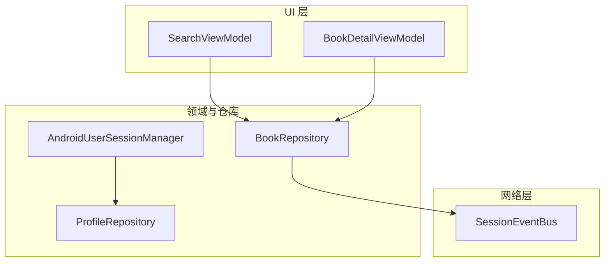
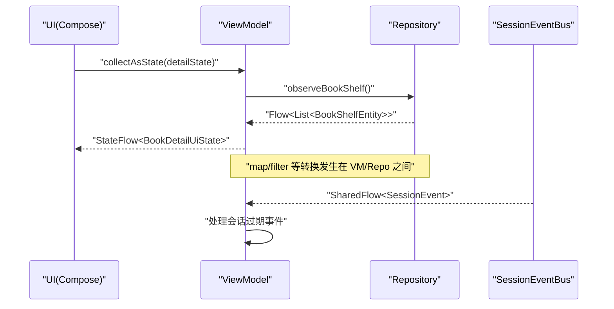
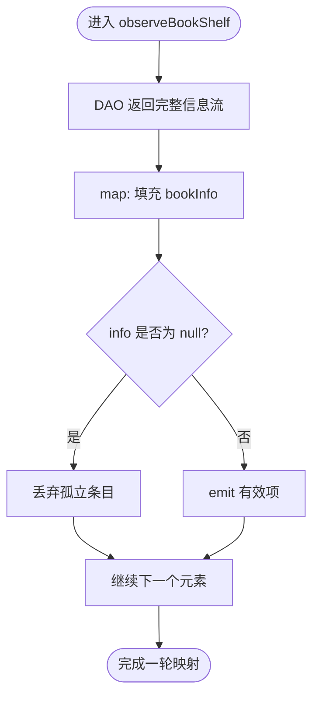
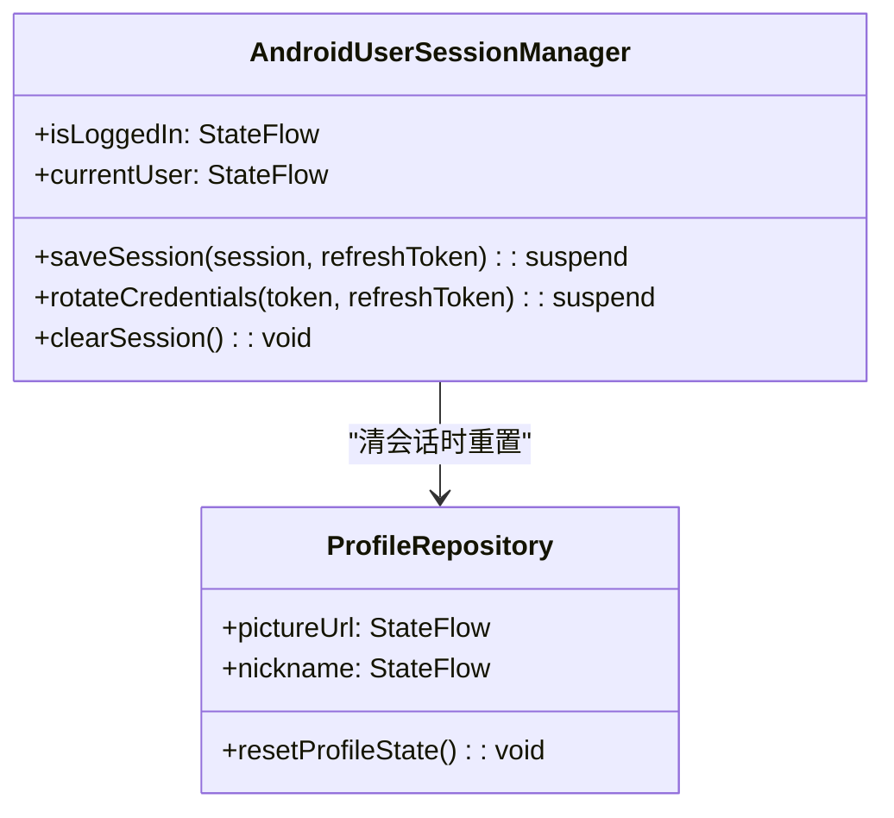
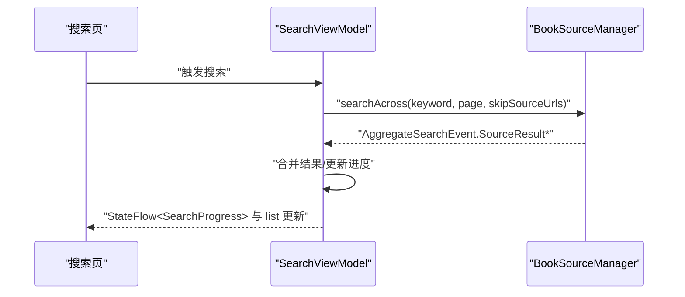
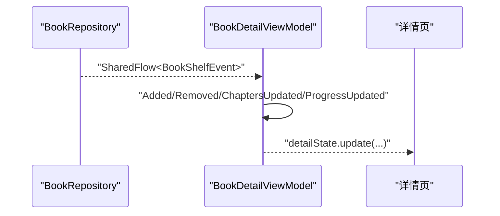
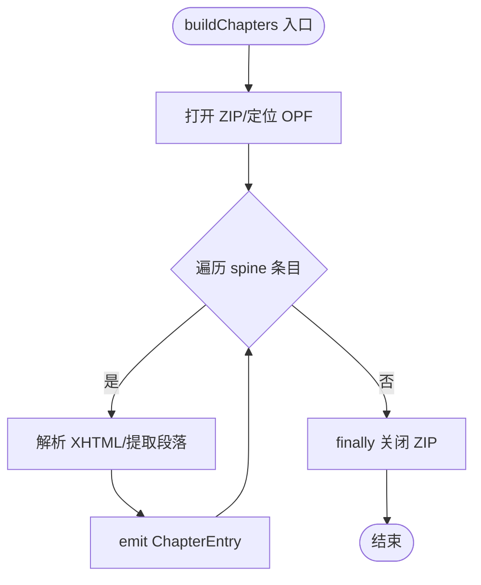
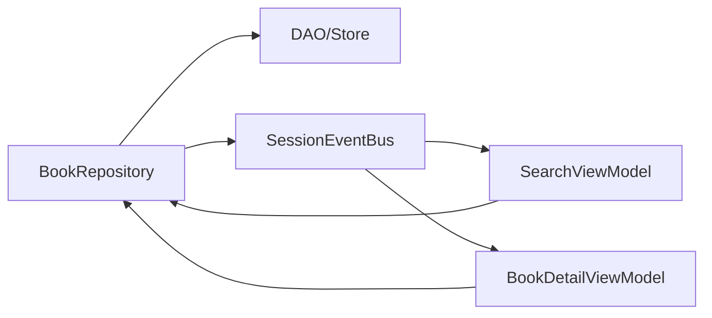

# Flow 操作符链与响应式数据处理

<cite>
**本文引用的文件**
- [BookRepository.kt](file://lib_book_common/src/main/java/com/ebook/common/repository/BookRepository.kt)
- [AndroidUserSessionManager.kt](file://lib_book_common/src/main/java/com/ebook/common/domain/AndroidUserSessionManager.kt)
- [ProfileRepository.kt](file://lib_book_common/src/main/java/com/ebook/common/repository/ProfileRepository.kt)
- [SessionEventBus.kt](file://lib_ebook_api/src/main/java/com/ebook/api/auth/SessionEventBus.kt)
- [SearchViewModel.kt](file://module_find/src/main/java/com/ebook/find/mvvm/viewmodel/SearchViewModel.kt)
- [BookDetailViewModel.kt](file://module_book/src/main/java/com/ebook/book/mvvm/viewmodel/BookDetailViewModel.kt)
- [EpubSourceReader.kt](file://lib_book_common/src/main/java/com/ebook/common/analyzer/local/EpubSourceReader.kt)
- [BookRepositoryTest.kt](file://lib_book_common/src/test/java/com/ebook/common/repository/BookRepositoryTest.kt)
</cite>

## 目录
1. [引言](#引言)
2. [项目结构](#项目结构)
3. [核心组件](#核心组件)
4. [架构总览](#架构总览)
5. [详细组件分析](#详细组件分析)
6. [依赖关系分析](#依赖关系分析)
7. [性能考量](#性能考量)
8. [故障排查指南](#故障排查指南)
9. [结论](#结论)
10. [附录：操作符实践清单](#附录操作符实践清单)

## 引言
本文件聚焦仓库中基于 Kotlin Coroutines Flow 的响应式数据处理范式，围绕以下目标展开：
- 梳理 Flow 冷流特性、背压与异常传播在工程中的落地方式
- 说明 StateFlow 作为状态容器（初始值、更新、内存管理）的使用
- 阐述 SharedFlow 作为事件总线（分发、订阅、缓冲策略）的实践
- 总结 map、filter、combine、zip、merge 等操作符在本仓的使用场景与取舍
- 给出性能优化技巧（调度器切换、缓冲、避免中间集合等）
- 提供测试策略与调试技巧

## 项目结构
本项目采用多模块 MVVM 架构，业务层广泛使用 Flow 表达数据流与状态：
- Repository 层通过 Flow 暴露可观察的数据集与事件流
- ViewModel 层组合多个 Flow，驱动 UI 状态
- Domain 层用 StateFlow 封装用户会话等进程内状态
- 网络层通过 SharedFlow 广播全局会话事件

图表来源
- [SearchViewModel.kt:56-127](file://module_find/src/main/java/com/ebook/find/mvvm/viewmodel/SearchViewModel.kt#L56-L127)
- [BookDetailViewModel.kt:52-120](file://module_book/src/main/java/com/ebook/book/mvvm/viewmodel/BookDetailViewModel.kt#L52-L120)
- [BookRepository.kt:75-100](file://lib_book_common/src/main/java/com/ebook/common/repository/BookRepository.kt#L75-L100)
- [AndroidUserSessionManager.kt:28-52](file://lib_book_common/src/main/java/com/ebook/common/domain/AndroidUserSessionManager.kt#L28-L52)
- [SessionEventBus.kt:30-44](file://lib_ebook_api/src/main/java/com/ebook/api/auth/SessionEventBus.kt#L30-L44)

章节来源
- [SearchViewModel.kt:56-127](file://module_find/src/main/java/com/ebook/find/mvvm/viewmodel/SearchViewModel.kt#L56-L127)
- [BookDetailViewModel.kt:52-120](file://module_book/src/main/java/com/ebook/book/mvvm/viewmodel/BookDetailViewModel.kt#L52-L120)
- [BookRepository.kt:75-100](file://lib_book_common/src/main/java/com/ebook/common/repository/BookRepository.kt#L75-L100)
- [AndroidUserSessionManager.kt:28-52](file://lib_book_common/src/main/java/com/ebook/common/domain/AndroidUserSessionManager.kt#L28-L52)
- [SessionEventBus.kt:30-44](file://lib_ebook_api/src/main/java/com/ebook/api/auth/SessionEventBus.kt#L30-L44)

## 核心组件
- BookRepository：书架数据仓库，提供 Flow 化的书架列表观察与书源事件发布（SharedFlow）
- AndroidUserSessionManager：用户会话管理器，以 StateFlow 暴露登录态与当前用户，负责持久化与内存态同步
- ProfileRepository：个人资料仓库，维护昵称/头像的 StateFlow，并支持重置
- SessionEventBus：会话级全局事件总线，以 SharedFlow 发射“会话过期”等事件
- SearchViewModel / BookDetailViewModel：消费仓库 Flow，组合状态并与 UI 交互

章节来源
- [BookRepository.kt:75-100](file://lib_book_common/src/main/java/com/ebook/common/repository/BookRepository.kt#L75-L100)
- [AndroidUserSessionManager.kt:28-52](file://lib_book_common/src/main/java/com/ebook/common/domain/AndroidUserSessionManager.kt#L28-L52)
- [ProfileRepository.kt:19-54](file://lib_book_common/src/main/java/com/ebook/common/repository/ProfileRepository.kt#L19-L54)
- [SessionEventBus.kt:30-44](file://lib_ebook_api/src/main/java/com/ebook/api/auth/SessionEventBus.kt#L30-L44)
- [SearchViewModel.kt:56-127](file://module_find/src/main/java/com/ebook/find/mvvm/viewmodel/SearchViewModel.kt#L56-L127)
- [BookDetailViewModel.kt:52-120](file://module_book/src/main/java/com/ebook/book/mvvm/viewmodel/BookDetailViewModel.kt#L52-L120)

## 架构总览
下图展示“数据到状态”的端到端流程：仓库暴露 Flow，ViewModel 收集并转换为 UI StateFlow；事件通过 SharedFlow 跨层广播。

图表来源
- [BookRepository.kt:93-100](file://lib_book_common/src/main/java/com/ebook/common/repository/BookRepository.kt#L93-L100)
- [BookDetailViewModel.kt:61-120](file://module_book/src/main/java/com/ebook/book/mvvm/viewmodel/BookDetailViewModel.kt#L61-L120)
- [SessionEventBus.kt:30-44](file://lib_ebook_api/src/main/java/com/ebook/api/auth/SessionEventBus.kt#L30-L44)

## 详细组件分析

### BookRepository：数据流与事件总线
- 使用 MutableSharedFlow 暴露书架事件流，设置 extraBufferCapacity 以避免阻塞
- 提供 observeBookShelf() 返回 Flow，内部对 DAO 流进行 map 过滤，保证下游拿到非空信息
- 职责清晰：数据读取、关联填充、事件发布分离

图表来源
- [BookRepository.kt:93-100](file://lib_book_common/src/main/java/com/ebook/common/repository/BookRepository.kt#L93-L100)

章节来源
- [BookRepository.kt:75-100](file://lib_book_common/src/main/java/com/ebook/common/repository/BookRepository.kt#L75-L100)

### AndroidUserSessionManager：StateFlow 状态容器
- 使用 MutableStateFlow 暴露 isLoggedIn 与 currentUser，冷启动时从 SP 恢复
- 登录/登出时同步 TokenHolder，确保拦截器能取到最新 token
- clearSession 一次性清理三处镜像（内存、SP、ProfileRepository），避免状态不一致

图表来源
- [AndroidUserSessionManager.kt:28-52](file://lib_book_common/src/main/java/com/ebook/common/domain/AndroidUserSessionManager.kt#L28-L52)
- [ProfileRepository.kt:19-54](file://lib_book_common/src/main/java/com/ebook/common/repository/ProfileRepository.kt#L19-L54)

章节来源
- [AndroidUserSessionManager.kt:28-52](file://lib_book_common/src/main/java/com/ebook/common/domain/AndroidUserSessionManager.kt#L28-L52)
- [ProfileRepository.kt:19-54](file://lib_book_common/src/main/java/com/ebook/common/repository/ProfileRepository.kt#L19-L54)

### SearchViewModel：聚合搜索与进度流
- 使用 StateFlow 暴露 searchProgress，配合 UI 显示“已收到 X/Y 结果”
- 使用 MutableSharedFlow 缓存历史查询成功事件，extraBufferCapacity=1 去重
- 聚合搜索过程中对每源独立翻页，避免并发交错导致的状态污染

图表来源
- [SearchViewModel.kt:56-127](file://module_find/src/main/java/com/ebook/find/mvvm/viewmodel/SearchViewModel.kt#L56-L127)

章节来源
- [SearchViewModel.kt:56-127](file://module_find/src/main/java/com/ebook/find/mvvm/viewmodel/SearchViewModel.kt#L56-L127)

### BookDetailViewModel：事件消费与状态更新
- 在 init 中收集 BookRepository.bookShelfEvents，根据事件类型更新 UI 状态或导航
- 将书架变化收敛到 VM 内部，避免 Activity 侧重复收集导致的重复添加

图表来源
- [BookDetailViewModel.kt:61-120](file://module_book/src/main/java/com/ebook/book/mvvm/viewmodel/BookDetailViewModel.kt#L61-L120)
- [BookRepository.kt:75-78](file://lib_book_common/src/main/java/com/ebook/common/repository/BookRepository.kt#L75-L78)

章节来源
- [BookDetailViewModel.kt:61-120](file://module_book/src/main/java/com/ebook/book/mvvm/viewmodel/BookDetailViewModel.kt#L61-L120)
- [BookRepository.kt:75-78](file://lib_book_common/src/main/java/com/ebook/common/repository/BookRepository.kt#L75-L78)

### EpubSourceReader：Flow 流式解析
- buildChapters 使用 flow { ... emit(...) } 逐章输出，避免一次性构建大集合
- 在 finally 中关闭 ZipFile，保证资源释放

图表来源
- [EpubSourceReader.kt:35-69](file://lib_book_common/src/main/java/com/ebook/common/analyzer/local/EpubSourceReader.kt#L35-L69)

章节来源
- [EpubSourceReader.kt:35-69](file://lib_book_common/src/main/java/com/ebook/common/analyzer/local/EpubSourceReader.kt#L35-L69)

## 依赖关系分析
- Repository 依赖 DAO 与 Store，并通过 SharedFlow 对外发布事件
- ViewModel 依赖 Repository，组合其 Flow 并维护 UI StateFlow
- 网络层通过 SessionEventBus 广播会话事件，上层订阅后统一处置

图表来源
- [BookRepository.kt:75-100](file://lib_book_common/src/main/java/com/ebook/common/repository/BookRepository.kt#L75-L100)
- [SearchViewModel.kt:56-127](file://module_find/src/main/java/com/ebook/find/mvvm/viewmodel/SearchViewModel.kt#L56-L127)
- [BookDetailViewModel.kt:61-120](file://module_book/src/main/java/com/ebook/book/mvvm/viewmodel/BookDetailViewModel.kt#L61-L120)
- [SessionEventBus.kt:30-44](file://lib_ebook_api/src/main/java/com/ebook/api/auth/SessionEventBus.kt#L30-L44)

章节来源
- [BookRepository.kt:75-100](file://lib_book_common/src/main/java/com/ebook/common/repository/BookRepository.kt#L75-L100)
- [SearchViewModel.kt:56-127](file://module_find/src/main/java/com/ebook/find/mvvm/viewmodel/SearchViewModel.kt#L56-L127)
- [BookDetailViewModel.kt:61-120](file://module_book/src/main/java/com/ebook/book/mvvm/viewmodel/BookDetailViewModel.kt#L61-L120)
- [SessionEventBus.kt:30-44](file://lib_ebook_api/src/main/java/com/ebook/api/auth/SessionEventBus.kt#L30-L44)

## 性能考量
- 背压与缓冲
  - SharedFlow 使用 extraBufferCapacity=1，避免事件风暴阻塞请求线程，同时允许丢弃重复事件（如会话过期）
  - 对于高频 UI 状态，优先使用 StateFlow，减少不必要的中间集合
- 调度器切换
  - 在 Repository 中使用 withContext(Dispatchers.IO) 执行 IO 任务，保持主线程流畅
- 避免中间集合
  - 使用 flow 流式 emit（如 EPUB 解析）替代一次性构建 List，降低峰值内存
- 合理组合操作符
  - 使用 map/filter 做轻量转换与过滤，尽量靠近数据源
  - 需要聚合时使用 combine/zip/merge，但要注意背压与取消语义

章节来源
- [BookRepository.kt:82-100](file://lib_book_common/src/main/java/com/ebook/common/repository/BookRepository.kt#L82-L100)
- [EpubSourceReader.kt:35-69](file://lib_book_common/src/main/java/com/ebook/common/analyzer/local/EpubSourceReader.kt#L35-L69)
- [SessionEventBus.kt:30-44](file://lib_ebook_api/src/main/java/com/ebook/api/auth/SessionEventBus.kt#L30-L44)

## 故障排查指南
- 共享事件未生效
  - 检查 SharedFlow 是否被正确 asSharedFlow 暴露，且订阅方在合适生命周期收集
- 状态不同步
  - 确认 StateFlow 的初始值是否正确，并在关键路径（如登录/登出）同步所有镜像
- 背压导致卡顿
  - 检查 SharedFlow 缓冲策略，必要时调整 extraBufferCapacity 或使用 tryEmit
- 资源泄漏
  - 确保 flow 中打开的资源（如 ZIP）在 finally 中关闭

章节来源
- [BookRepository.kt:75-78](file://lib_book_common/src/main/java/com/ebook/common/repository/BookRepository.kt#L75-L78)
- [AndroidUserSessionManager.kt:100-133](file://lib_book_common/src/main/java/com/ebook/common/domain/AndroidUserSessionManager.kt#L100-L133)
- [SessionEventBus.kt:30-44](file://lib_ebook_api/src/main/java/com/ebook/api/auth/SessionEventBus.kt#L30-L44)
- [EpubSourceReader.kt:35-69](file://lib_book_common/src/main/java/com/ebook/common/analyzer/local/EpubSourceReader.kt#L35-L69)

## 结论
本项目以 Flow 为核心构建了清晰的响应式数据流：
- Repository 提供可观察的数据与事件流
- ViewModel 组合状态并驱动 UI
- Domain 层通过 StateFlow 管理进程内状态
- 网络层通过 SharedFlow 广播全局事件
结合合理的背压策略、调度器切换与流式处理，项目在功能与性能上取得平衡。后续可在更多场景中引入 combine/zip/merge 等高级操作符，进一步提升数据管道表达能力。

## 附录：操作符实践清单
- map：用于字段填充、格式转换（如 observeBookShelf 中对 fullInfo 的处理）
- filter：过滤无效数据（如移除 info 为空的条目）
- combine/zip：用于多源结果聚合（参考 SearchViewModel 的聚合搜索逻辑）
- merge：用于合并多个事件流（如书架事件与其他通知）
- buffer：在高吞吐场景下控制背压（如 SharedFlow 的 extraBufferCapacity）
- flowOn：将耗时操作切换到 IO 调度器（如 Repository 中的 withContext）
- 避免中间集合：使用 flow{ emit(...) } 流式处理大对象（如 EPUB 解析）

章节来源
- [BookRepository.kt:93-100](file://lib_book_common/src/main/java/com/ebook/common/repository/BookRepository.kt#L93-L100)
- [SearchViewModel.kt:56-127](file://module_find/src/main/java/com/ebook/find/mvvm/viewmodel/SearchViewModel.kt#L56-L127)
- [EpubSourceReader.kt:35-69](file://lib_book_common/src/main/java/com/ebook/common/analyzer/local/EpubSourceReader.kt#L35-L69)
- [BookRepositoryTest.kt:35-50](file://lib_book_common/src/test/java/com/ebook/common/repository/BookRepositoryTest.kt#L35-L50)