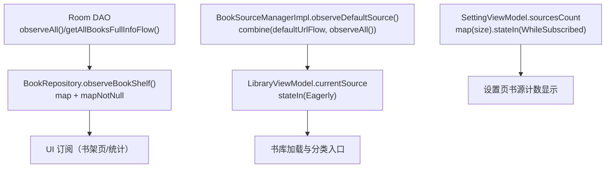
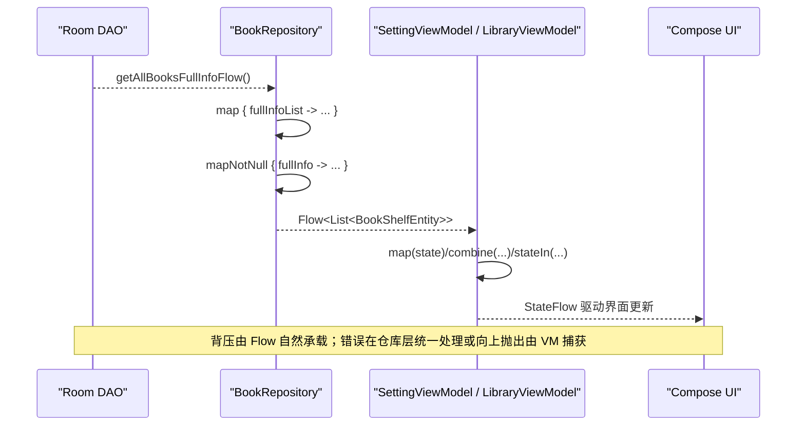
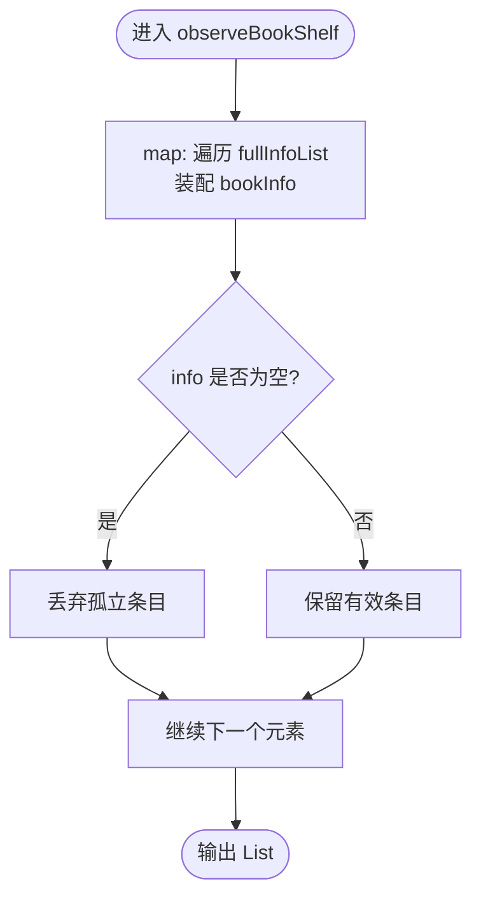
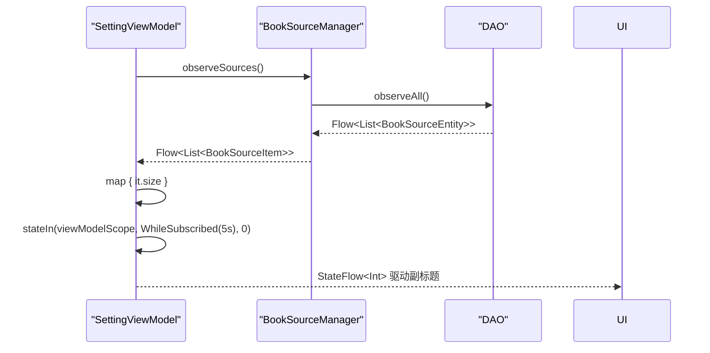
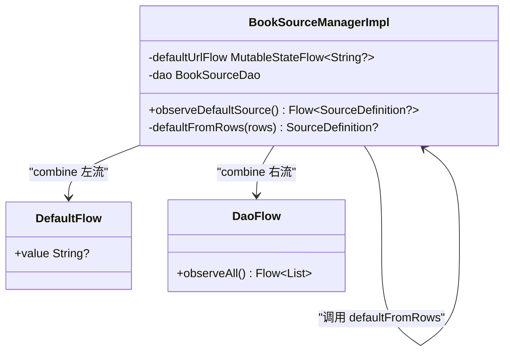
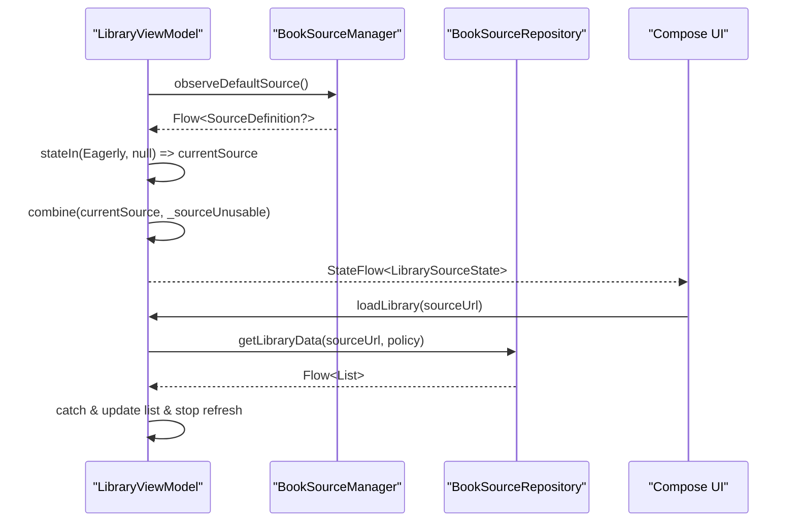
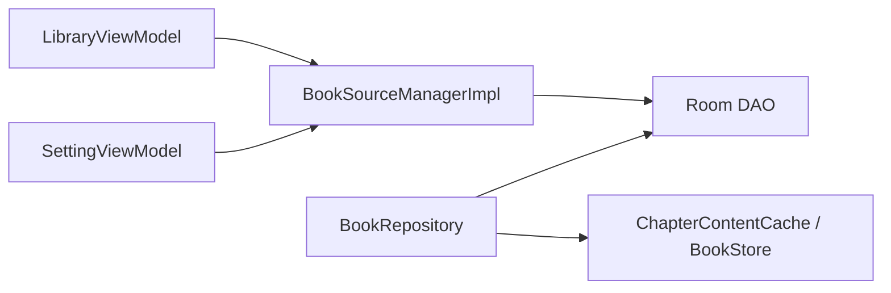

# Flow 操作符链设计与数据转换模式

<cite>
**本文引用的文件**
- [lib_book_common/src/main/java/com/ebook/common/repository/BookRepository.kt](file://lib_book_common/src/main/java/com/ebook/common/repository/BookRepository.kt)
- [module_me/src/main/java/com/ebook/me/mvvm/viewmodel/SettingViewModel.kt](file://module_me/src/main/java/com/ebook/me/mvvm/viewmodel/SettingViewModel.kt)
- [lib_book_common/src/main/java/com/ebook/common/analyze/source/BookSourceManagerImpl.kt](file://lib_book_common/src/main/java/com/ebook/common/analyze/source/BookSourceManagerImpl.kt)
- [module_find/src/main/java/com/ebook/find/mvvm/viewmodel/LibraryViewModel.kt](file://module_find/src/main/java/com/ebook/find/mvvm/viewmodel/LibraryViewModel.kt)
</cite>

## 目录
1. [引言](#引言)
2. [项目结构](#项目结构)
3. [核心组件](#核心组件)
4. [架构总览](#架构总览)
5. [详细组件分析](#详细组件分析)
6. [依赖关系分析](#依赖关系分析)
7. [性能考虑](#性能考虑)
8. [故障排查指南](#故障排查指南)
9. [结论](#结论)
10. [附录](#附录)

## 引言
本文件聚焦于项目中基于 Kotlin Coroutines Flow 的响应式数据流与操作符链设计，围绕以下目标展开：
- 解释 map、filter、mapNotNull、combine、stateIn 等操作符在本项目的具体使用场景与最佳实践。
- 深入剖析 BookRepository.observeBookShelf() 中 observeBookShelf() 的响应式数据流：从 Room Flow 到业务数据的转换链。
- 阐述 SettingViewModel.sourcesCount 中 map 与 stateIn 的组合：将冷流转换为热流并设置初始值。
- 提供常见数据转换模式的代码片段路径（以来源标注代替直接贴出源码）。
- 总结 Flow 背压机制与错误传播策略在工程中的落地方式。
- 给出性能优化建议：操作符顺序、避免中间集合、withContext 调度器选择等。

## 项目结构
本项目采用多模块架构，Flow 相关的关键实现分布在“仓库层”和“视图模型层”：
- 仓库层（lib_book_common）：BookRepository 封装书架 CRUD、事件发布与章节正文读取；其中 observeBookShelf() 暴露响应式书架列表。
- 视图模型层（module_me、module_find）：SettingViewModel、LibraryViewModel 通过 combine/map/stateIn 组合多个源，形成 UI 状态流。
- 书源管理（lib_book_common）：BookSourceManagerImpl 用 combine 将默认源切换信号与清单变化合并，驱动书城默认源流。

图表来源
- [lib_book_common/src/main/java/com/ebook/common/repository/BookRepository.kt:93-100](file://lib_book_common/src/main/java/com/ebook/common/repository/BookRepository.kt#L93-L100)
- [lib_book_common/src/main/java/com/ebook/common/analyze/source/BookSourceManagerImpl.kt:849-851](file://lib_book_common/src/main/java/com/ebook/common/analyze/source/BookSourceManagerImpl.kt#L849-L851)
- [module_find/src/main/java/com/ebook/find/mvvm/viewmodel/LibraryViewModel.kt:139-140](file://module_find/src/main/java/com/ebook/find/mvvm/viewmodel/LibraryViewModel.kt#L139-L140)
- [module_me/src/main/java/com/ebook/me/mvvm/viewmodel/SettingViewModel.kt:155-161](file://module_me/src/main/java/com/ebook/me/mvvm/viewmodel/SettingViewModel.kt#L155-L161)

章节来源
- [lib_book_common/src/main/java/com/ebook/common/repository/BookRepository.kt:81-100](file://lib_book_common/src/main/java/com/ebook/common/repository/BookRepository.kt#L81-L100)
- [lib_book_common/src/main/java/com/ebook/common/analyze/source/BookSourceManagerImpl.kt:823-851](file://lib_book_common/src/main/java/com/ebook/common/analyze/source/BookSourceManagerImpl.kt#L823-L851)
- [module_find/src/main/java/com/ebook/find/mvvm/viewmodel/LibraryViewModel.kt:123-167](file://module_find/src/main/java/com/ebook/find/mvvm/viewmodel/LibraryViewModel.kt#L123-L167)
- [module_me/src/main/java/com/ebook/me/mvvm/viewmodel/SettingViewModel.kt:141-161](file://module_me/src/main/java/com/ebook/me/mvvm/viewmodel/SettingViewModel.kt#L141-L161)

## 核心组件
- BookRepository.observeBookShelf(): 返回 Flow<List<BookShelfEntity>>，基于 Room 的全量信息流，经 mapNotNull 过滤孤立条目并装配 bookInfo，保证下游始终拿到完整书籍数据。
- SettingViewModel.sourcesCount: 将冷流（observeSources）通过 map 计算条数后，用 stateIn(WhileSubscribed) 转为热流并设置初始值 0，避免页面长期驻栈时持续监听。
- BookSourceManagerImpl.observeDefaultSource(): 使用 combine 合并 defaultUrlFlow 与 dao.observeAll()，在任意一方变化时重新计算默认源定义。
- LibraryViewModel.sourceState: 使用 combine(currentSource, _sourceUnusable) 合成页面展示态，并用 stateIn(Eagerly) 首帧即热，确保主 Tab 首次渲染就有可用状态。

章节来源
- [lib_book_common/src/main/java/com/ebook/common/repository/BookRepository.kt:93-100](file://lib_book_common/src/main/java/com/ebook/common/repository/BookRepository.kt#L93-L100)
- [module_me/src/main/java/com/ebook/me/mvvm/viewmodel/SettingViewModel.kt:155-161](file://module_me/src/main/java/com/ebook/me/mvvm/viewmodel/SettingViewModel.kt#L155-L161)
- [lib_book_common/src/main/java/com/ebook/common/analyze/source/BookSourceManagerImpl.kt:849-851](file://lib_book_common/src/main/java/com/ebook/common/analyze/source/BookSourceManagerImpl.kt#L849-L851)
- [module_find/src/main/java/com/ebook/find/mvvm/viewmodel/LibraryViewModel.kt:159-167](file://module_find/src/main/java/com/ebook/find/mvvm/viewmodel/LibraryViewModel.kt#L159-L167)

## 架构总览
下图展示了“数据源 → 仓库/管理器 → ViewModel → UI”的响应式链路，以及关键操作符链的位置。

图表来源
- [lib_book_common/src/main/java/com/ebook/common/repository/BookRepository.kt:93-100](file://lib_book_common/src/main/java/com/ebook/common/repository/BookRepository.kt#L93-L100)
- [module_me/src/main/java/com/ebook/me/mvvm/viewmodel/SettingViewModel.kt:155-161](file://module_me/src/main/java/com/ebook/me/mvvm/viewmodel/SettingViewModel.kt#L155-L161)
- [module_find/src/main/java/com/ebook/find/mvvm/viewmodel/LibraryViewModel.kt:159-167](file://module_find/src/main/java/com/ebook/find/mvvm/viewmodel/LibraryViewModel.kt#L159-L167)

## 详细组件分析

### BookRepository.observeBookShelf() 数据转换链
- 数据来源：Room 提供的全量书架信息流（包含关联数据），每次变更触发重算。
- 转换逻辑：
  - map: 遍历 fullInfoList，为每个条目装配 bookInfo。
  - mapNotNull: 过滤 info 为 null 的孤立条目，保证下游数据一致性。
- 性能要点：
  - 仅在收集时进行内存映射，无额外中间集合创建（使用标准库高阶函数惰性求值）。
  - 不执行写操作，避免副作用导致的频繁失效。
- 错误传播：
  - Room 流若抛错会向上传播至订阅端；仓库层未吞异常，便于上层决定重试或降级。

图表来源
- [lib_book_common/src/main/java/com/ebook/common/repository/BookRepository.kt:93-100](file://lib_book_common/src/main/java/com/ebook/common/repository/BookRepository.kt#L93-L100)

章节来源
- [lib_book_common/src/main/java/com/ebook/common/repository/BookRepository.kt:86-100](file://lib_book_common/src/main/java/com/ebook/common/repository/BookRepository.kt#L86-L100)

### SettingViewModel.sourcesCount：冷流转热流与初始值
- 冷流来源：bookSourceManager.observeSources()，收集时才查询数据库。
- 转换链：
  - map: 将 BookSourceItem 列表映射为 size（整数）。
  - stateIn: 指定 scope=viewModelScope、started=WhileSubscribed(5s)、initialValue=0，将冷流转为热流，并在无订阅者时释放资源。
- 适用场景：设置页可能长期驻留后台，需避免常驻监听；同时首帧有明确占位值（0），提升用户体验。
- 性能要点：
  - WhileSubscribed 控制生命周期，减少不必要监听。
  - 仅计算数量，避免携带多余元数据。

图表来源
- [module_me/src/main/java/com/ebook/me/mvvm/viewmodel/SettingViewModel.kt:155-161](file://module_me/src/main/java/com/ebook/me/mvvm/viewmodel/SettingViewModel.kt#L155-L161)
- [lib_book_common/src/main/java/com/ebook/common/analyze/source/BookSourceManagerImpl.kt:834-836](file://lib_book_common/src/main/java/com/ebook/common/analyze/source/BookSourceManagerImpl.kt#L834-L836)

章节来源
- [module_me/src/main/java/com/ebook/me/mvvm/viewmodel/SettingViewModel.kt:141-161](file://module_me/src/main/java/com/ebook/me/mvvm/viewmodel/SettingViewModel.kt#L141-L161)

### BookSourceManagerImpl.observeDefaultSource：combine 的多流合并
- 合并源：
  - defaultUrlFlow：本次会话默认源切换信号（SP 写入时推送）。
  - dao.observeAll()：书源清单变化（增删改启用状态）。
- 计算逻辑：defaultFromRows(rows) 根据 SP 命中与启用状态选出当前默认源定义。
- 调度：flowOn(Dispatchers.IO)，确保 IO 密集型操作不在主线程。
- 优势：任一输入变化均能正确重算默认源，保持订阅面与写路径口径一致。

图表来源
- [lib_book_common/src/main/java/com/ebook/common/analyze/source/BookSourceManagerImpl.kt:849-851](file://lib_book_common/src/main/java/com/ebook/common/analyze/source/BookSourceManagerImpl.kt#L849-L851)
- [lib_book_common/src/main/java/com/ebook/common/analyze/source/BookSourceManagerImpl.kt:207-214](file://lib_book_common/src/main/java/com/ebook/common/analyze/source/BookSourceManagerImpl.kt#L207-L214)

章节来源
- [lib_book_common/src/main/java/com/ebook/common/analyze/source/BookSourceManagerImpl.kt:823-851](file://lib_book_common/src/main/java/com/ebook/common/analyze/source/BookSourceManagerImpl.kt#L823-L851)

### LibraryViewModel.sourceState：combine 合成页面态
- 合并源：
  - currentSource：当前默认源（null 表示尚无结论）。
  - _sourceUnusable：标记当前源是否解析失败（由 BookSourceNotFoundException 置位）。
- 计算逻辑：librarySourceStateOf(source, unusable) 返回 Ready/NoSource/BrokenSource。
- 热流化：stateIn(viewModelScope, SharingStarted.Eagerly, Unknown)，确保首帧即有状态，避免误导文案。
- 错误传播：加载失败时置位不可用标志，页面据此引导用户换源或重导。

图表来源
- [module_find/src/main/java/com/ebook/find/mvvm/viewmodel/LibraryViewModel.kt:139-167](file://module_find/src/main/java/com/ebook/find/mvvm/viewmodel/LibraryViewModel.kt#L139-L167)
- [module_find/src/main/java/com/ebook/find/mvvm/viewmodel/LibraryViewModel.kt:239-289](file://module_find/src/main/java/com/ebook/find/mvvm/viewmodel/LibraryViewModel.kt#L239-L289)

章节来源
- [module_find/src/main/java/com/ebook/find/mvvm/viewmodel/LibraryViewModel.kt:123-167](file://module_find/src/main/java/com/ebook/find/mvvm/viewmodel/LibraryViewModel.kt#L123-L167)
- [module_find/src/main/java/com/ebook/find/mvvm/viewmodel/LibraryViewModel.kt:239-289](file://module_find/src/main/java/com/ebook/find/mvvm/viewmodel/LibraryViewModel.kt#L239-L289)

## 依赖关系分析
- BookRepository 依赖 Room DAO 与书源解析、存储缓存等组件，但 observeBookShelf 仅关注数据装配与过滤，耦合度低。
- SettingViewModel 与 BookSourceManagerImpl 解耦：前者只消费 Flow，后者负责规则与解析器的组装。
- LibraryViewModel 通过 combine 将“当前源”和“可用性标记”合成单一状态，降低 UI 判据复杂度。

图表来源
- [lib_book_common/src/main/java/com/ebook/common/repository/BookRepository.kt:52-74](file://lib_book_common/src/main/java/com/ebook/common/repository/BookRepository.kt#L52-L74)
- [lib_book_common/src/main/java/com/ebook/common/analyze/source/BookSourceManagerImpl.kt:85-119](file://lib_book_common/src/main/java/com/ebook/common/analyze/source/BookSourceManagerImpl.kt#L85-L119)

章节来源
- [lib_book_common/src/main/java/com/ebook/common/repository/BookRepository.kt:52-74](file://lib_book_common/src/main/java/com/ebook/common/repository/BookRepository.kt#L52-L74)
- [lib_book_common/src/main/java/com/ebook/common/analyze/source/BookSourceManagerImpl.kt:85-119](file://lib_book_common/src/main/java/com/ebook/common/analyze/source/BookSourceManagerImpl.kt#L85-L119)

## 性能考虑
- 操作符顺序与惰性求值：
  - mapNotNull 放在 map 之后，先装配再过滤，减少无效对象传递。
  - 使用标准库高阶函数避免显式创建中间集合。
- 冷热流选择：
  - 冷流（observeSources）只在需要时查库；热流（stateIn）用于 UI 稳定消费，配合 WhileSubscribed/Eagerly 控制生命周期。
- 调度器：
  - flowOn(Dispatchers.IO) 将 IO 密集型操作移出主线程；withContext(Dispatchers.IO) 用于阻塞型读写（如 DAO 插入/删除）。
- 背压与取消：
  - Flow 天然支持背压；ViewModel 作用域取消可中断长时间任务（如检查更新、书库加载）。
- 避免重复计算：
  - combine 的 lambda 纯函数化（如 librarySourceStateOf），便于单测验证且无副作用。

[本节为通用指导，无需特定文件引用]

## 故障排查指南
- 书架页数据为空：
  - 检查 Room 流是否正常发出；确认 mapNotNull 是否正确过滤孤立条目。
  - 参考：[BookRepository.observeBookShelf](file://lib_book_common/src/main/java/com/ebook/common/repository/BookRepository.kt#L93-L100)
- 设置页书源计数不更新：
  - 确认 observeSources 是否被收集；检查 stateIn 的 started 策略与 initialValue。
  - 参考：[SettingViewModel.sourcesCount](file://module_me/src/main/java/com/ebook/me/mvvm/viewmodel/SettingViewModel.kt#L155-L161)
- 书城首帧显示误导文案：
  - 确认 sourceState 初始值为 Unknown，避免将“未知”误判为“无源”。
  - 参考：[LibraryViewModel.sourceState](file://module_find/src/main/java/com/ebook/find/mvvm/viewmodel/LibraryViewModel.kt#L159-L167)
- 书源解析失败：
  - 检查 BookSourceNotFoundException 是否被捕获并置位 _sourceUnusable；确认 UI 提示与自愈路径。
  - 参考：[LibraryViewModel.loadLibrary](file://module_find/src/main/java/com/ebook/find/mvvm/viewmodel/LibraryViewModel.kt#L239-L289)

章节来源
- [lib_book_common/src/main/java/com/ebook/common/repository/BookRepository.kt:93-100](file://lib_book_common/src/main/java/com/ebook/common/repository/BookRepository.kt#L93-L100)
- [module_me/src/main/java/com/ebook/me/mvvm/viewmodel/SettingViewModel.kt:155-161](file://module_me/src/main/java/com/ebook/me/mvvm/viewmodel/SettingViewModel.kt#L155-L161)
- [module_find/src/main/java/com/ebook/find/mvvm/viewmodel/LibraryViewModel.kt:159-167](file://module_find/src/main/java/com/ebook/find/mvvm/viewmodel/LibraryViewModel.kt#L159-L167)
- [module_find/src/main/java/com/ebook/find/mvvm/viewmodel/LibraryViewModel.kt:239-289](file://module_find/src/main/java/com/ebook/find/mvvm/viewmodel/LibraryViewModel.kt#L239-L289)

## 结论
本项目在 Flow 操作符链设计上遵循清晰职责分离与高性能原则：
- 仓库层专注数据装配与过滤，ViewModel 层专注状态合成与生命周期管理。
- 通过 map/mapNotNull/filter/combine/stateIn 构建可维护、可测试的数据转换链。
- 合理使用冷热流与调度器，确保 UI 流畅性与资源占用可控。
- 错误传播策略明确，UI 能够给出用户可理解的反馈与自愈路径。

[本节为总结性内容，无需特定文件引用]

## 附录
- 常见数据转换模式与对应源码位置（以路径标注代替代码片段）：
  - 列表映射：map { it.size } → [SettingViewModel.sourcesCount](file://module_me/src/main/java/com/ebook/me/mvvm/viewmodel/SettingViewModel.kt#L155-L161)
  - 条件过滤：filter { it.rule.enabled } → [LibraryViewModel.sources](file://module_find/src/main/java/com/ebook/find/mvvm/viewmodel/LibraryViewModel.kt#L123-L125)
  - 空值处理：mapNotNull { fullInfo.info?.let { ... } } → [BookRepository.observeBookShelf](file://lib_book_common/src/main/java/com/ebook/common/repository/BookRepository.kt#L93-L100)
  - 状态提升：combine(currentSource, _sourceUnusable) → [LibraryViewModel.sourceState](file://module_find/src/main/java/com/ebook/find/mvvm/viewmodel/LibraryViewModel.kt#L159-L167)
  - 多流合并：combine(defaultUrlFlow, dao.observeAll()) → [BookSourceManagerImpl.observeDefaultSource](file://lib_book_common/src/main/java/com/ebook/common/analyze/source/BookSourceManagerImpl.kt#L849-L851)
  - 冷流转热流：stateIn(viewModelScope, WhileSubscribed(5s), 0) → [SettingViewModel.sourcesCount](file://module_me/src/main/java/com/ebook/me/mvvm/viewmodel/SettingViewModel.kt#L155-L161)

[本节为补充说明，无需特定文件引用]