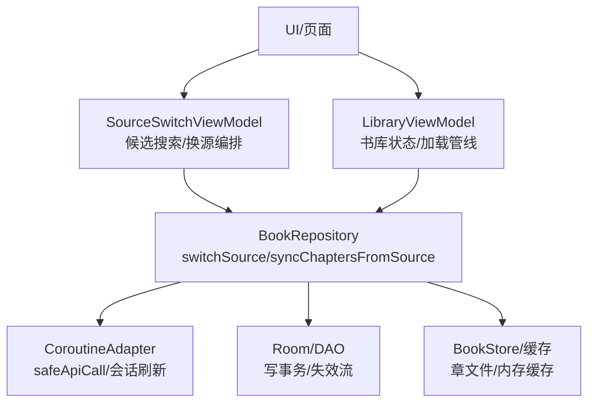
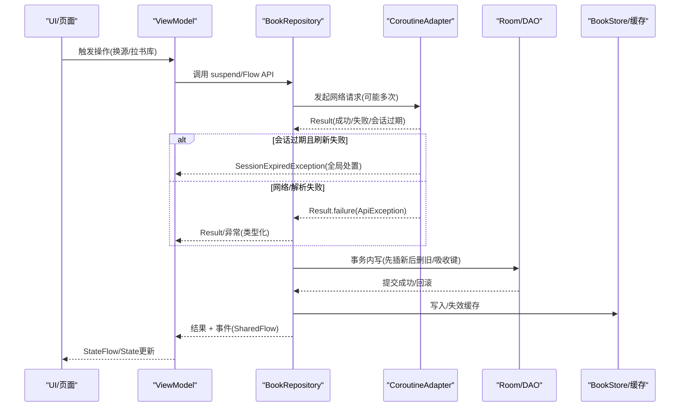
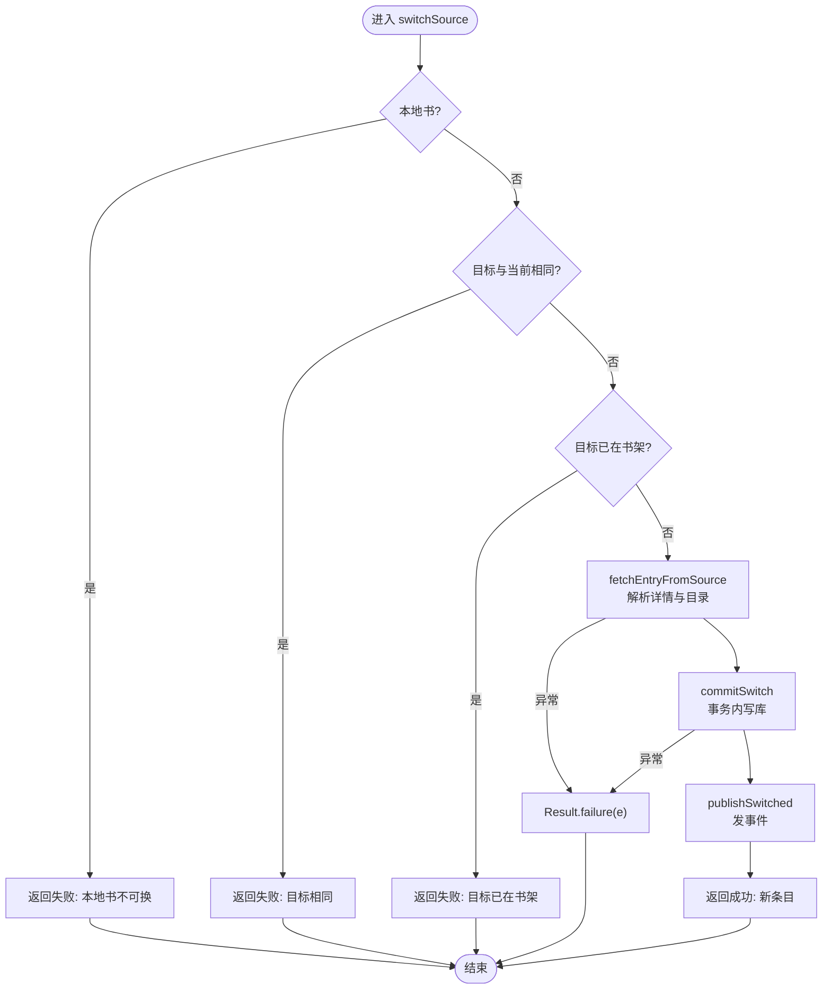
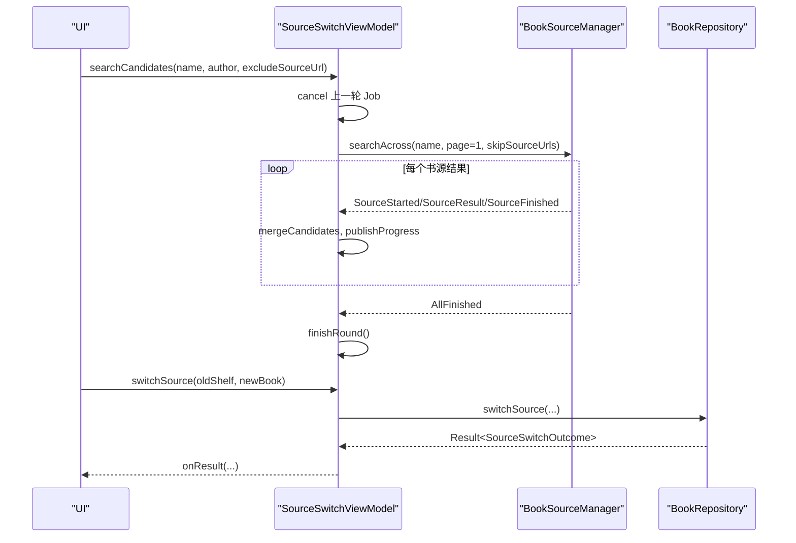
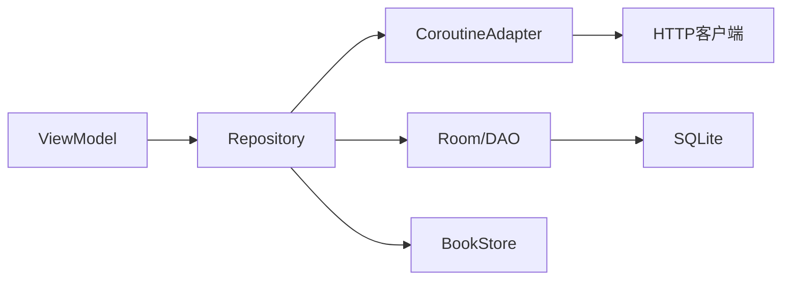

# Flow 背压处理与异常传播机制

<cite>
**本文引用的文件**
- [BookRepository.kt](file://lib_book_common/src/main/java/com/ebook/common/repository/BookRepository.kt)
- [SourceSwitchViewModel.kt](file://module_book/src/main/java/com/ebook/book/mvvm/viewmodel/SourceSwitchViewModel.kt)
- [LibraryViewModel.kt](file://module_find/src/main/java/com/ebook/find/mvvm/viewmodel/LibraryViewModel.kt)
- [CoroutineAdapter.kt](file://lib_ebook_api/src/main/java/com/ebook/api/utils/CoroutineAdapter.kt)
</cite>

## 目录
1. [简介](#简介)
2. [项目结构](#项目结构)
3. [核心组件](#核心组件)
4. [架构总览](#架构总览)
5. [详细组件分析](#详细组件分析)
6. [依赖关系分析](#依赖关系分析)
7. [性能考量](#性能考量)
8. [故障排查指南](#故障排查指南)
9. [结论](#结论)
10. [附录](#附录)

## 简介
本文件系统性梳理项目中 Kotlin Flow 的背压与异常传播机制，结合仓库中真实实现，覆盖冷流特性、不同操作符对背压的影响、错误捕获/恢复/优雅降级策略，以及复杂业务流程（如 switchSource、syncChaptersFromSource）中的异常分类与 Result 封装。同时给出 flowOn、catch、retry 的使用场景与性能影响，提供常见错误处理模式的实践建议与调试技巧，并解释 Flow 取消与协程取消传播行为。

## 项目结构
围绕 Flow 与异步流程的关键代码集中在以下模块：
- lib_book_common：仓库层 BookRepository，负责书架数据、换源事务、章节同步等核心流程，广泛使用 Flow、SharedFlow、withContext、Result 与类型化异常。
- module_book：阅读侧 ViewModel SourceSwitchViewModel，聚合搜索与换源流程，组合 StateFlow 展示候选与进度，并在 VM 层进行取消与错误传播。
- module_find：书城 LibraryViewModel，演示 combine/map/stateIn/catch 的组合式响应式管线，用于状态合成与错误兜底。
- lib_ebook_api：网络适配 CoroutineAdapter，统一 IO 线程切换、业务码转 Result、会话过期静默刷新与全局事件派发。

**图表来源**
- [BookRepository.kt:223-416](file://lib_book_common/src/main/java/com/ebook/common/repository/BookRepository.kt#L223-L416)
- [SourceSwitchViewModel.kt:117-177](file://module_book/src/main/java/com/ebook/book/mvvm/viewmodel/SourceSwitchViewModel.kt#L117-L177)
- [LibraryViewModel.kt:123-182](file://module_find/src/main/java/com/ebook/find/mvvm/viewmodel/LibraryViewModel.kt#L123-L182)
- [CoroutineAdapter.kt:41-120](file://lib_ebook_api/src/main/java/com/ebook/api/utils/CoroutineAdapter.kt#L41-L120)

**章节来源**
- [BookRepository.kt:223-416](file://lib_book_common/src/main/java/com/ebook/common/repository/BookRepository.kt#L223-L416)
- [SourceSwitchViewModel.kt:117-177](file://module_book/src/main/java/com/ebook/book/mvvm/viewmodel/SourceSwitchViewModel.kt#L117-L177)
- [LibraryViewModel.kt:123-182](file://module_find/src/main/java/com/ebook/find/mvvm/viewmodel/LibraryViewModel.kt#L123-L182)
- [CoroutineAdapter.kt:41-120](file://lib_ebook_api/src/main/java/com/ebook/api/utils/CoroutineAdapter.kt#L41-L120)

## 核心组件
- BookRepository：集中实现“阅读中换源”和“目录重抓追加”两大复杂流程，采用 Result 封装失败、类型化异常表达语义、SharedFlow 广播事件、事务边界严格控制；章节正文读取经 ChapterReader 路由、规范化与缓存。
- SourceSwitchViewModel：以 Flow 驱动聚合搜索，StateFlow 暴露候选、进度、失败原因；通过 Job 管理轮次取消，确保旧轮结果不污染新轮。
- LibraryViewModel：用 combine/map/stateIn/catch 构建书库状态管线，将“当前源是否可用”与“解析器是否可取”合并为页面级状态，异常在 VM 层捕获并转为 UI 友好态。
- CoroutineAdapter：网络请求的统一入口，IO 调度、业务码到 Result 转换、A0230 会话过期静默刷新与全局事件派发，保证上层调用方仅关注业务成功/失败。

**章节来源**
- [BookRepository.kt:223-416](file://lib_book_common/src/main/java/com/ebook/common/repository/BookRepository.kt#L223-L416)
- [SourceSwitchViewModel.kt:117-177](file://module_book/src/main/java/com/ebook/book/mvvm/viewmodel/SourceSwitchViewModel.kt#L117-L177)
- [LibraryViewModel.kt:123-182](file://module_find/src/main/java/com/ebook/find/mvvm/viewmodel/LibraryViewModel.kt#L123-L182)
- [CoroutineAdapter.kt:41-120](file://lib_ebook_api/src/main/java/com/ebook/api/utils/CoroutineAdapter.kt#L41-L120)

## 架构总览
下图展示了从 UI 到仓库、网络、数据库与存储的完整数据流与错误传播路径，体现 Flow 的冷流特性、背压与取消传播。

**图表来源**
- [BookRepository.kt:223-416](file://lib_book_common/src/main/java/com/ebook/common/repository/BookRepository.kt#L223-L416)
- [CoroutineAdapter.kt:41-120](file://lib_ebook_api/src/main/java/com/ebook/api/utils/CoroutineAdapter.kt#L41-L120)
- [SourceSwitchViewModel.kt:117-177](file://module_book/src/main/java/com/ebook/book/mvvm/viewmodel/SourceSwitchViewModel.kt#L117-L177)
- [LibraryViewModel.kt:123-182](file://module_find/src/main/java/com/ebook/find/mvvm/viewmodel/LibraryViewModel.kt#L123-L182)

## 详细组件分析

### BookRepository 的背压与异常传播
- 冷流与共享流
  - observeBookShelf 返回 Flow<List<BookShelfEntity>>，基于 Room 的 Flow 查询进行 map 过滤，属于冷流，收集时才执行查询与映射。
  - bookShelfEvents 是 MutableSharedFlow，用于跨组件广播书架变化事件，支持额外缓冲容量以缓解突发事件导致的背压。
- 背压处理
  - SharedFlow 使用 extraBufferCapacity，避免短时间大量事件导致背压阻塞上游。
  - 对于需要限频的操作（如目录重抓），通过时间戳与阈值判断（isTocCheckDue）减少频繁网络请求。
- 异常分类与 Result 封装
  - switchSource 返回 Result<BookShelfEntity>，区分业务异常（本地书不可换、目标已在书架、解析失败等）与原异常透传。
  - syncChaptersFromSource 返回密封类 ChapterSyncResult，包含 UpToDate/Diverged/Appended/Throttled/NotNetworkBook/Failed 多种结局，失败携带 cause，便于上层区分暂时性故障与结构性问题。
- 事务与一致性
  - 换源过程严格遵循“先插新、后删旧、吸收旧键”的顺序，所有写操作在同一个事务内完成，确保原子性与一致性。
  - 失败时事务回滚，保持原条目不变，事件仅在提交成功后发出。
- 取消传播
  - CancellationException 被明确上抛，避免误判为失败；在 catch 块中对取消进行特殊处理，确保取消语义正确传递。

**图表来源**
- [BookRepository.kt:292-416](file://lib_book_common/src/main/java/com/ebook/common/repository/BookRepository.kt#L292-L416)

**章节来源**
- [BookRepository.kt:223-416](file://lib_book_common/src/main/java/com/ebook/common/repository/BookRepository.kt#L223-L416)
- [BookRepository.kt:512-600](file://lib_book_common/src/main/java/com/ebook/common/repository/BookRepository.kt#L512-L600)
- [BookRepository.kt:870-989](file://lib_book_common/src/main/java/com/ebook/common/repository/BookRepository.kt#L870-L989)

### SourceSwitchViewModel 的 Flow 编排与取消
- 聚合搜索流
  - searchAcross 返回增量流，按书源分批到达，VM 边收边合并候选，避免等待全部源返回导致的阻塞。
  - 使用 StateFlow 暴露 candidates、progress、searchFailure，UI 实时响应。
- 取消与轮次管理
  - 每轮搜索前 cancel 上一轮 Job，防止旧轮结果污染新轮；AggregateSearchEvent.AllFinished 作为一轮结束的判据，避免因某源内部取消导致进度不完整。
- 错误处理
  - 单源失败通过 AggregateSearchEvent.SourceFailed 收敛，整流出错通过 catch 捕获并设置 searchFailure；取消异常原样上抛，不视为失败。
- 换源执行
  - 调用 BookRepository.switchSource，将 Result 映射为 SourceSwitchOutcome，供 UI 渲染提示（如已跳到第 X 章、新源章节较少等）。

**图表来源**
- [SourceSwitchViewModel.kt:117-177](file://module_book/src/main/java/com/ebook/book/mvvm/viewmodel/SourceSwitchViewModel.kt#L117-L177)
- [SourceSwitchViewModel.kt:182-237](file://module_book/src/main/java/com/ebook/book/mvvm/viewmodel/SourceSwitchViewModel.kt#L182-L237)

**章节来源**
- [SourceSwitchViewModel.kt:117-177](file://module_book/src/main/java/com/ebook/book/mvvm/viewmodel/SourceSwitchViewModel.kt#L117-L177)
- [SourceSwitchViewModel.kt:182-237](file://module_book/src/main/java/com/ebook/book/mvvm/viewmodel/SourceSwitchViewModel.kt#L182-L237)

### LibraryViewModel 的状态合成与错误兜底
- 状态流组合
  - sources、currentSource 通过 stateIn 转换为热流，combine 合成 sourceState，实现“无源/有源但坏/正常”三种状态的精确控制。
- 错误处理
  - 分类列表加载失败通过 catch 捕获，记录日志并返回空列表，避免整个主 Tab 崩溃。
  - 书库加载时捕获 BookSourceNotFoundException，置位 _sourceUnusable，使页面显示“当前源已失效”而非“无源”。
- 背压与性能
  - SharingStarted.Eagerly 确保首帧即热流，避免闪烁；SWR 策略由仓库层控制，VM 仅负责流转与状态更新。

**章节来源**
- [LibraryViewModel.kt:123-182](file://module_find/src/main/java/com/ebook/find/mvvm/viewmodel/LibraryViewModel.kt#L123-L182)
- [LibraryViewModel.kt:239-289](file://module_find/src/main/java/com/ebook/find/mvvm/viewmodel/LibraryViewModel.kt#L239-L289)

### CoroutineAdapter 的网络请求与会话刷新
- 统一封装
  - safeApiCall 将网络请求置于 IO 线程，业务码 SUCCESS 转为 Result.success，其他码转为 Result.failure，未知异常经 handleException 转换。
- 会话过期处理
  - A0230 时调用 TokenRefresher 静默刷新，成功则重放一次原请求，失败则发射 SessionEvent.SessionExpired 并由全局订阅方统一处置（清会话、提示、跳登录）。
- 取消传播
  - CancellationException 在所有 catch 块中被显式上抛，避免被误判为失败或触发全局会话过期逻辑。

**章节来源**
- [CoroutineAdapter.kt:41-120](file://lib_ebook_api/src/main/java/com/ebook/api/utils/CoroutineAdapter.kt#L41-L120)

## 依赖关系分析
- 低耦合设计
  - ViewModel 仅依赖 Repository 接口，Repository 依赖 DAO、Store、Manager，网络层通过 CoroutineAdapter 解耦。
- 错误传播链
  - 网络层抛出类型化异常 → Repository 封装为 Result/ChapterSyncResult → ViewModel 捕获并转化为 UI 状态 → UI 呈现用户友好信息。
- 背压传播
  - SharedFlow 缓冲事件，Flow 冷流按需收集，stateIn 热流避免重复计算，combine 组合多个流时不会放大背压。

**图表来源**
- [BookRepository.kt:223-416](file://lib_book_common/src/main/java/com/ebook/common/repository/BookRepository.kt#L223-L416)
- [CoroutineAdapter.kt:41-120](file://lib_ebook_api/src/main/java/com/ebook/api/utils/CoroutineAdapter.kt#L41-L120)

**章节来源**
- [BookRepository.kt:223-416](file://lib_book_common/src/main/java/com/ebook/common/repository/BookRepository.kt#L223-L416)
- [CoroutineAdapter.kt:41-120](file://lib_ebook_api/src/main/java/com/ebook/api/utils/CoroutineAdapter.kt#L41-L120)

## 性能考量
- 冷流 vs 热流
  - observeBookShelf 使用冷流，仅在收集时执行查询，适合按需加载；sources/currentSource 使用 stateIn 热流，确保首帧数据就绪。
- 背压策略
  - SharedFlow 使用 extraBufferCapacity 缓冲事件，避免瞬时高峰阻塞上游。
  - 目录重抓通过 isTocCheckDue 限频，减少不必要的网络请求。
- 事务优化
  - 换源事务内仅执行必要的写操作，避免长时间持有数据库锁。
- 取消优化
  - 每轮搜索前取消旧 Job，避免资源浪费与状态污染。

[本节为通用性能指导，无需特定文件引用]

## 故障排查指南
- 常见问题定位
  - 网络请求失败：检查 CoroutineAdapter.safeApiCall 的 Result.failure 分支，确认 handleException 是否正确转换异常。
  - 会话过期：观察 SessionEvent.SessionExpired 是否被全局订阅方正确处理，避免重复提示或遗漏跳转。
  - 换源失败：查看 BookRepository.switchSource 的 Result.failure 分支，确认异常类型与消息是否准确。
  - 目录重抓失败：检查 ChapterSyncResult.Failed 的 cause，区分网络错误、解析错误或远端目录为空。
- 调试技巧
  - 使用 log 操作符（如 Flow.log）打印关键节点数据，注意在 release 版本禁用以提升性能。
  - 监控 SharedFlow 的事件数量与缓冲使用情况，避免背压导致的数据丢失。
  - 使用 coroutineScope.launch 的 Job 追踪取消与异常传播，确保取消语义正确。

**章节来源**
- [CoroutineAdapter.kt:41-120](file://lib_ebook_api/src/main/java/com/ebook/api/utils/CoroutineAdapter.kt#L41-L120)
- [BookRepository.kt:292-416](file://lib_book_common/src/main/java/com/ebook/common/repository/BookRepository.kt#L292-L416)
- [BookRepository.kt:512-600](file://lib_book_common/src/main/java/com/ebook/common/repository/BookRepository.kt#L512-L600)

## 结论
本项目通过 Flow 的冷流特性、SharedFlow 的事件广播、Result 的错误封装与类型化异常，构建了健壮的异步数据流与错误处理体系。BookRepository 的核心流程（换源、目录重抓）在事务边界内确保一致性，ViewModel 层通过 StateFlow 与组合操作提供响应式 UI 状态，网络层统一处理会话过期与异常转换。背压通过缓冲与限频策略得到缓解，取消传播确保资源及时释放。整体设计兼顾性能、可维护性与用户体验。

[本节为总结性内容，无需特定文件引用]

## 附录
- 背压在不同场景下的表现
  - 大量数据处理：使用 Flow 的分片处理（如 chunked）与背压感知操作符（如 buffer、conflate）。
  - 实时数据流：SharedFlow 的 extraBufferCapacity 避免瞬时高峰阻塞。
  - UI 更新：StateFlow 的热流特性确保 UI 始终最新，避免闪烁。
- 常见错误处理模式示例
  - 网络请求失败重试：在 Repository 层使用 retryWhen 或手动重试逻辑，结合指数退避。
  - 数据库操作异常处理：捕获 DAO 异常，转换为领域异常，避免泄露底层细节。
  - 用户输入验证：在 ViewModel 层进行前置校验，避免无效请求。
- Flow 调试技巧
  - 使用 log 操作符记录关键节点数据，注意在 release 版本禁用。
  - 使用 timeout 操作符避免长时间阻塞。
  - 使用 retry 与 retryWhen 实现智能重试，结合错误类型进行差异化处理。

[本节为通用指导，无需特定文件引用]