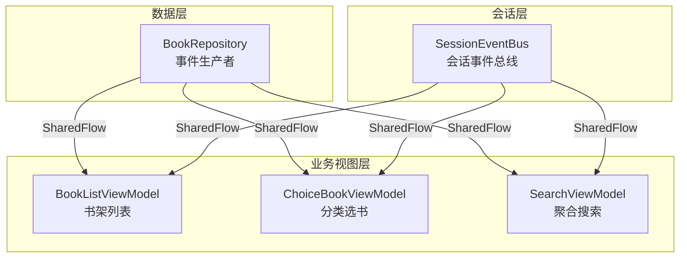
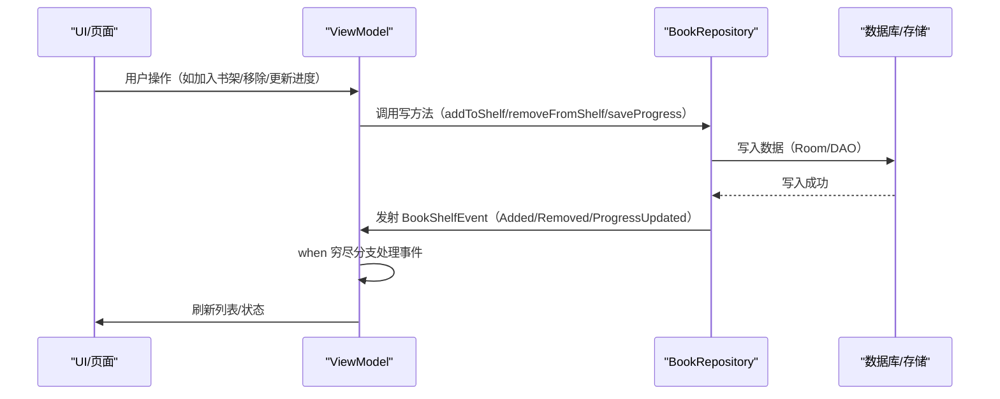
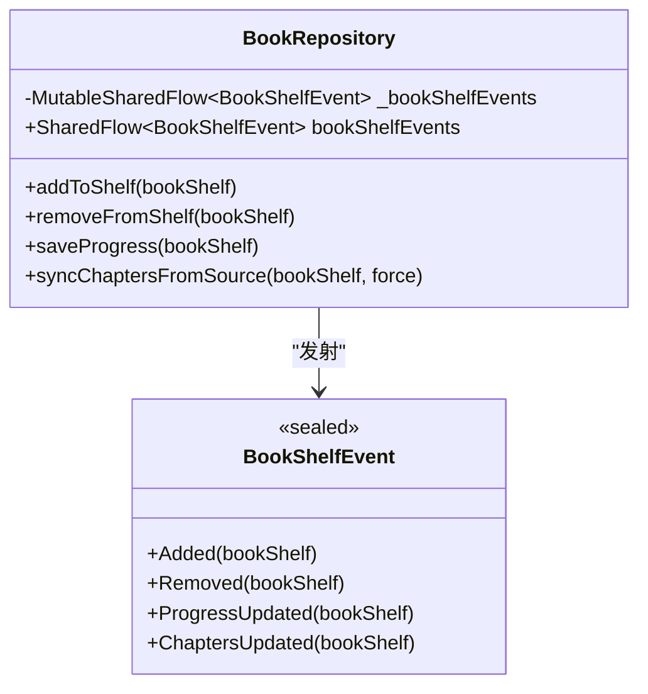
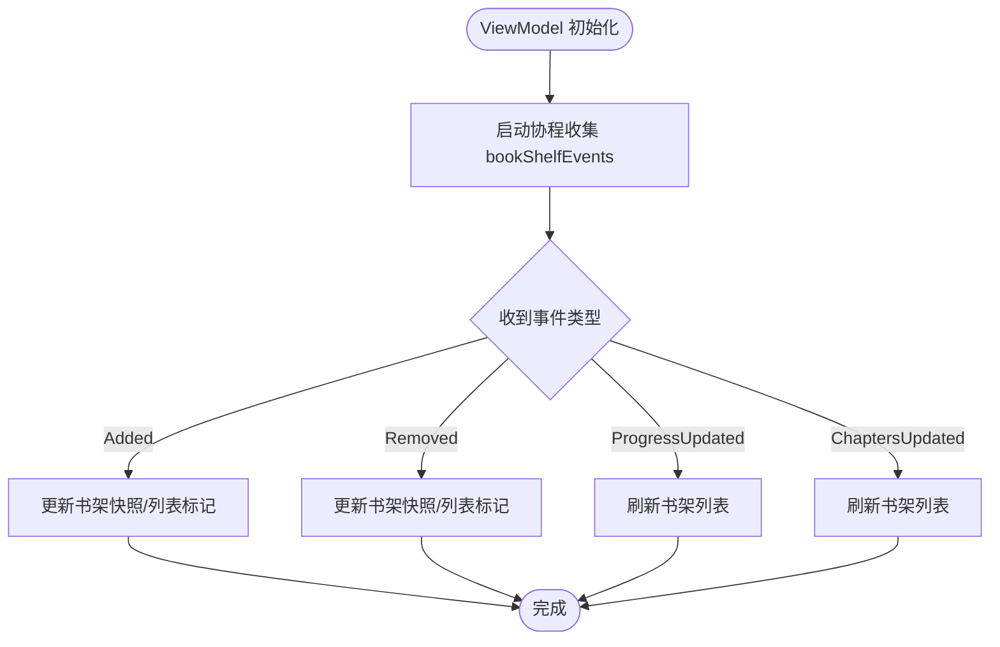
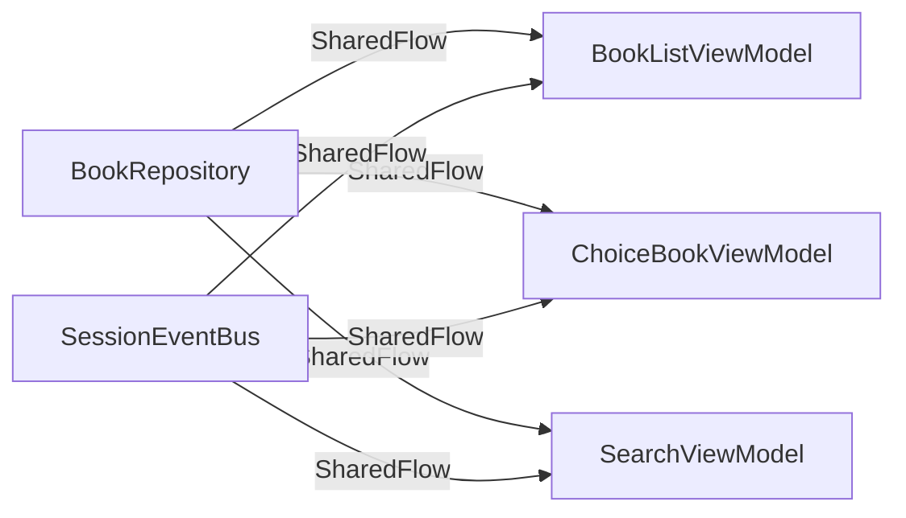

# SharedFlow 事件总线与异步事件分发

<cite>
**本文引用的文件**
- [BookRepository.kt](file://lib_book_common/src/main/java/com/ebook/common/repository/BookRepository.kt)
- [0004-rxbus-to-sharedflow.md](file://docs/adr/0004-rxbus-to-sharedflow.md)
- [BookListViewModel.kt](file://module_book/src/main/java/com/ebook/book/mvvm/viewmodel/BookListViewModel.kt)
- [ChoiceBookViewModel.kt](file://module_find/src/main/java/com/ebook/find/mvvm/viewmodel/ChoiceBookViewModel.kt)
- [SearchViewModel.kt](file://module_find/src/main/java/com/ebook/find/mvvm/viewmodel/SearchViewModel.kt)
- [SessionEventBus.kt](file://lib_ebook_api/src/main/java/com/ebook/api/auth/SessionEventBus.kt)
- [AGENTS.md](file://AGENTS.md)
</cite>

## 目录
1. [简介](#简介)
2. [项目结构](#项目结构)
3. [核心组件](#核心组件)
4. [架构总览](#架构总览)
5. [详细组件分析](#详细组件分析)
6. [依赖关系分析](#依赖关系分析)
7. [性能与背压](#性能与背压)
8. [故障排查指南](#故障排查指南)
9. [结论](#结论)
10. [附录](#附录)

## 简介
本仓库采用 Kotlin Coroutines + Flow 的响应式体系，并以 SharedFlow 作为事件总线，替代了早期的 RxBus。书架相关的事件由 BookRepository.bookShelfEvents 统一发布，ViewModel 在各自作用域内订阅并消费。该模式实现了模块间解耦、避免循环依赖、支持多订阅者并发消费，并通过 sealed class 穷尽分支保证新增事件时所有消费方必须显式处理，降低遗漏风险。

## 项目结构
- 事件生产端：BookRepository（lib_book_common）集中管理书架数据操作，并在关键写路径后发射事件。
- 事件消费端：各功能模块的 ViewModel（module_book、module_find）订阅 bookShelfEvents 并刷新 UI 或内部状态。
- 会话级全局事件：SessionEventBus（lib_ebook_api）提供跨模块的会话过期事件通道，用于统一处置登录态失效。

**图表来源**
- [BookRepository.kt:75-77](file://lib_book_common/src/main/java/com/ebook/common/repository/BookRepository.kt#L75-L77)
- [BookListViewModel.kt:36-52](file://module_book/src/main/java/com/ebook/book/mvvm/viewmodel/BookListViewModel.kt#L36-L52)
- [ChoiceBookViewModel.kt:63-80](file://module_find/src/main/java/com/ebook/find/mvvm/viewmodel/ChoiceBookViewModel.kt#L63-L80)
- [SearchViewModel.kt:111-127](file://module_find/src/main/java/com/ebook/find/mvvm/viewmodel/SearchViewModel.kt#L111-L127)
- [SessionEventBus.kt:30-44](file://lib_ebook_api/src/main/java/com/ebook/api/auth/SessionEventBus.kt#L30-L44)

**章节来源**
- [BookRepository.kt:75-77](file://lib_book_common/src/main/java/com/ebook/common/repository/BookRepository.kt#L75-L77)
- [0004-rxbus-to-sharedflow.md:1-14](file://docs/adr/0004-rxbus-to-sharedflow.md#L1-L14)

## 核心组件
- BookRepository：封装书架 CRUD、阅读进度保存、换源、目录重抓等，并在完成后通过 MutableSharedFlow 发射事件。
- BookShelfEvent：事件类型密封类，包括 Added、Removed、ProgressUpdated、ChaptersUpdated。
- ViewModel 订阅者：BookListViewModel、ChoiceBookViewModel、SearchViewModel 在 viewModelScope 中收集事件，按类型触发 UI 刷新或局部状态更新。
- SessionEventBus：会话级全局事件总线，使用 tryEmit + extraBufferCapacity=1 的非阻塞发射策略。

**章节来源**
- [BookRepository.kt:75-77](file://lib_book_common/src/main/java/com/ebook/common/repository/BookRepository.kt#L75-L77)
- [BookRepository.kt:870-892](file://lib_book_common/src/main/java/com/ebook/common/repository/BookRepository.kt#L870-L892)
- [BookListViewModel.kt:36-52](file://module_book/src/main/java/com/ebook/book/mvvm/viewmodel/BookListViewModel.kt#L36-L52)
- [ChoiceBookViewModel.kt:63-80](file://module_find/src/main/java/com/ebook/find/mvvm/viewmodel/ChoiceBookViewModel.kt#L63-L80)
- [SearchViewModel.kt:111-127](file://module_find/src/main/java/com/ebook/find/mvvm/viewmodel/SearchViewModel.kt#L111-L127)
- [SessionEventBus.kt:30-44](file://lib_ebook_api/src/main/java/com/ebook/api/auth/SessionEventBus.kt#L30-L44)

## 架构总览
事件驱动架构的优势：
- 解耦模块间通信：Repository 仅负责数据变更与事件发射，不关心谁订阅；ViewModel 只关注自身需要的事件类型。
- 避免循环依赖：事件以单向流传递，不存在双向回调耦合。
- 支持多订阅者：同一事件可同时被多个 ViewModel 订阅，互不影响。
- 编译期安全：sealed class 穷尽分支要求新增事件类型时所有消费方显式处理，防止静默漏收。

**图表来源**
- [BookRepository.kt:135-146](file://lib_book_common/src/main/java/com/ebook/common/repository/BookRepository.kt#L135-L146)
- [BookRepository.kt:193-201](file://lib_book_common/src/main/java/com/ebook/common/repository/BookRepository.kt#L193-L201)
- [BookListViewModel.kt:36-52](file://module_book/src/main/java/com/ebook/book/mvvm/viewmodel/BookListViewModel.kt#L36-L52)

**章节来源**
- [BookRepository.kt:135-146](file://lib_book_common/src/main/java/com/ebook/common/repository/BookRepository.kt#L135-L146)
- [BookRepository.kt:193-201](file://lib_book_common/src/main/java/com/ebook/common/repository/BookRepository.kt#L193-L201)
- [BookListViewModel.kt:36-52](file://module_book/src/main/java/com/ebook/book/mvvm/viewmodel/BookListViewModel.kt#L36-L52)

## 详细组件分析

### BookRepository 事件总线实现
- 创建与配置：使用 MutableSharedFlow<BookShelfEvent>(extraBufferCapacity = 64) 创建可变共享流，并通过 asSharedFlow() 暴露只读 SharedFlow。
- 事件发布机制：在关键写操作完成后调用 emit(BookShelfEvent.Xxx(...)) 发布事件，确保事件语义与数据一致。
- 额外缓冲区容量：extraBufferCapacity = 64 用于缓冲瞬时并发事件，避免背压导致的阻塞或丢事件。

**图表来源**
- [BookRepository.kt:75-77](file://lib_book_common/src/main/java/com/ebook/common/repository/BookRepository.kt#L75-L77)
- [BookRepository.kt:870-892](file://lib_book_common/src/main/java/com/ebook/common/repository/BookRepository.kt#L870-L892)

**章节来源**
- [BookRepository.kt:75-77](file://lib_book_common/src/main/java/com/ebook/common/repository/BookRepository.kt#L75-L77)
- [BookRepository.kt:135-146](file://lib_book_common/src/main/java/com/ebook/common/repository/BookRepository.kt#L135-L146)
- [BookRepository.kt:193-201](file://lib_book_common/src/main/java/com/ebook/common/repository/BookRepository.kt#L193-L201)
- [BookRepository.kt:595-597](file://lib_book_common/src/main/java/com/ebook/common/repository/BookRepository.kt#L595-L597)

### 事件类型定义与使用场景
- Added：书籍添加到书架，触发书架列表刷新和“已加书架”标记更新。
- Removed：书籍从书架移除，触发列表删除和标记清除。
- ProgressUpdated：阅读进度更新，触发书架列表重新查询以显示最新进度信息。
- ChaptersUpdated：目录追加新章，触发列表重新查询以显示最新章节数和更新角标。

**章节来源**
- [BookRepository.kt:870-892](file://lib_book_common/src/main/java/com/ebook/common/repository/BookRepository.kt#L870-L892)
- [BookListViewModel.kt:40-50](file://module_book/src/main/java/com/ebook/book/mvvm/viewmodel/BookListViewModel.kt#L40-L50)

### ViewModel 订阅模式
- BookListViewModel：在 init 中启动协程收集事件，对 Added/Removed/ProgressUpdated/ChaptersUpdated 统一调用 refreshData() 刷新书架列表。
- ChoiceBookViewModel：在 init 中收集事件，维护本地书架快照，根据 Added/Removed 更新列表中对应书籍的“已加书架”状态。
- SearchViewModel：在 init 中收集事件，维护搜索结果中的“已加书架”标记，对 ProgressUpdated/ChaptersUpdated 忽略（与搜索结果无关）。

**图表来源**
- [BookListViewModel.kt:36-52](file://module_book/src/main/java/com/ebook/book/mvvm/viewmodel/BookListViewModel.kt#L36-L52)
- [ChoiceBookViewModel.kt:63-80](file://module_find/src/main/java/com/ebook/find/mvvm/viewmodel/ChoiceBookViewModel.kt#L63-L80)
- [SearchViewModel.kt:111-127](file://module_find/src/main/java/com/ebook/find/mvvm/viewmodel/SearchViewModel.kt#L111-L127)

**章节来源**
- [BookListViewModel.kt:36-52](file://module_book/src/main/java/com/ebook/book/mvvm/viewmodel/BookListViewModel.kt#L36-L52)
- [ChoiceBookViewModel.kt:63-80](file://module_find/src/main/java/com/ebook/find/mvvm/viewmodel/ChoiceBookViewModel.kt#L63-L80)
- [SearchViewModel.kt:111-127](file://module_find/src/main/java/com/ebook/find/mvvm/viewmodel/SearchViewModel.kt#L111-L127)

### tryEmit vs emit 的区别与适用场景
- emit：阻塞式发射，当缓冲满时会挂起协程直到有消费者接收，适用于保证事件不丢失且可接受短暂阻塞的场景。
- tryEmit：非阻塞式发射，当缓冲满时直接丢弃事件，适用于幂等事件（如会话过期）且不允许阻塞请求线程的场景。

示例：
- BookRepository 使用 emit 确保书架事件可靠发送（缓冲足够大，通常不会阻塞）。
- SessionEventBus 使用 tryEmit 避免会话过期风暴阻塞网络请求线程。

**章节来源**
- [BookRepository.kt:135-146](file://lib_book_common/src/main/java/com/ebook/common/repository/BookRepository.kt#L135-L146)
- [SessionEventBus.kt:39-43](file://lib_ebook_api/src/main/java/com/ebook/api/auth/SessionEventBus.kt#L39-L43)

## 依赖关系分析
- BookRepository 依赖 Room DAO、BookStore、ChapterContentCache 等基础设施，但不依赖具体 ViewModel。
- ViewModel 依赖 BookRepository 暴露的 SharedFlow，通过 Hilt 注入获取实例。
- SessionEventBus 位于 lib_ebook_api，被上层模块订阅，实现会话级全局事件分发。

**图表来源**
- [BookRepository.kt:75-77](file://lib_book_common/src/main/java/com/ebook/common/repository/BookRepository.kt#L75-L77)
- [SessionEventBus.kt:30-44](file://lib_ebook_api/src/main/java/com/ebook/api/auth/SessionEventBus.kt#L30-L44)

**章节来源**
- [BookRepository.kt:75-77](file://lib_book_common/src/main/java/com/ebook/common/repository/BookRepository.kt#L75-L77)
- [SessionEventBus.kt:30-44](file://lib_ebook_api/src/main/java/com/ebook/api/auth/SessionEventBus.kt#L30-L44)

## 性能与背压
- 缓冲策略：BookRepository 使用 extraBufferCapacity = 64 缓冲瞬时并发事件，避免背压导致的阻塞或丢事件。
- 内存管理：SharedFlow 默认无 replay，先订阅后发布的事件会丢失，适合事件总线场景（不需要历史回放）。
- 背压处理：SessionEventBus 使用 tryEmit + extraBufferCapacity = 1 的非阻塞策略，允许丢弃重复的会话过期事件，避免阻塞请求线程。

最佳实践：
- 对于幂等事件（如会话过期），使用 tryEmit 避免阻塞。
- 对于重要事件（如书架变化），使用 emit 配合足够大的缓冲容量，确保事件可靠发送。
- 在 ViewModel 中收集事件时，使用 viewModelScope 自动管理生命周期，避免内存泄漏。

**章节来源**
- [BookRepository.kt:75-77](file://lib_book_common/src/main/java/com/ebook/common/repository/BookRepository.kt#L75-L77)
- [SessionEventBus.kt:30-44](file://lib_ebook_api/src/main/java/com/ebook/api/auth/SessionEventBus.kt#L30-L44)
- [0004-rxbus-to-sharedflow.md:10-14](file://docs/adr/0004-rxbus-to-sharedflow.md#L10-L14)

## 故障排查指南
常见问题及解决方案：
- 事件丢失：检查 SharedFlow 的缓冲容量是否足够，确认订阅是否在事件发布前启动。
- 重复消费：确认 ViewModel 中是否正确处理事件类型，避免重复逻辑。
- 内存泄漏：确保在 viewModelScope 中收集事件，避免手动管理协程生命周期。
- 背压问题：对于高频事件，考虑使用 tryEmit 或增加缓冲容量。

调试技巧：
- 在 ViewModel 中添加日志，记录事件类型和处理逻辑。
- 使用断点调试事件发射和订阅过程。
- 检查 SharedFlow 的配置参数（extraBufferCapacity、replay、onBufferOverflow）。

**章节来源**
- [BookListViewModel.kt:36-52](file://module_book/src/main/java/com/ebook/book/mvvm/viewmodel/BookListViewModel.kt#L36-L52)
- [ChoiceBookViewModel.kt:63-80](file://module_find/src/main/java/com/ebook/find/mvvm/viewmodel/ChoiceBookViewModel.kt#L63-L80)
- [SearchViewModel.kt:111-127](file://module_find/src/main/java/com/ebook/find/mvvm/viewmodel/SearchViewModel.kt#L111-L127)

## 结论
本项目通过 SharedFlow 实现了高效、类型安全、可维护的事件总线，替代了传统的 RxBus。BookRepository.bookShelfEvents 提供了统一的书架事件发布机制，ViewModel 通过 sealed class 穷尽分支确保事件处理的完整性。结合适当的缓冲策略和背压处理，该方案在保证性能的同时，提升了代码的可读性和可维护性。

## 附录
- ADR 文档：记录了从 RxBus 迁移到 SharedFlow 的决策背景和权衡。
- 构建约定：统一使用 Kotlin Coroutines + Flow，禁止重新引入 RxJava。
- 测试约定：单元测试覆盖事件发射和订阅逻辑，确保功能稳定性。

**章节来源**
- [0004-rxbus-to-sharedflow.md:1-14](file://docs/adr/0004-rxbus-to-sharedflow.md#L1-L14)
- [AGENTS.md:1-50](file://AGENTS.md#L1-L50)