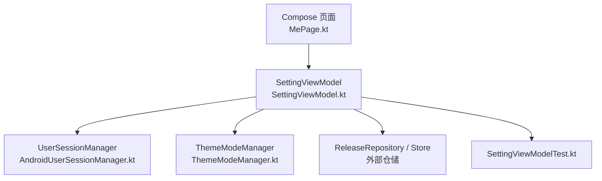
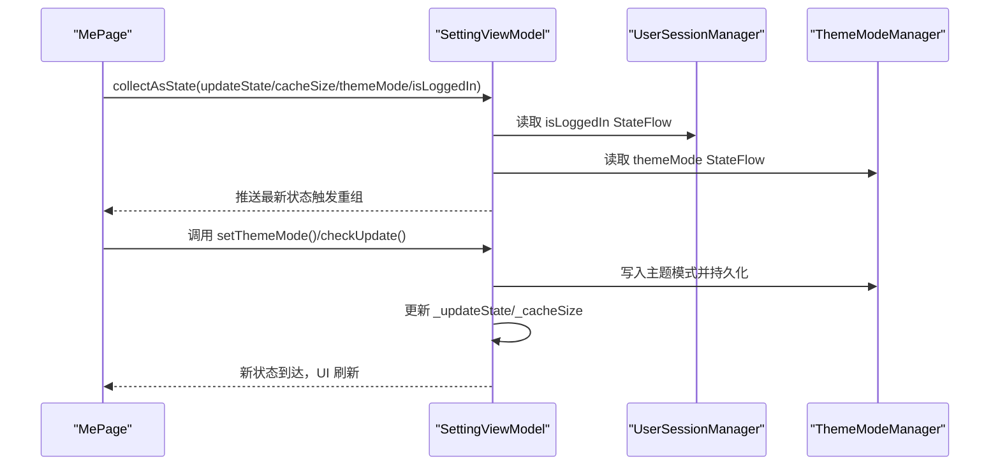
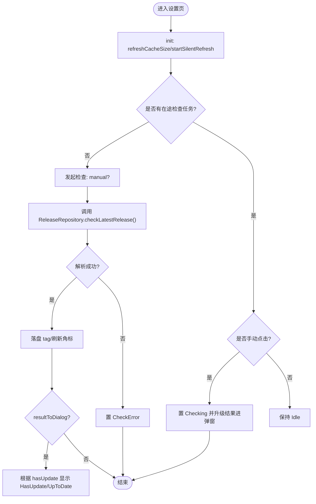
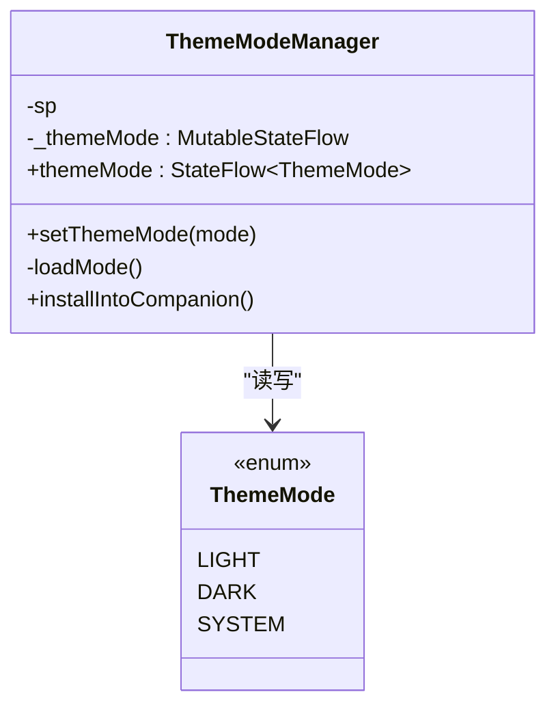
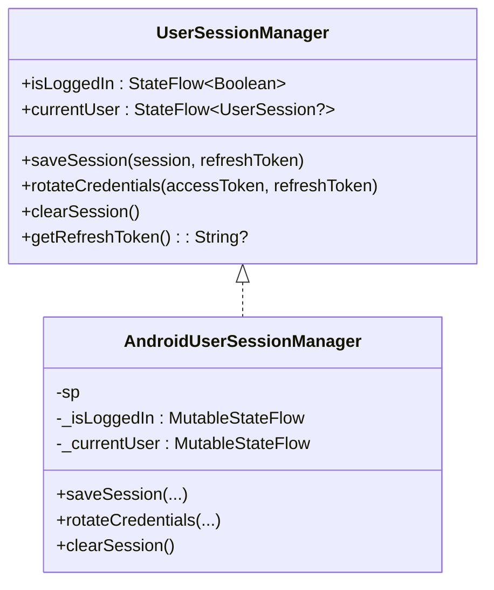
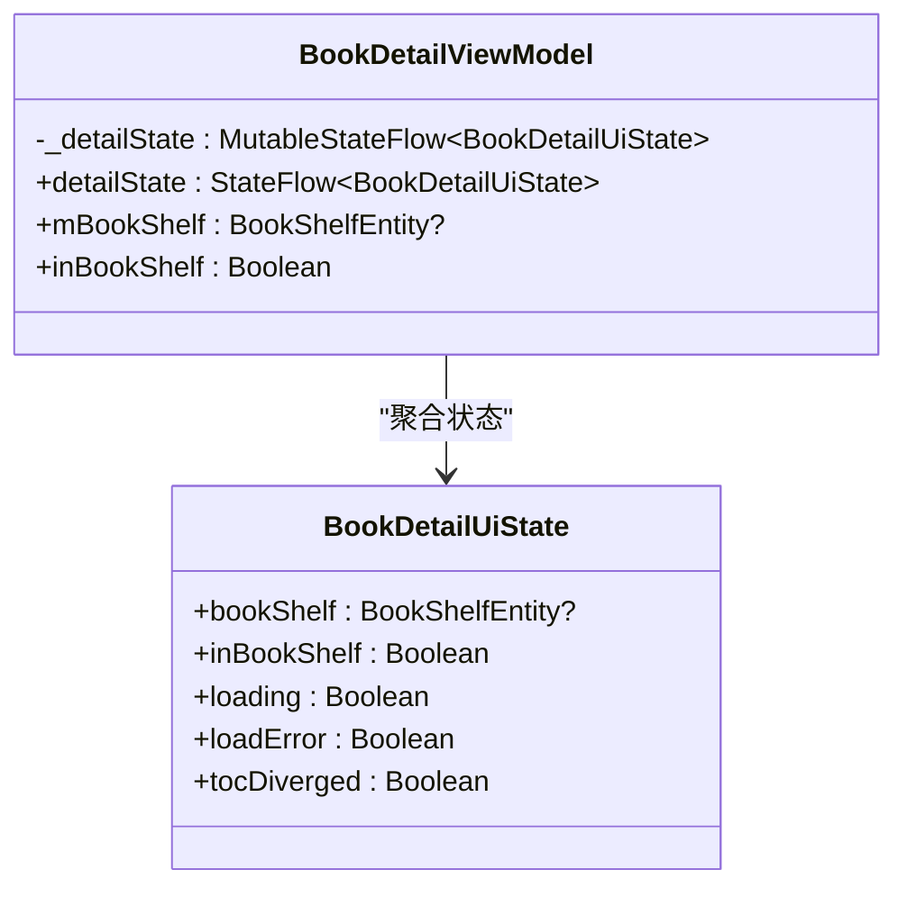
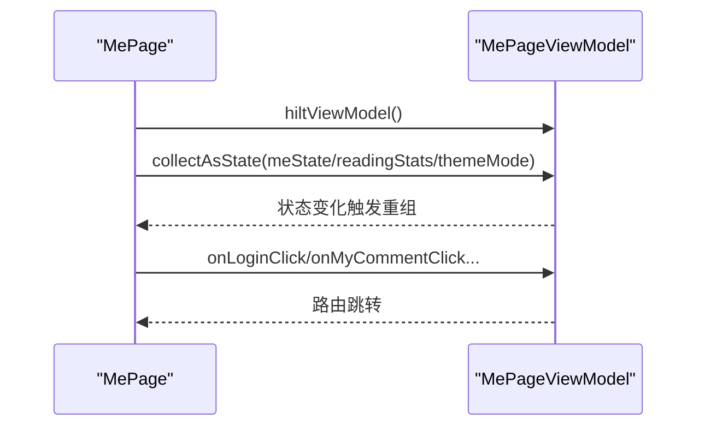
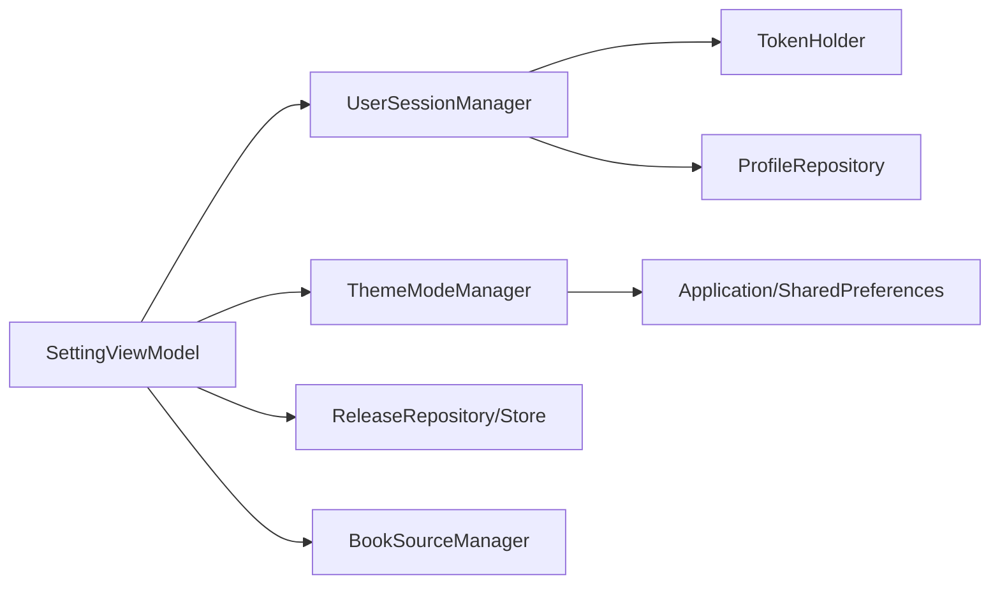
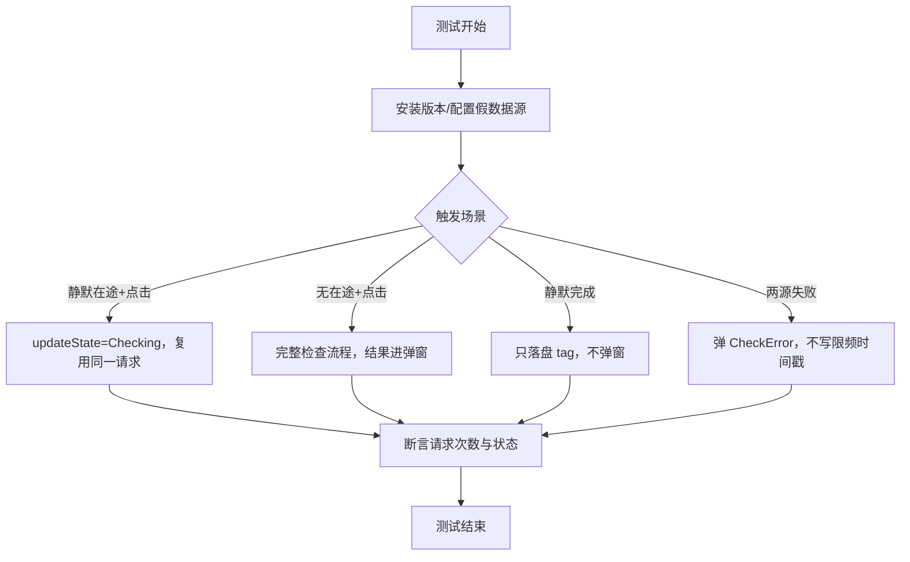

# StateFlow 状态容器与响应式状态管理

<cite>
**本文档引用的文件**   
- [SettingViewModel.kt](file://module_me/src/main/java/com/ebook/me/mvvm/viewmodel/SettingViewModel.kt)
- [SettingViewModelTest.kt](file://module_me/src/test/java/com/ebook/me/mvvm/viewmodel/SettingViewModelTest.kt)
- [ThemeModeManager.kt](file://lib_book_common/src/main/java/com/ebook/common/domain/ThemeModeManager.kt)
- [UserSessionManager.kt](file://lib_book_common/src/main/java/com/ebook/common/domain/UserSessionManager.kt)
- [AndroidUserSessionManager.kt](file://lib_book_common/src/main/java/com/ebook/common/domain/AndroidUserSessionManager.kt)
- [MePage.kt](file://module_me/src/main/java/com/ebook/me/page/MePage.kt)
- [BookDetailViewModel.kt](file://module_book/src/main/java/com/ebook/book/mvvm/viewmodel/BookDetailViewModel.kt)
</cite>

## 目录
1. [简介](#简介)
2. [项目结构中的状态管理位置](#项目结构中的状态管理位置)
3. [核心组件](#核心组件)
4. [架构总览](#架构总览)
5. [详细组件分析](#详细组件分析)
6. [依赖关系分析](#依赖关系分析)
7. [性能与内存优化](#性能与内存优化)
8. [测试策略](#测试策略)
9. [常见问题与排错](#常见问题与排错)
10. [结论](#结论)

## 简介
本文件围绕 MVVM 架构下的 StateFlow 状态容器与响应式状态管理，结合仓库中 SettingViewModel、主题管理、会话管理与 Compose 集成等真实实现，系统阐述：
- StateFlow 在 MVVM 中的职责边界与生命周期管理
- SettingViewModel 的多 StateFlow 使用模式（登录态、缓存大小、版本检查、主题模式）
- MutableStateFlow 与 StateFlow 的关系与线程安全实践
- stateIn 的 SharingStarted 策略与内存优化
- 状态提升、状态派生、状态合并的实践
- 初始值设置、更新时机与 UI 重组优化
- StateFlow 测试策略与 Compose 集成最佳实践

## 项目结构中的状态管理位置
- ViewModel 层：集中暴露 StateFlow 给 UI 消费，如 SettingViewModel、BookDetailViewModel
- 领域服务：封装跨模块或全局可观察状态，如 ThemeModeManager、UserSessionManager
- Compose 页面：通过 collectAsState 订阅 VM 暴露的状态流
- 测试：以协程测试调度器与假实现验证状态流转与边界行为

图表来源
- [SettingViewModel.kt:63-178](file://module_me/src/main/java/com/ebook/me/mvvm/viewmodel/SettingViewModel.kt#L63-L178)
- [MePage.kt:77-94](file://module_me/src/main/java/com/ebook/me/page/MePage.kt#L77-L94)
- [ThemeModeManager.kt:44-77](file://lib_book_common/src/main/java/com/ebook/common/domain/ThemeModeManager.kt#L44-L77)
- [AndroidUserSessionManager.kt:29-52](file://lib_book_common/src/main/java/com/ebook/common/domain/AndroidUserSessionManager.kt#L29-L52)

章节来源
- [SettingViewModel.kt:63-178](file://module_me/src/main/java/com/ebook/me/mvvm/viewmodel/SettingViewModel.kt#L63-L178)
- [MePage.kt:77-94](file://module_me/src/main/java/com/ebook/me/page/MePage.kt#L77-L94)

## 核心组件
- SettingViewModel：集中管理设置页相关状态，包括登录态观察、缓存大小计算、版本检查状态、主题模式、书源数量等。对外暴露多个 StateFlow，内部用 MutableStateFlow 驱动并转为只读 StateFlow。
- ThemeModeManager：主题模式的单例管理器，持久化用户选择并以 StateFlow 暴露当前主题模式。
- UserSessionManager/AndroidUserSessionManager：登录态与会话的统一抽象与 Android 实现，暴露 isLoggedIn、currentUser 等 StateFlow。
- BookDetailViewModel：展示详情状态的 StateFlow 封装，演示状态合并与事件处理。
- MePage：Compose 页面，通过 collectAsState 订阅 VM 暴露的 StateFlow。

章节来源
- [SettingViewModel.kt:77-161](file://module_me/src/main/java/com/ebook/me/mvvm/viewmodel/SettingViewModel.kt#L77-L161)
- [ThemeModeManager.kt:44-77](file://lib_book_common/src/main/java/com/ebook/common/domain/ThemeModeManager.kt#L44-L77)
- [UserSessionManager.kt:13-62](file://lib_book_common/src/main/java/com/ebook/common/domain/UserSessionManager.kt#L13-L62)
- [AndroidUserSessionManager.kt:29-52](file://lib_book_common/src/main/java/com/ebook/common/domain/AndroidUserSessionManager.kt#L29-L52)
- [BookDetailViewModel.kt:52-100](file://module_book/src/main/java/com/ebook/book/mvvm/viewmodel/BookDetailViewModel.kt#L52-L100)
- [MePage.kt:77-94](file://module_me/src/main/java/com/ebook/me/page/MePage.kt#L77-L94)

## 架构总览
MVVM + Flow 的数据流向：UI 通过 collectAsState 订阅 VM 暴露的 StateFlow；VM 组合业务逻辑与仓储，将结果写入 MutableStateFlow 并通过 asStateFlow 暴露；领域服务（如主题、会话）提供全局可观察状态；测试覆盖关键分支。

图表来源
- [SettingViewModel.kt:77-178](file://module_me/src/main/java/com/ebook/me/mvvm/viewmodel/SettingViewModel.kt#L77-L178)
- [MePage.kt:77-94](file://module_me/src/main/java/com/ebook/me/page/MePage.kt#L77-L94)
- [ThemeModeManager.kt:60-63](file://lib_book_common/src/main/java/com/ebook/common/domain/ThemeModeManager.kt#L60-L63)
- [AndroidUserSessionManager.kt:39-43](file://lib_book_common/src/main/java/com/ebook/common/domain/AndroidUserSessionManager.kt#L39-L43)

## 详细组件分析

### SettingViewModel：多 StateFlow 的使用模式
- 登录态观察：isLoggedIn 直接转发 UserSessionManager 的 StateFlow，避免 VM 持有额外状态。
- 缓存大小：_cacheSize 为 MutableStateFlow，通过 formatSize 计算后赋值，对外暴露 StateFlow。
- 版本检查：_updateState 使用密封接口 UpdateState 表达 Idle/Checking/UpToDate/HasUpdate/CheckError 的状态机；launchCheck 保证“单飞”，并在静默检查在途时升级为可见检查。
- 主题模式：themeMode 直接转发 ThemeModeManager 的 StateFlow，setThemeMode 由 VM 调用并持久化。
- 书源计数：sourcesCount 使用 map + stateIn(WhileSubscribed(5s)) 热化冷流，无订阅者时不持续监听数据库失效。

图表来源
- [SettingViewModel.kt:174-290](file://module_me/src/main/java/com/ebook/me/mvvm/viewmodel/SettingViewModel.kt#L174-L290)

章节来源
- [SettingViewModel.kt:77-161](file://module_me/src/main/java/com/ebook/me/mvvm/viewmodel/SettingViewModel.kt#L77-L161)
- [SettingViewModel.kt:174-290](file://module_me/src/main/java/com/ebook/me/mvvm/viewmodel/SettingViewModel.kt#L174-L290)

### 主题模式管理：ThemeModeManager
- 暴露 themeMode: StateFlow<ThemeMode>，默认跟随系统
- setThemeMode 持久化到 SharedPreferences 并立即推进 _themeMode
- 通过 Companion.instance 暴露给非 Hilt 作用域的主题装配 lambda

图表来源
- [ThemeModeManager.kt:17-26](file://lib_book_common/src/main/java/com/ebook/common/domain/ThemeModeManager.kt#L17-L26)
- [ThemeModeManager.kt:44-77](file://lib_book_common/src/main/java/com/ebook/common/domain/ThemeModeManager.kt#L44-L77)

章节来源
- [ThemeModeManager.kt:44-77](file://lib_book_common/src/main/java/com/ebook/common/domain/ThemeModeManager.kt#L44-L77)

### 登录态与会话：UserSessionManager/AndroidUserSessionManager
- 接口定义 isLoggedIn、currentUser 等 StateFlow，屏蔽持久化细节
- Android 实现负责三处镜像清理：SP、兼容 SP_*、ProfileRepository 进程内状态
- 启动恢复时将持久化 token 注入 TokenHolder，确保拦截器可用

图表来源
- [UserSessionManager.kt:13-62](file://lib_book_common/src/main/java/com/ebook/common/domain/UserSessionManager.kt#L13-L62)
- [AndroidUserSessionManager.kt:29-52](file://lib_book_common/src/main/java/com/ebook/common/domain/AndroidUserSessionManager.kt#L29-L52)
- [AndroidUserSessionManager.kt:111-133](file://lib_book_common/src/main/java/com/ebook/common/domain/AndroidUserSessionManager.kt#L111-L133)

章节来源
- [UserSessionManager.kt:13-62](file://lib_book_common/src/main/java/com/ebook/common/domain/UserSessionManager.kt#L13-L62)
- [AndroidUserSessionManager.kt:29-52](file://lib_book_common/src/main/java/com/ebook/common/domain/AndroidUserSessionManager.kt#L29-L52)
- [AndroidUserSessionManager.kt:111-133](file://lib_book_common/src/main/java/com/ebook/common/domain/AndroidUserSessionManager.kt#L111-L133)

### 详情页状态：BookDetailViewModel
- 使用单一 MutableStateFlow<BookDetailUiState> 聚合多项 UI 状态，避免分散字段导致重组丢失
- 通过 update{} 修改状态，保证原子性与不可变性
- 收集书架事件修正 inBookShelf 等派生状态

图表来源
- [BookDetailViewModel.kt:39-67](file://module_book/src/main/java/com/ebook/book/mvvm/viewmodel/BookDetailViewModel.kt#L39-L67)
- [BookDetailViewModel.kt:75-100](file://module_book/src/main/java/com/ebook/book/mvvm/viewmodel/BookDetailViewModel.kt#L75-L100)

章节来源
- [BookDetailViewModel.kt:39-100](file://module_book/src/main/java/com/ebook/book/mvvm/viewmodel/BookDetailViewModel.kt#L39-L100)

### Compose 集成：collectAsState 的使用
- MePage 通过 viewModel.meState/readingStats/themeMode.collectAsState() 订阅 VM 暴露的 StateFlow
- 主题模式经 VM 读取，避免页面直连主题单例，保持单向数据流
- 点击事件统一通过 TheRouter 跳转，保持导航解耦

图表来源
- [MePage.kt:77-94](file://module_me/src/main/java/com/ebook/me/page/MePage.kt#L77-L94)

章节来源
- [MePage.kt:77-94](file://module_me/src/main/java/com/ebook/me/page/MePage.kt#L77-L94)

## 依赖关系分析
- SettingViewModel 依赖 UserSessionManager、ThemeModeManager、ReleaseRepository/Store、BookSourceManager
- ThemeModeManager 依赖 Application 和 SharedPreferences
- AndroidUserSessionManager 依赖 TokenHolder、ProfileRepository 和 SharedPreferences
- BookDetailViewModel 依赖 BookRepository、BookSourceManager

图表来源
- [SettingViewModel.kt:63-71](file://module_me/src/main/java/com/ebook/me/mvvm/viewmodel/SettingViewModel.kt#L63-L71)
- [ThemeModeManager.kt:44-49](file://lib_book_common/src/main/java/com/ebook/common/domain/ThemeModeManager.kt#L44-L49)
- [AndroidUserSessionManager.kt:29-33](file://lib_book_common/src/main/java/com/ebook/common/domain/AndroidUserSessionManager.kt#L29-L33)

章节来源
- [SettingViewModel.kt:63-71](file://module_me/src/main/java/com/ebook/me/mvvm/viewmodel/SettingViewModel.kt#L63-L71)
- [ThemeModeManager.kt:44-49](file://lib_book_common/src/main/java/com/ebook/common/domain/ThemeModeManager.kt#L44-L49)
- [AndroidUserSessionManager.kt:29-33](file://lib_book_common/src/main/java/com/ebook/common/domain/AndroidUserSessionManager.kt#L29-L33)

## 性能与内存优化
- stateIn + WhileSubscribed：对冷流进行热化，并在无订阅者时停止监听，避免后台资源浪费（如 sourcesCount）
- 单飞检查：同一时刻最多一个版本检查任务，避免重复请求与竞态
- 状态派生而非存储：hasUpdateAvailable 由上次检查 tag 与本地版本现场比较得出，避免冗余状态
- 初始值设计：缓存大小初始为空串表示“计算中”，UI 层自行解析占位文案，VM 不携带用户可见文本
- 重组优化：VM 暴露最小必要 StateFlow，UI 仅订阅所需状态，减少不必要重组

章节来源
- [SettingViewModel.kt:141-161](file://module_me/src/main/java/com/ebook/me/mvvm/viewmodel/SettingViewModel.kt#L141-L161)
- [SettingViewModel.kt:214-257](file://module_me/src/main/java/com/ebook/me/mvvm/viewmodel/SettingViewModel.kt#L214-L257)

## 测试策略
- 使用 Robolectric 与 StandardTestDispatcher 控制协程执行与时钟
- 门控桩模拟网络在途与失败，验证“静默在途升级可见检查”、“两源均失败弹 CheckError”等契约
- 记录调用顺序与次数，断言登出流程“先服务端作废再清本地”、“连点防重”、“覆盖层复位”
- 验证限频时间戳双写规则：成功检查写时间戳，失败检查不写，窗口不被失败复位

图表来源
- [SettingViewModelTest.kt:200-312](file://module_me/src/test/java/com/ebook/me/mvvm/viewmodel/SettingViewModelTest.kt#L200-L312)

章节来源
- [SettingViewModelTest.kt:200-312](file://module_me/src/test/java/com/ebook/me/mvvm/viewmodel/SettingViewModelTest.kt#L200-L312)

## 常见问题与排错
- 状态未更新：确认是否通过 MutableStateFlow.value 更新，并正确暴露为 StateFlow
- 重复请求：检查是否使用“单飞”机制或节流策略
- 内存泄漏：确认 stateIn 的 SharingStarted 策略合理，冷流在无订阅者时停止监听
- 主题切换无效：确认 setThemeMode 已持久化且 _themeMode 已推进
- 登出不生效：确认 clearSession 调用及三处镜像清理

章节来源
- [SettingViewModel.kt:174-290](file://module_me/src/main/java/com/ebook/me/mvvm/viewmodel/SettingViewModel.kt#L174-L290)
- [ThemeModeManager.kt:60-63](file://lib_book_common/src/main/java/com/ebook/common/domain/ThemeModeManager.kt#L60-L63)
- [AndroidUserSessionManager.kt:111-133](file://lib_book_common/src/main/java/com/ebook/common/domain/AndroidUserSessionManager.kt#L111-L133)

## 结论
本项目在 MVVM 架构下，以 StateFlow 为核心构建响应式状态管理：
- VM 作为唯一事实源，暴露最小必要 StateFlow 给 UI
- 领域服务提供全局可观察状态（主题、会话）
- 通过 stateIn 与 SharingStarted 策略平衡实时性与内存占用
- 以密封状态机表达复杂 UI 状态（版本检查）
- 测试覆盖关键时序与边界条件，保障状态流转的正确性

这些实践确保了状态的可观测性、可测试性与可维护性，同时为 Compose 集成提供了稳定基础。