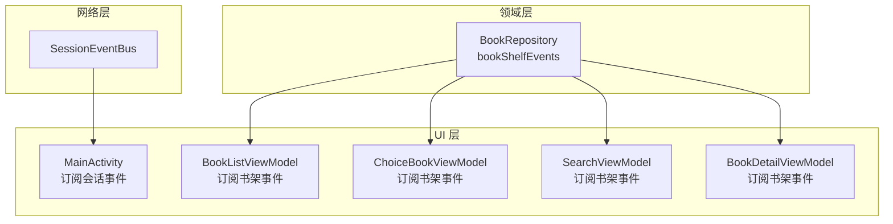
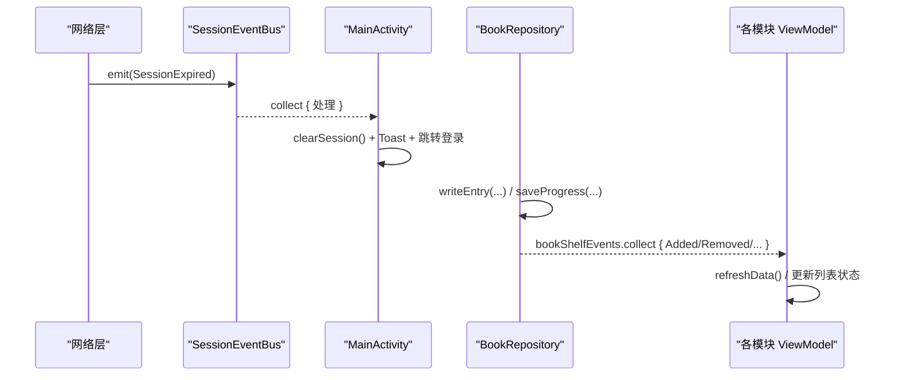
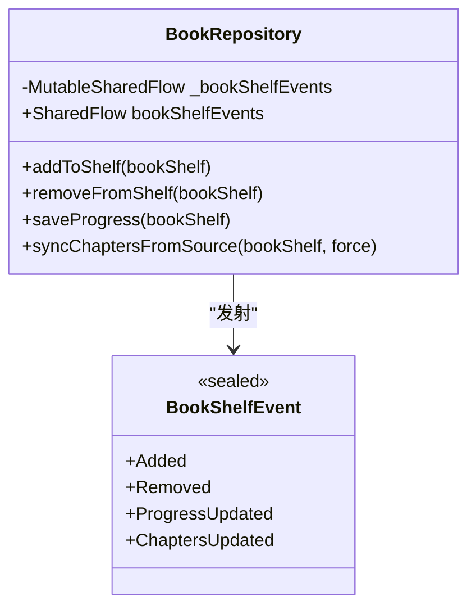
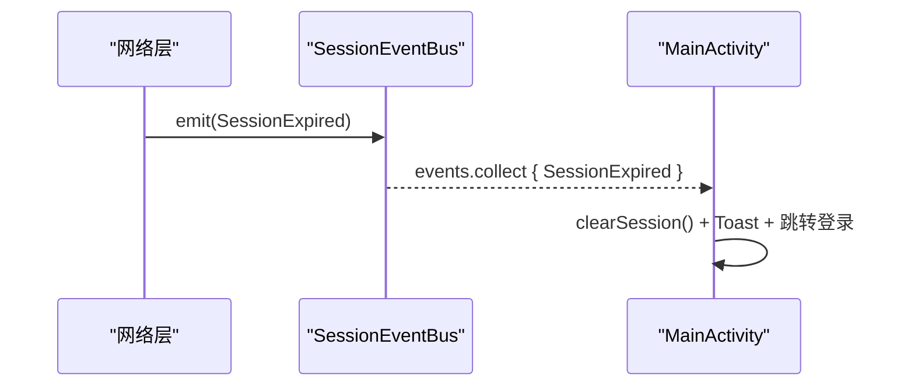
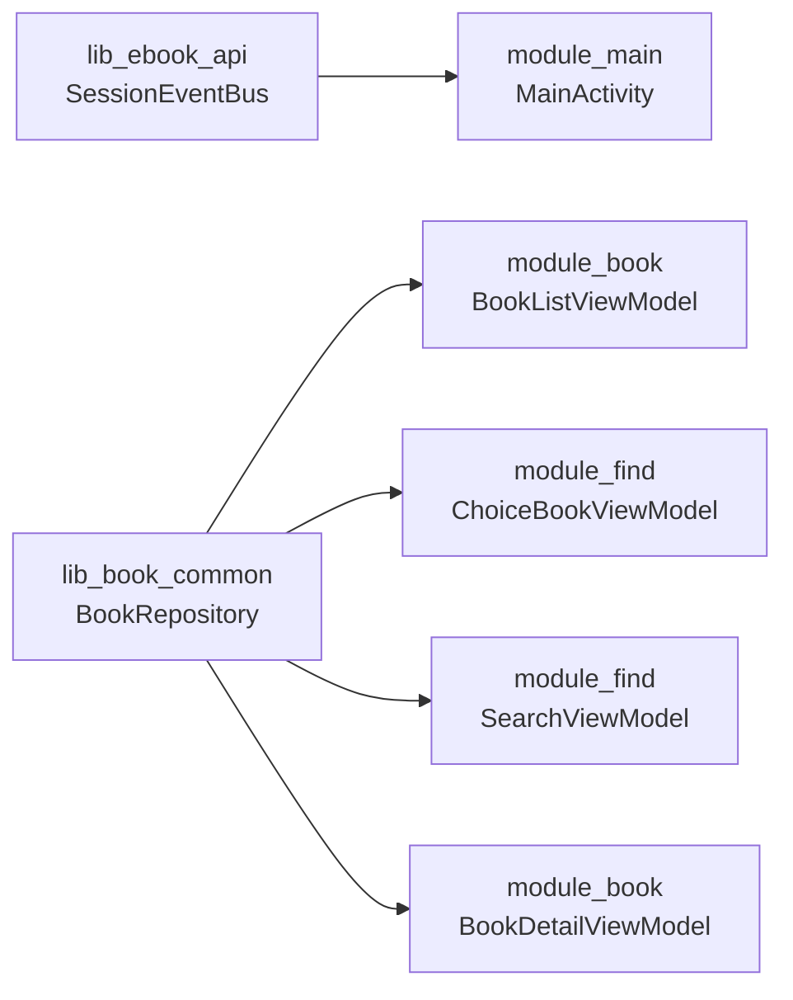

# SharedFlow 事件总线与跨模块通信

<cite>
**本文引用的文件**
- [SessionEventBus.kt](file://lib_ebook_api/src/main/java/com/ebook/api/auth/SessionEventBus.kt)
- [BookRepository.kt](file://lib_book_common/src/main/java/com/ebook/common/repository/BookRepository.kt)
- [MainActivity.kt](file://module_main/src/main/java/com/ebook/main/MainActivity.kt)
- [BookListViewModel.kt](file://module_book/src/main/java/com/ebook/book/mvvm/viewmodel/BookListViewModel.kt)
- [ChoiceBookViewModel.kt](file://module_find/src/main/java/com/ebook/find/mvvm/viewmodel/ChoiceBookViewModel.kt)
- [SearchViewModel.kt](file://module_find/src/main/java/com/ebook/find/mvvm/viewmodel/SearchViewModel.kt)
- [BookDetailViewModel.kt](file://module_book/src/main/java/com/ebook/book/mvvm/viewmodel/BookDetailViewModel.kt)
</cite>

## 目录
1. [简介](#简介)
2. [项目结构](#项目结构)
3. [核心组件](#核心组件)
4. [架构总览](#架构总览)
5. [详细组件分析](#详细组件分析)
6. [依赖关系分析](#依赖关系分析)
7. [性能考量](#性能考量)
8. [故障排除指南](#故障排除指南)
9. [结论](#结论)

## 简介
本文件系统性阐述本项目中基于 Kotlin Coroutines Flow 的 SharedFlow 事件总线与跨模块通信机制。重点包括：
- BookRepository.bookShelfEvents：书架侧领域事件流（添加、移除、进度更新、目录追加）。
- SessionEventBus：会话级全局事件总线，统一在网络层发射、在 UI 层订阅处理（如会话过期）。
- SharedFlow 背压策略：extraBufferCapacity 的设置原则、tryEmit 的使用场景。
- 跨模块通信最佳实践：事件命名约定、版本兼容、依赖方向约束。
- 常见模式示例：发布/订阅、过滤与分支处理、去重与批量消费。
- 性能与安全：事件去重、批量处理、内存泄漏防护。
- 事件驱动架构的优势与风险、调试与故障定位技巧。

## 项目结构
围绕事件总线的关键位置：
- lib_ebook_api：网络层与会话事件总线（SessionEventBus）定义与实现。
- lib_book_common：领域仓库层（BookRepository）暴露 bookShelfEvents，作为书架相关事件的唯一事实源。
- module_*：各业务模块通过 ViewModel 或 Activity 订阅事件，驱动 UI 刷新或全局流程（如跳转登录）。

图示来源
- [SessionEventBus.kt:1-44](file://lib_ebook_api/src/main/java/com/ebook/api/auth/SessionEventBus.kt#L1-L44)
- [BookRepository.kt:75-77](file://lib_book_common/src/main/java/com/ebook/common/repository/BookRepository.kt#L75-L77)
- [MainActivity.kt:68-80](file://module_main/src/main/java/com/ebook/main/MainActivity.kt#L68-L80)
- [BookListViewModel.kt:36-52](file://module_book/src/main/java/com/ebook/book/mvvm/viewmodel/BookListViewModel.kt#L36-L52)
- [ChoiceBookViewModel.kt:63-80](file://module_find/src/main/java/com/ebook/find/mvvm/viewmodel/ChoiceBookViewModel.kt#L63-L80)
- [SearchViewModel.kt:108-118](file://module_find/src/main/java/com/ebook/find/mvvm/viewmodel/SearchViewModel.kt#L108-L118)
- [BookDetailViewModel.kt:75-85](file://module_book/src/main/java/com/ebook/book/mvvm/viewmodel/BookDetailViewModel.kt#L75-L85)

章节来源
- [SessionEventBus.kt:1-44](file://lib_ebook_api/src/main/java/com/ebook/api/auth/SessionEventBus.kt#L1-L44)
- [BookRepository.kt:75-77](file://lib_book_common/src/main/java/com/ebook/common/repository/BookRepository.kt#L75-L77)
- [MainActivity.kt:68-80](file://module_main/src/main/java/com/ebook/main/MainActivity.kt#L68-L80)
- [BookListViewModel.kt:36-52](file://module_book/src/main/java/com/ebook/book/mvvm/viewmodel/BookListViewModel.kt#L36-L52)
- [ChoiceBookViewModel.kt:63-80](file://module_find/src/main/java/com/ebook/find/mvvm/viewmodel/ChoiceBookViewModel.kt#L63-L80)
- [SearchViewModel.kt:108-118](file://module_find/src/main/java/com/ebook/find/mvvm/viewmodel/SearchViewModel.kt#L108-L118)
- [BookDetailViewModel.kt:75-85](file://module_book/src/main/java/com/ebook/book/mvvm/viewmodel/BookDetailViewModel.kt#L75-L85)

## 核心组件
- BookRepository.bookShelfEvents
  - 类型：SharedFlow<BookShelfEvent>
  - 职责：封装书架变更事件（Added/Removed/ProgressUpdated/ChaptersUpdated），作为多模块共享的事实通道。
  - 发射时机：写库成功后（例如 addToShelf、removeFromShelf、saveProgress、syncChaptersFromSource 成功时）。
  - 背压策略：使用 MutableSharedFlow(extraBufferCapacity = 64)，允许短时间突发；消费方应在 VM 生命周期内收集，避免堆积。

- SessionEventBus
  - 类型：Singleton，内部持有 MutableSharedFlow<SessionEvent>(extraBufferCapacity = 1)
  - 职责：网络层会话级事件（如 SessionExpired）的统一收口，供上层 UI 统一处置。
  - 发射策略：emit() 内部使用 tryEmit，缓冲满时丢弃重复事件，避免阻塞请求线程。
  - 消费策略：主进程长驻入口（MainActivity）订阅并执行幂等处置（清会话 + 提示 + 跳转登录）。

章节来源
- [BookRepository.kt:75-77](file://lib_book_common/src/main/java/com/ebook/common/repository/BookRepository.kt#L75-L77)
- [BookRepository.kt:135-146](file://lib_book_common/src/main/java/com/ebook/common/repository/BookRepository.kt#L135-L146)
- [BookRepository.kt:193-201](file://lib_book_common/src/main/java/com/ebook/common/repository/BookRepository.kt#L193-L201)
- [BookRepository.kt:595-597](file://lib_book_common/src/main/java/com/ebook/common/repository/BookRepository.kt#L595-L597)
- [BookRepository.kt:864-866](file://lib_book_common/src/main/java/com/ebook/common/repository/BookRepository.kt#L864-L866)
- [SessionEventBus.kt:9-44](file://lib_ebook_api/src/main/java/com/ebook/api/auth/SessionEventBus.kt#L9-L44)

## 架构总览
事件总线遵循“单事实源 + 多订阅者”的响应式模式：
- 领域事件由 Repository 发射，ViewModel 在 viewModelScope 收集，确保页面重组不丢失且幂等刷新。
- 会话事件由网络层发射，Activity 在主进程长驻处订阅，集中处理全局副作用。

图示来源
- [SessionEventBus.kt:31-44](file://lib_ebook_api/src/main/java/com/ebook/api/auth/SessionEventBus.kt#L31-L44)
- [MainActivity.kt:68-80](file://module_main/src/main/java/com/ebook/main/MainActivity.kt#L68-L80)
- [BookRepository.kt:135-146](file://lib_book_common/src/main/java/com/ebook/common/repository/BookRepository.kt#L135-L146)
- [BookRepository.kt:193-201](file://lib_book_common/src/main/java/com/ebook/common/repository/BookRepository.kt#L193-L201)
- [BookListViewModel.kt:36-52](file://module_book/src/main/java/com/ebook/book/mvvm/viewmodel/BookListViewModel.kt#L36-L52)

## 详细组件分析

### BookRepository 事件总线
- 事件定义：BookShelfEvent（Added/Removed/ProgressUpdated/ChaptersUpdated）
- 发射点：
  - 添加到书架后：emit(Added)
  - 从书架移除后：emit(Removed)
  - 保存阅读进度后：emit(ProgressUpdated)
  - 目录追加新章后：emit(ChaptersUpdated)
- 背压：extraBufferCapacity = 64，适合短时突发（如批量导入后触发多次事件）。
- 消费模式：
  - BookListViewModel：Added/Removed/ProgressUpdated/ChaptersUpdated → refreshData()
  - ChoiceBookViewModel/SearchViewModel：维护本地书架快照，标记“已加书架”状态
  - BookDetailViewModel：同步书架条目到本地集合，用于详情页交互

图示来源
- [BookRepository.kt:75-77](file://lib_book_common/src/main/java/com/ebook/common/repository/BookRepository.kt#L75-L77)
- [BookRepository.kt:135-146](file://lib_book_common/src/main/java/com/ebook/common/repository/BookRepository.kt#L135-L146)
- [BookRepository.kt:193-201](file://lib_book_common/src/main/java/com/ebook/common/repository/BookRepository.kt#L193-L201)
- [BookRepository.kt:595-597](file://lib_book_common/src/main/java/com/ebook/common/repository/BookRepository.kt#L595-L597)
- [BookRepository.kt:870-892](file://lib_book_common/src/main/java/com/ebook/common/repository/BookRepository.kt#L870-L892)

章节来源
- [BookRepository.kt:75-77](file://lib_book_common/src/main/java/com/ebook/common/repository/BookRepository.kt#L75-L77)
- [BookRepository.kt:135-146](file://lib_book_common/src/main/java/com/ebook/common/repository/BookRepository.kt#L135-L146)
- [BookRepository.kt:193-201](file://lib_book_common/src/main/java/com/ebook/common/repository/BookRepository.kt#L193-L201)
- [BookRepository.kt:595-597](file://lib_book_common/src/main/java/com/ebook/common/repository/BookRepository.kt#L595-L597)
- [BookRepository.kt:870-892](file://lib_book_common/src/main/java/com/ebook/common/repository/BookRepository.kt#L870-L892)

### SessionEventBus 事件总线
- 事件定义：SessionEvent.SessionExpired（会话不可恢复）
- 发射策略：emit() 内部使用 tryEmit，extraBufferCapacity=1，确保并发风暴下丢重复事件而不阻塞 IO 线程。
- 消费策略：MainActivity 在 onCreate 启动时订阅，收到 SessionExpired 后执行幂等处置：清会话、提示用户、跳转登录。

图示来源
- [SessionEventBus.kt:31-44](file://lib_ebook_api/src/main/java/com/ebook/api/auth/SessionEventBus.kt#L31-L44)
- [MainActivity.kt:68-80](file://module_main/src/main/java/com/ebook/main/MainActivity.kt#L68-L80)

章节来源
- [SessionEventBus.kt:31-44](file://lib_ebook_api/src/main/java/com/ebook/api/auth/SessionEventBus.kt#L31-L44)
- [MainActivity.kt:68-80](file://module_main/src/main/java/com/ebook/main/MainActivity.kt#L68-L80)

### 事件消费模式与示例
- 发布订阅
  - 书架事件：BookListViewModel/ChoiceBookViewModel/SearchViewModel/BookDetailViewModel 订阅 bookShelfEvents，进行列表刷新或状态同步。
  - 会话事件：MainActivity 订阅 SessionEventBus.events，统一处理全局副作用。
- 事件过滤与分支处理
  - when(event) 分支处理不同事件类型，忽略无关事件（如 ProgressUpdated 对列表页无影响）。
- 去重与幂等
  - 事件驱动的 refreshData() 是幂等的，可安全重复触发。
  - SessionEventBus 使用 tryEmit 丢弃重复过期事件，避免重复处理。

章节来源
- [BookListViewModel.kt:36-52](file://module_book/src/main/java/com/ebook/book/mvvm/viewmodel/BookListViewModel.kt#L36-L52)
- [ChoiceBookViewModel.kt:63-80](file://module_find/src/main/java/com/ebook/find/mvvm/viewmodel/ChoiceBookViewModel.kt#L63-L80)
- [SearchViewModel.kt:108-118](file://module_find/src/main/java/com/ebook/find/mvvm/viewmodel/SearchViewModel.kt#L108-L118)
- [BookDetailViewModel.kt:75-85](file://module_book/src/main/java/com/ebook/book/mvvm/viewmodel/BookDetailViewModel.kt#L75-L85)
- [SessionEventBus.kt:31-44](file://lib_ebook_api/src/main/java/com/ebook/api/auth/SessionEventBus.kt#L31-L44)

## 依赖关系分析
- 依赖方向约束
  - 事件定义位于 lib_ebook_api（SessionEvent）与 lib_book_common（BookShelfEvent），被上层模块消费。
  - 业务模块仅依赖接口与事件类型，不耦合具体实现细节。
- 组件耦合度
  - BookRepository 是书架事件的生产者，ViewModel 是消费者，解耦良好。
  - SessionEventBus 是网络层与 UI 层的桥梁，集中处理会话失效的全局副作用。

图示来源
- [SessionEventBus.kt:31-44](file://lib_ebook_api/src/main/java/com/ebook/api/auth/SessionEventBus.kt#L31-L44)
- [BookRepository.kt:75-77](file://lib_book_common/src/main/java/com/ebook/common/repository/BookRepository.kt#L75-L77)
- [MainActivity.kt:68-80](file://module_main/src/main/java/com/ebook/main/MainActivity.kt#L68-L80)
- [BookListViewModel.kt:36-52](file://module_book/src/main/java/com/ebook/book/mvvm/viewmodel/BookListViewModel.kt#L36-L52)
- [ChoiceBookViewModel.kt:63-80](file://module_find/src/main/java/com/ebook/find/mvvm/viewmodel/ChoiceBookViewModel.kt#L63-L80)
- [SearchViewModel.kt:108-118](file://module_find/src/main/java/com/ebook/find/mvvm/viewmodel/SearchViewModel.kt#L108-L118)
- [BookDetailViewModel.kt:75-85](file://module_book/src/main/java/com/ebook/book/mvvm/viewmodel/BookDetailViewModel.kt#L75-L85)

章节来源
- [SessionEventBus.kt:31-44](file://lib_ebook_api/src/main/java/com/ebook/api/auth/SessionEventBus.kt#L31-L44)
- [BookRepository.kt:75-77](file://lib_book_common/src/main/java/com/ebook/common/repository/BookRepository.kt#L75-L77)
- [MainActivity.kt:68-80](file://module_main/src/main/java/com/ebook/main/MainActivity.kt#L68-L80)
- [BookListViewModel.kt:36-52](file://module_book/src/main/java/com/ebook/book/mvvm/viewmodel/BookListViewModel.kt#L36-L52)
- [ChoiceBookViewModel.kt:63-80](file://module_find/src/main/java/com/ebook/find/mvvm/viewmodel/ChoiceBookViewModel.kt#L63-L80)
- [SearchViewModel.kt:108-118](file://module_find/src/main/java/com/ebook/find/mvvm/viewmodel/SearchViewModel.kt#L108-L118)
- [BookDetailViewModel.kt:75-85](file://module_book/src/main/java/com/ebook/book/mvvm/viewmodel/BookDetailViewModel.kt#L75-L85)

## 性能考量
- 背压与缓冲容量
  - BookRepository：extraBufferCapacity = 64，应对批量操作（如导入后多次 Added 事件）。
  - SessionEventBus：extraBufferCapacity = 1，会话过期事件只需一次处理，重复丢弃以避免风暴。
- 事件去重
  - SessionEventBus 使用 tryEmit，避免重复 SessionExpired 导致重复清会话和跳转。
- 批量处理
  - 将多个书架变化合并为一次 refreshData() 调用，减少 UI 重绘。
- 内存泄漏防护
  - 所有订阅均在 viewModelScope 或 lifecycleScope 中启动，随组件销毁自动取消，避免内存泄漏。
- 性能优化建议
  - 在高并发场景下，考虑对事件流进行 debounce/throttle（如需）。
  - 对大量事件（如批量导入）可使用批处理器聚合后再广播。

章节来源
- [BookRepository.kt:75-77](file://lib_book_common/src/main/java/com/ebook/common/repository/BookRepository.kt#L75-L77)
- [SessionEventBus.kt:31-44](file://lib_ebook_api/src/main/java/com/ebook/api/auth/SessionEventBus.kt#L31-L44)
- [BookListViewModel.kt:36-52](file://module_book/src/main/java/com/ebook/book/mvvm/viewmodel/BookListViewModel.kt#L36-L52)

## 故障排除指南
- 事件未生效
  - 检查订阅是否在正确作用域启动（viewModelScope/lifecycleScope）。
  - 确认事件发射路径是否被执行（如写库成功后 emit）。
- 事件风暴
  - 检查事件频率，必要时增加缓冲容量或使用去重策略。
- 会话过期未处理
  - 确认 MainActivity 是否正确订阅 SessionEventBus.events。
  - 检查 clearSession() 与跳转逻辑是否执行。
- 内存泄漏
  - 确保订阅在组件生命周期内自动取消。

章节来源
- [SessionEventBus.kt:31-44](file://lib_ebook_api/src/main/java/com/ebook/api/auth/SessionEventBus.kt#L31-L44)
- [MainActivity.kt:68-80](file://module_main/src/main/java/com/ebook/main/MainActivity.kt#L68-L80)
- [BookListViewModel.kt:36-52](file://module_book/src/main/java/com/ebook/book/mvvm/viewmodel/BookListViewModel.kt#L36-L52)

## 结论
本项目通过 SharedFlow 实现了高效、解耦的事件总线机制：
- BookRepository.bookShelfEvents 提供领域事件，支持多模块订阅与响应式 UI 更新。
- SessionEventBus 统一处理会话级全局事件，确保一致的用户体验。
- 背压策略与去重机制保障了系统稳定性与性能。
- 遵循依赖方向约束与事件命名约定，提升了代码可维护性与扩展性。

未来可进一步优化：
- 引入事件日志与监控，便于问题定位。
- 探索更复杂的事件聚合与路由机制。
- 持续优化背压策略，适应更高并发场景。