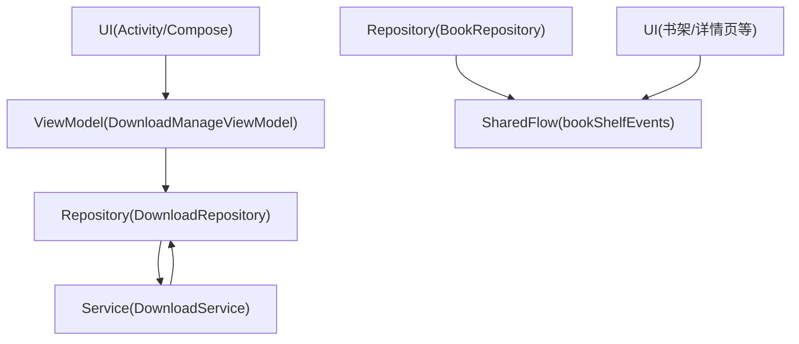
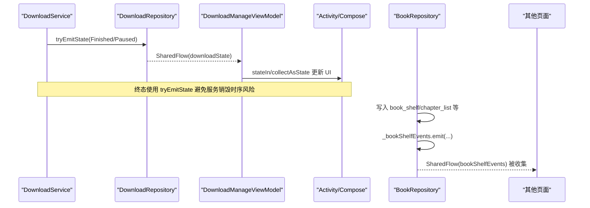
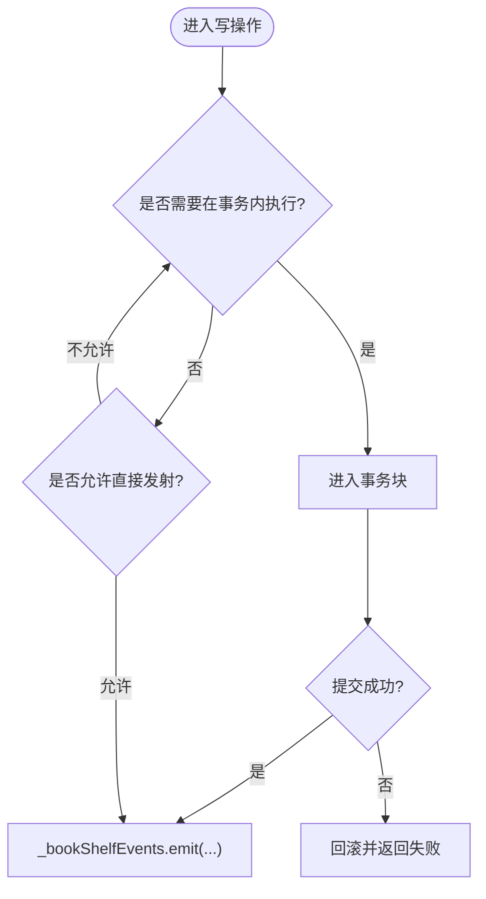
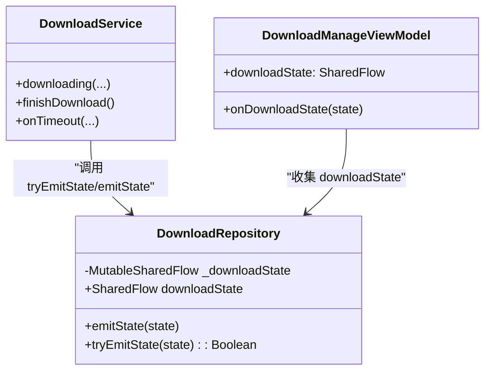
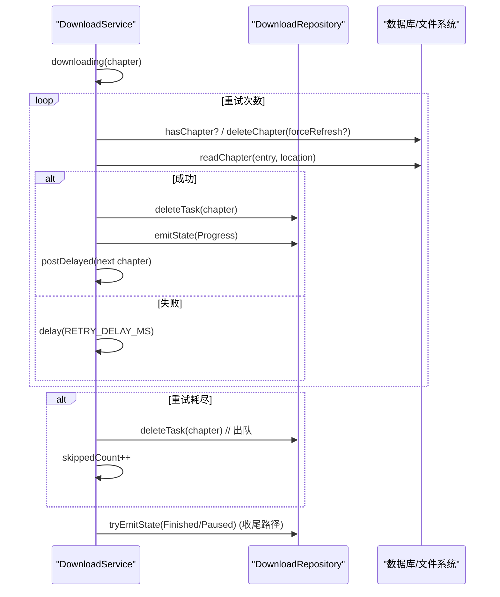
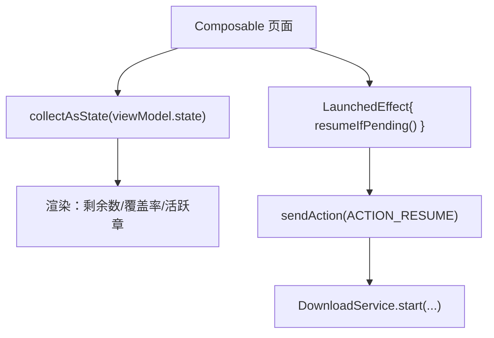
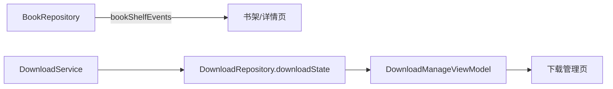

# 事件发射与消费模式

<cite>
**本文引用的文件**   
- [BookRepository.kt](file://lib_book_common/src/main/java/com/ebook/common/repository/BookRepository.kt)
- [DownloadRepository.kt](file://module_book/src/main/java/com/ebook/book/repository/DownloadRepository.kt)
- [DownloadService.kt](file://module_book/src/main/java/com/ebook/book/service/DownloadService.kt)
- [DownloadManageViewModel.kt](file://module_book/src/main/java/com/ebook/book/mvvm/viewmodel/DownloadManageViewModel.kt)
- [DownloadManageActivity.kt](file://module_book/src/main/java/com/ebook/book/DownloadManageActivity.kt)
- [0004-rxbus-to-sharedflow.md](file://docs/adr/0004-rxbus-to-sharedflow.md)
</cite>

## 目录
1. [引言](#引言)
2. [项目结构](#项目结构)
3. [核心组件](#核心组件)
4. [架构总览](#架构总览)
5. [详细组件分析](#详细组件分析)
6. [依赖关系分析](#依赖关系分析)
7. [性能考量](#性能考量)
8. [故障排查指南](#故障排查指南)
9. [结论](#结论)
10. [附录](#附录)

## 引言
本文聚焦项目中基于 Kotlin Coroutines + Flow 的事件发射与消费模式，重点说明：
- BookRepository 在数据操作完成后使用 MutableSharedFlow 发射书架事件；
- DownloadService 通过 DownloadRepository.tryEmitState() 向 UI 推送下载状态；
- ViewModel/Activity 如何订阅并安全消费这些事件（生命周期、背压、内存泄漏防护）；
- 何时发射事件、事务边界、异常处理策略；
- 多订阅者与并发场景下的分发机制；
- 常见模式示例与性能优化建议（批处理、过滤、转换等操作符）。

## 项目结构
本项目采用 MVVM 分层与模块化设计：
- Repository 层负责数据访问与领域事件发射；
- Service（前台服务）负责后台任务执行并通过 Repository 暴露的状态流回传进度；
- ViewModel 聚合数据与命令，将 SharedFlow/StateFlow 暴露给 Compose UI；
- Activity/Compose 页面收集流，结合 stateIn/collectAsState 进行渲染。

图表来源
- [DownloadManageViewModel.kt:120-160](file://module_book/src/main/java/com/ebook/book/mvvm/viewmodel/DownloadManageViewModel.kt#L120-L160)
- [DownloadRepository.kt:53-61](file://module_book/src/main/java/com/ebook/book/repository/DownloadRepository.kt#L53-L61)
- [DownloadService.kt:274-378](file://module_book/src/main/java/com/ebook/book/service/DownloadService.kt#L274-L378)
- [BookRepository.kt:75-77](file://lib_book_common/src/main/java/com/ebook/common/repository/BookRepository.kt#L75-L77)

章节来源
- [DownloadManageViewModel.kt:120-160](file://module_book/src/main/java/com/ebook/book/mvvm/viewmodel/DownloadManageViewModel.kt#L120-L160)
- [DownloadRepository.kt:53-61](file://module_book/src/main/java/com/ebook/book/repository/DownloadRepository.kt#L53-L61)
- [DownloadService.kt:274-378](file://module_book/src/main/java/com/ebook/book/service/DownloadService.kt#L274-L378)
- [BookRepository.kt:75-77](file://lib_book_common/src/main/java/com/ebook/common/repository/BookRepository.kt#L75-L77)

## 核心组件
- BookRepository：封装书架 CRUD、换源、章节同步等，并在关键写操作后通过 MutableSharedFlow<BookShelfEvent> 广播事件。
- DownloadRepository：管理下载队列与“下载状态”共享流（replay=1），提供 emitState()/tryEmitState()。
- DownloadService：前台服务，逐章抓取正文，失败重试，结束后或暂停时通过 Repository 的状态流通知 UI。
- DownloadManageViewModel：组合下载中心所需数据，转发 downloadState 到 UI，并提供开始/暂停/取消动作。

章节来源
- [BookRepository.kt:75-77](file://lib_book_common/src/main/java/com/ebook/common/repository/BookRepository.kt#L75-L77)
- [DownloadRepository.kt:53-61](file://module_book/src/main/java/com/ebook/book/repository/DownloadRepository.kt#L53-L61)
- [DownloadService.kt:274-378](file://module_book/src/main/java/com/ebook/book/service/DownloadService.kt#L274-L378)
- [DownloadManageViewModel.kt:120-160](file://module_book/src/main/java/com/ebook/book/mvvm/viewmodel/DownloadManageViewModel.kt#L120-L160)

## 架构总览
以下序列图展示了“下载完成/暂停/进行中”从 Service → Repository → ViewModel → UI 的完整链路，以及“书架事件”从 Repository → UI 的发布订阅。

图表来源
- [DownloadService.kt:646-666](file://module_book/src/main/java/com/ebook/book/service/DownloadService.kt#L646-L666)
- [DownloadRepository.kt:275-288](file://module_book/src/main/java/com/ebook/book/repository/DownloadRepository.kt#L275-L288)
- [DownloadManageViewModel.kt:120-160](file://module_book/src/main/java/com/ebook/book/mvvm/viewmodel/DownloadManageViewModel.kt#L120-L160)
- [BookRepository.kt:135-146](file://lib_book_common/src/main/java/com/ebook/common/repository/BookRepository.kt#L135-L146)
- [BookRepository.kt:418-432](file://lib_book_common/src/main/java/com/ebook/common/repository/BookRepository.kt#L418-L432)

## 详细组件分析

### BookRepository：书架事件的发射点
- 事件通道：_bookShelfEvents 为 MutableSharedFlow<BookShelfEvent>，暴露只读 SharedFlow。
- 发射时机：
  - saveProgress/addToShelf/removeFromShelf 等写操作成功后立即发射对应事件；
  - switchSource 提交成功后，先 Removed(old) 再 Added(new)，保证依赖事件的 UI 不会出现重复书快照；
  - syncChaptersFromSource 仅在“追加成功”时发射 ChaptersUpdated（分叉不发，因为库未变更）。
- 事务边界：
  - 所有事件均在写事务提交之后发射，确保“未提交的写不是事实”，避免下游收到不一致快照。
- 错误处理：
  - 解析/网络异常集中在 switchSource/syncChaptersFromSource 返回 Result/ChapterSyncResult，不抛到调用方；
  - 取消异常按原样上抛，避免把“取消”误判为业务失败。

图表来源
- [BookRepository.kt:135-146](file://lib_book_common/src/main/java/com/ebook/common/repository/BookRepository.kt#L135-L146)
- [BookRepository.kt:193-201](file://lib_book_common/src/main/java/com/ebook/common/repository/BookRepository.kt#L193-L201)
- [BookRepository.kt:292-339](file://lib_book_common/src/main/java/com/ebook/common/repository/BookRepository.kt#L292-L339)
- [BookRepository.kt:418-432](file://lib_book_common/src/main/java/com/ebook/common/repository/BookRepository.kt#L418-L432)
- [BookRepository.kt:512-599](file://lib_book_common/src/main/java/com/ebook/common/repository/BookRepository.kt#L512-L599)

章节来源
- [BookRepository.kt:75-77](file://lib_book_common/src/main/java/com/ebook/common/repository/BookRepository.kt#L75-L77)
- [BookRepository.kt:135-146](file://lib_book_common/src/main/java/com/ebook/common/repository/BookRepository.kt#L135-L146)
- [BookRepository.kt:193-201](file://lib_book_common/src/main/java/com/ebook/common/repository/BookRepository.kt#L193-L201)
- [BookRepository.kt:292-339](file://lib_book_common/src/main/java/com/ebook/common/repository/BookRepository.kt#L292-L339)
- [BookRepository.kt:418-432](file://lib_book_common/src/main/java/com/ebook/common/repository/BookRepository.kt#L418-L432)
- [BookRepository.kt:512-599](file://lib_book_common/src/main/java/com/ebook/common/repository/BookRepository.kt#L512-L599)

### DownloadRepository：下载状态流与 tryEmitState
- 事件通道：downloadState 为 SharedFlow<DownloadState>(replay=1)，缓冲容量 extraBufferCapacity=64。
- 发射方式：
  - emitState：常规协程路径中使用，挂起发射；
  - tryEmitState：服务收尾路径（超时、前台不可用、取消/完成）使用，非挂起，避免与服务销毁时序竞态。
- 设计要点：
  - replay=1 保障晚开页面（如下载中心）能立刻对齐当前进度；
  - 服务终态必须发送 Finished，防止旧 Progress 被回放成“幽灵进度”。

图表来源
- [DownloadRepository.kt:53-61](file://module_book/src/main/java/com/ebook/book/repository/DownloadRepository.kt#L53-L61)
- [DownloadRepository.kt:275-288](file://module_book/src/main/java/com/ebook/book/repository/DownloadRepository.kt#L275-L288)
- [DownloadService.kt:274-378](file://module_book/src/main/java/com/ebook/book/service/DownloadService.kt#L274-L378)
- [DownloadManageViewModel.kt:120-160](file://module_book/src/main/java/com/ebook/book/mvvm/viewmodel/DownloadManageViewModel.kt#L120-L160)

章节来源
- [DownloadRepository.kt:53-61](file://module_book/src/main/java/com/ebook/book/repository/DownloadRepository.kt#L53-L61)
- [DownloadRepository.kt:275-288](file://module_book/src/main/java/com/ebook/book/repository/DownloadRepository.kt#L275-L288)
- [DownloadService.kt:274-378](file://module_book/src/main/java/com/ebook/book/service/DownloadService.kt#L274-L378)
- [DownloadManageViewModel.kt:120-160](file://module_book/src/main/java/com/ebook/book/mvvm/viewmodel/DownloadManageViewModel.kt#L120-L160)

### DownloadService：并发下载与事件回传
- 单章抓取循环：
  - 最多重试 RETRY_TIMES 次，每次间隔 RETRY_DELAY_MS；
  - 强制刷新时先删除旧章文件并失效内容缓存；
  - 空正文视为失败，走重试与出队；
  - 失败耗尽才出队并计数 skippedCount，避免阻塞后续章节。
- 事件回传：
  - 每章开始时 emitState(Progress)；
  - 暂停/完成/超时等终态使用 tryEmitState，确保在服务停止前落盘 replay 缓冲。
- 并发与节流：
  - 章节间延迟 CHAPTER_INTERVAL_MS，降低对源站压力；
  - Handler 调度下一章节，配合 isStartDownload 控制暂停/继续。

图表来源
- [DownloadService.kt:274-378](file://module_book/src/main/java/com/ebook/book/service/DownloadService.kt#L274-L378)
- [DownloadService.kt:646-666](file://module_book/src/main/java/com/ebook/book/service/DownloadService.kt#L646-L666)
- [DownloadRepository.kt:275-288](file://module_book/src/main/java/com/ebook/book/repository/DownloadRepository.kt#L275-L288)

章节来源
- [DownloadService.kt:274-378](file://module_book/src/main/java/com/ebook/book/service/DownloadService.kt#L274-L378)
- [DownloadService.kt:646-666](file://module_book/src/main/java/com/ebook/book/service/DownloadService.kt#L646-L666)

### ViewModel/Activity：事件消费与生命周期管理
- ViewModel 暴露 StateFlow/SharedFlow 供 Compose 消费：
  - remainingCount 使用 stateIn(WhileSubscribed) 自动在离开时停止查库；
  - downloadState 由页面收集并驱动 activeChapter 高亮。
- Activity/Compose 侧：
  - collectAsState 用于响应式渲染；
  - LaunchedEffect 触发一次性逻辑（如打开页面时自动续跑）。

图表来源
- [DownloadManageViewModel.kt:148-156](file://module_book/src/main/java/com/ebook/book/mvvm/viewmodel/DownloadManageViewModel.kt#L148-L156)
- [DownloadManageViewModel.kt:200-228](file://module_book/src/main/java/com/ebook/book/mvvm/viewmodel/DownloadManageViewModel.kt#L200-L228)
- [DownloadManageActivity.kt:69-74](file://module_book/src/main/java/com/ebook/book/DownloadManageActivity.kt#L69-L74)

章节来源
- [DownloadManageViewModel.kt:148-156](file://module_book/src/main/java/com/ebook/book/mvvm/viewmodel/DownloadManageViewModel.kt#L148-L156)
- [DownloadManageViewModel.kt:200-228](file://module_book/src/main/java/com/ebook/book/mvvm/viewmodel/DownloadManageViewModel.kt#L200-L228)
- [DownloadManageActivity.kt:69-74](file://module_book/src/main/java/com/ebook/book/DownloadManageActivity.kt#L69-L74)

## 依赖关系分析
- BookRepository 对外暴露 bookShelfEvents；下游（书架页、详情页等）订阅以维持本地快照或触发重查。
- DownloadService 通过 DownloadRepository 暴露的 downloadState 统一向 UI 推送状态；ViewModel 仅做转发与少量状态计算。
- 模块间解耦：Service 不直接持有 UI 引用，仅通过 Repository 的流通信；ViewModel 不持有 Service 引用，通过 Intent 发起控制动作。

图表来源
- [BookRepository.kt:75-77](file://lib_book_common/src/main/java/com/ebook/common/repository/BookRepository.kt#L75-L77)
- [DownloadRepository.kt:53-61](file://module_book/src/main/java/com/ebook/book/repository/DownloadRepository.kt#L53-L61)
- [DownloadManageViewModel.kt:120-160](file://module_book/src/main/java/com/ebook/book/mvvm/viewmodel/DownloadManageViewModel.kt#L120-L160)

章节来源
- [BookRepository.kt:75-77](file://lib_book_common/src/main/java/com/ebook/common/repository/BookRepository.kt#L75-L77)
- [DownloadRepository.kt:53-61](file://module_book/src/main/java/com/ebook/book/repository/DownloadRepository.kt#L53-L61)
- [DownloadManageViewModel.kt:120-160](file://module_book/src/main/java/com/ebook/book/mvvm/viewmodel/DownloadManageViewModel.kt#L120-L160)

## 性能考量
- 背压与缓冲：
  - SharedFlow(extraBufferCapacity=64) 可容纳短时突发事件；下载终态使用 tryEmitState 避免阻塞。
- 批处理与节流：
  - 下载章节间延迟 CHAPTER_INTERVAL_MS，降低远端压力；
  - 目录重抓限频窗口 by final_refresh_data，避免频繁请求。
- 过滤与转换：
  - observeBookShelf() 对关联结果 mapNotNull 过滤孤立条目；
  - 下载中心分组聚合在 ViewModel 中合并缓存/队列事实，减少 UI 层计算。
- 内存与生命周期：
  - stateIn(WhileSubscribed) 在页面不可见时停止查库；
  - LaunchedEffect 与 Job 管理确保取消及时，避免脏写。

章节来源
- [DownloadRepository.kt:53-61](file://module_book/src/main/java/com/ebook/book/repository/DownloadRepository.kt#L53-L61)
- [DownloadService.kt:668-677](file://module_book/src/main/java/com/ebook/book/service/DownloadService.kt#L668-L677)
- [BookRepository.kt:93-100](file://lib_book_common/src/main/java/com/ebook/common/repository/BookRepository.kt#L93-L100)
- [DownloadManageViewModel.kt:148-156](file://module_book/src/main/java/com/ebook/book/mvvm/viewmodel/DownloadManageViewModel.kt#L148-L156)

## 故障排查指南
- 事件未生效：
  - 检查是否在写事务提交后才发射事件；
  - 确认 SharedFlow 已正确暴露并被订阅。
- 下载状态不同步：
  - 确认 Service 收尾路径使用 tryEmitState；
  - 检查 replay=1 是否被覆盖导致丢失最新状态。
- 下载阻塞：
  - 失败章必须在重试耗尽后出队；
  - 检查 paused 标记是否正确设置/清除。
- 通知与前台配额：
  - dataSync 配额用尽会回调 onTimeout，需尽快 stopSelf；
  - 前台不可用时应提示用户并终止自动续跑。

章节来源
- [DownloadService.kt:115-124](file://module_book/src/main/java/com/ebook/book/service/DownloadService.kt#L115-L124)
- [DownloadService.kt:176-205](file://module_book/src/main/java/com/ebook/book/service/DownloadService.kt#L176-L205)
- [DownloadRepository.kt:275-288](file://module_book/src/main/java/com/ebook/book/repository/DownloadRepository.kt#L275-L288)
- [BookRepository.kt:292-339](file://lib_book_common/src/main/java/com/ebook/common/repository/BookRepository.kt#L292-L339)

## 结论
本项目通过 SharedFlow 实现了清晰的事件总线与状态流：
- BookRepository 在关键写操作后发射书架事件，确保 UI 与数据库一致性；
- DownloadService 通过 DownloadRepository 的状态流可靠地回传下载状态，使用 tryEmitState 规避服务销毁时序问题；
- ViewModel/Activity 借助 stateIn/collectAsState 实现安全高效的订阅与渲染；
- 结合限频、批处理、过滤与生命周期管理，整体具备良好的性能与健壮性。

## 附录

### 最佳实践清单
- 何时发射事件：
  - 写事务提交成功后；
  - 数据变更后下游需要感知且无副作用的路径。
- 事务边界：
  - 禁止在事务内发射事件（避免未提交写被广播）；
  - 分支过多时集中处理事件发射位置。
- 异常处理：
  - 区分取消异常与业务异常；
  - 静默路径（自动检查）返回 Result/枚举而非抛出。
- 并发与背压：
  - 合理设置 extraBufferCapacity；
  - 终态使用 tryEmitState；
  - 章节间延迟与重试退避。

章节来源
- [BookRepository.kt:292-339](file://lib_book_common/src/main/java/com/ebook/common/repository/BookRepository.kt#L292-L339)
- [BookRepository.kt:512-599](file://lib_book_common/src/main/java/com/ebook/common/repository/BookRepository.kt#L512-L599)
- [DownloadRepository.kt:275-288](file://module_book/src/main/java/com/ebook/book/repository/DownloadRepository.kt#L275-L288)
- [DownloadService.kt:274-378](file://module_book/src/main/java/com/ebook/book/service/DownloadService.kt#L274-L378)

### 常见模式示例（以代码片段路径引用）
- 一次性事件：
  - 书架添加/移除/进度更新：[BookRepository.kt:135-146](file://lib_book_common/src/main/java/com/ebook/common/repository/BookRepository.kt#L135-L146)
- 持续流事件：
  - 下载进度/暂停/完成：[DownloadRepository.kt:53-61](file://module_book/src/main/java/com/ebook/book/repository/DownloadRepository.kt#L53-L61), [DownloadService.kt:274-378](file://module_book/src/main/java/com/ebook/book/service/DownloadService.kt#L274-L378)
- 错误事件：
  - 目录重抓失败返回 ChapterSyncResult.Failed：[BookRepository.kt:512-599](file://lib_book_common/src/main/java/com/ebook/common/repository/BookRepository.kt#L512-L599)
- 消费模式：
  - stateIn(WhileSubscribed) 观察剩余数：[DownloadManageViewModel.kt:148-156](file://module_book/src/main/java/com/ebook/book/mvvm/viewmodel/DownloadManageViewModel.kt#L148-L156)
  - collectAsState 消费 ViewModel 暴露的流：[DownloadManageActivity.kt:69-74](file://module_book/src/main/java/com/ebook/book/DownloadManageActivity.kt#L69-L74)

章节来源
- [BookRepository.kt:135-146](file://lib_book_common/src/main/java/com/ebook/common/repository/BookRepository.kt#L135-L146)
- [DownloadRepository.kt:53-61](file://module_book/src/main/java/com/ebook/book/repository/DownloadRepository.kt#L53-L61)
- [DownloadService.kt:274-378](file://module_book/src/main/java/com/ebook/book/service/DownloadService.kt#L274-L378)
- [DownloadManageViewModel.kt:148-156](file://module_book/src/main/java/com/ebook/book/mvvm/viewmodel/DownloadManageViewModel.kt#L148-L156)
- [DownloadManageActivity.kt:69-74](file://module_book/src/main/java/com/ebook/book/DownloadManageActivity.kt#L69-L74)