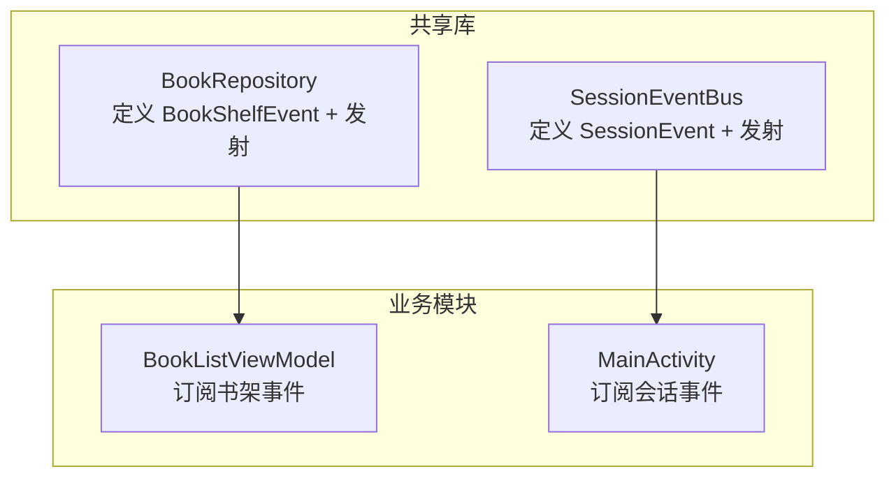
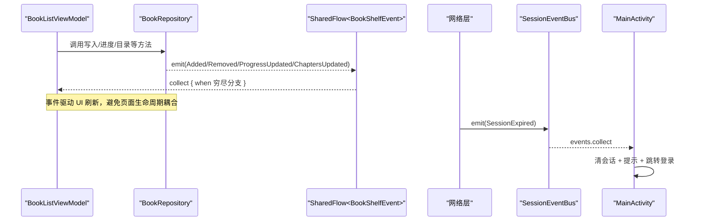
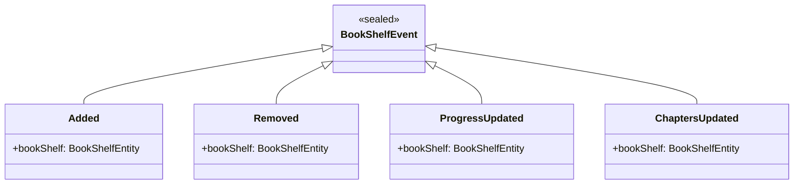
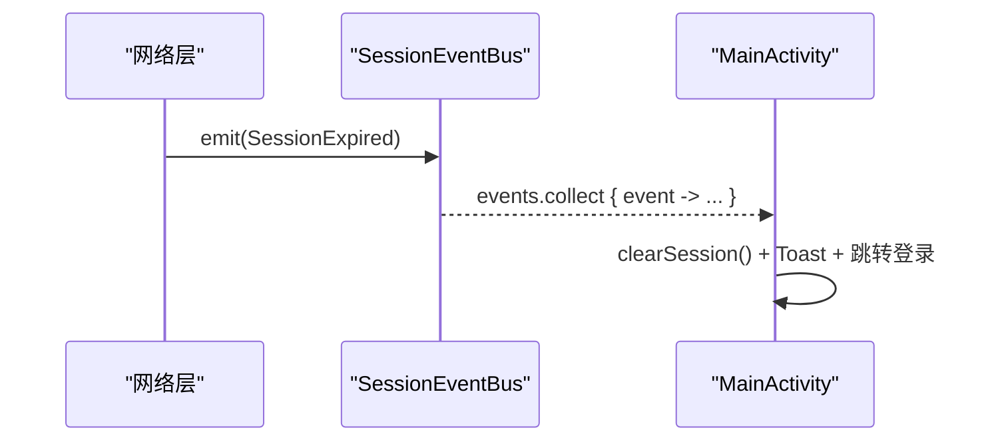
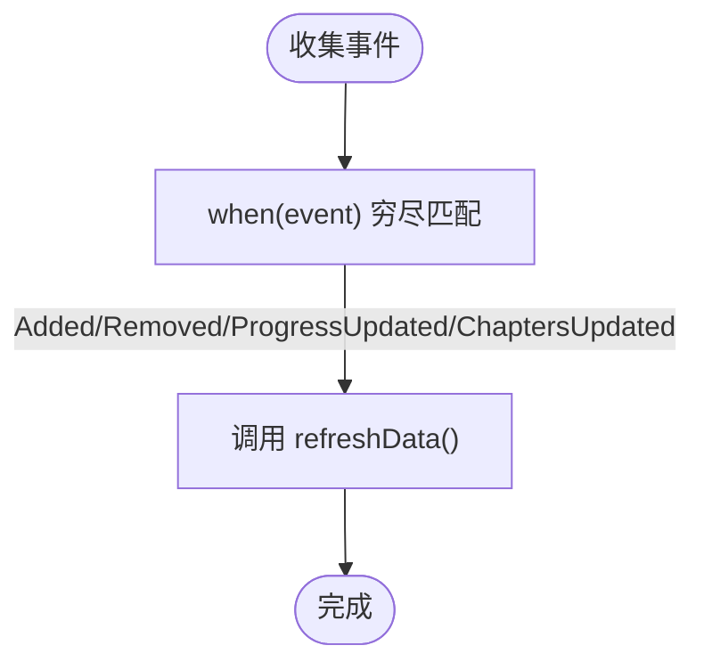
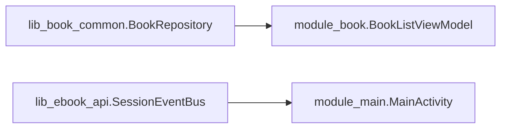

# 事件定义与类型设计

<cite>
**本文引用的文件**
- [BookRepository.kt](file://lib_book_common/src/main/java/com/ebook/common/repository/BookRepository.kt)
- [SessionEventBus.kt](file://lib_ebook_api/src/main/java/com/ebook/api/auth/SessionEventBus.kt)
- [0004-rxbus-to-sharedflow.md](file://docs/adr/0004-rxbus-to-sharedflow.md)
- [0010-silent-refresh-seam-and-session-expiry-bus.md](file://docs/adr/0010-silent-refresh-seam-and-session-expiry-bus.md)
- [BookListViewModel.kt](file://module_book/src/main/java/com/ebook/book/mvvm/viewmodel/BookListViewModel.kt)
- [MainActivity.kt](file://module_main/src/main/java/com/ebook/main/MainActivity.kt)
</cite>

## 目录
1. [引言](#引言)
2. [项目结构](#项目结构)
3. [核心组件](#核心组件)
4. [架构总览](#架构总览)
5. [详细组件分析](#详细组件分析)
6. [依赖关系分析](#依赖关系分析)
7. [性能考量](#性能考量)
8. [故障排查指南](#故障排查指南)
9. [结论](#结论)

## 引言
本文聚焦于项目中基于 SharedFlow 的事件体系，重点阐述两类事件：
- BookShelfEvent：书架领域事件的密封类，包含 Added、Removed、ProgressUpdated、ChaptersUpdated 四种事件。
- SessionEvent：会话级全局事件，当前仅包含 SessionExpired（会话过期）。

这些事件以 Kotlin sealed class 作为类型总体，通过 MutableSharedFlow 在仓库层或网络层发射，由上层 ViewModel/Activity 订阅并消费，实现跨模块、可编译期校验的响应式通信。本文同时解释事件命名约定、版本兼容策略、扩展方式以及去重与幂等性保证。

## 项目结构
- 书架事件定义与发布位于 lib_book_common 的 BookRepository 中，统一封装书架 CRUD、阅读进度保存、章节正文读取、目录重抓等业务，并在关键写操作后发射对应事件。
- 会话事件定义与总线位于 lib_ebook_api 的 SessionEventBus 中，网络层在刷新失败时发射 SessionExpired，主界面 MainActivity 订阅并执行清会话、提示与跳转登录的统一处置。
- 消费侧：
  - BookListViewModel 订阅 BookRepository.bookShelfEvents，对 Added/Removed/ProgressUpdated/ChaptersUpdated 进行穷尽 when 处理，触发数据刷新。
  - MainActivity 订阅 SessionEventBus.events，对 SessionExpired 做统一处置。

图表来源
- [BookRepository.kt:75-77](file://lib_book_common/src/main/java/com/ebook/common/repository/BookRepository.kt#L75-L77)
- [SessionEventBus.kt:30-44](file://lib_ebook_api/src/main/java/com/ebook/api/auth/SessionEventBus.kt#L30-L44)
- [BookListViewModel.kt:36-52](file://module_book/src/main/java/com/ebook/book/mvvm/viewmodel/BookListViewModel.kt#L36-L52)
- [MainActivity.kt:68-80](file://module_main/src/main/java/com/ebook/main/MainActivity.kt#L68-L80)

章节来源
- [BookRepository.kt:75-77](file://lib_book_common/src/main/java/com/ebook/common/repository/BookRepository.kt#L75-L77)
- [SessionEventBus.kt:30-44](file://lib_ebook_api/src/main/java/com/ebook/api/auth/SessionEventBus.kt#L30-L44)

## 核心组件
- BookShelfEvent 密封类：用于表达书架域内的变化，具体子类型包括：
  - Added：书籍添加到书架
  - Removed：书籍从书架移除
  - ProgressUpdated：阅读进度更新
  - ChaptersUpdated：目录追加了新章（非下载正文）
- SessionEvent 密封类：会话级全局事件，当前仅有：
  - SessionExpired：refresh token 刷新失败，会话不可恢复

章节来源
- [BookRepository.kt:870-892](file://lib_book_common/src/main/java/com/ebook/common/repository/BookRepository.kt#L870-L892)
- [SessionEventBus.kt:9-20](file://lib_ebook_api/src/main/java/com/ebook/api/auth/SessionEventBus.kt#L9-L20)

## 架构总览
书架事件与会话事件分别由不同模块负责发射，采用 SharedFlow 作为事件通道，遵循“仓库/网络层发射、上层订阅”的分层原则：
- 书架事件：由 BookRepository 在写操作后发射，确保事件语义与持久化一致（提交成功后才广播）。
- 会话事件：由 SessionEventBus 在网络层刷新失败时发射，集中到主界面做统一处置。

图表来源
- [BookRepository.kt:135-146](file://lib_book_common/src/main/java/com/ebook/common/repository/BookRepository.kt#L135-L146)
- [BookRepository.kt:193-201](file://lib_book_common/src/main/java/com/ebook/common/repository/BookRepository.kt#L193-L201)
- [BookRepository.kt:595-597](file://lib_book_common/src/main/java/com/ebook/common/repository/BookRepository.kt#L595-L597)
- [SessionEventBus.kt:30-44](file://lib_ebook_api/src/main/java/com/ebook/api/auth/SessionEventBus.kt#L30-L44)
- [BookListViewModel.kt:36-52](file://module_book/src/main/java/com/ebook/book/mvvm/viewmodel/BookListViewModel.kt#L36-L52)
- [MainActivity.kt:68-80](file://module_main/src/main/java/com/ebook/main/MainActivity.kt#L68-L80)

## 详细组件分析

### BookShelfEvent 事件模型与语义
- 设计目标：用 sealed class 表达书架变化的所有可能状态，新增事件类型会在所有消费方产生编译错误，从而杜绝静默漏收。
- 事件类型与触发时机：
  - Added：addToShelf 成功后发射，表示新条目加入书架。
  - Removed：removeFromShelf 成功后发射，表示条目及其关联数据被清理。
  - ProgressUpdated：saveProgress 成功后发射，表示阅读进度变更。
  - ChaptersUpdated：syncChaptersFromSource 成功追加新章后发射，表示目录变长（未下载正文）。
- 携带数据结构：每种事件均携带 BookShelfEntity，以便消费方识别具体条目并进行差异化处理。
- 事件顺序与并发：
  - switchSource 路径先发 Removed(old) 再发 Added(new)，使内存快照维护者不会瞬间看到同一作品的重复条目。
- 事件与事务一致性：
  - 仅在写事务提交成功后才发射事件，未提交的写不是事实源，避免事件误导消费方。

图表来源
- [BookRepository.kt:870-892](file://lib_book_common/src/main/java/com/ebook/common/repository/BookRepository.kt#L870-L892)

章节来源
- [BookRepository.kt:135-146](file://lib_book_common/src/main/java/com/ebook/common/repository/BookRepository.kt#L135-L146)
- [BookRepository.kt:193-201](file://lib_book_common/src/main/java/com/ebook/common/repository/BookRepository.kt#L193-L201)
- [BookRepository.kt:595-597](file://lib_book_common/src/main/java/com/ebook/common/repository/BookRepository.kt#L595-L597)
- [BookRepository.kt:418-432](file://lib_book_common/src/main/java/com/ebook/common/repository/BookRepository.kt#L418-L432)

### SessionEvent 会话过期事件
- 设计目标：将 access token 过期且 refresh 失败的复杂逻辑下沉到网络层，统一通过 SharedFlow 发射，UI 层只做幂等处置。
- 事件类型：SessionExpired，表示会话不可恢复，需要清会话、提示用户并跳转登录。
- 发射点：网络层在刷新失败时调用 SessionEventBus.emit(SessionExpired)。
- 订阅与处置：MainActivity 订阅 events，执行 clearSession()、Toast 提示与 TheRouter 跳转登录页。

图表来源
- [SessionEventBus.kt:9-20](file://lib_ebook_api/src/main/java/com/ebook/api/auth/SessionEventBus.kt#L9-L20)
- [SessionEventBus.kt:30-44](file://lib_ebook_api/src/main/java/com/ebook/api/auth/SessionEventBus.kt#L30-L44)
- [MainActivity.kt:68-80](file://module_main/src/main/java/com/ebook/main/MainActivity.kt#L68-L80)

章节来源
- [SessionEventBus.kt:9-20](file://lib_ebook_api/src/main/java/com/ebook/api/auth/SessionEventBus.kt#L9-L20)
- [SessionEventBus.kt:30-44](file://lib_ebook_api/src/main/java/com/ebook/api/auth/SessionEventBus.kt#L30-L44)
- [MainActivity.kt:68-80](file://module_main/src/main/java/com/ebook/main/MainActivity.kt#L68-L80)

### 事件消费与穷尽匹配
- 消费方使用 when 穷尽匹配所有子类型，新增事件类型会强制更新所有消费处，避免运行时 filterIsInstance 的遗漏风险。
- BookListViewModel 在 init 中收集 bookShelfEvents，并对 Added/Removed/ProgressUpdated/ChaptersUpdated 统一触发 refreshData()，实现事件驱动的 UI 刷新。

图表来源
- [BookListViewModel.kt:36-52](file://module_book/src/main/java/com/ebook/book/mvvm/viewmodel/BookListViewModel.kt#L36-L52)

章节来源
- [BookListViewModel.kt:36-52](file://module_book/src/main/java/com/ebook/book/mvvm/viewmodel/BookListViewModel.kt#L36-L52)

## 依赖关系分析
- 事件定义与发射位置：
  - BookShelfEvent 定义与发射在 lib_book_common 的 BookRepository。
  - SessionEvent 定义与发射在 lib_ebook_api 的 SessionEventBus。
- 订阅位置：
  - BookListViewModel（module_book）订阅书架事件。
  - MainActivity（module_main）订阅会话事件。
- 依赖方向符合分层：下层（仓库/网络）不感知上层 UI，上层通过注入获取事件流并订阅。

图表来源
- [BookRepository.kt:75-77](file://lib_book_common/src/main/java/com/ebook/common/repository/BookRepository.kt#L75-L77)
- [SessionEventBus.kt:30-44](file://lib_ebook_api/src/main/java/com/ebook/api/auth/SessionEventBus.kt#L30-L44)
- [BookListViewModel.kt:36-52](file://module_book/src/main/java/com/ebook/book/mvvm/viewmodel/BookListViewModel.kt#L36-L52)
- [MainActivity.kt:68-80](file://module_main/src/main/java/com/ebook/main/MainActivity.kt#L68-L80)

章节来源
- [BookRepository.kt:75-77](file://lib_book_common/src/main/java/com/ebook/common/repository/BookRepository.kt#L75-L77)
- [SessionEventBus.kt:30-44](file://lib_ebook_api/src/main/java/com/ebook/api/auth/SessionEventBus.kt#L30-L44)

## 性能考量
- 背压与缓冲：
  - BookShelfEvent 使用 extraBufferCapacity = 64，适用于瞬时并发场景下的缓冲，避免丢失短期事件。
  - SessionEvent 使用 extraBufferCapacity = 1，结合 tryEmit，允许丢弃重复过期事件，绝不阻塞请求线程。
- 幂等性与去重：
  - 会话过期处置是幂等的（清会话 + 提示 + 跳转），并发风暴时可丢弃重复事件，不影响最终结果。
  - 书架事件在事务提交后发射，保证事件与事实源一致；switchSource 顺序为 Removed(old) → Added(new)，防止内存快照短暂出现重复条目。
- 资源与开销：
  - 事件消费集中在 ViewModel/Activity，避免在 Activity 层直接收集导致生命周期耦合与重复累积。
  - 目录重抓成功仅追加新章，不失效已有缓存，减少不必要的重算与 IO。

[本节提供通用指导，不直接分析具体文件]

## 故障排查指南
- 事件未触发：
  - 检查相关写操作是否进入事务并提交成功（如 switchSource、syncChaptersFromSource）。
  - 确认事件发射点是否在正确的路径（例如只在追加成功时发射 ChaptersUpdated，分叉不发）。
- 消费方未响应：
  - 确认 ViewModel/Activity 是否正确订阅 SharedFlow，并使用穷尽 when 覆盖所有子类型。
  - 检查 viewModelScope/lifecycleScope 的取消行为，避免过早取消导致事件丢失。
- 会话过期未处理：
  - 确认 SessionEventBus 是否在网络层刷新失败时发射 SessionExpired。
  - 确认 MainActivity 是否正确订阅 events 并执行清会话、提示与跳转。

章节来源
- [BookRepository.kt:418-432](file://lib_book_common/src/main/java/com/ebook/common/repository/BookRepository.kt#L418-L432)
- [BookRepository.kt:595-597](file://lib_book_common/src/main/java/com/ebook/common/repository/BookRepository.kt#L595-L597)
- [SessionEventBus.kt:30-44](file://lib_ebook_api/src/main/java/com/ebook/api/auth/SessionEventBus.kt#L30-L44)
- [MainActivity.kt:68-80](file://module_main/src/main/java/com/ebook/main/MainActivity.kt#L68-L80)

## 结论
本项目采用 SharedFlow + sealed class 构建事件体系，具备以下优势：
- 编译期安全：新增事件类型会强制更新所有消费方，避免静默漏收。
- 类型穷举匹配：when 穷尽分支确保每个事件都有明确的处理路径。
- 可扩展性：通过增加 sealed class 的子类型即可扩展事件，无需修改现有消费逻辑之外的其他代码。
- 幂等与去重：会话过期事件采用 tryEmit + 小缓冲，允许丢弃重复事件，保障系统稳定。
- 版本兼容：事件模型向后兼容，新增事件不影响旧版本消费方（但需在上层补齐穷尽分支以避免编译错误）。

建议：
- 新增事件时，优先评估是否属于当前领域（书架/会话），并确保携带的数据足够支撑消费方的处理。
- 对于高频事件，考虑合适的缓冲容量与去重策略，避免阻塞或过度消耗资源。
- 保持事件与事务的一致性，仅在提交成功后发射事件，确保消费方拿到的是事实。